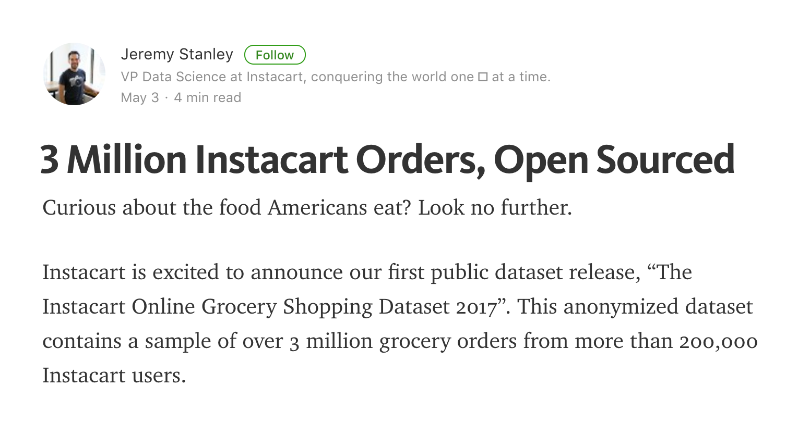
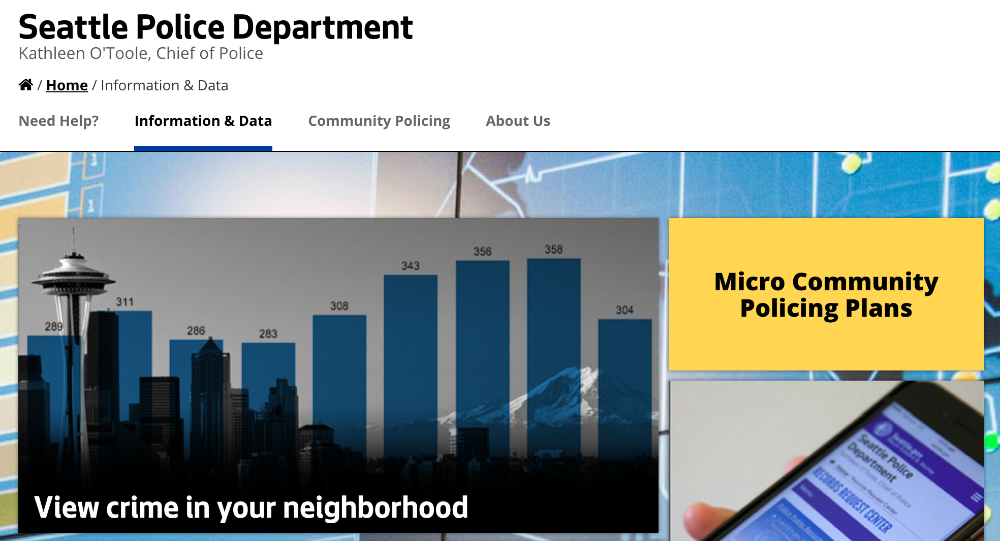
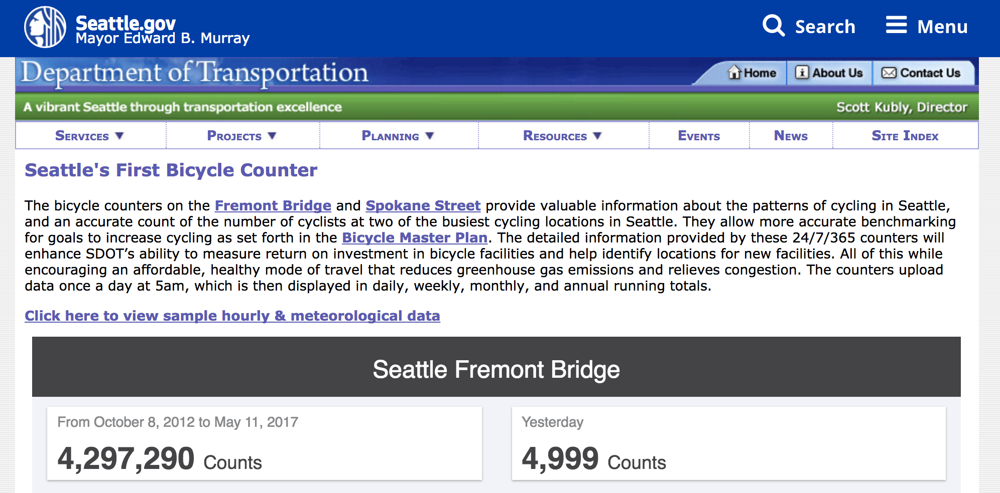
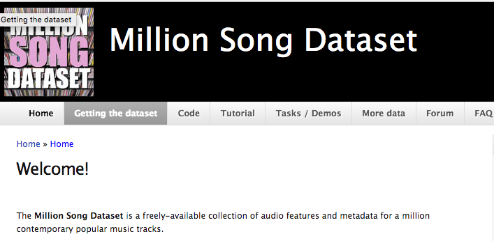

```{r setup, include=FALSE}
knitr::opts_chunk$set(echo = TRUE)
```

# Check out these datasets!

## Instacart dataset
[](https://tech.instacart.com/3-million-instacart-orders-open-sourced-d40d29ead6f2)
(Food recommender system?  Predict when next given item is eaten?)

## Seattle Police Department 
[](https://www.seattle.gov/police/information-and-data)
(Minority Report?  Predict Crime Level Trends for Neighborhood? )


## Seattle Dept. of Trans. 
### Fremont Bridge Bike Traffic
[](http://www.seattle.gov/transportation/bikecounter_fremont.htm)
(Seems like a simple linear model with seasonal bias... what about holidays?)

## Million Song Dataset
[](https://labrosa.ee.columbia.edu/millionsong/)
(Recommender System, Predict Genre Class)

