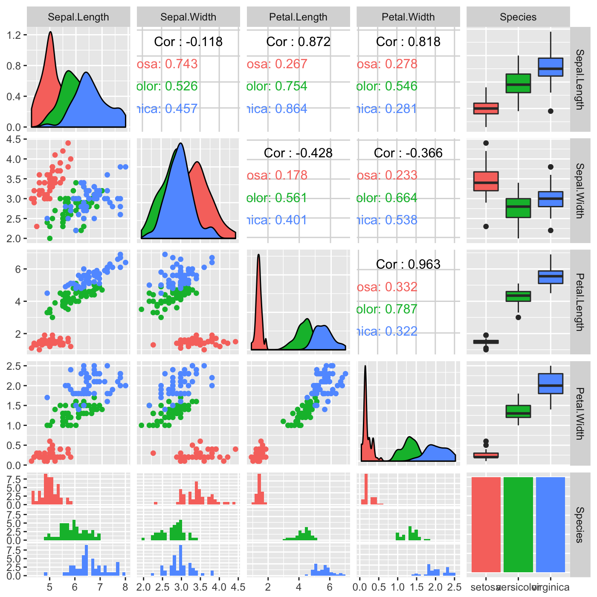
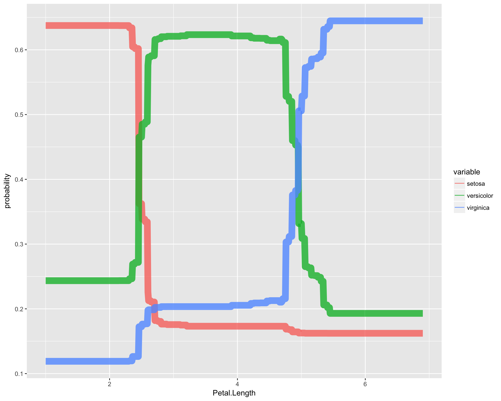
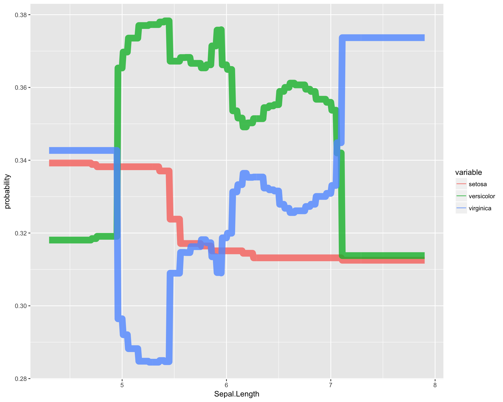
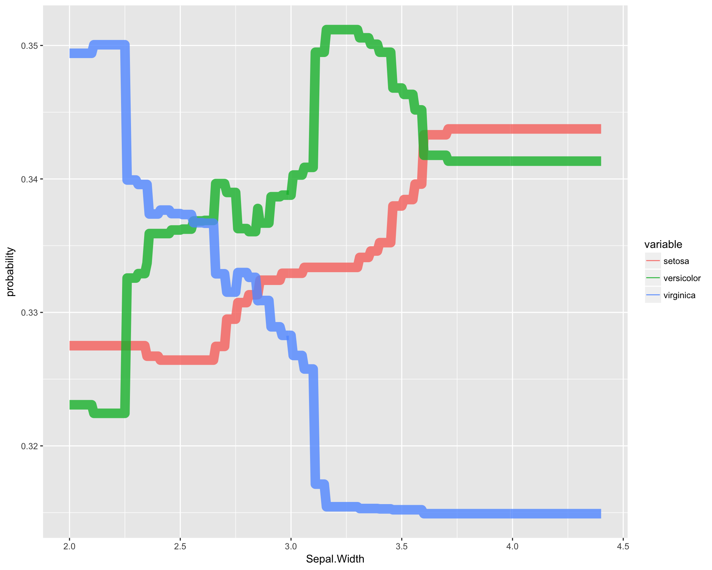

Applied Machine Learning 410
========================================================
css: ../../assets/style/uw.css
author: Justin Donaldson
date: April - Some time around then I guess
autosize: true

Decision Trees and Random Forests
---------------------------------
(AKA: divide and concur)


A Random Forest
===================
(Question - Is it Fall Yet?)
---------------

<a title="Daniel Case at the English language Wikipedia [GFDL (http://www.gnu.org/copyleft/fdl.html) or CC-BY-SA-3.0 (http://creativecommons.org/licenses/by-sa/3.0/)], via Wikimedia Commons" href="https://commons.wikimedia.org/wiki/File%3ABlack_Rock_Forest_view_from_NE.jpg"></a>

Black Rock Forest view from NE - Daniel Case

Overview
========
type:sub-section

* Why Random Forests?
* Why Decision Trees?
* Recap of Decision Trees
* Recap of Random Forests

Why Random Forests?
===================
type: section


Why Random Forests?
===================

***
Comparison of:
-------------

- Support Vector Machines
- Artificial Neural Networks
- Logistic Regression
- Naive Bayes
- K-Nearest Neighbors
- Random Forests
- Bagged Decision Trees
- Boosted Stumps
- Boosted Trees
- Perceptrons

Why Random Forests?
===================
Evaluation Data Sets:
--------------------
- Sturn, Calam : Ornithology
- Digits : MNIST handwritten
- Tis : mRNA translation sites
- Cryst : Protein Crystallography
- KDD98 : Donation Prediction
- R-S : Usenet real/simulation
- Cite : Paper Authorship
- Dse : Newswire
- Spam : TREC spam corpora
- Imdb : link prediction

***

Error Metrics:
-------------
- AUC : Area under curve
- ACC : Accuracy
- RMS : Root Mean Squared Error


Why are Random Forests useful?
==============================
Conclusions
-----------
- Boosted decision trees performed best when < 4000 dimensions
- Random forests performed best when > 4000
  - Easy to parellize
  - Scales efficiently to high dimensions
  - Performs consistently well on all three metrics
- Non-linear methods do well when model complexity is constrained
- Worst performing models : Naive Bayes and Perceptrons

Why are Random Forests are a Solid First Choice?
================================================
- Handle boolean, categorical, numeric features with no scaling or factorization
- No fussy hyperparameters (forest size  is commonly sqrt(#features))
- Automatic feature selection (within reason)
- Quick to train, parallelizable
- Resistant (somewhat) to overfitting
- OOB error metric can substitute for CV


What are Random Forest Drawbacks?
=====================================================
- Less interpretable than trees
- Model size can become cumbersome


Looking into Iris
==============

<a title="By Frank Mayfield [CC BY-SA 2.0 (http://creativecommons.org/licenses/by-sa/2.0)], via Wikimedia Commons" href="https://commons.wikimedia.org/wiki/File%3AIris_virginica.jpg"></a>

Iris Virginica 

*by Frank Mayfield*

***
<a title="By No machine-readable author provided. Dlanglois assumed (based on copyright claims). [GFDL (http://www.gnu.org/copyleft/fdl.html), CC-BY-SA-3.0 (http://creativecommons.org/licenses/by-sa/3.0/) or CC BY-SA 2.5 (http://creativecommons.org/licenses/by-sa/2.5)], via Wikimedia Commons" href="https://commons.wikimedia.org/wiki/File%3AIris_versicolor_3.jpg"></a>

Iris Versicolor 

*by Danielle Langlois*

Looking into Iris
=======


```r
head(iris, n=30)
```

```
   Sepal.Length Sepal.Width Petal.Length Petal.Width Species
1           5.1         3.5          1.4         0.2  setosa
2           4.9         3.0          1.4         0.2  setosa
3           4.7         3.2          1.3         0.2  setosa
4           4.6         3.1          1.5         0.2  setosa
5           5.0         3.6          1.4         0.2  setosa
6           5.4         3.9          1.7         0.4  setosa
7           4.6         3.4          1.4         0.3  setosa
8           5.0         3.4          1.5         0.2  setosa
9           4.4         2.9          1.4         0.2  setosa
10          4.9         3.1          1.5         0.1  setosa
11          5.4         3.7          1.5         0.2  setosa
12          4.8         3.4          1.6         0.2  setosa
13          4.8         3.0          1.4         0.1  setosa
14          4.3         3.0          1.1         0.1  setosa
15          5.8         4.0          1.2         0.2  setosa
16          5.7         4.4          1.5         0.4  setosa
17          5.4         3.9          1.3         0.4  setosa
18          5.1         3.5          1.4         0.3  setosa
19          5.7         3.8          1.7         0.3  setosa
20          5.1         3.8          1.5         0.3  setosa
21          5.4         3.4          1.7         0.2  setosa
22          5.1         3.7          1.5         0.4  setosa
23          4.6         3.6          1.0         0.2  setosa
24          5.1         3.3          1.7         0.5  setosa
25          4.8         3.4          1.9         0.2  setosa
26          5.0         3.0          1.6         0.2  setosa
27          5.0         3.4          1.6         0.4  setosa
28          5.2         3.5          1.5         0.2  setosa
29          5.2         3.4          1.4         0.2  setosa
30          4.7         3.2          1.6         0.2  setosa
```


Looking into Iris
=======
incremental : True
left : 70%

***
Leading Questions...
--------------------
* Petal dimensions important?
* Versicolor and Virginica separable?

Looking into Iris
===

```r
data(iris)
iris.rf <- randomForest(Species ~ ., iris, importance=T)
iris.rf
```

```

Call:
 randomForest(formula = Species ~ ., data = iris, importance = T) 
               Type of random forest: classification
                     Number of trees: 500
No. of variables tried at each split: 2

        OOB estimate of  error rate: 4%
Confusion matrix:
           setosa versicolor virginica class.error
setosa         50          0         0        0.00
versicolor      0         47         3        0.06
virginica       0          3        47        0.06
```

Looking into Iris
===

```r
# get tree #23 from the model
getTree(iris.rf,k=23)
```

```
   left daughter right daughter split var split point status prediction
1              2              3         3        2.45      1          0
2              0              0         0        0.00     -1          1
3              4              5         3        4.80      1          0
4              6              7         4        1.65      1          0
5              8              9         3        5.15      1          0
6              0              0         0        0.00     -1          2
7              0              0         0        0.00     -1          3
8             10             11         4        1.75      1          0
9              0              0         0        0.00     -1          3
10            12             13         2        2.45      1          0
11             0              0         0        0.00     -1          3
12             0              0         0        0.00     -1          3
13            14             15         4        1.55      1          0
14             0              0         0        0.00     -1          3
15             0              0         0        0.00     -1          2
```
Unfortunately, it's very difficult to inspect individual trees, or form an understanding of how they reach consensus on a given case.

Example : Tweak one variable while holding training set fixed
=======

```r
require(reshape2)
dummy = iris
var = "Petal.Length"
idx = seq(min(dummy['var']), max(dummy['var']), by=.01)
probs = sapply(idx, function(x) {
  dummy[var] = x; 
  apply(predict(iris.rf, dummy, type='prob'),2,mean)
})
dat = as.data.frame(t(apply(probs,2,unlist)))
dat[var] = idx;
dat = melt(dat, id.vars=var)
colnames(dat)[colnames(dat) == 'value'] <- 'probability'
ggplot(dat, aes_string(x=var, y='probability', color='variable')) + 
  geom_line(alpha=.8, aes(size=2)) + guides(size=F)
```

Example : Tweak one variable while holding training set fixed
=======


Decision Tree
=======

```
Call:
rpart(formula = Species ~ ., data = iris)
  n= 150 

    CP nsplit rel error xerror       xstd
1 0.50      0      1.00   1.23 0.04705316
2 0.44      1      0.50   0.70 0.06110101
3 0.01      2      0.06   0.08 0.02751969

Variable importance
 Petal.Width Petal.Length Sepal.Length  Sepal.Width 
          34           31           21           14 

Node number 1: 150 observations,    complexity param=0.5
  predicted class=setosa      expected loss=0.6666667  P(node) =1
    class counts:    50    50    50
   probabilities: 0.333 0.333 0.333 
  left son=2 (50 obs) right son=3 (100 obs)
  Primary splits:
      Petal.Length < 2.45 to the left,  improve=50.00000, (0 missing)
      Petal.Width  < 0.8  to the left,  improve=50.00000, (0 missing)
      Sepal.Length < 5.45 to the left,  improve=34.16405, (0 missing)
      Sepal.Width  < 3.35 to the right, improve=19.03851, (0 missing)
  Surrogate splits:
      Petal.Width  < 0.8  to the left,  agree=1.000, adj=1.00, (0 split)
      Sepal.Length < 5.45 to the left,  agree=0.920, adj=0.76, (0 split)
      Sepal.Width  < 3.35 to the right, agree=0.833, adj=0.50, (0 split)

Node number 2: 50 observations
  predicted class=setosa      expected loss=0  P(node) =0.3333333
    class counts:    50     0     0
   probabilities: 1.000 0.000 0.000 

Node number 3: 100 observations,    complexity param=0.44
  predicted class=versicolor  expected loss=0.5  P(node) =0.6666667
    class counts:     0    50    50
   probabilities: 0.000 0.500 0.500 
  left son=6 (54 obs) right son=7 (46 obs)
  Primary splits:
      Petal.Width  < 1.75 to the left,  improve=38.969400, (0 missing)
      Petal.Length < 4.75 to the left,  improve=37.353540, (0 missing)
      Sepal.Length < 6.15 to the left,  improve=10.686870, (0 missing)
      Sepal.Width  < 2.45 to the left,  improve= 3.555556, (0 missing)
  Surrogate splits:
      Petal.Length < 4.75 to the left,  agree=0.91, adj=0.804, (0 split)
      Sepal.Length < 6.15 to the left,  agree=0.73, adj=0.413, (0 split)
      Sepal.Width  < 2.95 to the left,  agree=0.67, adj=0.283, (0 split)

Node number 6: 54 observations
  predicted class=versicolor  expected loss=0.09259259  P(node) =0.36
    class counts:     0    49     5
   probabilities: 0.000 0.907 0.093 

Node number 7: 46 observations
  predicted class=virginica   expected loss=0.02173913  P(node) =0.3066667
    class counts:     0     1    45
   probabilities: 0.000 0.022 0.978 
```

Decision Tree
=======

```r
plot(m)
text(m)
```



Partition Tree
==============
A nice option if you have exactly 2 input dimensions

