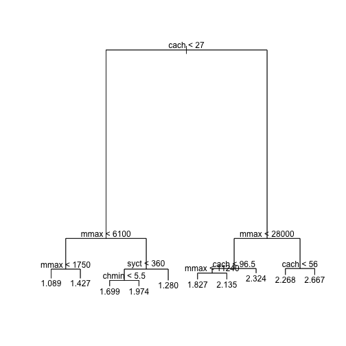
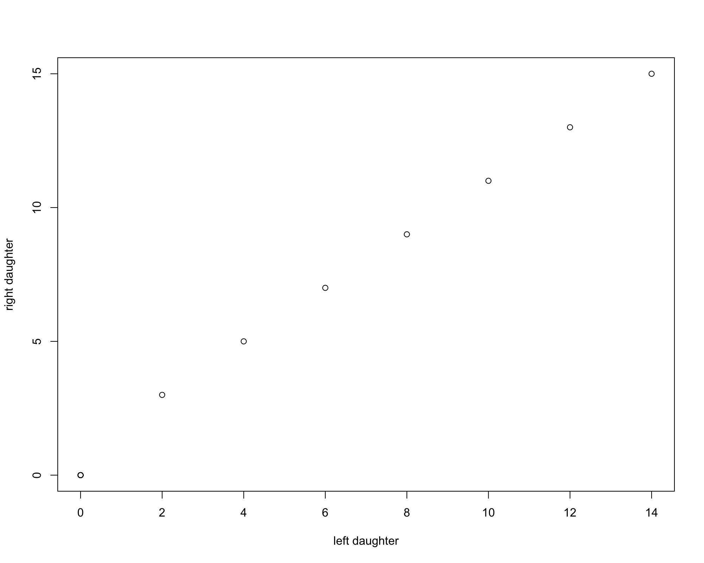

Aeplied Machine Learning 410
========================================================
css: ../../assets/style/uw.css
author: Justin Donaldson
date: April - Some time around then I guess
autosize: true

Decision Trees and Random Forests
---------------------------------
(AKA: divide and concur)


A Random Forest
===================
(Question - Is it Fall Yet?)
---------------

<a title="Daniel Case at the English language Wikipedia [GFDL (http://www.gnu.org/copyleft/fdl.html) or CC-BY-SA-3.0 (http://creativecommons.org/licenses/by-sa/3.0/)], via Wikimedia Commons" href="https://commons.wikimedia.org/wiki/File%3ABlack_Rock_Forest_view_from_NE.jpg"></a>

Black Rock Forest view from NE - Daniel Case


Overview
========

* Why are Random Forests useful?
  * Recap of Random Forests
* When are Trees useful?
  * Recap of Decision Trees


Why are Random Forests useful?
==============================
incremental: true
An Empircal Evaluation of Supervised Learning in High Dimensions
-------------

***
Comparison of:
-------------
- Support Vector Machines
- Artificial Neural Networks
- Logistic Regression
- Naive Bayes
- K-Nearest Neighbors
- Random Forests
- Bagged Decision Trees
- Boosted Stumps
- Boosted Trees
- Perceptrons

Why are Random Forests useful?
==============================
Evaluation Data Sets:
--------------------
- Sturn, Calam : Ornithology
- Digits : MNIST handwritten
- Tis : mRNA translation sites
- Cryst : Protein Crystallography
- KDD98 : Donation Prediction
- R-S : Usenet real/simulation
- Cite : Paper Authorship
- Dse : Newswire
- Spam : TREC spam corpora
- Imdb : link prediction

***
Error Metrics:
-------------
- AUC : Area under curve
- ACC : Accuracy
- RMS : Root Mean Squared Error


Why are Random Forests useful?
==============================
Conclusions
--------------------
- Boosted decision trees performed best when < 4000 dimensions
- Random forests performed best when > 4000
  - Easy to parellize
  - Scales efficiently to high dimensions
  - Performs consistently well on all three metrics
- Non-linear methods do well when model complexity is constrained
- Worst performing models : Naive Bayes and Perceptrons

Why are Random Forests are a Solid First Choice Model
=====================================================
- Handles boolean, categorical, numeric features with no scaling or factorization
- Automatic feature selection (within reason)
- Quick to train, parallelizable
- Naturally resistant to overfitting
- OOB error metric instead of holdout eval

What are Random Forest Drawbacks?
=====================================================
- Less interpretable than trees
- Good feature engineering is very important
- Model size can become cumbersome


Iris Recap
=======
left : 90%

```r
# using iris data
ggpairs(data=iris, mapping = ggplot2::aes(color = Species))
```


***
* Petal dimensions important?
* Versicolor and Virginica separable?


Iris Recap
=======


```r
# model iris species based on plant measurement
m <- tree(Species ~ ., data = iris)
summary(m)
```

```

Classification tree:
tree(formula = Species ~ ., data = iris)
Variables actually used in tree construction:
[1] "Petal.Length" "Petal.Width"  "Sepal.Length"
Number of terminal nodes:  6 
Residual mean deviance:  0.1253 = 18.05 / 144 
Misclassification error rate: 0.02667 = 4 / 150 
```

Example
=======

```r
plot(m)
text(m, cex=2)
```


Partition Tree
==============
A nice option if you have exactly 2 input dimensions

```r
tree1 <- tree(Species ~ Sepal.Width + Petal.Width, data = iris)
plot(iris$Petal.Width,iris$Sepal.Width,pch=19,col=as.numeric(iris$Species))
partition.tree(tree1,label="Species",add=TRUE)
legend(1.75,4.5,legend=unique(iris$Species),col=unique(as.numeric(iris$Species)),pch=19)
```




Example
=======

```r
data(cpus, package="MASS")
cpus.ltr <- tree(log10(perf) ~ syct+mmin+mmax+cach+chmin+chmax, cpus)
snip.tree(cpus.ltr,2) # only show first two levels
```

```
node), split, n, deviance, yval
      * denotes terminal node

 1) root 209 43.12000 1.753  
   2) cach < 27 143 11.79000 1.525 *
   3) cach > 27 66  7.64300 2.249  
     6) mmax < 28000 41  2.34100 2.062  
      12) cach < 96.5 34  1.59200 2.008  
        24) mmax < 11240 14  0.42460 1.827 *
        25) mmax > 11240 20  0.38340 2.135 *
      13) cach > 96.5 7  0.17170 2.324 *
     7) mmax > 28000 25  1.52300 2.555  
      14) cach < 56 7  0.06929 2.268 *
      15) cach > 56 18  0.65350 2.667 *
```


First Slide
========================================================

For more details on authoring R presentations please visit <https://support.rstudio.com/hc/en-us/articles/200486468>.

- Bullet 1
- Bullet 2
- Bullet 3

Slide With Code
========================================================


```r
summary(cars)
```

```
     speed           dist       
 Min.   : 4.0   Min.   :  2.00  
 1st Qu.:12.0   1st Qu.: 26.00  
 Median :15.0   Median : 36.00  
 Mean   :15.4   Mean   : 42.98  
 3rd Qu.:19.0   3rd Qu.: 56.00  
 Max.   :25.0   Max.   :120.00  
```

Slide With Plot
========================================================


