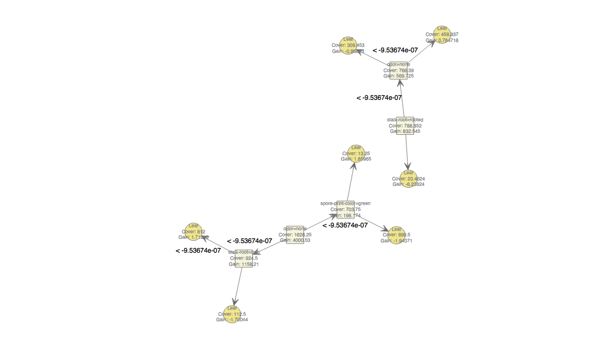

Deep Dive into Agaricus with Gradient Boosted Trees
=========
Modeling question : Is this safe to eat?
--------
<a title="By George Chernilevsky (Own work) [Public domain], via Wikimedia Commons" href="https://commons.wikimedia.org/wiki/File%3AAgaricus_augustus_2011_G1.jpg"></a>


Agaricus Data
========
We have a variety of measurements/classes, and a label (poisonous/not)

```r
  library(xgboost)
  library(DiagrammeR)
  data(agaricus.train)
  data(agaricus.test)
  train <- agaricus.train
  test <- agaricus.test
  dim(agaricus.train$data)
```

```
[1] 6513  126
```

```r
  head(cbind(as.matrix(agaricus.train$data)[,1:3], etc="...", label=agaricus.train$label))
```

```
     cap-shape=bell cap-shape=conical cap-shape=convex etc   label
[1,] "0"            "0"               "1"              "..." "1"  
[2,] "0"            "0"               "1"              "..." "0"  
[3,] "1"            "0"               "0"              "..." "0"  
[4,] "0"            "0"               "1"              "..." "1"  
[5,] "0"            "0"               "1"              "..." "0"  
[6,] "0"            "0"               "1"              "..." "0"  
```


Gradient Boosted Trees
=========
GBT models were some of the best performing classifications models in the original study.
----
But, they require more parameters than forests :
- objective = "binary:logistic" : Training a binary classifier
- max_depth = 2 : The trees are shallow (atypically low)
- nrounds = 2 : Two passes on the data (low)
- eta = 1 : Control the learning rate (high)
- verbose = 2 : Add more debug information on the tress (high)

Gradient Boosted Trees
=========
Build
----

```r
bst <- xgboost(data = train$data,  objective = "binary:logistic", label = train$label, max_depth = 2, nrounds = 2, eta = 1, verbose=2)
```

```
[15:10:25] amalgamation/../src/tree/updater_prune.cc:74: tree pruning end, 1 roots, 6 extra nodes, 0 pruned nodes, max_depth=2
[1]	train-error:0.046522 
[15:10:25] amalgamation/../src/tree/updater_prune.cc:74: tree pruning end, 1 roots, 4 extra nodes, 0 pruned nodes, max_depth=2
[2]	train-error:0.022263 
```

Gradient Boosted Trees
=========
Visualize
-----

```r
xgb.plot.tree(feature_names = colnames(agaricus.train$data), model=bst)
```




Gradient Boosted Trees
=========
Evaluate
-----

```r
pred = predict(bst, test$data)
head(pred)
```

```
[1] 0.28583017 0.92392391 0.28583017 0.28583017 0.05169873 0.92392391
```

```r
pred_label = as.numeric(pred > .5)
```
Test error:

```r
mean(as.numeric((pred  > .5) != test$label))
```

```
[1] 0.02172564
```
Not bad, but consider risk of false positive!


XGBoost performance
=======
A fast cross-platform (python/R/C++) option for gradient boosted trees.
----


(taken from recent Higgs Boson competition on Kaggle)
