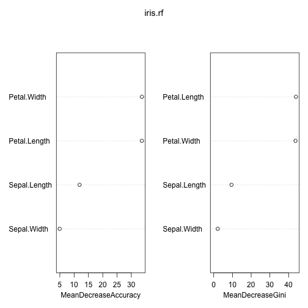

Iris Deep Dive
============
type : sub-section
Let's use Iris as a way of showing various Forest-based modeling/analysis techniques

```r
library(randomForest)
```


Looking into Iris
===

```r
data(iris)
iris.rf <- randomForest(Species ~ ., iris, importance=T)
iris.rf
```

```

Call:
 randomForest(formula = Species ~ ., data = iris, importance = T) 
               Type of random forest: classification
                     Number of trees: 500
No. of variables tried at each split: 2

        OOB estimate of  error rate: 5.33%
Confusion matrix:
           setosa versicolor virginica class.error
setosa         50          0         0        0.00
versicolor      0         47         3        0.06
virginica       0          5        45        0.10
```

Looking into Iris
===

```r
# get tree #23 from the model
getTree(iris.rf,k=23)
```

```
   left daughter right daughter split var split point status prediction
1              2              3         4        0.70      1          0
2              0              0         0        0.00     -1          1
3              4              5         3        4.85      1          0
4              6              7         4        1.70      1          0
5              8              9         4        1.70      1          0
6              0              0         0        0.00     -1          2
7             10             11         2        3.10      1          0
8             12             13         2        3.05      1          0
9              0              0         0        0.00     -1          3
10             0              0         0        0.00     -1          3
11             0              0         0        0.00     -1          2
12            14             15         2        2.75      1          0
13             0              0         0        0.00     -1          2
14            16             17         2        2.45      1          0
15             0              0         0        0.00     -1          3
16             0              0         0        0.00     -1          3
17             0              0         0        0.00     -1          2
```
Unfortunately, it's very difficult to inspect individual trees, or form an understanding of how they reach consensus on a given case.

Looking into Iris
===

```r
varImpPlot(iris.rf)
```


***


Example : Tweak one variable while holding training set fixed
=======

```r
irisTweak = function(var){ 
  dummy = iris
  idx = seq(min(dummy[var]), max(dummy[var]), by=.01)
  probs = sapply(idx, function(x) {
    dummy[var] = x; 
    apply(predict(iris.rf, dummy, type='prob'),2,mean)
  })
  dat = as.data.frame(t(apply(probs,2,unlist)))
  dat[var] = idx;
  dat = melt(dat, id.vars=var)
  colnames(dat)[colnames(dat) == 'value'] <- 'probability'
  ggplot(dat, aes_string(x=var, y='probability', color='variable')) + 
    geom_line(alpha=.8, aes(size=2)) + guides(size=F)
} 
# E.g.
#irisTweak("Petal.Length") 
```

Example : Tweak Petal.Length while holding training set fixed
=======


```
Error in irisTweak("Petal.Length") : could not find function "melt"
```
