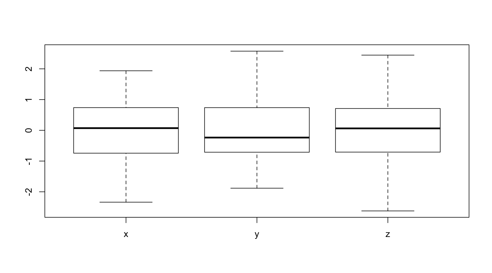

Clustering
========================================================
css: ../../assets/style/uw.css
author: Justin Donaldson
date: April-13-2017
autosize: true

Applied Machine Learning 410
---------------------------------
(AKA: Birds of a feather)


Clustering History
========================================================
Clustering first originated in *anthropology*

- Divide people into culturally similar groups
- "...matrilinear descent and avoidance of
relatives-in-law were or tended to be inherently connected."

***


Clustering Needs
========================================================

“Data Clustering: 50 Years Beyond K-Means”, A.K. Jain (2008)

Overview
========================================================
type : sub-section
- Connectivity Clustering
- Centroid-based Clustering
- Density-based Clustering
- Graph-based Clustering


Connectivity-based clustering
========================================================
type : sub-section

Hierarchical Clustering
============
- Group together observations based on *proximity* in space.
- Agglomerative clustering (clusters grow from individual observations)

***
<a title="By [[File:Hierarchical_clustering_diagram.png#file|]]: Stathis Sideris on 10/02/2005 derivative work:  Mhbrugman ([[File:Hierarchical_clustering_diagram.png#file|]]) [CC-BY-SA-3.0 (http://creativecommons.org/licenses/by-sa/3.0/) or GFDL (http://www.gnu.org/copyleft/fdl.html)], via Wikimedia Commons" href="https://commons.wikimedia.org/wiki/File%3AHierarchical_clustering_simple_diagram.svg"></a>

Hierarchical Clustering
============
For this analysis, let's look at arrest rates at a state level.

```r
  head(USArrests)
```

```
           Murder Assault UrbanPop Rape
Alabama      13.2     236       58 21.2
Alaska       10.0     263       48 44.5
Arizona       8.1     294       80 31.0
Arkansas      8.8     190       50 19.5
California    9.0     276       91 40.6
Colorado      7.9     204       78 38.7
```

Hierarchical Clustering
============
The arrest information is not expressed in distances, so we need to transform it.

```r
  as.matrix(dist(USArrests))[1:6, 1:6]
```

```
            Alabama   Alaska   Arizona  Arkansas California Colorado
Alabama     0.00000 37.17701  63.00833  46.92814   55.52477 41.93256
Alaska     37.17701  0.00000  46.59249  77.19741   45.10222 66.47594
Arizona    63.00833 46.59249   0.00000 108.85192   23.19418 90.35115
Arkansas   46.92814 77.19741 108.85192   0.00000   97.58202 36.73486
California 55.52477 45.10222  23.19418  97.58202    0.00000 73.19713
Colorado   41.93256 66.47594  90.35115  36.73486   73.19713  0.00000
```

Hierarchical Clustering
============
R provides a good hierarchical clustering method in the standard distribution.

```r
  hc <-hclust(dist(USArrests))
  hc
```

```

Call:
hclust(d = dist(USArrests))

Cluster method   : complete 
Distance         : euclidean 
Number of objects: 50 
```

Hierarchical Clustering
============
Plotting it gives us a representation of the clusters in a tree-like form.

```r
plot(hc, hang=-1)
```


Hierarchical Clustering
============
We can set a split point using "cutree", which will give us the desired number of clusters

```r
clusters = cutree(hc, k=5) # cut into 5 clusters
clusters
```

```
       Alabama         Alaska        Arizona       Arkansas     California 
             1              1              1              2              1 
      Colorado    Connecticut       Delaware        Florida        Georgia 
             2              3              1              4              2 
        Hawaii          Idaho       Illinois        Indiana           Iowa 
             5              3              1              3              5 
        Kansas       Kentucky      Louisiana          Maine       Maryland 
             3              3              1              5              1 
 Massachusetts       Michigan      Minnesota    Mississippi       Missouri 
             2              1              5              1              2 
       Montana       Nebraska         Nevada  New Hampshire     New Jersey 
             3              3              1              5              2 
    New Mexico       New York North Carolina   North Dakota           Ohio 
             1              1              4              5              3 
      Oklahoma         Oregon   Pennsylvania   Rhode Island South Carolina 
             2              2              3              2              1 
  South Dakota      Tennessee          Texas           Utah        Vermont 
             5              2              2              3              5 
      Virginia     Washington  West Virginia      Wisconsin        Wyoming 
             2              2              5              5              2 
```

Hierarchical Clustering
============
We can overlay the cluster boundaries on the original plot.

```r
plot(hc)
rect.hclust(hc, k=5, border="purple")
```


Hierarchical Clustering
===========

```r
USArrests[clusters==1,]
```

```
               Murder Assault UrbanPop Rape
Alabama          13.2     236       58 21.2
Alaska           10.0     263       48 44.5
Arizona           8.1     294       80 31.0
California        9.0     276       91 40.6
Delaware          5.9     238       72 15.8
Illinois         10.4     249       83 24.0
Louisiana        15.4     249       66 22.2
Maryland         11.3     300       67 27.8
Michigan         12.1     255       74 35.1
Mississippi      16.1     259       44 17.1
Nevada           12.2     252       81 46.0
New Mexico       11.4     285       70 32.1
New York         11.1     254       86 26.1
South Carolina   14.4     279       48 22.5
```

```r
USArrests[clusters==2,]
```

```
              Murder Assault UrbanPop Rape
Arkansas         8.8     190       50 19.5
Colorado         7.9     204       78 38.7
Georgia         17.4     211       60 25.8
Massachusetts    4.4     149       85 16.3
Missouri         9.0     178       70 28.2
New Jersey       7.4     159       89 18.8
Oklahoma         6.6     151       68 20.0
Oregon           4.9     159       67 29.3
Rhode Island     3.4     174       87  8.3
Tennessee       13.2     188       59 26.9
Texas           12.7     201       80 25.5
Virginia         8.5     156       63 20.7
Washington       4.0     145       73 26.2
Wyoming          6.8     161       60 15.6
```

Hierarchical Clustering
===========


Hierarchical Clustering
============

```r
head(as.matrix(UScitiesD))
```

```
           Atlanta Chicago Denver Houston LosAngeles Miami NewYork
Atlanta          0     587   1212     701       1936   604     748
Chicago        587       0    920     940       1745  1188     713
Denver        1212     920      0     879        831  1726    1631
Houston        701     940    879       0       1374   968    1420
LosAngeles    1936    1745    831    1374          0  2339    2451
Miami          604    1188   1726     968       2339     0    1092
           SanFrancisco Seattle Washington.DC
Atlanta            2139    2182           543
Chicago            1858    1737           597
Denver              949    1021          1494
Houston            1645    1891          1220
LosAngeles          347     959          2300
Miami              2594    2734           923
```

Hierarchical Clustering
============

```r
hc = hclust(dist(UScitiesD))
plot(hc)
rect.hclust(hc, k=3, border="purple")
```


Hierarchical Clustering
============
Options - Distance (**good defaults**)
-----
- **Euclidean** $\|a-b \|_2 = \sqrt{\sum_i (a_i-b_i)^2}$
- Squared Euclidean $\|a-b \|_2^2 = \sum_i (a_i-b_i)^2$
- Manhattan $\|a-b \|_1 = \sum_i |a_i-b_i|$
- Maximum Distance $\|a-b \|_\infty = \max_i |a_i-b_i|$
- Mahalanobis Distance : ($S$  is the covariance matrix)* $\sqrt{(a-b)^{\top}S^{-1}(a-b)}$  

Hierarchical Clustering
============
Options - Linkage (**good defaults**)
-----
- single = closest neighbor to any point in cluster gets merged 
- **complete** = closest neighbor to furthest point in cluster gets added 
- UPGMA - Average of distances $d(x,y)$ : ${1 \over {|\mathcal{A}|\cdot|\mathcal{B}|}}\sum_{x \in \mathcal{A}}\sum_{ y \in \mathcal{B}} d(x,y)$
- centroid - distance between average of points in cluster.

Centroid-based clustering
========================================================
type : sub-section


K-Means
============
type: scrollable
K-means is the classic centroid-based technique.

```r
  kc <-kmeans(dist(USArrests), 5)
  kc
```

```
K-means clustering with 5 clusters of sizes 14, 16, 6, 4, 10

Cluster means:
    Alabama    Alaska   Arizona  Arkansas California  Colorado Connecticut
1  65.89233  96.07457 122.22107  34.09331  107.29421  39.87674    66.23308
2  44.26408  40.63415  39.30706  87.27907   39.61009  72.77326   164.91692
3 186.45199 215.61266 245.68765 140.62960  230.31143 157.96032    64.55080
4 156.66944 185.93502 216.79333 110.42542  202.23294 130.08173    41.33227
5 124.59232 154.48260 183.00204  79.98813  167.54319  95.46898    16.35455
   Delaware   Florida   Georgia    Hawaii     Idaho  Illinois   Indiana
1  67.20616 163.01249  43.25800 128.64955  58.87385  78.34914  62.25396
2  43.22760  67.63373  65.42442 227.97517 155.25746  37.06141 160.84644
3 188.60864 286.62604 162.34794  29.11799  71.09903 201.14674  65.60171
4 159.44839 257.56938 132.83121  48.78623  41.13989 172.61816  38.83723
5 126.21743 224.00494 100.40272  69.53320  17.29587 138.34270  11.73799
       Iowa    Kansas  Kentucky Louisiana     Maine  Maryland
1 119.61759  60.38700  69.05374  77.57022  94.96215 127.67658
2 218.49451 159.05258 165.84901  35.41213 192.58639  40.92104
3  14.16755  67.20859  61.09549 199.77363  36.21497 250.60974
4  27.51177  40.18894  31.37856 170.34344  10.30800 221.15908
5  58.35484  11.41076  16.54525 137.45393  35.62235 188.28510
  Massachusetts  Michigan Minnesota Mississippi  Missouri   Montana
1      33.42978  84.01840 102.76672    91.49070  25.05121  68.73604
2     126.79319  33.19452 202.03634    41.65756  96.36998 165.83229
3     103.59042 207.13296  27.68056   209.69053 130.14358  60.71176
4      77.80478 178.26311  18.60749   179.43873 101.66855  30.98355
5      42.53689 144.48241  41.89394   148.94802  67.55885  15.42239
   Nebraska    Nevada New Hampshire New Jersey New Mexico  New York
1  73.57305  84.13843     118.95531   30.84698  113.01928  83.75387
2 172.20940  39.50211     217.71406  117.34247   34.10491  36.33470
3  54.11084 206.42920      14.53706  114.40486  236.19105 206.64587
4  27.42662 178.22988      26.55704   88.67804  206.94271 178.27364
5  14.93085 143.87782      57.75727   53.05615  173.70919 143.81224
  North Carolina North Dakota      Ohio  Oklahoma    Oregon Pennsylvania
1      166.51660    132.95563  55.24557  28.39951  26.41940     69.14625
2       72.99105    230.82548 153.98042 123.29857 115.23761    168.19979
3      287.09146     18.80491  74.13809 102.55246 111.32739     59.63153
4      256.98193     38.14490  49.16741  74.12040  83.03110     35.61800
5      225.92323     72.29857  15.74348  40.23432  49.30161     13.90017
  Rhode Island South Carolina South Dakota Tennessee     Texas      Utah
1     31.90793      109.20147     92.90532  29.54413  35.75584  56.01761
2    104.36878       38.53295    189.73210  87.15383  74.93990 154.39390
3    127.97252      229.47582     40.03467 139.41307 153.83960  75.56577
4    101.13072      199.39953     10.66362 109.93988 125.76522  52.02789
5     66.64099      168.18393     34.94932  77.62259  91.00713  18.88683
    Vermont  Virginia Washington West Virginia Wisconsin   Wyoming
1 132.66326  26.94074   32.76092      99.77677 121.86942  27.38481
2 229.09553 118.39457  129.17208     195.71986 221.20228 114.20837
3  25.21201 107.17384   98.05935      37.95290  16.55016 111.57683
4  38.98711  78.07427   70.91318      12.67582  32.83759  81.97383
5  73.55590  45.22863   36.11041      42.77453  60.72838  50.17080

Clustering vector:
       Alabama         Alaska        Arizona       Arkansas     California 
             2              2              2              1              2 
      Colorado    Connecticut       Delaware        Florida        Georgia 
             1              5              2              2              1 
        Hawaii          Idaho       Illinois        Indiana           Iowa 
             3              5              2              5              3 
        Kansas       Kentucky      Louisiana          Maine       Maryland 
             5              5              2              4              2 
 Massachusetts       Michigan      Minnesota    Mississippi       Missouri 
             1              2              4              2              1 
       Montana       Nebraska         Nevada  New Hampshire     New Jersey 
             5              5              2              3              1 
    New Mexico       New York North Carolina   North Dakota           Ohio 
             2              2              2              3              5 
      Oklahoma         Oregon   Pennsylvania   Rhode Island South Carolina 
             1              1              5              1              2 
  South Dakota      Tennessee          Texas           Utah        Vermont 
             4              1              1              5              3 
      Virginia     Washington  West Virginia      Wisconsin        Wyoming 
             1              1              4              3              1 

Within cluster sum of squares by cluster:
[1] 274120.554 608986.971  16906.656   5505.797  22532.254
 (between_SS / total_SS =  90.4 %)

Available components:

[1] "cluster"      "centers"      "totss"        "withinss"    
[5] "tot.withinss" "betweenss"    "size"         "iter"        
[9] "ifault"      
```
K-Means
============
K-means is the classic centroid-based technique.
- Assignment Step : $S_i^{(t)} = \big \{ x_p : \big \| x_p - m^{(t)}_i \big \|^2 \le \big \| x_p - m^{(t)}_j \big \|^2 \ \forall j, 1 \le j \le k \big\}$
  - Assign each data point to cluster whose mean is the smallest within-cluster sum of squares.
- Update Step : $m^{(t+1)}_i = \frac{1}{|S^{(t)}_i|} \sum_{x_j \in S^{(t)}_i} x_j$
  - Calculate new centroids

K-Means
============

```r
  colors =brewer.pal(5, "Spectral")
  arrests$clusters = colors[kc$cluster]
  ggpairs(arrests, mapping=ggplot2::aes(fill=clusters,color=clusters))
```


K-Means
============
K-means is more sensitive to scaling

```r
  arrests = data.frame(scale(USArrests))
```


Quick aside on scaling
=====
Field measurements can have different *scales*

```r
dat = cbind(
  x=rnorm(100, mean =  0, sd = 1),
  y=rnorm(100, mean = -4, sd = 2),
  z=rnorm(100, mean =  4, sd = 9)
  )
```
***

```r
boxplot(dat)
```


Quick aside on scaling
=====
In some cases it may be useful to *normalize* the scales.
Standard normalization:
- mean = 0
- standard deviation = 1

 ***

```r
boxplot(scale(dat))
```



K-means compared to Hierarchical Clustering
======
Hierarchical Clustering
-----
- cluster count can be determined post hoc
- linkages are robust against scaling differences in fields
- good at extracting "strand" clusters
- quadratic time complexity : ~ $O(n^2)$
- repeatable

K-Means
----
- "k" cluster count must be given up front.
- scaling affects centroid calculation, consider normalizing if possible.
- good at extracting "spherical" clusters
- near-linear time complexity : ~ $O(n)$
- requires random initialization, results may not be repeatable in some cases

Distribution-based clustering
========================================================
type : sub-section
Bio break? - 15m
- Expectation Maximaztion

Expectation Maximization
==========

```r
require(EMCluster)
```
<a title="By 3mta3 (talk) 16:55, 23 March 2009 (UTC) (Own work) [CC BY-SA 3.0 (http://creativecommons.org/licenses/by-sa/3.0) or GFDL (http://www.gnu.org/copyleft/fdl.html)], via Wikimedia Commons" href="https://commons.wikimedia.org/wiki/File%3AEm_old_faithful.gif"></a>
***
- based on probability distributions
- no hard assignment of points to clusters, instead use probabilities
- underlying distributions can be anything, gaussians are common 

Expectation Maximization
==========

```r
require(EMCluster)
```
<a title="By 3mta3 (talk) 16:55, 23 March 2009 (UTC) (Own work) [CC BY-SA 3.0 (http://creativecommons.org/licenses/by-sa/3.0) or GFDL (http://www.gnu.org/copyleft/fdl.html)], via Wikimedia Commons" href="https://commons.wikimedia.org/wiki/File%3AEm_old_faithful.gif"></a>
***
-  Calculate expected value of log likelihood function:
$$
Q(\boldsymbol\theta|\boldsymbol\theta^{(t)}) = \operatorname{E}_{\mathbf{Z}|\mathbf{X},\boldsymbol\theta^{(t)}}\left[ \log L (\boldsymbol\theta;\mathbf{X},\mathbf{Z})  \right]
$$
  - with respect to the conditional distribution of $Z$ given $X$ under the current estimate of the parameters $\theta^{(t)}$.
- Find the parameter that maximizes : 
$$
\boldsymbol\theta^{(t+1)} = \underset{\boldsymbol\theta}{\operatorname{arg\,max}} \ Q(\boldsymbol\theta|\boldsymbol\theta^{(t)})
$$

Expectation Maximization
==========
<a title="By 3mta3 (talk) 16:55, 23 March 2009 (UTC) (Own work) [CC BY-SA 3.0 (http://creativecommons.org/licenses/by-sa/3.0) or GFDL (http://www.gnu.org/copyleft/fdl.html)], via Wikimedia Commons" href="https://commons.wikimedia.org/wiki/File%3AEm_old_faithful.gif"></a>

***
Plain english: 

- Initialize $\theta$ to one or more random values.
- Compute the best value for $Z$ given the $\theta$ values.
- Then use the computed values to compute a better value for $\theta$.
- Rinse and repeat.


Expectation Maximization
==========
EM works well when you have a good idea of the underlying distribution of the data.
In this case, normal deviates

```r
means = c(0,20,-15)
x = rnorm(300, means[1], 10)
y = rnorm(100, means[2], 1)
z = rnorm(100, means[3], 1)
dat = data.frame(x=c(x,y,z))
ggplot(data = dat,aes(x=x)) + geom_histogram()
```

Expectation Maximization
==========
EM works well when you have a good idea of the underlying distribution of the data.
In this case, normal deviates


```
Error in eval(expr, envir, enclos) : could not find function "ggplot"
```
