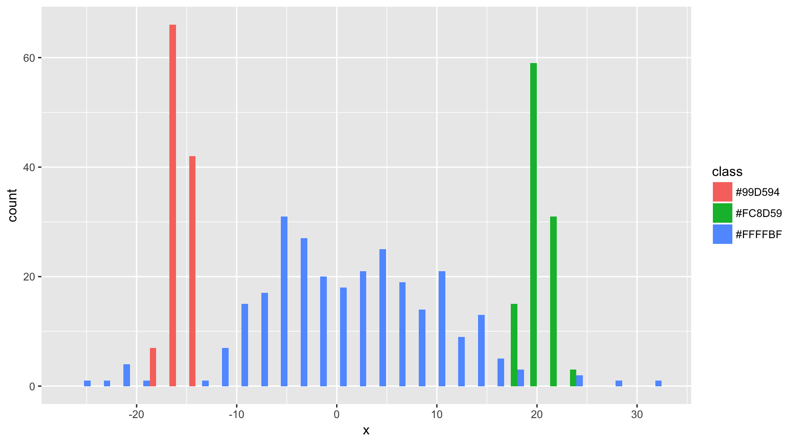
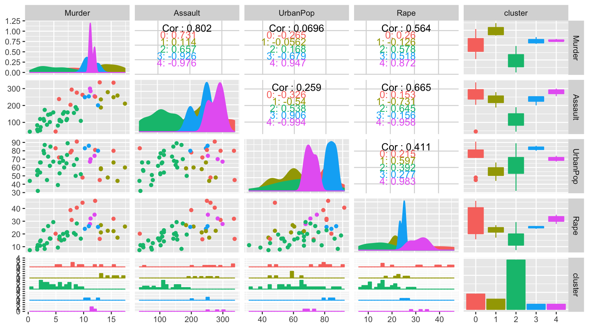

Applied Machine Learning 410
========================================================
css: ../../assets/style/uw.css
author: Justin Donaldson
date: April-06-2017
autosize: true

Clustering
---------------------------------
(AKA: Birds of a feather)


Clustering History
========================================================
Clustering first originated in *anthropology*

- Divide people into culturally similar groups
- "...matrilinear descent and avoidance of
relatives-in-law were or tended to be inherently connected."

***


Clustering Needs
========================================================

“Data Clustering: 50 Years Beyond K-Means”, A.K. Jain (2008

Overview
========================================================
type : sub-section
- Connectivity Clustering
- Centroid-based Clustering
- Density-based Clustering
- Graph-based Clustering


Connectivity-based clustering
========================================================
type : sub-section

Hierarchical Clustering
============
- Group together observations based on *proximity* in space.
- Agglomerative clustering (clusters grow from individual observations)

***
<a title="By [[File:Hierarchical_clustering_diagram.png#file|]]: Stathis Sideris on 10/02/2005 derivative work:  Mhbrugman ([[File:Hierarchical_clustering_diagram.png#file|]]) [CC-BY-SA-3.0 (http://creativecommons.org/licenses/by-sa/3.0/) or GFDL (http://www.gnu.org/copyleft/fdl.html)], via Wikimedia Commons" href="https://commons.wikimedia.org/wiki/File%3AHierarchical_clustering_simple_diagram.svg"></a>

Hierarchical Clustering
============
For this analysis, let's look at arrest rates at a state level.

```r
  head(USArrests)
```

```
           Murder Assault UrbanPop Rape
Alabama      13.2     236       58 21.2
Alaska       10.0     263       48 44.5
Arizona       8.1     294       80 31.0
Arkansas      8.8     190       50 19.5
California    9.0     276       91 40.6
Colorado      7.9     204       78 38.7
```

Hierarchical Clustering
============
The arrest information is not expressed in distances, so we need to transform it.

```r
  as.matrix(dist(USArrests))[1:6, 1:6]
```

```
            Alabama   Alaska   Arizona  Arkansas California Colorado
Alabama     0.00000 37.17701  63.00833  46.92814   55.52477 41.93256
Alaska     37.17701  0.00000  46.59249  77.19741   45.10222 66.47594
Arizona    63.00833 46.59249   0.00000 108.85192   23.19418 90.35115
Arkansas   46.92814 77.19741 108.85192   0.00000   97.58202 36.73486
California 55.52477 45.10222  23.19418  97.58202    0.00000 73.19713
Colorado   41.93256 66.47594  90.35115  36.73486   73.19713  0.00000
```

Hierarchical Clustering
============
R provides a good hierarchical clustering method in the standard distribution.

```r
  hc <-hclust(dist(USArrests))
  hc
```

```

Call:
hclust(d = dist(USArrests))

Cluster method   : complete 
Distance         : euclidean 
Number of objects: 50 
```

Hierarchical Clustering
============
Plotting it gives us a representation of the clusters in a tree-like form.

```r
plot(hc, hang=-1)
```


Hierarchical Clustering
============
We can set a split point using "cutree", which will give us the desired number of clusters

```r
clusters = cutree(hc, k=5) # cut into 5 clusters
clusters
```

```
       Alabama         Alaska        Arizona       Arkansas     California 
             1              1              1              2              1 
      Colorado    Connecticut       Delaware        Florida        Georgia 
             2              3              1              4              2 
        Hawaii          Idaho       Illinois        Indiana           Iowa 
             5              3              1              3              5 
        Kansas       Kentucky      Louisiana          Maine       Maryland 
             3              3              1              5              1 
 Massachusetts       Michigan      Minnesota    Mississippi       Missouri 
             2              1              5              1              2 
       Montana       Nebraska         Nevada  New Hampshire     New Jersey 
             3              3              1              5              2 
    New Mexico       New York North Carolina   North Dakota           Ohio 
             1              1              4              5              3 
      Oklahoma         Oregon   Pennsylvania   Rhode Island South Carolina 
             2              2              3              2              1 
  South Dakota      Tennessee          Texas           Utah        Vermont 
             5              2              2              3              5 
      Virginia     Washington  West Virginia      Wisconsin        Wyoming 
             2              2              5              5              2 
```

Hierarchical Clustering
============
We can overlay the cluster boundaries on the original plot.

```r
plot(hc)
rect.hclust(hc, k=5, border="purple")
```


Hierarchical Clustering
===========

```r
USArrests[clusters==1,]
```

```
               Murder Assault UrbanPop Rape
Alabama          13.2     236       58 21.2
Alaska           10.0     263       48 44.5
Arizona           8.1     294       80 31.0
California        9.0     276       91 40.6
Delaware          5.9     238       72 15.8
Illinois         10.4     249       83 24.0
Louisiana        15.4     249       66 22.2
Maryland         11.3     300       67 27.8
Michigan         12.1     255       74 35.1
Mississippi      16.1     259       44 17.1
Nevada           12.2     252       81 46.0
New Mexico       11.4     285       70 32.1
New York         11.1     254       86 26.1
South Carolina   14.4     279       48 22.5
```

```r
USArrests[clusters==2,]
```

```
              Murder Assault UrbanPop Rape
Arkansas         8.8     190       50 19.5
Colorado         7.9     204       78 38.7
Georgia         17.4     211       60 25.8
Massachusetts    4.4     149       85 16.3
Missouri         9.0     178       70 28.2
New Jersey       7.4     159       89 18.8
Oklahoma         6.6     151       68 20.0
Oregon           4.9     159       67 29.3
Rhode Island     3.4     174       87  8.3
Tennessee       13.2     188       59 26.9
Texas           12.7     201       80 25.5
Virginia         8.5     156       63 20.7
Washington       4.0     145       73 26.2
Wyoming          6.8     161       60 15.6
```

Hierarchical Clustering
===========


Hierarchical Clustering
============

```r
head(as.matrix(UScitiesD))
```

```
           Atlanta Chicago Denver Houston LosAngeles Miami NewYork
Atlanta          0     587   1212     701       1936   604     748
Chicago        587       0    920     940       1745  1188     713
Denver        1212     920      0     879        831  1726    1631
Houston        701     940    879       0       1374   968    1420
LosAngeles    1936    1745    831    1374          0  2339    2451
Miami          604    1188   1726     968       2339     0    1092
           SanFrancisco Seattle Washington.DC
Atlanta            2139    2182           543
Chicago            1858    1737           597
Denver              949    1021          1494
Houston            1645    1891          1220
LosAngeles          347     959          2300
Miami              2594    2734           923
```

Hierarchical Clustering
============

```r
hc = hclust(dist(UScitiesD))
plot(hc)
rect.hclust(hc, k=3, border="purple")
```


Hierarchical Clustering
============
Options - Distance (**good defaults**)
-----
- **Euclidean** $\|a-b \|_2 = \sqrt{\sum_i (a_i-b_i)^2}$
- Squared Euclidean $\|a-b \|_2^2 = \sum_i (a_i-b_i)^2$
- Manhattan $\|a-b \|_1 = \sum_i |a_i-b_i|$
- Maximum Distance $\|a-b \|_\infty = \max_i |a_i-b_i|$
- Mahalanobis Distance : ($S$  is the covariance matrix)* $\sqrt{(a-b)^{\top}S^{-1}(a-b)}$  

Hierarchical Clustering
============
Options - Linkage (**good defaults**)
-----
- single = closest neighbor to any point in cluster gets merged 
- **complete** = closest neighbor to furthest point in cluster gets added 
- UPGMA - Average of distances $d(x,y)$ : ${1 \over {|\mathcal{A}|\cdot|\mathcal{B}|}}\sum_{x \in \mathcal{A}}\sum_{ y \in \mathcal{B}} d(x,y)$
- centroid - distance between average of points in cluster.

Centroid-based clustering
========================================================
type : sub-section


K-Means
============
K-means is the classic centroid-based technique.

```r
  kc <-kmeans(dist(USArrests), 5)
  kc
```

```
K-means clustering with 5 clusters of sizes 12, 20, 2, 5, 11

Cluster means:
    Alabama    Alaska   Arizona  Arkansas California  Colorado Connecticut
1  40.62136  34.03632  34.00118  83.38388   32.30270  67.54820   160.53721
2 149.56564 179.11210 208.56598 104.26803  193.31161 121.13893    35.80897
3 101.98132  79.67528  49.63707 147.95999   70.65643 135.19170   227.90351
4  25.22935  55.64567  78.25796  39.00082   65.87818  24.60089   110.31680
5  73.92292 104.47051 131.03908  34.74916  116.14039  47.15276    57.46329
   Delaware   Florida   Georgia    Hawaii     Idaho  Illinois   Indiana
1  39.40545  70.20848  61.21676 223.36707 151.06893  30.30025 156.41202
2 151.58099 249.50416 125.47198  53.25924  38.20562 164.03901  33.31695
3 100.98494  19.26396 126.55123 291.51441 217.55445  91.38645 223.97154
4  26.23892 118.49243  21.40628 173.15447 101.31917  37.49009 106.11907
5  75.13618 171.89296  50.69707 119.95368  50.34740  86.91311  53.60144
       Iowa    Kansas  Kentucky Louisiana     Maine  Maryland
1 214.17285 154.66364 161.60320  29.64869 188.41483  36.97838
2  38.93004  33.90574  32.87698 162.72774  30.73726 213.55729
3 281.25892 222.09584 228.23207  89.18925 254.79614  41.21221
4 163.94337 104.35003 111.71999  34.25565 138.48700  83.05271
5 110.74996  51.66851  60.54855  86.10328  86.16791 136.43456
  Massachusetts  Michigan Minnesota Mississippi  Missouri   Montana
1     122.30332  25.55886 197.62750    36.59891  91.81696 161.57960
2      67.90653 170.03371  32.97264   173.26891  93.15621  32.12143
3     189.72218  84.69445 265.12939    81.73242 159.47445 228.28786
4      72.79166  41.80944 147.29164    50.55044  42.28261 111.67666
5      25.96958  92.92977  93.91532    99.27154  23.67919  60.15518
   Nebraska    Nevada New Hampshire New Jersey New Mexico  New York
1 167.85801  31.52167     213.42342  112.74986   27.74185  29.06504
2  29.18400 169.51365      38.55116   78.58514  199.10045 169.55461
3 235.11950  90.64507     280.37652  180.18006   55.52174  87.33721
4 117.61055  45.37255     163.21764   63.82298   68.70139  42.83759
5  64.79865  93.05082     110.07973   25.16945  121.86326  92.38786
  North Carolina North Dakota      Ohio  Oklahoma    Oregon Pennsylvania
1       77.04220    226.62563 149.45426 118.93184 110.68960    163.79051
2      250.48544     49.41974  39.94665  65.70698  74.65524     31.96314
3       19.26396    293.00584 217.33438 186.27518 178.41623    231.31087
4      122.37644    176.72414  99.14098  68.79518  60.98459    113.41754
5      174.92480    124.13150  46.66363  20.60562  20.33116     60.36805
  Rhode Island South Carolina South Dakota Tennessee     Texas      Utah
1    100.10533       33.33218    185.54771  82.84434  70.24009 149.80195
2     91.93839      192.81462     31.61779 102.62319 116.80849  42.51872
3    166.04521       61.81649    251.81454 149.31923 137.46298 217.83086
4     53.09638       65.82480    135.86264  35.57343  23.71672  99.70635
5     28.88866      117.50951     84.26120  30.67650  42.11178  47.52109
    Vermont  Virginia Washington West Virginia Wisconsin   Wyoming
1 224.94566 114.08720  124.60591     191.61982 216.81902 110.08598
2  52.13897  70.38132   61.65565      35.30830  41.89676  74.95322
3 290.77766 181.14632  192.52879     257.36255 284.21914 176.43007
4 175.54581  64.18894   74.55291     142.19551 166.46476  60.75605
5 124.01654  19.92724   24.75574      91.20473 112.98346  21.18628

Clustering vector:
       Alabama         Alaska        Arizona       Arkansas     California 
             4              1              1              5              1 
      Colorado    Connecticut       Delaware        Florida        Georgia 
             4              2              4              3              4 
        Hawaii          Idaho       Illinois        Indiana           Iowa 
             2              2              1              2              2 
        Kansas       Kentucky      Louisiana          Maine       Maryland 
             2              2              1              2              1 
 Massachusetts       Michigan      Minnesota    Mississippi       Missouri 
             5              1              2              1              5 
       Montana       Nebraska         Nevada  New Hampshire     New Jersey 
             2              2              1              2              5 
    New Mexico       New York North Carolina   North Dakota           Ohio 
             1              1              3              2              2 
      Oklahoma         Oregon   Pennsylvania   Rhode Island South Carolina 
             5              5              2              5              1 
  South Dakota      Tennessee          Texas           Utah        Vermont 
             2              5              4              2              2 
      Virginia     Washington  West Virginia      Wisconsin        Wyoming 
             5              5              2              2              5 

Within cluster sum of squares by cluster:
[1] 160409.608 644071.327   2336.177  52398.235 107193.337
 (between_SS / total_SS =  90.0 %)

Available components:

[1] "cluster"      "centers"      "totss"        "withinss"    
[5] "tot.withinss" "betweenss"    "size"         "iter"        
[9] "ifault"      
```
K-Means
============
K-means is the classic centroid-based technique.
- Assignment Step : $S_i^{(t)} = \big \{ x_p : \big \| x_p - m^{(t)}_i \big \|^2 \le \big \| x_p - m^{(t)}_j \big \|^2 \ \forall j, 1 \le j \le k \big\}$
  - Assign each data point to cluster whose mean is the smallest within-cluster sum of squares.
- Update Step : $m^{(t+1)}_i = \frac{1}{|S^{(t)}_i|} \sum_{x_j \in S^{(t)}_i} x_j$
  - Calculate new centroids

K-Means
============

```r
  colors =brewer.pal(5, "Spectral")
  arrests$clusters = colors[kc$cluster]
  ggpairs(arrests, mapping=ggplot2::aes(fill=clusters,color=clusters))
```


K-Means
============
K-means is more sensitive to scaling

```r
  arrests = data.frame(scale(USArrests))
```


Quick aside on scaling
=====
Field measurements can have different *scales*

```r
dat = cbind(
  x=rnorm(100, mean =  0, sd = 1),
  y=rnorm(100, mean = -4, sd = 2),
  z=rnorm(100, mean =  4, sd = 9)
  )
boxplot(dat)
```


Quick aside on scaling
=====
In some cases it may be useful to *noramlize* the scales.
Standard normalization:
- mean = 0
- standard deviation = 1

```r
boxplot(scale(dat))
```


K-means compared to Hierarchical Clustering
======
Hierarchical Clustering
-----
- cluster count can be determined post hoc
- linkages are robust against scaling differences in fields
- good at extracting "strand" clusters
- quadratic time complexity : ~ $O(n^2)$
- repeatable

K-Means
----
- "k" cluster count must be given up front.
- scaling affects centroid calculation, consider normalizing if possible.
- good at extracting "spherical" clusters
- near-linear time complexity : ~ $O(n)$
- requires random initialization, results may not be repeatable in some cases

Distribution-based clustering
========================================================
type : sub-section
Bio break? - 15m
- Expectation Maximaztion

Expectation Maximization
==========

```r
require(EMCluster)
```
<a title="By 3mta3 (talk) 16:55, 23 March 2009 (UTC) (Own work) [CC BY-SA 3.0 (http://creativecommons.org/licenses/by-sa/3.0) or GFDL (http://www.gnu.org/copyleft/fdl.html)], via Wikimedia Commons" href="https://commons.wikimedia.org/wiki/File%3AEm_old_faithful.gif"></a>
***
- based on probability distributions
- no hard assignment of points to clusters, instead use probabilities
- underlying distributions can be anything, gaussians are common 
-  Calculate expected value of log likelihood function:
$$
Q(\boldsymbol\theta|\boldsymbol\theta^{(t)}) = \operatorname{E}_{\mathbf{Z}|\mathbf{X},\boldsymbol\theta^{(t)}}\left[ \log L (\boldsymbol\theta;\mathbf{X},\mathbf{Z})  \right]
$$
  - with respect to the conditional distribution of $Z$ given $X$ under the current estimate of the parameters $\theta^{(t)}$.
- Find the parameter that maximizes : 
$$
\boldsymbol\theta^{(t+1)} = \underset{\boldsymbol\theta}{\operatorname{arg\,max}} \ Q(\boldsymbol\theta|\boldsymbol\theta^{(t)})
$$

Expectation Maximization
==========
<a title="By 3mta3 (talk) 16:55, 23 March 2009 (UTC) (Own work) [CC BY-SA 3.0 (http://creativecommons.org/licenses/by-sa/3.0) or GFDL (http://www.gnu.org/copyleft/fdl.html)], via Wikimedia Commons" href="https://commons.wikimedia.org/wiki/File%3AEm_old_faithful.gif"></a>

***
Plain english: 

- Initialize $\theta$ to one or more random values.
- Compute the best value for $Z$ given the $\theta$ values.
- Then use the computed values to compute a better value for $\theta$.
- Rinse and repeat.


Expectation Maximization
==========
EM works well when you have a good idea of the underlying distribution of the data.
In this case, normal deviates

```r
means = c(0,20,-15)
x = rnorm(300, means[1], 10)
y = rnorm(100, means[2], 1)
z = rnorm(100, means[3], 1)
dat = data.frame(x=c(x,y,z))
ggplot(data = dat,aes(x=x)) + geom_histogram()
```


Expectation Maximization
==========
EM fits a GMM to the data

```r
library(EMCluster)
sem = shortemcluster(dat, simple.init(dat, nclass = 3))
em = emcluster(dat, sem, assign.class=T)
colors = brewer.pal(3, "Spectral")[em$class]
dat$class = colors
ggplot(data = dat, aes(x=x, fill=class)) + geom_histogram(position="dodge")
```


Expectation Maximization
==========
EM models the distribution parameters, and can capture them even if distributions overlap.

```r
em$Mu
```

```
            [,1]
[1,]  -0.9011189
[2,] -15.0891657
[3,]  20.2240093
```

```r
as.matrix(means)
```

```
     [,1]
[1,]    0
[2,]   20
[3,]  -15
```

Expectation Maximization
==========
Considerations
- If distribution characteristics are known, EM works well at recovering from noise and overlap in cluster boundaries.
- Parameterization includes cluster count *and* mixture model specification. 
- Most similar to K-means, except cluster assignment is *soft*, rather than *hard* as in km.

Expectation Maximization
==========

Strengths:
- Can easily adapt to different models/kernels (besides gaussian).
- Retrieves clusters *and* cluster model coefficients!
- Fast, iterative algorithm. Complexity depends on number of iterations and time to compute E and M steps.

Weaknesses:
- Requires more parameterization up front than any other model(cluster count, model expectation (e.g. gaussian), convergence, tolerance, etc.)
- Complexity dependent on chosen model parameters.

Density-based Clustering
=========
type : sub-section
- DBScan


DBScan
==========
Density-based Spatial Clustering of Applications With Noise
Points are:
- Core - within $\epsilon$ of $p$ (min points).
- Reachable - within $\epsilon$ of a core point.
- Outliner - neither are true.

***

<a title="By Chire (Own work) [CC BY-SA 3.0 (http://creativecommons.org/licenses/by-sa/3.0)], via Wikimedia Commons" href="https://commons.wikimedia.org/wiki/File%3ADBSCAN-Illustration.svg"></a>


DBScan
==========
Look at iris again

```r
library("dbscan")
data(iris)
iris <- as.matrix(iris[,1:4])
res <- dbscan(iris, eps = .5, minPts = 5)
res
```

```
DBSCAN clustering for 150 objects.
Parameters: eps = 0.5, minPts = 5
The clustering contains 2 cluster(s) and 17 noise points.

 0  1  2 
17 49 84 

Available fields: cluster, eps, minPts
```

DBScan
==========
Look at iris again

```r
library("dbscan")
kNNdistplot(USArrests, k = 5)
eps = 20
abline(h=eps, col = "red", lty=2)
```



```r
res <- dbscan(USArrests, eps = eps, minPts = 3)
res
```

```
DBSCAN clustering for 50 objects.
Parameters: eps = 20, minPts = 3
The clustering contains 5 cluster(s) and 10 noise points.

 0  1  2  3  4  5 
10  7  3 10  9 11 

Available fields: cluster, eps, minPts
```

DBScan
==========

```r
arrests = USArrests
arrests$cluster = factor(res$cluster)
arrests[arrests$cluster ==1,]
```

```
               Murder Assault UrbanPop Rape cluster
Alabama          13.2     236       58 21.2       1
Alaska           10.0     263       48 44.5       1
Arizona           8.1     294       80 31.0       1
Arkansas          8.8     190       50 19.5       1
California        9.0     276       91 40.6       1
Colorado          7.9     204       78 38.7       1
Connecticut       3.3     110       77 11.1       1
Delaware          5.9     238       72 15.8       1
Georgia          17.4     211       60 25.8       1
Hawaii            5.3      46       83 20.2       1
Idaho             2.6     120       54 14.2       1
Illinois         10.4     249       83 24.0       1
Indiana           7.2     113       65 21.0       1
Iowa              2.2      56       57 11.3       1
Kansas            6.0     115       66 18.0       1
Kentucky          9.7     109       52 16.3       1
Louisiana        15.4     249       66 22.2       1
Maine             2.1      83       51  7.8       1
Maryland         11.3     300       67 27.8       1
Massachusetts     4.4     149       85 16.3       1
Michigan         12.1     255       74 35.1       1
Minnesota         2.7      72       66 14.9       1
Mississippi      16.1     259       44 17.1       1
Missouri          9.0     178       70 28.2       1
Montana           6.0     109       53 16.4       1
Nebraska          4.3     102       62 16.5       1
Nevada           12.2     252       81 46.0       1
New Hampshire     2.1      57       56  9.5       1
New Jersey        7.4     159       89 18.8       1
New Mexico       11.4     285       70 32.1       1
New York         11.1     254       86 26.1       1
North Dakota      0.8      45       44  7.3       1
Ohio              7.3     120       75 21.4       1
Oklahoma          6.6     151       68 20.0       1
Oregon            4.9     159       67 29.3       1
Pennsylvania      6.3     106       72 14.9       1
Rhode Island      3.4     174       87  8.3       1
South Carolina   14.4     279       48 22.5       1
South Dakota      3.8      86       45 12.8       1
Tennessee        13.2     188       59 26.9       1
Texas            12.7     201       80 25.5       1
Utah              3.2     120       80 22.9       1
Vermont           2.2      48       32 11.2       1
Virginia          8.5     156       63 20.7       1
Washington        4.0     145       73 26.2       1
West Virginia     5.7      81       39  9.3       1
Wisconsin         2.6      53       66 10.8       1
Wyoming           6.8     161       60 15.6       1
```

```r
arrests[arrests$cluster ==2,]
```

```
[1] Murder   Assault  UrbanPop Rape     cluster 
<0 rows> (or 0-length row.names)
```

```r
arrests[arrests$cluster ==3,]
```

```
[1] Murder   Assault  UrbanPop Rape     cluster 
<0 rows> (or 0-length row.names)
```

DBScan
==========

```r
arrests = USArrests
arrests$cluster = factor(res$cluster)
ggpairs(arrests, mapping=ggplot2::aes(fill=cluster,color=cluster))
```


DBScan
==========
Scale fields with differing mean/variance in order to prevent one dimension from dominating the NN cluster metric

```r
res <- dbscan(scale(USArrests), eps = 1, minPts = 3)
res
```

```
DBSCAN clustering for 50 objects.
Parameters: eps = 1, minPts = 3
The clustering contains 4 cluster(s) and 9 noise points.

 0  1  2  3  4 
 9  6 29  3  3 

Available fields: cluster, eps, minPts
```

DBScan
==========

```r
arrests = USArrests
arrests$cluster = factor(res$cluster)
ggpairs(arrests, mapping=ggplot2::aes(fill=cluster,color=cluster))
```



DBScan
===========

Strengths:
- Does not require cluster count parameter
- Finds arbitrary shapes with consistent density
  - Avoid thin line effect of hierarchical clustering
- Excludes outliers from clusters (i.e. can eliminate noise)
- Requires two parameters
- (Mostly) invariant to ordering

Weaknesses:
- Non-deterministic clusters possible during "ties" among neighbors
- Suffers from curse of dimensionality issues
- Doesn't handle clusters of differing density 
- Relies on expert knowledge to set $\epsilon$ and $p$.
- Expensive algorithm $O(n^2)$, although pre-indexing can yield $O(log(n))$.

DBScan
=========
See Also : OPTICS
- "Ordering Points to Identify The Clustering Structure"
- Overcomes density variance between clusters problem in DBScan

***
<a title="By Chire (Own work) [Public domain], via Wikimedia Commons" href="https://commons.wikimedia.org/wiki/File%3AOPTICS.svg"></a>

Graph-based Clustering
===========
type : sub-section
- HCS 

HCS
====
