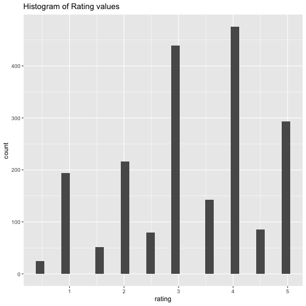
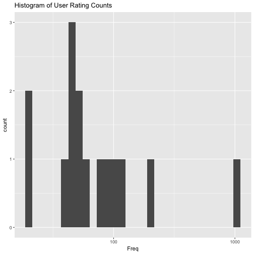
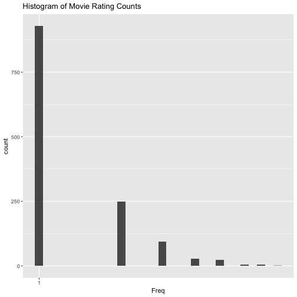
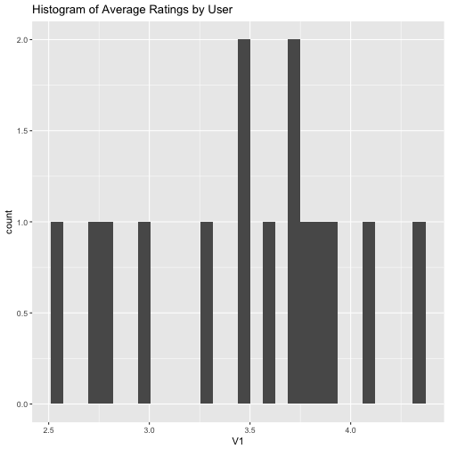
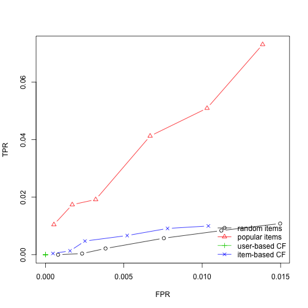

User-based recommendation
====
User based recommendation considers user-based signals, such as ratings, listens, likes, etc.  

Using these signals can model recommended content 
without knowing anything about the content at all! 
***
<a title="By Enoc vt (Own work) [CC BY-SA 3.0 (http://creativecommons.org/licenses/by-sa/3.0)], via Wikimedia Commons" href="https://commons.wikimedia.org/wiki/File%3ABot%C3%B3n_Me_gusta.svg"></a>


Collaborative Filtering
====

```r
library(plyr)
library(ggplot2)
ratings = read.csv("ml-latest-small/ratings.csv", nrows=2000)
head(ratings)
```

```
  userId movieId rating  timestamp
1      1      31    2.5 1260759144
2      1    1029    3.0 1260759179
3      1    1061    3.0 1260759182
4      1    1129    2.0 1260759185
5      1    1172    4.0 1260759205
6      1    1263    2.0 1260759151
```

User-based recommendation
====
- Collect ratings from users and items
- Find similar users to use as "peers"
- Use means/medians of scores from peer ratings
- Find high predicted scores on missing items to use as recommendations 

***
<a title="By Moshanin (Own work) [CC BY-SA 3.0 (http://creativecommons.org/licenses/by-sa/3.0) or GFDL (http://www.gnu.org/copyleft/fdl.html)], via Wikimedia Commons" href="https://commons.wikimedia.org/wiki/File%3ACollaborative_filtering.gif"></a>

User-based recommendation
====

```r
ggplot(ratings, aes(x=rating)) + 
  geom_histogram() + 
  labs(title="Histogram of Rating values")
```



User-based recommendation
===

```r
user_counts = as.data.frame(table(ratings$userId))
ggplot(user_counts, aes(x=Freq)) + 
  geom_histogram() + 
  scale_x_log10() + 
  labs(title="Histogram of User Rating Counts")
```



User-based recommendation
====

```r
movie_counts = as.data.frame(table(ratings$movieId))
ggplot(movie_counts, aes(x=Freq)) + 
  geom_histogram() + 
  scale_x_log10() + 
  labs(title="Histogram of Movie Rating Counts")
```




User-based recommendation
====

```r
mean.ratings = ddply(ratings, .(userId), function(x) mean(x$rating, na.rm=T))
ggplot(mean.ratings,aes(x=V1)) + 
  geom_histogram() + 
  labs(title="Histogram of Average Ratings by User")
```




User-based recommendation
====
The recommenderlab package is *recommended* as a platform for recommender system analysis
- User based CF
- Item based CF
- SVD based CF
- Popularity Recommender
- Random Recommender

```r
library(recommenderlab)
```

User-based recommendation
====
We need to transform the ratings information into a special matrix form

```r
mratings = daply(ratings, .(userId, movieId), function(x) x$rating)
mratings[1:10,1:10]
```

```
      movieId
userId  1  2  3  5  6 10 11 14 16 17
    1  NA NA NA NA NA NA NA NA NA NA
    2  NA NA NA NA NA  4 NA NA NA  5
    3  NA NA NA NA NA NA NA NA NA NA
    4  NA NA NA NA NA  4 NA NA NA NA
    5  NA NA  4 NA NA NA NA NA NA NA
    6  NA NA NA NA NA NA NA NA NA NA
    7   3 NA NA NA NA  3 NA NA NA NA
    8  NA NA NA NA NA NA NA NA NA NA
    9   4 NA NA NA NA NA NA NA NA  4
    10 NA NA NA NA NA NA NA NA NA NA
```

User-based recommendation
====

```r
rrm <- as(mratings, "realRatingMatrix")
rrm
```

```
15 x 1331 rating matrix of class 'realRatingMatrix' with 2000 ratings.
```

```r
getRatingMatrix(rrm)
```

```
15 x 1331 sparse Matrix of class "dgCMatrix"
                                                                        
1  . . . .   . . .   .   .   . . .   .   . . 2.5 . . . .   . . .   .   .
2  . . . .   . 4 .   .   .   5 . .   .   . . .   . . . 5.0 . . .   4.0 4
3  . . . .   . . .   .   .   . . .   .   . . .   . . . .   . . .   .   .
4  . . . .   . 4 .   .   .   . . .   .   . . .   . 5 . .   . . .   .   .
5  . . 4 .   . . .   .   .   . . .   .   . . .   . . . 4.0 . . .   .   .
6  . . . .   . . .   .   .   . . .   .   . . .   . . . .   . . .   .   .
7  3 . . .   . 3 .   .   .   . . 3.0 .   . . 3.0 . 4 . .   4 . .   .   .
8  . . . .   . . .   .   .   . . .   .   . . .   5 . . .   . . 2.5 5.0 5
9  4 . . .   . . .   .   .   4 . .   .   . 3 .   . . 5 .   . . .   3.0 .
10 . . . .   . . .   .   .   . . .   .   . . .   . . . .   . . .   .   5
11 . . . .   . . .   .   .   . . .   .   . . .   . . . .   . . .   .   5
12 . . . .   . . .   .   .   . . .   .   . . .   . . . .   . . .   .   .
13 5 . . .   . . .   .   .   . . .   .   . . .   . . . .   . . .   2.5 .
14 . . . .   . . .   .   .   . . .   .   . . .   . . . .   . . .   .   .
15 2 2 . 4.5 4 3 2.5 2.5 3.5 3 1 4.5 2.5 3 . .   4 3 1 2.5 . 3 .   5.0 5
                                                                          
1  .   . . .   . . .   . . . . . .   . .   . . . .   . . . . . . . .   . .
2  3.0 . 3 .   . . .   . . . 4 . .   . .   . . 3 .   . 5 . . 4 . . .   3 .
3  .   3 . .   . . .   . . . 4 . .   . .   . . . .   . . . . . . . .   . .
4  .   . . .   . . .   . . . . . 5.0 . .   . 5 . .   . . . . 4 . . .   . .
5  .   . . .   . . .   . 4 . . . .   . .   . 4 . .   . 4 . . . . . .   . .
6  .   . . .   . . .   . . . . 4 .   . .   . . . .   . . . . . . 2 .   . .
7  .   . . .   . . .   . 3 . 5 . 4.0 . .   . 4 . .   . . 4 . . . . .   . .
8  .   . . .   . . .   . . . 4 . .   . .   . . . .   . . . . . . . .   . .
9  .   . . .   . . .   . . . . . .   . .   . . . .   . . . . . . . .   . .
10 .   . . .   . . .   . . . . . .   . .   . . . .   . . . 4 . . . .   . .
11 .   . . 1.0 . . .   . . . . . .   . .   4 . . .   . . . . . . . .   . .
12 .   . . .   . . .   . . . . . .   . .   . . . .   . . . . . . . .   . .
13 .   . . .   . . .   . . . 4 . .   . .   . . . .   . . . . . . . .   . .
14 .   . . .   . . .   . . . . . .   . .   . . . .   . . . . . . . .   . .
15 2.5 . 2 0.5 5 3 1.5 4 1 2 3 5 2.5 4 3.5 . . . 3.5 5 3 . . 1 2 . 0.5 3 4
                                                                          
1  . . . . . .   . . . . . . . . . .   . .   . .   . . . . . .   . . . .  
2  . . 3 3 . .   . . . . . 3 3 . . .   . 3.0 . .   . 5 1 3 . .   . . 3 .  
3  . . . . . .   . . . . . . . . . .   . .   . .   . . . . . .   . . . .  
4  . . . . . .   . 3 . . . 3 . . . .   . .   . .   . . . . . .   . . . .  
5  . . . . . .   . . . . . . . . . .   . .   . .   . . . . . 3.5 . . . .  
6  . . . . . .   . 2 . . . . . . . .   . .   . .   . . . . . .   . . . .  
7  . . . . . .   . . . . . . . . . 2.0 3 .   . .   . . . . . .   . . . .  
8  . . . . . .   . . . . . . . . . .   . .   . .   . . . . . .   . . . .  
9  . . . . . .   . . . . . . . . . .   . .   . .   . . . . . .   . . . .  
10 . . . . . .   . . . . . . . . . .   . .   . .   . . . . . .   . . . .  
11 . . . . 3 .   . . . . . . . . . .   . .   . .   . . . . . .   . . . .  
12 . . . . . .   . . . . . . . . . .   . .   . .   . . . . . .   . . . .  
13 . . . . . .   . . . . . . . . . .   . .   . .   . . . . . .   . . . .  
14 . . . . . .   . . . . . . . . . .   . .   . .   . . . . . .   . . . .  
15 2 4 3 . . 2.5 1 . 4 4 3 2 . 1 2 1.5 . 1.5 2 4.5 1 . 4 1 1 3.5 4 4 4 3.5
                                                                        
1  . .   . . . .   . . . . . . .   . . . . . .   . . . . . . . .   . .  
2  . .   3 . 4 .   4 5 5 . 3 4 .   . . . 3 . 4.0 3 . . . 4 . 2 .   1 .  
3  . 3.5 . . . .   . . . 3 . . .   . . . . . 4.5 . . . . . . . 5.0 . .  
4  . .   . . . 5.0 . . . . . . .   . . 4 . . 5.0 . . . . . . . .   . .  
5  . .   . . . .   . . . . . . 4.5 . . . . . .   . . . . . . . .   . .  
6  . .   . . . .   . . . . . . .   . . . . 5 .   . . . . . . . .   . .  
7  . .   . . . 5.0 . . . . 3 . .   . . . . . .   . . . . . 2 . 5.0 . .  
8  . .   . . . 3.5 . . . . . . .   2 . . . . 4.0 . . . . . . . 5.0 . .  
9  . .   . . . .   . . . . . . .   . . . . . .   . . . . . . . 4.0 . .  
10 . .   . . . .   . . . . . . .   . . . . . .   . . . . . . . 4.0 . .  
11 . .   . . . .   . . . . . . .   . . . . . 5.0 . . . . . . . .   . .  
12 . .   . . 3 .   . . . . . . .   . . . . . .   . . . . . . . .   . .  
13 . .   . . . .   . . . . . . 4.0 . . . . . 3.5 . . . . . . . 4.5 . .  
14 . .   . . . .   . . . . . . .   . . . . . .   . . . . . . . .   . .  
15 5 2.0 . 2 2 5.0 . 1 . . . . .   . 2 . 1 5 5.0 4 5 4 4 . 3 1 2.0 . 2.5
                                                                          
1  .   . . .   . .   . . . . .   . .   .   . . .   . . .   .   . .   . . .
2  .   . . 3.0 . .   . 4 4 . .   3 3.0 .   3 3 2.0 3 3 .   3.0 . 3.0 2 3 .
3  .   . . .   . .   . . . . 2.5 5 .   .   . . .   . . .   2.5 . .   . . .
4  3.0 . . .   . .   . 5 . . .   5 5.0 .   5 4 .   . . .   .   3 .   . 3 .
5  .   . . .   . 3.5 . . . . .   4 .   .   4 4 .   . . .   4.0 . .   . . .
6  .   . . .   . .   . . . . .   . .   .   . . .   . . .   .   . .   . . .
7  3.0 3 . .   . .   3 . . . 3.0 3 3.0 .   3 3 .   . . .   3.0 4 .   . . .
8  .   . . .   . .   . . . . .   4 .   .   . . .   . . .   .   . .   . . .
9  .   . . .   . .   . . . . .   . .   .   . . .   . . .   .   . .   . . .
10 .   . . .   . 3.0 4 . . . .   . .   .   . . .   . . .   .   . .   . . .
11 .   . . .   . .   . . . . .   . .   .   . . .   . . .   .   . .   . . .
12 .   . . .   . .   . . . . .   . .   .   . . .   . . .   .   . .   . . .
13 .   . . .   . .   . . . . .   5 .   4.5 . . .   . . .   .   . .   . . .
14 .   . . .   . .   . . . . .   . .   .   . . .   . . .   .   . .   . . .
15 1.5 . 2 2.5 3 2.0 . 3 . 3 0.5 1 3.5 .   4 2 3.5 2 3 3.5 4.0 4 3.5 . . 1
                                                                          
1  . . . .   . . . .   . .   . . . . . . .   . . .   .   . . .   .   . . .
2  . . . .   . . 4 3.0 . .   4 . 2 4 . . 3.0 . 3 4.0 4.0 4 4 .   .   4 . .
3  . . . .   . . . .   . .   . . . . . . .   . . .   .   . . .   .   3 . .
4  3 4 1 4.0 . 4 . .   4 .   . . . 5 . . .   . . .   .   . . .   .   . . .
5  . . . 4.0 . . . .   . .   . . . . . . .   . . 4.5 .   . . .   .   . . .
6  . . . .   . . . .   . .   . . . . . . .   . . .   .   . . .   .   . . .
7  . . . .   . . . .   . .   . . . 4 . . .   . . 3.0 .   . . .   .   . . .
8  . . . .   . . . 4.5 . .   . . . . . . .   . . .   .   . . 3.5 2.0 5 . .
9  . . . .   . . . .   . .   . . . . . . .   . 4 .   .   . 4 .   .   5 . .
10 . . . .   . . . .   . .   . . . . . . .   . . .   .   . . .   .   . . .
11 . . . .   . . . .   . .   . . . . . . .   . . .   .   . . .   .   . . .
12 . . . .   . . . .   . .   . . . . . . .   . . .   .   . . .   .   . 1 .
13 . . . .   . . . .   . .   . . . 3 . . .   . . .   .   . . .   3.5 4 . 4
14 . . . .   . . . .   . .   . . . . . . .   . . .   .   . . .   .   . . .
15 4 3 1 2.5 4 1 3 5.0 . 2.5 . 3 3 3 3 1 0.5 4 . 3.0 1.5 2 . 3.5 2.5 4 . .
                                                                          
1  . . . . . .   . . . . . . . .   . . . . . .   . . . .   .   . . .   . .
2  . . 4 . 3 .   . . . 3 5 3 . .   . . 5 3 3 3.0 5 5 5 3.0 .   . . .   . .
3  . . . . . .   . . . . . . . .   . . . . . 3.0 . . 3 3.0 .   2 . .   . .
4  . . . . . .   5 . . . . . . .   . . . . . 5.0 5 3 . .   5.0 . 5 .   . 4
5  . . . . . .   . . . . . . . .   . . . 4 . 3.5 . . . .   .   4 . 5.0 . .
6  . . . . . .   . . . . . . . .   . . . . . .   . . . .   .   . 4 .   . .
7  4 . . . 3 .   4 . . . 4 . . .   . . . . . 4.0 3 4 3 .   4.0 3 . .   . 3
8  . . . . . .   . 5 . . . . . .   . . . . . .   4 . . 4.5 .   . . .   . .
9  5 . . . . .   . . . . . . . .   . . . . . .   . . . 4.0 .   . . .   5 .
10 . . . . . .   . . . . . . . .   . . . . . .   . . 3 .   .   . . .   . .
11 . . . . . .   . . . . . . . .   . . . . . .   . . . .   .   . . .   . .
12 . . . 3 . .   . . . . . . . .   . . . . . .   . . . .   .   . . .   2 .
13 . . . . . .   . . . . . . . .   . . . . 3 .   . 4 . .   .   . . .   . .
14 . . . . . .   . . . . . . . .   . . . . . .   . . . .   1.0 . . .   . .
15 . 3 . . 2 1.5 5 3 5 . 2 . 4 3.5 3 3 . 2 1 0.5 4 3 4 5.0 2.5 . . 2.5 5 3
                                                                        
1  . .   .   . . . . . . . . . . . .   . .   . . .   . . .   .   .   .  
2  3 .   .   . 4 . . . . . . . 4 . .   . .   . . .   . . .   .   .   .  
3  . .   .   . . . . . . . . . . . .   . 3.5 . . .   . . 4.0 .   .   .  
4  5 .   .   . . . . . . . . . . . .   . .   . . .   . . .   .   .   .  
5  . .   .   . . . . . . . . . . . .   . .   . . .   . . .   .   .   .  
6  . .   .   . . . . . . . . . . . .   . .   . . .   . . .   .   .   .  
7  . .   .   . . . . 4 . . . 3 5 2 .   . 1.0 1 5 .   . . .   3.0 .   .  
8  . 4.0 .   . . . . . . . . . . . .   . .   . . .   . . .   .   .   .  
9  . .   .   . . . . . . . . . . . 2.0 . .   . . .   . . .   .   .   .  
10 . .   .   . . . . . . . . . . . .   4 .   . . .   . . .   .   .   .  
11 . .   .   . . . . . . . . . . . .   . .   . . .   . . 4.5 .   .   3.5
12 . .   .   . . . . . 1 . . . . . .   . 4.0 3 . .   . . .   .   .   .  
13 . .   .   . . . . . . . . . . . .   . .   . . .   . . .   .   .   .  
14 . .   .   . . . . . . . . . . . .   . .   . . .   . . .   .   .   .  
15 . 2.5 1.5 4 . 2 3 . . 3 2 3 3 2 3.5 . 1.0 . 3 2.5 4 2 4.0 2.5 2.5 3.0
                                                                        
1  .   .   . . . .   .   .   . . . .   . . .   . . . .   . . . .   . .  
2  .   .   . . . .   .   .   . . . .   . . .   . . . .   . . . .   . .  
3  .   .   . . . .   .   .   . . . .   3 . .   . . . .   . . . .   . .  
4  .   .   . . . .   .   .   . . . 5.0 . . 5.0 . . . 4.0 . . 5 .   . 5.0
5  .   3.5 . . . .   .   .   . . . 2.5 . . 3.5 . . . .   . . . .   . 4.0
6  .   .   . . . .   .   .   . . . .   . . 4.0 . . . .   . . . .   . .  
7  2.0 .   . . . .   .   .   . . . .   . . .   . . . .   . . . .   . .  
8  .   .   . . . .   .   3.5 . . . 5.0 . . .   . . . .   . . . .   . .  
9  .   .   . . . .   .   .   . . . .   . . .   . . . .   . . . .   . .  
10 .   .   . . . .   .   .   . . . .   . . .   . . . .   . . . .   . .  
11 .   .   . . . .   .   .   . . . .   . . .   . . . .   . . . .   . .  
12 .   .   . . . .   .   .   . . . .   . . .   . . . .   . . . .   . .  
13 .   .   . . . .   .   .   . . . .   . . .   . . . .   . . . 4.0 . 3.5
14 .   .   . . . .   .   .   . . . .   . . .   . . . .   . . . .   . .  
15 0.5 1.5 3 5 1 4.5 3.5 .   1 2 4 5.0 4 5 5.0 5 5 4 2.5 4 5 4 1.5 1 3.0
                                                                          
1  .   . . . . . . . . . . . .   . 3 . . . . . . . .   .   . 3 . . . . . .
2  .   . . . . . . . . . . . .   . . . . . . . . . .   .   . . . . . . . .
3  .   . . . . . . . . . . . .   . . . . . . . . . .   .   . . . . . . . .
4  .   . . . . . . . 4 4 . 5 .   5 . 5 5 5 5 . 5 . .   .   . . 5 . 5 . . .
5  .   . . . . . . . . . . 4 .   . . . . . . 5 . . .   .   . . . . . . . .
6  .   . . . . . . . . . . . .   . . . . . . . . . .   .   . . . . . . . .
7  .   . . 4 . . . . . . . . .   . . . . . . . 3 . .   .   . . 3 . 4 4 . .
8  .   . . . . . . . . . . . .   . . . . . . . . . .   .   . . . . . . . .
9  .   . . . . . . . . . . . .   . . . . . . . . . .   5.0 . . . . . . . .
10 .   . . . . . . . . . . . .   . . . . . . . 3 . .   .   . . . . . . . .
11 .   . 5 . . . . . . . . . 4.5 . . . . . . . . . .   .   . . . . . . . .
12 .   . . . . . . . . . . . .   1 . . . 2 . . . . .   .   . . . 3 . . . .
13 .   . . . . . . . . . . . 3.0 . . . . . . . . . .   .   . . . . . . . .
14 .   . . . . . . . . . . . .   . . . . . . . . . .   .   . . . . . . . .
15 3.5 1 5 5 3 1 3 4 . . 2 . .   . . . . . . 2 4 5 2.5 1.5 4 . 3 . 4 . 3 2
                                                                        
1  . .   . . . . .   . . . . 2 .   .   .   . . 4 . . . . . . .   .   . .
2  . .   . . . . .   . . . . . .   .   .   . . . . . . . . . .   .   . .
3  . .   . . . . .   . . . . . .   .   .   . . . . . . . . . .   .   . .
4  5 .   . . . 5 .   . . 5 5 . .   5.0 .   . . . . . . . . . .   .   . 5
5  . .   . . . . .   . . . . . .   .   .   . . . . . . . . . .   .   3 .
6  . .   . . . . .   . . . . . .   .   .   . . . . . . . . . .   .   . .
7  . .   . . . 3 .   . . 3 . 3 .   4.0 .   5 . . . . . . . . .   .   . .
8  . .   . . . . .   . . . . . .   .   .   . . . . . . . . . .   .   . .
9  . .   . . . . .   . . . . . .   .   .   . . . . . 3 . . . .   .   . .
10 3 .   . . . . .   2 . . 4 . .   .   .   . . . . . . . . . .   .   . .
11 . .   . . . . .   . . . . . .   .   .   . . . . . . . . . .   .   . .
12 . .   . . . . .   . . . . . .   .   .   . . . . . . . . . .   .   . .
13 . .   . . . . .   . . . . . .   .   .   . . . . . . . . . .   .   . .
14 . .   . . . . .   . . . . . .   .   .   . . . . . . . . . .   .   . .
15 4 2.5 2 4 4 4 2.5 3 1 . 4 . 2.5 2.5 3.5 3 4 . 3 4 . 3 4 2 4.5 3.5 5 .
                                                                          
1  .   . . . . .   . . . . . .   . .   . . . .   . . . . .   . . . . . . .
2  .   . . . . .   . . . . . .   . .   . . . .   . . . . .   . . . . . . .
3  .   5 . . . .   . . . . . .   3 .   . . . .   . . . . .   . . . . . . .
4  5.0 5 5 . 5 .   . . 5 . 5 .   5 .   . 5 5 .   . . 5 5 .   5 . 5 . 5 . .
5  .   . . . . .   . . . . . .   . .   . . . .   . . . . 2.5 . . . . . . .
6  .   . . . . .   . 5 . . . .   . .   . . . .   . . . . .   . . . . . . .
7  5.0 3 5 . . .   . . . . . .   5 .   . . . .   . . . 4 .   . 5 5 . . 4 .
8  3.5 4 4 . . .   . . . . . .   4 .   . . . .   . . 4 . .   . . 4 . . . .
9  .   . . . . .   . . . . . .   . .   . . . .   . . . . .   . . . . . . .
10 4.0 4 4 . 4 .   . . . . . .   4 .   . . . .   . . . 3 .   . . . . . . .
11 .   . . . . 5.0 . . . . . .   . .   . . . .   . . . . .   . . . . . . .
12 .   1 . . . .   . . . . . .   . .   . . . 5.0 . . . 5 .   . . . . 2 . .
13 .   . . . . .   . . . . . .   . .   . . . .   . . . . .   . . . . . . .
14 4.0 . . . . .   . . . . . .   . .   . . . .   . . . . .   . . . . . . .
15 5.0 1 4 1 4 3.5 4 2 5 3 5 4.5 5 1.5 3 3 4 1.5 2 4 3 1 5.0 4 4 4 4 3 4 3
                                                                        
1  . .   . . . . . . . . .   . . .   . . .   . .   2 . .   . . . . .   .
2  . .   . . . . . . . . .   . . .   . . .   . .   . . .   . . . . .   .
3  . 4.0 . . . . . . . . .   . . .   . . .   . .   . . .   . . . 3 .   .
4  . .   5 . 5 . . . . . .   . . .   5 5 4.0 . .   . . 5.0 . . 5 . .   .
5  . .   . . . . . 4 . . .   . . .   . . .   . .   . . .   . . . . .   .
6  . .   . . . . . . . . 4.5 . . .   . . 4.5 . .   . . .   . . . . .   .
7  . .   4 5 . . . . . . .   . . .   . . .   . .   . . .   . . 3 . .   4
8  . .   . . . . . . . . .   . . .   . 4 4.0 . .   . . 3.0 . . 4 . .   .
9  . .   . . . . . . . . .   . . .   . . .   . .   . . .   . . . . .   .
10 . .   4 . . . . . . . .   . . .   . . .   . .   . . .   . . . . .   .
11 . .   . . . . . . . . .   . . .   . . .   . .   . . .   . . . . .   .
12 . 5.0 . . . . . . . . .   . . .   . . .   . .   . . .   . . . . .   .
13 . .   . . . . . . . . .   . . .   . . 4.0 . .   . . 2.5 . . . . .   .
14 . .   . . . . . . . . .   . . .   . . .   . .   . . .   . . . . .   .
15 4 3.5 3 . 2 5 1 5 3 3 4.0 3 5 3.5 . 4 3.0 3 1.5 4 3 4.0 4 5 5 . 3.5 .
                                                                          
1  .   . . . . . . .   2 . . . . 2 . . . .   . . . . . . . 3.5 . 2 . . . .
2  .   . . . . . . .   . . . . . . . . . .   . . . . . . . .   . . . . . .
3  .   . . . . . . .   . . . . . . . . . .   . . . . . . . .   . . . . . .
4  .   5 . . 5 . . 4.0 . 5 . . 5 . . . 4 .   . . 4 . 4 . 5 .   . . 5 . 4 .
5  .   . . . . . . .   . . . . . . . . . .   . . 4 . . . . .   . . . . . .
6  4.5 . . . . . . 4.5 . . . . . . . . . .   . . . . . . . .   . . . . . .
7  .   3 . . . . . .   4 4 . . 3 . . . 3 4.0 . . 3 . . . . .   . . . 3 . .
8  .   . . . . . . .   . . . . 4 . . . . 3.5 . . . . . . . .   . . . . . .
9  .   . . . . . . .   . . . . . . . . . .   . . . . . . . .   . . . . . 4
10 .   . . . . . . .   . . . . 4 . . . . .   . . . . . . . .   . . . . . .
11 .   . . . . . . .   . . . . . . . . . .   . . . . . . . .   . . . . . .
12 .   . . . . . . .   . . . . . . 1 . . .   . . . . . . . .   . . . . . .
13 .   . . . . . . .   . . . . . . . . . .   . . . . . . . .   . . . . . .
14 .   . . . . . . .   . . . . . . . . . .   . . . . . . . .   . . . . . .
15 2.5 . 3 1 . 3 3 .   2 4 4 3 4 4 . 4 . 3.0 2 3 5 3 . 2 2 2.0 2 . . . 2 .
                                                                        
1  .   .   . 2.5 . . . . . . . .   . . . .   .   . . 1 . . . . . . . . .
2  .   .   . .   . . . . . . . .   . . . .   .   . . . . . . . . . . . .
3  .   .   . .   . . . . . . 4 .   . . . .   .   . . . . . . . . . . . .
4  .   .   . 4.0 3 . 4 . 3 3 . 5.0 . 5 4 .   .   . 5 . . . . . . . . . .
5  .   .   . .   . . . . . . . 5.0 . . . .   3.5 . . . . . . . . . . . .
6  2.0 .   . .   . . . . . . . .   . . . .   .   . . . . . . . . . . . .
7  .   .   . 3.0 3 2 4 3 3 . . .   . . . .   .   3 . 5 . 1 . . . . . . .
8  0.5 .   . .   . . . . . . . .   . 4 . .   3.0 . . . . . . . . . . . .
9  4.0 .   . .   . . . . . . . .   . . . .   .   . . . . . 3 . . . . . .
10 5.0 .   . .   . . . . . . . .   . . . .   .   . . . . . . 4 . 3 . . .
11 .   .   . .   . . . . . . . .   . . . .   .   . . . . 5 . . . . . . .
12 .   .   . .   . . 1 . . . . .   . 4 . .   .   . . . . . . . . . . . .
13 .   .   . .   . . . . . . . .   . . . .   .   . . . . . . . . . . . .
14 .   .   . .   . . . . . . . .   . . . .   .   . . . . . . . . . . . .
15 1.0 3.5 3 .   . . . . . 3 . 2.5 3 4 . 0.5 3.5 4 4 3 5 . . . 4 . 4 4 3
                                                                          
1  .   . . .   . . .   . . . . . . .   . .   .   .   .   . .   . . . . . .
2  .   . . .   . . .   . . . . . . .   . .   .   .   .   . .   . . . . . .
3  .   . . .   . . .   . . . . . . .   . .   .   .   .   . 3.5 . . . . . .
4  .   . . .   . . .   . . . . . . 3.0 . .   .   .   .   . 5.0 . . . . . .
5  .   . . 4.5 . . .   . . . . . . 3.5 . .   .   .   .   . .   . . . . . .
6  .   . . .   . . .   . . . . . . .   . .   .   .   .   . .   . . . . . .
7  .   . . .   . . .   . . . . . . .   . .   .   .   .   . .   . . . . . .
8  .   . . .   . 4 .   . . . . . . .   . 3.0 .   .   .   . .   . . . . . .
9  .   . . .   . . .   . . . . . 2 .   . .   .   .   .   . .   4 . . . . .
10 .   . . .   3 . .   . . . . . . .   . .   .   .   .   . .   . . . . . 5
11 .   . . .   . . .   . . . . . . .   . .   .   .   .   . .   . . . . . .
12 .   . . .   . . .   . . . . . . .   . .   .   .   .   . .   . . . . . .
13 .   . . .   . . .   . . . . . . .   . .   .   .   .   . .   . . . . . .
14 .   . . .   . . .   . . . . . . .   . .   .   .   .   . .   . . . . . .
15 1.5 3 3 3.0 . 3 1.5 1 2 3 1 3 . 1.0 4 1.5 2.5 1.5 3.5 4 4.0 4 2 2 1 3 .
                                                                        
1  . . .   . . . .   . . . . . . . . . . .   . . . . . .   .   . .   .  
2  . . .   . . . .   . . . . . . . . . . .   . . . . . .   .   . .   .  
3  . . .   . . . .   . . . . . . . . . . .   . . . . . 4.5 .   . .   .  
4  . . .   . . . .   . . . 4 . 5 . . . . .   . . . . . .   .   . .   .  
5  . . .   . . . .   . . . . . . . . 4 . .   . . . . . 4.0 .   . .   .  
6  . . .   . . 2 .   . . . . . . . . . 2 .   . . . . . .   .   . .   .  
7  . . .   . . . .   . . . . . . . . . . .   . . . . . .   .   . .   .  
8  . . 3.5 5 . . .   . . . . . 4 . . . . .   . . 4 . . .   .   . .   .  
9  . . .   . . . .   . . . . . . . 4 5 . .   . . 4 . . 3.0 .   . .   .  
10 . . .   . . . .   . . . . . . . . . . .   3 . 4 . 5 .   .   . .   .  
11 . . .   . . . .   . . . . . . . . . . .   . . . . . .   .   . .   .  
12 . . .   . . 2 .   . . . . . . . . . . .   . . . . . .   .   . 3.0 .  
13 . . .   . . . .   . . . . . . . . . . .   . . . . . .   .   . .   .  
14 . . .   . . . .   . . . . . . . . . . .   . . . . . 3.0 .   . .   .  
15 3 3 5.0 4 4 4 1.5 3 2 3 3 3 . 4 3 2 . 4.5 1 3 4 4 4 1.5 3.5 1 3.5 0.5
                                                                          
1  .   . .   . .   . . .   . . .   .   .   . . .   . . . . . . .   .   . .
2  .   . .   . .   . . .   . . .   .   .   . . .   . . . . . . .   .   . .
3  .   . .   . .   . . .   . . .   .   .   . . .   . . . . . . .   .   . 4
4  .   . .   . .   . . .   . 1 .   .   .   . . .   . . 5 . . . .   .   . .
5  .   . .   . .   4 . 4.5 . . .   .   .   . . .   . . . . . . .   .   . .
6  2.0 . .   . .   . . .   . . .   .   .   . . .   . . . . . . 0.5 .   . .
7  .   . .   . .   . . .   . . .   .   .   . . .   . . . . . . .   .   . .
8  .   . .   . 3.0 5 . .   . . .   .   .   . . .   . . . . . . 3.5 .   . .
9  .   . .   . .   . . 5.0 . . .   .   .   . . .   . . . . . . .   .   . .
10 .   . .   . .   . . .   . . .   .   .   . . .   . . . . . . .   .   . .
11 .   . .   . .   . . .   . . .   .   .   . . .   . . . . . . .   .   . .
12 .   . .   . .   . . .   . . .   .   .   . . .   . . . . . . .   .   . .
13 .   . .   . .   . . .   . . .   .   .   . . .   . . . . . . .   .   . .
14 .   . .   . .   . . .   . . .   .   .   . . .   . . . . . . .   .   . .
15 3.5 4 3.5 1 3.5 2 1 3.0 3 3 1.5 2.5 2.5 4 2 3.5 2 4 . 5 4 2 2.0 1.5 4 .
                                                                          
1  . . .   .   .   . . .   . . . .   . . . 4 . .   . .   . . . . .   .   .
2  . . .   .   .   . . .   . . . .   . . . . . .   . .   . . . . .   .   .
3  . . .   .   .   . . .   . . . .   . . . . . .   . .   . . . . .   .   .
4  . . .   .   .   . . .   4 2 . .   . . . 5 5 .   . 5.0 . . 3 5 5.0 .   5
5  . . .   .   .   . . .   . . . 4.5 . . . . . .   . 4.0 . . . 4 .   3.5 .
6  . . .   .   .   3 . .   . . . .   . . . . . .   . .   . . . . .   .   .
7  . . .   .   .   . . .   . . . .   . . . . . .   . .   . . . . .   .   .
8  . . .   .   .   . . .   . . . .   . . . . . .   . 5.0 . . . . .   .   .
9  . . .   .   .   . . .   . . . .   . . . . . .   . .   . . . . .   .   .
10 2 . .   .   .   . . .   . . . 5.0 . . . . . .   . .   . . . . .   .   .
11 . . .   .   .   . . .   . 3 . .   . . . . . .   . .   . . . . .   .   .
12 . . .   .   .   . . .   . . . .   . . . . . .   . .   . . . . .   .   .
13 . . .   .   .   . . .   . 3 . .   . . . . . .   . 4.0 . . . . .   .   .
14 . . .   .   .   . . .   . . . .   . . . . . .   . .   . . . . .   .   .
15 . 3 2.5 1.5 3.5 2 5 3.5 2 . 4 4.5 4 3 3 3 3 4.5 4 3.5 3 3 . 4 2.5 5.0 3
                                                                          
1  . . . . . . . . . . .   .   . .   . . . . . . .   . . .   . .   . . . .
2  . . . . . . . . . . .   .   . .   . . . . . . .   . . .   . .   . . . .
3  . . . . . . . . . . .   .   . .   . 4 . . . . .   . . .   . .   . . . .
4  . 3 2 5 . . . . 4 5 .   4.0 4 .   . . 4 4 . . .   5 3 .   . 5.0 . . 5 5
5  . . . . . . . . . . .   .   . 1.5 . . . . . . .   . . .   . .   . . . .
6  3 . . . . . . . . . 4.0 .   . .   . . . . . . .   . . .   . .   4 . . .
7  . . . . . . . . . . .   .   . .   . . . . . . .   . . .   . .   . . . .
8  . . . . . . . . . . .   .   . .   . 4 . . . . .   . . .   . .   . . . .
9  . . . . . . . . . . .   .   . .   . 4 . . . . .   . . .   . .   . . . .
10 . . . . . . . . . . .   .   . .   . . . . . . .   . . .   . .   . . . .
11 . . . . . . . . . . .   .   . .   . . . . . . 3.5 . . .   . .   . . . .
12 . . . . . . . . . . .   .   . .   . . . . . . .   . . .   . .   . . . .
13 . . . . . . . . . . .   .   . .   . . . . . . .   . . .   . .   . . . .
14 . . . . . . . . . . .   .   . .   . . . . 3 . .   . . .   . .   . . . .
15 . . 3 4 4 3 3 1 . 2 4.5 2.5 . .   2 3 . . . 2 .   . 2 2.5 2 4.5 . 3 . .
                                                                          
1  . . . . . . . . . 4 .   . . . . . . . .   .   . . . . . . 3 . . . . . 2
2  . . . . . . . . . . .   . . . . . . . .   .   . . . . . . . . . . . . .
3  . . . . . . . . . . .   . . . . . . . .   .   . . . . . . . . . . . . .
4  4 5 5 5 5 4 5 5 5 4 .   5 3 5 5 4 . . .   .   . 5 4 4 5 . . . 5 . 5 . 3
5  5 . . . . . . . . . .   . . . . . . . .   .   . . . . . . . . . . . . .
6  . . . . . . . . . . .   . . . . . . . .   .   . . . . . . . . . . 4 . .
7  . . . . . . . . . . .   . . . . . . . .   .   . . . . . . . . . . . . .
8  . . . . . . . 3 . . .   . . . . . . . .   .   3 . . . . . . . . . . . .
9  . . . . . . . . . . .   . . . . . 4 . .   .   . 4 . . . . . . . . . . .
10 . . . . . . . . . . 3.0 . . . . . . . .   .   . . . . . . . . . . . . .
11 . . . . . . . . . . .   . . . . . . . .   .   . . . . . . . . . . . . .
12 . . . . . . . . . . .   . . . . . . . .   .   . . . . . . . . . . . . .
13 . . . . . . . . . . .   . . . . . . . .   .   . . . . . . . . . . . . .
14 . . . . . . . . . . .   . . . . . . . .   .   . . . . . . . . . . . . .
15 . . . . . . . 2 . 4 4.5 . . . 4 2 . 1 3.5 3.5 . 3 . . . 2 3 3 3 3 4 3 .
                                                                          
1  .   . . .   .   . . . . .   .   .   .   . . . 2 .   . . .   .   .   . .
2  .   . . .   .   . . . . .   .   .   .   . . . . .   . . .   .   .   . .
3  .   . . .   .   . . . . .   .   .   .   . . . . .   . . .   4.0 .   . .
4  5.0 . . .   4.0 . . 3 5 .   .   .   .   . 5 . . .   . . .   .   .   . .
5  .   . . .   .   . . . . .   4.0 .   .   . . . 4 .   . . .   .   .   . .
6  .   . . .   .   . . . . .   .   .   .   . . . . .   . . .   .   .   . .
7  .   . . .   .   . . . . .   .   .   .   . . . . .   . . .   .   .   . .
8  4.5 . . .   .   . . . . .   .   .   .   . . . . 4.5 . . .   .   .   4 5
9  .   . . .   .   4 . . 3 .   3.0 4.0 .   . . 4 2 4.0 . . .   .   .   . .
10 .   . . .   .   . . . . .   .   .   .   . . . . .   . . .   .   .   . .
11 .   . . .   .   . . . . .   .   .   .   . . . . .   . . .   .   .   . .
12 .   . . .   .   . 2 . . .   .   .   .   . . . . .   . . .   .   .   . .
13 .   . . .   .   . . . . .   .   .   .   . . . . .   . . .   .   .   . .
14 .   . . .   .   . . . . .   .   .   .   . . . . .   . . .   .   .   . .
15 4.0 3 4 4.5 3.5 . . . 1 2.5 2.5 2.5 0.5 3 4 3 2 3.5 3 2 3.5 4.5 3.5 2 1
                                                                        
1  . . . . . . . .   .   . . . . .   . .   . . . . . . .   . . . .   .  
2  . . . . . . . .   .   . . . . .   . .   . . . . . . .   . . . .   .  
3  . . . . . . . .   .   . . . . .   . .   . . . . . . .   . . . .   .  
4  . . . . . 4 . .   .   . . . . 4.0 . .   . . . . 4 . 5.0 . 4 . .   .  
5  . . . . . . . .   3.5 . . . . .   . .   . . . . . . .   . . . .   .  
6  . . . . . . . .   .   . . . . .   . .   . . . . . . .   . . . .   .  
7  . . . . . . . .   .   . . . . .   . .   . . . . . . .   . . . .   .  
8  . . . . . . . 3.5 .   . . . . .   . .   . . . . . . .   . . . .   3.5
9  . . . . . . . .   .   . . . . .   . .   4 . . 4 . . .   . . . .   .  
10 . . . . 5 . . .   .   . . . . .   . .   . . . . . . 4.0 . . 2 .   .  
11 . . . . . . . .   .   . . . . .   . .   . . . . . . .   . . . .   .  
12 . . . . . . . .   2.0 . . . . .   . .   . . . . . . .   . . . .   .  
13 . . . . . . . .   4.0 . . . . .   . .   . . . . . . .   . . . .   .  
14 . . . . . . . .   2.0 . . . . .   . .   . 3 . . . . .   . . . .   .  
15 3 3 2 2 . . 1 0.5 2.0 3 2 3 1 3.5 3 3.5 3 . 5 2 . 3 3.5 3 . . 4.5 .  
                                                                        
1  .   . . . .   . 2.5 . . . . . .   .   . . . .   . . . . .   . .   . .
2  .   . . . .   . .   . . . . . .   .   . . . .   . . . . .   . .   . .
3  .   . . . .   . .   . . . . . .   .   3 . . .   . . . . .   . .   . .
4  .   . . . .   5 .   . 5 . . . .   .   . . . .   . . 4 . .   . .   . .
5  4.0 . . . .   . .   . . . . . 3.5 .   . . . .   . . . . .   . .   . .
6  .   . . . .   . .   . . . . . 3.5 .   . 3 4 .   . . . . .   1 .   . .
7  .   . . . .   . .   . . . . . .   .   . . . .   . . . . .   . .   . .
8  .   . . . .   . .   . . . . . 5.0 .   . . . .   . . . . .   5 .   . .
9  .   2 . . .   . .   . . . 3 4 .   .   . . . 2.0 . . . . .   5 .   . .
10 .   . . . .   . .   . . . . . .   .   . . . 4.0 . . . . .   5 .   . .
11 .   . . . .   . .   . . . . . .   .   . . . .   . . . . .   . .   . .
12 .   . . . .   . .   4 . . . . .   .   . . 1 .   . . . . .   . .   . .
13 .   . . . .   . .   . . . . . .   .   . . . .   . . . . .   3 3.5 . .
14 .   . . . .   . .   . . . . . .   .   . . . .   . . . . .   . .   . .
15 1.5 3 1 2 2.5 . 3.5 . 1 4 1 3 5.0 0.5 . 2 . 2.5 1 1 . 3 0.5 5 5.0 1 3
                                                                          
1  .   . . . . .   .   . . . . . . .   . . . . . . . . . . .   . . . .   .
2  .   . . . . .   .   . . . . . . .   . . . . . . . . . . .   . . . .   .
3  .   . . . . .   .   . . . . . . .   . . . . . . . . . . 3.0 . . . 3.5 .
4  .   . . . . .   .   . . . 1 . . 5.0 5 . . 3 . . . 4 . . .   4 . . .   .
5  .   . . . . .   .   . . . . . . .   . . . . . . . 4 . . 4.5 . . . .   4
6  .   . . . . .   .   . . . . . . .   . . 2 . . . . . . 4 .   . . . .   .
7  .   . . . . .   .   . . . . . . .   . . . . . . . . . . .   . . . .   .
8  .   . . . . .   .   . . . . . . .   . . . . . . . . . . .   . . . .   .
9  .   . . . . .   .   . . . . . . 3.0 . . . . . . . . . . .   . . . .   .
10 .   . . . . .   .   . . . . . . .   . . . . . . . . . . .   . . . .   .
11 .   . . . . 4.5 .   . . . . . . .   . . . . . . . . . . .   . . . .   .
12 .   . . . . .   .   . . . . . . .   . . . . 2 . . . . . .   . . . .   .
13 .   . . . . .   .   . . . . . . .   . . . . . . . . . . .   . . . .   .
14 .   . . . . .   .   . . . . . . 3.0 . . . . . . . 2 . . .   . . . .   .
15 2.5 3 1 1 4 .   1.5 3 3 1 . 1 3 2.5 4 3 2 . . 4 1 1 3 3 .   3 3 1 1.5 3
                                                                        
1  . . . . . .   .   .   . . . . .   . . . .   .   . . .   . .   .   .  
2  . . . . . .   .   .   . . . . .   . . . .   .   . . .   . .   .   .  
3  . . . . . 3.0 .   .   . . . . .   . . . .   3.5 . . .   . .   .   .  
4  . . . . . 5.0 .   .   . . 5 . .   . 4 . .   .   . . 1.0 5 5.0 4.0 5.0
5  . . . . . .   .   .   . . . . .   . . . .   3.5 . . 3.5 . .   .   .  
6  . . . . . .   .   .   . . 3 . .   . . . 4.5 .   . . .   . .   .   .  
7  . . . . . .   .   .   . . . . .   . . . .   .   . . .   . .   .   .  
8  . . . . . 3.5 .   .   . . . . .   . . . .   4.5 . . 2.5 . 4.5 .   3.5
9  . . . . . .   .   .   . . . . .   . . . .   4.0 . . .   . .   .   .  
10 . . . . . .   .   .   . . . . .   . . . .   .   . . .   . .   .   .  
11 . . . . . .   .   .   . . . . .   . . . .   3.0 . . .   . .   .   .  
12 . . . . . .   .   .   . . . . .   . . . .   .   . . .   . .   .   .  
13 . . . . . .   .   .   . . . . .   . . . 4.0 3.0 . . .   . .   .   .  
14 . . . . . 3.0 .   .   2 . . 3 .   . . . .   .   . . .   . .   .   .  
15 3 1 1 4 1 4.0 3.5 1.5 . 2 1 . 2.5 3 . 1 2.0 1.0 1 2 4.0 . 4.0 3.5 4.0
                                                                          
1  .   .   . . . . . . . .   . . . . . . . . . . . . . .   . .   . . . . .
2  .   .   . . . . . . . .   . . . . . . . . . . . . . .   . .   . . . . .
3  .   .   . . . . . 4 . 4.0 . . . . . . . . . . . . . .   . .   . . . . .
4  .   5.0 . 3 . . . . . .   . 3 . 5 5 . . 2 1 . . . . .   4 5.0 . . . . .
5  .   .   . . . . . . . .   . . . . . . . . . . . . . .   . 3.5 . . . . .
6  .   .   . . . . . . . .   . . . . . . 3 . . . . . . .   . .   . . . . .
7  .   .   . . . . . . . .   . . . . . . . . . . . . . .   . .   . . . . .
8  .   3.5 . . . . . 3 . 4.5 . . . . . . . . . . . . . .   . 5.0 . . . . .
9  .   .   . . . . . . 4 .   . . . . . . . . . . . . . .   . .   . . . . .
10 .   .   . . 5 3 3 4 . .   . . . . . 3 4 . . . 2 . . .   . .   . 5 . . .
11 .   .   . . . . . . . .   . . . . . . . . . . . . . .   . .   . . . . .
12 .   .   . . . . . . . .   . . . . . . . . . . . . . .   . .   . . . . .
13 .   3.0 . . . . . . . .   . . . . . . . . . . . 3 . .   . 3.0 . . . . .
14 .   .   . . . . . . . .   2 . . . . . . . . . . . . .   . .   . . . . .
15 1.5 .   3 . . . 1 2 . 4.0 . . 4 . . 1 4 . . 4 . 1 4 1.5 4 4.0 4 . 5 4 1
                                                                          
1  . 1 . . . . . . .   . . . .   . . . . .   . . . . . . . . . . . . . . .
2  . . . . . . . . .   . . . .   . . . . .   . . . . . . . . . . . . . . .
3  5 . . . . . . . .   . . . .   . . . . .   . . . . . . . . . . . . . . .
4  . 5 . . . . 3 5 .   5 . . .   . . . . .   . . 3 . . . . 5 4 5 . . 5 4 .
5  . . . . . . . . .   . . . 3.5 . . . . .   . . . . . . . . . . . . . . .
6  . . . . . . . . .   . . . .   . . . . .   . . . . . . . . . . . 1 . . .
7  . . . . . . . . .   . . . .   . . . . .   . . . . . . . . . . . . . . .
8  4 . . . . . . . .   . . . .   . . . . .   . . . . . . . . . . . . . . .
9  . . . . . . . . .   . . . .   . . . . .   . . . . . . . . . . . . . . .
10 . . . . . . . . .   . . 2 .   . . 3 . .   . . . 4 . . . . . . . . . . .
11 . . . . . . . . .   . . . .   . . . . .   . . . . . . . . . . . . . . .
12 4 . . . . . . . .   . . . .   . . . . .   . . . . . . . . . . . . . . .
13 . . . . . . . . .   . . . .   . . . . .   . . . . . . . . . . . . . . .
14 . . . . . . . . .   . . . .   . . . . .   . . . . . . . . . . . . . . .
15 5 . 4 2 4 3 . 4 3.5 . 4 . 5.0 4 1 1 5 2.5 2 4 . 3 3 4 4 . 4 . 3 3 4 . 3
                                                                          
1  . . . . . . . . . .   . .   . .   .   . . . . . .   . .   . . .   . . .
2  . . . . . . . . . .   . .   . .   .   . . . . . .   . .   . . .   . . .
3  . . . . . . . . . .   . .   . .   .   . . . . . .   . .   . . .   . . .
4  . . . . 4 4 . 5 . .   . .   . .   .   . . . . . .   4 .   . . .   . . .
5  . . . . . . . . . 3.5 . .   . .   .   . . . . . .   . .   . . 3.5 . . .
6  . . . . . . . . . 4.0 . .   . .   .   . . . . . .   . .   . . .   . . .
7  . . . . . . . . . .   . .   . .   .   . . . . . .   . .   . . .   . . .
8  . . . . . . . . . .   . .   . .   4.5 . . . . . .   . .   . . .   . . .
9  . . . . . . . . . .   . .   . .   .   . . . . . .   . .   . . .   . . .
10 . . . . . . . . . .   . .   . .   .   . . . . . .   . .   . . .   . . .
11 . . . . . . . . . .   . .   . .   .   . . . . . .   . .   . . .   . . .
12 . . . . . . . . . .   . .   . 2.0 .   1 . . . . .   . .   . . 3.0 2 . .
13 . . . . . . . . . 3.0 . .   . .   4.0 . . . . . .   . .   . . .   . . .
14 . . . . . . . . . 4.0 . .   . .   .   . . . 2 . .   . .   . 5 .   . . .
15 1 3 5 3 4 4 3 4 2 1.0 4 3.5 1 1.5 1.0 1 3 3 1 3 2.5 . 2.5 1 4 2.0 . 1 2
                                                                          
1  . . . . . . . . . . .   . . . . . . . . . .   . . . .   . . .   . . . .
2  . . . . . . . . . . .   . . . . . . . . . .   . . . .   . . .   . . . .
3  . . . . . 3 . . . . .   . . . . . . . . . .   . . . .   . . .   . . . .
4  . 2 4 . . . . . 5 . 4.0 . . . 3 5 . . . . .   . . . .   . . .   . . . .
5  . . . . . . . . . . .   . . . . . . . . . .   . . . .   . . .   . . . .
6  . . . . . . . . . . .   . . . . . . . . . .   . . . 3.5 . . .   . . . .
7  . . . . . . . . . . .   . . . . . . . . . .   . . . .   . . .   . . . .
8  . . . . . . . . . . .   . . . . . . . . . .   . . . .   . . .   . . . .
9  . . . . . . . . . . .   . . . . . . . . . .   . . . .   . . .   . . . .
10 . . . . . . . . . . .   . . . . . . . . . .   . . . .   . . .   . . . .
11 . . . . . . . . . . .   . . . . . . . . . .   . . . .   . . .   . . . .
12 . . . . . . . . . . .   . . . . . . . . . .   . . 4 .   . . .   . . . 1
13 . . . . . . . . . . 3.5 . . . . . . . . . .   . . . .   . . .   . . . .
14 . . . . . . . . . . .   . . . . . . . . . .   . . . .   . . .   . . . .
15 2 . 5 2 1 . 4 2 . 3 2.0 2 4 1 . 4 5 3 2 1 0.5 2 3 4 5.0 4 3 1.5 5 3 5 .
                                                                          
1  . . .   . .   . . .   . . . .   . . .   .   . .   . . .   . . .   . . .
2  . . .   . .   . . .   . . . .   . . .   .   . .   . . .   . . .   . . .
3  . . .   . .   . . .   . . . .   . . .   .   . .   . . .   . . .   . . .
4  . . .   . .   . . .   . . . .   . . .   .   . .   . . .   . . .   . . .
5  . . .   . .   . . .   4 . . .   . . .   .   . .   . . .   . . .   . . .
6  . . .   . .   . . .   . . . .   . . .   .   . .   . . .   . . .   . . .
7  . . .   . .   . . .   . . . .   . . .   .   . .   . . .   . . .   . . .
8  . . .   . .   . . .   . . . .   . . .   .   . .   . . .   . . .   . . .
9  . . .   . .   . . .   . . . .   . . .   .   . .   . . .   . . .   . . .
10 . . .   . .   . . .   . . . .   . . .   .   . .   . . .   . . .   . . .
11 . . .   . .   . . .   . . . .   3 . .   .   . .   . . .   . . .   . . .
12 . . .   . .   . . .   4 . . .   . . .   .   . .   . 4 .   . . .   . . .
13 . . .   . .   . . 3.5 . . . .   . . .   .   . .   . . .   . . .   . . .
14 . 3 .   . .   . . .   . . . .   . . .   .   . .   . . .   . . .   . . .
15 4 . 2.5 3 3.5 3 1 .   2 4 1 1.5 . 3 2.5 2.5 3 1.5 4 . 4.5 3 5 0.5 2 3 4
                                                                          
1  . . . . . . . .   . . . . . . . .   . . . . . . . . . .   .   . 3 . . .
2  . . . . . . . .   . . . . . . . .   . . . . . . . . . .   .   . . . . .
3  . 4 . . . . . .   . . . . . . . .   . . . . . . . . . .   .   . . . . .
4  . . . . . . . .   . . . . . . . .   . . . . . . . . . .   .   . . . . .
5  . . . . . . . .   . . . . . . . .   . . . . . . . . . .   .   . . . . .
6  . . . . . . . .   . . . . . . . .   . . . . . . . . . .   .   . . . . .
7  . . . . . . . .   . . . . . . . .   . . . . . . . . . .   .   . . . . .
8  . . . . . . . .   . . . . . . . .   5 . . . . . . . . .   .   . . . . .
9  . . . . . . . .   . . . . . . . .   . . . . . . . . . .   .   . . . . .
10 . . . . . . . .   . . . . . . . .   . . . . . . . . . .   .   . . . . .
11 . . . . . . . .   . . . . . . . .   . . . . . . . . . .   .   . . . . .
12 . . . . . . . .   . . . . . . . .   . . . . . . . . . .   .   . . . . .
13 . . . . . . . .   . . . . . . . .   . . . . . 3 . . . .   .   . . . . .
14 . . . . . . . .   . . . . . . . .   . . . . 3 . . . . .   .   . . . . .
15 4 2 3 3 1 1 4 1.5 2 2 1 3 3 4 4 3.5 2 3 4 2 1 2 3 4 2 3.5 3.5 2 2 4 5 1
                                                                          
1  . . . .   . . .   . .   .   . . . . . . . . . . . . . . . . . . . . .  
2  . . . .   . . .   . .   .   . . . . . . . . . . . . . . . . . . . . .  
3  . . . .   . . .   . .   .   . . . . . . . . . . . . . . . . . . . . .  
4  . . . .   . . .   . .   .   . . . . . . . . . . . . . . . . . . . . .  
5  . . . .   . . .   . 3.5 .   . . . . . . . . . . . . . . . . . . . . .  
6  . . . .   . . 1.5 . .   .   . . . . . . . . . . . . . . . . . . . . .  
7  . . . .   . . .   . .   .   . . . . . . . . . . . . . . . . . . . . .  
8  . . . .   . . .   . .   .   . . . . . . . . . . . . . . . . . . . . .  
9  . . . .   . . .   . .   .   . . . . . . . . . . . . . . . . . . . . .  
10 . . . .   . . .   . .   .   . . . . . . . . . . . . . . . . . . . . .  
11 . . . .   . . .   . .   .   . . . . . . . . . . . . . . . . . . . . .  
12 . . . .   . . .   . .   .   . 3 2 2 . . . . . 1 5 3 4 1 . 3 3 . 5 . 2.0
13 . . . .   . . .   . .   .   . . . . . . . . . . . . . . . . . . . . .  
14 . . . .   . . 4.0 . .   .   . . . . . . . . . . . . . . . . . . . . .  
15 4 5 2 2.5 1 2 1.0 1 .   1.5 2 . . . 2 4 2 3 3 . 2 4 2 . 2 3 . 2 1 1 2.5
                                                                        
1  . . . . . . . . . . . . . . . . . . . . . .   . . . .   . .   . . . .
2  . . . . . . . . . . . . . . . . . . . . . .   . . . .   . .   . . . .
3  . . . . . . . . . . . . . . . . . . . . . .   . . . .   . .   5 . . .
4  . . . . . . . . . . . . . . . . . . . . . .   . . . .   . .   . . . .
5  . . . . . . . . . . . . . . . . . . . . . 4.5 . . . .   . 3.5 . . . .
6  . . . . . . . . . . . . . . . . . . . . . .   . . . .   . .   . . . .
7  . . . . . . . . . . . . . . . . . . . . . .   . . . .   . .   . . . .
8  . . . . . . . . . . . . . . . . . . . . . .   . . . 3.5 . 4.0 . . . .
9  . . . . . . . . . . . . . . . . . . . . . .   . . . .   . .   . . . .
10 . . . . . . . . . . . . . . . . . . . . . .   . . . .   . .   . . . .
11 . . . . . . . . . . . . . . . . . . . . . .   . . . .   . .   . . . .
12 2 4 2 1 . . 3 5 3 5 . 2 2 3 5 . 3 2 . . . .   . . . .   . .   . . . .
13 . . . . . . . . . . . . . . . . . . . . . .   . . . .   . .   . . . .
14 . . . . . . . . . . . . . . . . . . . . . .   . . . .   . .   . . . .
15 . . . . 3 3 3 2 . . 4 . . . . 4 . . 1 1 3 3.0 2 2 5 .   3 5.0 5 4 1 1
                                                                          
1  .   . . . . . . . . . . . . . . . . .   . .   . .   . . . . .   . . .  
2  .   . . . . . . . . . . . . . . . . .   . .   . .   . . . . .   . . .  
3  .   . . . . . . . . . . . . . . . . .   . .   . .   . . . . .   . . .  
4  .   . . . . . . . . . . . . . . . . .   2 .   . .   . . . . .   . . .  
5  .   . . . . . . . . . . . . . . . . .   . .   . .   4 . . 4 .   . . 3.5
6  .   . . . . . . . . . . . . . . . . .   . .   . .   . . . . .   . . .  
7  .   . . . . . . . . . . . . . . . . .   . .   . .   . . . . .   . . .  
8  .   . . . . . . . . . . . . . 4 . . .   . .   . 4.5 . . . . 3.5 . . .  
9  .   . . . . . . . . . . . . . . . . .   . .   . .   . . . . .   . . .  
10 .   . . . . . . . . . . . . . . . . .   . .   . .   . . . . .   . . .  
11 .   . . . . . . . . . . . . . . . . .   . .   . .   . . . . .   . . .  
12 .   . . . . . . . . . . . . . . . . .   . .   . .   . . . . .   . . .  
13 .   . . . . . . . . . . . . . . . . .   . .   . .   . . . . .   . . .  
14 .   . . . . . . 3 . 4 . . . . . . . .   . .   . .   . . . . .   . . .  
15 2.5 1 3 1 1 5 4 1 4 1 3 1 1 4 5 1 3 3.5 3 3.5 2 1.0 2 5 4 1 2.0 3 3 3.0
                                                                          
1  . .   . . . . .   . . . . . . . . . . . . . . . . . .   . . . . . . . .
2  . .   . . . . .   . . . . . . . . . . . . . . . . . .   . . . . . . . .
3  . .   . . . . .   . . . . . . . . . . . . . . . . . .   . . . . . . . .
4  . .   . . . . .   . . . . . . . . . . . . . . . . . .   . . . . . . . .
5  . 4.5 . . . . .   . . . . . . . . . . . . . . . . . .   . . . . . . . .
6  . .   . . . . .   . . . . . . . . . . . . . . . . . .   . . . . . . . .
7  . .   . . . . .   . . . . . . . . . . . . . . . . . .   . . . . . . . .
8  . .   . . . . 4.5 . . . . . . . . . . . . . . . . . .   . . 5 . . . . .
9  . .   . . . . .   . . . . . . . . . . . . . . . . . .   . . . . . . . .
10 . .   . . . . .   . . . . . . . . . . . . . . . . . .   . . . . . . . .
11 . .   . . . . .   . . . . . . . . . . . . . . . . . .   . . . . . . . .
12 . .   . . . . .   . . . . . . . . . . . . . . . . . .   . . . . . . . .
13 . .   . . . . .   . . . . . . . . . . . . . . . . . .   . . . . . . . .
14 . .   . . . . .   . . . . . . . . . . . . . . . . . .   . . . . . . . .
15 2 1.0 3 4 2 4 4.0 1 3 1 1 5 4 4 1 3 3 4 1 1 2 3 1 3 4.5 1 1 5 3 4 3 1 2
                                                                        
1  . . .   . .   . .   .   .   .   . . . . . . . . . . . . . . . . . .  
2  . . .   . .   . .   .   .   .   . . . . . . . . . . . . . . . . . .  
3  . . .   . .   . .   .   .   .   . . . . . . . . . . . . . . . . . .  
4  . . .   . .   . .   .   .   .   . . . . . . . . . . . . . . . . . .  
5  . . .   . .   . 3.5 3.5 .   .   . . . . . . . . . . . . . . . . . 4.5
6  . . .   . .   . .   .   .   .   . . . . . . . . . . . . . . . . . .  
7  . . .   . .   . .   .   .   .   . . . . . . . . . . . . . . . . . .  
8  . 4 .   . .   . .   .   .   .   . . . . . . . . . . . . . . . . . .  
9  . . .   . .   . .   .   .   .   . . . . . . . . . . . . . . . . . .  
10 . . .   . .   . .   .   .   .   . . . . . . . . . . . . . . . . . .  
11 . . .   . .   . .   .   .   .   . . . . . . . . . . . . . . . . . .  
12 . . .   . .   . .   .   .   .   . . . . . . . . . . . . . . . . . .  
13 . . .   . .   . 4.0 .   4.5 2.5 . . . . . . . . . . . . . . . . . .  
14 . . .   . .   . .   .   .   .   . . . . . . . . . . . . . . . . . .  
15 1 3 1.5 4 2.5 5 1.0 2.0 3.0 2.0 4 1 2 3 5 1 3 1 3 3 2 2 3 1 3 3 4 1.5
                                                                          
1  .   . .   .   . . . . . . .   .   . . . . . . . . . . .   . . .   . . .
2  .   . .   .   . . . . . . .   .   . . . . . . . . . . .   . . .   . . .
3  .   . .   .   . . . . . . .   .   . . . . . . . . . . .   . . .   . . .
4  .   . .   .   . . . . . . .   .   . . . . . . . . . . .   . . .   . . .
5  .   . .   .   . . . . . . .   .   . . . . . . . . . . 3.5 . . .   . . .
6  .   . .   .   . . . . . . 1.5 .   . . . . . . . . . . .   . . .   . . .
7  .   . .   .   . . . . . . .   .   . . . . . . . . . . .   . . .   . . .
8  2.5 . .   .   . . . . . . .   .   . . . . . . . . . . .   . . .   . . .
9  .   . .   .   . . . . . . .   .   . . . . . . . . . . .   . . .   . . .
10 .   . .   .   . . . . . . .   .   . . . . . . . . . . .   . . .   . . .
11 .   . .   .   . . . . . . .   .   . . . . . . . . . . .   . . .   . . .
12 .   . .   .   . . . . . . .   .   . . . . . . . . . . .   . . .   . . .
13 .   . .   .   . . . . . . .   .   . . . . . . . . . . 3.5 . . .   . . .
14 .   . .   .   . . . . . . .   .   . . . . . . . . . . .   . . .   . . .
15 1.0 2 2.5 4.5 3 3 3 4 1 1 3.0 1.5 3 1 2 1 2 4 3 2 3 4 4.0 2 2 3.5 3 4 5
                                                                          
1  . .   . .   . .   . . . .   .   .   . . .   . . . . . .   . . .   . .  
2  . .   . .   . .   . . . .   .   .   . . .   . . . . . .   . . .   . .  
3  . .   . .   . .   . . . .   .   .   . . .   . . . . . .   . . .   . .  
4  . .   . .   . .   . . . .   .   .   . . .   . . . . . .   . . .   . .  
5  . .   . .   . .   . . . .   .   .   . . .   . . . . . 3.0 . . .   . .  
6  . .   . .   . .   . . . .   .   .   . . .   . . . . . .   . . 1.5 . .  
7  . .   . .   . .   . . . .   .   .   . . .   . . . . . .   . . .   . .  
8  . .   . .   . .   . . . .   .   3.5 . . 3.5 . . . . . 4.5 4 . .   . .  
9  . .   . .   . .   . . . .   .   .   . . .   . . . . . .   . . .   . .  
10 . .   . .   . .   . . . .   .   .   . . .   . . . . . .   . . .   . .  
11 . .   . .   . .   . . . .   .   .   . . .   . . . . . .   . . .   . .  
12 . .   . .   . .   . . . .   .   .   . . .   . . . . . .   . . .   . .  
13 . .   . .   . .   . . . 4.5 .   3.5 . . .   . . . . . .   . . .   . .  
14 . .   . .   . .   . . . .   .   .   . . .   . . . . . .   . . .   . .  
15 1 3.5 1 2.5 3 2.5 2 2 5 4.0 1.5 5.0 3 3 1.0 4 2 5 4 1 4.0 2 2 1.0 5 1.5
                                                                        
1  .   .   .   .   .   . . . .   . . . . . .   . . . . .   . . . . .   .
2  .   .   .   .   .   . . . .   . . . . . .   . . . . .   . . . . .   .
3  .   .   .   .   .   . . . .   . . . . . .   . . . . .   . . . . .   .
4  .   .   .   .   .   . . . .   . . . . . .   . . . . .   . . . . .   .
5  .   4.5 .   .   .   . . . .   . . . . . .   . . . . .   . . . . .   .
6  .   .   .   .   .   . . . .   . . . . . .   . . . . .   . . . . .   .
7  .   .   .   .   .   . . . .   . . . . . .   . . . . .   . . . . .   .
8  3.5 3.5 .   .   .   . . . .   5 . . . . .   . . . . .   . . . . .   .
9  .   .   .   .   .   . . . .   . . . . . .   . . . . .   . . . . .   .
10 .   .   .   .   .   . . . .   . . . . . .   . . . . .   . . . . .   .
11 .   .   .   .   .   . . . .   . . . . . .   . . . . .   . . . . .   .
12 .   .   .   .   .   . . . .   . . . . . .   . . . . .   . . . . .   .
13 4.5 .   .   .   .   . . . .   . . . . . .   . . . . .   . . . . .   .
14 .   .   .   .   .   . . . .   . . . . . .   . . . . .   . . . . .   .
15 5.0 1.0 3.5 3.5 4.5 2 1 2 1.5 . 3 5 1 4 1.5 3 1 4 2 0.5 1 1 3 2 1.5 1
                                                                          
1  .   .   .   . .   . .   .   .   .   . .   .   .   .   . .   . .   . .  
2  .   .   .   . .   . .   .   .   .   . .   .   .   .   . .   . .   . .  
3  .   .   .   . .   . .   .   .   .   . .   .   .   3.0 . .   . .   . .  
4  .   .   .   . .   . .   .   .   .   . .   .   .   .   . .   . .   . .  
5  3.5 .   .   . .   . .   .   4.5 .   . .   .   .   4.5 . .   . .   . .  
6  .   .   .   . .   . .   .   .   .   . .   .   .   .   . .   . .   . .  
7  .   .   .   . .   . .   .   .   .   . .   .   .   .   . .   . .   . .  
8  .   .   .   . .   . .   .   .   .   . .   .   .   .   . .   . 3.5 . .  
9  .   .   .   . .   . .   .   .   .   . .   .   .   .   . .   . .   . .  
10 .   .   .   . .   . .   .   .   .   . .   .   .   .   . .   . .   . .  
11 .   .   .   . .   . .   .   .   .   . .   .   .   .   . .   . .   . .  
12 .   .   .   . .   . .   .   .   .   . .   .   .   .   . .   . .   . .  
13 .   .   .   . .   . .   .   .   .   . .   .   .   .   . .   . .   . .  
14 .   .   .   . .   . .   .   .   .   . .   .   .   .   . .   . .   . .  
15 1.0 4.5 0.5 3 3.5 3 1.5 2.5 0.5 2.5 1 3.5 3.5 3.5 1.0 1 2.5 4 3.0 2 2.5
                                                                        
1  . . .   . . . .   . . . . .   . . . . . . . . . . . . . . .   .   .  
2  . . .   . . . .   . . . . .   . . . . . . . . . . . . . . .   .   .  
3  . . .   . . . .   . . . . .   . . . . . . . . . . . . . . .   .   .  
4  . . .   . . . .   . . . . .   . . . . . . . . . . . . . . .   .   .  
5  . . .   . . . .   . . . . 4.0 . . . . . . . . . . . . . . .   .   .  
6  . . .   . . . .   . . . . .   . . . . . . . . . . . . . . .   .   .  
7  . . .   . . . .   . . . . .   . . . . . . . . . . . . . . .   .   .  
8  . . .   . . . 4.5 . . . . 4.0 . . . . . . . . . . . . . . .   .   .  
9  . . .   . . . .   . . . . .   . . . . . . . . . . . . . . .   .   .  
10 . . .   . . . .   . . . . .   . . . . . . . . . . . . . . .   .   .  
11 . . .   . . . .   . . . . .   . . . . . . . . . . . . . . .   .   .  
12 . . .   . . . .   . . . . .   . . . . . . . . . . . . . . .   .   .  
13 . . .   . . . .   . . . . .   . . . . . . . . . . . . . . .   .   .  
14 . . .   . . . .   . . . . .   . . . . . . . . . . . . . . .   .   .  
15 3 2 1.5 2 1 1 5.0 2 1 1 1 0.5 5 2 2 4 1 2 1 3 4 1 1 3 2 3 2.5 3.5 1.5
                                                                        
1  .   .   . . .   .   .   . . . . . . . . . . . . . .   .   . . .   . .
2  .   .   . . .   .   .   . . . . . . . . . . . . . .   .   . . .   . .
3  .   .   . . 3.5 .   .   . . . . . . . . . . . . . .   .   . . .   . .
4  .   .   . . .   .   .   . . . . . . . . . . . . . .   .   . . .   . .
5  .   .   . . 3.5 .   4.5 . . . 3 . . . . . . . . . .   .   . . .   . 4
6  .   .   . . .   .   .   . . . . . . . . . . . 5 . .   .   . . .   . .
7  .   .   . . .   .   .   . . . . . . . . . . . . . .   .   . . .   . .
8  .   4.0 4 . 3.0 .   .   . . . . . . . . . . . 4 . .   .   . . 3.5 . .
9  .   .   . . .   .   .   . . . . . . . . . . . . . .   .   . . .   . .
10 .   .   . . .   .   .   . . . . . . . . . . . . . .   .   . . .   . .
11 .   .   . . 3.0 .   .   . . . . . . . . . . . . . .   .   . . .   . .
12 .   .   . . .   .   .   . . . . . . . . . . . . . .   .   . . .   . .
13 .   .   . . .   .   .   . . . . . . . . . . . . . .   .   . . 4.0 . .
14 .   .   . . .   .   .   . . . . . . . . . . . . . .   .   . . .   . .
15 0.5 1.5 3 4 4.0 3.5 4.0 2 4 3 1 3 1 5 4 2 1 1 5 1 2.5 4.5 3 3 2.5 1 4
                                                                          
1  .   . . . . .   .   . . .   . .   . . . .   .   .   .   . . . . . .   .
2  .   . . . . .   .   . . .   . .   . . . .   .   .   .   . . . . . .   .
3  .   . . . . .   .   . . .   . .   . . . .   .   .   .   . . . . . 3.0 .
4  .   . . . . .   .   . . .   . .   . . . .   .   .   .   . . . . . .   .
5  .   . . . . .   .   . . .   . 3.5 . . . .   .   .   .   . . . . 4 4.0 .
6  .   . . . . .   .   . . .   . .   . . . .   .   .   .   . . . . . .   .
7  .   . . . . .   .   . . .   . .   . . . .   .   .   .   . . . . . .   .
8  .   . . . . .   .   . . .   . .   . . . .   .   .   .   . . . . . 4.0 3
9  .   . . . . .   .   . . .   . .   . . . .   .   .   .   . . . . . .   .
10 .   . . . . .   .   . . .   . .   . . . .   .   .   .   . . . . . .   .
11 .   . . . . .   .   . . .   . .   . . . .   .   .   .   . . . . . .   .
12 .   . . . . .   .   . 4 .   . .   . . . .   .   .   .   . . . . . .   .
13 .   . . . . .   .   . . .   . .   . . . .   .   .   .   . . . . . 4.5 .
14 .   . . . . .   .   . . .   . .   . . . .   .   .   .   . . . . . .   .
15 1.5 2 3 3 2 0.5 0.5 1 . 3.5 3 0.5 4 1 1 0.5 1.5 2.5 2.5 4 3 3 1 2 1.0 3
                                                                        
1  . . . .   . . . . . .   .   . . .   .   . . .   .   .   . .   . .   .
2  . . . .   . . . . . .   .   . . .   .   . . .   .   .   . .   . .   .
3  . . . .   . . . . . .   2.5 3 . .   .   . . .   3.5 3.0 . .   . .   .
4  . . . .   . . . . . .   .   . . .   .   . . .   .   .   . .   . .   .
5  . 4 . 2.5 . . . 4 . .   .   . . .   .   4 4 .   3.5 4.5 4 .   . .   .
6  . . . .   . . . . 3 .   5.0 4 . .   3.5 . . .   .   4.0 . 3.0 . 4.5 .
7  . . . .   . . . . . .   .   . . .   .   . . .   .   .   . .   . .   .
8  . . . .   4 5 3 . . 3.5 4.0 4 4 .   .   . . 2.5 .   .   . 4.5 4 3.0 .
9  . . . .   . . . . . .   .   . . .   .   . . .   .   .   . .   . .   .
10 . . . .   . . . . . .   .   . . .   .   . . .   .   .   . .   . .   .
11 . . 5 .   . . . . . .   .   . . .   .   . . .   .   .   . .   . .   5
12 . . . .   . . . . . .   .   . . .   .   . . .   .   .   . .   . .   .
13 . . . .   . . . . . .   .   4 . 4.5 .   . . .   .   .   . .   . .   .
14 . . . .   . . . . . .   .   . . .   .   . . .   .   .   . .   . .   .
15 3 . . .   . . . . . .   .   . . .   .   . . .   .   .   . .   . .   .
                                                                          
1  .   .   .   .   .   .   .   . .   .   . .   .   . . . .   . . .   .   .
2  .   .   .   .   .   .   .   . .   .   . .   .   . . . .   . . .   .   .
3  3.5 .   .   .   .   .   .   . .   .   . .   .   . . . .   . . 3.5 .   .
4  .   .   .   .   .   .   .   . .   .   . .   .   . . . .   . . .   .   .
5  .   4.5 4.5 3.5 .   5.0 .   4 .   4.5 4 .   4.5 4 4 . .   . . .   4.5 .
6  .   .   .   .   .   .   .   . .   .   . .   .   . . . .   . . .   .   .
7  .   .   .   .   .   .   .   . .   .   . .   .   . . . .   . . .   .   .
8  .   .   .   .   3.5 4.5 4.5 . 4.5 3.5 . 3.5 3.5 . . 2 3.5 3 3 .   .   .
9  .   .   .   .   .   .   .   . .   .   . .   .   . . . .   . . .   .   .
10 .   .   .   .   .   .   .   . .   .   . .   .   . . . .   . . .   .   .
11 .   .   .   .   .   .   .   . .   .   . .   .   . . . .   . . .   .   5
12 .   .   .   .   .   .   .   . .   .   . .   .   . . . .   . . .   .   .
13 .   .   .   .   .   .   .   . .   .   . .   .   . . . .   . . .   .   .
14 .   .   .   .   .   .   .   . .   .   . .   .   . . . .   . . .   .   .
15 .   .   .   .   .   .   .   . .   .   . .   .   . . . .   . . .   .   .
                                                                          
1  .   .   . .   .   .   .   . .   .   . . .   . . .   .   . .   . .   .  
2  .   .   . .   .   .   .   . .   .   . . .   . . .   .   . .   . .   .  
3  4.5 4.5 . .   .   3.0 .   . .   .   . . .   . . .   .   4 .   . .   .  
4  .   .   . .   .   .   .   . .   .   . . .   . . .   .   . .   . .   .  
5  .   .   . .   .   .   .   . .   .   . . .   . . .   .   . .   . .   .  
6  .   .   . .   .   .   .   . .   .   . . .   . . .   .   . .   . .   .  
7  .   .   . .   .   .   .   . .   .   . . .   . . .   .   . .   . .   .  
8  .   .   . .   .   .   .   . .   .   . . .   . . .   .   . .   . .   .  
9  .   .   . .   .   .   .   . .   .   . . .   . . .   .   . .   . .   .  
10 .   .   . .   .   .   .   . .   .   . . .   . . .   .   . .   . .   .  
11 .   .   4 .   4.5 .   .   . 3.5 4.5 . 4 4.5 3 4 3.5 .   . .   4 4.5 4.5
12 .   .   . .   .   .   .   . .   .   . . .   . . .   .   . .   . .   .  
13 .   .   . 3.5 .   4.5 4.5 4 .   .   4 . .   . . .   4.5 . 4.5 . .   .  
14 .   .   . .   .   .   .   . .   .   . . .   . . .   .   . .   . .   .  
15 .   .   . .   .   .   .   . .   .   . . .   . . .   .   . .   . .   .  
                
1  . . . . . . .
2  . . . . . . .
3  . . . . . . .
4  . . . . . . .
5  . . . . . . .
6  . . . . . . .
7  . . . . . . .
8  . . . . . . .
9  . . . . . . .
10 . . . . . . .
11 4 . 4 4 4 5 5
12 . . . . . . .
13 . 3 . . . . .
14 . . . . . . .
15 . . . . . . .
```


User-based recommendation
====
Important questions:
- Are there users that are biasing the rankings?
- Is there enough coverage of movies to make recommendations?

User-based recommendation
====

```r
ubcf <- Recommender(rrm, method = "UBCF")
getModel(ubcf)
```

```
$description
[1] "UBCF-Real data: contains full or sample of data set"

$data
15 x 1331 rating matrix of class 'realRatingMatrix' with 2000 ratings.
Normalized using center on rows.

$method
[1] "cosine"

$nn
[1] 25

$sample
[1] FALSE

$normalize
[1] "center"

$verbose
[1] FALSE
```


User-based recommendation
====
We can predict the missing values in the matrix of user/movie rankings (NAs are placeholders for original ratings)

```r
recom = predict(ubcf, rrm, n=5, type="ratings")
as(recom, "matrix")[1:8,1:4]
```

```
         1        2        3        5
1       NA       NA       NA       NA
2       NA       NA       NA       NA
3       NA       NA       NA       NA
4 4.292490 4.308008 4.348783 4.436732
5 3.913964 3.875310       NA 3.986860
6       NA       NA       NA       NA
7       NA       NA       NA       NA
8       NA       NA       NA       NA
```

Item-based recommendation
====
User-based collaborative filtering had problems:
- Systems with many items/few ratings performed poorly
- Calculating all pairs of users expensive
- Users change quickly, system needs to be recomputed


Item-based recommendation
====
Item-based collaborative filtering use rating distributions *per-item* rather than *per-user*.  Because of this:
- Rating is more stable (but less specific to user)
- Item recommendations can be pre-computed
- Recommendations can still be driven from items the user rates.


Item-based recommendation
====
Item-based collaboratrve steps:
- Find similarity between all pairs of items (e.g. correlation)
- Find items rated highly by the user
- Recommend items correlated with highly rated items

Item-based recommendation
====
Using recommenderlab, once more

```r
ibcf <- Recommender(rrm, method = "IBCF")
getModel(ibcf)
```

```
$description
[1] "IBCF: Reduced similarity matrix"

$sim
1331 x 1331 sparse Matrix of class "dgCMatrix"
                                                                          
1      .         . .         . . .         . . . .         . .         . .
2      .         . .         . . .         . . . .         . .         . .
3      .         . .         . . .         . . . .         . .         . .
5      .         . .         . . .         . . . .         . .         . .
6      .         . .         . . .         . . . .         . .         . .
10     .         . .         . . .         . . . 0.6609507 . .         . .
11     .         . .         . . .         . . . .         . .         . .
14     .         . .         . . .         . . . .         . .         . .
16     .         . .         . . .         . . . .         . .         . .
17     .         . .         . . .         . . . .         . .         . .
19     .         . .         . . .         . . . .         . .         . .
21     .         . .         . . .         . . . .         . .         . .
22     .         . .         . . .         . . . .         . .         . .
25     .         1 .         . . .         . . . .         . .         . .
26     .         . .         . . .         . . . .         . .         . .
31     .         . .         . . .         . . . .         . .         . .
32     .         . .         . . .         . . . .         . .         . .
34     .         . .         . . .         . . . .         . .         . .
36     .         . .         . . .         . . . .         . .         . .
39     .         . .         . . .         . . . 0.9334271 . .         . .
40     .         . .         . . .         . . . .         . .         . .
44     .         1 .         . . .         . . . .         . .         . .
45     .         . .         . . .         . . . .         . .         . .
47     .         . .         . . .         . . . .         . .         . .
50     .         . .         . . .         . . . .         . .         . .
52     .         . .         . . .         . . . 0.9199354 . .         . .
60     .         . .         . . .         . . . .         . .         . .
62     .         . .         . . .         . . . .         . .         . .
70     .         . .         . . .         . . . .         . .         . .
82     .         . .         . . .         . . . .         . .         . .
94     .         1 .         . . .         . . . .         . .         . .
95     .         . .         . . .         . . . .         . .         . .
101    .         . .         . . .         . . . .         . .         . .
104    .         . .         . . .         . . . .         . .         . .
107    .         . .         . . .         . . . .         . .         . .
110    .         . .         . . .         . . . .         . .         . .
111    .         . .         . . .         . . . .         . .         . .
112    .         . .         . . 0.7507491 . . . .         . .         . .
123    .         . .         . . .         . . . .         . .         . .
125    .         . .         . . .         . . . .         . .         . .
126    .         . .         . . .         . . . .         . .         . .
141    .         . .         . . .         . . . .         . .         . .
144    .         . .         . . .         . . . 0.9769580 . .         . .
145    .         . .         . . .         . . . .         . .         . .
149    .         . .         . . .         . . . .         . .         . .
150    .         . .         . . .         . . . 0.9857621 . .         . .
151    .         . .         . . .         . . . .         . .         . .
152    .         . .         . . .         . . . .         . .         . .
153    .         . .         . . .         . . . .         . .         . .
157    .         . .         . . .         . . . .         . .         . .
158    .         . .         . . .         . . . .         . .         . .
160    .         . .         . . .         . . . .         . .         . .
161    .         . .         . . .         . . . 0.8287925 . .         . .
162    .         . .         . . .         . . . .         . .         . .
163    .         . .         . . .         . . . .         . .         . .
164    .         . .         . . .         . . . .         . .         . .
165    .         . .         . . .         . . . 0.8287925 . .         . .
168    .         . .         . . .         . . . 0.9769580 . .         . .
169    .         . .         . . .         . . . .         . .         . .
170    .         . .         . . .         . . . .         . .         . .
172    .         . .         . . .         . . . .         . .         . .
173    .         . .         . . .         . . . .         . .         . .
175    .         . .         . . .         . . . .         . .         . .
176    .         . .         . . .         . . . .         . .         . .
180    .         1 .         . . .         . . . .         . .         . .
185    .         . .         . . .         . . . .         . .         . .
186    .         . .         . . .         . . . 0.9769580 . .         . .
193    .         . .         . . .         . . . .         . .         . .
196    .         . .         . . .         . . . .         . .         . .
198    .         . .         . . .         . . . .         . .         . .
207    .         . .         . . .         . . . .         . .         . .
208    .         . .         . . .         . . . .         . .         . .
214    .         . .         . . .         . . . .         . .         . .
215    .         . .         . . .         . . . .         . .         . .
216    .         . .         . . .         . . . .         . .         . .
222    .         . .         . . .         . . . 0.9769580 . .         . .
223    .         . .         . . .         . . . .         . .         . .
225    .         . .         . . .         . . . .         . .         . .
230    .         . .         . . .         . . . .         . .         . .
231    .         . .         . . .         . . . .         . .         . .
232    .         . .         . . .         . . . .         . .         . .
233    .         . .         . . .         . . . .         . .         . .
235    .         . .         . . .         . . . .         . .         . .
237    .         . .         . . .         . . . .         . .         . .
246    .         . .         . . .         . . . .         . .         . .
247    .         . .         . . .         . . . .         . .         . .
248    .         . .         . . .         . . . 0.9769580 . .         . .
252    .         . .         . . .         . . . .         . .         . .
253    .         . .         . . .         . . . .         . .         . .
260    .         . .         . . .         . . . .         . .         . .
261    .         . .         . . .         . . . 0.9769580 . .         . .
265    .         . .         . . .         . . . .         . .         . .
266    .         . .         . . .         . . . 0.9769580 . .         . .
267    .         . .         . . .         . . . .         . .         . .
272    .         . .         . . .         . . . 0.7058212 . .         . .
273    .         . .         . . .         . . . 0.9769580 . .         . .
277    .         . 0.9180939 . . .         . . . .         . .         . .
282    .         . .         . . .         . . . .         . .         . .
288    .         . .         . . .         . . . .         . .         . .
289    .         . .         . . .         . . . .         . .         . .
292    .         . .         . . .         . . . .         . .         . .
293    .         . .         . . .         . . . .         . .         . .
296    .         . .         . . .         . . . .         . .         . .
300    .         . .         . . .         . . . .         . .         . .
306    .         . .         . . .         . . . .         . .         . .
307    .         . .         . . .         . . . .         . .         . .
308    .         . .         . . .         . . . .         . .         . .
314    .         . .         . . .         . . . 0.9769580 . .         . .
316    .         . .         . . .         . . . .         . .         . .
317    .         . .         . . .         . . . .         . .         . .
318    .         . .         . . .         . . . .         . .         . .
319    .         . .         . . .         . . . 0.9769580 . .         . .
322    .         . .         . . .         . . . .         . .         . .
329    .         . .         . . .         . . . .         . .         . .
333    .         . .         . . .         . . . .         . .         . .
335    .         . .         . . .         . . . .         . .         . .
339    .         . .         . . .         . . . 0.9199354 . .         . .
342    .         1 .         . . .         . . . .         . .         . .
344    .         . .         . . .         . . . .         . .         . .
345    .         . .         . . .         . . . .         . .         . .
349    .         . .         . . .         . . . .         . .         . .
350    .         . .         . . .         . . . 0.9769580 . .         . .
353    .         1 .         . . .         . . . .         . .         . .
355    .         . .         . . .         . . . .         . .         . .
356    0.7303595 . .         . . .         . . . .         . .         . .
357    .         . .         . . .         . . . .         . .         . .
362    0.8006983 . .         . . .         . . . .         . .         . .
364    .         . .         . . .         . . . .         . .         . .
367    .         . .         . . .         . . . .         . .         . .
370    .         . .         . . .         . . . .         . .         . .
371    .         . .         . . .         . . . .         . .         . .
372    .         . .         . . .         . . . 0.8287925 . .         . .
373    .         . .         . . .         . . . .         . .         . .
377    .         . .         . . .         . . . .         . 0.7395110 . .
380    .         . .         . . .         . . . .         . .         . .
382    .         . .         . . .         . . . .         . .         . .
405    .         . .         . . .         . . . 0.9769580 . .         . .
410    .         . .         . . .         . . . .         . .         . .
429    .         . .         . . .         . . . .         . .         . .
431    .         . .         . . .         . . . .         . .         . .
434    .         . .         . . .         . . . .         . .         . .
435    .         . .         . . .         . . . .         . .         . .
440    .         . .         . . .         . . . .         . .         . .
441    .         . .         . . .         . . . .         . .         . .
442    .         . .         . . .         . . . .         . .         . .
454    .         . .         . . .         . . . 0.9534691 . .         . .
457    .         . .         . . .         . . . .         . .         . .
464    .         . .         . . .         . . . .         . .         . .
466    .         . .         . . .         . . . .         . .         . .
468    .         . .         . . .         . . . 0.9769580 . .         . .
471    .         1 .         . . .         . . . .         . .         . .
474    .         . .         . . .         . . . 0.9449263 . .         . .
480    0.6892196 . .         . . .         . . . .         . .         . .
481    .         1 .         . . .         . . . .         . .         . .
483    .         . .         . . .         . . . .         . .         . .
485    .         . .         . . .         . . . .         . .         . .
494    .         . .         . . .         . . . .         . .         . .
497    .         . .         . . .         . . . 0.8022645 . .         . .
500    .         . 0.6296481 . . 0.7008941 . . . 0.5691479 . .         . .
508    .         . .         . . .         . . . .         . .         . .
509    .         . .         . . .         . . . .         . .         . .
515    .         . .         . . .         . . . 0.9498736 . .         . .
520    .         . .         . . .         . . . .         . .         . .
524    .         . .         . . .         . . . .         . .         . .
527    .         . .         . . .         . . . .         . .         . .
529    .         . .         . . .         . . . .         . .         . .
531    0.8006983 . .         . . .         . . . .         . .         . .
534    .         . .         . . .         . . . .         . .         . .
535    .         1 .         . . .         . . . .         . .         . .
537    .         . .         . . .         . . . 0.9769580 . .         . .
538    .         . .         . . .         . . . .         . .         . .
539    .         . .         . . .         . . . .         . .         . .
540    .         . .         . . .         . . . .         . .         . .
541    .         . .         . . .         . . . .         . .         . .
543    .         . .         . . .         . . . .         . .         . .
549    .         . .         . . .         . . . .         . .         . .
550    .         . .         . . .         . . . 0.9769580 . .         . .
551    .         . .         . . .         . . . .         . .         . .
552    .         . .         . . .         . . . 0.9769580 . .         . .
555    .         . .         . . .         . . . .         . .         . .
556    .         . .         . . .         . . . .         . .         . .
562    .         1 .         . . .         . . . .         . .         . .
574    .         1 .         . . .         . . . .         . .         . .
585    .         . .         . . .         . . . 0.9769580 . .         . .
586    .         . .         . . .         . . . .         . .         . .
587    .         . .         . . .         . . . .         . .         . .
588    .         . .         . . .         . . . .         . 0.9082716 . .
589    .         . .         . . .         . . . 0.7845559 . .         . .
590    .         . .         . . .         . . . 0.7114320 . .         . .
592    .         . .         . . 0.7152979 . . . 0.7542464 . .         . .
593    .         . .         . . .         . . . .         . .         . .
594    .         . .         . . .         . . . .         . .         . .
595    .         . .         . . .         . . . .         . .         . .
596    .         . .         . . .         . . . .         . .         . .
597    .         . 0.9690967 . . .         . . . .         . .         . .
608    .         . .         . . .         . . . .         . .         . .
610    .         . .         . . 0.7717088 . . . .         . .         . .
616    .         . .         . . .         . . . .         . .         . .
628    .         . .         . . .         . . . .         . .         . .
647    .         . .         . . .         . . . .         . .         . .
648    .         . .         . . .         . . . .         . .         . .
661    .         . .         . . .         . . . 0.9769580 . .         . .
663    .         . .         . . .         . . . .         . .         . .
665    .         1 .         . . .         . . . .         . .         . .
671    .         . .         . . .         . . . .         . .         . .
673    .         . .         . . .         . . . .         . .         . .
674    .         1 .         . . .         . . . .         . .         . .
680    .         . .         . . .         . . . .         . .         . .
708    .         . .         . . .         . . . .         . 0.6516581 . .
720    .         . .         . . .         . . . .         . .         . .
724    .         . .         . . .         . . . .         . .         . .
733    .         . .         . . .         . . . .         . .         . .
735    .         . .         . . .         . . . .         . .         . .
736    .         . .         . . .         . . . .         . .         . .
737    .         . .         . . .         . . . .         . .         . .
745    .         . .         . . .         . . . .         . .         . .
748    .         . .         . . .         . . . .         . .         . .
750    .         . .         . . .         . . . .         . .         . .
762    .         . .         . . .         . . . .         . .         . .
778    .         . .         . . .         . . . .         . .         . .
780    .         . .         . . .         . . . .         . .         . .
784    .         . .         . . .         . . . .         . .         . .
785    .         . .         . . .         . . . .         . .         . .
786    .         . .         . . .         . . . .         . .         . .
788    .         . .         . . .         . . . .         . .         . .
799    .         1 .         . . .         . . . .         . .         . .
800    .         . .         . . .         . . . .         . .         . .
802    .         . .         . . .         . . . .         . .         . .
803    .         . .         . . .         . . . .         . .         . .
804    .         . .         . . .         . . . .         . .         . .
805    .         . .         . . .         . . . .         . .         . .
832    .         . .         . . .         . . . .         . .         . .
836    .         . .         . . .         . . . .         . .         . .
851    .         . .         . . .         . . . .         . .         . .
858    .         . .         . . .         . . . .         . .         . .
866    .         . .         . . .         . . . .         . .         . .
899    .         . .         . . .         . . . .         . .         . .
903    .         . .         . . .         . . . .         . .         . .
904    .         . .         . . .         . . . .         . .         . .
908    .         . .         . . .         . . . .         . .         . .
909    .         . .         . . .         . . . .         . .         . .
910    .         . .         . . .         . . . .         . .         . .
911    .         . .         . . .         . . . .         . .         . .
912    .         . .         . . .         . . . .         . .         . .
913    .         . .         . . .         . . . .         . .         . .
914    .         . .         . . .         . . . .         . .         . .
916    .         . .         . . .         . . . .         . .         . .
919    .         . .         . . .         . . . .         . .         . .
920    .         . .         . . .         . . . .         . .         . .
922    .         . .         . . .         . . . .         . .         . .
923    .         . .         . . .         . . . .         . .         . .
924    .         . .         . . .         . . . .         . .         . .
926    .         1 .         . . .         . . . .         . .         . .
931    .         . .         . . .         . . . .         . .         . .
953    .         1 .         . . .         . . . .         . .         . .
994    .         . .         . . .         . . . .         . .         . .
1011   .         . .         . . .         . . . .         . .         . .
1016   .         . .         . . .         . . . .         . .         . .
1020   .         . .         . . .         . . . .         . .         . .
1022   .         . .         . . .         . . . .         . .         . .
1027   0.6971360 . .         . . .         . . . .         . .         . .
1028   .         . .         . . .         . . . .         . .         . .
1029   .         . .         . . .         . . . .         . .         . .
1030   .         . .         . . .         . . . .         . .         . .
1031   .         . .         . . .         . . . .         . .         . .
1032   .         . .         . . .         . . . .         . .         . .
1033   .         . .         . . .         . . . .         . .         . .
1035   .         . 0.8141271 . . .         . . . .         . .         . .
1036   .         . .         . . .         . . . .         . .         . .
1041   .         . .         . . .         . . . .         . .         . .
1047   .         . .         . . .         . . . .         . .         . .
1059   .         . .         . . .         . . . .         . .         . .
1060   .         . .         . . .         . . . .         . .         . .
1061   .         . .         . . .         . . . .         . .         . .
1073   .         . .         . . .         . . . .         . .         . .
1077   .         . .         . . .         . . . .         . .         . .
1079   .         . .         . . .         . . . .         . .         . .
1080   .         . .         . . .         . . . .         . .         . .
1084   .         1 .         . . .         . . . .         . .         . .
1088   .         . .         . . .         . . . .         . .         . .
1089   .         . .         . . .         . . . .         . .         . .
1092   .         . .         . . .         . . . .         . .         . .
1093   .         . .         . . .         . . . .         . .         . .
1094   .         . .         . . .         . . . .         . .         . .
1095   .         . .         . . .         . . . .         . .         . .
1097   .         . .         . . .         . . . .         . .         . .
1100   .         . .         . . .         . . . .         . .         . .
1101   .         . .         . . .         . . . .         . .         . .
1120   .         . .         . . .         . . . .         . .         . .
1125   .         . .         . . .         . . . .         . .         . .
1127   .         . .         . . .         . . . .         . .         . .
1129   .         . .         . . .         . . . .         . .         . .
1131   .         . .         . . .         . . . .         . .         . .
1136   .         . .         . . 0.7507491 . . . .         . .         . .
1147   .         . .         . . .         . . . .         . .         . .
1148   .         . .         . . .         . . . .         . .         . .
1171   .         . .         . . .         . . . .         . .         . .
1172   .         . .         . . .         . . . .         . .         . .
1173   .         1 .         . . .         . . . .         . .         . .
1176   .         . .         . . .         . . . .         . .         . .
1177   .         . .         . . .         . . . .         . .         . .
1178   .         1 .         . . .         . . . .         . .         . .
1179   .         . .         . . .         . . . .         . .         . .
1183   .         . .         . . .         . . . .         . .         . .
1186   .         . .         . . .         . . . .         . .         . .
1189   .         . .         . . .         . . . .         . .         . .
1193   .         . .         . . .         . . . .         . .         . .
1194   .         . .         . . .         . . . .         . .         . .
1196   .         . .         . . .         . . . .         . .         . .
1197   .         . .         . . .         . . . .         . .         . .
1198   .         . .         . . .         . . . .         . .         . .
1199   .         . .         . . .         . . . .         . .         . .
1200   .         . .         . . .         . . . .         . .         . .
1201   .         . .         . . .         . . . .         . .         . .
1203   .         . .         . . .         . . . .         . .         . .
1204   .         . .         . . .         . . . .         . .         . .
1206   .         . .         . . .         . . . .         . .         . .
1207   .         1 .         . . .         . . . .         . .         . .
1208   .         . .         . . .         . . . .         . .         . .
1209   .         . .         . . .         . . . .         . .         . .
1210   .         . .         . . .         . . . .         . .         . .
1211   .         . .         . . .         . . . .         . .         . .
1212   .         1 .         . . .         . . . .         . .         . .
1213   .         . .         . . .         . . . .         . .         . .
1214   .         . .         . . .         . . . .         . .         . .
1215   .         . .         . . .         . . . .         . .         . .
1217   .         . .         . . .         . . . .         . .         . .
1218   .         . .         . . .         . . . .         . .         . .
1219   .         . .         . . .         . . . .         . .         . .
1220   .         . .         . . .         . . . .         . .         . .
1221   .         . .         . . .         . . . .         . .         . .
1222   .         . .         . . .         . . . .         . .         . .
1223   .         . .         . . .         . . . .         . .         . .
1225   .         . .         . . .         . . . .         . .         . .
1228   .         . .         . . .         . . . .         . .         . .
1230   .         . .         . . .         . . . .         . .         . .
1231   .         . .         . . .         . . . .         . .         . .
1233   .         1 .         . . .         . . . .         . .         . .
1234   .         . .         . . .         . . . .         . .         . .
1235   .         . .         . . .         . . . .         . .         . .
1240   .         . .         . . .         . . . .         . .         . .
1242   .         . .         . . .         . . . .         . .         . .
1243   .         . .         . . .         . . . .         . .         . .
1244   .         . .         . . .         . . . .         . .         . .
1246   .         . .         . . .         . . . .         . .         . .
1247   .         . .         . . .         . . . .         . .         . .
1248   .         1 .         . . .         . . . .         . .         . .
1249   .         1 .         . . .         . . . .         . .         . .
1250   .         . .         . . .         . . . .         . .         . .
1251   .         1 .         . . .         . . . .         . .         . .
1252   .         . .         . . .         . . . .         . .         . .
1254   .         . .         . . .         . . . .         . .         . .
1257   .         . .         . . .         . . . .         . .         . .
1258   .         . .         . . .         . . . .         . .         . .
1259   .         . .         . . .         . . . .         . .         . .
1260   .         1 .         . . .         . . . .         . .         . .
1262   .         . .         . . .         . . . .         . .         . .
1263   .         . .         . . .         . . . .         . .         . .
1264   .         1 .         . . .         . . . .         . .         . .
1265   0.7805474 . .         . . .         . . . .         . .         . .
1266   .         . .         . . .         . . . .         . .         . .
1267   .         . .         . . .         . . . .         . .         . .
1270   .         . .         . . .         . . . .         . 0.9580508 . .
1271   .         . .         . . .         . . . .         . .         . .
1272   .         . .         . . .         . . . .         . .         . .
1275   .         . .         . . .         . . . .         . .         . .
1276   .         . .         . . .         . . . .         . .         . .
1278   .         . .         . . .         . . . .         . .         . .
1280   .         1 .         . . .         . . . .         . .         . .
1281   .         . .         . . .         . . . .         . .         . .
1282   .         . .         . . .         . . . .         . .         . .
1283   .         1 .         . . .         . . . .         . .         . .
1284   .         1 .         . . .         . . . .         . .         . .
1285   .         . .         . . .         . . . .         . .         . .
1287   .         . .         . . .         . . . .         . 0.8150542 . .
1288   .         . .         . . .         . . . .         . .         . .
1289   .         . .         . . .         . . . .         . .         . .
1290   .         1 .         . . .         . . . .         . .         . .
1291   .         . .         . . .         . . . .         . .         . .
1293   .         . .         . . .         . . . .         . .         . .
1295   .         . .         . . .         . . . .         . .         . .
1297   .         . .         . . .         . . . .         . .         . .
1298   .         . .         . . .         . . . .         . .         . .
1302   .         . .         . . .         . . . .         . .         . .
1303   .         . .         . . .         . . . .         . .         . .
1304   .         1 .         . . .         . . . .         . .         . .
1307   .         . .         . . .         . . . .         . 0.9860670 . .
1320   .         1 .         . . .         . . . .         . .         . .
1332   .         . .         . . .         . . . .         . .         . .
1333   .         . .         . . .         . . . .         . .         . .
1334   .         . .         . . .         . . . .         . .         . .
1339   .         . .         . . .         . . . .         . .         . .
1342   .         . .         . . .         . . . .         . .         . .
1343   .         . .         . . .         . . . .         . .         . .
1344   .         . .         . . .         . . . .         . .         . .
1353   .         . .         . . .         . . . .         . .         . .
1356   .         . .         . . .         . . . .         . .         . .
1357   .         . .         . . .         . . . .         . .         . .
1358   .         . .         . . .         . . . .         . .         . .
1361   .         . .         . . .         . . . .         . .         . .
1370   .         1 .         . . .         . . . .         . .         . .
1371   .         . .         . . .         . . . .         . .         . .
1372   .         . .         . . .         . . . .         . .         . .
1373   .         . .         . . .         . . . .         . .         . .
1374   .         . .         . . .         . . . .         . .         . .
1375   .         . .         . . .         . . . .         . .         . .
1376   .         . .         . . .         . . . .         . .         . .
1377   .         . .         . . .         . . . .         . .         . .
1378   .         . .         . . .         . . . .         . .         . .
1380   .         . 0.8384280 . . .         . . . .         . .         . .
1385   .         1 .         . . .         . . . .         . .         . .
1387   .         . .         . . .         . . . .         . .         . .
1388   .         . .         . . .         . . . .         . .         . .
1391   .         . .         . . .         . . . .         . .         . .
1393   .         . .         . . .         . . . .         . .         . .
1394   .         . .         . . .         . . . .         . 0.9950092 . .
1396   .         . .         . . .         . . . .         . .         . .
1405   .         . .         . . .         . . . .         . .         . .
1407   .         . .         . . .         . . . .         . .         . .
1408   .         . .         . . .         . . . .         . .         . .
1411   .         . .         . . .         . . . .         . .         . .
1423   .         . .         . . .         . . . .         . .         . .
1449   .         . .         . . .         . . . .         . .         . .
1459   .         . .         . . .         . . . .         . .         . .
1464   .         . .         . . .         . . . .         . .         . .
1466   .         . .         . . .         . . . .         . .         . .
1476   .         1 .         . . .         . . . .         . .         . .
1479   .         . .         . . .         . . . .         . .         . .
1483   .         1 .         . . .         . . . .         . .         . .
1484   .         1 .         . . .         . . . .         . .         . .
1485   .         . 0.9356531 . . .         . . . .         . .         . .
1499   .         . .         . . .         . . . .         . .         . .
1500   .         . .         . . .         . . . .         . .         . .
1502   .         . .         . . .         . . . .         . .         . .
1503   .         . .         . . .         . . . .         . .         . .
1513   .         . .         . . .         . . . .         . .         . .
1517   .         1 .         . . .         . . . .         . .         . .
1527   .         . .         . . .         . . . .         . .         . .
1529   .         1 .         . . .         . . . .         . .         . .
1541   .         . .         . . .         . . . .         . .         . .
1544   .         . .         . . .         . . . .         . .         . .
1546   .         . .         . . .         . . . .         . .         . .
1552   .         . .         . . .         . . . .         . .         . .
1556   .         . .         . . .         . . . .         . .         . .
1562   .         . .         . . .         . . . .         . .         . .
1569   .         . .         . . .         . . . .         . .         . .
1573   .         . .         . . .         . . . .         . .         . .
1580   .         . .         . . .         . . . .         . .         . .
1584   .         . .         . . .         . . . .         . .         . .
1589   .         . .         . . .         . . . .         . .         . .
1597   .         . .         . . .         . . . .         . .         . .
1608   .         . .         . . .         . . . .         . .         . .
1610   .         1 .         . . .         . . . .         . .         . .
1611   .         . .         . . .         . . . .         . .         . .
1615   .         1 .         . . .         . . . .         . .         . .
1616   .         1 .         . . .         . . . .         . .         . .
1617   .         . .         . . .         . . . .         . .         . .
1625   .         . .         . . .         . . . .         . .         . .
1635   .         . .         . . .         . . . .         . .         . .
1639   .         . .         . . .         . . . .         . .         . .
1644   .         . .         . . .         . . . .         . .         . .
1645   .         1 .         . . .         . . . .         . .         . .
1649   .         . .         . . .         . . . .         . .         . .
1653   .         1 .         . . .         . . . .         . .         . .
1663   .         . .         . . .         . . . .         . .         . .
1673   .         1 .         . . .         . . . .         . .         . .
1674   .         . .         . . .         . . . .         . .         . .
1676   .         . .         . . .         . . . .         . .         . .
1680   .         . .         . . .         . . . .         . .         . .
1682   .         . .         . . .         . . . .         . .         . .
1687   .         . .         . . .         . . . .         . .         . .
1689   .         . .         . . .         . . . .         . .         . .
1690   .         . .         . . .         . . . .         . .         . .
1694   .         1 .         . . .         . . . .         . .         . .
1704   .         . .         . . .         . . . .         . .         . .
1717   .         . .         . . .         . . . .         . .         . .
1719   .         . .         . . .         . . . .         . .         . .
1721   .         . .         . . .         . . . .         . .         . .
1722   .         . .         . . .         . . . .         . .         . .
1729   .         . .         . . .         . . . .         . .         . .
1732   .         . .         . . .         . . . .         . .         . .
1735   .         . .         . . .         . . . .         . .         . .
1747   .         . .         . . .         . . . .         . .         . .
1748   .         . .         . . .         . . . .         . .         . .
1752   .         . .         . . .         . . . .         . .         . .
1753   .         . .         . . .         . . . .         . .         . .
1754   .         . .         . . .         . . . .         . .         . .
1777   .         . .         . . .         . . . .         . .         . .
1779   .         . .         . . .         . . . .         . .         . .
1784   .         . .         . . .         . . . .         . .         . .
1792   .         1 .         . . .         . . . .         . .         . .
1805   .         . .         . . .         . . . .         . .         . .
1807   .         . .         . . .         . . . .         . .         . .
1810   .         . .         . . .         . . . .         . .         . .
1816   .         . .         . . .         . . . .         . .         . .
1827   .         . .         . . .         . . . .         . .         . .
1831   .         . .         . . .         . . . .         . .         . .
1834   .         . .         . . .         . . . .         . .         . .
1836   .         . .         . . .         . . . .         . .         . .
1845   .         . .         . . .         . . . .         . .         . .
1858   .         . .         . . .         . . . .         . .         . .
1859   .         . .         . . .         . . . .         . .         . .
1860   .         . .         . . .         . . . .         . .         . .
1862   .         . .         . . .         . . . .         . .         . .
1876   .         . .         . . .         . . . .         . .         . .
1882   .         . .         . . .         . . . .         . .         . .
1883   .         . .         . . .         . . . .         . .         . .
1884   .         . .         . . .         . . . .         . .         . .
1887   .         . .         . . .         . . . .         . .         . .
1889   .         . .         . . .         . . . .         . .         . .
1895   .         . .         . . .         . . . .         . .         . .
1897   .         . .         . . .         . . . .         . .         . .
1904   .         . .         . . .         . . . .         . .         . .
1909   .         . .         . . .         . . . .         . .         . .
1912   .         . .         . . .         . . . .         . .         . .
1914   .         . .         . . .         . . . .         . .         . .
1917   .         . .         . . .         . . . .         . .         . .
1918   .         . .         . . .         . . . .         . .         . .
1921   .         . .         . . .         . . . .         . .         . .
1923   .         . .         . . .         . . . .         . .         . .
1945   .         . .         . . .         . . . .         . .         . .
1950   .         . .         . . .         . . . .         . .         . .
1952   .         . .         . . .         . . . .         . .         . .
1953   .         . .         . . .         . . . .         . .         . .
1954   .         . .         . . .         . . . .         . .         . .
1955   .         . .         . . .         . . . .         . .         . .
1956   .         . .         . . .         . . . .         . .         . .
1961   .         . .         . . .         . . . .         . .         . .
1962   .         . .         . . .         . . . .         . .         . .
1964   .         . .         . . .         . . . .         . .         . .
1967   .         . .         . . .         . . . .         . .         . .
1968   .         . .         . . .         . . . .         . .         . .
1994   .         . .         . . .         . . . .         . .         . .
1997   .         . .         . . .         . . . .         . .         . .
2000   .         . .         . . .         . . . .         . .         . .
2001   .         . .         . . .         . . . .         . .         . .
2002   .         . .         . . .         . . . .         . .         . .
2003   .         . .         . . .         . . . .         . .         . .
2005   .         . .         . . .         . . . .         . .         . .
2006   .         . .         . . .         . . . .         . .         . .
2010   .         . .         . . .         . . . .         . .         . .
2011   .         . .         . . .         . . . .         . .         . .
2012   .         . .         . . .         . . . .         . .         . .
2014   .         . .         . . .         . . . .         . .         . .
2018   .         . .         . . .         . . . .         . .         . .
2019   .         . .         . . .         . . . .         . .         . .
2020   .         . .         . . .         . . . .         . .         . .
2021   .         . .         . . .         . . . .         . .         . .
2023   .         . 1.0000000 . . .         . . . .         . .         . .
2025   .         . .         . . .         . . . .         . .         . .
2028   .         . .         . . .         . . . .         . .         . .
2033   .         . .         . . .         . . . .         . .         . .
2034   .         . .         . . .         . . . .         . .         . .
2038   .         . .         . . .         . . . .         . .         . .
2041   .         . .         . . .         . . . .         . .         . .
2042   .         . .         . . .         . . . .         . .         . .
2046   .         . .         . . .         . . . .         . .         . .
2054   .         . .         . . .         . . . .         . .         . .
2058   .         . .         . . .         . . . .         . .         . .
2060   .         . .         . . .         . . . .         . .         . .
2064   .         . .         . . .         . . . .         . .         . .
2072   .         . .         . . .         . . . .         . .         . .
2076   .         . .         . . .         . . . .         . .         . .
2078   .         . .         . . .         . . . .         . .         . .
2080   .         . .         . . .         . . . .         . .         . .
2081   .         . 0.9526170 . . .         . . . .         . .         . .
2085   .         . .         . . .         . . . .         . .         . .
2086   .         . .         . . .         . . . .         . .         . .
2087   .         . .         . . .         . . . .         . .         . .
2091   .         . .         . . .         . . . .         . .         . .
2094   .         . .         . . .         . . . .         . .         . .
2096   .         . .         . . .         . . . .         . .         . .
2100   .         . .         . . .         . . . .         . .         . .
2102   .         . .         . . .         . . . .         . .         . .
2105   .         . .         . . .         . . . .         . .         . .
2108   .         . .         . . .         . . . .         . .         . .
2109   .         . .         . . .         . . . .         . .         . .
2110   .         . .         . . .         . . . .         . .         . .
2114   .         . .         . . .         . . . .         . .         . .
2115   .         . .         . . .         . . . .         . .         . .
2124   .         . .         . . .         . . . .         . .         . .
2125   .         . .         . . .         . . . .         . .         . .
2126   .         . .         . . .         . . . .         . .         . .
2133   .         . .         . . .         . . . .         . .         . .
2134   .         . .         . . .         . . . .         . .         . .
2139   .         . .         . . .         . . . .         . .         . .
2140   .         . .         . . .         . . . .         . .         . .
2141   .         . .         . . .         . . . .         . .         . .
2143   .         . .         . . .         . . . .         . .         . .
2144   .         . .         . . .         . . . .         . .         . .
2145   .         . .         . . .         . . . .         . .         . .
2150   .         . .         . . .         . . . .         . .         . .
2160   .         . .         . . .         . . . .         . .         . .
2161   .         . .         . . .         . . . .         . .         . .
2167   .         . .         . . .         . . . .         . .         . .
2174   .         . .         . . .         . . . .         . .         . .
2186   .         . .         . . .         . . . .         . .         . .
2193   .         . .         . . .         . . . .         . .         . .
2194   .         . .         . . .         . . . .         . .         . .
2231   .         . .         . . .         . . . .         . .         . .
2232   .         . .         . . .         . . . .         . .         . .
2243   .         . .         . . .         . . . .         . .         . .
2248   .         . .         . . .         . . . .         . .         . .
2249   .         . .         . . .         . . . .         . .         . .
2259   .         . .         . . .         . . . .         . .         . .
2263   .         . .         . . .         . . . .         . .         . .
2268   .         . .         . . .         . . . .         . .         . .
2269   .         . .         . . .         . . . .         . .         . .
2273   .         . .         . . .         . . . .         . .         . .
2278   .         . .         . . .         . . . .         . .         . .
2282   .         . .         . . .         . . . .         . .         . .
2288   .         . .         . . .         . . . .         . .         . .
2289   .         . .         . . .         . . . .         . .         . .
2291   .         . .         . . .         . . . .         . .         . .
2294   .         . .         . . .         . . . .         . .         . .
2302   .         . .         . . .         . . . .         . .         . .
2303   .         . .         . . .         . . . .         . .         . .
2311   .         . .         . . .         . . . .         . .         . .
2313   .         . .         . . .         . . . .         . .         . .
2318   .         . .         . . .         . . . .         . .         . .
2321   .         . .         . . .         . . . .         . .         . .
2324   .         . .         . . .         . . . .         . .         . .
2329   .         . .         . . .         . . . .         . .         . .
2333   .         . .         . . .         . . . .         . .         . .
2334   .         . .         . . .         . . . .         . .         . .
2336   .         . .         . . .         . . . .         . .         . .
2340   .         . .         . . .         . . . .         . .         . .
2344   .         . .         . . .         . . . .         . .         . .
2348   .         . .         . . .         . . . .         . .         . .
2351   .         . .         . . .         . . . .         . .         . .
2353   .         . .         . . .         . . . .         . .         . .
2355   .         . .         . . .         . . . .         . .         . .
2357   .         . .         . . .         . . . .         . .         . .
2360   .         . .         . . .         . . . .         . .         . .
2366   .         . .         . . .         . . . .         . .         . .
2369   .         . .         . . .         . . . .         . .         . .
2371   .         . .         . . .         . . . .         . .         . .
2378   .         . .         . . .         . . . .         . .         . .
2387   .         . .         . . .         . . . .         . .         . .
2391   .         . .         . . .         . . . .         . .         . .
2394   .         . .         . . .         . . . .         . .         . .
2395   .         . .         . . .         . . . .         . .         . .
2396   .         . .         . . .         . . . .         . .         . .
2403   .         . .         . . .         . . . .         . .         . .
2405   .         . .         . . .         . . . .         . .         . .
2406   .         . .         . . .         . . . .         . .         . .
2407   .         . .         . . .         . . . .         . .         . .
2409   .         . .         . . .         . . . .         . .         . .
2410   .         . .         . . .         . . . .         . .         . .
2413   .         . .         . . .         . . . .         . .         . .
2423   .         . .         . . .         . . . .         . .         . .
2424   .         . .         . . .         . . . .         . .         . .
2427   .         . .         . . .         . . . .         . .         . .
2428   .         . .         . . .         . . . .         . .         . .
2439   .         . .         . . .         . . . .         . .         . .
2447   .         . .         . . .         . . . .         . .         . .
2454   .         . .         . . .         . . . .         . .         . .
2455   .         . .         . . .         . . . .         . .         . .
2460   .         . .         . . .         . . . .         . .         . .
2467   .         . .         . . .         . . . .         . .         . .
2478   .         . .         . . .         . . . .         . .         . .
2490   .         . .         . . .         . . . .         . .         . .
2501   .         . .         . . .         . . . .         . .         . .
2502   .         . .         . . .         . . . .         . .         . .
2505   .         . .         . . .         . . . .         . .         . .
2513   .         . .         . . .         . . . .         . .         . .
2528   .         . .         . . .         . . . .         . .         . .
2529   .         . .         . . .         . . . .         . .         . .
2539   .         . .         . . .         . . . .         . .         . .
2541   .         . .         . . .         . . . .         . .         . .
2542   .         . .         . . .         . . . .         . .         . .
2551   .         . .         . . .         . . . .         . .         . .
2560   .         . .         . . .         . . . .         . .         . .
2568   .         . .         . . .         . . . .         . .         . .
2571   .         . .         . . .         . . . .         . .         . .
2572   .         . .         . . .         . . . .         . .         . .
2574   .         . .         . . .         . . . .         . .         . .
2575   .         . .         . . .         . . . .         . .         . .
2579   .         . .         . . .         . . . .         . .         . .
2580   .         . .         . . .         . . . .         . .         . .
2581   .         . .         . . .         . . . .         . .         . .
2585   .         . .         . . .         . . . .         . .         . .
2594   .         . .         . . .         . . . .         . .         . .
2596   .         . .         . . .         . . . .         . .         . .
2598   .         . .         . . .         . . . .         . .         . .
2599   .         . .         . . .         . . . .         . .         . .
2600   .         . .         . . .         . . . .         . .         . .
2605   .         . .         . . .         . . . .         . .         . .
2616   .         . .         . . .         . . . .         . .         . .
2617   .         . .         . . .         . . . .         . .         . .
2624   .         . .         . . .         . . . .         . .         . .
2628   .         . .         . . .         . . . .         . .         . .
2640   .         . .         . . .         . . . .         . .         . .
2648   .         . .         . . .         . . . .         . .         . .
2657   .         . .         . . .         . . . .         . .         . .
2659   .         . .         . . .         . . . .         . .         . .
2668   .         . .         . . .         . . . .         . .         . .
2671   .         . .         . . .         . . . .         . .         . .
2678   .         . .         . . .         . . . .         . .         . .
2683   .         . .         . . .         . . . .         . .         . .
2686   .         . .         . . .         . . . .         . .         . .
2692   .         . .         . . .         . . . .         . .         . .
2694   .         . 0.7200279 . . .         . . . .         . .         . .
2699   .         . .         . . .         . . . .         . .         . .
2700   .         . .         . . .         . . . .         . .         . .
2701   .         . .         . . .         . . . .         . .         . .
2702   .         . .         . . .         . . . .         . .         . .
2706   .         . .         . . .         . . . .         . .         . .
2707   .         . .         . . .         . . . .         . .         . .
2709   .         . .         . . .         . . . .         . .         . .
2710   .         . .         . . .         . . . .         . .         . .
2712   .         . .         . . .         . . . .         . .         . .
2713   .         . .         . . .         . . . .         . .         . .
2716   .         . .         . . .         . . . .         . .         . .
2717   .         . .         . . .         . . . .         . .         . .
2718   .         . .         . . .         . . . .         . .         . .
2720   .         . .         . . .         . . . .         . .         . .
2722   .         . .         . . .         . . . .         . .         . .
2723   .         . .         . . .         . . . .         . .         . .
2724   .         . .         . . .         . . . .         . .         . .
2726   .         . .         . . .         . . . .         . .         . .
2729   .         . .         . . .         . . . .         . .         . .
2734   .         . .         . . .         . . . .         . .         . .
2759   .         . .         . . .         . . . .         . .         . .
2761   .         . .         . . .         . . . .         . .         . .
2762   .         . .         . . .         . . . .         . .         . .
2763   .         . .         . . .         . . . .         . .         . .
2769   .         . .         . . .         . . . .         . .         . .
2770   .         . .         . . .         . . . .         . .         . .
2788   .         . .         . . .         . . . .         . .         . .
2791   .         . .         . . .         . . . .         . .         . .
2795   .         . .         . . .         . . . .         . .         . .
2797   .         . .         . . .         . . . .         . .         . .
2803   .         . .         . . .         . . . .         . .         . .
2804   .         . .         . . .         . . . .         . .         . .
2819   .         . .         . . .         . . . .         . .         . .
2822   .         . .         . . .         . . . .         . .         . .
2826   .         . .         . . .         . . . .         . .         . .
2827   .         . .         . . .         . . . .         . .         . .
2840   .         . .         . . .         . . . .         . .         . .
2841   .         . .         . . .         . . . .         . .         . .
2857   .         . .         . . .         . . . .         . .         . .
2858   .         . .         . . .         . . . .         . .         . .
2861   .         . .         . . .         . . . .         . .         . .
2867   .         . .         . . .         . . . .         . .         . .
2871   .         . .         . . .         . . . .         . .         . .
2872   .         . .         . . .         . . . .         . .         . .
2877   .         . .         . . .         . . . .         . .         . .
2881   .         . .         . . .         . . . .         . .         . .
2890   .         . .         . . .         . . . .         . .         . .
2902   .         . .         . . .         . . . .         . .         . .
2903   .         . .         . . .         . . . .         . .         . .
2905   .         . .         . . .         . . . .         . .         . .
2907   .         . .         . . .         . . . .         . .         . .
2908   .         . .         . . .         . . . .         . .         . .
2912   .         . .         . . .         . . . .         . .         . .
2915   .         . .         . . .         . . . .         . .         . .
2916   .         . .         . . .         . . . .         . .         . .
2918   .         . .         . . .         . . . .         . .         . .
2925   .         . .         . . .         . . . .         . .         . .
2926   .         . .         . . .         . . . .         . .         . .
2947   .         . .         . . .         . . . .         . .         . .
2949   .         . .         . . .         . . . .         . .         . .
2952   .         . .         . . .         . . . .         . .         . .
2959   .         . .         . . .         . . . .         . .         . .
2968   .         . .         . . .         . . . .         . .         . .
2973   .         . .         . . .         . . . .         . .         . .
2976   .         . .         . . .         . . . .         . .         . .
2983   .         . .         . . .         . . . .         . .         . .
2985   .         . .         . . .         . . . .         . .         . .
2986   .         . .         . . .         . . . .         . .         . .
2987   .         . .         . . .         . . . .         . .         . .
2990   .         . .         . . .         . . . .         . .         . .
2991   .         . .         . . .         . . . .         . .         . .
2993   .         . .         . . .         . . . .         . .         . .
2995   .         . .         . . .         . . . .         . .         . .
2997   .         . .         . . .         . . . .         . .         . .
3000   .         . .         . . .         . . . .         . .         . .
3004   .         . .         . . .         . . . .         . .         . .
3005   .         . .         . . .         . . . .         . .         . .
3006   .         . .         . . .         . . . .         . .         . .
3007   .         . .         . . .         . . . .         . .         . .
3008   .         . .         . . .         . . . .         . .         . .
3010   .         . .         . . .         . . . .         . .         . .
3016   .         . .         . . .         . . . .         . .         . .
3019   .         . .         . . .         . . . .         . .         . .
3020   .         . .         . . .         . . . .         . .         . .
3030   .         . .         . . .         . . . .         . .         . .
3033   .         . .         . . .         . . . .         . .         . .
3034   .         . .         . . .         . . . .         . .         . .
3039   .         . .         . . .         . . . .         . .         . .
3040   .         . .         . . .         . . . .         . .         . .
3044   .         . .         . . .         . . . .         . .         . .
3052   .         . .         . . .         . . . .         . .         . .
3060   .         . .         . . .         . . . .         . .         . .
3071   .         . .         . . .         . . . .         . .         . .
3077   .         . .         . . .         . . . .         . .         . .
3081   .         . .         . . .         . . . .         . .         . .
3082   .         . .         . . .         . . . .         . .         . .
3083   .         . .         . . .         . . . .         . .         . .
3089   .         . .         . . .         . . . .         . .         . .
3101   .         . .         . . .         . . . .         . .         . .
3104   .         . .         . . .         . . . .         . .         . .
3107   .         . .         . . .         . . . .         . .         . .
3108   .         . .         . . .         . . . .         . .         . .
3113   .         . .         . . .         . . . .         . .         . .
3114   .         . .         . . .         . . . .         . .         . .
3128   .         . .         . . .         . . . .         . .         . .
3129   .         . .         . . .         . . . .         . .         . .
3134   .         . .         . . .         . . . .         . .         . .
3146   .         . .         . . .         . . . .         . .         . .
3147   .         . .         . . .         . . . .         . .         . .
3148   .         . .         . . .         . . . .         . .         . .
3150   .         . .         . . .         . . . .         . .         . .
3152   .         . .         . . .         . . . .         . .         . .
3157   .         . .         . . .         . . . .         . .         . .
3160   .         . .         . . .         . . . .         . .         . .
3168   .         . .         . . .         . . . .         . .         . .
3169   .         . .         . . .         . . . .         . .         . .
3173   .         . .         . . .         . . . .         . .         . .
3174   .         . .         . . .         . . . .         . .         . .
3175   .         . .         . . .         . . . .         . .         . .
3176   .         . .         . . .         . . . .         . .         . .
3179   .         . .         . . .         . . . .         . .         . .
3181   .         . .         . . .         . . . .         . .         . .
3182   .         . .         . . .         . . . .         . .         . .
3185   .         . .         . . .         . . . .         . .         . .
3208   .         . .         . . .         . . . .         . .         . .
3210   .         . .         . . .         . . . .         . .         . .
3219   .         . .         . . .         . . . .         . .         . .
3225   .         . .         . . .         . . . .         . .         . .
3243   .         . .         . . .         . . . .         . .         . .
3246   .         . .         . . .         . . . .         . .         . .
3250   .         . .         . . .         . . . .         . .         . .
3251   .         . .         . . .         . . . .         . .         . .
3253   .         . .         . . .         . . . .         . .         . .
3255   .         . .         . . .         . . . .         . .         . .
3256   .         . .         . . .         . . . .         . .         . .
3261   .         . .         . . .         . . . .         . .         . .
3262   .         . .         . . .         . . . .         . .         . .
3263   .         . .         . . .         . . . .         . .         . .
3265   .         . .         . . .         . . . .         . .         . .
3266   .         . .         . . .         . . . .         . .         . .
3267   .         . .         . . .         . . . .         . .         . .
3272   .         . .         . . .         . . . .         . .         . .
3273   .         . .         . . .         . . . .         . .         . .
3275   .         . .         . . .         . . . .         . .         . .
3285   .         . .         . . .         . . . .         . .         . .
3286   .         . .         . . .         . . . .         . .         . .
3298   .         . .         . . .         . . . .         . .         . .
3300   .         . .         . . .         . . . .         . .         . .
3301   .         . .         . . .         . . . .         . .         . .
3307   .         . .         . . .         . . . .         . .         . .
3316   .         . .         . . .         . . . .         . .         . .
3317   .         . .         . . .         . . . .         . .         . .
3318   .         . .         . . .         . . . .         . .         . .
3320   .         . .         . . .         . . . .         . .         . .
3324   .         . .         . . .         . . . .         . .         . .
3328   .         . .         . . .         . . . .         . .         . .
3354   .         . .         . . .         . . . .         . .         . .
3358   .         . .         . . .         . . . .         . .         . .
3361   .         . .         . . .         . . . .         . .         . .
3362   .         . .         . . .         . . . .         . .         . .
3386   .         . .         . . .         . . . .         . .         . .
3390   .         . .         . . .         . . . .         . .         . .
3396   0.8006983 . .         . . .         . . . .         . .         . .
3408   .         . .         . . .         . . . .         . .         . .
3409   .         . .         . . .         . . . .         . .         . .
3418   .         . .         . . .         . . . .         . .         . .
3421   .         . .         . . .         . . . .         . .         . .
3424   .         . .         . . .         . . . .         . .         . .
3429   .         . .         . . .         . . . .         . .         . .
3435   .         . .         . . .         . . . .         . .         . .
3448   .         . .         . . .         . . . .         . .         . .
3461   .         . .         . . .         . . . .         . .         . .
3462   .         . .         . . .         . . . .         . .         . .
3471   .         . .         . . .         . . . .         . .         . .
3474   .         . .         . . .         . . . .         . .         . .
3476   .         . .         . . .         . . . .         . .         . .
3477   .         . .         . . .         . . . .         . .         . .
3481   .         . .         . . .         . . . .         . .         . .
3484   .         . .         . . .         . . . .         . .         . .
3489   .         . .         . . .         . . . .         . .         . .
3499   .         . .         . . .         . . . .         . .         . .
3504   .         . .         . . .         . . . .         . .         . .
3505   .         . .         . . .         . . . .         . .         . .
3510   .         . .         . . .         . . . .         . .         . .
3512   .         . .         . . .         . . . .         . .         . .
3527   .         . .         . . .         . . . .         . .         . .
3534   .         . .         . . .         . . . .         . .         . .
3535   .         . .         . . .         . . . .         . .         . .
3536   .         . .         . . .         . . . .         . .         . .
3538   .         . .         . . .         . . . .         . .         . .
3543   .         . .         . . .         . . . .         . .         . .
3552   .         . .         . . .         . . . .         . .         . .
3555   .         . .         . . .         . . . .         . .         . .
3556   .         . .         . . .         . . . .         . .         . .
3566   .         . .         . . .         . . . .         . .         . .
3569   .         . .         . . .         . . . .         . .         . .
3571   .         . .         . . .         . . . .         . .         . .
3577   .         . .         . . .         . . . .         . .         . .
3578   .         . .         . . .         . . . .         . .         . .
3598   .         . .         . . .         . . . .         . .         . .
3617   .         . .         . . .         . . . .         . .         . .
3618   .         . .         . . .         . . . .         . .         . .
3623   .         . .         . . .         . . . .         . .         . .
3624   .         . .         . . .         . . . .         . .         . .
3626   .         . .         . . .         . . . .         . .         . .
3633   .         . .         . . .         . . . .         . .         . .
3634   .         . .         . . .         . . . .         . .         . .
3635   .         . .         . . .         . . . .         . .         . .
3638   .         . .         . . .         . . . .         . .         . .
3639   .         . .         . . .         . . . .         . .         . .
3671   .         . .         . . .         . . . .         . .         . .
3683   .         . .         . . .         . . . .         . .         . .
3707   .         . .         . . .         . . . .         . .         . .
3717   .         . .         . . .         . . . .         . .         . .
3728   .         . .         . . .         . . . .         . .         . .
3730   .         . .         . . .         . . . .         . .         . .
3735   .         . .         . . .         . . . .         . .         . .
3742   .         . .         . . .         . . . .         . .         . .
3745   .         . .         . . .         . . . .         . .         . .
3747   .         . .         . . .         . . . .         . .         . .
3751   .         . .         . . .         . . . .         . .         . .
3752   .         . .         . . .         . . . .         . .         . .
3753   .         . 1.0000000 . . .         . . . .         . .         . .
3755   .         . .         . . .         . . . .         . .         . .
3763   .         . .         . . .         . . . .         . .         . .
3770   .         . .         . . .         . . . .         . .         . .
3773   .         . .         . . .         . . . .         . .         . .
3780   .         . .         . . .         . . . .         . .         . .
3783   .         . .         . . .         . . . .         . .         . .
3785   .         . .         . . .         . . . .         . .         . .
3786   .         . .         . . .         . . . .         . .         . .
3787   .         . .         . . .         . . . .         . .         . .
3788   .         . .         . . .         . . . .         . .         . .
3791   .         . .         . . .         . . . .         . .         . .
3793   .         . .         . . .         . . . .         . .         . .
3794   .         . .         . . .         . . . .         . .         . .
3798   .         . .         . . .         . . . .         . .         . .
3799   .         . .         . . .         . . . .         . .         . .
3800   .         . .         . . .         . . . .         . .         . .
3801   .         . .         . . .         . . . .         . .         . .
3809   .         . .         . . .         . . . .         . .         . .
3823   .         . .         . . .         . . . .         . .         . .
3825   .         . .         . . .         . . . .         . .         . .
3826   .         . .         . . .         . . . .         . .         . .
3827   .         . .         . . .         . . . .         . .         . .
3829   .         . .         . . .         . . . .         . .         . .
3831   .         . .         . . .         . . . .         . .         . .
3841   .         . .         . . .         . . . .         . .         . .
3844   .         . .         . . .         . . . .         . .         . .
3852   .         . .         . . .         . . . .         . .         . .
3854   .         . .         . . .         . . . .         . .         . .
3861   .         . .         . . .         . . . .         . .         . .
3863   .         . .         . . .         . . . .         . .         . .
3864   .         . .         . . .         . . . .         . .         . .
3865   .         . .         . . .         . . . .         . .         . .
3868   .         . .         . . .         . . . .         . .         . .
3869   .         . .         . . .         . . . .         . .         . .
3871   .         . .         . . .         . . . .         . .         . .
3873   .         . .         . . .         . . . .         . .         . .
3879   .         . .         . . .         . . . .         . .         . .
3882   .         . .         . . .         . . . .         . .         . .
3885   .         . .         . . .         . . . .         . .         . .
3886   .         . .         . . .         . . . .         . .         . .
3892   .         . .         . . .         . . . .         . .         . .
3893   .         . .         . . .         . . . .         . .         . .
3896   .         . .         . . .         . . . .         . .         . .
3897   .         . 0.9356531 . . .         . . . .         . .         . .
3910   .         . .         . . .         . . . .         . .         . .
3911   .         . .         . . .         . . . .         . .         . .
3915   .         . .         . . .         . . . .         . .         . .
3916   .         . .         . . .         . . . .         . .         . .
3943   .         . .         . . .         . . . .         . .         . .
3948   .         . .         . . .         . . . .         . .         . .
3949   .         . .         . . .         . . . .         . .         . .
3952   .         . .         . . .         . . . .         . .         . .
3956   .         . .         . . .         . . . .         . .         . .
3967   .         . .         . . .         . . . .         . .         . .
3968   .         . .         . . .         . . . .         . .         . .
3969   .         . .         . . .         . . . .         . .         . .
3977   .         . .         . . .         . . . .         . .         . .
3979   .         . .         . . .         . . . .         . .         . .
3981   .         . .         . . .         . . . .         . .         . .
3983   .         . .         . . .         . . . .         . .         . .
3984   .         . .         . . .         . . . .         . .         . .
3986   .         . .         . . .         . . . .         . .         . .
3987   .         . .         . . .         . . . .         . .         . .
3988   .         . .         . . .         . . . .         . .         . .
3989   .         . .         . . .         . . . .         . .         . .
3990   .         . .         . . .         . . . .         . .         . .
3993   .         . .         . . .         . . . .         . .         . .
3994   .         . .         . . .         . . . .         . .         . .
3996   .         . .         . . .         . . . .         . .         . .
3998   .         . .         . . .         . . . .         . .         . .
3999   .         . .         . . .         . . . .         . .         . .
4005   .         . .         . . .         . . . .         . .         . .
4006   .         . .         . . .         . . . .         . .         . .
4007   .         . .         . . .         . . . .         . .         . .
4010   .         . .         . . .         . . . .         . .         . .
4011   .         . .         . . .         . . . .         . .         . .
4014   .         . .         . . .         . . . .         . .         . .
4015   .         . .         . . .         . . . .         . .         . .
4017   .         . .         . . .         . . . .         . .         . .
4018   .         . .         . . .         . . . .         . .         . .
4019   .         . .         . . .         . . . .         . .         . .
4020   .         . .         . . .         . . . .         . .         . .
4021   .         . .         . . .         . . . .         . .         . .
4022   .         . 0.8788787 . . .         . . . .         . .         . .
4023   .         . .         . . .         . . . .         . .         . .
4025   .         . .         . . .         . . . .         . .         . .
4027   .         . .         . . .         . . . .         . .         . .
4029   .         . .         . . .         . . . .         . .         . .
4030   .         . .         . . .         . . . .         . .         . .
4033   .         . .         . . .         . . . .         . .         . .
4034   .         . .         . . .         . . . .         . .         . .
4036   .         . .         . . .         . . . .         . .         . .
4037   .         . .         . . .         . . . .         . .         . .
4052   .         . .         . . .         . . . .         . .         . .
4055   .         . .         . . .         . . . .         . .         . .
4056   .         . .         . . .         . . . .         . .         . .
4066   .         . .         . . .         . . . .         . .         . .
4079   .         . .         . . .         . . . .         . .         . .
4082   .         . .         . . .         . . . .         . .         . .
4085   .         . .         . . .         . . . .         . .         . .
4121   .         . .         . . .         . . . .         . .         . .
4144   .         . .         . . .         . . . .         . .         . .
4148   .         . .         . . .         . . . .         . .         . .
4149   .         . .         . . .         . . . .         . .         . .
4158   .         . .         . . .         . . . .         . .         . .
4161   .         . .         . . .         . . . .         . .         . .
4167   .         . .         . . .         . . . .         . .         . .
4168   .         . .         . . .         . . . .         . .         . .
4210   .         . .         . . .         . . . .         . .         . .
4223   .         . .         . . .         . . . .         . .         . .
4225   .         . .         . . .         . . . .         . .         . .
4226   .         . .         . . .         . . . .         . .         . .
4232   .         . .         . . .         . . . .         . .         . .
4235   .         . .         . . .         . . . .         . .         . .
4238   .         . .         . . .         . . . .         . .         . .
4239   .         . .         . . .         . . . .         . .         . .
4246   .         . .         . . .         . . . .         . .         . .
4247   .         . .         . . .         . . . .         . .         . .
4262   .         . .         . . .         . . . .         . .         . .
4270   .         . .         . . .         . . . .         . .         . .
4271   .         . .         . . .         . . . .         . .         . .
4299   .         . .         . . .         . . . .         . .         . .
4302   .         . .         . . .         . . . .         . .         . .
4306   .         . .         . . .         . . . .         . .         . .
4308   .         . .         . . .         . . . .         . .         . .
4310   0.6276839 . .         . . .         . . . .         . .         . .
4321   .         . .         . . .         . . . .         . .         . .
4322   .         . .         . . .         . . . .         . .         . .
4343   .         . .         . . .         . . . .         . .         . .
4344   .         . .         . . .         . . . .         . .         . .
4351   .         . .         . . .         . . . .         . .         . .
4361   .         . .         . . .         . . . .         . .         . .
4367   .         . .         . . .         . . . .         . .         . .
4369   .         . .         . . .         . . . .         . .         . .
4370   .         . .         . . .         . . . .         . .         . .
4372   .         . .         . . .         . . . .         . .         . .
4378   .         . .         . . .         . . . .         . .         . .
4380   .         . .         . . .         . . . .         . .         . .
4381   .         . .         . . .         . . . .         . .         . .
4383   .         . .         . . .         . . . .         . .         . .
4386   .         . .         . . .         . . . .         . .         . .
4388   .         . .         . . .         . . . .         . .         . .
4410   .         . .         . . .         . . . .         . .         . .
4446   .         . .         . . .         . . . .         . .         . .
4447   .         . .         . . .         . . . .         . .         . .
4448   .         . .         . . .         . . . .         . .         . .
4450   .         . .         . . .         . . . .         . .         . .
4451   .         . .         . . .         . . . .         . .         . .
4489   .         . .         . . .         . . . .         . .         . .
4546   .         . .         . . .         . . . .         . .         . .
4571   .         . .         . . .         . . . .         . .         . .
4621   .         . .         . . .         . . . .         . .         . .
4623   .         . .         . . .         . . . .         . .         . .
4638   .         . .         . . .         . . . .         . .         . .
4639   .         . .         . . .         . . . .         . .         . .
4641   .         . .         . . .         . . . .         . .         . .
4642   .         . .         . . .         . . . .         . .         . .
4643   .         . .         . . .         . . . .         . .         . .
4654   .         . .         . . .         . . . .         . .         . .
4658   .         . .         . . .         . . . .         . .         . .
4666   .         . .         . . .         . . . .         . .         . .
4675   .         . .         . . .         . . . .         . .         . .
4678   .         . .         . . .         . . . .         . .         . .
4679   .         . .         . . .         . . . .         . .         . .
4700   .         . .         . . .         . . . .         . .         . .
4701   .         . .         . . .         . . . .         . .         . .
4713   .         . .         . . .         . . . .         . .         . .
4718   .         . .         . . .         . . . .         . .         . .
4719   .         . .         . . .         . . . .         . .         . .
4720   .         . .         . . .         . . . .         . .         . .
4723   .         . .         . . .         . . . .         . .         . .
4727   .         . .         . . .         . . . .         . .         . .
4728   .         . .         . . .         . . . .         . .         . .
4731   .         . .         . . .         . . . .         . .         . .
4734   .         . .         . . .         . . . .         . .         . .
4738   .         . .         . . .         . . . .         . .         . .
4744   .         . .         . . .         . . . .         . .         . .
4776   .         . .         . . .         . . . .         . .         . .
4816   .         . .         . . .         . . . .         . .         . .
4823   .         . .         . . .         . . . .         . .         . .
4844   .         . .         . . .         . . . .         . .         . .
4848   .         . .         . . .         . . . .         . .         . .
4873   .         . .         . . .         . . . .         . .         . .
4878   .         . .         . . .         . . . .         . .         . .
4881   .         . .         . . .         . . . .         . .         . .
4886   .         . .         . . .         . . . .         . .         . .
4888   .         . .         . . .         . . . .         . .         . .
4890   .         . .         . . .         . . . .         . .         . .
4896   .         . .         . . .         . . . .         . .         . .
4901   .         . .         . . .         . . . .         . .         . .
4902   .         . .         . . .         . . . .         . .         . .
4903   .         . .         . . .         . . . .         . .         . .
4914   .         . .         . . .         . . . .         . .         . .
4958   .         . .         . . .         . . . .         . .         . .
4963   .         . .         . . .         . . . .         . .         . .
4973   .         . .         . . .         . . . .         . .         . .
4974   .         . .         . . .         . . . .         . .         . .
4975   .         . .         . . .         . . . .         . .         . .
4979   .         . .         . . .         . . . .         . .         . .
4992   .         . .         . . .         . . . .         . .         . .
4993   .         . .         . . .         . . . .         . .         . .
4995   .         . .         . . .         . . . .         . .         . .
5000   .         . .         . . .         . . . .         . .         . .
5008   .         . .         . . .         . . . .         . .         . .
5010   .         . .         . . .         . . . .         . .         . .
5013   .         . .         . . .         . . . .         . .         . .
5015   .         . .         . . .         . . . .         . .         . .
5026   .         . .         . . .         . . . .         . .         . .
5060   .         . .         . . .         . . . .         . .         . .
5064   .         . .         . . .         . . . .         . .         . .
5066   .         . .         . . .         . . . .         . .         . .
5071   .         . .         . . .         . . . .         . .         . .
5074   .         . .         . . .         . . . .         . .         . .
5075   .         . .         . . .         . . . .         . .         . .
5110   .         . .         . . .         . . . .         . .         . .
5120   .         . .         . . .         . . . .         . .         . .
5128   .         . .         . . .         . . . .         . .         . .
5135   .         . .         . . .         . . . .         . .         . .
5170   .         . .         . . .         . . . .         . .         . .
5171   .         . .         . . .         . . . .         . .         . .
5218   .         . .         . . .         . . . .         . .         . .
5219   .         . .         . . .         . . . .         . .         . .
5220   .         . .         . . .         . . . .         . .         . .
5222   .         . .         . . .         . . . .         . .         . .
5225   .         . .         . . .         . . . .         . .         . .
5254   .         . .         . . .         . . . .         . .         . .
5266   .         . .         . . .         . . . .         . .         . .
5269   .         . .         . . .         . . . .         . .         . .
5279   .         . .         . . .         . . . .         . .         . .
5283   .         . .         . . .         . . . .         . .         . .
5291   .         . .         . . .         . . . .         . .         . .
5293   .         . .         . . .         . . . .         . .         . .
5296   .         . .         . . .         . . . .         . .         . .
5298   .         . .         . . .         . . . .         . .         . .
5299   .         . .         . . .         . . . .         . .         . .
5308   .         . .         . . .         . . . .         . .         . .
5313   .         . .         . . .         . . . .         . .         . .
5319   .         . .         . . .         . . . .         . .         . .
5339   .         . .         . . .         . . . .         . .         . .
5346   .         . .         . . .         . . . .         . .         . .
5349   .         . .         . . .         . . . .         . .         . .
5363   .         . .         . . .         . . . .         . .         . .
5364   .         . .         . . .         . . . .         . .         . .
5377   .         . .         . . .         . . . .         . .         . .
5378   .         . .         . . .         . . . .         . .         . .
5388   .         . .         . . .         . . . .         . .         . .
5391   .         . .         . . .         . . . .         . .         . .
5400   .         . .         . . .         . . . .         . .         . .
5410   .         . .         . . .         . . . .         . .         . .
5416   .         . .         . . .         . . . .         . .         . .
5418   .         . .         . . .         . . . .         . .         . .
5419   .         . .         . . .         . . . .         . .         . .
5444   .         . .         . . .         . . . .         . .         . .
5445   .         . .         . . .         . . . .         . .         . .
5449   .         . .         . . .         . . . .         . .         . .
5458   .         . .         . . .         . . . .         . .         . .
5459   .         . .         . . .         . . . .         . .         . .
5463   .         . .         . . .         . . . .         . .         . .
5464   .         . .         . . .         . . . .         . .         . .
5477   .         . .         . . .         . . . .         . .         . .
5478   .         . .         . . .         . . . .         . .         . .
5481   .         . .         . . .         . . . .         . .         . .
5500   .         . .         . . .         . . . .         . .         . .
5502   .         . .         . . .         . . . .         . .         . .
5504   .         . .         . . .         . . . .         . .         . .
5507   .         . .         . . .         . . . .         . .         . .
5508   .         . .         . . .         . . . .         . .         . .
5515   .         . .         . . .         . . . .         . .         . .
5524   .         . .         . . .         . . . .         . .         . .
5528   .         . .         . . .         . . . .         . .         . .
5541   .         . .         . . .         . . . .         . .         . .
5553   .         . .         . . .         . . . .         . .         . .
5568   .         . .         . . .         . . . .         . .         . .
5577   .         . .         . . .         . . . .         . .         . .
5617   .         . .         . . .         . . . .         . .         . .
5618   .         . .         . . .         . . . .         . .         . .
5620   .         . .         . . .         . . . .         . .         . .
5630   .         . .         . . .         . . . .         . .         . .
5650   .         . .         . . .         . . . .         . .         . .
5662   .         . .         . . .         . . . .         . .         . .
5669   .         . .         . . .         . . . .         . .         . .
5673   .         . .         . . .         . . . .         . .         . .
5679   .         . .         . . .         . . . .         . .         . .
5791   .         . .         . . .         . . . .         . .         . .
5792   .         . .         . . .         . . . .         . .         . .
5809   .         . .         . . .         . . . .         . .         . .
5816   .         . .         . . .         . . . .         . .         . .
5872   .         . .         . . .         . . . .         . .         . .
5878   .         . .         . . .         . . . .         . .         . .
5893   .         . .         . . .         . . . .         . .         . .
5902   .         . .         . . .         . . . .         . .         . .
5903   .         . .         . . .         . . . .         . .         . .
5909   .         . .         . . .         . . . .         . .         . .
5945   .         . .         . . .         . . . .         . .         . .
5952   .         . .         . . .         . . . .         . .         . .
5954   .         . .         . . .         . . . .         . .         . .
5956   .         . .         . . .         . . . .         . .         . .
5957   .         . .         . . .         . . . .         . .         . .
5959   .         . .         . . .         . . . .         . .         . .
5968   .         . .         . . .         . . . .         . .         . .
5989   .         . .         . . .         . . . .         . .         . .
5991   .         . .         . . .         . . . .         . .         . .
5995   .         . .         . . .         . . . .         . .         . .
6003   .         . .         . . .         . . . .         . .         . .
6016   .         . .         . . .         . . . .         . .         . .
6025   .         . .         . . .         . . . .         . .         . .
6037   .         . .         . . .         . . . .         . .         . .
6059   .         . .         . . .         . . . .         . .         . .
6155   .         . .         . . .         . . . .         . .         . .
6157   .         . .         . . .         . . . .         . .         . .
6180   .         . .         . . .         . . . .         . .         . .
6184   .         . .         . . .         . . . .         . .         . .
6188   .         . .         . . .         . . . .         . .         . .
6203   .         . .         . . .         . . . .         . .         . .
6218   .         . .         . . .         . . . .         . .         . .
6271   .         . .         . . .         . . . .         . .         . .
6281   .         . .         . . .         . . . .         . .         . .
6283   .         . .         . . .         . . . .         . .         . .
6287   .         . .         . . .         . . . .         . .         . .
6296   .         . .         . . .         . . . .         . .         . .
6299   .         . .         . . .         . . . .         . .         . .
6303   .         . .         . . .         . . . .         . .         . .
6327   .         . .         . . .         . . . .         . .         . .
6331   .         . .         . . .         . . . .         . .         . .
6333   .         . .         . . .         . . . .         . .         . .
6365   .         . .         . . .         . . . .         . .         . .
6373   .         . .         . . .         . . . .         . .         . .
6377   .         . .         . . .         . . . .         . .         . .
6378   .         . .         . . .         . . . .         . .         . .
6380   .         . .         . . .         . . . .         . .         . .
6502   .         . 1.0000000 . . .         . . . .         . .         . .
6598   .         . .         . . .         . . . .         . .         . .
6711   .         . 1.0000000 . . .         . . . .         . .         . .
6870   .         . .         . . .         . . . .         . .         . .
6874   .         . .         . . .         . . . .         . .         . .
6879   .         . .         . . .         . . . .         . .         . .
6942   .         . 1.0000000 . . .         . . . .         . .         . .
7090   .         . .         . . .         . . . .         . .         . .
7143   .         . .         . . .         . . . .         . .         . .
7153   .         . .         . . .         . . . .         . .         . .
7361   .         . .         . . .         . . . .         . .         . .
7438   .         . .         . . .         . . . .         . .         . .
7502   0.8006983 . .         . . .         . . . .         . .         . .
8368   .         . .         . . .         . . . .         . .         . .
8376   .         . 1.0000000 . . .         . . . .         . .         . .
8464   .         . 1.0000000 . . .         . . . .         . .         . .
8533   .         . .         . . .         . . . .         . .         . .
8622   .         . 0.9862790 . . .         . . . .         . .         . .
8636   .         . .         . . .         . . . .         . .         . .
8644   .         . 1.0000000 . . .         . . . .         . .         . .
8784   .         . .         . . .         . . . .         . .         . .
8873   .         . .         . . .         . . . .         . .         . .
8874   .         . .         . . .         . . . .         . .         . .
26614  .         . .         . . .         . . . .         . .         . .
27369  .         . .         . . .         . . . .         . .         . .
30707  .         . 1.0000000 . . .         . . . .         . .         . .
30749  .         . 1.0000000 . . .         . . . .         . .         . .
30793  .         . 1.0000000 . . .         . . . .         . .         . .
32587  .         . .         . . .         . . . .         . .         . .
33166  .         . 0.8645417 . . .         . . . .         . .         . .
33493  .         . .         . . .         . . . .         . .         . .
33679  .         . 1.0000000 . . .         . . . .         . .         . .
33794  .         . .         . . .         . . . .         . .         . .
34162  .         . 0.8495289 . . .         . . . .         . .         . .
35836  .         . 1.0000000 . . .         . . . .         . .         . .
40583  .         . .         . . .         . . . .         . .         . .
40819  .         . 0.8495289 . . .         . . . .         . .         . .
41566  .         . 1.0000000 . . .         . . . .         . .         . .
41569  .         . 1.0000000 . . .         . . . .         . .         . .
42007  .         . .         . . .         . . . .         . .         . .
43556  .         . .         . . .         . . . .         . .         . .
43871  .         . .         . . .         . . . .         . .         . .
44004  .         . .         . . .         . . . .         . .         . .
44191  .         . .         . . .         . . . .         . .         . .
48385  .         . 1.0000000 . . .         . . . .         . .         . .
48516  .         . .         . . .         . . . .         . .         . .
48783  .         . .         . . .         . . . .         . .         . .
50068  .         . .         . . .         . . . .         . .         . .
51084  .         . .         . . .         . . . .         . .         . .
54286  0.8006983 . .         . . .         . . . .         . .         . .
58295  .         . .         . . .         . . . .         . .         . .
58559  0.6395038 . .         . . .         . . . .         . .         . .
64614  0.8006983 . .         . . .         . . . .         . .         . .
69757  0.8006983 . .         . . .         . . . .         . .         . .
71211  .         . .         . . .         . . . .         . .         . .
77455  .         . .         . . .         . . . .         . .         . .
78499  0.8006983 . .         . . .         . . . .         . .         . .
79132  .         . .         . . .         . . . .         . .         . .
80489  .         . .         . . .         . . . .         . .         . .
80906  .         . .         . . .         . . . .         . .         . .
81158  .         . .         . . .         . . . .         . .         . .
81562  .         . .         . . .         . . . .         . .         . .
81834  0.8006983 . .         . . .         . . . .         . .         . .
84236  .         . .         . . .         . . . .         . .         . .
88125  0.8006983 . .         . . .         . . . .         . .         . .
88129  .         . .         . . .         . . . .         . .         . .
91500  .         . .         . . .         . . . .         . .         . .
91529  .         . .         . . .         . . . .         . .         . .
91548  .         . .         . . .         . . . .         . .         . .
93363  0.8006983 . .         . . .         . . . .         . .         . .
96079  .         . .         . . .         . . . .         . .         . .
96861  .         . .         . . .         . . . .         . .         . .
97938  .         . .         . . .         . . . .         . .         . .
104841 .         . .         . . .         . . . .         . .         . .
106487 .         . .         . . .         . . . .         . .         . .
                                                                  
1      .         .         .         .         .         .        
2      .         .         .         .         .         .        
3      .         .         .         .         .         .        
5      .         .         .         .         .         .        
6      .         .         .         .         .         .        
10     .         .         .         .         .         .        
11     .         .         .         .         .         .        
14     .         .         .         .         .         .        
16     .         .         .         .         .         .        
17     .         .         .         .         .         0.9334271
19     .         .         .         .         .         .        
21     .         .         .         .         .         .        
22     .         .         .         .         .         .        
25     .         .         .         .         .         .        
26     .         .         .         .         0.5735319 .        
31     .         .         .         .         .         .        
32     .         .         .         .         .         .        
34     .         .         .         .         .         .        
36     .         .         .         .         .         .        
39     .         .         .         .         .         .        
40     .         0.9942908 .         .         .         .        
44     .         .         .         .         .         .        
45     .         .         .         .         .         .        
47     .         .         0.8181073 .         .         .        
50     .         .         0.7984978 .         .         .        
52     .         .         .         .         .         .        
60     .         .         .         .         .         .        
62     .         .         .         .         .         .        
70     .         .         .         .         .         .        
82     .         .         .         .         .         .        
94     .         .         .         .         .         .        
95     .         .         .         .         .         .        
101    .         .         .         .         .         .        
104    .         .         .         .         .         .        
107    .         .         .         .         .         .        
110    .         0.8903328 .         .         .         .        
111    .         .         .         .         .         .        
112    .         .         .         0.8385415 .         .        
123    .         .         .         .         .         .        
125    .         .         .         .         .         .        
126    .         .         .         .         .         .        
141    .         .         .         0.9613950 .         .        
144    .         .         .         .         .         0.9819225
145    .         .         .         .         .         .        
149    .         .         .         .         .         .        
150    .         .         .         .         .         0.9470724
151    .         0.9942908 .         .         .         .        
152    .         .         .         .         .         .        
153    .         .         .         .         .         .        
157    .         .         .         .         .         .        
158    .         .         .         .         .         .        
160    .         .         .         .         .         .        
161    .         .         .         .         .         0.9678956
162    .         .         .         .         .         .        
163    .         .         .         .         .         .        
164    .         .         .         .         .         .        
165    .         .         .         .         .         0.9678956
168    .         .         .         .         .         0.9819225
169    .         .         .         .         .         .        
170    .         .         .         .         .         .        
172    .         .         .         .         .         .        
173    .         .         .         .         .         .        
175    .         .         .         .         .         .        
176    .         .         .         .         .         .        
180    .         .         .         .         .         .        
185    .         .         .         .         .         .        
186    .         .         .         .         .         0.9819225
193    .         .         .         .         .         .        
196    .         .         .         .         .         .        
198    .         .         .         .         .         .        
207    .         0.9942908 .         .         .         .        
208    .         .         .         .         .         .        
214    .         .         .         .         .         .        
215    .         .         .         .         .         .        
216    .         .         .         .         .         .        
222    .         .         .         .         .         0.9819225
223    .         .         .         .         .         0.9606303
225    .         .         .         .         .         .        
230    .         .         .         .         .         .        
231    .         .         .         .         .         .        
232    .         .         .         .         .         .        
233    .         .         .         .         .         .        
235    .         .         .         .         .         .        
237    .         .         .         .         .         .        
246    .         .         .         .         .         .        
247    .         .         .         .         .         .        
248    .         .         .         .         .         0.9819225
252    .         .         .         .         .         .        
253    .         .         .         .         .         .        
260    .         .         .         .         .         .        
261    .         .         .         .         .         0.9819225
265    .         .         .         .         .         0.7736041
266    .         .         .         .         .         0.9819225
267    .         .         .         .         .         .        
272    .         .         .         .         .         0.7094079
273    .         .         .         .         .         0.9819225
277    .         .         .         .         .         .        
282    .         .         .         .         .         .        
288    .         .         .         .         .         .        
289    .         .         .         .         .         .        
292    .         .         .         .         .         .        
293    .         .         .         .         .         .        
296    .         .         .         .         .         .        
300    .         .         .         .         .         .        
306    .         .         .         .         .         .        
307    .         .         .         .         .         .        
308    .         .         .         .         .         .        
314    .         .         .         .         .         0.9819225
316    .         0.9830274 .         .         .         .        
317    .         .         .         .         .         .        
318    .         0.5759550 .         .         .         .        
319    .         .         .         .         .         0.9819225
322    .         .         .         .         .         .        
329    .         .         .         .         .         .        
333    .         0.9942908 .         .         .         .        
335    .         .         .         .         .         .        
339    .         .         .         .         .         .        
342    .         .         .         .         .         .        
344    .         .         .         .         .         .        
345    .         0.8324244 .         .         .         .        
349    .         .         .         .         .         .        
350    .         .         .         .         .         0.9819225
353    .         .         .         .         .         .        
355    .         .         .         .         .         .        
356    .         .         .         .         .         .        
357    .         .         .         .         .         .        
362    .         .         .         .         .         .        
364    .         .         .         .         .         .        
367    .         .         .         .         .         .        
370    .         .         .         .         .         0.9618582
371    .         .         .         .         .         .        
372    .         .         .         .         .         0.9678956
373    .         .         .         .         .         .        
377    .         .         .         .         .         .        
380    .         .         .         .         .         .        
382    .         .         .         .         .         .        
405    .         .         .         .         .         0.9819225
410    .         .         .         .         .         .        
429    .         .         .         .         .         .        
431    .         .         .         .         .         .        
434    .         .         .         .         .         .        
435    .         .         .         .         .         .        
440    .         .         .         .         .         .        
441    .         .         .         .         .         .        
442    .         .         .         .         .         .        
454    .         .         .         .         .         0.8292207
457    .         .         .         .         .         .        
464    .         .         .         .         .         .        
466    .         .         .         .         .         .        
468    .         .         .         .         .         0.9819225
471    .         .         .         .         .         .        
474    .         .         .         .         .         0.9977569
480    .         .         .         0.6937793 .         .        
481    .         .         .         .         .         .        
483    .         .         .         .         .         .        
485    .         .         .         .         .         .        
494    .         .         .         .         .         .        
497    .         .         .         .         .         0.8775191
500    .         .         .         .         .         .        
508    .         .         .         .         .         .        
509    .         .         .         .         .         .        
515    .         .         .         .         .         0.8864830
520    .         .         .         .         .         .        
524    .         .         0.7738576 .         .         .        
527    .         .         0.7471182 .         .         .        
529    .         .         .         .         .         .        
531    .         .         .         .         .         .        
534    0.9189424 .         .         .         0.5270427 .        
535    .         .         .         .         .         .        
537    .         .         .         .         .         0.9819225
538    .         .         .         .         .         .        
539    .         .         .         .         .         .        
540    .         .         .         .         .         .        
541    .         .         .         .         .         .        
543    .         .         0.8084551 .         .         .        
549    .         .         .         .         .         .        
550    .         .         .         .         .         0.9819225
551    .         .         .         .         .         0.9117888
552    .         .         .         .         .         0.9819225
555    .         .         .         .         .         .        
556    .         .         .         .         .         .        
562    .         .         .         .         .         .        
574    .         .         .         .         .         .        
585    .         .         .         .         .         0.9819225
586    .         .         .         .         .         .        
587    .         .         .         .         .         .        
588    .         .         .         .         .         .        
589    .         .         .         .         .         .        
590    .         .         .         .         .         0.6810333
592    .         .         .         .         .         .        
593    .         .         .         .         .         .        
594    .         .         .         0.3472922 .         .        
595    .         .         .         .         .         .        
596    .         .         .         .         .         .        
597    .         .         .         .         .         .        
608    .         .         .         .         .         .        
610    .         0.7439623 .         0.7852568 .         .        
616    .         .         .         .         .         .        
628    .         .         .         .         .         .        
647    .         .         .         .         .         .        
648    .         .         .         .         .         .        
661    .         .         .         .         .         0.9819225
663    .         .         .         .         .         .        
665    .         .         .         .         .         .        
671    .         0.9942908 .         .         .         .        
673    .         .         .         .         .         .        
674    .         .         .         .         .         .        
680    .         .         .         .         .         .        
708    .         0.8971956 .         .         .         .        
720    .         0.9341373 .         .         .         .        
724    .         0.8783982 .         .         .         .        
733    0.9247397 .         .         .         0.8421489 .        
735    .         .         .         .         .         .        
736    .         0.7461706 .         .         .         .        
737    .         0.9893837 .         .         .         .        
745    .         0.9839912 .         .         .         .        
748    .         .         .         .         .         .        
750    .         .         .         .         .         .        
762    .         .         .         .         .         .        
778    .         .         .         .         .         .        
780    .         0.8542824 .         .         .         .        
784    .         .         .         .         .         .        
785    .         .         .         .         .         .        
786    .         .         .         .         .         .        
788    .         .         .         .         .         .        
799    .         .         .         .         .         .        
800    .         .         .         .         .         .        
802    .         .         .         .         .         .        
803    .         .         .         .         .         .        
804    .         .         .         .         .         .        
805    .         .         .         .         .         .        
832    .         .         .         .         .         .        
836    .         .         .         .         .         .        
851    .         .         .         .         .         .        
858    .         .         .         .         .         .        
866    .         .         .         .         .         .        
899    .         .         .         .         .         .        
903    .         .         .         .         .         .        
904    .         .         .         .         .         .        
908    .         .         .         .         .         .        
909    .         .         .         .         .         .        
910    .         .         .         .         .         .        
911    .         .         .         .         .         .        
912    .         .         .         .         .         .        
913    .         .         .         .         .         .        
914    .         .         .         .         .         .        
916    .         .         .         .         .         .        
919    .         .         .         .         .         .        
920    .         .         .         .         .         .        
922    .         .         .         .         .         .        
923    .         .         .         .         .         .        
924    .         .         .         .         .         .        
926    .         .         .         .         .         .        
931    .         .         .         .         .         .        
953    .         .         .         .         .         .        
994    .         .         .         .         .         .        
1011   .         .         .         .         .         .        
1016   .         .         .         .         .         .        
1020   .         .         .         .         .         .        
1022   .         .         .         .         .         .        
1027   .         .         .         .         .         .        
1028   .         .         .         .         .         .        
1029   .         0.1067044 .         .         .         .        
1030   .         .         .         .         .         .        
1031   .         .         .         .         .         .        
1032   .         .         .         .         .         .        
1033   .         .         .         .         .         .        
1035   .         .         .         .         .         .        
1036   .         .         .         .         .         .        
1041   .         .         .         .         .         .        
1047   .         .         .         .         .         .        
1059   .         .         .         .         0.9869875 .        
1060   .         .         .         .         .         .        
1061   .         0.1067044 .         .         .         .        
1073   .         .         .         .         .         .        
1077   .         .         .         .         .         .        
1079   .         .         .         .         .         .        
1080   .         0.9942908 .         .         .         .        
1084   .         .         .         .         .         .        
1088   .         .         .         .         .         .        
1089   .         .         .         .         .         .        
1092   .         .         .         .         .         .        
1093   .         .         .         .         .         .        
1094   .         .         .         .         .         .        
1095   .         .         .         .         .         .        
1097   .         .         .         .         .         .        
1100   .         .         .         .         .         .        
1101   .         .         .         .         .         .        
1120   .         .         .         .         .         .        
1125   .         .         .         .         .         .        
1127   .         .         .         .         .         .        
1129   .         0.7240943 .         .         .         .        
1131   .         .         .         .         .         .        
1136   .         .         .         0.8385415 .         .        
1147   .         .         .         .         .         .        
1148   .         0.9839912 .         .         .         .        
1171   .         .         .         .         .         .        
1172   .         0.1067044 .         .         .         .        
1173   .         .         .         .         .         .        
1176   .         .         .         .         .         .        
1177   1.0000000 .         .         .         0.5735319 .        
1178   .         .         .         .         .         .        
1179   .         .         .         .         .         .        
1183   .         .         .         .         .         .        
1186   .         .         .         .         .         .        
1189   .         .         .         .         .         .        
1193   .         .         .         .         .         .        
1194   .         .         .         .         .         .        
1196   .         .         .         .         .         .        
1197   .         .         .         .         .         .        
1198   .         .         .         0.8309203 .         .        
1199   .         .         .         .         .         .        
1200   .         .         .         .         .         .        
1201   .         .         .         .         .         .        
1203   .         .         .         .         .         .        
1204   .         .         .         .         .         .        
1206   .         .         .         .         .         .        
1207   .         .         .         .         .         .        
1208   .         .         .         .         .         .        
1209   .         .         .         .         .         .        
1210   .         .         .         .         .         .        
1211   .         .         .         .         .         .        
1212   .         .         .         .         .         .        
1213   .         .         .         .         .         .        
1214   .         .         .         .         .         .        
1215   .         .         .         .         .         .        
1217   .         .         .         .         .         .        
1218   .         .         .         .         .         .        
1219   .         .         .         .         .         .        
1220   .         .         .         .         .         .        
1221   .         .         .         .         .         .        
1222   .         .         .         .         .         .        
1223   .         .         .         .         .         .        
1225   .         .         .         0.8398409 .         .        
1228   .         .         .         .         .         .        
1230   .         .         .         .         .         .        
1231   .         .         .         .         .         .        
1233   .         .         .         .         .         .        
1234   .         .         .         .         .         .        
1235   .         .         .         .         .         .        
1240   .         .         .         0.9441084 .         .        
1242   .         0.9942908 .         .         .         .        
1243   .         .         .         .         .         .        
1244   .         .         .         .         .         .        
1246   .         .         .         .         .         .        
1247   .         .         .         .         .         .        
1248   .         .         .         .         .         .        
1249   .         .         .         .         .         .        
1250   .         .         .         .         .         .        
1251   .         .         .         .         .         .        
1252   .         .         .         .         .         .        
1254   .         .         .         .         .         .        
1257   .         .         .         .         .         .        
1258   .         .         .         .         .         .        
1259   .         .         .         .         .         .        
1260   .         .         .         .         .         .        
1262   .         .         .         .         .         .        
1263   .         .         .         .         .         .        
1264   .         .         .         .         .         .        
1265   .         .         .         .         .         .        
1266   .         .         .         .         .         .        
1267   .         .         .         .         .         .        
1270   .         .         .         .         .         .        
1271   .         .         .         .         .         .        
1272   .         .         .         .         .         .        
1275   .         0.9942908 .         .         .         .        
1276   .         .         .         .         .         .        
1278   .         .         .         .         .         .        
1280   .         .         .         .         .         .        
1281   .         .         .         .         .         .        
1282   .         .         .         .         .         .        
1283   .         .         .         .         .         .        
1284   .         .         .         .         .         .        
1285   .         .         .         .         .         .        
1287   .         .         .         .         .         .        
1288   .         .         .         .         .         .        
1289   .         .         .         .         .         .        
1290   .         .         .         .         .         .        
1291   .         .         .         .         .         .        
1293   .         .         .         .         .         .        
1295   .         .         .         .         .         .        
1297   .         .         .         .         .         .        
1298   .         0.7965740 .         0.9384860 .         .        
1302   .         0.7754190 .         .         .         .        
1303   .         .         .         .         .         .        
1304   .         .         .         .         .         .        
1307   .         .         .         .         .         .        
1320   .         .         .         .         .         .        
1332   .         .         .         .         .         .        
1333   .         .         .         .         .         .        
1334   .         .         .         .         .         .        
1339   .         .         .         .         .         .        
1342   .         .         .         .         .         .        
1343   .         0.1067044 .         .         .         .        
1344   .         .         .         .         .         .        
1353   .         0.9942908 .         .         .         .        
1356   .         .         .         .         .         .        
1357   1.0000000 .         .         .         0.5735319 .        
1358   .         .         0.8504024 .         .         .        
1361   .         .         .         .         .         .        
1370   .         .         .         .         .         .        
1371   .         0.8027865 .         0.9350364 .         .        
1372   .         .         .         .         .         .        
1373   .         0.9942908 .         .         .         .        
1374   .         .         .         .         .         .        
1375   .         0.9942908 .         .         .         .        
1376   .         .         .         .         .         .        
1377   .         .         .         .         .         .        
1378   .         .         .         .         .         .        
1380   .         .         .         .         .         .        
1385   .         .         .         .         .         .        
1387   .         .         .         .         .         .        
1388   .         .         .         .         .         .        
1391   .         .         .         .         .         .        
1393   .         .         .         .         .         .        
1394   .         .         .         .         .         .        
1396   .         .         .         .         .         .        
1405   .         0.6203724 .         .         .         .        
1407   .         .         .         .         .         .        
1408   .         0.9314376 .         .         .         .        
1411   1.0000000 .         .         .         0.5735319 .        
1423   .         .         .         .         .         .        
1449   .         .         .         .         .         .        
1459   .         .         .         .         .         .        
1464   .         .         .         .         .         .        
1466   .         .         .         .         .         .        
1476   .         .         .         .         .         .        
1479   .         .         .         .         .         .        
1483   .         .         .         .         .         .        
1484   .         .         .         .         .         .        
1485   .         .         .         .         .         .        
1499   .         .         .         .         .         .        
1500   .         .         0.9786635 .         .         .        
1502   .         .         .         .         .         .        
1503   .         .         .         .         .         .        
1513   .         .         .         .         .         .        
1517   .         .         .         .         .         .        
1527   .         .         .         .         .         .        
1529   .         .         .         .         .         .        
1541   1.0000000 .         .         .         0.5735319 .        
1544   .         .         .         .         .         .        
1546   .         .         .         .         .         .        
1552   .         .         0.9885116 .         .         .        
1556   .         .         .         .         .         .        
1562   .         .         .         .         .         .        
1569   .         .         .         .         .         .        
1573   .         .         .         .         .         .        
1580   .         .         .         .         .         .        
1584   .         .         .         .         .         .        
1589   .         .         .         .         .         .        
1597   .         .         .         .         .         .        
1608   .         .         .         .         .         .        
1610   .         .         .         .         .         .        
1611   .         .         .         .         .         .        
1615   .         .         .         .         .         .        
1616   .         .         .         .         .         .        
1617   .         .         .         .         .         .        
1625   .         .         1.0000000 .         .         .        
1635   .         .         .         .         .         .        
1639   .         .         .         .         .         .        
1644   .         .         .         .         .         .        
1645   .         .         .         .         .         .        
1649   .         .         .         .         .         .        
1653   .         .         .         .         .         .        
1663   .         .         .         .         .         .        
1673   .         .         .         .         .         .        
1674   .         .         .         .         .         .        
1676   .         .         .         .         .         .        
1680   0.7394564 .         .         .         .         .        
1682   0.8465058 .         .         .         0.9187213 .        
1687   .         .         .         .         .         .        
1689   .         .         .         .         .         .        
1690   .         .         .         .         .         .        
1694   .         .         .         .         .         .        
1704   .         .         .         .         .         .        
1717   .         .         .         .         .         .        
1719   .         .         .         .         .         .        
1721   .         .         .         .         .         .        
1722   .         .         .         .         .         .        
1729   .         .         .         .         .         .        
1732   .         .         .         .         .         .        
1735   .         .         .         .         .         .        
1747   .         .         .         .         .         .        
1748   .         .         .         .         .         .        
1752   .         .         .         .         .         .        
1753   .         .         .         .         .         .        
1754   .         .         .         .         .         .        
1777   .         .         .         .         .         .        
1779   .         .         .         .         .         .        
1784   0.8920193 .         .         .         .         .        
1792   .         .         .         .         .         .        
1805   .         .         .         .         .         .        
1807   .         .         .         .         .         .        
1810   .         .         .         .         .         .        
1816   .         .         .         .         .         .        
1827   .         .         .         .         .         .        
1831   .         .         .         .         .         .        
1834   .         .         .         .         .         .        
1836   .         .         .         .         .         .        
1845   .         .         .         .         .         .        
1858   .         .         .         .         .         .        
1859   .         .         .         .         .         .        
1860   .         .         .         .         .         .        
1862   .         .         .         .         .         .        
1876   .         .         .         .         .         .        
1882   .         .         .         .         .         .        
1883   .         .         .         .         .         .        
1884   .         .         .         .         .         .        
1887   .         .         .         .         .         .        
1889   .         .         .         .         .         .        
1895   .         .         .         .         .         .        
1897   .         .         .         .         .         .        
1904   .         .         .         .         .         .        
1909   .         .         .         .         .         .        
1912   .         .         .         .         .         .        
1914   .         .         .         .         .         .        
1917   .         .         .         .         .         .        
1918   .         .         .         .         .         .        
1921   .         .         .         .         .         .        
1923   .         .         .         .         .         .        
1945   .         .         .         .         .         .        
1950   .         .         .         .         .         .        
1952   .         .         .         .         .         .        
1953   .         .         .         .         .         .        
1954   .         .         .         .         .         .        
1955   .         .         .         .         .         .        
1956   .         .         .         .         .         .        
1961   .         .         0.8566293 .         .         .        
1962   .         .         .         .         .         .        
1964   .         .         .         .         .         .        
1967   .         .         .         .         .         .        
1968   .         .         .         .         .         .        
1994   .         .         .         .         .         .        
1997   .         .         .         .         .         .        
2000   .         .         .         .         .         .        
2001   .         .         .         .         .         .        
2002   .         .         .         .         .         .        
2003   .         .         .         .         .         .        
2005   .         .         .         .         .         .        
2006   .         .         .         .         .         .        
2010   .         .         .         .         .         .        
2011   .         .         .         .         .         .        
2012   .         .         .         .         .         .        
2014   .         .         .         .         .         .        
2018   .         .         .         .         .         .        
2019   .         .         .         .         .         .        
2020   .         .         .         .         .         .        
2021   .         .         .         .         .         .        
2023   .         .         .         .         .         .        
2025   .         .         .         .         .         .        
2028   .         .         .         .         .         .        
2033   .         .         .         .         .         .        
2034   .         .         .         .         .         .        
2038   .         .         .         .         .         .        
2041   .         .         .         .         .         .        
2042   .         .         .         .         .         .        
2046   .         .         .         .         .         .        
2054   .         .         .         .         .         .        
2058   .         .         .         .         .         .        
2060   .         .         .         .         .         .        
2064   .         .         .         .         .         .        
2072   .         .         .         .         .         .        
2076   .         .         .         .         .         .        
2078   .         .         .         .         .         .        
2080   .         .         .         .         .         .        
2081   .         .         .         .         .         .        
2085   .         .         .         .         .         .        
2086   .         .         .         .         .         .        
2087   .         .         .         .         .         .        
2091   .         .         .         .         .         .        
2094   .         .         .         .         .         .        
2096   .         .         .         .         .         .        
2100   .         .         0.8688085 .         .         .        
2102   .         .         .         .         .         .        
2105   .         .         .         .         .         .        
2108   .         .         .         .         .         .        
2109   .         .         .         .         .         .        
2110   .         .         .         .         .         .        
2114   .         .         .         .         .         .        
2115   .         .         .         .         .         .        
2124   .         .         .         .         .         .        
2125   1.0000000 .         .         .         0.5735319 .        
2126   .         .         .         .         .         .        
2133   .         .         .         .         .         .        
2134   .         .         .         .         .         .        
2139   .         .         .         .         .         .        
2140   .         .         .         .         .         .        
2141   .         .         .         .         .         .        
2143   .         .         .         .         .         .        
2144   .         .         .         .         .         .        
2145   .         .         .         .         .         .        
2150   .         .         .         .         .         .        
2160   .         .         .         .         .         .        
2161   .         .         .         .         .         .        
2167   .         .         .         .         .         .        
2174   .         .         .         .         .         .        
2186   .         .         .         .         .         .        
2193   .         .         .         .         .         .        
2194   .         .         .         .         .         .        
2231   .         .         .         .         .         .        
2232   .         .         .         .         .         .        
2243   .         .         .         .         .         .        
2248   .         .         .         .         .         .        
2249   1.0000000 .         .         .         0.5735319 .        
2259   .         .         .         .         .         .        
2263   .         .         .         .         .         .        
2268   .         .         .         .         .         .        
2269   .         .         .         .         .         .        
2273   0.9328939 .         .         .         .         .        
2278   .         .         .         .         0.9937995 .        
2282   .         .         .         .         .         .        
2288   .         .         .         .         .         .        
2289   .         .         .         .         .         .        
2291   0.7394564 .         .         .         .         .        
2294   0.8781056 .         .         .         .         .        
2302   .         .         0.9687666 .         .         .        
2303   .         .         .         .         .         .        
2311   .         .         .         .         .         .        
2313   .         .         .         .         .         .        
2318   .         .         .         .         .         .        
2321   .         .         .         .         .         .        
2324   .         .         .         .         .         .        
2329   .         .         .         .         .         .        
2333   .         .         .         .         .         .        
2334   .         .         .         .         .         .        
2336   .         .         .         .         .         .        
2340   .         .         .         .         .         .        
2344   .         .         .         .         .         .        
2348   .         .         .         .         .         .        
2351   .         .         .         .         .         .        
2353   .         .         .         .         .         .        
2355   .         .         .         .         .         .        
2357   .         .         .         .         .         .        
2360   .         .         .         .         .         .        
2366   .         .         .         .         .         .        
2369   .         .         .         .         .         .        
2371   .         .         .         .         .         .        
2378   .         .         .         .         .         .        
2387   .         .         .         .         .         .        
2391   0.7394564 .         .         .         .         .        
2394   .         .         .         .         .         .        
2395   .         .         .         .         .         .        
2396   .         .         .         .         .         .        
2403   .         .         .         .         .         .        
2405   .         .         .         .         .         .        
2406   .         .         .         .         .         .        
2407   .         .         .         .         .         .        
2409   .         .         .         .         .         .        
2410   .         .         .         .         .         .        
2413   .         .         .         .         .         .        
2423   .         .         .         .         .         .        
2424   .         .         .         .         .         .        
2427   0.9920608 .         .         .         0.6719980 .        
2428   .         .         .         .         .         .        
2439   .         .         .         .         .         .        
2447   .         .         .         .         .         .        
2454   .         .         .         .         .         .        
2455   .         .         .         .         .         .        
2460   .         .         .         .         .         .        
2467   .         .         .         .         .         .        
2478   .         .         .         .         .         .        
2490   .         .         .         .         .         .        
2501   0.7394564 .         .         .         .         .        
2502   .         .         0.9452142 .         .         .        
2505   .         .         .         .         .         .        
2513   .         .         .         .         .         .        
2528   .         .         .         .         .         .        
2529   .         .         .         .         .         .        
2539   0.9735696 .         .         .         0.4323273 .        
2541   .         .         .         .         .         .        
2542   .         .         .         .         .         .        
2551   .         .         .         .         .         .        
2560   .         .         .         .         .         .        
2568   .         .         .         .         .         .        
2571   .         .         .         .         .         .        
2572   .         .         .         .         .         .        
2574   .         .         .         .         .         .        
2575   .         .         .         .         .         .        
2579   .         .         .         .         .         .        
2580   .         .         .         .         .         .        
2581   .         .         .         .         .         .        
2585   .         .         .         .         .         .        
2594   .         .         .         .         .         .        
2596   .         .         .         .         .         .        
2598   .         .         .         .         .         .        
2599   .         .         .         .         .         .        
2600   .         .         .         .         .         .        
2605   .         .         .         .         .         .        
2616   .         .         .         .         .         .        
2617   .         .         .         .         .         .        
2624   .         .         .         .         .         .        
2628   0.7285872 .         .         .         .         .        
2640   .         .         .         .         .         .        
2648   .         .         .         .         .         .        
2657   .         .         .         .         .         .        
2659   .         .         .         .         .         .        
2668   .         .         .         .         .         .        
2671   .         .         .         .         .         .        
2678   .         .         .         .         .         .        
2683   .         .         .         .         .         .        
2686   .         .         .         .         .         .        
2692   .         .         .         .         .         .        
2694   .         .         .         .         .         .        
2699   .         .         .         .         .         .        
2700   .         .         .         .         .         .        
2701   .         .         .         .         .         .        
2702   .         .         .         .         .         .        
2706   .         .         .         .         .         .        
2707   .         .         .         .         .         .        
2709   .         .         .         .         .         .        
2710   .         .         .         .         .         .        
2712   .         .         .         .         .         .        
2713   .         .         .         .         .         .        
2716   .         .         .         .         .         .        
2717   .         .         .         .         .         .        
2718   .         .         .         .         .         .        
2720   .         .         .         .         .         .        
2722   .         .         .         .         .         .        
2723   .         .         .         .         .         .        
2724   .         .         .         .         .         .        
2726   .         .         .         .         .         .        
2729   .         .         .         .         .         .        
2734   .         .         .         .         .         .        
2759   .         .         .         .         .         .        
2761   .         .         .         .         .         .        
2762   .         .         .         .         .         .        
2763   .         .         .         .         .         .        
2769   .         .         .         .         .         .        
2770   .         .         .         .         .         .        
2788   .         .         .         .         .         .        
2791   .         .         .         .         .         .        
2795   .         .         .         .         .         .        
2797   .         .         .         .         .         .        
2803   .         .         .         .         .         .        
2804   .         .         .         .         .         .        
2819   .         .         .         .         .         .        
2822   .         .         .         .         .         .        
2826   .         .         .         .         .         .        
2827   .         .         .         .         .         .        
2840   .         .         .         .         .         .        
2841   .         .         0.9068856 .         .         .        
2857   1.0000000 .         .         .         0.5735319 .        
2858   .         .         0.9198218 .         .         .        
2861   .         .         .         .         .         .        
2867   .         .         .         .         .         .        
2871   .         .         .         .         .         .        
2872   .         .         .         .         .         .        
2877   .         .         .         .         .         .        
2881   .         .         .         .         .         .        
2890   .         .         .         .         .         .        
2902   .         .         .         .         .         .        
2903   .         .         .         .         .         .        
2905   .         .         .         .         .         .        
2907   .         .         .         .         .         .        
2908   .         .         .         .         .         .        
2912   .         .         .         .         .         .        
2915   .         .         .         .         .         .        
2916   .         .         .         .         .         .        
2918   .         .         0.8411953 .         .         .        
2925   .         .         .         .         .         .        
2926   .         .         .         .         .         .        
2947   .         .         .         .         .         .        
2949   .         .         .         .         .         .        
2952   .         .         .         .         .         .        
2959   .         .         .         .         .         .        
2968   .         .         .         .         .         .        
2973   .         .         .         .         .         .        
2976   .         .         .         .         .         .        
2983   .         .         .         .         .         .        
2985   .         .         .         .         .         .        
2986   .         .         .         .         .         .        
2987   .         .         .         .         .         .        
2990   .         .         .         .         .         .        
2991   .         .         .         .         .         .        
2993   .         .         .         .         .         .        
2995   .         .         .         .         .         .        
2997   .         .         .         .         .         .        
3000   .         .         .         .         .         .        
3004   .         .         .         .         .         .        
3005   .         .         .         .         .         .        
3006   .         .         .         .         .         .        
3007   .         .         .         .         .         .        
3008   .         .         .         .         .         .        
3010   .         .         .         .         .         .        
3016   .         .         .         .         .         .        
3019   .         .         .         .         .         .        
3020   .         .         .         .         .         .        
3030   .         .         .         .         .         .        
3033   .         .         .         .         .         .        
3034   .         .         .         .         .         .        
3039   .         .         .         .         .         .        
3040   .         .         .         .         .         .        
3044   .         .         .         .         .         .        
3052   .         .         .         .         .         .        
3060   .         .         .         .         .         .        
3071   .         .         .         .         .         .        
3077   .         .         .         .         .         .        
3081   .         .         .         .         .         .        
3082   .         .         .         .         .         .        
3083   .         .         .         .         .         .        
3089   .         .         .         .         .         .        
3101   .         .         .         .         .         .        
3104   .         .         .         .         .         .        
3107   .         .         .         .         .         .        
3108   .         .         .         .         .         .        
3113   .         .         .         .         .         .        
3114   .         .         .         .         .         .        
3128   .         .         .         .         .         .        
3129   .         .         .         .         .         .        
3134   .         .         .         .         .         .        
3146   .         .         .         .         .         .        
3147   .         .         .         .         .         .        
3148   .         .         .         .         .         .        
3150   .         .         .         .         .         .        
3152   .         .         .         .         .         .        
3157   .         .         .         .         .         .        
3160   .         .         .         .         .         .        
3168   .         .         .         .         .         .        
3169   .         .         .         .         .         .        
3173   .         .         .         .         .         .        
3174   .         .         .         .         .         .        
3175   .         .         .         .         .         .        
3176   .         .         .         .         .         .        
3179   .         .         .         .         .         .        
3181   .         .         .         .         .         .        
3182   .         .         .         .         .         .        
3185   .         .         .         .         .         .        
3208   .         .         .         .         .         .        
3210   .         .         .         .         .         .        
3219   .         .         .         .         .         .        
3225   .         .         .         .         .         .        
3243   .         .         .         .         .         .        
3246   .         .         .         .         .         .        
3250   .         .         .         .         .         .        
3251   .         .         .         .         .         .        
3253   .         .         .         .         .         .        
3255   .         .         .         .         .         .        
3256   .         .         .         .         .         .        
3261   .         .         .         .         .         .        
3262   .         .         .         .         .         .        
3263   .         .         .         .         .         .        
3265   .         .         .         .         .         .        
3266   .         .         .         .         .         .        
3267   .         .         .         .         .         .        
3272   .         .         .         .         .         .        
3273   .         .         .         .         .         .        
3275   .         .         .         .         .         .        
3285   .         .         .         .         .         .        
3286   .         .         .         .         .         .        
3298   .         .         .         .         .         .        
3300   .         .         .         .         .         .        
3301   .         .         .         .         .         .        
3307   .         .         .         .         .         .        
3316   .         .         .         .         .         .        
3317   .         .         .         .         .         .        
3318   .         .         .         .         .         .        
3320   .         .         .         .         .         .        
3324   .         .         .         .         .         .        
3328   .         .         .         .         .         .        
3354   .         .         .         .         .         .        
3358   .         .         .         .         .         .        
3361   .         .         .         .         .         .        
3362   .         .         .         .         .         .        
3386   .         .         .         .         .         .        
3390   .         .         .         .         .         .        
3396   .         .         .         .         .         .        
3408   .         .         .         .         .         .        
3409   .         .         .         .         .         .        
3418   .         .         .         .         .         .        
3421   .         .         .         .         .         .        
3424   .         .         .         .         .         .        
3429   .         .         .         .         .         .        
3435   .         .         .         .         .         .        
3448   .         .         .         .         .         .        
3461   .         .         .         .         .         .        
3462   .         .         .         .         .         .        
3471   .         .         .         .         .         .        
3474   .         .         .         .         .         .        
3476   .         .         .         .         .         .        
3477   .         .         .         .         .         .        
3481   .         .         .         .         .         .        
3484   .         .         .         .         .         .        
3489   .         .         .         .         .         .        
3499   .         .         .         .         .         .        
3504   .         .         .         .         .         .        
3505   .         .         .         .         .         .        
3510   .         .         .         .         .         .        
3512   .         .         .         .         .         .        
3527   .         .         .         .         .         .        
3534   .         .         .         .         .         .        
3535   .         .         .         .         .         .        
3536   .         .         .         .         .         .        
3538   .         .         .         .         .         .        
3543   .         .         .         .         .         .        
3552   .         .         .         .         .         .        
3555   .         .         .         .         .         .        
3556   .         .         .         .         .         .        
3566   .         .         .         .         .         .        
3569   .         .         .         .         .         .        
3571   .         .         .         .         .         .        
3577   .         .         .         .         .         .        
3578   .         .         .         .         .         .        
3598   .         .         .         .         .         .        
3617   .         .         .         .         .         .        
3618   .         .         .         .         .         .        
3623   .         .         .         .         .         .        
3624   .         .         .         .         .         .        
3626   .         .         .         .         .         .        
3633   .         .         .         .         .         .        
3634   .         .         .         .         .         .        
3635   .         .         .         .         .         .        
3638   .         .         .         .         .         .        
3639   .         .         .         .         .         .        
3671   .         .         .         .         .         .        
3683   .         .         .         .         .         .        
3707   .         .         .         .         .         .        
3717   .         .         .         .         .         .        
3728   .         .         .         .         .         .        
3730   .         .         .         .         .         .        
3735   .         .         .         .         .         .        
3742   .         .         .         .         .         .        
3745   .         .         .         .         .         .        
3747   .         .         .         .         .         .        
3751   .         .         .         .         .         .        
3752   .         .         .         .         .         .        
3753   .         .         .         .         .         .        
3755   .         .         .         .         .         .        
3763   .         .         .         .         .         .        
3770   .         .         .         .         .         .        
3773   .         .         .         .         .         .        
3780   .         .         .         .         .         .        
3783   .         .         .         .         .         .        
3785   .         .         .         .         .         .        
3786   .         .         .         .         .         .        
3787   .         .         .         .         .         .        
3788   .         .         .         .         .         .        
3791   .         .         .         .         .         .        
3793   .         .         .         .         .         .        
3794   .         .         .         .         .         .        
3798   .         .         .         .         .         .        
3799   .         .         .         .         .         .        
3800   .         .         .         .         .         .        
3801   .         .         .         .         .         .        
3809   .         .         .         .         .         .        
3823   .         .         .         .         .         .        
3825   .         .         .         .         .         .        
3826   .         .         .         .         .         .        
3827   .         .         .         .         .         .        
3829   .         .         .         .         .         .        
3831   .         .         .         .         .         .        
3841   .         .         .         .         .         .        
3844   .         .         .         .         .         .        
3852   .         .         .         .         .         .        
3854   .         .         .         .         .         .        
3861   .         .         .         .         .         .        
3863   .         .         .         .         .         .        
3864   .         .         .         .         .         .        
3865   .         .         .         .         .         .        
3868   .         .         .         .         .         .        
3869   .         .         .         .         .         .        
3871   .         .         .         .         .         .        
3873   .         .         .         .         .         .        
3879   .         .         .         .         .         .        
3882   .         .         .         .         .         .        
3885   .         .         .         .         .         .        
3886   .         .         .         .         .         .        
3892   .         .         .         .         .         .        
3893   .         .         .         .         .         .        
3896   .         .         .         .         .         .        
3897   .         .         .         .         .         .        
3910   .         .         .         .         .         .        
3911   .         .         .         .         .         .        
3915   .         .         .         .         .         .        
3916   .         .         .         .         .         .        
3943   .         .         .         .         .         .        
3948   .         .         .         .         .         .        
3949   .         .         .         .         .         .        
3952   .         .         .         .         .         .        
3956   .         .         .         .         .         .        
3967   .         .         .         .         .         .        
3968   .         .         .         .         .         .        
3969   .         .         .         .         .         .        
3977   .         .         .         .         .         .        
3979   .         .         .         .         .         .        
3981   .         .         .         .         .         .        
3983   .         .         .         .         .         .        
3984   .         .         .         .         .         .        
3986   .         .         .         .         .         .        
3987   .         .         .         .         .         .        
3988   .         .         .         .         .         .        
3989   .         .         .         .         .         .        
3990   .         .         .         .         .         .        
3993   .         .         .         .         .         .        
3994   .         .         .         .         .         .        
3996   .         .         .         .         .         .        
3998   .         .         .         .         .         .        
3999   .         .         .         .         .         .        
4005   .         .         .         .         .         .        
4006   .         .         .         .         .         .        
4007   .         .         .         .         .         .        
4010   .         .         .         .         .         .        
4011   .         .         .         .         .         .        
4014   .         .         .         .         .         .        
4015   .         .         .         .         .         .        
4017   .         .         .         .         .         .        
4018   .         .         .         .         .         .        
4019   .         .         0.9531573 .         .         .        
4020   .         .         .         .         .         .        
4021   .         .         .         .         .         .        
4022   .         .         .         .         .         .        
4023   .         .         .         .         .         .        
4025   .         .         .         .         .         .        
4027   .         .         .         .         .         .        
4029   .         .         .         .         .         .        
4030   .         .         .         .         .         .        
4033   .         .         .         .         .         .        
4034   .         .         0.9639013 .         .         .        
4036   .         .         .         .         .         .        
4037   .         .         .         .         .         .        
4052   .         .         .         .         .         .        
4055   .         .         .         .         .         .        
4056   .         .         .         .         .         .        
4066   .         .         .         .         .         .        
4079   .         .         .         .         .         .        
4082   .         .         .         .         .         .        
4085   .         .         .         .         .         .        
4121   .         .         .         .         .         .        
4144   .         .         .         .         .         .        
4148   .         .         .         .         .         .        
4149   .         .         .         .         .         .        
4158   .         .         .         .         .         .        
4161   .         .         .         .         .         .        
4167   .         .         .         .         .         .        
4168   .         .         .         .         .         .        
4210   .         .         .         .         .         .        
4223   .         .         .         .         .         .        
4225   .         .         .         .         .         .        
4226   .         .         0.9621488 .         .         .        
4232   .         .         .         .         .         .        
4235   .         .         .         .         .         .        
4238   .         .         .         .         .         .        
4239   .         .         .         .         .         .        
4246   .         .         .         .         .         .        
4247   .         .         .         .         .         .        
4262   .         .         0.9786635 .         .         .        
4270   .         .         .         .         .         .        
4271   .         .         .         .         .         .        
4299   .         .         .         .         .         .        
4302   .         .         .         .         .         .        
4306   .         .         .         .         .         .        
4308   .         .         .         .         .         .        
4310   .         .         .         .         .         .        
4321   .         .         .         .         .         .        
4322   .         .         .         .         .         .        
4343   .         .         .         .         .         .        
4344   .         .         .         .         .         .        
4351   .         .         .         .         .         .        
4361   .         .         .         .         .         .        
4367   .         .         .         .         .         .        
4369   .         .         .         .         .         .        
4370   .         .         .         .         .         .        
4372   .         .         .         .         .         .        
4378   .         .         .         .         .         .        
4380   .         .         .         .         .         .        
4381   .         .         .         .         .         .        
4383   .         .         .         .         .         .        
4386   .         .         .         .         .         .        
4388   .         .         .         .         .         .        
4410   .         .         .         .         .         .        
4446   .         .         .         .         .         .        
4447   .         .         .         .         .         .        
4448   .         .         0.9957437 .         .         .        
4450   .         .         .         .         .         .        
4451   .         .         .         .         .         .        
4489   .         .         .         .         .         .        
4546   .         .         .         .         .         .        
4571   .         .         .         .         .         .        
4621   .         .         .         .         .         .        
4623   .         .         .         .         .         .        
4638   .         .         .         .         .         .        
4639   .         .         .         .         .         .        
4641   .         .         .         .         .         .        
4642   .         .         .         .         .         .        
4643   .         .         .         .         .         .        
4654   .         .         .         .         .         .        
4658   .         .         .         .         .         .        
4666   .         .         .         .         .         .        
4675   .         .         .         .         .         .        
4678   .         .         .         .         .         .        
4679   .         .         .         .         .         .        
4700   .         .         .         .         .         .        
4701   .         .         .         .         .         .        
4713   .         .         .         .         .         .        
4718   .         .         .         .         .         .        
4719   .         .         .         .         .         .        
4720   .         .         .         .         .         .        
4723   .         .         .         .         .         .        
4727   .         .         .         .         .         .        
4728   .         .         .         .         .         .        
4731   .         .         .         .         .         .        
4734   .         .         .         .         .         .        
4738   .         .         .         .         .         .        
4744   .         .         .         .         .         .        
4776   .         .         .         .         .         .        
4816   .         .         .         .         .         .        
4823   .         .         .         .         .         .        
4844   .         .         .         .         .         .        
4848   .         .         .         .         .         .        
4873   .         .         .         .         .         .        
4878   .         .         .         .         .         .        
4881   .         .         .         .         .         .        
4886   .         .         .         .         .         .        
4888   .         .         .         .         .         .        
4890   .         .         .         .         .         .        
4896   .         .         .         .         .         .        
4901   .         .         .         .         .         .        
4902   .         .         .         .         .         .        
4903   .         .         .         .         .         .        
4914   .         .         .         .         .         .        
4958   .         .         .         .         .         .        
4963   .         .         0.8041615 .         .         .        
4973   .         .         .         .         .         .        
4974   .         .         .         .         .         .        
4975   .         .         .         .         .         .        
4979   .         .         .         .         .         .        
4992   .         .         .         .         .         .        
4993   .         .         .         .         .         .        
4995   .         .         .         .         .         .        
5000   .         .         .         .         .         .        
5008   .         .         .         .         .         .        
5010   .         .         .         .         .         .        
5013   .         .         .         .         .         .        
5015   .         .         .         .         .         .        
5026   .         .         .         .         .         .        
5060   .         .         .         .         .         .        
5064   .         .         .         .         .         .        
5066   .         .         .         .         .         .        
5071   .         .         .         .         .         .        
5074   .         .         .         .         .         .        
5075   .         .         .         .         .         .        
5110   .         .         .         .         .         .        
5120   .         .         .         .         .         .        
5128   .         .         .         .         .         .        
5135   .         .         .         .         .         .        
5170   .         .         .         .         .         .        
5171   .         .         .         .         .         .        
5218   .         .         .         .         .         .        
5219   .         .         .         .         .         .        
5220   .         .         .         .         .         .        
5222   .         .         .         .         .         .        
5225   .         .         .         .         .         .        
5254   .         .         .         .         .         .        
5266   .         .         .         .         .         .        
5269   .         .         .         .         .         .        
5279   .         .         .         .         .         .        
5283   .         .         .         .         .         .        
5291   .         .         .         .         .         .        
5293   .         .         .         .         .         .        
5296   .         .         .         .         .         .        
5298   .         .         .         .         .         .        
5299   .         .         .         .         .         .        
5308   .         .         .         .         .         .        
5313   .         .         .         .         .         .        
5319   .         .         .         .         .         .        
5339   .         .         .         .         .         .        
5346   .         .         .         .         .         .        
5349   .         .         .         .         .         .        
5363   .         .         .         .         .         .        
5364   .         .         .         .         .         .        
5377   .         .         .         .         .         .        
5378   .         .         .         .         .         .        
5388   .         .         .         .         .         .        
5391   .         .         .         .         .         .        
5400   .         .         .         .         .         .        
5410   .         .         .         .         .         .        
5416   .         .         .         .         .         .        
5418   .         .         .         .         .         .        
5419   .         .         .         .         .         .        
5444   .         .         .         .         .         .        
5445   .         .         .         .         .         .        
5449   .         .         .         .         .         .        
5458   .         .         .         .         .         .        
5459   .         .         .         .         .         .        
5463   .         .         .         .         .         .        
5464   .         .         .         .         .         .        
5477   .         .         .         .         .         .        
5478   .         .         .         .         .         .        
5481   .         .         .         .         .         .        
5500   .         .         .         .         .         .        
5502   .         .         .         .         .         .        
5504   .         .         .         .         .         .        
5507   .         .         .         .         .         .        
5508   .         .         .         .         .         .        
5515   .         .         .         .         .         .        
5524   .         .         .         .         .         .        
5528   .         .         .         .         .         .        
5541   .         .         .         .         .         .        
5553   .         .         .         .         .         .        
5568   .         .         .         .         .         .        
5577   .         .         .         .         .         .        
5617   .         .         .         .         .         .        
5618   .         .         .         .         .         .        
5620   .         .         .         .         .         .        
5630   .         .         .         .         .         .        
5650   .         .         0.9786635 .         .         .        
5662   .         .         .         .         .         .        
5669   .         .         .         .         .         .        
5673   .         .         .         .         .         .        
5679   .         .         .         .         .         .        
5791   .         .         .         .         .         .        
5792   .         .         .         .         .         .        
5809   .         .         .         .         .         .        
5816   .         .         .         .         .         .        
5872   .         .         .         .         .         .        
5878   .         .         .         .         .         .        
5893   .         .         .         .         .         .        
5902   .         .         .         .         .         .        
5903   .         .         .         .         .         .        
5909   .         .         .         .         .         .        
5945   .         .         .         .         .         .        
5952   .         .         .         .         .         .        
5954   .         .         .         .         .         .        
5956   .         .         .         .         .         .        
5957   .         .         .         .         .         .        
5959   .         .         .         .         .         .        
5968   .         .         .         .         .         .        
5989   .         .         0.8612929 .         .         .        
5991   .         .         .         .         .         .        
5995   .         .         .         .         .         .        
6003   .         .         .         .         .         .        
6016   .         .         .         .         .         .        
6025   .         .         .         .         .         .        
6037   .         .         .         .         .         .        
6059   .         .         .         .         .         .        
6155   .         .         .         .         .         .        
6157   .         .         .         .         .         .        
6180   .         .         .         .         .         .        
6184   .         .         .         .         .         .        
6188   .         .         .         .         .         .        
6203   .         .         .         .         .         .        
6218   .         .         .         .         .         .        
6271   .         .         .         .         .         .        
6281   .         .         .         .         .         .        
6283   .         .         .         .         .         .        
6287   .         .         .         .         .         .        
6296   .         .         .         .         .         .        
6299   .         .         .         .         .         .        
6303   .         .         .         .         .         .        
6327   .         .         .         .         .         .        
6331   .         .         .         .         .         .        
6333   .         .         .         .         .         .        
6365   .         .         .         .         .         .        
6373   .         .         .         .         .         .        
6377   .         .         .         .         .         .        
6378   .         .         .         .         .         .        
6380   .         .         .         .         .         .        
6502   .         .         .         .         .         .        
6598   .         .         .         .         .         .        
6711   .         .         .         .         .         .        
6870   .         .         .         .         .         .        
6874   .         .         .         .         .         .        
6879   .         .         .         .         .         .        
6942   .         .         .         .         .         .        
7090   .         .         .         .         .         .        
7143   .         .         .         .         .         .        
7153   .         .         .         .         .         .        
7361   .         .         .         .         .         .        
7438   .         .         .         .         .         .        
7502   .         .         .         .         .         .        
8368   .         .         .         .         .         .        
8376   .         .         .         .         .         .        
8464   .         .         .         .         .         .        
8533   .         .         .         .         .         .        
8622   .         .         .         .         .         .        
8636   .         .         .         .         .         .        
8644   .         .         .         .         .         .        
8784   .         .         .         .         .         .        
8873   .         .         .         .         .         .        
8874   .         .         .         .         .         .        
26614  .         .         .         .         .         .        
27369  .         .         .         .         .         .        
30707  .         .         .         .         .         .        
30749  .         .         .         .         .         .        
30793  .         .         .         .         .         .        
32587  .         .         .         .         .         .        
33166  .         .         .         .         .         .        
33493  .         .         .         .         .         .        
33679  .         .         .         .         .         .        
33794  .         .         .         .         .         .        
34162  .         .         .         .         .         .        
35836  .         .         .         .         .         .        
40583  .         .         .         .         .         .        
40819  .         .         .         .         .         .        
41566  .         .         .         .         .         .        
41569  .         .         .         .         .         .        
42007  .         .         .         .         .         .        
43556  .         .         .         .         .         .        
43871  .         .         .         .         .         .        
44004  .         .         .         .         .         .        
44191  .         .         .         .         .         .        
48385  .         .         .         .         .         .        
48516  .         .         .         .         .         .        
48783  .         .         .         .         .         .        
50068  .         .         .         .         .         .        
51084  .         .         .         .         .         .        
54286  .         .         .         .         .         .        
58295  .         .         .         .         .         .        
58559  .         .         .         .         .         .        
64614  .         .         .         .         .         .        
69757  .         .         .         .         .         .        
71211  .         .         .         .         .         .        
77455  .         .         .         .         .         .        
78499  .         .         .         .         .         .        
79132  .         .         .         .         .         .        
80489  .         .         .         .         .         .        
80906  .         .         .         .         .         .        
81158  .         .         .         .         .         .        
81562  .         .         .         .         .         .        
81834  .         .         .         .         .         .        
84236  .         .         .         .         .         .        
88125  .         .         .         .         .         .        
88129  .         .         .         .         .         .        
91500  .         .         .         .         .         .        
91529  .         .         .         .         .         .        
91548  .         .         .         .         .         .        
93363  .         .         .         .         .         .        
96079  .         .         .         .         .         .        
96861  .         .         .         .         .         .        
97938  .         .         .         .         .         .        
104841 .         .         .         .         .         .        
106487 .         .         .         .         .         .        
                                                                    
1      .         . .         0.7557810 .         .         .        
2      .         . .         .         .         .         .        
3      .         . .         .         .         .         .        
5      .         . .         .         .         .         .        
6      .         . .         .         .         .         .        
10     .         . .         .         .         0.6891068 .        
11     .         . .         .         .         .         .        
14     .         . .         .         .         .         .        
16     .         . .         .         .         .         .        
17     .         . .         .         .         0.9199354 .        
19     .         . .         .         .         .         .        
21     .         . .         .         .         .         .        
22     .         . .         .         .         .         .        
25     .         . .         .         .         .         .        
26     .         . .         .         .         .         .        
31     0.9942908 . .         .         .         .         .        
32     .         . .         0.8181073 .         .         .        
34     .         . .         .         .         .         .        
36     .         . .         .         .         .         .        
39     .         . .         .         .         .         .        
40     .         . .         .         .         .         .        
44     .         . .         .         .         .         .        
45     .         . .         .         .         .         .        
47     .         . .         .         .         .         .        
50     .         . .         .         .         .         .        
52     .         . .         .         .         .         .        
60     .         . .         .         .         .         .        
62     .         . .         .         .         0.8807587 .        
70     .         . .         .         .         .         .        
82     .         . .         .         .         .         .        
94     .         . .         .         .         .         .        
95     .         . .         .         .         .         .        
101    .         . .         .         .         .         .        
104    .         . .         .         .         .         .        
107    .         . .         .         .         .         .        
110    0.8954451 . .         .         .         .         .        
111    .         . .         .         .         .         .        
112    .         . .         .         .         .         .        
123    .         . .         .         .         .         .        
125    .         . .         .         .         .         .        
126    .         . .         .         .         .         .        
141    .         . .         .         .         .         .        
144    .         . .         .         .         .         .        
145    .         . .         .         .         .         .        
149    .         . .         .         .         .         .        
150    .         . .         .         .         0.9300022 .        
151    1.0000000 . .         .         .         .         .        
152    .         . .         .         0.4338727 .         .        
153    .         . .         .         .         .         .        
157    .         . .         .         .         .         .        
158    .         . .         .         .         .         .        
160    .         . .         .         .         .         .        
161    .         . .         .         .         .         .        
162    .         . .         .         .         .         .        
163    .         . .         .         .         .         .        
164    .         . .         .         .         .         .        
165    .         . .         .         .         .         .        
168    .         . .         .         .         .         .        
169    .         . .         .         .         .         .        
170    .         . .         .         .         .         .        
172    .         . .         .         .         .         .        
173    .         . .         .         .         .         .        
175    .         . .         .         .         .         .        
176    .         . .         .         .         .         .        
180    .         . .         .         .         .         .        
185    .         . .         .         .         .         .        
186    .         . .         .         .         .         .        
193    .         . .         .         .         .         .        
196    .         . .         .         .         .         .        
198    .         . .         .         .         .         .        
207    1.0000000 . .         .         .         .         .        
208    .         . .         .         .         .         .        
214    .         . .         .         .         .         .        
215    .         . .         .         .         .         .        
216    .         . .         .         .         .         .        
222    .         . .         .         .         .         .        
223    .         . .         .         .         .         .        
225    .         . .         .         .         .         .        
230    .         . .         .         .         .         .        
231    .         . .         .         .         .         .        
232    .         . .         .         .         .         .        
233    .         . .         .         .         .         .        
235    .         . .         .         .         .         .        
237    .         . .         .         .         .         .        
246    .         . .         .         .         .         .        
247    .         . .         .         .         .         .        
248    .         . .         .         .         .         .        
252    .         . .         .         .         .         .        
253    .         . .         .         .         .         .        
260    .         . .         .         .         .         .        
261    .         . .         .         .         .         .        
265    .         . .         .         .         .         .        
266    .         . .         .         .         .         .        
267    .         . .         .         .         .         1.0000000
272    .         . .         .         .         .         .        
273    .         . .         .         .         .         .        
277    .         . .         .         .         .         .        
282    .         . 1.0000000 .         .         .         .        
288    .         . .         .         .         .         .        
289    .         . .         .         .         .         .        
292    .         . .         .         .         .         .        
293    .         . .         .         .         .         .        
296    .         . .         .         .         .         .        
300    .         . .         .         .         .         .        
306    .         . .         .         .         .         .        
307    .         . .         .         .         .         .        
308    .         . .         .         .         .         .        
314    .         . .         .         .         .         .        
316    0.9886719 . .         .         .         .         .        
317    .         . .         .         .         0.9372319 .        
318    0.5792622 . .         .         .         .         0.5404764
319    .         . .         .         .         .         .        
322    .         . .         .         .         .         .        
329    .         . .         .         .         .         .        
333    1.0000000 . .         .         .         .         .        
335    .         . .         .         .         .         .        
339    .         . .         .         .         1.0000000 .        
342    .         . .         .         .         .         .        
344    .         . .         .         0.7820300 .         .        
345    0.8372041 . .         .         .         .         .        
349    .         . .         .         .         .         .        
350    .         . .         .         .         .         .        
353    .         . .         .         .         .         .        
355    .         . .         .         .         .         .        
356    .         . .         0.6897222 .         .         .        
357    .         . .         .         .         .         .        
362    .         . .         0.4243982 .         .         .        
364    .         . .         .         .         .         .        
367    .         . .         .         .         .         .        
370    .         . .         .         .         .         .        
371    .         . .         .         .         0.8807587 .        
372    .         . .         .         .         .         .        
373    .         . .         .         .         .         .        
377    .         . .         .         .         .         .        
380    .         . .         .         .         .         .        
382    .         . .         .         .         .         .        
405    .         . .         .         .         .         .        
410    .         . .         .         .         .         .        
429    .         . .         .         .         .         .        
431    .         . .         .         .         .         .        
434    .         . .         .         .         .         .        
435    .         . .         .         .         .         .        
440    .         . .         .         .         .         .        
441    .         . .         .         .         .         .        
442    .         . .         .         .         .         .        
454    .         . .         .         .         0.9940864 .        
457    .         . .         .         .         .         .        
464    .         . .         .         .         .         .        
466    .         . .         .         .         .         .        
468    .         . .         .         .         .         .        
471    .         . .         .         .         .         .        
474    .         . .         .         .         .         .        
480    .         . .         .         .         .         .        
481    .         . .         .         .         .         .        
483    .         . .         .         .         .         .        
485    .         . .         .         .         .         .        
494    .         . .         .         .         .         .        
497    .         . .         .         .         0.7764338 .        
500    .         . .         .         .         0.5933933 .        
508    .         . .         .         .         .         .        
509    .         . .         .         .         .         .        
515    .         . .         .         .         0.7843652 .        
520    .         . .         .         .         .         .        
524    .         . 0.9808771 .         .         .         .        
527    .         . .         .         .         .         .        
529    .         . .         .         .         .         .        
531    .         . .         0.4243982 .         .         .        
534    .         . .         .         .         .         .        
535    .         . .         .         .         .         .        
537    .         . .         .         .         .         .        
538    .         . .         .         .         .         .        
539    .         . .         .         .         0.7852745 .        
540    .         . .         .         .         .         .        
541    .         . .         .         .         .         .        
543    .         . 0.9812704 .         .         .         .        
549    .         . .         .         .         .         .        
550    .         . .         .         .         .         .        
551    .         . .         .         .         .         .        
552    .         . .         .         .         .         .        
555    .         . .         .         .         .         .        
556    .         . .         .         .         .         .        
562    .         . .         .         .         .         .        
574    .         . .         .         .         .         .        
585    .         . .         .         .         .         .        
586    .         . .         .         .         0.8765499 .        
587    .         . .         .         .         .         .        
588    .         . .         .         .         .         .        
589    .         . .         .         .         0.9107492 .        
590    .         . .         .         .         0.6711896 .        
592    .         . .         .         .         0.8755645 .        
593    .         . .         .         .         .         .        
594    .         . .         .         .         .         .        
595    .         . .         .         .         .         0.9571631
596    .         . .         .         .         .         .        
597    .         . .         .         .         .         .        
608    .         . .         .         .         .         .        
610    0.7482342 . .         .         .         .         .        
616    .         . .         .         .         .         .        
628    .         . .         .         .         .         .        
647    .         . .         .         .         .         .        
648    .         . .         .         .         .         .        
661    .         . .         .         .         .         .        
663    .         . .         .         .         .         .        
665    .         . .         .         .         .         .        
671    1.0000000 . .         .         .         .         .        
673    .         . .         .         .         .         .        
674    .         . .         .         .         .         .        
680    .         . .         .         .         .         .        
708    0.9023472 . .         .         .         .         .        
720    0.9395011 . .         .         .         .         .        
724    0.8834420 . .         .         .         .         .        
733    .         . .         0.5264042 .         .         .        
735    .         . .         .         0.4338727 .         .        
736    0.7504551 . .         .         .         .         .        
737    0.9950647 . .         .         .         .         .        
745    0.9896412 . .         .         .         .         .        
748    .         . .         .         .         .         .        
750    .         . .         .         .         .         .        
762    .         . .         .         .         .         .        
778    .         . .         .         .         .         .        
780    0.8591877 . .         .         .         .         .        
784    .         . .         .         .         .         .        
785    .         . .         .         .         .         .        
786    .         . .         .         .         .         .        
788    .         . .         .         .         .         .        
799    .         . .         .         .         .         .        
800    .         . .         .         .         .         .        
802    .         . .         .         .         .         .        
803    .         . .         .         .         .         .        
804    .         . .         .         .         .         .        
805    .         . 1.0000000 .         .         .         .        
832    .         . .         .         .         .         .        
836    .         . .         .         .         .         .        
851    .         . .         .         .         .         .        
858    .         . .         .         .         .         .        
866    .         . .         .         .         .         .        
899    .         . .         .         .         .         .        
903    .         . .         .         .         .         .        
904    .         . .         .         .         .         .        
908    .         . .         .         .         .         .        
909    .         . .         .         .         .         .        
910    .         . .         .         .         .         .        
911    .         . .         .         .         .         .        
912    .         . .         .         .         .         .        
913    .         . .         .         .         .         .        
914    .         . .         .         .         .         .        
916    .         . .         .         .         .         .        
919    .         . .         .         .         .         .        
920    .         . .         .         .         .         .        
922    .         . .         .         .         .         .        
923    .         . .         .         .         .         .        
924    .         . .         .         .         .         .        
926    .         . .         .         .         .         .        
931    .         . .         .         .         .         .        
953    .         . .         .         .         .         .        
994    .         . .         .         .         .         .        
1011   .         . .         .         .         .         .        
1016   .         . .         .         .         .         .        
1020   .         . .         .         .         .         .        
1022   .         . .         .         .         .         .        
1027   .         . .         .         .         .         .        
1028   .         . .         .         .         .         .        
1029   .         . .         .         .         .         .        
1030   .         . .         .         .         .         .        
1031   .         . .         .         .         .         .        
1032   .         . .         .         .         .         .        
1033   .         . .         .         .         .         .        
1035   .         . .         .         .         .         .        
1036   .         . .         .         .         .         .        
1041   .         . .         .         .         .         .        
1047   .         . .         .         .         .         .        
1059   .         . .         0.7222438 .         .         .        
1060   .         . .         .         .         .         .        
1061   .         . .         .         .         .         .        
1073   .         . .         .         .         .         .        
1077   .         . .         .         .         .         .        
1079   .         . .         .         .         .         .        
1080   1.0000000 . .         .         .         .         .        
1084   .         . .         .         .         .         .        
1088   .         . .         .         .         .         .        
1089   .         . .         .         .         .         .        
1092   .         . .         .         .         .         .        
1093   .         . .         .         .         .         .        
1094   .         . .         .         .         .         .        
1095   .         . .         .         .         .         .        
1097   .         . .         .         .         .         .        
1100   .         . .         .         .         .         .        
1101   .         . .         .         0.3339806 .         .        
1120   .         . .         .         .         .         .        
1125   .         . .         .         .         .         .        
1127   .         . .         .         .         .         .        
1129   0.6463662 . .         .         .         .         .        
1131   .         . .         .         .         .         .        
1136   .         . .         .         .         .         .        
1147   .         . .         .         .         .         .        
1148   0.9896412 . .         .         .         .         .        
1171   .         . .         .         .         .         .        
1172   .         . .         .         .         .         .        
1173   .         . .         .         .         .         .        
1176   .         . .         .         .         .         .        
1177   .         . .         .         .         .         .        
1178   .         . .         .         .         .         .        
1179   .         . .         .         .         .         .        
1183   .         . .         .         .         .         .        
1186   .         . .         .         .         .         .        
1189   .         . .         .         .         .         .        
1193   .         . .         .         .         .         .        
1194   .         . .         .         .         .         .        
1196   .         . .         .         .         .         .        
1197   .         . .         .         .         .         .        
1198   .         . .         .         .         .         .        
1199   .         . .         .         .         .         .        
1200   .         . .         .         .         .         .        
1201   .         . .         .         .         .         .        
1203   .         . .         .         .         .         .        
1204   .         . .         .         .         .         .        
1206   .         . .         .         .         .         .        
1207   .         . .         .         .         .         .        
1208   .         . .         .         .         .         .        
1209   .         . .         .         .         .         .        
1210   .         . .         .         .         .         .        
1211   .         . .         .         .         .         .        
1212   .         . .         .         .         .         .        
1213   .         . .         .         .         .         .        
1214   .         . .         .         .         .         .        
1215   .         . .         .         .         .         .        
1217   .         . .         .         .         .         .        
1218   .         . .         .         .         .         .        
1219   .         . .         .         .         .         .        
1220   .         . .         .         .         .         .        
1221   .         . .         .         .         .         .        
1222   .         . .         .         .         .         .        
1223   0.7820435 . .         .         .         .         .        
1225   .         . .         .         .         .         .        
1228   .         . .         .         .         .         .        
1230   .         . .         .         .         .         .        
1231   .         . .         .         .         .         .        
1233   .         . .         .         .         .         .        
1234   .         . .         .         .         .         .        
1235   .         . .         .         .         .         .        
1240   .         . .         .         .         .         .        
1242   1.0000000 . .         .         .         .         .        
1243   .         . .         .         .         .         .        
1244   .         . .         .         .         .         .        
1246   .         . .         .         .         .         .        
1247   .         . .         .         .         .         .        
1248   .         . .         .         .         .         .        
1249   .         . .         .         .         .         .        
1250   .         . .         .         .         .         .        
1251   .         . .         .         .         .         .        
1252   .         . .         .         .         .         .        
1254   .         . .         .         .         .         .        
1257   .         . .         .         .         .         .        
1258   .         . .         .         .         .         .        
1259   .         . .         .         .         .         .        
1260   .         . .         .         .         .         .        
1262   .         . .         .         .         .         .        
1263   .         . .         .         .         .         .        
1264   .         . .         .         .         .         .        
1265   .         . .         .         .         .         .        
1266   .         . .         .         .         .         .        
1267   .         . .         .         .         .         .        
1270   .         . .         .         .         .         .        
1271   .         . .         .         .         .         1.0000000
1272   .         . .         .         .         .         .        
1275   1.0000000 . .         .         .         .         .        
1276   .         . .         .         .         .         .        
1278   .         . .         .         .         .         .        
1280   .         . .         .         .         .         .        
1281   .         . .         .         .         .         .        
1282   .         . .         .         .         .         .        
1283   .         . .         .         .         .         .        
1284   .         . .         .         .         .         .        
1285   .         . .         .         .         .         .        
1287   .         . .         .         .         .         .        
1288   .         . .         .         .         .         .        
1289   .         . .         .         .         .         .        
1290   .         . .         .         .         .         .        
1291   .         . .         .         .         .         .        
1293   .         . .         .         .         .         .        
1295   .         . .         .         .         .         .        
1297   .         . .         .         .         .         .        
1298   0.8011480 . .         .         .         .         .        
1302   0.7798714 . .         .         .         .         .        
1303   .         . .         .         .         .         .        
1304   .         . .         .         .         .         .        
1307   .         . .         .         .         .         .        
1320   .         . .         .         .         .         .        
1332   .         . .         .         .         .         .        
1333   .         . .         .         .         .         .        
1334   .         . .         .         .         .         .        
1339   .         . .         .         .         .         .        
1342   .         . .         .         .         .         .        
1343   .         . .         .         .         .         .        
1344   .         . .         .         .         .         .        
1353   1.0000000 . .         .         .         .         .        
1356   .         . .         .         .         .         .        
1357   .         . .         .         .         .         .        
1358   .         . 0.7969246 .         .         .         .        
1361   .         . .         .         .         .         .        
1370   .         . .         .         .         .         .        
1371   0.7982032 . .         .         .         .         .        
1372   .         . .         .         .         .         .        
1373   1.0000000 . .         .         .         .         .        
1374   .         . .         .         .         .         .        
1375   1.0000000 . .         .         .         .         .        
1376   .         . .         .         .         .         .        
1377   .         . .         .         .         .         .        
1378   .         . .         .         .         .         1.0000000
1380   .         . .         .         .         .         .        
1385   .         . .         .         .         .         .        
1387   .         . .         .         .         .         .        
1388   .         . .         .         .         .         .        
1391   .         . .         .         .         .         .        
1393   .         . 0.7217868 .         .         .         .        
1394   .         . .         .         .         .         .        
1396   .         . .         .         .         .         .        
1405   0.6998156 . .         .         .         .         .        
1407   .         . .         .         .         .         .        
1408   0.9367859 . .         .         .         .         .        
1411   .         . .         .         .         .         .        
1423   .         . .         .         0.4338727 .         .        
1449   .         . .         .         .         .         .        
1459   .         . .         .         0.4338727 .         .        
1464   .         . .         .         .         .         .        
1466   .         . .         .         .         .         .        
1476   .         . .         .         .         .         .        
1479   .         . .         .         .         .         .        
1483   .         . .         .         .         .         .        
1484   .         . .         .         .         .         .        
1485   .         . .         .         .         .         .        
1499   .         . .         .         0.4338727 .         .        
1500   .         . .         .         .         .         .        
1502   .         . .         .         .         .         .        
1503   .         . .         .         .         .         .        
1513   .         . .         .         .         .         .        
1517   .         . .         .         .         .         .        
1527   .         . .         .         .         .         .        
1529   .         . .         .         .         .         .        
1541   .         . .         .         .         .         .        
1544   .         . .         .         .         .         .        
1546   .         . .         .         .         .         .        
1552   .         . .         0.8437327 .         .         .        
1556   .         . .         .         .         .         .        
1562   .         . .         .         .         .         .        
1569   .         . .         .         .         .         .        
1573   .         . .         .         .         .         .        
1580   .         . .         .         .         .         .        
1584   .         . .         .         .         .         .        
1589   .         . .         .         .         .         .        
1597   .         . .         .         .         .         .        
1608   .         . .         .         .         .         .        
1610   .         . .         .         .         .         .        
1611   .         . .         .         0.4338727 .         .        
1615   .         . .         .         .         .         .        
1616   .         . .         .         .         .         .        
1617   .         . .         .         .         .         .        
1625   .         . .         0.8181073 .         .         .        
1635   .         . .         .         .         .         .        
1639   .         . .         .         .         .         .        
1644   .         . .         .         .         .         .        
1645   .         . .         .         .         .         .        
1649   .         . .         .         .         .         .        
1653   .         . .         .         .         .         .        
1663   .         . .         .         .         .         .        
1673   .         . .         .         .         .         .        
1674   .         . .         .         .         .         .        
1676   .         . .         .         .         .         .        
1680   .         . .         .         .         .         .        
1682   .         . .         0.6185499 .         .         .        
1687   .         . .         .         .         .         .        
1689   .         . .         .         .         .         .        
1690   .         . .         .         .         .         .        
1694   .         . .         .         .         .         .        
1704   .         . .         .         .         .         .        
1717   .         . .         .         .         .         .        
1719   .         . .         .         0.8221342 .         .        
1721   .         . .         .         .         .         .        
1722   .         . .         .         .         .         .        
1729   .         . .         .         .         .         .        
1732   .         . .         .         .         .         .        
1735   .         . .         .         .         .         .        
1747   .         . .         .         .         .         .        
1748   .         . .         .         .         .         .        
1752   .         . .         .         .         .         .        
1753   .         . .         .         .         .         .        
1754   .         . 0.7679768 .         .         .         .        
1777   .         . 0.8229273 .         .         .         .        
1779   .         . .         .         .         .         .        
1784   .         . .         .         .         .         .        
1792   .         . .         .         .         .         .        
1805   .         . .         .         .         .         .        
1807   .         . .         .         .         .         .        
1810   .         . .         .         .         .         .        
1816   .         . .         .         .         .         .        
1827   .         . .         .         .         .         .        
1831   .         . .         .         .         .         .        
1834   .         . .         .         .         .         .        
1836   .         . .         .         .         .         .        
1845   .         . .         .         .         .         .        
1858   .         . .         .         .         .         .        
1859   .         . .         .         .         .         .        
1860   .         . .         .         .         .         .        
1862   .         . .         .         .         .         .        
1876   .         . .         .         .         .         .        
1882   .         . .         .         .         .         .        
1883   .         . .         .         .         .         .        
1884   .         . .         .         .         .         1.0000000
1887   .         . .         .         0.4338727 .         .        
1889   .         . .         .         .         .         .        
1895   .         . .         .         .         .         .        
1897   .         . .         .         .         .         .        
1904   .         . .         .         .         .         .        
1909   .         . .         .         .         .         .        
1912   .         . .         .         .         .         .        
1914   .         . .         .         .         .         .        
1917   .         . .         .         .         .         .        
1918   .         . .         .         .         .         .        
1921   .         . .         .         .         .         .        
1923   .         . .         .         0.8212411 .         .        
1945   .         . .         .         .         .         .        
1950   .         . .         .         .         .         .        
1952   .         . .         .         .         .         .        
1953   .         . .         .         .         .         .        
1954   .         . .         .         .         .         .        
1955   .         . .         .         .         .         .        
1956   .         . .         .         .         .         .        
1961   .         . .         .         .         .         .        
1962   .         . .         .         .         .         .        
1964   .         . .         .         .         .         .        
1967   .         . .         .         .         .         .        
1968   .         . .         .         .         .         .        
1994   .         . .         .         .         .         .        
1997   .         . .         .         .         .         .        
2000   .         . .         .         .         .         .        
2001   .         . .         .         .         .         .        
2002   .         . .         .         .         .         .        
2003   .         . .         .         .         .         .        
2005   .         . .         .         .         .         .        
2006   .         . .         .         .         .         .        
2010   .         . .         .         .         .         .        
2011   .         . .         .         .         .         .        
2012   .         . .         .         .         .         .        
2014   .         . .         .         .         .         .        
2018   .         . .         .         .         .         .        
2019   .         . .         .         .         .         .        
2020   .         . .         .         .         .         .        
2021   .         . .         .         .         .         .        
2023   .         . .         .         .         .         .        
2025   .         . .         .         .         .         .        
2028   .         . .         .         .         .         0.7707809
2033   .         . .         .         .         .         .        
2034   .         . .         .         .         .         .        
2038   .         . .         .         .         .         .        
2041   .         . .         .         .         .         .        
2042   .         . .         .         .         .         .        
2046   .         . .         .         .         .         .        
2054   .         . .         .         .         .         .        
2058   .         . .         .         .         .         .        
2060   .         . .         .         .         .         .        
2064   .         . .         .         .         .         .        
2072   .         . .         .         .         .         .        
2076   .         . .         .         .         .         .        
2078   .         . .         .         .         .         .        
2080   .         . .         .         .         .         .        
2081   .         . .         .         .         .         .        
2085   .         . .         .         .         .         .        
2086   .         . .         .         .         .         .        
2087   .         . .         .         .         .         .        
2091   .         . .         .         .         .         .        
2094   .         . .         .         .         .         .        
2096   .         . .         .         .         .         .        
2100   .         . .         .         .         .         .        
2102   .         . .         .         .         .         .        
2105   .         . .         .         .         .         .        
2108   .         . .         .         .         .         .        
2109   .         . .         .         .         .         .        
2110   .         . .         .         .         .         .        
2114   .         . .         .         .         .         .        
2115   .         . .         .         .         .         .        
2124   .         . .         .         .         .         .        
2125   .         . .         .         .         .         .        
2126   .         . .         .         .         .         .        
2133   .         . .         .         .         .         .        
2134   .         . .         .         .         .         .        
2139   .         . 1.0000000 .         .         .         .        
2140   .         . .         .         .         .         .        
2141   .         . .         .         .         .         .        
2143   .         . .         .         .         .         .        
2144   .         . .         .         .         .         .        
2145   .         . .         .         .         .         .        
2150   .         . .         .         .         .         .        
2160   .         . .         .         .         .         .        
2161   .         . .         .         .         .         .        
2167   .         . .         .         .         .         .        
2174   .         . .         .         .         .         .        
2186   .         . .         .         .         .         .        
2193   .         . .         .         .         .         .        
2194   .         . .         .         .         .         .        
2231   .         . .         .         .         .         .        
2232   .         . .         .         .         .         .        
2243   .         . .         .         .         .         .        
2248   .         . .         .         .         .         .        
2249   .         . .         .         .         .         .        
2259   .         . .         .         .         .         .        
2263   .         . .         .         .         .         .        
2268   .         . .         .         .         .         .        
2269   .         . .         .         .         .         .        
2273   .         . .         .         .         .         .        
2278   .         . .         .         .         .         .        
2282   .         . .         .         .         .         .        
2288   .         . .         .         .         .         .        
2289   .         . .         .         .         .         .        
2291   .         . .         .         .         .         .        
2294   .         . .         .         .         .         .        
2302   .         . .         .         .         .         .        
2303   .         . .         .         .         .         .        
2311   .         . .         .         .         .         .        
2313   .         . .         .         .         .         .        
2318   .         . .         .         .         .         .        
2321   .         . .         .         .         .         .        
2324   .         . .         .         .         .         .        
2329   .         . .         .         .         .         .        
2333   .         . .         .         .         .         .        
2334   .         . .         .         .         .         .        
2336   .         . .         .         .         .         .        
2340   .         . .         .         .         .         .        
2344   .         . .         .         0.4338727 .         .        
2348   .         . .         .         .         .         .        
2351   .         . .         .         .         .         .        
2353   .         . .         .         .         .         .        
2355   .         . .         .         .         .         .        
2357   .         . .         .         .         .         .        
2360   .         . .         .         .         .         .        
2366   .         . .         .         .         .         .        
2369   .         . .         .         .         .         .        
2371   .         . .         .         .         .         .        
2378   .         . .         .         .         .         .        
2387   .         . .         .         .         .         .        
2391   .         . .         .         .         .         .        
2394   .         . .         .         .         .         .        
2395   .         . .         .         .         .         .        
2396   .         . .         .         .         .         .        
2403   .         . .         .         .         .         .        
2405   .         . .         .         .         .         .        
2406   .         . .         .         .         .         .        
2407   .         . .         .         .         .         .        
2409   .         . .         .         .         .         .        
2410   .         . .         .         0.4338727 .         .        
2413   .         . .         .         .         .         .        
2423   .         . 1.0000000 .         .         .         .        
2424   .         . .         .         .         .         .        
2427   .         . .         0.3507089 .         .         .        
2428   .         . .         .         .         .         .        
2439   .         . .         .         .         .         .        
2447   .         . .         .         .         .         .        
2454   .         . .         .         .         .         .        
2455   .         . .         .         .         .         .        
2460   .         . .         .         .         .         .        
2467   .         . .         .         .         .         .        
2478   .         . .         .         .         .         .        
2490   .         . .         .         .         .         .        
2501   .         . .         .         .         .         .        
2502   .         . .         .         .         .         .        
2505   .         . .         .         .         .         .        
2513   .         . .         .         .         .         1.0000000
2528   .         . .         .         .         .         .        
2529   .         . .         .         .         .         .        
2539   .         . .         .         .         .         .        
2541   .         . .         .         .         .         .        
2542   .         . .         .         .         .         .        
2551   .         . .         .         .         .         .        
2560   .         . .         .         .         .         .        
2568   .         . .         .         .         .         .        
2571   .         . .         .         0.6775004 .         .        
2572   .         . .         .         .         .         .        
2574   .         . .         .         .         .         .        
2575   .         . .         .         .         .         .        
2579   .         . .         .         .         .         .        
2580   .         . .         .         .         .         .        
2581   .         . .         .         .         .         .        
2585   .         . .         .         .         .         .        
2594   .         . .         .         .         .         .        
2596   .         . .         .         .         .         .        
2598   .         . .         .         .         .         .        
2599   .         . .         .         .         .         .        
2600   .         . .         .         .         .         .        
2605   .         . .         .         .         .         .        
2616   .         . .         .         .         .         .        
2617   .         . .         .         .         .         .        
2624   .         . .         .         .         .         .        
2628   .         . .         .         .         .         .        
2640   .         . .         .         .         .         .        
2648   .         . .         .         .         .         .        
2657   .         . .         .         .         .         .        
2659   .         . .         .         .         .         .        
2668   .         . .         .         .         .         .        
2671   .         . .         .         .         .         .        
2678   .         . .         .         .         .         .        
2683   .         . .         .         .         .         .        
2686   .         . .         .         .         .         .        
2692   .         . .         .         .         .         .        
2694   .         . .         .         .         .         .        
2699   .         . .         .         .         .         .        
2700   .         . .         .         .         .         .        
2701   .         . .         .         .         .         .        
2702   .         . .         .         .         .         .        
2706   .         . .         .         .         .         .        
2707   .         . .         .         .         .         .        
2709   .         . .         .         .         .         .        
2710   .         . .         .         .         .         .        
2712   .         . .         .         .         .         .        
2713   .         . .         .         .         .         .        
2716   .         . .         .         .         .         .        
2717   .         . .         .         .         .         .        
2718   .         . .         .         .         .         .        
2720   .         . .         .         .         .         .        
2722   .         . .         .         .         .         .        
2723   .         . .         .         .         .         .        
2724   .         . .         .         .         .         .        
2726   .         . .         .         .         .         .        
2729   .         . .         .         .         .         .        
2734   .         . .         .         .         .         .        
2759   .         . .         .         .         .         .        
2761   .         . .         .         .         .         .        
2762   .         . .         .         .         .         .        
2763   .         . .         .         .         .         .        
2769   .         . .         .         .         .         .        
2770   .         . .         .         .         .         .        
2788   .         . .         .         .         .         .        
2791   .         . .         .         .         .         .        
2795   .         . .         .         .         .         .        
2797   .         . .         .         .         .         .        
2803   .         . .         .         .         .         .        
2804   .         . .         .         .         .         .        
2819   .         . .         .         .         .         .        
2822   .         . .         .         .         .         .        
2826   .         . .         .         0.4338727 .         .        
2827   .         . .         .         0.4338727 .         .        
2840   .         . .         .         .         .         .        
2841   .         . .         0.7225912 .         .         .        
2857   .         . .         .         .         .         .        
2858   .         . .         .         .         .         .        
2861   .         . .         .         .         .         .        
2867   .         . .         .         .         .         .        
2871   .         . .         .         .         .         .        
2872   .         . .         .         .         .         .        
2877   .         . .         .         .         .         .        
2881   .         . .         .         .         .         .        
2890   .         . .         .         .         .         .        
2902   .         . .         .         .         .         .        
2903   .         . .         .         .         .         .        
2905   .         . .         .         .         .         .        
2907   .         . .         .         0.4338727 .         .        
2908   .         . .         .         .         .         .        
2912   .         . .         .         .         .         .        
2915   .         . .         .         .         .         .        
2916   .         . .         .         .         .         .        
2918   .         . .         0.8477730 .         .         .        
2925   .         . .         .         .         .         .        
2926   .         . .         .         0.4338727 .         .        
2947   .         . .         .         .         .         .        
2949   .         . .         .         .         .         .        
2952   .         . .         .         .         .         .        
2959   .         . .         .         .         .         .        
2968   .         . .         .         .         .         .        
2973   .         . .         .         .         .         .        
2976   .         . .         .         .         .         .        
2983   .         . .         .         .         .         .        
2985   .         . .         .         .         .         .        
2986   .         . .         .         .         .         .        
2987   .         . .         .         .         .         .        
2990   .         . .         .         .         .         .        
2991   .         . .         .         .         .         .        
2993   .         . .         .         .         .         .        
2995   .         . .         .         0.4338727 .         .        
2997   .         . .         .         .         .         .        
3000   .         . .         .         .         .         .        
3004   .         . .         .         .         .         .        
3005   .         . .         .         .         .         .        
3006   .         . .         .         .         .         .        
3007   .         . .         .         .         .         .        
3008   .         . .         .         .         .         .        
3010   .         . .         .         .         .         .        
3016   .         . .         .         .         .         .        
3019   .         . .         .         0.7866015 .         .        
3020   .         . .         .         .         .         .        
3030   .         . .         .         .         .         .        
3033   .         . .         .         .         .         .        
3034   .         . .         .         .         .         .        
3039   .         . .         .         .         .         .        
3040   .         . .         .         .         .         .        
3044   .         . .         .         .         .         .        
3052   .         . .         .         .         .         .        
3060   .         . .         .         .         .         .        
3071   .         . .         .         .         .         .        
3077   .         . .         .         .         .         .        
3081   .         . .         .         .         .         .        
3082   .         . .         .         .         .         .        
3083   .         . .         .         .         .         .        
3089   .         . .         .         .         .         .        
3101   .         . .         .         .         .         .        
3104   .         . .         .         .         .         .        
3107   .         . .         .         .         .         .        
3108   .         . .         .         .         .         .        
3113   .         . .         .         .         .         .        
3114   .         . .         .         .         .         .        
3128   .         . .         .         .         .         .        
3129   .         . .         .         .         .         .        
3134   .         . .         .         .         .         .        
3146   .         . .         .         .         .         .        
3147   .         . .         .         .         .         .        
3148   .         . .         .         .         .         .        
3150   .         . .         .         .         .         .        
3152   .         . .         .         .         .         .        
3157   .         . .         .         .         .         .        
3160   .         . .         .         .         .         .        
3168   .         . .         .         .         .         .        
3169   .         . .         .         .         .         .        
3173   .         . .         .         .         .         .        
3174   .         . .         .         .         .         .        
3175   .         . .         .         .         .         .        
3176   .         . .         .         .         .         .        
3179   .         . .         .         .         .         .        
3181   .         . .         .         .         .         .        
3182   .         . .         .         .         .         .        
3185   .         . .         .         .         .         .        
3208   .         . .         .         .         .         .        
3210   .         . .         .         .         .         .        
3219   .         . .         .         .         .         .        
3225   .         . .         .         .         .         .        
3243   .         . .         .         .         .         1.0000000
3246   .         . .         .         .         .         .        
3250   .         . .         .         .         .         .        
3251   .         . .         .         .         .         .        
3253   .         . .         .         .         .         .        
3255   .         . .         .         .         .         .        
3256   .         . .         .         .         .         .        
3261   .         . .         .         .         .         .        
3262   .         . .         .         .         .         .        
3263   .         . .         .         .         .         .        
3265   .         . .         .         .         .         .        
3266   .         . .         .         .         .         .        
3267   .         . .         .         .         .         .        
3272   .         . .         .         .         .         .        
3273   .         . .         .         .         .         .        
3275   .         . .         .         .         .         .        
3285   .         . .         .         .         .         .        
3286   .         . .         .         .         .         .        
3298   .         . .         .         .         .         .        
3300   .         . .         .         .         .         .        
3301   .         . .         .         .         .         .        
3307   .         . .         .         .         .         .        
3316   .         . .         .         .         .         .        
3317   .         . .         .         .         .         .        
3318   .         . .         .         .         .         .        
3320   .         . .         .         .         .         .        
3324   .         . .         .         .         .         .        
3328   .         . .         .         .         .         .        
3354   .         . .         .         .         .         .        
3358   .         . .         .         .         .         .        
3361   .         . .         .         .         .         .        
3362   .         . .         .         .         .         .        
3386   .         . .         .         .         .         .        
3390   .         . .         .         .         .         .        
3396   .         . .         0.4243982 .         .         .        
3408   .         . .         .         .         .         .        
3409   .         . .         .         .         .         .        
3418   .         . .         .         .         .         .        
3421   .         . .         .         .         .         .        
3424   .         . .         .         .         .         .        
3429   .         . .         .         .         .         .        
3435   .         . .         .         .         .         .        
3448   .         . .         .         .         .         .        
3461   .         . .         .         .         .         .        
3462   .         . .         .         .         .         .        
3471   .         . .         .         .         .         .        
3474   .         . .         .         .         .         .        
3476   .         . .         .         .         .         .        
3477   .         . .         .         .         .         .        
3481   .         . .         .         .         .         .        
3484   .         . .         .         .         .         .        
3489   .         . .         .         .         .         .        
3499   .         . .         .         .         .         .        
3504   .         . .         .         .         .         .        
3505   .         . .         .         .         .         .        
3510   .         . .         .         .         .         .        
3512   .         . .         .         .         .         .        
3527   .         . .         .         .         .         .        
3534   .         . .         .         .         .         .        
3535   .         . .         .         .         .         .        
3536   .         . .         .         .         .         .        
3538   .         . .         .         .         .         .        
3543   .         . .         .         .         .         .        
3552   .         . .         .         .         .         .        
3555   .         . .         .         .         .         .        
3556   .         . .         .         .         .         .        
3566   .         . .         .         .         .         .        
3569   .         . .         .         .         .         .        
3571   .         . .         .         .         .         .        
3577   .         . .         .         .         .         .        
3578   .         . 0.8246892 .         .         .         .        
3598   .         . .         .         .         .         .        
3617   .         . .         .         .         .         .        
3618   .         . .         .         .         .         .        
3623   .         . .         .         .         .         .        
3624   .         . .         .         .         .         .        
3626   .         . .         .         .         .         .        
3633   .         . .         .         .         .         .        
3634   .         . .         .         .         .         .        
3635   .         . .         .         .         .         .        
3638   .         . .         .         .         .         .        
3639   .         . .         .         .         .         .        
3671   .         . .         .         .         .         .        
3683   .         . .         .         .         .         .        
3707   .         . .         .         .         .         .        
3717   .         . .         .         .         .         .        
3728   .         . .         .         .         .         .        
3730   .         . .         .         .         .         .        
3735   .         . .         .         .         .         .        
3742   .         . .         .         .         .         .        
3745   .         . .         .         .         .         .        
3747   .         . .         .         .         .         .        
3751   .         . .         .         .         .         .        
3752   .         . .         .         .         .         .        
3753   .         . .         .         .         .         .        
3755   .         . .         .         .         .         .        
3763   .         . .         .         .         .         .        
3770   .         . .         .         .         .         .        
3773   .         . .         .         .         .         .        
3780   .         . .         .         .         .         .        
3783   .         . .         .         .         .         .        
3785   .         . .         .         .         .         .        
3786   .         . .         .         .         .         .        
3787   .         . .         .         .         .         .        
3788   .         . .         .         .         .         .        
3791   .         . .         .         .         .         .        
3793   .         . .         .         .         .         .        
3794   .         . .         .         .         .         .        
3798   .         . .         .         .         .         .        
3799   .         . .         .         .         .         .        
3800   .         . .         .         .         .         .        
3801   .         . .         .         .         .         .        
3809   .         . .         .         .         .         .        
3823   .         . .         .         .         .         .        
3825   .         . .         .         .         .         .        
3826   .         . .         .         .         .         .        
3827   .         . .         .         .         .         .        
3829   .         . .         .         .         .         .        
3831   .         . .         .         .         .         .        
3841   .         . .         .         .         .         .        
3844   .         . .         .         .         .         .        
3852   .         . .         .         .         .         .        
3854   .         . .         .         .         .         .        
3861   .         . .         .         .         .         .        
3863   .         . .         .         .         .         .        
3864   .         . .         .         .         .         .        
3865   .         . .         .         .         .         .        
3868   .         . .         .         .         .         .        
3869   .         . .         .         .         .         .        
3871   .         . .         .         .         .         .        
3873   .         . .         .         .         .         .        
3879   .         . .         .         .         .         .        
3882   .         . .         .         .         .         .        
3885   .         . .         .         .         .         .        
3886   .         . .         .         .         .         .        
3892   .         . .         .         .         .         .        
3893   .         . .         .         .         .         .        
3896   .         . .         .         .         .         .        
3897   .         . .         .         .         .         .        
3910   .         . .         .         .         .         .        
3911   .         . .         .         .         .         .        
3915   .         . .         .         .         .         .        
3916   .         . 1.0000000 .         .         .         .        
3943   .         . .         .         .         .         .        
3948   .         . .         .         .         .         .        
3949   .         . .         .         .         .         .        
3952   .         . .         .         .         .         .        
3956   .         . .         .         .         .         .        
3967   .         . .         .         .         .         .        
3968   .         . .         .         .         .         .        
3969   .         . .         .         .         .         .        
3977   .         . .         .         .         .         .        
3979   .         . .         .         .         .         .        
3981   .         . .         .         .         .         .        
3983   .         . .         .         .         .         .        
3984   .         . .         .         .         .         .        
3986   .         . .         .         .         .         .        
3987   .         . .         .         .         .         .        
3988   .         . .         .         .         .         .        
3989   .         . .         .         .         .         .        
3990   .         . .         .         .         .         .        
3993   .         . .         .         .         .         .        
3994   .         . .         .         .         .         .        
3996   .         . .         .         .         .         .        
3998   .         . .         .         .         .         .        
3999   .         . .         .         .         .         .        
4005   .         . .         .         .         .         .        
4006   .         . .         .         .         .         .        
4007   .         . .         .         .         .         .        
4010   .         . .         .         .         .         .        
4011   .         . .         .         .         .         .        
4014   .         . .         .         .         .         .        
4015   .         . .         .         .         .         .        
4017   .         . .         .         .         .         .        
4018   .         . .         .         .         .         .        
4019   .         . .         .         .         .         .        
4020   .         . .         .         .         .         .        
4021   .         . .         .         .         .         .        
4022   .         . .         .         .         .         .        
4023   .         . .         .         .         .         .        
4025   .         . .         .         .         .         .        
4027   .         . .         .         .         .         .        
4029   .         . .         .         .         .         .        
4030   .         . .         .         .         .         .        
4033   .         . .         .         .         .         .        
4034   .         . .         .         .         .         .        
4036   .         . .         .         .         .         .        
4037   .         . .         .         .         .         .        
4052   .         . .         .         .         .         .        
4055   .         . .         .         .         .         .        
4056   .         . .         .         .         .         .        
4066   .         . .         .         .         .         .        
4079   .         . .         .         .         .         .        
4082   .         . .         .         .         .         .        
4085   .         . .         .         .         .         .        
4121   .         . .         .         .         .         .        
4144   .         . .         .         .         .         .        
4148   .         . .         .         .         .         .        
4149   .         . .         .         .         .         .        
4158   .         . .         .         .         .         .        
4161   .         . .         .         .         .         .        
4167   .         . .         .         .         .         .        
4168   .         . .         .         .         .         .        
4210   .         . .         .         .         .         .        
4223   .         . .         .         .         .         .        
4225   .         . .         .         .         .         .        
4226   .         . .         .         .         .         .        
4232   .         . .         .         .         .         .        
4235   .         . .         .         .         .         .        
4238   .         . .         .         .         .         .        
4239   .         . .         .         .         .         .        
4246   .         . .         .         .         .         .        
4247   .         . .         .         .         .         .        
4262   .         . .         .         .         .         .        
4270   .         . .         .         .         .         .        
4271   .         . .         .         .         .         .        
4299   .         . .         .         .         .         .        
4302   .         . .         .         .         .         .        
4306   .         . .         .         .         .         .        
4308   .         . .         .         .         .         .        
4310   .         . .         .         .         .         .        
4321   .         . .         .         .         .         .        
4322   .         . .         .         .         .         .        
4343   .         . .         .         .         .         .        
4344   .         . .         .         .         .         .        
4351   .         . .         .         .         .         .        
4361   .         . .         .         .         .         .        
4367   .         . .         .         .         .         .        
4369   .         . .         .         .         .         .        
4370   .         . .         .         .         .         .        
4372   .         . .         .         .         .         .        
4378   .         . .         .         .         .         .        
4380   .         . .         .         .         .         .        
4381   .         . .         .         .         .         .        
4383   .         . .         .         .         .         .        
4386   .         . .         .         .         .         .        
4388   .         . .         .         .         .         .        
4410   .         . .         .         .         .         .        
4446   .         . .         .         .         .         .        
4447   .         . .         .         .         .         .        
4448   .         . .         0.8359823 .         .         .        
4450   .         . .         .         .         .         .        
4451   .         . .         .         .         .         .        
4489   .         . .         .         .         .         .        
4546   .         . .         .         .         .         .        
4571   .         . .         .         .         .         .        
4621   .         . .         .         .         .         .        
4623   .         . .         .         .         .         .        
4638   .         . .         .         .         .         .        
4639   .         . .         .         .         .         .        
4641   .         . .         .         .         .         .        
4642   .         . .         .         .         .         .        
4643   .         . .         .         .         .         .        
4654   .         . .         .         .         .         .        
4658   .         . .         .         .         .         .        
4666   .         . .         .         .         .         .        
4675   .         . .         .         .         .         .        
4678   .         . .         .         .         .         .        
4679   .         . .         .         .         .         .        
4700   .         . .         .         .         .         .        
4701   .         . .         .         .         .         .        
4713   .         . .         .         .         .         .        
4718   .         . .         .         .         .         .        
4719   .         . .         .         .         .         .        
4720   .         . .         .         .         .         .        
4723   .         . .         .         .         .         .        
4727   .         . .         .         .         .         .        
4728   .         . .         .         .         .         .        
4731   .         . .         .         .         .         .        
4734   .         . .         .         .         .         .        
4738   .         . .         .         .         .         .        
4744   .         . .         .         .         .         .        
4776   .         . .         .         .         .         .        
4816   .         . .         .         .         .         .        
4823   .         . .         .         .         .         .        
4844   .         . .         .         .         .         .        
4848   .         . .         .         .         .         .        
4873   .         . .         .         .         .         .        
4878   .         . .         .         .         .         .        
4881   .         . .         .         .         .         .        
4886   .         . .         .         .         .         .        
4888   .         . .         .         .         .         .        
4890   .         . .         .         .         .         .        
4896   .         . .         .         .         .         .        
4901   .         . .         .         .         .         .        
4902   .         . .         .         .         .         .        
4903   .         . .         .         .         .         .        
4914   .         . .         .         .         .         .        
4958   .         . .         .         .         .         .        
4963   .         . .         .         .         .         .        
4973   .         . .         .         .         .         .        
4974   .         . .         .         .         .         .        
4975   .         . .         .         .         .         .        
4979   .         . .         .         .         .         .        
4992   .         . .         .         .         .         .        
4993   .         . .         .         .         .         .        
4995   .         . .         .         .         .         .        
5000   .         . .         .         .         .         .        
5008   .         . .         .         .         .         .        
5010   .         . .         .         .         .         .        
5013   .         . .         .         .         .         .        
5015   .         . .         .         .         .         .        
5026   .         . .         .         .         .         .        
5060   .         . .         .         .         .         .        
5064   .         . 1.0000000 .         .         .         .        
5066   .         . .         .         .         .         .        
5071   .         . .         .         .         .         .        
5074   .         . .         .         .         .         .        
5075   .         . .         .         .         .         .        
5110   .         . .         .         .         .         .        
5120   .         . .         .         .         .         .        
5128   .         . .         .         .         .         .        
5135   .         . .         .         .         .         .        
5170   .         . .         .         .         .         .        
5171   .         . .         .         .         .         .        
5218   .         . .         .         .         .         .        
5219   .         . .         .         .         .         .        
5220   .         . .         .         .         .         .        
5222   .         . .         .         .         .         .        
5225   .         . .         .         .         .         .        
5254   .         . .         .         .         .         .        
5266   .         . .         .         .         .         .        
5269   .         . .         .         .         .         .        
5279   .         . .         .         .         .         .        
5283   .         . .         .         .         .         .        
5291   .         . .         .         .         .         .        
5293   .         . .         .         .         .         .        
5296   .         . .         .         .         .         .        
5298   .         . .         .         .         .         .        
5299   .         . .         .         .         .         .        
5308   .         . .         .         .         .         .        
5313   .         . .         .         .         .         .        
5319   .         . .         .         .         .         .        
5339   .         . .         .         .         .         .        
5346   .         . .         .         .         .         .        
5349   .         . .         .         .         .         .        
5363   .         . .         .         .         .         .        
5364   .         . .         .         .         .         .        
5377   .         . .         .         .         .         .        
5378   .         . 0.8546853 .         .         .         .        
5388   .         . .         .         .         .         .        
5391   .         . .         .         .         .         .        
5400   .         . .         .         .         .         .        
5410   .         . .         .         .         .         .        
5416   .         . .         .         .         .         .        
5418   .         . .         .         .         .         .        
5419   .         . .         .         .         .         .        
5444   .         . .         .         .         .         .        
5445   .         . .         .         .         .         .        
5449   .         . .         .         .         .         .        
5458   .         . .         .         .         .         .        
5459   .         . .         .         .         .         .        
5463   .         . .         .         .         .         .        
5464   .         . .         .         .         .         .        
5477   .         . .         .         .         .         .        
5478   .         . .         .         .         .         .        
5481   .         . .         .         .         .         .        
5500   .         . .         .         .         .         .        
5502   .         . .         .         .         .         .        
5504   .         . .         .         .         .         .        
5507   .         . .         .         .         .         .        
5508   .         . .         .         .         .         .        
5515   .         . .         .         .         .         .        
5524   .         . .         .         .         .         .        
5528   .         . .         .         .         .         .        
5541   .         . .         .         .         .         .        
5553   .         . .         .         .         .         .        
5568   .         . .         .         .         .         .        
5577   .         . .         .         .         .         .        
5617   .         . .         .         .         .         .        
5618   .         . .         .         .         .         .        
5620   .         . .         .         .         .         .        
5630   .         . .         .         .         .         .        
5650   .         . .         .         .         .         .        
5662   .         . .         .         .         .         .        
5669   .         . .         .         .         .         .        
5673   .         . .         .         .         .         .        
5679   .         . .         .         .         .         .        
5791   .         . .         .         .         .         .        
5792   .         . .         .         .         .         .        
5809   .         . .         .         .         .         .        
5816   .         . .         .         .         .         .        
5872   .         . .         .         .         .         .        
5878   .         . .         .         .         .         .        
5893   .         . .         .         .         .         .        
5902   .         . .         .         .         .         .        
5903   .         . .         .         .         .         .        
5909   .         . .         .         .         .         .        
5945   .         . .         .         .         .         .        
5952   .         . .         .         .         .         .        
5954   .         . .         .         .         .         .        
5956   .         . .         .         .         .         .        
5957   .         . .         .         .         .         .        
5959   .         . .         .         .         .         .        
5968   .         . .         .         .         .         .        
5989   .         . .         0.8750800 .         .         .        
5991   .         . .         .         .         .         .        
5995   .         . .         .         .         .         .        
6003   .         . .         .         .         .         .        
6016   .         . .         .         .         .         .        
6025   .         . .         .         .         .         .        
6037   .         . .         .         .         .         .        
6059   .         . .         .         .         .         .        
6155   .         . .         .         .         .         .        
6157   .         . .         .         .         .         .        
6180   .         . .         .         .         .         .        
6184   .         . .         .         .         .         .        
6188   .         . .         .         .         .         .        
6203   .         . .         .         .         .         .        
6218   .         . .         .         .         .         .        
6271   .         . .         .         .         .         .        
6281   .         . .         .         .         .         .        
6283   .         . .         .         .         .         .        
6287   .         . .         .         .         .         .        
6296   .         . .         .         .         .         .        
6299   .         . .         .         .         .         .        
6303   .         . .         .         .         .         .        
6327   .         . .         .         .         .         .        
6331   .         . .         .         .         .         .        
6333   .         . .         .         .         .         .        
6365   .         . .         .         .         .         .        
6373   .         . .         .         .         .         .        
6377   .         . .         .         .         .         .        
6378   .         . 0.9685576 .         .         .         .        
6380   .         . .         .         .         .         .        
6502   .         . .         .         .         .         .        
6598   .         . .         .         .         .         .        
6711   .         . .         .         .         .         .        
6870   .         . 1.0000000 .         .         .         .        
6874   .         . 1.0000000 .         .         .         .        
6879   .         . 1.0000000 .         .         .         .        
6942   .         . .         .         .         .         .        
7090   .         . .         .         .         .         .        
7143   .         . 1.0000000 .         .         .         .        
7153   .         . .         .         .         .         .        
7361   .         . .         .         .         .         .        
7438   .         . 1.0000000 .         .         .         .        
7502   .         . .         0.4243982 .         .         .        
8368   .         . .         .         .         .         .        
8376   .         . .         .         .         .         .        
8464   .         . .         .         .         .         .        
8533   .         . 1.0000000 .         .         .         .        
8622   .         . .         .         .         .         .        
8636   .         . .         .         .         .         .        
8644   .         . .         .         .         .         .        
8784   .         . 0.9244411 .         .         .         .        
8873   .         . 1.0000000 .         .         .         .        
8874   .         . .         .         .         .         .        
26614  .         . .         .         .         .         .        
27369  .         . .         .         .         .         1.0000000
30707  .         . .         .         .         .         .        
30749  .         . .         .         .         .         .        
30793  .         . .         .         .         .         .        
32587  .         . 1.0000000 .         .         .         .        
33166  .         . .         .         .         .         .        
33493  .         . 1.0000000 .         .         .         .        
33679  .         . .         .         .         .         .        
33794  .         . 1.0000000 .         .         .         .        
34162  .         . .         .         .         .         .        
35836  .         . .         .         .         .         .        
40583  .         . 1.0000000 .         .         .         .        
40819  .         . .         .         .         .         .        
41566  .         . .         .         .         .         .        
41569  .         . .         .         .         .         .        
42007  .         . 1.0000000 .         .         .         .        
43556  .         . 1.0000000 .         .         .         .        
43871  .         . 1.0000000 .         .         .         .        
44004  .         . 1.0000000 .         .         .         .        
44191  .         . .         .         .         .         1.0000000
48385  .         . .         .         .         .         .        
48516  .         . .         .         .         .         .        
48783  .         . .         .         .         .         1.0000000
50068  .         . .         .         .         .         1.0000000
51084  .         . .         .         .         .         .        
54286  .         . .         0.4243982 .         .         .        
58295  .         . .         .         .         .         .        
58559  .         . .         .         .         .         0.6017525
64614  .         . .         0.4243982 .         .         .        
69757  .         . .         0.4243982 .         .         .        
71211  .         . .         .         .         .         .        
77455  .         . .         .         .         .         .        
78499  .         . .         0.4243982 .         .         .        
79132  .         . .         .         .         .         .        
80489  .         . .         .         .         .         .        
80906  .         . .         .         .         .         .        
81158  .         . .         .         .         .         .        
81562  .         . .         .         .         .         .        
81834  .         . .         0.4243982 .         .         .        
84236  .         . .         .         .         .         1.0000000
88125  .         . .         0.4243982 .         .         .        
88129  .         . .         .         .         .         .        
91500  .         . .         .         .         .         .        
91529  .         . .         .         .         .         .        
91548  .         . .         .         .         .         .        
93363  .         . .         0.4243982 .         .         .        
96079  .         . .         .         .         .         .        
96861  .         . .         .         .         .         .        
97938  .         . .         .         .         .         .        
104841 .         . .         .         .         .         .        
106487 .         . .         .         .         .         .        
                                   
1      .         .         . ......
2      .         .         . ......
3      .         .         . ......
5      .         .         . ......
6      .         .         . ......
10     .         .         . ......
11     .         .         . ......
14     .         .         . ......
16     .         .         . ......
17     .         .         . ......
19     .         .         . ......
21     .         .         . ......
22     .         .         . ......
25     .         .         . ......
26     .         .         . ......
31     .         .         . ......
32     .         .         . ......
34     .         .         . ......
36     .         .         . ......
39     .         .         . ......
40     .         .         . ......
44     .         .         . ......
45     .         .         . ......
47     .         .         . ......
50     .         .         . ......
52     0.8807587 .         . ......
60     .         .         . ......
62     .         .         . ......
70     .         .         . ......
82     .         .         . ......
94     .         .         . ......
95     .         .         . ......
101    .         .         . ......
104    .         .         . ......
107    .         .         . ......
110    .         .         . ......
111    .         .         . ......
112    .         .         . ......
123    .         .         . ......
125    .         .         . ......
126    .         0.8039623 . ......
141    .         .         . ......
144    .         .         . ......
145    .         .         . ......
149    .         .         . ......
150    .         .         . ......
151    .         .         . ......
152    .         .         . ......
153    .         .         . ......
157    .         .         . ......
158    .         .         . ......
160    .         .         . ......
161    .         .         . ......
162    .         .         . ......
163    .         .         . ......
164    .         .         . ......
165    .         .         . ......
168    .         .         . ......
169    .         0.8039623 . ......
170    .         .         . ......
172    .         .         . ......
173    .         .         . ......
175    .         .         . ......
176    .         .         . ......
180    .         .         . ......
185    .         .         . ......
186    .         .         . ......
193    .         .         . ......
196    .         .         . ......
198    .         .         . ......
207    .         .         . ......
208    0.9809797 .         . ......
214    .         .         . ......
215    .         .         . ......
216    .         .         . ......
222    .         .         . ......
223    .         .         . ......
225    .         .         . ......
230    .         .         . ......
231    .         .         . ......
232    .         .         . ......
233    .         .         . ......
235    .         .         . ......
237    .         .         . ......
246    .         .         . ......
247    .         .         . ......
248    .         .         . ......
252    .         .         . ......
253    .         .         . ......
260    .         .         . ......
261    .         .         . ......
265    .         .         . ......
266    .         .         . ......
267    .         .         . ......
272    .         .         . ......
273    .         .         . ......
277    .         .         . ......
282    .         .         . ......
288    .         .         . ......
289    .         .         . ......
292    .         .         . ......
293    .         .         . ......
296    .         .         . ......
300    .         .         . ......
306    .         .         . ......
307    .         .         . ......
308    .         .         . ......
314    .         .         . ......
316    .         .         . ......
317    0.9906106 .         . ......
318    .         .         . ......
319    .         .         . ......
322    .         .         . ......
329    .         .         . ......
333    .         .         . ......
335    .         .         . ......
339    0.8807587 .         . ......
342    .         .         . ......
344    .         .         . ......
345    .         .         . ......
349    .         .         . ......
350    .         .         . ......
353    .         .         . ......
355    .         .         . ......
356    .         .         . ......
357    .         .         . ......
362    .         .         . ......
364    .         .         . ......
367    0.8416887 .         . ......
370    .         .         . ......
371    1.0000000 .         . ......
372    .         .         . ......
373    .         .         . ......
377    .         .         . ......
380    .         .         . ......
382    .         .         . ......
405    .         .         . ......
410    .         .         . ......
429    .         .         . ......
431    .         .         . ......
434    .         .         . ......
435    .         .         . ......
440    .         .         . ......
441    .         .         . ......
442    .         .         . ......
454    0.8241249 .         . ......
457    .         .         . ......
464    .         .         . ......
466    .         .         . ......
468    .         .         . ......
471    .         .         . ......
474    .         .         . ......
480    .         .         . ......
481    .         .         . ......
483    .         .         . ......
485    .         .         . ......
494    .         .         . ......
497    .         .         . ......
500    .         .         . ......
508    .         .         . ......
509    .         .         . ......
515    .         .         . ......
520    .         .         . ......
524    .         .         . ......
527    .         .         . ......
529    .         .         . ......
531    .         .         . ......
534    .         .         . ......
535    .         .         . ......
537    .         .         . ......
538    .         .         . ......
539    0.8915887 .         . ......
540    .         .         . ......
541    .         .         . ......
543    .         .         . ......
549    .         .         . ......
550    .         .         . ......
551    .         .         . ......
552    .         .         . ......
555    .         .         . ......
556    .         .         . ......
562    .         .         . ......
574    .         .         . ......
585    .         .         . ......
586    0.9952214 .         . ......
587    .         .         . ......
588    .         .         . ......
589    0.8724452 .         . ......
590    .         .         . ......
592    0.8387403 .         . ......
593    .         .         . ......
594    .         .         . ......
595    .         .         . ......
596    .         .         . ......
597    .         .         . ......
608    .         .         . ......
610    .         .         . ......
616    .         .         . ......
628    .         .         . ......
647    .         .         . ......
648    .         .         . ......
661    .         .         . ......
663    .         .         . ......
665    .         .         . ......
671    .         .         . ......
673    .         .         . ......
674    .         .         . ......
680    .         .         . ......
708    .         .         . ......
720    .         .         . ......
724    .         .         . ......
733    .         .         . ......
735    .         .         . ......
736    .         .         . ......
737    .         .         . ......
745    .         .         . ......
748    .         .         . ......
750    .         .         . ......
762    .         .         . ......
778    .         .         . ......
780    .         .         . ......
784    .         .         . ......
785    .         0.5370603 . ......
786    .         .         . ......
788    .         .         . ......
799    .         .         . ......
800    .         .         . ......
802    .         .         . ......
803    .         .         . ......
804    .         .         . ......
805    .         .         . ......
832    .         .         . ......
836    .         .         . ......
851    .         .         . ......
858    .         .         . ......
866    .         .         . ......
899    .         .         . ......
903    .         .         . ......
904    .         .         . ......
908    .         .         . ......
909    .         .         . ......
910    .         .         . ......
911    .         .         . ......
912    .         .         . ......
913    .         .         . ......
914    .         .         . ......
916    .         .         . ......
919    .         .         . ......
920    .         .         . ......
922    .         .         . ......
923    .         .         . ......
924    .         .         . ......
926    .         .         . ......
931    .         .         . ......
953    .         .         . ......
994    .         .         . ......
1011   .         .         . ......
1016   .         .         . ......
1020   .         .         . ......
1022   .         .         . ......
1027   .         .         . ......
1028   .         .         . ......
1029   .         .         . ......
1030   .         .         . ......
1031   .         .         . ......
1032   .         .         . ......
1033   .         .         . ......
1035   .         .         . ......
1036   .         .         . ......
1041   .         .         . ......
1047   .         .         . ......
1059   .         .         . ......
1060   .         .         . ......
1061   .         .         . ......
1073   .         .         . ......
1077   .         .         . ......
1079   .         .         . ......
1080   .         .         . ......
1084   .         .         . ......
1088   .         .         . ......
1089   .         .         . ......
1092   .         .         . ......
1093   .         .         . ......
1094   .         .         . ......
1095   .         .         . ......
1097   .         .         . ......
1100   .         .         . ......
1101   .         .         . ......
1120   .         .         . ......
1125   .         .         . ......
1127   .         .         . ......
1129   .         .         . ......
1131   .         .         . ......
1136   .         .         . ......
1147   .         .         . ......
1148   .         .         . ......
1171   .         .         . ......
1172   .         .         . ......
1173   .         .         . ......
1176   .         .         . ......
1177   .         .         . ......
1178   .         .         . ......
1179   .         .         . ......
1183   .         .         . ......
1186   .         .         . ......
1189   .         .         . ......
1193   .         .         . ......
1194   .         .         . ......
1196   .         .         . ......
1197   .         .         . ......
1198   .         .         . ......
1199   .         .         . ......
1200   .         .         . ......
1201   .         0.9995986 . ......
1203   .         .         . ......
1204   .         .         . ......
1206   .         .         . ......
1207   .         .         . ......
1208   .         .         . ......
1209   .         .         . ......
1210   .         .         . ......
1211   .         .         . ......
1212   .         .         . ......
1213   .         .         . ......
1214   .         .         . ......
1215   .         .         . ......
1217   .         .         . ......
1218   .         .         . ......
1219   .         .         . ......
1220   .         .         . ......
1221   .         .         . ......
1222   .         .         . ......
1223   .         .         . ......
1225   .         .         . ......
1228   .         .         . ......
1230   .         .         . ......
1231   .         .         . ......
1233   .         .         . ......
1234   .         .         . ......
1235   .         .         . ......
1240   .         .         . ......
1242   .         .         . ......
1243   .         .         . ......
1244   .         .         . ......
1246   .         .         . ......
1247   .         .         . ......
1248   .         .         . ......
1249   .         .         . ......
1250   .         .         . ......
1251   .         .         . ......
1252   .         .         . ......
1254   .         .         . ......
1257   .         .         . ......
1258   .         .         . ......
1259   .         .         . ......
1260   .         .         . ......
1262   .         .         . ......
1263   .         .         . ......
1264   .         .         . ......
1265   .         .         . ......
1266   .         .         . ......
1267   .         .         . ......
1270   .         .         . ......
1271   .         .         . ......
1272   .         .         . ......
1275   .         .         . ......
1276   .         .         . ......
1278   .         .         . ......
1280   .         .         . ......
1281   .         .         . ......
1282   .         .         . ......
1283   .         .         . ......
1284   .         .         . ......
1285   .         .         . ......
1287   .         .         . ......
1288   .         .         . ......
1289   .         .         . ......
1290   .         .         . ......
1291   .         .         . ......
1293   .         .         . ......
1295   .         .         . ......
1297   .         .         . ......
1298   .         .         . ......
1302   .         .         . ......
1303   .         .         . ......
1304   .         .         . ......
1307   .         .         . ......
1320   .         .         . ......
1332   .         .         . ......
1333   .         .         . ......
1334   .         .         . ......
1339   .         .         . ......
1342   .         .         . ......
1343   .         .         . ......
1344   .         .         . ......
1353   .         .         . ......
1356   .         .         . ......
1357   .         .         . ......
1358   .         .         . ......
1361   .         .         . ......
1370   .         .         . ......
1371   .         .         . ......
1372   .         .         . ......
1373   .         .         . ......
1374   .         .         . ......
1375   .         .         . ......
1376   .         .         . ......
1377   .         .         . ......
1378   .         .         . ......
1380   .         .         . ......
1385   .         .         . ......
1387   .         .         . ......
1388   .         .         . ......
1391   .         .         . ......
1393   .         .         . ......
1394   .         .         . ......
1396   .         .         . ......
1405   .         .         . ......
1407   .         .         . ......
1408   .         .         . ......
1411   .         .         . ......
1423   .         .         . ......
1449   .         .         . ......
1459   .         .         . ......
1464   .         .         . ......
1466   .         .         . ......
1476   .         .         . ......
1479   .         .         . ......
1483   .         .         . ......
1484   .         .         . ......
1485   .         .         . ......
1499   .         .         . ......
1500   .         .         . ......
1502   .         .         . ......
1503   .         .         . ......
1513   .         .         . ......
1517   .         .         . ......
1527   .         .         . ......
1529   .         .         . ......
1541   .         .         . ......
1544   .         .         . ......
1546   .         .         . ......
1552   .         .         . ......
1556   .         .         . ......
1562   .         .         . ......
1569   .         .         . ......
1573   .         .         . ......
1580   .         .         . ......
1584   .         .         . ......
1589   .         .         . ......
1597   .         .         . ......
1608   .         .         . ......
1610   .         .         . ......
1611   .         .         . ......
1615   .         .         . ......
1616   .         .         . ......
1617   .         .         . ......
1625   .         .         . ......
1635   .         .         . ......
1639   .         .         . ......
1644   .         .         . ......
1645   .         .         . ......
1649   .         .         . ......
1653   .         .         . ......
1663   .         .         . ......
1673   .         .         . ......
1674   .         .         . ......
1676   .         .         . ......
1680   .         .         . ......
1682   .         .         . ......
1687   .         .         . ......
1689   .         .         . ......
1690   .         .         . ......
1694   .         .         . ......
1704   .         .         . ......
1717   .         .         . ......
1719   .         .         . ......
1721   .         .         . ......
1722   .         .         . ......
1729   .         .         . ......
1732   .         .         . ......
1735   .         .         . ......
1747   .         .         . ......
1748   .         .         . ......
1752   .         .         . ......
1753   .         .         . ......
1754   .         .         . ......
1777   .         .         . ......
1779   .         .         . ......
1784   .         .         . ......
1792   .         .         . ......
1805   .         .         . ......
1807   .         .         . ......
1810   .         .         . ......
1816   .         .         . ......
1827   .         .         . ......
1831   .         .         . ......
1834   .         .         . ......
1836   .         .         . ......
1845   .         .         . ......
1858   .         .         . ......
1859   .         .         . ......
1860   .         .         . ......
1862   .         .         . ......
1876   .         .         . ......
1882   .         .         . ......
1883   .         .         . ......
1884   .         .         . ......
1887   .         .         . ......
1889   .         .         . ......
1895   .         .         . ......
1897   .         .         . ......
1904   .         .         . ......
1909   .         .         . ......
1912   .         .         . ......
1914   .         .         . ......
1917   .         .         . ......
1918   .         .         . ......
1921   .         .         . ......
1923   .         .         . ......
1945   .         .         . ......
1950   .         .         . ......
1952   .         .         . ......
1953   .         .         . ......
1954   .         .         . ......
1955   .         .         . ......
1956   .         .         . ......
1961   .         .         . ......
1962   .         .         . ......
1964   .         .         . ......
1967   .         .         . ......
1968   .         .         . ......
1994   .         .         . ......
1997   .         .         . ......
2000   .         .         . ......
2001   .         .         . ......
2002   .         .         . ......
2003   .         .         . ......
2005   .         .         . ......
2006   .         .         . ......
2010   .         .         . ......
2011   .         .         . ......
2012   .         .         . ......
2014   .         .         . ......
2018   .         .         . ......
2019   .         .         . ......
2020   .         .         . ......
2021   .         .         . ......
2023   .         .         . ......
2025   .         .         . ......
2028   .         .         . ......
2033   .         .         . ......
2034   .         .         . ......
2038   .         .         . ......
2041   .         .         . ......
2042   .         0.8039623 . ......
2046   .         .         . ......
2054   .         .         . ......
2058   .         .         . ......
2060   .         .         . ......
2064   .         .         . ......
2072   .         .         . ......
2076   .         .         . ......
2078   .         .         . ......
2080   .         .         . ......
2081   .         .         . ......
2085   .         .         . ......
2086   .         .         . ......
2087   .         .         . ......
2091   .         .         . ......
2094   .         .         . ......
2096   .         .         . ......
2100   .         .         . ......
2102   .         .         . ......
2105   .         .         . ......
2108   .         .         . ......
2109   .         .         . ......
2110   .         .         . ......
2114   .         .         . ......
2115   .         .         . ......
2124   .         .         . ......
2125   .         .         . ......
2126   .         .         . ......
2133   .         .         . ......
2134   .         .         . ......
2139   .         .         . ......
2140   .         .         . ......
2141   .         .         . ......
2143   .         .         . ......
2144   .         .         . ......
2145   .         .         . ......
2150   .         .         . ......
2160   .         .         . ......
2161   .         .         . ......
2167   .         .         . ......
2174   .         .         . ......
2186   .         .         . ......
2193   .         .         . ......
2194   .         .         . ......
2231   .         .         . ......
2232   .         .         . ......
2243   .         .         . ......
2248   .         .         . ......
2249   .         .         . ......
2259   .         .         . ......
2263   .         .         . ......
2268   .         .         . ......
2269   .         .         . ......
2273   .         .         . ......
2278   .         .         . ......
2282   .         .         . ......
2288   .         .         . ......
2289   .         .         . ......
2291   .         .         . ......
2294   .         .         . ......
2302   .         .         . ......
2303   .         .         . ......
2311   .         .         . ......
2313   .         .         . ......
2318   .         .         . ......
2321   .         .         . ......
2324   .         .         . ......
2329   .         .         . ......
2333   .         .         . ......
2334   .         .         . ......
2336   .         .         . ......
2340   .         .         . ......
2344   .         .         . ......
2348   .         .         . ......
2351   .         .         . ......
2353   .         .         . ......
2355   .         .         . ......
2357   .         .         . ......
2360   .         .         . ......
2366   .         .         . ......
2369   .         .         . ......
2371   .         .         . ......
2378   .         .         . ......
2387   .         .         . ......
2391   .         .         . ......
2394   .         .         . ......
2395   .         .         . ......
2396   .         .         . ......
2403   .         .         . ......
2405   .         .         . ......
2406   .         .         . ......
2407   .         .         . ......
2409   .         .         . ......
2410   .         .         . ......
2413   .         .         . ......
2423   .         .         . ......
2424   .         .         . ......
2427   .         .         . ......
2428   .         .         . ......
2439   .         .         . ......
2447   .         .         . ......
2454   .         .         . ......
2455   .         .         . ......
2460   .         .         . ......
2467   .         .         . ......
2478   .         .         . ......
2490   .         .         . ......
2501   .         .         . ......
2502   .         .         . ......
2505   .         .         . ......
2513   .         .         . ......
2528   .         .         . ......
2529   .         .         . ......
2539   .         .         . ......
2541   .         .         . ......
2542   .         .         . ......
2551   .         .         . ......
2560   .         .         . ......
2568   .         .         . ......
2571   .         .         . ......
2572   .         .         . ......
2574   .         .         . ......
2575   .         .         . ......
2579   .         .         . ......
2580   .         .         . ......
2581   .         .         . ......
2585   .         .         . ......
2594   .         .         . ......
2596   .         0.8039623 . ......
2598   .         .         . ......
2599   .         .         . ......
2600   .         .         . ......
2605   .         .         . ......
2616   .         .         . ......
2617   .         .         . ......
2624   .         .         . ......
2628   .         .         . ......
2640   .         .         . ......
2648   .         .         . ......
2657   .         .         . ......
2659   .         .         . ......
2668   .         .         . ......
2671   .         .         . ......
2678   .         .         . ......
2683   .         .         . ......
2686   .         .         . ......
2692   .         .         . ......
2694   .         .         . ......
2699   .         .         . ......
2700   .         .         . ......
2701   .         .         . ......
2702   .         .         . ......
2706   .         .         . ......
2707   .         .         . ......
2709   .         .         . ......
2710   .         .         . ......
2712   .         .         . ......
2713   .         .         . ......
2716   .         .         . ......
2717   .         .         . ......
2718   .         .         . ......
2720   .         .         . ......
2722   .         .         . ......
2723   .         .         . ......
2724   .         .         . ......
2726   .         .         . ......
2729   .         .         . ......
2734   .         .         . ......
2759   .         .         . ......
2761   .         .         . ......
2762   .         0.8196234 . ......
2763   .         .         . ......
2769   .         .         . ......
2770   .         .         . ......
2788   .         .         . ......
2791   .         .         . ......
2795   .         .         . ......
2797   .         .         . ......
2803   .         .         . ......
2804   .         .         . ......
2819   .         .         . ......
2822   .         .         . ......
2826   .         .         . ......
2827   .         .         . ......
2840   .         .         . ......
2841   .         .         . ......
2857   .         .         . ......
2858   .         .         . ......
2861   .         .         . ......
2867   .         .         . ......
2871   .         .         . ......
2872   .         .         . ......
2877   .         .         . ......
2881   .         .         . ......
2890   .         .         . ......
2902   .         .         . ......
2903   .         .         . ......
2905   .         .         . ......
2907   .         .         . ......
2908   .         .         . ......
2912   .         .         . ......
2915   .         .         . ......
2916   .         .         . ......
2918   .         .         . ......
2925   .         .         . ......
2926   .         .         . ......
2947   .         .         . ......
2949   .         .         . ......
2952   .         .         . ......
2959   .         .         . ......
2968   .         .         . ......
2973   .         .         . ......
2976   .         .         . ......
2983   .         .         . ......
2985   .         .         . ......
2986   .         .         . ......
2987   .         .         . ......
2990   .         .         . ......
2991   .         .         . ......
2993   .         .         . ......
2995   .         .         . ......
2997   .         .         . ......
3000   .         .         . ......
3004   .         .         . ......
3005   .         .         . ......
3006   .         .         . ......
3007   .         .         . ......
3008   .         .         . ......
3010   .         .         . ......
3016   .         .         . ......
3019   .         .         . ......
3020   .         .         . ......
3030   .         .         . ......
3033   .         .         . ......
3034   .         .         . ......
3039   .         .         . ......
3040   .         .         . ......
3044   .         .         . ......
3052   .         .         . ......
3060   .         .         . ......
3071   .         .         . ......
3077   .         .         . ......
3081   .         .         . ......
3082   .         .         . ......
3083   .         .         . ......
3089   .         .         . ......
3101   .         .         . ......
3104   .         .         . ......
3107   .         .         . ......
3108   .         .         . ......
3113   .         .         . ......
3114   .         .         . ......
3128   .         .         . ......
3129   .         .         . ......
3134   .         .         . ......
3146   .         .         . ......
3147   .         .         . ......
3148   .         .         . ......
3150   .         .         . ......
3152   .         .         . ......
3157   .         .         . ......
3160   .         .         . ......
3168   .         .         . ......
3169   .         .         . ......
3173   .         .         . ......
3174   .         .         . ......
3175   .         .         . ......
3176   .         .         . ......
3179   .         .         . ......
3181   .         .         . ......
3182   .         .         . ......
3185   .         .         . ......
3208   .         .         . ......
3210   .         .         . ......
3219   .         .         . ......
3225   .         .         . ......
3243   .         .         . ......
3246   .         .         . ......
3250   .         .         . ......
3251   .         .         . ......
3253   .         .         . ......
3255   .         .         . ......
3256   .         .         . ......
3261   .         .         . ......
3262   .         .         . ......
3263   .         .         . ......
3265   .         .         . ......
3266   .         .         . ......
3267   .         .         . ......
3272   .         .         . ......
3273   .         .         . ......
3275   .         .         . ......
3285   .         .         . ......
3286   .         .         . ......
3298   .         .         . ......
3300   .         .         . ......
3301   .         .         . ......
3307   .         .         . ......
3316   .         .         . ......
3317   .         .         . ......
3318   .         .         . ......
3320   .         .         . ......
3324   .         .         . ......
3328   .         .         . ......
3354   .         .         . ......
3358   .         .         . ......
3361   .         .         . ......
3362   .         .         . ......
3386   .         .         . ......
3390   .         .         . ......
3396   .         .         . ......
3408   .         .         . ......
3409   .         .         . ......
3418   .         .         . ......
3421   .         .         . ......
3424   .         0.8039623 . ......
3429   .         .         . ......
3435   .         .         . ......
3448   .         .         . ......
3461   .         .         . ......
3462   .         .         . ......
3471   .         .         . ......
3474   .         .         . ......
3476   .         .         . ......
3477   .         .         . ......
3481   .         .         . ......
3484   .         .         . ......
3489   .         .         . ......
3499   .         .         . ......
3504   .         .         . ......
3505   .         .         . ......
3510   .         .         . ......
3512   .         .         . ......
3527   .         .         . ......
3534   .         .         . ......
3535   .         .         . ......
3536   .         .         . ......
3538   .         .         . ......
3543   .         .         . ......
3552   .         .         . ......
3555   .         .         . ......
3556   .         .         . ......
3566   .         .         . ......
3569   .         .         . ......
3571   .         .         . ......
3577   .         .         . ......
3578   .         .         . ......
3598   .         .         . ......
3617   .         .         . ......
3618   .         .         . ......
3623   .         .         . ......
3624   .         .         . ......
3626   .         .         . ......
3633   .         .         . ......
3634   .         .         . ......
3635   .         .         . ......
3638   .         .         . ......
3639   .         .         . ......
3671   .         .         . ......
3683   .         .         . ......
3707   .         .         . ......
3717   .         .         . ......
3728   .         .         . ......
3730   .         .         . ......
3735   .         .         . ......
3742   .         .         . ......
3745   .         .         . ......
3747   .         .         . ......
3751   .         .         . ......
3752   .         .         . ......
3753   .         .         . ......
3755   .         .         . ......
3763   .         .         . ......
3770   .         .         . ......
3773   .         .         . ......
3780   .         .         . ......
3783   .         .         . ......
3785   .         .         . ......
3786   .         .         . ......
3787   .         .         . ......
3788   .         .         . ......
3791   .         .         . ......
3793   .         .         . ......
3794   .         .         . ......
3798   .         .         . ......
3799   .         .         . ......
3800   .         .         . ......
3801   .         .         . ......
3809   .         .         . ......
3823   .         .         . ......
3825   .         .         . ......
3826   .         .         . ......
3827   .         .         . ......
3829   .         .         . ......
3831   .         .         . ......
3841   .         .         . ......
3844   .         .         . ......
3852   .         .         . ......
3854   .         .         . ......
3861   .         .         . ......
3863   .         .         . ......
3864   .         .         . ......
3865   .         .         . ......
3868   .         .         . ......
3869   .         .         . ......
3871   .         .         . ......
3873   .         .         . ......
3879   .         .         . ......
3882   .         .         . ......
3885   .         .         . ......
3886   .         .         . ......
3892   .         .         . ......
3893   .         .         . ......
3896   .         .         . ......
3897   .         .         . ......
3910   .         .         . ......
3911   .         .         . ......
3915   .         .         . ......
3916   .         .         . ......
3943   .         .         . ......
3948   .         .         . ......
3949   .         .         . ......
3952   .         .         . ......
3956   .         .         . ......
3967   .         .         . ......
3968   .         .         . ......
3969   .         .         . ......
3977   .         .         . ......
3979   .         .         . ......
3981   .         .         . ......
3983   .         .         . ......
3984   .         .         . ......
3986   .         .         . ......
3987   .         .         . ......
3988   .         .         . ......
3989   .         .         . ......
3990   .         .         . ......
3993   .         .         . ......
3994   .         .         . ......
3996   .         .         . ......
3998   .         .         . ......
3999   .         .         . ......
4005   .         .         . ......
4006   .         .         . ......
4007   .         .         . ......
4010   .         .         . ......
4011   .         .         . ......
4014   .         .         . ......
4015   .         .         . ......
4017   .         .         . ......
4018   .         .         . ......
4019   .         .         . ......
4020   .         .         . ......
4021   .         .         . ......
4022   .         .         . ......
4023   .         .         . ......
4025   .         .         . ......
4027   .         .         . ......
4029   .         .         . ......
4030   .         .         . ......
4033   .         .         . ......
4034   .         .         . ......
4036   .         .         . ......
4037   .         .         . ......
4052   .         .         . ......
4055   .         .         . ......
4056   .         .         . ......
4066   .         .         . ......
4079   .         .         . ......
4082   .         .         . ......
4085   .         .         . ......
4121   .         .         . ......
4144   .         .         . ......
4148   .         .         . ......
4149   .         .         . ......
4158   .         .         . ......
4161   .         .         . ......
4167   .         .         . ......
4168   .         .         . ......
4210   .         .         . ......
4223   .         .         . ......
4225   .         .         . ......
4226   .         .         . ......
4232   .         .         . ......
4235   .         .         . ......
4238   .         .         . ......
4239   .         .         . ......
4246   .         .         . ......
4247   .         .         . ......
4262   .         .         . ......
4270   .         .         . ......
4271   .         .         . ......
4299   .         .         . ......
4302   .         .         . ......
4306   .         .         . ......
4308   .         .         . ......
4310   .         .         . ......
4321   .         .         . ......
4322   .         .         . ......
4343   .         .         . ......
4344   .         .         . ......
4351   .         .         . ......
4361   .         .         . ......
4367   .         .         . ......
4369   .         .         . ......
4370   .         .         . ......
4372   .         .         . ......
4378   .         .         . ......
4380   .         .         . ......
4381   .         .         . ......
4383   .         .         . ......
4386   .         .         . ......
4388   .         .         . ......
4410   .         .         . ......
4446   .         .         . ......
4447   .         .         . ......
4448   .         .         . ......
4450   .         .         . ......
4451   .         .         . ......
4489   .         .         . ......
4546   .         .         . ......
4571   .         .         . ......
4621   .         .         . ......
4623   .         .         . ......
4638   .         .         . ......
4639   .         .         . ......
4641   .         .         . ......
4642   .         .         . ......
4643   .         .         . ......
4654   .         .         . ......
4658   .         .         . ......
4666   .         .         . ......
4675   .         .         . ......
4678   .         .         . ......
4679   .         .         . ......
4700   .         .         . ......
4701   .         .         . ......
4713   .         .         . ......
4718   .         .         . ......
4719   .         .         . ......
4720   .         .         . ......
4723   .         .         . ......
4727   .         .         . ......
4728   .         .         . ......
4731   .         .         . ......
4734   .         .         . ......
4738   .         .         . ......
4744   .         .         . ......
4776   .         .         . ......
4816   .         .         . ......
4823   .         .         . ......
4844   .         .         . ......
4848   .         .         . ......
4873   .         .         . ......
4878   .         .         . ......
4881   .         .         . ......
4886   .         .         . ......
4888   .         .         . ......
4890   .         .         . ......
4896   .         .         . ......
4901   .         .         . ......
4902   .         .         . ......
4903   .         .         . ......
4914   .         .         . ......
4958   .         .         . ......
4963   .         .         . ......
4973   .         .         . ......
4974   .         .         . ......
4975   .         .         . ......
4979   .         .         . ......
4992   .         .         . ......
4993   .         .         . ......
4995   .         .         . ......
5000   .         .         . ......
5008   .         .         . ......
5010   .         .         . ......
5013   .         .         . ......
5015   .         .         . ......
5026   .         .         . ......
5060   .         .         . ......
5064   .         .         . ......
5066   .         .         . ......
5071   .         .         . ......
5074   .         .         . ......
5075   .         .         . ......
5110   .         .         . ......
5120   .         .         . ......
5128   .         .         . ......
5135   .         .         . ......
5170   .         .         . ......
5171   .         .         . ......
5218   .         .         . ......
5219   .         .         . ......
5220   .         .         . ......
5222   .         .         . ......
5225   .         .         . ......
5254   .         .         . ......
5266   .         .         . ......
5269   .         .         . ......
5279   .         .         . ......
5283   .         .         . ......
5291   .         .         . ......
5293   .         .         . ......
5296   .         .         . ......
5298   .         .         . ......
5299   .         .         . ......
5308   .         .         . ......
5313   .         .         . ......
5319   .         .         . ......
5339   .         .         . ......
5346   .         .         . ......
5349   .         .         . ......
5363   .         .         . ......
5364   .         .         . ......
5377   .         .         . ......
5378   .         .         . ......
5388   .         .         . ......
5391   .         .         . ......
5400   .         .         . ......
5410   .         .         . ......
5416   .         .         . ......
5418   .         .         . ......
5419   .         .         . ......
5444   .         .         . ......
5445   .         .         . ......
5449   .         .         . ......
5458   .         .         . ......
5459   .         .         . ......
5463   .         .         . ......
5464   .         .         . ......
5477   .         .         . ......
5478   .         .         . ......
5481   .         .         . ......
5500   .         .         . ......
5502   .         .         . ......
5504   .         .         . ......
5507   .         .         . ......
5508   .         .         . ......
5515   .         .         . ......
5524   .         .         . ......
5528   .         .         . ......
5541   .         .         . ......
5553   .         .         . ......
5568   .         .         . ......
5577   .         .         . ......
5617   .         .         . ......
5618   .         .         . ......
5620   .         .         . ......
5630   .         .         . ......
5650   .         .         . ......
5662   .         .         . ......
5669   .         .         . ......
5673   .         .         . ......
5679   .         .         . ......
5791   .         .         . ......
5792   .         .         . ......
5809   .         .         . ......
5816   .         .         . ......
5872   .         .         . ......
5878   .         .         . ......
5893   .         .         . ......
5902   .         .         . ......
5903   .         .         . ......
5909   .         .         . ......
5945   .         .         . ......
5952   .         .         . ......
5954   .         .         . ......
5956   .         .         . ......
5957   .         .         . ......
5959   .         .         . ......
5968   .         .         . ......
5989   .         .         . ......
5991   .         .         . ......
5995   .         .         . ......
6003   .         .         . ......
6016   .         .         . ......
6025   .         .         . ......
6037   .         .         . ......
6059   .         .         . ......
6155   .         .         . ......
6157   .         .         . ......
6180   .         .         . ......
6184   .         .         . ......
6188   .         .         . ......
6203   .         .         . ......
6218   .         .         . ......
6271   .         .         . ......
6281   .         .         . ......
6283   .         .         . ......
6287   .         .         . ......
6296   .         .         . ......
6299   .         .         . ......
6303   .         .         . ......
6327   .         .         . ......
6331   .         .         . ......
6333   .         .         . ......
6365   .         .         . ......
6373   .         .         . ......
6377   .         .         . ......
6378   .         .         . ......
6380   .         .         . ......
6502   .         .         . ......
6598   .         0.8039623 . ......
6711   .         .         . ......
6870   .         .         . ......
6874   .         .         . ......
6879   .         .         . ......
6942   .         .         . ......
7090   .         .         . ......
7143   .         .         . ......
7153   .         .         . ......
7361   .         .         . ......
7438   .         .         . ......
7502   .         .         . ......
8368   .         .         . ......
8376   .         .         . ......
8464   .         .         . ......
8533   .         .         . ......
8622   .         .         . ......
8636   .         .         . ......
8644   .         .         . ......
8784   .         .         . ......
8873   .         .         . ......
8874   .         .         . ......
26614  .         0.8039623 . ......
27369  .         .         . ......
30707  .         .         . ......
30749  .         .         . ......
30793  .         .         . ......
32587  .         .         . ......
33166  .         .         . ......
33493  .         .         . ......
33679  .         .         . ......
33794  .         .         . ......
34162  .         .         . ......
35836  .         .         . ......
40583  .         .         . ......
40819  .         .         . ......
41566  .         .         . ......
41569  .         .         . ......
42007  .         .         . ......
43556  .         .         . ......
43871  .         .         . ......
44004  .         .         . ......
44191  .         .         . ......
48385  .         .         . ......
48516  .         0.8039623 . ......
48783  .         .         . ......
50068  .         .         . ......
51084  .         0.8039623 . ......
54286  .         .         . ......
58295  .         0.8039623 . ......
58559  .         .         . ......
64614  .         .         . ......
69757  .         .         . ......
71211  .         0.8039623 . ......
77455  .         0.8039623 . ......
78499  .         .         . ......
79132  .         0.8039623 . ......
80489  .         0.8039623 . ......
80906  .         0.8039623 . ......
81158  .         0.8039623 . ......
81562  .         0.8039623 . ......
81834  .         .         . ......
84236  .         .         . ......
88125  .         .         . ......
88129  .         0.8039623 . ......
91500  .         0.8039623 . ......
91529  .         0.8039623 . ......
91548  .         0.8039623 . ......
93363  .         .         . ......
96079  .         0.8039623 . ......
96861  .         0.8039623 . ......
97938  .         0.8039623 . ......
104841 .         0.8039623 . ......
106487 .         0.8039623 . ......

 .....suppressing columns in show(); maybe adjust 'options(max.print= *, width = *)'
 ..............................

$k
[1] 30

$method
[1] "Cosine"

$normalize
[1] "center"

$normalize_sim_matrix
[1] FALSE

$alpha
[1] 0.5

$na_as_zero
[1] FALSE

$verbose
[1] FALSE
```

Hybrid recommendation
====
What do we mean by hybrid?
- Weighted : The scores are averaged between recommender systems
- Switched : The technique used changes based on context 
- Mixed : Recommendations from several systems shown at once
- etc, etc, etc


Hybrid recommendation
====
Recommenderlab has you covered for hybrid weighted systems

```r
recom <- HybridRecommender(
  Recommender(rrm, method = "POPULAR"),
  Recommender(rrm, method = "RANDOM"),
  Recommender(rrm, method = "UBCF"),
  weights = c(.6, .1, .3)
  )
recom
```

```
Recommender of type 'HYBRID' for 'ratingMatrix' 
learned using NA users.
```

Hybrid recommendation
====
Recommenderlab has you covered for hybrid weighted systems

```r
getModel(recom)
```

```
$recommender
$recommender[[1]]
Recommender of type 'POPULAR' for 'realRatingMatrix' 
learned using 15 users.

$recommender[[2]]
Recommender of type 'RANDOM' for 'realRatingMatrix' 
learned using 15 users.

$recommender[[3]]
Recommender of type 'UBCF' for 'realRatingMatrix' 
learned using 15 users.


$weights
[1] 0.6 0.1 0.3
```

Evaluation
====
Recommenderlab has a nice method for comparing recommender system results

```r
scheme <- evaluationScheme(rrm, method="cross", k=4, given=3,  goodRating=4)
scheme
```

```
Evaluation scheme with 3 items given
Method: 'cross-validation' with 4 run(s).
Good ratings: >=4.000000
Data set: 15 x 1331 rating matrix of class 'realRatingMatrix' with 2000 ratings.
```

Evaluation
====
Recommenderlab has a nice method for comparing recommender system results

```r
algorithms <- list(
 "random items" = list(name="RANDOM", param=NULL),
 "popular items" = list(name="POPULAR", param=NULL),
 "user-based CF" = list(name="UBCF", param=list(nn=50)),
 "item-based CF" = list(name="IBCF", param=list(k=50)),
 "SVD approximation" = list(name="SVD", param=list(k = 50))
 )
```

Evaluation
====

```r
results <- evaluate(scheme, algorithms, type = "topNList", n=c(1, 3, 5, 10, 15, 20))
```

```
RANDOM run fold/sample [model time/prediction time]
	 1  [0.001sec/0.011sec] 
	 2  [0sec/0.011sec] 
	 3  [0.001sec/0.012sec] 
	 4  [0.001sec/0.012sec] 
POPULAR run fold/sample [model time/prediction time]
	 1  [0.003sec/0.013sec] 
	 2  [0.002sec/0.011sec] 
	 3  [0.002sec/0.016sec] 
	 4  [0.003sec/0.012sec] 
UBCF run fold/sample [model time/prediction time]
	 1  [0.001sec/0.014sec] 
	 2  [0.001sec/0.012sec] 
	 3  [0.001sec/0.012sec] 
	 4  [0.001sec/0.017sec] 
IBCF run fold/sample [model time/prediction time]
	 1  [25.499sec/0.017sec] 
	 2  [30.747sec/0.008sec] 
	 3  [30.636sec/0.006sec] 
	 4  [12.211sec/0.007sec] 
SVD run fold/sample [model time/prediction time]
	 1  Timing stopped at: 0.003 0 0.003 
```

Evaluation
=====

```r
plot(results)
```




