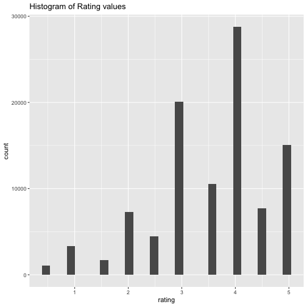

Recommender Systems
========================================================
css: ../../assets/style/uw.css
author: Justin Donaldson
date: May-04-2017
autosize: true

Applied Machine Learning 410
---------------------------------
(AKA: If you like that, your gonna love this)

Recommender Systems Arrive
======
Anybody remember this contest? (2009)


Recommender Systems Arrive
======

***
- One of the first "big money" prizes for data science
- Contestants from all over the world
- No holds barred, any technique was considered
- Winner gets a million bucks!

Old and Blockbusted
======
<a title="By Tracy the astonishing (The video store on Flickr) [CC BY-SA 2.0 (http://creativecommons.org/licenses/by-sa/2.0)], via Wikimedia Commons" href="https://commons.wikimedia.org/wiki/File%3AVideo_shop.jpg"></a>
***
- Previously, each copy of a movie took up space... somewhere.
- Impossible to stock *every* movie that *everyone* wants in a physical store
- Movies/Content catered towards *satisficing* broader demographics.
  - Sacrifice smaller fringe titles, stock more crowd pleasers

Overview
===
type : sub-section
- Content-based recommendation
- Item-based recommendation
- User-based recommendation
- Hybrids and New Techniques


Content-based recommendation
====
What constitutes *content*? 


***
- Simple measures/categories (themes, genres, abstract qualities)
- E.g. Moana is a [family] [musical] featuring [cg animation]
- May be automatically extracted
- Relies on a *profile* of the individual content, and *profile* of user preference

IMDB part deux
====
type : small-code

```r
dat = read.csv("../module3/movie_metadata.csv")
str(dat)
```

```
'data.frame':	5043 obs. of  28 variables:
 $ color                    : chr  "Color" "Color" "Color" "Color" ...
 $ director_name            : chr  "James Cameron" "Gore Verbinski" "Sam Mendes" "Christopher Nolan" ...
 $ num_critic_for_reviews   : int  723 302 602 813 NA 462 392 324 635 375 ...
 $ duration                 : int  178 169 148 164 NA 132 156 100 141 153 ...
 $ director_facebook_likes  : int  0 563 0 22000 131 475 0 15 0 282 ...
 $ actor_3_facebook_likes   : int  855 1000 161 23000 NA 530 4000 284 19000 10000 ...
 $ actor_2_name             : chr  "Joel David Moore" "Orlando Bloom" "Rory Kinnear" "Christian Bale" ...
 $ actor_1_facebook_likes   : int  1000 40000 11000 27000 131 640 24000 799 26000 25000 ...
 $ gross                    : int  760505847 309404152 200074175 448130642 NA 73058679 336530303 200807262 458991599 301956980 ...
 $ genres                   : chr  "Action|Adventure|Fantasy|Sci-Fi" "Action|Adventure|Fantasy" "Action|Adventure|Thriller" "Action|Thriller" ...
 $ actor_1_name             : chr  "CCH Pounder" "Johnny Depp" "Christoph Waltz" "Tom Hardy" ...
 $ movie_title              : chr  "Avatar " "Pirates of the Caribbean: At World's End " "Spectre " "The Dark Knight Rises " ...
 $ num_voted_users          : int  886204 471220 275868 1144337 8 212204 383056 294810 462669 321795 ...
 $ cast_total_facebook_likes: int  4834 48350 11700 106759 143 1873 46055 2036 92000 58753 ...
 $ actor_3_name             : chr  "Wes Studi" "Jack Davenport" "Stephanie Sigman" "Joseph Gordon-Levitt" ...
 $ facenumber_in_poster     : int  0 0 1 0 0 1 0 1 4 3 ...
 $ plot_keywords            : chr  "avatar|future|marine|native|paraplegic" "goddess|marriage ceremony|marriage proposal|pirate|singapore" "bomb|espionage|sequel|spy|terrorist" "deception|imprisonment|lawlessness|police officer|terrorist plot" ...
 $ movie_imdb_link          : chr  "http://www.imdb.com/title/tt0499549/?ref_=fn_tt_tt_1" "http://www.imdb.com/title/tt0449088/?ref_=fn_tt_tt_1" "http://www.imdb.com/title/tt2379713/?ref_=fn_tt_tt_1" "http://www.imdb.com/title/tt1345836/?ref_=fn_tt_tt_1" ...
 $ num_user_for_reviews     : int  3054 1238 994 2701 NA 738 1902 387 1117 973 ...
 $ language                 : chr  "English" "English" "English" "English" ...
 $ country                  : chr  "USA" "USA" "UK" "USA" ...
 $ content_rating           : chr  "PG-13" "PG-13" "PG-13" "PG-13" ...
 $ budget                   : num  2.37e+08 3.00e+08 2.45e+08 2.50e+08 NA ...
 $ title_year               : int  2009 2007 2015 2012 NA 2012 2007 2010 2015 2009 ...
 $ actor_2_facebook_likes   : int  936 5000 393 23000 12 632 11000 553 21000 11000 ...
 $ imdb_score               : num  7.9 7.1 6.8 8.5 7.1 6.6 6.2 7.8 7.5 7.5 ...
 $ aspect_ratio             : num  1.78 2.35 2.35 2.35 NA 2.35 2.35 1.85 2.35 2.35 ...
 $ movie_facebook_likes     : int  33000 0 85000 164000 0 24000 0 29000 118000 10000 ...
```

IMDB part deux
====
type : small-code 

```r
library(stringr)
library(coop)
dat = dat[dat$plot_keywords != '', ]
dat = dat[1:1000,]
keywords = str_split(dat$plot_keywords, "\\s*\\|\\s*")
keywords = lapply(keywords, str_trim)
all_keywords = sort(unique(unlist(keywords)))
keywords = sapply(keywords, function(x) {
  y = rep(0, length(all_keywords)); 
  names(y)<- all_keywords; 
  y[unlist(x)] = 1; 
  y
})
colnames(keywords)<- str_trim(dat$movie_title)

t(keywords[40:43,1:5])
```

```
                                         acorn act of kindness
Avatar                                       0               0
Pirates of the Caribbean: At World's End     0               0
Spectre                                      0               0
The Dark Knight Rises                        0               0
John Carter                                  0               0
                                         action figure action hero
Avatar                                               0           0
Pirates of the Caribbean: At World's End             0           0
Spectre                                              0           0
The Dark Knight Rises                                0           0
John Carter                                          0           0
```

IMDB part deux
====

```r
sims = cosine(keywords)
diag(sims) = 0
as.matrix(apply(sims,2,function(x) names(x)[which.max(x)]))
```

```
                                                               [,1]                                                            
Avatar                                                         "Terminator Salvation"                                          
Pirates of the Caribbean: At World's End                       "Pirates of the Caribbean: On Stranger Tides"                   
Spectre                                                        "Casino Royale"                                                 
The Dark Knight Rises                                          "The Devil's Own"                                               
John Carter                                                    "Men in Black 3"                                                
Spider-Man 3                                                   "The Amazing Spider-Man"                                        
Tangled                                                        "The Huntsman: Winter's War"                                    
Avengers: Age of Ultron                                        "Captain America: Civil War"                                    
Harry Potter and the Half-Blood Prince                         "The Holiday"                                                   
Batman v Superman: Dawn of Justice                             "Avengers: Age of Ultron"                                       
Superman Returns                                               "The Golden Compass"                                            
Quantum of Solace                                              "Pirates of the Caribbean: On Stranger Tides"                   
Pirates of the Caribbean: Dead Man's Chest                     "Godzilla Resurgence"                                           
The Lone Ranger                                                "Transformers: Age of Extinction"                               
Man of Steel                                                   "Avengers: Age of Ultron"                                       
The Chronicles of Narnia: Prince Caspian                       "Jack the Giant Slayer"                                         
The Avengers                                                   "The Avengers"                                                  
Pirates of the Caribbean: On Stranger Tides                    "Pirates of the Caribbean: At World's End"                      
Men in Black 3                                                 "Men in Black II"                                               
The Hobbit: The Battle of the Five Armies                      "The Lord of the Rings: The Fellowship of the Ring"             
The Amazing Spider-Man                                         "Spider-Man"                                                    
Robin Hood                                                     "Children of Men"                                               
The Hobbit: The Desolation of Smaug                            "The Hobbit: The Battle of the Five Armies"                     
The Golden Compass                                             "Crazy, Stupid, Love."                                          
King Kong                                                      "How to Train Your Dragon"                                      
Titanic                                                        "Harry Potter and the Half-Blood Prince"                        
Captain America: Civil War                                     "Avengers: Age of Ultron"                                       
Battleship                                                     "Titanic"                                                       
Jurassic World                                                 "Jurassic Park III"                                             
Skyfall                                                        "Avatar"                                                        
Spider-Man 2                                                   "Dragonfly"                                                     
Iron Man 3                                                     "Spectre"                                                       
Alice in Wonderland                                            "Snow White and the Huntsman"                                   
X-Men: The Last Stand                                          "X-Men: Apocalypse"                                             
Monsters University                                            "Godzilla Resurgence"                                           
Transformers: Revenge of the Fallen                            "Transformers: Dark of the Moon"                                
Transformers: Age of Extinction                                "The Lone Ranger"                                               
Oz the Great and Powerful                                      "Bewitched"                                                     
The Amazing Spider-Man 2                                       "The Amazing Spider-Man"                                        
TRON: Legacy                                                   "The Chronicles of Riddick"                                     
Cars 2                                                         "Spectre"                                                       
Green Lantern                                                  "The Lovers"                                                    
Toy Story 3                                                    "TRON: Legacy"                                                  
Terminator Salvation                                           "Terminator 3: Rise of the Machines"                            
Furious 7                                                      "Spectre"                                                       
World War Z                                                    "Carriers"                                                      
X-Men: Days of Future Past                                     "Tomorrowland"                                                  
Star Trek Into Darkness                                        "Pirates of the Caribbean: On Stranger Tides"                   
Jack the Giant Slayer                                          "Prince of Persia: The Sands of Time"                           
The Great Gatsby                                               "The Green Hornet"                                              
Prince of Persia: The Sands of Time                            "Jack the Giant Slayer"                                         
Pacific Rim                                                    "Sky Captain and the World of Tomorrow"                         
Transformers: Dark of the Moon                                 "Transformers: Revenge of the Fallen"                           
Indiana Jones and the Kingdom of the Crystal Skull             "Wanted"                                                        
The Good Dinosaur                                              "Jurassic World"                                                
Brave                                                          "John Carter"                                                   
Star Trek Beyond                                               "Godzilla Resurgence"                                           
WALL·E                                                         "Pacific Rim"                                                   
Rush Hour 3                                                    "Ratatouille"                                                   
2012                                                           "Evan Almighty"                                                 
A Christmas Carol                                              "The Polar Express"                                             
Jupiter Ascending                                              "Fantastic Four"                                                
The Legend of Tarzan                                           "The Legend of Tarzan"                                          
The Chronicles of Narnia: The Lion, the Witch and the Wardrobe "Frozen"                                                        
X-Men: Apocalypse                                              "X-Men"                                                         
The Dark Knight                                                "Constantine"                                                   
Up                                                             "Spy Game"                                                      
Monsters vs. Aliens                                            "John Carter"                                                   
Iron Man                                                       "Wild Wild West"                                                
Hugo                                                           "The Lone Ranger"                                               
Wild Wild West                                                 "Iron Man"                                                      
The Mummy: Tomb of the Dragon Emperor                          "The Hobbit: The Battle of the Five Armies"                     
Suicide Squad                                                  "Avengers: Age of Ultron"                                       
Evan Almighty                                                  "Noah"                                                          
Edge of Tomorrow                                               "John Carter"                                                   
Waterworld                                                     "Avatar"                                                        
G.I. Joe: The Rise of Cobra                                    "The Lone Ranger"                                               
Inside Out                                                     "The Bourne Ultimatum"                                          
The Jungle Book                                                "Two Brothers"                                                  
Iron Man 2                                                     "Quantum of Solace"                                             
Snow White and the Huntsman                                    "Alice in Wonderland"                                           
Maleficent                                                     "The Chronicles of Narnia: Prince Caspian"                      
Dawn of the Planet of the Apes                                 "Godzilla Resurgence"                                           
The Lovers                                                     "Green Lantern"                                                 
47 Ronin                                                       "Battleship"                                                    
Captain America: The Winter Soldier                            "Cars 2"                                                        
Shrek Forever After                                            "Brave"                                                         
Tomorrowland                                                   "Mr. Peabody & Sherman"                                         
Big Hero 6                                                     "Avengers: Age of Ultron"                                       
Wreck-It Ralph                                                 "The Chronicles of Narnia: Prince Caspian"                      
The Polar Express                                              "A Christmas Carol"                                             
Independence Day: Resurgence                                   "John Carter"                                                   
How to Train Your Dragon                                       "How to Train Your Dragon 2"                                    
Terminator 3: Rise of the Machines                             "Terminator Salvation"                                          
Guardians of the Galaxy                                        "Armageddon"                                                    
Interstellar                                                   "Suicide Squad"                                                 
Inception                                                      "Total Recall"                                                  
Godzilla Resurgence                                            "Godzilla Resurgence"                                           
The Hobbit: An Unexpected Journey                              "The Hobbit: The Battle of the Five Armies"                     
The Fast and the Furious                                       "The Fast and the Furious"                                      
The Curious Case of Benjamin Button                            "Avatar"                                                        
X-Men: First Class                                             "X-Men 2"                                                       
The Hunger Games: Mockingjay - Part 2                          "V for Vendetta"                                                
The Sorcerer's Apprentice                                      "Harry Potter and the Half-Blood Prince"                        
Poseidon                                                       "TRON: Legacy"                                                  
Alice Through the Looking Glass                                "The Huntsman: Winter's War"                                    
Shrek the Third                                                "Enchanted"                                                     
Warcraft                                                       "The Hobbit: The Battle of the Five Armies"                     
Terminator Genisys                                             "A.I. Artificial Intelligence"                                  
The Chronicles of Narnia: The Voyage of the Dawn Treader       "Beowulf"                                                       
Pearl Harbor                                                   "Avatar"                                                        
Transformers                                                   "Transformers: Revenge of the Fallen"                           
Alexander                                                      "The Legend of Hercules"                                        
Harry Potter and the Order of the Phoenix                      "Harry Potter and the Goblet of Fire"                           
Harry Potter and the Goblet of Fire                            "Harry Potter and the Order of the Phoenix"                     
Hancock                                                        "Megamind"                                                      
I Am Legend                                                    "Carriers"                                                      
Charlie and the Chocolate Factory                              "Last Action Hero"                                              
Ratatouille                                                    "Rush Hour 3"                                                   
Batman Begins                                                  "Batman & Robin"                                                
Madagascar: Escape 2 Africa                                    "Madagascar"                                                    
Night at the Museum: Battle of the Smithsonian                 "Night at the Museum: Secret of the Tomb"                       
X-Men Origins: Wolverine                                       "The Hobbit: The Battle of the Five Armies"                     
The Matrix Revolutions                                         "Terminator Salvation"                                          
Frozen                                                         "The Chronicles of Narnia: The Lion, the Witch and the Wardrobe"
The Matrix Reloaded                                            "The Bourne Supremacy"                                          
Thor: The Dark World                                           "TRON: Legacy"                                                  
Mad Max: Fury Road                                             "The Scorch Trials"                                             
Angels & Demons                                                "Charlie's Angels: Full Throttle"                               
Thor                                                           "Underworld: Awakening"                                         
Bolt                                                           "Cats & Dogs: The Revenge of Kitty Galore"                      
G-Force                                                        "Mr. & Mrs. Smith"                                              
Wrath of the Titans                                            "Clash of the Titans"                                           
Dark Shadows                                                   "Son of the Mask"                                               
Mission: Impossible - Rogue Nation                             "Mission: Impossible"                                           
The Wolfman                                                    "Spider-Man 2"                                                  
The Legend of Tarzan                                           "The Legend of Tarzan"                                          
Bee Movie                                                      "Puss in Boots"                                                 
Kung Fu Panda 2                                                "Kung Fu Panda 3"                                               
The Last Airbender                                             "Avatar"                                                        
Mission: Impossible III                                        "The Expendables 3"                                             
White House Down                                               "The Hunger Games: Catching Fire"                               
Mars Needs Moms                                                "A.I. Artificial Intelligence"                                  
Flushed Away                                                   "Ratatouille"                                                   
Pan                                                            "Pan"                                                           
Mr. Peabody & Sherman                                          "Tomorrowland"                                                  
Troy                                                           "Shrek the Third"                                               
Madagascar 3: Europe's Most Wanted                             "Oz the Great and Powerful"                                     
Die Another Day                                                "Blood Diamond"                                                 
Ghostbusters                                                   "Man of Steel"                                                  
Armageddon                                                     "Mission to Mars"                                               
Men in Black II                                                "Men in Black 3"                                                
Beowulf                                                        "The Chronicles of Narnia: The Voyage of the Dawn Treader"      
Kung Fu Panda 3                                                "Kung Fu Panda 2"                                               
Mission: Impossible - Ghost Protocol                           "Spectre"                                                       
Rise of the Guardians                                          "Pirates of the Caribbean: Dead Man's Chest"                    
Fun with Dick and Jane                                         "Ant-Man"                                                       
The Last Samurai                                               "Pirates of the Caribbean: On Stranger Tides"                   
Exodus: Gods and Kings                                         "Gods of Egypt"                                                 
Star Trek                                                      "Avatar"                                                        
Spider-Man                                                     "The Amazing Spider-Man"                                        
How to Train Your Dragon 2                                     "How to Train Your Dragon"                                      
Gods of Egypt                                                  "Exodus: Gods and Kings"                                        
Stealth                                                        "Avengers: Age of Ultron"                                       
Watchmen                                                       "Cars 2"                                                        
Lethal Weapon 4                                                "Ninja Assassin"                                                
Hulk                                                           "Godzilla Resurgence"                                           
G.I. Joe: Retaliation                                          "Mars Attacks!"                                                 
Sahara                                                         "Titanic"                                                       
Final Fantasy: The Spirits Within                              "The Day the Earth Stood Still"                                 
Captain America: The First Avenger                             "Avengers: Age of Ultron"                                       
The World Is Not Enough                                        "Spectre"                                                       
Master and Commander: The Far Side of the World                "Titanic"                                                       
The Twilight Saga: Breaking Dawn - Part 2                      "The Twilight Saga: Breaking Dawn - Part 2"                     
Happy Feet 2                                                   "Godzilla Resurgence"                                           
The Incredible Hulk                                            "Avengers: Age of Ultron"                                       
Miami Vice                                                     "Bad Boys II"                                                   
The BFG                                                        "Alice in Wonderland"                                           
The Revenant                                                   "Quantum of Solace"                                             
Turbo                                                          "Hidalgo"                                                       
Rango                                                          "The Amazing Spider-Man"                                        
Penguins of Madagascar                                         "Spectre"                                                       
The Bourne Ultimatum                                           "Quantum of Solace"                                             
Kung Fu Panda                                                  "Kung Fu Panda 2"                                               
Ant-Man                                                        "Fun with Dick and Jane"                                        
The Hunger Games: Catching Fire                                "White House Down"                                              
The Twilight Saga: Breaking Dawn - Part 2                      "The Twilight Saga: Breaking Dawn - Part 2"                     
Home                                                           "The Avengers"                                                  
War of the Worlds                                              "John Carter"                                                   
Bad Boys II                                                    "Miami Vice"                                                    
Puss in Boots                                                  "The Golden Compass"                                            
Salt                                                           "A Good Day to Die Hard"                                        
Noah                                                           "Evan Almighty"                                                 
The Adventures of Tintin                                       "Pirates of the Caribbean: On Stranger Tides"                   
Harry Potter and the Prisoner of Azkaban                       "Harry Potter and the Order of the Phoenix"                     
Australia                                                      "Mad Max: Fury Road"                                            
After Earth                                                    "Battleship"                                                    
Dinosaur                                                       "Bee Movie"                                                     
Night at the Museum: Secret of the Tomb                        "Night at the Museum"                                           
Megamind                                                       "Hancock"                                                       
Harry Potter and the Sorcerer's Stone                          "The Lord of the Rings: The Two Towers"                         
R.I.P.D.                                                       "Life"                                                          
Godzilla Resurgence                                            "Godzilla Resurgence"                                           
Pirates of the Caribbean: The Curse of the Black Pearl         "Pirates of the Caribbean: At World's End"                      
The Hunger Games: Mockingjay - Part 1                          "Transformers: Revenge of the Fallen"                           
The Da Vinci Code                                              "The Spanish Prisoner"                                          
Rio 2                                                          "The Rundown"                                                   
X-Men 2                                                        "X-Men: The Last Stand"                                         
Fast Five                                                      "Miami Vice"                                                    
Sherlock Holmes: A Game of Shadows                             "The Lone Ranger"                                               
Clash of the Titans                                            "Wrath of the Titans"                                           
Total Recall                                                   "Total Recall"                                                  
The 13th Warrior                                               "Fury"                                                          
The Bourne Legacy                                              "The Bourne Supremacy"                                          
Batman & Robin                                                 "Jupiter Ascending"                                             
How the Grinch Stole Christmas                                 "Pirates of the Caribbean: Dead Man's Chest"                    
The Day After Tomorrow                                         "Edge of Tomorrow"                                              
Mission: Impossible II                                         "Contagion"                                                     
The Perfect Storm                                              "Spider-Man 2"                                                  
Fantastic 4: Rise of the Silver Surfer                         "Allegiant"                                                     
Life of Pi                                                     "The Jungle Book"                                               
Ghost Rider                                                    "A Christmas Carol"                                             
Jason Bourne                                                   "X-Men: First Class"                                            
Charlie's Angels: Full Throttle                                "Did You Hear About the Morgans?"                               
Prometheus                                                     "Green Lantern"                                                 
Stuart Little 2                                                "The Huntsman: Winter's War"                                    
Elysium                                                        "Avatar"                                                        
The Chronicles of Riddick                                      "TRON: Legacy"                                                  
RoboCop                                                        "Pacific Rim"                                                   
Speed Racer                                                    "Cars 2"                                                        
How Do You Know                                                "Harry Potter and the Half-Blood Prince"                        
Knight and Day                                                 "Spectre"                                                       
Oblivion                                                       "Dawn of the Planet of the Apes"                                
Star Wars: Episode III - Revenge of the Sith                   "The Twilight Saga: Breaking Dawn - Part 2"                     
Star Wars: Episode II - Attack of the Clones                   "Big Hero 6"                                                    
Monsters, Inc.                                                 "Godzilla Resurgence"                                           
The Wolverine                                                  "Deadpool"                                                      
Star Wars: Episode I - The Phantom Menace                      "John Carter"                                                   
The Croods                                                     "The Revenant"                                                  
Asterix at the Olympic Games                                   "Harry Potter and the Half-Blood Prince"                        
Windtalkers                                                    "Jarhead"                                                       
The Huntsman: Winter's War                                     "Alice Through the Looking Glass"                               
Teenage Mutant Ninja Turtles                                   "X-Men: The Last Stand"                                         
Gravity                                                        "Pirates of the Caribbean: Dead Man's Chest"                    
Dante's Peak                                                   "Volcano"                                                       
Teenage Mutant Ninja Turtles: Out of the Shadows               "Godzilla Resurgence"                                           
Fantastic Four                                                 "Fantastic Four"                                                
Night at the Museum                                            "Night at the Museum: Secret of the Tomb"                       
San Andreas                                                    "The Day After Tomorrow"                                        
Tomorrow Never Dies                                            "Quantum of Solace"                                             
The Patriot                                                    "Rush Hour 3"                                                   
Ocean's Twelve                                                 "Godzilla Resurgence"                                           
Mr. & Mrs. Smith                                               "The Avengers"                                                  
Insurgent                                                      "Avatar"                                                        
The Aviator                                                    "The Matrix Revolutions"                                        
Gulliver's Travels                                             "Pirates of the Caribbean: Dead Man's Chest"                    
The Green Hornet                                               "Avengers: Age of Ultron"                                       
The A-Team                                                     "The Chronicles of Narnia: Prince Caspian"                      
300: Rise of an Empire                                         "The Hobbit: The Battle of the Five Armies"                     
The Smurfs                                                     "The Smurfs 2"                                                  
Home on the Range                                              "Australia"                                                     
Allegiant                                                      "Fantastic 4: Rise of the Silver Surfer"                        
Real Steel                                                     "Pacific Rim"                                                   
The Smurfs 2                                                   "The Smurfs"                                                    
Speed 2: Cruise Control                                        "Poseidon"                                                      
Ender's Game                                                   "Starship Troopers"                                             
Live Free or Die Hard                                          "Die Hard with a Vengeance"                                     
The Lord of the Rings: The Fellowship of the Ring              "The Hobbit: The Battle of the Five Armies"                     
Around the World in 80 Days                                    "The Lone Ranger"                                               
Ali                                                            "Avatar"                                                        
The Cat in the Hat                                             "Catwoman"                                                      
I, Robot                                                       "Transformers"                                                  
Kingdom of Heaven                                              "First Knight"                                                  
Stuart Little                                                  "Charlie's Angels"                                              
The Princess and the Frog                                      "Inception"                                                     
The Martian                                                    "Armageddon"                                                    
The Island                                                     "Escape from L.A."                                              
Town & Country                                                 "The Golden Compass"                                            
Gone in Sixty Seconds                                          "Inception"                                                     
Gladiator                                                      "Fury"                                                          
Minority Report                                                "The 6th Day"                                                   
Harry Potter and the Chamber of Secrets                        "Godzilla Resurgence"                                           
Casino Royale                                                  "Spectre"                                                       
Planet of the Apes                                             "Planet 51"                                                     
Terminator 2: Judgment Day                                     "Avatar"                                                        
Public Enemies                                                 "Now You See Me"                                                
American Gangster                                              "Spider-Man 2"                                                  
True Lies                                                      "Spectre"                                                       
The Taking of Pelham 1 2 3                                     "Money Train"                                                   
Little Fockers                                                 "Meet the Parents"                                              
The Other Guys                                                 "Die Hard with a Vengeance"                                     
Eraser                                                         "Mission: Impossible - Rogue Nation"                            
Django Unchained                                               "The Legend of Hercules"                                        
The Hunchback of Notre Dame                                    "Sherlock Holmes: A Game of Shadows"                            
The Emperor's New Groove                                       "Tangled"                                                       
The Expendables 2                                              "Quantum of Solace"                                             
National Treasure                                              "Fool's Gold"                                                   
Eragon                                                         "How to Train Your Dragon"                                      
Where the Wild Things Are                                      "Beowulf"                                                       
Pan                                                            "Pan"                                                           
Epic                                                           "Alice in Wonderland"                                           
The Tourist                                                    "The Italian Job"                                               
End of Days                                                    "2 Guns"                                                        
Blood Diamond                                                  "Die Another Day"                                               
The Wolf of Wall Street                                        "300: Rise of an Empire"                                        
Batman Forever                                                 "Harry Potter and the Half-Blood Prince"                        
Starship Troopers                                              "Ender's Game"                                                  
Cloud Atlas                                                    "Avatar"                                                        
Legend of the Guardians: The Owls of Ga'Hoole                  "The Avengers"                                                  
Catwoman                                                       "The Cat in the Hat"                                            
Hercules                                                       "Hercules"                                                      
Treasure Planet                                                "Starship Troopers"                                             
Land of the Lost                                               "The Amazing Spider-Man"                                        
The Expendables 3                                              "The Matrix Revolutions"                                        
Point Break                                                    "Tower Heist"                                                   
Son of the Mask                                                "Cats & Dogs: The Revenge of Kitty Galore"                      
In the Heart of the Sea                                        "Titanic"                                                       
The Adventures of Pluto Nash                                   "The 6th Day"                                                   
Green Zone                                                     "X-Men: First Class"                                            
The Peanuts Movie                                              "The Golden Compass"                                            
The Spanish Prisoner                                           "The Chronicles of Narnia: Prince Caspian"                      
The Mummy Returns                                              "The Chronicles of Narnia: Prince Caspian"                      
Gangs of New York                                              "Quantum of Solace"                                             
The Flowers of War                                             "Quantum of Solace"                                             
Surf's Up                                                      "King Kong"                                                     
The Stepford Wives                                             "2012"                                                          
Black Hawk Down                                                "The Hobbit: The Battle of the Five Armies"                     
The Campaign                                                   "Evan Almighty"                                                 
The Fifth Element                                              "John Carter"                                                   
Sex and the City 2                                             "Pirates of the Caribbean: Dead Man's Chest"                    
The Road to El Dorado                                          "R.I.P.D."                                                      
Ice Age: Continental Drift                                     "Pirates of the Caribbean: At World's End"                      
Cinderella                                                     "Snow White and the Huntsman"                                   
The Lovely Bones                                               "Clash of the Titans"                                           
Finding Nemo                                                   "The Lovers"                                                    
The Lord of the Rings: The Return of the King                  "The Matrix Revolutions"                                        
The Lord of the Rings: The Two Towers                          "Harry Potter and the Sorcerer's Stone"                         
Seventh Son                                                    "Oz the Great and Powerful"                                     
Lara Croft: Tomb Raider                                        "Angels & Demons"                                               
Transcendence                                                  "Avengers: Age of Ultron"                                       
Jurassic Park III                                              "The Lost World: Jurassic Park"                                 
Rise of the Planet of the Apes                                 "The Jungle Book"                                               
The Spiderwick Chronicles                                      "Inspector Gadget"                                              
A Good Day to Die Hard                                         "Salt"                                                          
The Alamo                                                      "The Lone Ranger"                                               
The Incredibles                                                "Hellboy"                                                       
Cutthroat Island                                               "Treasure Planet"                                               
Percy Jackson & the Olympians: The Lightning Thief             "The Amazing Spider-Man"                                        
Men in Black                                                   "John Carter"                                                   
Toy Story 2                                                    "The Golden Compass"                                            
Unstoppable                                                    "The Lone Ranger"                                               
Rush Hour 2                                                    "Rush Hour 3"                                                   
What Lies Beneath                                              "The Haunted Mansion"                                           
Cloudy with a Chance of Meatballs                              "Ratatouille"                                                   
Ice Age: Dawn of the Dinosaurs                                 "Terminator Salvation"                                          
The Secret Life of Walter Mitty                                "Kung Fu Panda"                                                 
Charlie's Angels                                               "Stuart Little"                                                 
The Departed                                                   "Miami Vice"                                                    
Mulan                                                          "The Mummy: Tomb of the Dragon Emperor"                         
Tropic Thunder                                                 "Littleman"                                                     
The Girl with the Dragon Tattoo                                "Mission: Impossible - Rogue Nation"                            
Die Hard with a Vengeance                                      "The Other Guys"                                                
Sherlock Holmes                                                "Sherlock Holmes: A Game of Shadows"                            
Atlantis: The Lost Empire                                      "Night at the Museum: Battle of the Smithsonian"                
Alvin and the Chipmunks: The Road Chip                         "Alvin and the Chipmunks: Chipwrecked"                          
Valkyrie                                                       "Snake Eyes"                                                    
You Don't Mess with the Zohan                                  "Sex and the City 2"                                            
Pixels                                                         "John Carter"                                                   
A.I. Artificial Intelligence                                   "Terminator Genisys"                                            
The Haunted Mansion                                            "What Lies Beneath"                                             
Contact                                                        "Spider-Man 2"                                                  
Hollow Man                                                     "Deep Blue Sea"                                                 
The Interpreter                                                "Rush Hour 3"                                                   
Percy Jackson: Sea of Monsters                                 "Waterworld"                                                    
Lara Croft Tomb Raider: The Cradle of Life                     "Meet Dave"                                                     
Now You See Me 2                                               "Oz the Great and Powerful"                                     
The Saint                                                      "Mission: Impossible"                                           
Spy Game                                                       "Up"                                                            
Mission to Mars                                                "Armageddon"                                                    
Rio                                                            "Rio 2"                                                         
Bicentennial Man                                               "Surrogates"                                                    
Volcano                                                        "Dante's Peak"                                                  
The Devil's Own                                                "Spectre"                                                       
K-19: The Widowmaker                                           "Waterworld"                                                    
Fantastic Four                                                 "Fantastic Four"                                                
Conan the Barbarian                                            "Gladiator"                                                     
Cinderella Man                                                 "Vanilla Sky"                                                   
The Nutcracker in 3D                                           "A Christmas Carol"                                             
Seabiscuit                                                     "The Lone Ranger"                                               
Twister                                                        "Into the Storm"                                                
The Fast and the Furious                                       "The Fast and the Furious"                                      
Cast Away                                                      "Practical Magic"                                               
Happy Feet                                                     "Hairspray"                                                     
The Bourne Supremacy                                           "The Bourne Legacy"                                             
Air Force One                                                  "Executive Decision"                                            
Ocean's Eleven                                                 "Casino Royale"                                                 
The Three Musketeers                                           "Jupiter Ascending"                                             
Hotel Transylvania                                             "Hotel Transylvania 2"                                          
Enchanted                                                      "Shrek the Third"                                               
Hannibal                                                       "Godzilla Resurgence"                                           
Safe House                                                     "X-Men: First Class"                                            
102 Dalmatians                                                 "Men in Black 3"                                                
Tower Heist                                                    "Point Break"                                                   
The Holiday                                                    "Harry Potter and the Half-Blood Prince"                        
Enemy of the State                                             "Evan Almighty"                                                 
It's Complicated                                               "In the Heart of the Sea"                                       
Ocean's Thirteen                                               "3000 Miles to Graceland"                                       
Open Season                                                    "Over the Hedge"                                                
Divergent                                                      "The Chronicles of Narnia: Prince Caspian"                      
Enemy at the Gates                                             "The Avengers"                                                  
The Rundown                                                    "Rio 2"                                                         
Last Action Hero                                               "Quantum of Solace"                                             
Memoirs of a Geisha                                            "Harry Potter and the Half-Blood Prince"                        
The Fast and the Furious: Tokyo Drift                          "Gone in Sixty Seconds"                                         
Arthur Christmas                                               "A Christmas Carol"                                             
Meet Joe Black                                                 "Spider-Man 2"                                                  
Collateral Damage                                              "Iron Man 3"                                                    
All That Jazz                                                  "In the Heart of the Sea"                                       
Mirror Mirror                                                  "Shrek the Third"                                               
Scott Pilgrim vs. the World                                    "Something's Gotta Give"                                        
The Core                                                       "The Day the Earth Stood Still"                                 
Nutty Professor II: The Klumps                                 "Harry Potter and the Half-Blood Prince"                        
Scooby-Doo                                                     "King Kong"                                                     
Dredd                                                          "Brave"                                                         
Click                                                          "Town & Country"                                                
Creepshow                                                      "Spider-Man 2"                                                  
Cats & Dogs: The Revenge of Kitty Galore                       "Cats & Dogs"                                                   
Jumper                                                         "Ant-Man"                                                       
Hellboy II: The Golden Army                                    "Avengers: Age of Ultron"                                       
Zodiac                                                         "Harry Potter and the Prisoner of Azkaban"                      
The 6th Day                                                    "Minority Report"                                               
Bruce Almighty                                                 "X-Men: Days of Future Past"                                    
The Expendables                                                "Quantum of Solace"                                             
Mission: Impossible                                            "Mission: Impossible - Rogue Nation"                            
The Hunger Games                                               "The Legend of Bagger Vance"                                    
The Hangover Part II                                           "Hotel Transylvania"                                            
Batman Returns                                                 "Pirates of the Caribbean: Dead Man's Chest"                    
Over the Hedge                                                 "Open Season"                                                   
Lilo & Stitch                                                  "Titan A.E."                                                    
Charlotte's Web                                                "The Amazing Spider-Man"                                        
Deep Impact                                                    "Star Trek Into Darkness"                                       
RED 2                                                          "X-Men: First Class"                                            
The Longest Yard                                               "Con Air"                                                       
Alvin and the Chipmunks: Chipwrecked                           "Alvin and the Chipmunks: The Road Chip"                        
Grown Ups 2                                                    "The Great Gatsby"                                              
Get Smart                                                      "Spectre"                                                       
Something's Gotta Give                                         "Spider-Man 2"                                                  
Shutter Island                                                 "The Village"                                                   
Four Christmases                                               "A Christmas Carol"                                             
Robots                                                         "Pirates of the Caribbean: Dead Man's Chest"                    
Face/Off                                                       "Spectre"                                                       
Bedtime Stories                                                "Blood Diamond"                                                 
Road to Perdition                                              "Godzilla Resurgence"                                           
Just Go with It                                                "Harry Potter and the Half-Blood Prince"                        
Daredevil                                                      "Bullet to the Head"                                            
Con Air                                                        "Men in Black 3"                                                
Eagle Eye                                                      "Hereafter"                                                     
Cold Mountain                                                  "The Avengers"                                                  
The Book of Eli                                                "Harry Potter and the Half-Blood Prince"                        
Flubber                                                        "Harry Potter and the Half-Blood Prince"                        
The Haunting                                                   "The Great Gatsby"                                              
Space Jam                                                      "John Carter"                                                   
The Pink Panther                                               "Die Another Day"                                               
The Day the Earth Stood Still                                  "Final Fantasy: The Spirits Within"                             
Conspiracy Theory                                              "Cars 2"                                                        
Fury                                                           "The 13th Warrior"                                              
Six Days Seven Nights                                          "Turbulence"                                                    
Yogi Bear                                                      "Penguins of Madagascar"                                        
Spirit: Stallion of the Cimarron                               "TRON: Legacy"                                                  
Zookeeper                                                      "Madagascar: Escape 2 Africa"                                   
Lost in Space                                                  "Sky Captain and the World of Tomorrow"                         
The Manchurian Candidate                                       "The Avengers"                                                  
Déjà Vu                                                        "Harry Potter and the Half-Blood Prince"                        
Hotel Transylvania 2                                           "Hotel Transylvania"                                            
Bewitched                                                      "Oz the Great and Powerful"                                     
Fantasia 2000                                                  "Tangled"                                                       
The Time Machine                                               "A Sound of Thunder"                                            
Mighty Joe Young                                               "King Kong"                                                     
Swordfish                                                      "G-Force"                                                       
The Legend of Zorro                                            "The Mask of Zorro"                                             
What Dreams May Come                                           "The Lovely Bones"                                              
Little Nicky                                                   "Ghost Rider"                                                   
The Brothers Grimm                                             "The Village"                                                   
Mars Attacks!                                                  "G.I. Joe: Retaliation"                                         
Evolution                                                      "Waterworld"                                                    
The Edge                                                       "Iron Man"                                                      
Surrogates                                                     "Terminator Genisys"                                            
Thirteen Days                                                  "2012"                                                          
Daylight                                                       "Iron Man 3"                                                    
Walking with Dinosaurs 3D                                      "Jurassic World"                                                
Battlefield Earth                                              "John Carter"                                                   
Looney Tunes: Back in Action                                   "Spectre"                                                       
Nine                                                           "Tropic Thunder"                                                
Timeline                                                       "Harry Potter and the Half-Blood Prince"                        
The Postman                                                    "TRON: Legacy"                                                  
Babe: Pig in the City                                          "Madagascar 3: Europe's Most Wanted"                            
The Last Witch Hunter                                          "Oz the Great and Powerful"                                     
Red Planet                                                     "Mission to Mars"                                               
Arthur and the Invisibles                                      "Fool's Gold"                                                   
Oceans                                                         "Avatar"                                                        
A Sound of Thunder                                             "The Time Machine"                                              
Pompeii                                                        "Real Steel"                                                    
A Beautiful Mind                                               "Cars 2"                                                        
The Lion King                                                  "The Chronicles of Narnia: Prince Caspian"                      
Journey 2: The Mysterious Island                               "The Hobbit: The Desolation of Smaug"                           
Cloudy with a Chance of Meatballs 2                            "King Kong"                                                     
Red Dragon                                                     "Point Break"                                                   
Hidalgo                                                        "The Lone Ranger"                                               
Jack and Jill                                                  "Life"                                                          
2 Fast 2 Furious                                               "Talladega Nights: The Ballad of Ricky Bobby"                   
The Little Prince                                              "The Golden Compass"                                            
The Invasion                                                   "Outbreak"                                                      
The Adventures of Rocky & Bullwinkle                           "Charlie's Angels: Full Throttle"                               
The Secret Life of Pets                                        "Avatar"                                                        
The League of Extraordinary Gentlemen                          "Battleship"                                                    
Despicable Me 2                                                "Scott Pilgrim vs. the World"                                   
Independence Day                                               "Race to Witch Mountain"                                        
The Lost World: Jurassic Park                                  "Jurassic Park III"                                             
Madagascar                                                     "Madagascar: Escape 2 Africa"                                   
Children of Men                                                "Robin Hood"                                                    
X-Men                                                          "X-Men: Apocalypse"                                             
Wanted                                                         "The Avengers"                                                  
The Rock                                                       "Wild Wild West"                                                
Ice Age: The Meltdown                                          "Jack the Giant Slayer"                                         
50 First Dates                                                 "Battleship"                                                    
Hairspray                                                      "Happy Feet"                                                    
Exorcist: The Beginning                                        "Life of Pi"                                                    
Inspector Gadget                                               "Miami Vice"                                                    
Now You See Me                                                 "Public Enemies"                                                
Grown Ups                                                      "Scott Pilgrim vs. the World"                                   
The Terminal                                                   "Four Christmases"                                              
Constantine                                                    "The Dark Knight"                                               
Hotel for Dogs                                                 "Bolt"                                                          
Vertical Limit                                                 "Spider-Man 2"                                                  
Charlie Wilson's War                                           "The Lone Ranger"                                               
Shark Tale                                                     "The Perfect Storm"                                             
Dreamgirls                                                     "The Jungle Book"                                               
Life                                                           "Starsky & Hutch"                                               
Be Cool                                                        "Godzilla Resurgence"                                           
Munich                                                         "The 13th Warrior"                                              
Tears of the Sun                                               "Spider-Man 2"                                                  
Killers                                                        "Mad Max: Fury Road"                                            
The Man from U.N.C.L.E.                                        "Battleship"                                                    
Spanglish                                                      "Toy Story 3"                                                   
Monster House                                                  "Up"                                                            
Bandits                                                        "Men in Black 3"                                                
First Knight                                                   "The Lord of the Rings: The Return of the King"                 
Anna and the King                                              "The Chronicles of Narnia: Prince Caspian"                      
Immortals                                                      "Unbroken"                                                      
Hostage                                                        "S.W.A.T."                                                      
Titan A.E.                                                     "Sky Captain and the World of Tomorrow"                         
Hollywood Homicide                                             "Basic Instinct 2"                                              
Soldier                                                        "Alien 3"                                                       
Carriers                                                       "World War Z"                                                   
Monkeybone                                                     "Spider-Man 2"                                                  
Flight of the Phoenix                                          "Broken Arrow"                                                  
Unbreakable                                                    "Avengers: Age of Ultron"                                       
Minions                                                        "Spider-Man 3"                                                  
Sucker Punch                                                   "TRON: Legacy"                                                  
Snake Eyes                                                     "Valkyrie"                                                      
Sphere                                                         "Independence Day"                                              
The Angry Birds Movie                                          "Kung Fu Panda 3"                                               
Fool's Gold                                                    "National Treasure"                                             
Funny People                                                   "All That Jazz"                                                 
The Kingdom                                                    "Charlie's Angels: Full Throttle"                               
Talladega Nights: The Ballad of Ricky Bobby                    "The Golden Compass"                                            
Dr. Dolittle 2                                                 "Spider-Man 2"                                                  
Braveheart                                                     "Avatar"                                                        
Jarhead                                                        "Windtalkers"                                                   
The Simpsons Movie                                             "Kung Fu Panda 3"                                               
The Majestic                                                   "2012"                                                          
Driven                                                         "Cars 2"                                                        
Two Brothers                                                   "The Jungle Book"                                               
The Village                                                    "The Brothers Grimm"                                            
Doctor Dolittle                                                "Stuart Little"                                                 
Signs                                                          "Life of Pi"                                                    
Shrek 2                                                        "Alice Through the Looking Glass"                               
Cars                                                           "Transformers: Age of Extinction"                               
Runaway Bride                                                  "The Soloist"                                                   
xXx                                                            "GoldenEye"                                                     
The SpongeBob Movie: Sponge Out of Water                       "Stardust"                                                      
Ransom                                                         "Bad Boys II"                                                   
Inglourious Basterds                                           "Quantum of Solace"                                             
Hook                                                           "The Golden Compass"                                            
Hercules                                                       "Hercules"                                                      
Die Hard 2                                                     "Live Free or Die Hard"                                         
S.W.A.T.                                                       "Hostage"                                                       
Sleepy Hollow                                                  "How to Train Your Dragon 2"                                    
Vanilla Sky                                                    "Cinderella Man"                                                
Lady in the Water                                              "Tower Heist"                                                   
AVP: Alien vs. Predator                                        "John Carter"                                                   
Alvin and the Chipmunks: The Squeakquel                        "Furious 7"                                                     
We Were Soldiers                                               "The Avengers"                                                  
Olympus Has Fallen                                             "Lincoln"                                                       
Star Trek: Insurrection                                        "Starship Troopers"                                             
Battle Los Angeles                                             "Avatar"                                                        
Big Fish                                                       "The Bourne Ultimatum"                                          
Wolf                                                           "Godzilla Resurgence"                                           
War Horse                                                      "The Lone Ranger"                                               
The Monuments Men                                              "The Avengers"                                                  
The Abyss                                                      "John Carter"                                                   
Wall Street: Money Never Sleeps                                "Thirteen Days"                                                 
Dracula Untold                                                 "Hotel Transylvania 2"                                          
The Siege                                                      "Die Hard with a Vengeance"                                     
Stardust                                                       "The SpongeBob Movie: Sponge Out of Water"                      
Seven Years in Tibet                                           "The Hobbit: The Desolation of Smaug"                           
The Dilemma                                                    "Hairspray"                                                     
Bad Company                                                    "X-Men: First Class"                                            
Doom                                                           "Fantastic Four"                                                
I Spy                                                          "Spectre"                                                       
Underworld: Awakening                                          "Thor"                                                          
Rock of Ages                                                   "Harry Potter and the Half-Blood Prince"                        
Hart's War                                                     "Pacific Rim"                                                   
Killer Elite                                                   "Quantum of Solace"                                             
Rollerball                                                     "Godzilla Resurgence"                                           
Ballistic: Ecks vs. Sever                                      "The Hunted"                                                    
Hard Rain                                                      "Evan Almighty"                                                 
Osmosis Jones                                                  "Godzilla Resurgence"                                           
Legends of Oz: Dorothy's Return                                "John Carter"                                                   
Blackhat                                                       "Rush Hour 3"                                                   
Sky Captain and the World of Tomorrow                          "Titan A.E."                                                    
Basic Instinct 2                                               "Hollywood Homicide"                                            
Escape Plan                                                    "Con Air"                                                       
The Legend of Hercules                                         "Alexander"                                                     
The Sum of All Fears                                           "X-Men: First Class"                                            
The Twilight Saga: Eclipse                                     "The Twilight Saga: New Moon"                                   
The Score                                                      "Inception"                                                     
Despicable Me                                                  "The Golden Compass"                                            
Money Train                                                    "The Taking of Pelham 1 2 3"                                    
Ted 2                                                          "The Matrix Revolutions"                                        
Agora                                                          "Harry Potter and the Half-Blood Prince"                        
Mystery Men                                                    "Avengers: Age of Ultron"                                       
Hall Pass                                                      "Watchmen"                                                      
The Insider                                                    "What Lies Beneath"                                             
The Finest Hours                                               "The Revenant"                                                  
Body of Lies                                                   "From Paris with Love"                                          
Dinner for Schmucks                                            "The Chronicles of Narnia: The Voyage of the Dawn Treader"      
Abraham Lincoln: Vampire Hunter                                "The Twilight Saga: Breaking Dawn - Part 2"                     
Entrapment                                                     "Son of the Mask"                                               
Last Man Standing                                              "How to Train Your Dragon 2"                                    
The X Files                                                    "Spectre"                                                       
The Last Legion                                                "The Avengers"                                                  
Saving Private Ryan                                            "The Avengers"                                                  
Need for Speed                                                 "The Fast and the Furious"                                      
What Women Want                                                "Jack and Jill"                                                 
Ice Age                                                        "Son of the Mask"                                               
Dreamcatcher                                                   "Starship Troopers"                                             
Lincoln                                                        "Olympus Has Fallen"                                            
The Matrix                                                     "Speed 2: Cruise Control"                                       
Apollo 13                                                      "The Rock"                                                      
Total Recall                                                   "Total Recall"                                                  
The Santa Clause 2                                             "Jingle All the Way"                                            
Les Misérables                                                 "The Hunger Games: Mockingjay - Part 2"                         
You've Got Mail                                                "I Am Legend"                                                   
Step Brothers                                                  "Cinderella Man"                                                
The Mask of Zorro                                              "The Legend of Zorro"                                           
Due Date                                                       "Cliffhanger"                                                   
Unbroken                                                       "Watchmen"                                                      
Space Cowboys                                                  "Star Trek Into Darkness"                                       
Cliffhanger                                                    "Everest"                                                       
Broken Arrow                                                   "Flight of the Phoenix"                                         
The Kid                                                        "Dark Shadows"                                                  
World Trade Center                                             "Terminator Salvation"                                          
Mona Lisa Smile                                                "Toy Story 3"                                                   
The Dictator                                                   "Sahara"                                                        
Eyes Wide Shut                                                 "Spider-Man 2"                                                  
Annie                                                          "Iron Man"                                                      
Focus                                                          "The Dark Knight Rises"                                         
This Means War                                                 "X-Men: First Class"                                            
Blade: Trinity                                                 "Godzilla Resurgence"                                           
Red Dawn                                                       "Scott Pilgrim vs. the World"                                   
Primary Colors                                                 "2012"                                                          
Resident Evil: Retribution                                     "The Expendables 3"                                             
Death Race                                                     "The Longest Yard"                                              
The Long Kiss Goodnight                                        "Fantastic 4: Rise of the Silver Surfer"                        
Proof of Life                                                  "The Legend of Tarzan"                                          
Zathura: A Space Adventure                                     "Bedtime Stories"                                               
Fight Club                                                     "Dredd"                                                         
We Are Marshall                                                "The Longest Yard"                                              
The Missing                                                    "The Girl with the Dragon Tattoo"                               
Hudson Hawk                                                    "Men in Black 3"                                                
Lucky Numbers                                                  "Angels & Demons"                                               
I, Frankenstein                                                "Beowulf"                                                       
Oliver Twist                                                   "The Polar Express"                                             
Elektra                                                        "The Avengers"                                                  
Sin City: A Dame to Kill For                                   "Battleship"                                                    
Random Hearts                                                  "Spider-Man 2"                                                  
Everest                                                        "Cliffhanger"                                                   
Perfume: The Story of a Murderer                               "Avatar"                                                        
Austin Powers in Goldmember                                    "Spectre"                                                       
Astro Boy                                                      "Lost in Space"                                                 
Jurassic Park                                                  "Jurassic World"                                                
Wyatt Earp                                                     "Django Unchained"                                              
Clear and Present Danger                                       "2012"                                                          
Dragon Blade                                                   "Man of Steel"                                                  
Littleman                                                      "Tropic Thunder"                                                
U-571                                                          "Red Tails"                                                     
The American President                                         "2012"                                                          
The Love Guru                                                  "Daddy Day Care"                                                
3000 Miles to Graceland                                        "Ocean's Thirteen"                                              
The Hateful Eight                                              "Guardians of the Galaxy"                                       
Blades of Glory                                                "The Matrix Revolutions"                                        
Hop                                                            "Step Brothers"                                                 
300                                                            "The Matrix Revolutions"                                        
Meet the Fockers                                               "Little Fockers"                                                
Marley & Me                                                    "Doctor Dolittle"                                               
The Green Mile                                                 "Public Enemies"                                                
Wild Hogs                                                      "The Golden Compass"                                            
Chicken Little                                                 "The Avengers"                                                  
Gone Girl                                                      "TRON: Legacy"                                                  
The Bourne Identity                                            "The Avengers"                                                  
GoldenEye                                                      "xXx"                                                           
The General's Daughter                                         "Iron Man 2"                                                    
The Truman Show                                                "The Matrix"                                                    
The Prince of Egypt                                            "Exodus: Gods and Kings"                                        
Daddy Day Care                                                 "The Love Guru"                                                 
2 Guns                                                         "Bad Boys II"                                                   
Cats & Dogs                                                    "Cats & Dogs: The Revenge of Kitty Galore"                      
The Italian Job                                                "Ocean's Thirteen"                                              
Two Weeks Notice                                               "Enchanted"                                                     
Antz                                                           "John Carter"                                                   
Couples Retreat                                                "King Kong"                                                     
Days of Thunder                                                "RED 2"                                                         
Cheaper by the Dozen 2                                         "The Golden Compass"                                            
The Scorch Trials                                              "Mad Max: Fury Road"                                            
Eat Pray Love                                                  "Twister"                                                       
The Family Man                                                 "A Christmas Carol"                                             
RED                                                            "Body of Lies"                                                  
Any Given Sunday                                               "The Longest Yard"                                              
The Horse Whisperer                                            "The Lone Ranger"                                               
Collateral                                                     "Conspiracy Theory"                                             
The Scorpion King                                              "The Chronicles of Narnia: The Voyage of the Dawn Treader"      
Ladder 49                                                      "The Jungle Book"                                               
Jack Reacher                                                   "Enemy at the Gates"                                            
Deep Blue Sea                                                  "Hollow Man"                                                    
This Is It                                                     "Pirates of the Caribbean: Dead Man's Chest"                    
Contagion                                                      "Mission: Impossible II"                                        
Kangaroo Jack                                                  "Mad Max: Fury Road"                                            
Coraline                                                       "Inception"                                                     
The Happening                                                  "Harry Potter and the Order of the Phoenix"                     
Man on Fire                                                    "The Girl with the Dragon Tattoo"                               
The Shaggy Dog                                                 "Marley & Me"                                                   
Starsky & Hutch                                                "Life"                                                          
Jingle All the Way                                             "The Santa Clause 2"                                            
Hellboy                                                        "The Incredibles"                                               
A Civil Action                                                 "The Change-Up"                                                 
ParaNorman                                                     "The Amazing Spider-Man"                                        
The Jackal                                                     "Assassins"                                                     
Paycheck                                                       "Inside Out"                                                    
Up Close & Personal                                            "Avatar"                                                        
The Tale of Despereaux                                         "John Carter"                                                   
Rules of Engagement                                            "Jerry Maguire"                                                 
The Tuxedo                                                     "Furious 7"                                                     
Under Siege 2: Dark Territory                                  "Spectre"                                                       
Jack Ryan: Shadow Recruit                                      "Avatar"                                                        
Joy                                                            "Avatar"                                                        
London Has Fallen                                              "Godzilla Resurgence"                                           
Alien: Resurrection                                            "The Day the Earth Stood Still"                                 
Shooter                                                        "Mad Max: Fury Road"                                            
The Boxtrolls                                                  "Jason Bourne"                                                  
Practical Magic                                                "Cast Away"                                                     
The Lego Movie                                                 "Avatar"                                                        
Miss Congeniality 2: Armed and Fabulous                        "Point Break"                                                   
Reign of Fire                                                  "How to Train Your Dragon"                                      
Gangster Squad                                                 "The Chronicles of Narnia: Prince Caspian"                      
Year One                                                       "John Carter"                                                   
Invictus                                                       "2012"                                                          
State of Play                                                  "Cars 2"                                                        
Duplicity                                                      "Spectre"                                                       
My Favorite Martian                                            "Mars Attacks!"                                                 
The Sentinel                                                   "White House Down"                                              
Planet 51                                                      "Planet of the Apes"                                            
Star Trek: Nemesis                                             "Star Trek Into Darkness"                                       
Intolerable Cruelty                                            "Mr. & Mrs. Smith"                                              
Trouble with the Curve                                         "For Love of the Game"                                          
Edge of Darkness                                               "The Other Guys"                                                
The Relic                                                      "The Jungle Book"                                               
Analyze That                                                   "Men in Black 3"                                                
Righteous Kill                                                 "The Hunger Games: Mockingjay - Part 2"                         
Mercury Rising                                                 "The Polar Express"                                             
The Soloist                                                    "Runaway Bride"                                                 
The Legend of Bagger Vance                                     "The Hunger Games"                                              
Almost Famous                                                  "White House Down"                                              
Garfield 2                                                     "Robin Hood"                                                    
xXx: State of the Union                                        "2012"                                                          
Priest                                                         "Blade II"                                                      
Sinbad: Legend of the Seven Seas                               "Pirates of the Caribbean: At World's End"                      
Event Horizon                                                  "Star Trek Into Darkness"                                       
The Avengers                                                   "The Avengers"                                                  
Dragonfly                                                      "Spider-Man 2"                                                  
The Black Dahlia                                               "Spider-Man 2"                                                  
Flyboys                                                        "Pacific Rim"                                                   
The Last Castle                                                "Final Fantasy: The Spirits Within"                             
Supernova                                                      "Iron Man 3"                                                    
Winter's Tale                                                  "Avatar"                                                        
The Mortal Instruments: City of Bones                          "Harry Potter and the Order of the Phoenix"                     
Meet Dave                                                      "Starship Troopers"                                             
Dark Water                                                     "Harry Potter and the Order of the Phoenix"                     
Edtv                                                           "The Hunger Games: Catching Fire"                               
Inkheart                                                       "Spider-Man 3"                                                  
The Spirit                                                     "47 Ronin"                                                      
Mortdecai                                                      "Avatar"                                                        
In the Name of the King: A Dungeon Siege Tale                  "The Chronicles of Narnia: Prince Caspian"                      
Beyond Borders                                                 "Spider-Man 2"                                                  
Xi you ji zhi: Sun Wukong san da Baigu Jing                    "Beowulf"                                                       
The Great Raid                                                 "Mission: Impossible III"                                       
Deadpool                                                       "Avengers: Age of Ultron"                                       
Holy Man                                                       "Hook"                                                          
American Sniper                                                "The Avengers"                                                  
Goosebumps                                                     "Godzilla Resurgence"                                           
Sabrina, the Teenage Witch                                     "Oz the Great and Powerful"                                     
Just Like Heaven                                               "Spider-Man 2"                                                  
The Flintstones in Viva Rock Vegas                             "Harry Potter and the Half-Blood Prince"                        
Rambo III                                                      "Terminator Salvation"                                          
Leatherheads                                                   "The Legend of Zorro"                                           
The Ridiculous 6                                               "Trouble with the Curve"                                        
Did You Hear About the Morgans?                                "Charlie's Angels: Full Throttle"                               
The Internship                                                 "The Pursuit of Happyness"                                      
Resident Evil: Afterlife                                       "Titanic"                                                       
Red Tails                                                      "U-571"                                                         
Sex and the City                                               "Spy Game"                                                      
The Devil's Advocate                                           "X-Men: Days of Future Past"                                    
That's My Boy                                                  "Anger Management"                                              
DragonHeart                                                    "The Chronicles of Narnia: The Voyage of the Dawn Treader"      
After the Sunset                                               "Point Break"                                                   
Ghost Rider: Spirit of Vengeance                               "Ghost Rider"                                                   
Captain Corelli's Mandolin                                     "Cast Away"                                                     
Anger Management                                               "That's My Boy"                                                 
The Pacifier                                                   "Sex and the City 2"                                            
Walking Tall                                                   "Rango"                                                         
Forrest Gump                                                   "Harry Potter and the Half-Blood Prince"                        
Alvin and the Chipmunks                                        "Guardians of the Galaxy"                                       
Meet the Parents                                               "Little Fockers"                                                
Pocahontas                                                     "Harry Potter and the Half-Blood Prince"                        
Superman                                                       "Megamind"                                                      
The Nutty Professor                                            "Harry Potter and the Half-Blood Prince"                        
Hitch                                                          "Spy Game"                                                      
George of the Jungle                                           "The Legend of Tarzan"                                          
American Wedding                                               "The Golden Compass"                                            
Captain Phillips                                               "Titanic"                                                       
Date Night                                                     "I Am Legend"                                                   
Casper                                                         "The Great Gatsby"                                              
The Equalizer                                                  "The Avengers"                                                  
Maid in Manhattan                                              "I Am Legend"                                                   
Crimson Tide                                                   "The Abyss"                                                     
The Pursuit of Happyness                                       "The Wolf of Wall Street"                                       
Flightplan                                                     "Elizabethtown"                                                 
Disclosure                                                     "Mr. & Mrs. Smith"                                              
City of Angels                                                 "Patch Adams"                                                   
Kill Bill: Vol. 1                                              "Quantum of Solace"                                             
Bowfinger                                                      "Avatar"                                                        
Stargate SG-1                                                  "Iron Man 2"                                                    
Kill Bill: Vol. 2                                              "The Avengers"                                                  
Tango & Cash                                                   "Con Air"                                                       
Death Becomes Her                                              "Quantum of Solace"                                             
Shanghai Noon                                                  "John Carter"                                                   
Executive Decision                                             "Spectre"                                                       
Mr. Popper's Penguins                                          "Madagascar 3: Europe's Most Wanted"                            
The Forbidden Kingdom                                          "The Amazing Spider-Man"                                        
Free Birds                                                     "Ant-Man"                                                       
Alien 3                                                        "Men in Black 3"                                                
Evita                                                          "Iron Man 2"                                                    
Ronin                                                          "47 Ronin"                                                      
The Ghost and the Darkness                                     "TRON: Legacy"                                                  
Paddington                                                     "Open Season"                                                   
The Watch                                                      "Lilo & Stitch"                                                 
The Hunted                                                     "Ballistic: Ecks vs. Sever"                                     
Instinct                                                       "Basic Instinct 2"                                              
Stuck on You                                                   "Due Date"                                                      
Semi-Pro                                                       "RED 2"                                                         
The Pirates! Band of Misfits                                   "Pirates of the Caribbean: At World's End"                      
Changeling                                                     "Avatar"                                                        
Chain Reaction                                                 "Mad Max: Fury Road"                                            
The Fan                                                        "The Family Man"                                                
The Phantom of the Opera                                       "Son of the Mask"                                               
Elizabeth: The Golden Age                                      "Alice in Wonderland"                                           
Æon Flux                                                       "Avatar"                                                        
Gods and Generals                                              "Puss in Boots"                                                 
Turbulence                                                     "Six Days Seven Nights"                                         
Imagine That                                                   "Surf's Up"                                                     
Muppets Most Wanted                                            "Flushed Away"                                                  
Thunderbirds                                                   "King Kong"                                                     
Burlesque                                                      "All That Jazz"                                                 
A Very Long Engagement                                         "The Avengers"                                                  
Lolita                                                         "Harry Potter and the Half-Blood Prince"                        
Eye See You                                                    "Angels & Demons"                                               
Blade II                                                       "Priest"                                                        
Seven Pounds                                                   "Pirates of the Caribbean: Dead Man's Chest"                    
Bullet to the Head                                             "Daredevil"                                                     
The Godfather: Part III                                        "The Lovely Bones"                                              
Elizabethtown                                                  "Flightplan"                                                    
You, Me and Dupree                                             "Cars 2"                                                        
Superman II                                                    "Avengers: Age of Ultron"                                       
Gigli                                                          "Furious 7"                                                     
All the King's Men                                             "Pirates of the Caribbean: The Curse of the Black Pearl"        
Shaft                                                          "Miami Vice"                                                    
Anastasia                                                      "The Majestic"                                                  
Moulin Rouge!                                                  "The Great Gatsby"                                              
Domestic Disturbance                                           "The Polar Express"                                             
Black Mass                                                     "Batman Begins"                                                 
Flags of Our Fathers                                           "The Last Samurai"                                              
Law Abiding Citizen                                            "Sherlock Holmes: A Game of Shadows"                            
Grindhouse                                                     "World War Z"                                                   
Beloved                                                        "Home on the Range"                                             
Lucky You                                                      "Avatar"                                                        
Catch Me If You Can                                            "Pacific Rim"                                                   
Zero Dark Thirty                                               "RED"                                                           
The Break-Up                                                   "The Monuments Men"                                             
Mamma Mia!                                                     "Runaway Bride"                                                 
Valentine's Day                                                "Tangled"                                                       
The Dukes of Hazzard                                           "Home on the Range"                                             
The Thin Red Line                                              "The Avengers"                                                  
The Change-Up                                                  "A Civil Action"                                                
Man on the Moon                                                "Funny People"                                                  
Casino                                                         "Casino Royale"                                                 
From Paris with Love                                           "Body of Lies"                                                  
Bulletproof Monk                                               "Xi you ji zhi: Sun Wukong san da Baigu Jing"                   
Me, Myself & Irene                                             "Miami Vice"                                                    
Barnyard                                                       "Home on the Range"                                             
Deck the Halls                                                 "Christmas with the Kranks"                                     
The Twilight Saga: New Moon                                    "The Twilight Saga: Eclipse"                                    
Shrek                                                          "Shrek the Third"                                               
The Adjustment Bureau                                          "Fantastic Four"                                                
Robin Hood: Prince of Thieves                                  "DragonHeart"                                                   
Jerry Maguire                                                  "xXx"                                                           
Ted                                                            "Toy Story 3"                                                   
As Good as It Gets                                             "2012"                                                          
Patch Adams                                                    "City of Angels"                                                
Anchorman 2: The Legend Continues                              "Mr. Peabody & Sherman"                                         
Mr. Deeds                                                      "Zodiac"                                                        
Super 8                                                        "The Peacemaker"                                                
Erin Brockovich                                                "Eraser"                                                        
How to Lose a Guy in 10 Days                                   "The Great Gatsby"                                              
22 Jump Street                                                 "Miami Vice"                                                    
Interview with the Vampire: The Vampire Chronicles             "The Twilight Saga: Breaking Dawn - Part 2"                     
Yes Man                                                        "Cars 2"                                                        
Central Intelligence                                           "Spectre"                                                       
Stepmom                                                        "The Secret Life of Walter Mitty"                               
Daddy's Home                                                   "Star Wars: Episode I - The Phantom Menace"                     
Into the Woods                                                 "Oz the Great and Powerful"                                     
Inside Man                                                     "Miami Vice"                                                    
Payback                                                        "Men in Black 3"                                                
Congo                                                          "Pirates of the Caribbean: On Stranger Tides"                   
We Bought a Zoo                                                "Mr. Peabody & Sherman"                                         
Knowing                                                        "Edge of Tomorrow"                                              
Failure to Launch                                              "The Dilemma"                                                   
The Ring Two                                                   "2012"                                                          
Crazy, Stupid, Love.                                           "The Golden Compass"                                            
Garfield                                                       "Bolt"                                                          
Christmas with the Kranks                                      "A Christmas Carol"                                             
Moneyball                                                      "Trouble with the Curve"                                        
Outbreak                                                       "The Invasion"                                                  
Non-Stop                                                       "Spectre"                                                       
Race to Witch Mountain                                         "Independence Day"                                              
V for Vendetta                                                 "The Hunger Games: Mockingjay - Part 2"                         
Shanghai Knights                                               "Quantum of Solace"                                             
Curious George                                                 "Night at the Museum: Battle of the Smithsonian"                
Herbie Fully Loaded                                            "Gone in Sixty Seconds"                                         
Don't Say a Word                                               "In the Heart of the Sea"                                       
Hansel & Gretel: Witch Hunters                                 "X-Men: Days of Future Past"                                    
Unfaithful                                                     "Funny People"                                                  
I Am Number Four                                               "The Chronicles of Narnia: Prince Caspian"                      
Syriana                                                        "X-Men: First Class"                                            
13 Hours                                                       "X-Men: First Class"                                            
The Book of Life                                               "How Do You Know"                                               
Firewall                                                       "The International"                                             
Absolute Power                                                 "Sleepy Hollow"                                                 
G.I. Jane                                                      "Stealth"                                                       
The Game                                                       "Harry Potter and the Sorcerer's Stone"                         
Silent Hill                                                    "The Dark Knight Rises"                                         
The Replacements                                               "The Longest Yard"                                              
American Reunion                                               "The Dukes of Hazzard"                                          
The Negotiator                                                 "Life"                                                          
Into the Storm                                                 "Twister"                                                       
Beverly Hills Cop III                                          "Bad Boys II"                                                   
Gremlins 2: The New Batch                                      "Godzilla Resurgence"                                           
The Judge                                                      "Enchanted"                                                     
The Peacemaker                                                 "Super 8"                                                       
Resident Evil: Apocalypse                                      "Fantastic 4: Rise of the Silver Surfer"                        
Bridget Jones: The Edge of Reason                              "Men in Black 3"                                                
Out of Time                                                    "The Majestic"                                                  
On Deadly Ground                                               "Angels & Demons"                                               
The Adventures of Sharkboy and Lavagirl 3-D                    "Green Lantern"                                                 
The Beach                                                      "Harry Potter and the Half-Blood Prince"                        
Raising Helen                                                  "Harry Potter and the Half-Blood Prince"                        
Ninja Assassin                                                 "Lethal Weapon 4"                                               
For Love of the Game                                           "Trouble with the Curve"                                        
A Touch of Frost                                               "Spider-Man 2"                                                  
Striptease                                                     "Evan Almighty"                                                 
Marmaduke                                                      "Guardians of the Galaxy"                                       
Hereafter                                                      "Eagle Eye"                                                     
Murder by Numbers                                              "Angels & Demons"                                               
Assassins                                                      "The Jackal"                                                    
Hannibal Rising                                                "Quantum of Solace"                                             
The Story of Us                                                "How to Train Your Dragon 2"                                    
The Host                                                       "John Carter"                                                   
Basic                                                          "The Hobbit: The Battle of the Five Armies"                     
Blood Work                                                     "Angels & Demons"                                               
The International                                              "Now You See Me"                                                
Escape from L.A.                                               "The Island"                                                    
```


User-based recommendation
====
User based recommendation considers user-based signals, such as ratings, listens, likes, etc.  

Using these signals can model recommended content 
without knowing anything about the content at all! 
***
<a title="By Enoc vt (Own work) [CC BY-SA 3.0 (http://creativecommons.org/licenses/by-sa/3.0)], via Wikimedia Commons" href="https://commons.wikimedia.org/wiki/File%3ABot%C3%B3n_Me_gusta.svg"></a>


Collaborative Filtering
====

```r
library(recommenderlab)
library(plyr)
library(ggplot2)
ratings = read.csv("ml-latest-small/ratings.csv")
head(ratings)
```

```
  userId movieId rating  timestamp
1      1      31    2.5 1260759144
2      1    1029    3.0 1260759179
3      1    1061    3.0 1260759182
4      1    1129    2.0 1260759185
5      1    1172    4.0 1260759205
6      1    1263    2.0 1260759151
```

User-based recommendation
====

```r
ggplot(ratings, aes(x=rating)) + 
  geom_histogram() + 
  labs(title="Histogram of Rating values")
```



User-based recommendation
====

```r
user_counts = as.data.frame(table(ratings$userId))
ggplot(user_counts, aes(x=Freq)) + 
  geom_histogram() + 
  scale_x_log10() + 
  labs(title="Histogram of User Rating Counts")
```


User-based recommendation
====

```r
movie_counts = as.data.frame(table(ratings$movieId))
ggplot(movie_counts, aes(x=Freq)) + 
  geom_histogram() + 
  scale_x_log10() + 
  labs(title="Histogram of Movie Rating Counts")
```


User-based recommendation
====

```r
mean.ratings = ddply(ratings, .(userId), function(x) mean(x$rating, na.rm=T))
ggplot(mean.ratings,aes(x=V1)) + 
  geom_histogram() + 
  labs(title="Histogram of Average Ratings by User")
```


User-based recommendation
====
Important questions:
- Are there users that are biasing the rankings?
- Is there enough coverage of movies to make recommendations?


User-based recommendation
====

```r
mratings = daply(ratings, .(userId, movieId), function(x) x$rating)
mratings[1:10,1:10]
```

```
      movieId
userId  1  2  3  4  5  6  7  8  9 10
    1  NA NA NA NA NA NA NA NA NA NA
    2  NA NA NA NA NA NA NA NA NA  4
    3  NA NA NA NA NA NA NA NA NA NA
    4  NA NA NA NA NA NA NA NA NA  4
    5  NA NA  4 NA NA NA NA NA NA NA
    6  NA NA NA NA NA NA NA NA NA NA
    7   3 NA NA NA NA NA NA NA NA  3
    8  NA NA NA NA NA NA NA NA NA NA
    9   4 NA NA NA NA NA NA NA NA NA
    10 NA NA NA NA NA NA NA NA NA NA
```

User-based recommendation
====

```r
rrm <- as(mratings, "realRatingMatrix")
rrm
```

```
671 x 9066 rating matrix of class 'realRatingMatrix' with 100004 ratings.
```

```r
getRatingMatrix(rrm)
```

```
671 x 9066 sparse Matrix of class "dgCMatrix"
                                                                       
1   .   .   .   .   .   .   .   . . .   .   .   .   .   .   .   .   .  
2   .   .   .   .   .   .   .   . . 4.0 .   .   .   .   .   .   5.0 .  
3   .   .   .   .   .   .   .   . . .   .   .   .   .   .   .   .   .  
4   .   .   .   .   .   .   .   . . 4.0 .   .   .   .   .   .   .   .  
5   .   .   4.0 .   .   .   .   . . .   .   .   .   .   .   .   .   .  
6   .   .   .   .   .   .   .   . . .   .   .   .   .   .   .   .   .  
7   3.0 .   .   .   .   .   .   . . 3.0 .   .   .   .   .   .   .   .  
8   .   .   .   .   .   .   .   . . .   .   .   .   .   .   .   .   .  
9   4.0 .   .   .   .   .   .   . . .   .   .   .   .   .   .   4.0 .  
10  .   .   .   .   .   .   .   . . .   .   .   .   .   .   .   .   .  
11  .   .   .   .   .   .   .   . . .   .   .   .   .   .   .   .   .  
12  .   .   .   .   .   .   .   . . .   .   .   .   .   .   .   .   .  
13  5.0 .   .   .   .   .   .   . . .   .   .   .   .   .   .   .   .  
14  .   .   .   .   .   .   .   . . .   .   .   .   .   .   .   .   .  
15  2.0 2.0 .   .   4.5 4.0 .   . . 3.0 2.5 .   .   2.5 .   3.5 3.0 .  
16  .   .   .   .   .   .   .   . . .   .   .   .   .   .   .   .   .  
17  .   .   .   .   .   4.5 .   . . .   .   .   .   .   .   .   .   .  
18  .   .   .   .   3.0 4.0 3.0 . 3 .   .   .   .   2.0 .   .   4.0 3.0
19  3.0 3.0 3.0 3.0 .   3.0 3.0 . 3 3.0 3.0 .   .   5.0 .   5.0 .   .  
20  3.5 .   .   .   .   .   .   . . .   .   .   .   .   .   .   .   .  
21  .   .   .   .   .   .   .   . . 3.0 .   .   .   .   .   .   .   .  
22  .   .   .   .   .   .   .   . . .   .   .   .   .   .   .   .   .  
23  3.0 .   .   .   .   3.5 .   . . .   3.5 .   .   .   .   4.0 .   .  
24  .   .   .   .   .   5.0 .   . . .   .   .   .   .   .   .   .   .  
25  .   .   3.0 .   .   .   .   . . .   .   .   .   .   .   .   .   .  
26  5.0 .   .   .   .   .   .   . . .   .   .   .   .   .   .   .   .  
27  .   .   .   .   .   .   .   . . .   .   .   .   .   .   .   .   .  
28  .   .   .   .   .   .   .   . . .   .   .   .   .   .   .   .   .  
29  .   .   .   .   .   .   .   . . .   .   .   .   .   .   .   .   .  
30  4.0 2.0 .   .   .   4.0 .   4 . .   4.0 .   .   4.0 .   5.0 .   2.0
31  .   .   .   .   .   .   .   . . .   .   .   .   .   .   .   .   .  
32  .   4.0 .   .   .   .   .   . . .   .   .   .   .   .   .   .   .  
33  .   .   .   .   .   .   .   . . .   .   .   .   .   .   .   .   .  
34  .   .   .   .   .   3.0 .   . . .   .   .   .   .   .   .   .   .  
35  .   .   .   .   .   .   .   . . .   .   .   .   .   .   .   .   .  
36  .   .   .   .   .   3.0 .   . . .   .   .   .   .   .   3.0 .   4.0
37  4.0 .   .   .   .   .   .   . . .   .   .   .   .   .   .   .   .  
38  .   .   .   .   .   .   .   . . .   .   .   .   .   .   4.5 .   .  
39  .   .   .   .   .   4.0 .   . . 5.0 .   .   .   .   .   5.0 .   .  
40  .   .   .   .   .   .   .   . . .   .   .   .   .   .   .   .   .  
41  .   3.5 .   .   .   .   .   . . .   .   .   .   .   .   .   .   .  
42  .   .   .   .   .   .   .   . . .   .   .   .   .   .   .   .   .  
43  4.0 .   .   .   .   .   .   . . .   .   .   .   .   .   .   .   .  
44  4.0 .   5.0 .   3.0 3.0 .   . . .   .   .   .   .   .   .   2.0 .  
45  .   .   .   .   .   .   .   . . .   .   .   .   .   .   .   .   .  
46  .   .   .   .   .   .   .   . . .   .   .   .   .   .   .   .   .  
47  5.0 5.0 .   .   .   .   .   . . 4.0 .   .   .   .   .   .   .   .  
48  4.0 3.5 .   .   .   .   .   . . .   .   .   .   .   .   .   .   .  
49  .   5.0 .   .   .   .   .   . . .   .   .   .   .   .   .   .   .  
50  .   .   .   .   .   .   .   . . 4.0 .   .   .   .   .   .   .   .  
51  .   .   .   .   .   .   .   . . .   .   .   .   .   .   .   .   .  
52  .   .   .   .   .   .   .   . . .   .   .   .   .   .   .   .   .  
53  .   .   .   .   .   .   .   . . .   .   .   .   .   .   .   .   .  
54  .   .   .   .   .   .   .   . . .   .   .   .   .   .   .   .   .  
55  3.0 .   .   .   3.0 5.0 2.0 . 3 .   .   .   .   .   .   .   .   .  
56  4.0 .   .   .   .   .   .   . . 4.0 .   .   .   .   .   4.0 .   .  
57  .   .   .   .   .   .   .   . . .   5.0 .   .   .   .   .   5.0 .  
58  .   .   .   .   .   .   .   . . .   5.0 .   .   .   .   .   .   .  
59  .   .   .   .   .   .   .   . . .   2.5 .   .   .   .   .   .   .  
60  .   .   .   .   .   .   .   . . .   .   .   .   .   .   4.5 .   .  
61  .   3.5 .   .   .   .   .   . . .   .   .   .   .   .   .   .   .  
62  .   .   .   .   .   .   .   . . .   .   .   .   .   .   .   .   .  
63  5.0 .   .   .   .   .   .   . . .   3.5 .   .   .   .   5.0 .   .  
64  .   .   .   .   .   .   .   . . .   .   .   .   .   .   .   .   .  
65  .   .   .   .   .   .   .   . . .   .   .   .   .   .   .   .   .  
66  .   .   .   .   .   .   .   . . .   .   .   .   .   .   .   .   .  
67  3.0 .   .   .   .   5.0 .   . . .   .   3.0 .   .   .   4.0 4.0 4.0
68  4.0 3.0 .   .   .   .   .   . . .   3.5 .   .   .   .   .   .   .  
69  5.0 3.5 .   .   5.0 .   .   . . .   .   .   .   .   .   .   .   .  
70  5.0 .   5.0 .   5.0 .   3.0 . 3 .   .   3.0 .   3.0 .   .   4.0 .  
71  .   .   .   .   .   .   .   . . .   .   .   .   .   .   .   .   .  
72  3.5 2.5 .   .   .   .   .   . . .   .   .   .   .   .   .   .   .  
73  5.0 2.5 .   .   .   4.5 .   . . 3.0 .   .   .   .   2.5 4.0 .   .  
74  .   .   .   .   .   .   .   . . 5.0 .   .   .   .   .   3.0 4.0 .  
75  3.0 .   3.0 .   .   .   .   . . .   .   .   .   .   .   .   .   .  
76  .   .   .   .   .   .   .   . . .   .   .   .   .   .   .   .   .  
77  4.0 .   .   .   .   3.5 .   . . 3.0 .   .   .   .   .   .   .   .  
78  .   3.5 .   .   .   .   .   . . 5.0 .   .   .   .   .   5.0 .   .  
79  2.0 2.5 .   .   .   .   0.5 . . .   .   .   .   .   .   .   .   .  
80  .   2.0 .   .   .   4.0 4.0 . . 3.0 .   .   .   .   .   5.0 .   .  
81  .   .   .   .   .   .   .   . . .   .   .   .   .   .   .   .   .  
82  .   .   .   .   .   .   .   . . 3.0 .   .   .   .   .   .   .   .  
83  .   .   .   .   .   5.0 .   . . .   .   .   .   .   .   .   .   .  
84  3.5 .   .   .   .   .   .   . . .   .   .   .   .   .   .   .   .  
85  .   5.0 2.0 .   3.0 .   .   . . 5.0 .   .   .   .   .   .   .   .  
86  3.0 .   .   .   .   .   .   . . .   1.0 .   .   4.0 .   .   5.0 5.0
87  3.0 .   .   .   .   .   3.0 . . .   .   .   .   .   .   .   .   .  
88  .   3.5 .   .   .   .   4.0 . . .   3.5 .   .   .   .   .   .   .  
89  5.0 .   .   .   .   .   .   . . .   .   .   .   .   .   .   .   .  
90  4.0 .   .   .   .   4.0 .   . . .   .   .   .   .   .   .   .   .  
91  5.0 .   .   .   .   .   .   . . .   .   3.5 .   .   .   .   .   .  
92  5.0 3.0 .   .   .   3.0 .   . . 2.0 4.0 .   .   .   .   .   .   .  
93  4.0 .   .   .   .   .   .   . . .   3.5 .   .   .   .   .   4.0 .  
94  4.0 .   .   .   .   .   .   . . .   .   .   .   .   .   3.5 .   .  
95  .   .   .   .   .   5.0 .   . 3 .   4.0 .   .   .   .   5.0 .   .  
96  .   .   .   .   .   .   .   . . .   .   .   .   .   .   .   .   .  
97  1.0 .   .   .   .   .   .   . . .   .   .   .   .   .   .   .   .  
98  .   .   .   .   3.0 .   .   . . .   .   .   .   .   .   .   .   .  
99  4.0 2.0 .   .   .   .   .   . . .   .   .   .   .   .   .   3.0 .  
100 4.0 .   4.0 .   .   3.0 3.0 . . .   .   .   .   .   .   .   .   .  
101 .   .   .   .   .   .   .   . . .   .   .   .   .   .   .   .   .  
102 .   .   .   .   .   .   .   . . .   .   .   .   4.0 .   .   .   .  
103 .   .   .   .   .   .   .   . . .   .   .   .   .   .   .   .   .  
104 .   .   .   .   .   .   .   . . .   .   .   .   .   .   .   .   .  
105 .   .   .   .   .   3.0 .   . . 3.5 3.5 .   .   .   .   5.0 .   .  
106 4.0 .   .   .   .   .   .   . . .   .   .   .   .   .   .   .   .  
107 .   .   .   .   .   .   .   . . .   .   .   .   .   .   .   .   .  
108 .   .   .   .   .   .   .   . . 4.0 .   .   .   .   .   .   .   .  
109 .   .   .   .   .   .   .   . . .   .   .   .   .   .   3.5 .   .  
110 .   .   4.0 .   4.0 4.0 4.0 . 5 4.0 5.0 .   .   .   .   4.0 .   .  
111 .   .   .   .   3.0 .   3.5 . . 3.5 4.0 .   .   .   .   .   .   2.5
112 5.0 .   5.0 .   .   3.0 .   . . .   .   .   .   .   .   .   .   3.0
113 .   5.0 .   3.0 5.0 4.0 .   5 4 3.0 .   .   .   .   .   5.0 .   .  
114 .   .   .   .   .   .   .   . . 4.0 .   .   .   .   .   .   .   .  
115 .   5.0 5.0 .   .   .   .   . . .   .   .   .   .   .   .   .   .  
116 .   .   .   .   .   .   .   . . .   .   .   .   .   .   .   .   .  
117 .   .   .   .   .   .   .   . . .   .   .   .   .   .   .   .   .  
118 .   .   .   .   .   .   .   . . .   .   .   .   .   .   4.0 .   .  
119 2.0 3.0 .   .   .   5.0 .   . . .   .   .   .   .   .   3.0 .   .  
120 2.5 .   .   .   .   .   .   . . .   .   .   .   .   .   .   .   .  
121 4.0 .   .   .   .   4.0 .   . . 3.0 4.0 .   .   .   .   .   5.0 .  
122 3.0 .   .   .   .   .   .   . . 3.0 .   .   .   .   .   .   3.0 .  
123 .   .   .   .   .   .   .   . . .   .   .   .   .   .   .   .   .  
124 4.5 3.0 .   .   .   .   .   . . .   .   .   .   .   .   .   .   .  
125 4.0 .   .   .   .   .   .   . . .   4.0 .   .   .   .   .   .   .  
126 5.0 3.0 .   .   .   .   .   . . 3.0 .   .   .   .   .   .   .   .  
127 .   .   .   .   4.0 .   .   . . .   .   .   .   .   .   .   .   .  
128 5.0 4.0 2.0 3.0 .   .   5.0 4 . .   .   .   .   .   .   .   .   .  
129 .   .   .   .   .   .   .   . . .   .   .   .   .   .   .   .   .  
130 3.0 .   .   .   .   .   .   . . 3.5 .   .   .   .   .   .   .   .  
131 .   .   .   .   .   .   .   . . .   .   .   .   .   .   .   .   .  
132 .   .   .   .   .   .   .   . . .   .   .   .   .   .   .   .   .  
133 .   .   .   .   .   .   .   . . .   .   .   .   .   .   .   .   .  
134 3.5 4.5 .   .   1.0 .   .   . . 4.0 .   .   .   .   .   4.0 .   .  
135 .   .   .   .   .   .   .   . . 3.0 .   .   .   .   .   .   .   4.0
136 4.5 .   .   .   .   .   .   . . .   .   .   .   .   .   .   .   .  
137 .   .   .   .   .   .   .   . . 4.0 .   .   .   .   .   .   .   .  
138 2.0 .   .   .   .   .   .   . . .   .   .   .   .   .   .   .   .  
139 .   .   .   .   .   .   .   . . .   .   .   .   .   .   .   .   .  
140 .   .   .   .   4.5 .   .   . . .   .   .   .   .   .   .   .   .  
141 .   .   .   .   .   .   .   . . .   .   .   .   .   .   .   .   .  
142 4.0 .   .   .   .   .   .   . . .   .   .   .   .   .   .   .   .  
143 .   .   .   .   .   .   .   . . .   .   .   .   .   .   .   .   .  
144 .   .   .   .   .   .   .   . . 5.0 .   .   .   .   .   .   .   .  
145 .   .   .   .   .   .   .   . . 5.0 .   .   .   .   .   .   .   .  
146 5.0 .   .   .   .   .   .   . . .   .   .   .   .   .   .   .   .  
147 .   .   .   .   .   .   .   . . .   .   .   .   .   .   .   .   .  
148 .   .   .   .   .   .   .   . . .   .   .   .   .   .   .   .   .  
149 3.0 .   .   .   .   .   .   . . .   .   .   .   .   .   .   .   .  
150 3.0 3.0 .   .   2.5 .   .   . . 4.0 .   .   .   .   .   .   .   .  
151 .   4.0 .   .   .   .   .   . . 5.0 .   .   .   .   .   .   .   .  
152 3.5 .   .   .   .   4.0 .   . . 1.5 .   .   .   .   .   .   .   .  
153 5.0 .   .   .   .   .   .   . . .   .   .   .   .   .   .   .   .  
154 4.0 .   4.0 .   3.0 .   3.0 . . .   .   .   .   .   .   .   .   5.0
155 .   .   .   .   .   .   .   . . .   .   .   .   .   .   .   .   .  
156 .   .   .   .   .   .   .   . . .   .   .   .   .   .   .   .   .  
157 3.5 2.5 .   .   .   .   .   . . 3.5 .   2.0 .   .   .   .   .   .  
158 .   .   .   .   .   .   .   . . .   .   .   .   .   .   .   .   .  
159 .   .   .   .   .   .   .   . . 2.5 .   .   .   .   .   .   .   .  
160 .   .   .   .   .   .   .   . . .   .   .   .   .   .   .   .   .  
161 .   4.0 .   .   .   .   .   . . 4.0 4.0 .   .   .   .   .   5.0 .  
162 .   .   2.0 .   4.0 3.0 3.0 . . .   .   .   .   .   .   .   4.0 .  
163 3.0 .   .   .   .   .   .   . . .   .   .   .   .   .   .   .   .  
164 3.5 .   .   .   .   .   .   . . 4.0 .   .   .   .   .   .   .   .  
165 2.5 3.0 2.5 .   .   .   .   . . 2.5 .   .   .   .   .   .   .   .  
166 .   .   .   .   .   .   .   . . .   .   .   .   .   .   .   .   .  
167 .   .   .   .   .   .   .   . . .   .   .   .   .   .   .   .   .  
168 5.0 .   .   3.0 .   .   .   . . .   .   .   .   .   .   .   .   .  
169 4.0 .   .   .   .   .   .   . . .   .   .   .   .   .   .   .   .  
170 .   .   .   .   .   .   .   . . .   .   .   .   .   .   .   .   .  
171 .   .   .   .   .   .   .   . . .   .   .   .   .   .   5.0 .   .  
172 .   .   .   .   .   .   .   . . .   .   .   .   .   .   .   4.0 .  
173 4.0 .   .   .   .   5.0 .   . . .   .   .   .   .   .   .   .   .  
174 .   .   .   .   .   .   .   . . .   .   .   .   .   .   .   .   .  
175 4.0 .   .   .   .   .   .   . . .   .   .   .   .   .   .   .   .  
176 2.0 3.0 .   .   .   .   .   . . .   .   .   .   .   .   .   .   .  
177 5.0 5.0 .   .   .   5.0 .   . . 4.0 .   .   .   .   .   .   .   4.0
178 4.0 .   .   .   .   .   .   . . .   .   .   .   .   .   .   .   .  
179 5.0 .   .   .   .   .   .   . . .   .   .   .   .   .   .   .   .  
180 .   .   .   .   .   .   .   . . .   .   .   .   .   .   .   .   .  
181 .   .   .   .   .   .   .   . . .   .   .   .   .   .   .   .   .  
182 .   5.0 4.0 3.0 4.0 .   5.0 5 3 .   5.0 .   3.0 .   .   .   3.0 .  
183 .   .   .   .   .   .   .   . . .   .   .   .   .   .   .   .   .  
184 5.0 .   .   .   .   .   .   . . .   .   .   .   .   .   .   .   .  
185 5.0 4.0 .   .   .   .   .   . . .   .   .   .   .   .   .   .   .  
186 .   .   .   .   .   .   .   . . .   .   .   .   .   .   .   .   .  
187 4.0 3.0 .   .   .   .   .   . . .   .   .   .   .   .   4.0 .   .  
188 .   4.0 .   .   .   .   .   . . 4.0 .   .   .   .   .   .   .   .  
189 .   .   .   .   .   .   .   . . .   .   .   .   .   .   .   .   .  
190 .   .   .   .   .   .   .   . . .   .   .   .   .   .   .   .   .  
191 .   .   .   .   .   .   .   . . 2.0 .   .   .   .   .   .   .   .  
192 .   4.0 .   .   .   .   .   . . .   .   .   .   .   .   .   .   .  
193 4.0 .   .   .   .   .   .   . . .   .   .   .   .   .   4.0 .   .  
194 .   .   .   .   .   .   .   . . .   .   .   .   .   .   .   .   .  
195 .   .   .   .   .   4.0 .   . . .   .   .   .   .   .   .   .   .  
196 .   .   .   .   4.0 .   .   . . .   .   .   .   .   .   .   .   .  
197 .   .   .   .   .   .   .   . . .   .   .   .   .   .   .   .   .  
198 .   .   .   .   .   .   .   . . .   .   .   .   .   .   .   .   .  
199 .   .   .   .   .   4.5 .   . . 2.5 .   4.0 .   .   .   4.0 .   .  
200 3.0 3.5 .   .   .   .   .   . . .   .   .   .   .   .   .   .   .  
201 5.0 .   .   .   .   5.0 .   . . .   .   .   .   .   .   .   .   .  
202 .   .   .   .   .   .   .   . . .   .   .   .   .   .   .   .   .  
203 .   .   .   .   .   .   .   . . .   .   .   .   .   .   .   .   .  
204 .   .   .   .   .   .   .   . . .   .   .   .   .   .   4.0 .   .  
205 4.5 .   .   .   .   .   .   . . 3.5 .   .   .   .   .   .   .   .  
206 .   .   .   .   .   .   .   . . .   .   .   .   .   .   .   .   .  
207 .   .   .   .   .   .   .   . . .   .   .   .   .   .   .   .   .  
208 .   .   .   .   .   .   .   . . .   .   .   .   .   .   4.0 .   .  
209 .   .   .   .   .   .   .   . . .   .   .   .   .   .   .   .   .  
210 .   .   .   .   .   .   .   . . .   .   .   .   .   .   2.5 .   .  
211 .   .   .   .   .   .   .   . . .   .   .   .   .   .   .   4.0 .  
212 3.0 3.0 .   .   2.5 .   .   . . 3.5 .   .   .   .   .   4.0 3.5 .  
213 3.0 3.0 .   .   .   .   2.0 . . .   .   .   2.5 .   3.0 .   .   .  
214 .   .   .   .   .   .   .   . . 3.0 .   .   .   .   .   .   .   .  
215 3.0 .   .   .   .   3.0 .   . . .   .   .   .   .   .   .   .   .  
216 .   .   .   .   .   .   .   . . .   .   .   .   .   .   .   .   .  
217 .   .   4.5 .   .   .   .   . . .   .   .   .   .   .   4.0 .   .  
218 .   2.5 .   .   .   .   .   . . .   .   .   .   .   .   .   .   .  
219 5.0 .   .   .   .   .   .   . . .   4.0 .   .   .   .   2.0 .   .  
220 2.0 .   .   .   .   .   .   . . .   .   .   .   .   .   5.0 5.0 .  
221 .   .   .   .   .   .   .   . . .   .   .   .   .   .   3.0 .   .  
222 .   .   .   .   .   .   .   . . .   .   .   .   .   .   .   .   .  
223 .   .   .   .   4.0 4.0 3.0 . . .   .   .   .   .   .   .   .   .  
224 4.0 4.0 .   .   .   5.0 .   . . 3.0 .   .   .   .   .   5.0 5.0 .  
225 .   .   .   .   .   .   .   . . .   .   .   .   .   .   .   .   .  
226 .   .   .   .   .   .   .   . . .   .   .   .   .   .   .   .   .  
227 .   .   .   .   .   .   .   . . .   .   .   .   .   .   .   .   .  
228 .   .   .   .   .   .   .   . . .   .   .   .   .   .   .   .   .  
229 .   .   .   .   .   .   .   . . .   .   .   .   .   .   .   .   .  
230 .   .   .   .   .   .   .   . . .   .   .   .   .   .   .   .   .  
231 .   .   .   .   .   .   .   . . .   .   .   .   .   .   .   .   .  
232 3.0 .   .   .   .   .   .   . . .   4.0 .   .   .   .   .   5.0 .  
233 .   .   3.0 .   .   .   3.0 . . .   .   .   .   3.0 .   .   5.0 .  
234 .   .   .   .   .   .   .   . . .   .   .   .   .   .   .   .   .  
235 .   .   .   .   4.5 4.0 .   . . .   3.5 .   .   .   .   .   .   .  
236 .   .   .   .   .   3.0 3.5 . . 3.0 .   .   .   .   .   .   .   .  
237 3.0 .   .   .   .   .   .   . . .   .   .   .   .   .   .   .   .  
238 .   .   .   .   .   .   .   . . .   .   .   .   .   .   .   .   .  
239 .   .   4.0 3.0 3.0 .   .   . . .   4.0 .   .   .   .   .   .   .  
240 4.5 .   .   .   .   .   .   . . .   .   .   .   .   .   3.5 4.0 .  
241 3.0 3.0 .   .   2.0 .   .   . . .   .   .   .   .   .   .   .   .  
242 5.0 .   .   .   .   4.0 .   . . .   5.0 .   .   .   .   5.0 .   .  
243 .   .   .   .   .   .   .   . . 3.5 .   .   .   .   .   .   .   .  
244 .   .   .   .   .   .   .   . . .   .   .   .   .   .   .   .   .  
245 .   .   .   .   .   .   .   . . .   .   .   .   .   .   .   .   .  
246 .   .   .   .   .   .   .   . . .   .   .   .   .   .   .   .   .  
247 4.0 .   .   .   .   .   3.0 . 3 4.0 4.0 3.0 .   .   .   .   .   .  
248 .   .   .   .   .   .   .   . . .   .   .   .   .   .   .   .   .  
249 .   .   .   .   .   .   .   . . 4.0 4.0 .   .   .   .   .   .   .  
250 .   .   .   .   .   .   .   . . .   .   .   .   .   .   .   .   .  
251 .   .   .   .   .   .   .   . . .   .   .   .   .   .   .   .   .  
252 3.0 .   .   .   .   3.0 4.0 . . .   .   5.0 .   .   .   .   .   .  
253 4.5 4.0 .   .   .   .   .   . . 4.0 .   .   .   .   .   2.0 .   .  
254 .   .   .   .   .   .   .   . 3 .   .   .   .   .   .   .   .   .  
255 .   .   .   .   .   .   .   . . .   .   .   .   .   .   .   .   2.5
256 .   .   3.0 .   3.0 3.0 3.0 . 3 .   .   .   .   4.0 .   .   .   .  
257 .   .   .   .   .   .   .   . . .   .   .   .   .   .   .   .   .  
258 .   .   .   .   .   .   .   . . .   .   .   .   .   .   .   .   .  
259 .   .   .   .   .   .   .   . . .   .   .   .   .   .   .   .   .  
260 .   .   .   .   .   .   .   . . .   .   .   .   .   .   .   .   .  
261 1.5 .   .   .   .   .   .   . . .   .   .   .   .   .   .   .   .  
262 2.5 2.0 .   .   .   .   .   . . .   .   .   .   .   .   .   .   .  
263 .   .   .   .   .   .   .   . . .   .   .   .   .   .   .   .   .  
264 .   .   .   .   .   .   .   . . .   .   .   .   .   .   .   .   .  
265 .   .   .   .   .   .   .   . . .   .   .   .   .   .   .   .   .  
266 .   .   .   .   .   .   .   . . .   .   .   .   4.0 .   .   .   .  
267 .   .   .   .   .   .   .   . . .   .   .   .   .   .   .   .   .  
268 5.0 3.5 .   .   .   2.5 .   . . 3.0 3.5 .   .   .   .   .   3.0 .  
269 .   .   .   .   .   .   .   . . .   .   .   .   .   .   .   .   .  
270 .   .   .   .   .   .   .   . . .   .   .   .   .   .   .   .   .  
271 .   .   .   .   .   .   .   . . .   .   .   .   .   .   3.5 .   .  
272 4.0 .   .   .   .   .   .   . . .   .   .   .   .   .   .   .   .  
273 4.5 .   .   .   .   .   .   . . .   .   .   .   .   .   .   .   .  
274 .   .   .   .   .   .   .   . . .   .   .   .   .   .   .   .   .  
275 5.0 .   4.0 .   .   .   .   . . .   .   .   .   .   .   4.5 .   .  
276 .   .   .   .   .   .   .   . . .   .   .   .   .   .   .   .   .  
277 .   .   .   .   .   .   .   . . .   .   .   .   .   .   .   .   .  
278 .   .   .   .   .   .   .   . . .   .   .   .   .   .   .   .   .  
279 .   3.0 .   .   .   .   .   . . 3.0 .   .   .   .   .   .   .   .  
280 .   .   .   .   .   .   .   . . .   3.0 .   .   .   .   .   5.0 .  
281 .   .   .   .   .   .   .   . . .   .   .   .   .   .   .   .   .  
282 4.0 .   .   .   .   .   .   . . 3.0 .   .   .   .   .   .   .   .  
283 3.0 .   .   .   .   .   3.5 . . .   .   .   .   .   .   .   2.5 .  
284 3.0 .   3.0 .   4.0 5.0 1.0 . . .   .   1.0 .   3.0 .   .   1.0 .  
285 4.0 3.0 3.0 .   .   .   .   . . 4.0 .   .   .   .   .   .   .   .  
286 .   .   .   .   .   .   .   . . .   .   .   .   .   .   .   .   .  
287 5.0 5.0 .   .   .   .   .   . . .   .   .   4.5 .   .   .   .   .  
288 .   4.0 .   .   .   3.0 .   . . 3.0 .   .   .   .   .   .   .   .  
289 .   .   .   .   .   .   .   . . .   .   .   .   .   .   .   .   .  
290 .   .   .   .   .   .   .   . . 4.5 .   .   .   .   .   .   .   .  
291 .   .   .   .   .   .   .   . . .   .   .   .   .   .   .   .   .  
292 4.0 3.5 .   .   4.0 .   .   . . 4.0 4.5 .   .   .   .   4.5 .   .  
293 4.0 .   .   .   .   .   .   . . .   .   .   .   .   .   .   .   .  
294 4.0 .   .   .   3.5 .   5.0 . . 3.5 3.0 4.0 .   .   .   .   4.0 .  
295 .   .   .   .   .   4.5 .   . . 4.5 .   .   .   .   .   .   .   .  
296 .   .   .   .   .   .   .   . . .   .   .   .   .   .   .   .   .  
297 .   .   .   .   .   .   .   . . .   .   .   .   .   .   .   .   .  
298 .   5.0 .   .   .   3.5 .   . . .   .   .   .   .   .   .   .   .  
299 .   .   .   .   .   .   .   . . .   .   .   .   .   .   4.5 .   .  
300 .   .   .   .   .   .   .   . . .   .   .   .   .   .   .   .   .  
301 .   .   .   .   .   .   .   . . .   .   .   .   .   .   .   .   .  
302 .   .   .   .   .   .   .   . . 3.0 .   .   .   .   .   .   .   .  
303 .   .   .   .   .   .   .   . . .   .   .   .   .   .   .   .   .  
304 .   .   .   .   .   .   .   . . .   .   .   .   4.0 .   .   .   .  
305 .   .   .   .   .   .   .   . . .   .   .   .   .   .   .   .   .  
306 3.0 4.0 .   .   2.0 .   2.0 . . .   4.0 .   .   3.0 .   4.0 4.0 .  
307 .   .   .   .   .   .   .   . . .   .   .   .   .   .   .   .   .  
308 .   .   .   .   .   .   .   . . .   .   .   .   .   .   .   4.0 .  
309 .   .   .   .   .   .   .   . . .   .   .   .   .   .   .   .   .  
310 .   .   .   .   .   .   .   . . .   .   .   .   .   .   .   .   .  
311 3.0 .   .   .   .   4.0 3.0 . . 3.0 5.0 .   .   3.0 2.0 2.0 2.0 .  
312 5.0 2.0 .   .   .   5.0 1.0 . . 1.0 3.0 .   .   .   .   .   3.0 .  
313 4.0 3.0 .   .   3.5 .   .   . . 3.5 .   .   .   .   .   .   .   .  
314 2.0 .   .   .   .   .   .   . . .   .   .   .   .   .   .   .   .  
315 .   .   .   .   .   .   .   . . .   .   .   .   .   .   .   .   .  
316 .   .   .   .   .   .   .   . . .   .   .   .   .   .   .   .   .  
317 .   .   .   .   .   .   .   . . .   .   .   .   .   .   .   .   .  
318 1.0 .   .   .   3.0 3.0 .   . 4 .   .   .   .   .   .   .   .   .  
319 .   .   .   .   .   .   .   . . .   4.0 .   .   .   .   .   3.0 .  
320 .   .   .   .   .   .   .   . . .   .   .   .   .   .   .   .   .  
321 3.0 .   .   .   .   .   .   . . .   .   .   .   .   .   .   .   .  
322 .   .   .   .   .   .   .   . . .   .   .   .   .   .   .   .   .  
323 .   .   .   .   .   .   .   . . .   .   .   .   .   .   .   .   .  
324 4.0 4.0 .   .   .   .   .   . . .   .   .   .   .   .   .   .   .  
325 .   .   .   .   .   .   .   . . .   .   .   .   .   .   .   .   .  
326 .   .   .   .   .   .   .   . . .   .   .   .   .   .   .   .   .  
327 .   .   .   .   .   .   .   . . .   .   .   .   .   .   .   .   .  
328 4.0 .   .   .   .   .   .   . . .   .   .   .   .   .   .   .   .  
329 5.0 .   3.0 .   3.0 5.0 4.0 . . .   .   .   .   .   .   .   .   .  
330 .   .   .   .   .   .   .   . . .   .   .   .   .   .   3.0 .   .  
331 .   .   .   .   .   .   .   . . .   .   .   .   .   .   .   .   .  
332 .   .   .   .   .   .   .   . . .   .   .   .   .   .   .   .   .  
333 4.0 .   .   .   .   .   .   . . .   .   .   .   .   .   .   .   .  
334 5.0 .   .   .   .   .   .   . . .   .   .   .   .   .   .   .   .  
335 .   .   .   .   .   .   .   . . .   .   .   .   .   .   .   .   .  
336 2.0 .   .   .   .   .   .   . . .   .   .   .   .   .   .   .   .  
337 .   .   .   .   .   .   .   . . .   .   .   .   .   .   .   .   .  
338 .   3.0 .   .   .   .   .   . . .   .   .   .   .   .   .   4.0 .  
339 .   .   .   .   .   .   .   . . .   .   .   .   .   .   .   .   .  
340 .   .   .   .   .   4.0 .   . . .   .   .   .   .   .   .   .   .  
341 .   .   .   .   .   .   .   . . .   .   .   .   4.0 .   .   .   .  
342 .   .   .   .   .   .   .   . . .   .   .   .   3.0 .   .   .   .  
343 5.0 .   .   .   .   5.0 .   . . .   .   .   .   .   .   .   .   .  
344 4.0 .   .   .   2.0 .   .   . . .   .   .   .   .   .   .   .   .  
345 4.5 .   .   .   2.0 2.5 .   . . .   .   .   .   .   .   .   .   .  
346 .   2.0 .   .   .   .   .   . . .   .   .   .   .   .   .   .   .  
347 .   .   .   .   .   .   .   . . .   .   .   .   .   .   .   .   .  
348 .   .   .   .   .   .   .   . . .   .   .   .   .   .   .   .   .  
349 .   .   .   .   .   .   .   . . .   .   .   .   .   .   .   .   .  
350 4.0 .   .   .   .   .   .   . . .   .   .   .   .   .   .   .   .  
351 .   .   .   .   .   .   .   . . .   .   .   .   .   .   .   .   .  
352 .   .   .   .   .   .   .   . . .   .   .   .   .   .   .   .   .  
353 3.5 2.0 .   .   .   .   .   . . 3.0 .   .   .   .   .   .   .   .  
354 5.0 .   .   .   .   .   .   . . .   5.0 .   .   .   .   .   .   .  
355 3.0 3.0 .   .   .   4.0 .   . . 3.5 .   .   .   .   .   .   .   .  
356 .   .   .   .   .   .   .   . . .   .   .   .   .   .   .   .   .  
357 5.0 .   .   .   .   .   .   . . .   .   .   .   .   .   .   .   .  
358 5.0 .   1.0 .   2.0 3.0 4.0 . . .   3.0 1.0 .   .   .   .   5.0 .  
359 .   .   .   .   .   .   .   . . .   .   .   .   .   .   .   .   .  
360 .   .   .   .   .   .   .   . . .   .   .   .   .   .   .   .   .  
361 3.0 .   4.0 .   .   .   3.0 . 3 .   .   3.0 .   4.0 .   .   5.0 .  
362 .   .   .   .   .   .   .   . . .   .   .   .   .   .   .   .   .  
363 5.0 .   .   .   .   .   .   . . .   .   .   .   .   .   .   .   .  
364 .   .   .   .   .   .   .   . . .   .   .   .   .   .   .   .   .  
365 .   .   .   .   .   .   .   . . .   .   .   .   .   .   .   .   .  
366 .   .   .   .   .   .   .   . . .   .   .   .   .   .   .   .   .  
367 .   .   .   .   .   2.0 .   . . .   .   .   .   .   .   .   .   .  
368 .   .   .   .   .   .   .   . . .   .   .   .   .   .   .   .   .  
369 .   3.0 .   .   .   .   .   . . 3.0 .   .   .   .   .   .   .   .  
370 .   .   .   .   .   .   .   . . .   .   .   .   .   .   .   .   .  
371 .   .   .   .   .   .   .   . . .   .   .   .   .   .   .   4.5 .  
372 .   .   .   .   .   .   .   . . .   .   .   .   .   .   .   .   .  
373 .   .   .   .   .   .   .   . . .   .   .   .   .   .   4.0 .   .  
374 .   .   .   .   .   .   .   . . .   .   .   .   .   .   .   .   .  
375 .   .   .   .   .   .   .   . . 4.0 .   .   .   .   .   .   .   .  
376 .   .   .   .   .   .   .   . . .   .   .   .   .   .   .   .   .  
377 .   .   .   .   .   .   .   . . .   .   .   .   .   .   .   .   .  
378 .   .   .   .   .   .   .   . . .   .   .   .   .   .   .   .   .  
379 3.5 .   .   .   .   .   .   . . .   .   .   .   .   .   .   .   .  
380 4.0 .   .   .   .   4.0 .   . . .   2.0 .   .   .   .   4.0 .   .  
381 .   .   .   .   4.0 .   .   . . .   .   .   .   .   .   .   .   .  
382 3.5 3.0 .   .   3.0 .   5.0 . . .   5.0 .   .   .   .   .   4.0 .  
383 5.0 .   .   .   .   3.0 .   . 2 .   .   .   .   3.0 .   .   .   .  
384 .   .   .   .   .   .   .   . . 3.5 .   .   .   .   .   .   .   .  
385 .   .   .   .   .   5.0 .   . . 3.0 4.0 .   .   .   .   5.0 3.0 .  
386 .   .   .   .   .   .   .   . . .   .   .   .   .   .   4.0 .   .  
387 .   .   .   .   .   .   .   . . .   4.0 .   .   .   .   .   .   .  
388 .   .   .   .   .   5.0 .   . . 2.0 .   .   .   4.0 .   3.0 .   .  
389 .   4.0 .   .   4.0 .   .   . . 4.0 .   .   .   .   .   .   .   .  
390 4.0 .   5.0 .   .   .   3.0 . 3 3.0 5.0 .   .   2.0 3.0 .   4.0 .  
391 .   .   .   2.0 .   .   .   . . .   .   .   .   .   .   .   4.0 .  
392 .   .   .   .   .   .   .   . . .   .   .   .   .   .   .   .   .  
393 .   .   .   .   .   .   .   . . .   .   .   .   .   .   2.5 .   .  
394 .   .   .   .   .   .   .   . . .   .   .   .   .   .   .   .   .  
395 .   .   .   .   .   .   .   . . .   .   .   .   .   .   .   .   .  
396 5.0 3.0 .   .   .   .   .   . . 3.0 3.0 4.0 .   .   4.0 .   4.0 .  
397 .   .   .   .   .   .   .   . . .   .   .   .   .   .   .   .   .  
398 .   .   .   .   .   .   .   . . .   .   .   .   .   .   .   .   .  
399 .   .   .   .   .   .   .   . . 3.0 .   .   .   .   .   .   .   .  
400 .   .   .   .   .   .   .   . . 3.0 .   .   .   .   .   .   .   .  
401 5.0 .   .   .   .   .   .   . . .   .   .   .   .   .   .   .   .  
402 2.0 .   .   .   .   .   .   . . .   4.5 .   4.5 .   .   .   .   .  
403 4.0 .   .   .   .   .   .   . . .   .   .   .   .   .   .   .   .  
404 .   .   .   .   .   4.0 .   . . .   .   .   .   .   .   .   .   .  
405 .   .   .   .   .   .   .   . . 3.5 .   .   .   .   .   .   .   .  
406 3.5 .   .   .   .   .   .   . . .   .   .   .   .   .   .   .   .  
407 4.0 .   .   .   .   .   .   . . .   .   .   .   4.0 .   .   .   .  
408 2.0 .   .   .   .   .   .   . . .   .   .   .   .   .   2.0 4.0 5.0
409 5.0 .   .   .   .   .   .   . . .   .   .   .   .   1.0 4.0 .   .  
410 5.0 .   .   .   .   .   .   . . .   .   .   .   .   .   .   .   .  
411 .   .   .   .   .   .   .   . . .   .   .   .   .   .   .   .   .  
412 4.0 .   .   .   .   .   .   . . .   .   .   .   .   .   .   .   .  
413 .   .   .   .   .   5.0 5.0 . . .   .   .   .   .   .   .   3.0 .  
414 .   .   .   .   .   .   .   . . .   .   .   .   .   .   .   .   .  
415 .   .   .   .   .   .   .   . . 4.0 .   .   .   .   .   .   .   .  
416 .   .   4.0 .   .   .   4.0 . . 4.0 4.0 .   .   .   .   .   .   .  
417 3.5 .   .   .   .   .   .   . . .   .   .   .   .   .   .   .   .  
418 3.5 2.0 .   .   .   .   .   . . 2.5 .   .   .   .   .   .   .   .  
419 4.5 .   .   .   .   .   .   . . .   .   .   .   .   .   .   .   .  
420 .   .   .   .   .   .   .   . . .   .   .   .   .   .   .   .   .  
421 2.0 .   .   .   .   .   .   . . .   5.0 .   .   .   .   .   .   .  
422 5.0 .   .   .   .   .   .   . . .   .   .   .   .   .   .   .   .  
423 .   .   .   .   .   .   .   . . .   .   .   .   .   .   3.5 .   .  
424 .   .   .   .   .   .   .   . . .   .   .   .   .   .   .   .   .  
425 4.5 .   0.5 .   .   .   .   . . .   .   .   .   .   .   .   .   .  
426 3.0 3.0 .   .   .   .   .   . . .   .   .   .   .   .   .   .   .  
427 .   .   .   .   .   .   .   . . .   .   .   .   .   .   .   .   .  
428 5.0 3.0 .   .   .   .   .   . . 2.5 .   .   .   .   .   5.0 .   .  
429 .   .   .   .   .   .   .   . . .   .   .   .   .   .   .   .   .  
430 4.0 .   1.5 .   .   4.0 .   . . 3.5 .   .   .   .   .   .   .   .  
431 4.5 .   .   .   4.5 .   .   . . .   .   .   .   .   .   .   5.0 .  
432 5.0 .   .   .   .   .   .   . . .   .   .   .   .   .   .   .   .  
433 4.5 .   .   .   .   5.0 .   . . .   1.5 .   .   .   .   4.5 .   .  
434 4.0 .   .   .   .   4.0 .   . . .   .   .   .   .   .   .   5.0 .  
435 .   .   .   .   .   .   .   . . .   .   .   .   .   .   .   .   .  
436 .   .   .   .   .   .   .   . . .   .   .   .   .   .   .   .   .  
437 4.0 .   .   .   .   .   .   . . .   .   .   .   .   .   .   .   .  
438 .   .   .   .   .   .   .   . . .   .   .   .   .   .   .   .   .  
439 .   .   .   .   .   .   .   . . .   .   .   .   .   .   .   .   .  
440 4.0 4.0 .   .   .   .   .   . . .   .   .   .   .   .   .   .   .  
441 .   .   .   .   .   .   .   . . .   .   .   .   .   .   .   .   .  
442 4.0 4.0 4.5 .   .   .   .   . . .   .   .   .   .   .   4.5 .   .  
443 .   .   .   .   .   .   .   . . .   .   .   .   .   .   .   .   .  
444 .   .   .   .   .   .   .   . . .   .   .   .   .   .   .   .   .  
445 .   .   .   .   .   .   .   . . .   .   .   .   .   .   .   .   .  
446 .   .   .   .   .   .   .   . . .   .   .   .   .   .   .   .   .  
447 3.0 3.0 .   .   .   3.0 .   . . 3.0 3.0 .   .   .   .   .   3.0 .  
448 3.0 .   .   .   .   .   .   . . .   .   .   .   .   .   .   .   .  
449 .   .   .   .   .   .   .   . . .   .   .   .   .   .   .   .   .  
450 .   .   .   .   .   .   .   . . .   .   .   .   .   .   .   .   .  
451 .   .   .   .   .   .   .   . . .   .   .   .   .   .   .   .   .  
452 3.5 .   1.0 .   3.0 4.0 3.0 . . .   4.0 .   .   5.0 .   4.0 4.0 3.0
453 .   .   .   .   .   .   .   . . .   .   .   .   .   .   .   .   .  
454 .   .   .   .   .   .   .   . . .   .   .   .   .   .   .   .   .  
455 3.5 .   .   .   .   .   .   . . .   .   .   .   .   .   .   .   .  
456 3.5 .   .   .   .   .   .   . . .   .   .   .   .   .   .   .   .  
457 1.5 .   1.5 .   1.0 3.0 .   . . 2.0 .   .   .   .   .   3.5 .   2.5
458 3.5 .   .   .   .   .   .   . . 4.0 .   .   .   .   .   .   .   .  
459 5.0 .   4.0 .   .   4.0 3.0 . . .   .   .   .   4.0 .   .   .   .  
460 4.5 .   .   3.5 .   .   .   . . .   .   .   .   .   .   .   .   .  
461 3.5 .   .   1.5 .   4.0 0.5 . . 2.0 1.5 .   .   .   .   3.0 4.5 1.5
462 .   .   .   .   .   .   .   . . .   .   .   .   .   .   .   .   .  
463 3.0 .   .   .   .   .   4.0 . . .   3.0 .   .   .   .   .   4.0 .  
464 .   .   .   .   .   .   .   . . 5.0 .   .   .   .   .   .   .   .  
465 .   .   .   .   .   .   .   . . .   .   .   .   .   .   .   5.0 .  
466 5.0 3.0 .   .   .   .   .   . . .   .   .   .   .   .   .   .   .  
467 .   .   .   .   .   .   .   . . .   .   .   .   .   .   .   .   .  
468 4.0 2.0 2.5 .   .   3.5 .   . . 3.0 2.0 .   .   .   .   3.5 3.5 .  
469 .   .   .   .   .   .   .   . . .   .   .   .   .   .   .   .   .  
470 3.5 .   .   .   .   .   .   . . .   .   .   .   .   .   .   .   .  
471 3.5 3.0 .   .   .   .   .   . . 4.5 .   .   .   .   .   .   .   .  
472 5.0 .   .   .   .   3.0 2.0 . . .   3.0 .   .   .   .   4.0 4.0 .  
473 .   5.0 .   .   .   .   .   . . .   .   .   .   .   .   .   .   .  
474 .   .   .   .   .   .   .   . . .   .   .   .   .   .   .   .   .  
475 4.5 .   .   .   .   .   .   . . .   .   .   .   .   .   4.0 .   .  
476 .   .   .   .   .   .   .   . . .   .   .   .   .   .   5.0 .   .  
477 .   .   .   .   .   .   .   . . .   .   .   .   .   .   .   .   .  
478 .   .   .   .   .   .   .   . . .   .   .   .   .   .   .   .   .  
479 .   4.0 .   .   .   .   .   . . .   .   .   .   .   .   .   .   .  
480 5.0 5.0 .   .   .   .   .   . . .   .   .   .   .   .   .   .   .  
481 4.0 .   .   .   .   .   .   . . .   .   .   .   .   .   4.0 .   .  
482 .   .   .   .   .   .   .   . . .   .   .   .   .   .   .   .   .  
483 .   .   .   .   .   .   .   . . .   .   .   .   .   .   .   .   .  
484 3.0 .   4.0 .   .   .   .   . . .   .   .   .   .   .   .   5.0 .  
485 .   .   .   .   .   .   .   . . .   .   .   .   .   .   .   .   .  
486 5.0 .   .   .   .   .   .   . . .   .   .   .   .   .   .   .   .  
487 .   4.0 .   .   .   .   .   . . 4.0 4.0 .   .   .   .   .   5.0 .  
488 .   .   .   .   .   .   .   . . .   .   .   .   .   .   .   .   .  
489 .   .   .   .   .   .   .   . . .   .   .   .   .   .   .   .   .  
490 1.0 .   .   .   .   5.0 .   . 4 .   .   .   .   3.0 .   .   .   .  
491 5.0 .   .   .   .   .   .   . . .   3.0 .   .   .   .   .   .   .  
492 .   .   .   .   .   .   .   . . .   .   .   .   .   .   .   .   .  
493 .   .   .   .   .   .   4.0 . . .   4.0 .   .   .   .   .   4.0 .  
494 .   .   .   .   .   .   .   . . .   .   .   .   .   .   .   .   .  
495 .   .   .   .   .   .   .   . . .   .   .   .   .   .   .   .   .  
496 .   4.0 3.0 .   .   5.0 .   . . .   4.0 .   .   .   3.0 .   .   .  
497 .   .   .   .   .   .   .   . . .   .   .   .   .   .   .   .   .  
498 .   .   .   .   .   .   .   . . .   .   .   .   .   .   .   .   .  
499 .   .   .   .   .   .   .   . . .   .   .   .   .   .   .   .   .  
500 2.0 1.5 .   .   .   .   .   . . .   .   .   .   .   .   .   .   .  
501 5.0 .   .   .   .   .   .   . . .   .   .   .   .   .   .   .   .  
502 4.0 .   .   .   .   3.0 .   . . .   .   .   .   .   .   .   .   3.0
503 4.0 .   .   .   .   .   .   . . .   .   .   .   .   .   .   .   .  
504 .   .   .   .   .   .   .   . . .   .   .   .   .   .   .   .   .  
505 .   .   3.0 .   .   .   3.0 . . .   .   .   .   .   .   .   .   .  
506 4.0 3.0 .   .   .   .   .   . . .   .   .   .   .   .   .   .   .  
507 3.0 .   2.0 .   .   .   .   . 1 .   .   .   .   .   .   .   .   4.0
508 .   .   .   .   .   .   .   . . .   3.0 .   .   .   .   .   .   .  
509 3.0 .   2.0 .   .   3.0 .   . . .   3.0 .   .   3.0 .   4.0 4.0 .  
510 1.0 .   .   .   .   .   .   . . .   .   .   .   .   .   .   4.0 .  
511 .   .   .   .   .   .   .   . . .   4.0 .   .   .   .   5.0 .   .  
512 .   .   .   .   .   .   .   . . .   .   .   .   .   .   .   .   .  
513 .   .   .   .   .   .   .   . . .   .   .   .   .   .   .   .   .  
514 4.0 .   1.0 .   1.0 .   .   . . .   .   .   .   3.0 .   .   3.0 .  
515 .   .   .   .   .   .   .   . . .   .   .   .   .   .   .   .   .  
516 .   .   3.0 .   3.0 4.0 4.0 . 3 4.0 .   3.0 3.0 .   .   .   .   .  
517 .   5.0 .   .   .   .   .   . . .   5.0 .   .   .   .   .   5.0 .  
518 5.0 4.0 .   1.0 3.0 .   3.0 . 4 .   5.0 .   5.0 .   .   .   5.0 .  
519 .   .   .   .   .   .   .   . . .   .   .   .   .   .   .   .   .  
520 3.0 .   .   .   .   .   .   . . .   .   .   .   .   .   .   .   .  
521 .   .   .   .   .   .   .   . . .   .   .   .   .   .   .   .   .  
522 .   2.5 .   .   .   .   .   . . .   .   .   .   .   .   .   .   .  
523 .   .   .   .   .   .   .   . . .   .   .   .   .   .   1.0 .   .  
524 .   .   .   .   .   .   .   . . .   .   .   .   .   .   .   .   .  
525 2.0 2.0 .   .   .   4.0 .   . . 3.0 .   .   .   .   .   .   .   .  
526 4.0 .   .   .   .   .   .   . . .   .   .   .   .   .   .   .   .  
527 .   .   .   .   .   .   .   . . .   .   .   .   .   .   .   .   .  
528 .   .   .   .   .   .   .   . . .   .   .   .   .   .   .   .   .  
529 4.0 .   .   .   .   .   .   . . .   .   .   .   .   .   .   4.5 .  
530 5.0 .   .   .   .   .   .   . . .   .   .   .   4.0 .   .   4.0 .  
531 3.0 4.0 .   .   .   .   .   . . .   .   .   .   .   .   .   .   .  
532 .   .   .   .   .   .   .   . . .   .   .   .   .   .   .   .   .  
533 .   .   .   .   .   .   .   . . .   .   .   .   .   .   .   .   .  
534 5.0 4.0 2.0 .   .   5.0 .   . . .   3.0 .   .   .   .   4.0 2.0 .  
535 .   3.0 .   .   .   .   .   . . 3.0 3.0 .   .   .   .   .   .   .  
536 .   .   .   .   .   .   .   . . .   .   .   .   .   .   .   .   .  
537 5.0 3.0 .   .   .   .   5.0 . . .   3.0 .   .   .   .   .   5.0 .  
538 5.0 .   .   .   .   .   .   . . .   .   .   .   .   .   .   .   .  
539 .   .   .   .   .   .   .   . . .   .   .   .   .   .   .   4.0 .  
540 .   .   .   .   .   .   .   . . .   .   .   .   .   .   .   .   .  
541 .   .   .   .   .   .   .   . . .   .   .   .   .   .   .   .   .  
542 4.5 .   .   .   .   .   .   . . .   .   .   .   .   .   .   .   .  
543 5.0 .   5.0 .   3.0 .   5.0 . . .   .   .   .   .   .   .   .   .  
544 .   .   .   .   .   4.5 .   . . .   .   .   .   .   .   4.0 .   .  
545 .   .   .   .   .   .   .   . . .   .   .   .   .   .   .   .   .  
546 .   .   .   .   .   .   .   . . .   .   .   .   .   .   .   .   .  
547 3.5 .   .   .   .   2.5 2.0 . . .   3.0 .   .   3.5 .   4.0 5.0 .  
548 4.0 3.0 4.0 .   3.0 3.0 .   . . 4.0 3.0 .   .   .   .   .   .   .  
549 .   .   .   .   .   .   .   . . .   .   .   .   .   .   .   .   1.0
550 .   .   .   .   .   .   .   . . 4.0 4.0 .   .   .   .   5.0 .   .  
551 .   .   .   .   .   .   4.0 . . .   .   3.0 .   .   .   .   .   .  
552 .   .   .   .   .   .   .   . . 3.0 .   .   .   .   .   .   .   .  
553 4.0 .   .   .   .   .   .   . . .   .   .   .   .   .   .   .   .  
554 .   .   .   .   .   .   .   . . .   .   .   .   .   .   .   5.0 .  
555 .   .   .   .   .   .   .   . . 3.0 .   .   .   .   .   .   3.0 .  
556 .   .   .   .   .   .   .   . . .   .   .   .   .   .   .   .   .  
557 .   .   .   .   .   .   .   . . .   .   .   .   .   .   .   .   .  
558 .   .   .   .   .   .   .   . . .   .   .   .   .   .   .   .   .  
559 4.0 .   3.0 .   .   .   .   . . .   .   .   .   .   .   .   4.0 .  
560 4.5 .   .   .   .   .   .   . . 4.0 .   .   .   .   .   .   .   .  
561 3.0 3.0 .   .   .   .   .   . . 3.5 .   .   .   .   .   .   .   .  
562 4.5 .   .   .   3.5 4.0 .   . . .   4.0 .   .   .   .   3.5 .   .  
563 .   .   .   .   .   .   .   . . .   .   .   .   .   .   .   .   .  
564 4.0 4.0 3.0 .   3.0 1.0 3.0 . . 3.0 3.0 1.0 4.0 .   1.0 4.0 3.0 2.0
565 .   .   .   .   .   .   .   . . .   .   .   .   .   .   .   .   .  
566 .   .   .   .   .   .   .   . . .   .   .   .   .   .   .   .   .  
567 .   .   .   .   .   .   .   . . .   .   .   .   .   .   .   .   .  
568 3.0 .   .   .   .   .   .   . . 4.0 .   .   .   .   .   .   .   .  
569 .   .   .   .   .   .   .   . . .   5.0 .   .   .   .   .   .   .  
570 1.5 .   .   .   .   .   .   . . .   .   .   .   .   .   .   .   .  
571 .   .   .   .   .   .   .   . . .   .   .   .   .   .   .   .   5.0
572 .   .   .   .   .   .   .   . . .   .   .   .   .   .   .   .   .  
573 .   .   .   .   .   .   .   . . .   .   .   .   .   .   .   .   .  
574 4.0 .   3.5 .   .   5.0 .   . . 3.0 .   .   .   .   .   4.5 .   .  
575 3.0 4.0 .   .   .   .   4.0 . . .   3.0 .   .   .   .   .   5.0 .  
576 .   .   .   .   .   .   .   . . .   .   .   .   .   .   .   .   .  
577 5.0 .   .   .   .   4.0 .   . . 3.5 .   .   .   .   .   .   5.0 .  
578 .   .   .   .   .   .   .   . . .   .   .   .   .   .   .   3.0 .  
579 .   .   .   .   .   .   .   . . .   .   .   .   .   .   .   .   .  
580 4.0 3.5 .   .   .   3.5 .   . . .   .   3.0 .   .   .   3.5 .   .  
581 .   .   .   .   .   .   .   . . .   .   .   .   .   .   .   .   .  
582 .   .   .   .   .   .   .   . . .   .   .   .   .   .   .   .   .  
583 .   .   .   .   .   .   .   . . .   .   .   .   .   .   .   .   .  
584 5.0 .   .   .   .   .   .   . . .   .   .   .   .   .   .   .   .  
585 4.0 .   .   .   .   .   .   . . .   .   .   .   .   .   .   .   .  
586 4.0 .   .   .   .   .   .   . . .   .   .   .   .   .   .   .   .  
587 .   .   .   .   .   .   .   . . .   .   .   .   .   .   .   .   .  
588 .   .   .   .   .   4.0 .   . . 3.0 .   .   .   3.0 .   .   .   .  
589 .   .   .   .   .   .   .   . . 4.0 .   .   .   .   .   .   .   .  
590 .   3.0 .   .   3.0 4.0 .   . . 3.0 .   .   .   .   .   .   .   .  
591 .   .   .   .   .   .   .   . . .   .   .   .   .   .   .   .   .  
592 .   .   .   .   .   .   .   . . 4.0 .   .   .   .   .   .   .   .  
593 .   3.0 .   .   .   .   .   . . 2.0 .   .   .   .   .   .   .   .  
594 4.0 .   .   .   .   .   .   . . .   .   .   .   .   .   .   .   .  
595 5.0 2.0 .   .   .   .   .   . . .   .   .   5.0 .   .   .   4.0 .  
596 3.5 .   .   .   .   4.0 .   . . 3.5 .   .   .   .   .   5.0 .   3.5
597 5.0 .   .   .   .   .   .   . . .   4.0 .   .   .   .   .   .   .  
598 4.5 .   .   .   .   .   .   . . .   4.0 .   .   .   2.0 .   2.0 .  
599 .   .   .   .   .   .   .   . . .   .   .   .   .   .   .   .   .  
600 .   .   .   .   .   .   .   . . .   .   .   .   .   .   .   .   .  
601 .   .   .   .   .   .   .   . . .   .   .   .   .   .   .   .   .  
602 .   4.0 .   .   .   .   .   . . 3.0 3.0 .   .   .   .   .   .   .  
603 4.0 4.0 2.0 .   .   4.0 .   . . .   .   .   .   .   .   .   .   .  
604 .   .   .   .   .   .   .   . . .   .   .   .   .   .   .   .   .  
605 .   .   2.0 .   .   .   .   . . .   3.0 .   .   .   .   .   .   .  
606 .   .   .   .   .   .   .   . . .   .   .   .   .   .   .   .   .  
607 4.5 3.0 3.5 .   .   .   3.5 . . 3.5 .   .   .   .   .   3.5 .   4.0
608 4.0 .   .   .   .   5.0 .   . . 3.0 .   .   .   .   .   4.0 3.0 .  
609 .   .   .   .   .   .   .   . . .   .   .   .   .   .   .   .   .  
610 .   .   .   .   .   .   .   . . .   .   .   .   .   .   .   .   .  
611 .   .   .   .   .   .   .   . . .   .   .   .   .   .   .   .   .  
612 .   .   .   .   .   .   .   . . .   .   .   .   .   .   .   .   .  
613 .   .   .   .   .   .   .   . . .   .   .   .   .   .   .   .   .  
614 .   .   2.0 .   .   .   .   1 . .   .   .   .   .   .   .   .   .  
615 4.0 .   .   .   .   3.5 .   . . .   .   .   .   .   .   .   .   .  
616 4.0 .   3.0 .   .   3.0 3.0 . . .   .   .   .   .   .   .   3.0 4.0
617 .   .   .   .   .   .   .   . . .   .   .   .   .   .   .   .   .  
618 .   .   .   .   .   .   .   . . .   .   .   .   .   .   .   .   .  
619 .   .   .   .   .   .   .   . . .   .   .   .   .   .   .   .   .  
620 .   .   .   .   .   .   .   . . .   .   .   .   .   .   .   .   .  
621 .   .   .   .   4.5 .   .   . . .   .   .   .   .   .   .   .   .  
622 .   .   .   .   .   .   .   . . .   .   .   .   .   .   .   .   .  
623 4.5 .   .   .   .   .   .   . . .   .   .   .   .   .   .   .   .  
624 5.0 3.0 3.0 .   3.0 .   .   . . 4.0 .   2.0 .   .   .   5.0 .   .  
625 .   .   .   .   .   .   .   . . .   .   .   .   .   .   .   .   .  
626 .   .   .   .   .   .   .   . . .   .   .   .   .   .   .   .   .  
627 .   .   .   .   .   4.0 .   . . .   .   .   .   .   .   .   .   .  
628 .   .   .   .   .   .   .   . . .   .   .   .   .   .   3.0 .   .  
629 .   .   .   .   .   .   .   . . .   .   .   .   .   .   .   .   .  
630 4.0 .   .   .   .   .   .   . . .   .   .   .   .   .   .   .   .  
631 .   .   .   .   .   .   .   . . .   .   .   .   .   .   .   .   .  
632 .   .   .   .   .   .   .   . . .   .   .   .   .   .   .   .   .  
633 .   .   .   .   .   3.0 .   . . .   .   .   .   .   .   .   .   .  
634 .   .   .   .   .   .   .   . . .   .   .   .   .   .   .   .   .  
635 .   .   .   .   .   .   .   . . .   .   .   .   .   .   .   .   .  
636 3.0 .   .   .   .   .   .   . . .   .   .   .   .   .   .   3.0 3.0
637 .   .   .   .   .   .   .   . . .   .   .   .   .   .   .   .   .  
638 .   .   .   .   .   .   .   . . .   .   .   .   .   .   .   .   .  
639 .   .   .   .   .   .   .   . . .   4.0 .   .   .   .   .   .   .  
640 .   .   4.0 .   3.0 .   .   . 3 .   .   3.0 .   2.0 .   .   4.0 .  
641 4.0 4.0 3.0 .   4.0 4.0 4.0 . . 3.0 4.0 .   .   .   .   .   .   .  
642 .   .   .   .   .   .   .   . . .   .   .   .   .   .   .   .   .  
643 .   .   .   .   .   .   .   . . .   .   .   .   .   .   .   .   .  
644 .   .   .   1.0 .   .   .   . . .   .   .   .   .   .   .   .   .  
645 .   .   .   .   .   .   .   . . .   .   .   .   .   .   .   .   .  
646 5.0 .   5.0 .   .   .   .   . . .   .   .   .   .   .   .   .   .  
647 4.0 .   .   .   .   4.0 .   . . .   .   .   .   .   .   4.0 .   .  
648 .   .   .   .   .   4.0 .   . . .   .   .   .   .   .   .   .   .  
649 4.0 .   .   3.0 .   .   .   . . 5.0 .   .   .   .   .   .   .   .  
650 .   .   3.0 1.0 3.0 .   .   . . 4.0 5.0 .   .   .   2.0 .   4.0 .  
651 .   .   .   .   .   .   .   . . .   .   .   .   .   .   .   .   .  
652 .   .   .   .   .   .   .   . . .   .   .   .   .   .   .   .   .  
653 4.0 .   .   .   .   .   .   . . .   .   .   .   .   .   .   .   .  
654 5.0 3.0 .   .   4.0 .   .   . . 4.0 4.5 .   .   .   2.0 .   4.5 .  
655 .   4.0 .   .   .   .   .   . . .   .   .   .   .   .   .   .   4.0
656 .   .   .   .   .   .   .   . . .   .   .   .   .   .   .   .   .  
657 .   .   .   .   .   .   .   . . .   .   .   .   .   .   .   .   .  
658 .   .   .   .   .   .   .   . . .   .   .   .   .   .   .   .   .  
659 .   .   .   .   .   3.0 .   . . .   .   .   .   4.0 .   5.0 4.0 1.0
660 2.5 .   .   .   .   .   .   . . .   .   .   .   .   .   .   .   .  
661 .   .   .   .   .   .   .   . . .   .   .   .   .   .   .   .   .  
662 .   5.0 .   .   .   .   .   . . 3.0 .   .   .   .   .   .   .   .  
663 4.0 .   .   .   .   .   .   . . .   .   .   .   .   .   .   .   .  
664 3.5 .   .   .   .   4.0 .   . . .   .   .   .   .   .   4.0 .   .  
665 .   3.0 3.0 .   3.0 .   .   . . .   .   .   .   .   .   4.0 .   .  
666 .   .   .   .   .   5.0 .   . . 3.0 .   .   .   .   .   .   .   .  
667 .   .   .   .   .   4.0 .   . . .   3.0 .   .   .   .   2.0 2.0 .  
668 .   .   .   .   .   .   .   . . .   .   .   .   .   .   .   .   .  
669 .   .   .   .   .   .   .   . . .   .   .   .   .   .   .   .   .  
670 4.0 .   .   .   .   .   .   . . .   .   .   .   .   .   .   .   .  
671 5.0 .   .   .   .   .   .   . . .   .   .   .   .   .   .   .   .  
                                                        
1   .   .   .   .   .   .   .   .   . .   .   .   ......
2   .   .   .   .   .   .   .   .   . .   .   .   ......
3   .   .   .   .   .   .   .   .   . .   .   .   ......
4   .   .   .   .   .   .   .   .   . .   .   .   ......
5   .   .   .   .   .   .   .   .   . .   .   .   ......
6   .   .   .   .   .   .   .   .   . .   .   .   ......
7   .   .   3.0 .   .   .   .   .   . .   .   .   ......
8   .   .   .   .   .   .   .   .   . .   .   .   ......
9   .   .   .   .   .   .   .   3.0 . .   .   .   ......
10  .   .   .   .   .   .   .   .   . .   .   .   ......
11  .   .   .   .   .   .   .   .   . .   .   .   ......
12  .   .   .   .   .   .   .   .   . .   .   .   ......
13  .   .   .   .   .   .   .   .   . .   .   .   ......
14  .   .   .   .   .   .   .   .   . .   .   .   ......
15  1.0 .   4.5 2.5 .   .   3.0 .   . .   .   .   ......
16  .   .   .   .   .   .   .   .   . .   .   .   ......
17  .   .   .   .   .   .   4.5 .   . .   4.5 .   ......
18  .   .   .   .   .   .   5.0 .   . .   .   .   ......
19  .   .   3.0 3.0 1.0 .   3.0 .   . .   3.0 .   ......
20  .   .   .   .   .   .   .   .   . .   .   .   ......
21  .   .   3.0 .   .   .   .   .   . .   .   .   ......
22  .   .   .   .   .   .   .   .   . .   .   .   ......
23  2.0 1.5 .   .   .   3.5 .   .   . .   .   .   ......
24  .   .   .   .   .   .   .   .   . .   .   .   ......
25  .   .   .   .   .   .   .   .   . .   .   .   ......
26  .   .   .   .   .   .   .   .   . .   .   .   ......
27  .   .   .   .   .   .   .   .   . .   .   .   ......
28  .   .   5.0 .   .   .   .   .   . .   .   .   ......
29  .   .   .   .   .   .   .   .   . .   .   .   ......
30  .   .   5.0 .   4.0 .   4.0 .   . .   .   .   ......
31  .   .   .   .   .   .   .   .   . .   .   .   ......
32  3.0 .   .   .   .   .   .   .   . .   .   .   ......
33  3.0 .   .   .   .   .   .   .   . .   .   .   ......
34  .   .   4.0 .   .   .   .   .   . .   .   .   ......
35  .   .   .   .   .   2.5 .   .   . .   .   .   ......
36  .   .   3.0 .   .   .   4.0 .   . .   .   .   ......
37  .   .   .   .   .   .   .   .   . .   .   .   ......
38  .   .   .   .   .   .   .   .   . .   .   .   ......
39  .   .   3.0 4.0 .   .   .   .   . .   .   .   ......
40  .   .   .   .   .   .   .   .   . .   .   .   ......
41  .   .   .   .   .   .   .   .   . .   4.0 .   ......
42  .   .   .   .   .   .   .   .   . .   .   .   ......
43  .   .   .   .   .   .   .   .   . .   .   .   ......
44  .   .   .   .   .   .   3.0 .   . .   .   .   ......
45  .   .   .   .   .   .   .   .   . .   .   .   ......
46  .   .   .   .   .   .   .   .   . .   .   .   ......
47  .   .   .   .   .   .   .   .   . .   .   .   ......
48  .   .   .   .   .   .   .   .   . .   .   .   ......
49  .   .   .   .   .   .   .   .   . .   .   .   ......
50  .   .   3.0 .   .   .   .   .   . .   .   .   ......
51  .   .   .   .   .   .   .   .   . .   .   .   ......
52  .   .   .   .   .   .   .   .   . .   .   .   ......
53  .   .   .   .   .   .   .   .   . .   .   .   ......
54  .   .   .   .   .   .   .   .   . .   .   .   ......
55  .   .   .   .   .   .   .   .   . .   .   .   ......
56  .   .   2.0 .   .   .   .   .   . .   4.0 .   ......
57  .   .   4.0 .   .   .   .   .   . .   .   .   ......
58  1.0 .   .   .   .   .   .   .   . .   .   .   ......
59  .   .   .   .   .   .   .   .   . .   .   .   ......
60  .   .   3.0 .   .   .   .   .   . .   .   .   ......
61  .   .   .   .   .   .   .   .   . .   .   .   ......
62  .   .   .   .   .   .   .   .   . .   .   .   ......
63  .   .   .   .   .   .   .   .   . .   .   .   ......
64  .   .   .   .   .   .   .   .   . .   .   .   ......
65  .   .   .   .   .   .   .   .   . .   .   .   ......
66  .   .   4.0 2.0 .   .   .   .   . .   .   .   ......
67  .   .   .   .   .   .   .   .   . 5.0 .   .   ......
68  .   .   .   .   .   .   .   .   . .   .   .   ......
69  4.0 .   .   .   .   .   .   .   . .   .   .   ......
70  .   .   .   .   .   .   5.0 5.0 . .   .   .   ......
71  .   .   .   .   .   .   .   .   . .   .   .   ......
72  .   .   .   .   .   .   .   .   . .   .   .   ......
73  1.5 .   3.5 .   .   .   4.5 .   . .   .   .   ......
74  .   .   .   .   .   .   .   .   . .   .   .   ......
75  .   .   .   .   .   .   .   .   . .   .   .   ......
76  .   .   .   .   .   .   .   .   . .   .   .   ......
77  .   .   .   .   .   .   .   .   . .   .   .   ......
78  .   .   .   .   .   .   .   .   . .   .   .   ......
79  .   .   .   .   .   .   .   .   . .   .   .   ......
80  .   1.0 4.0 .   .   .   4.0 .   . .   .   .   ......
81  .   .   .   .   .   .   .   .   . .   .   .   ......
82  .   .   3.0 .   .   .   .   .   . .   .   .   ......
83  .   .   1.0 .   .   .   .   .   . .   .   .   ......
84  .   .   .   .   .   .   .   .   . .   .   .   ......
85  3.0 .   4.0 .   3.0 .   .   .   . .   .   .   ......
86  1.0 .   1.0 .   .   .   3.0 4.0 . 4.0 4.0 5.0 ......
87  .   .   .   .   .   .   4.0 .   . .   .   .   ......
88  .   .   3.5 .   .   .   .   .   . .   .   .   ......
89  .   .   .   .   .   .   .   .   . .   .   .   ......
90  .   .   .   .   .   .   2.0 .   . .   5.0 .   ......
91  4.0 .   .   .   3.5 .   .   .   . .   .   .   ......
92  1.0 .   5.0 .   .   .   .   .   . .   .   .   ......
93  .   .   5.0 .   .   .   3.5 .   . .   .   .   ......
94  .   .   .   .   .   .   .   .   . .   .   .   ......
95  4.0 .   .   .   .   4.0 .   .   . .   .   .   ......
96  .   .   .   .   .   .   .   .   . .   .   .   ......
97  .   .   .   .   .   .   .   .   . .   .   .   ......
98  .   .   .   .   .   .   .   .   . .   .   .   ......
99  .   .   .   .   .   .   .   .   . 3.0 .   .   ......
100 .   .   .   .   .   .   4.0 .   . .   .   .   ......
101 .   .   .   .   .   .   .   .   . .   .   .   ......
102 .   .   .   .   .   .   4.0 .   . 4.0 .   .   ......
103 .   .   .   .   .   .   .   .   . .   5.0 .   ......
104 .   .   .   .   .   .   .   .   . .   .   .   ......
105 2.0 .   3.5 2.5 .   .   4.0 .   . .   .   .   ......
106 .   .   .   .   .   .   .   .   . .   .   .   ......
107 .   .   .   .   .   .   .   .   . .   .   .   ......
108 .   .   .   .   .   .   .   .   . .   .   .   ......
109 .   .   .   .   .   .   .   .   . .   .   .   ......
110 4.0 .   .   .   5.0 .   .   .   . .   .   .   ......
111 .   .   .   .   .   .   4.0 .   . .   .   .   ......
112 .   .   .   .   .   .   .   .   . .   .   .   ......
113 .   5.0 5.0 .   .   5.0 4.0 .   . .   .   .   ......
114 .   .   .   .   .   .   .   .   . .   .   .   ......
115 4.0 .   .   .   .   .   .   .   . .   .   .   ......
116 .   .   .   .   .   .   .   .   . .   .   .   ......
117 .   .   .   .   .   .   .   .   . .   .   .   ......
118 .   .   .   .   .   .   .   .   . .   .   .   ......
119 .   .   4.0 .   .   3.0 .   5.0 . .   3.0 .   ......
120 .   .   .   .   .   .   .   .   . .   .   .   ......
121 .   .   .   .   .   .   .   .   . .   .   .   ......
122 .   .   .   .   .   .   .   .   . 3.0 .   .   ......
123 .   .   .   .   .   .   .   .   . .   .   .   ......
124 4.0 .   .   .   .   .   .   .   . .   .   .   ......
125 .   .   .   .   .   .   .   .   . .   .   .   ......
126 .   .   .   .   .   .   .   .   . .   .   .   ......
127 .   .   .   .   .   .   .   .   . .   .   .   ......
128 .   .   .   .   .   .   2.0 .   . .   .   .   ......
129 .   .   .   .   .   .   .   .   . .   .   .   ......
130 1.0 .   3.5 .   .   .   .   .   . .   .   .   ......
131 .   .   .   .   .   .   .   .   . .   .   .   ......
132 .   .   .   .   .   .   .   .   . .   .   .   ......
133 .   .   .   .   .   .   .   .   . .   .   .   ......
134 2.0 .   .   .   .   .   .   .   . .   5.0 .   ......
135 .   3.0 3.0 .   .   .   .   .   3 .   .   .   ......
136 .   .   .   .   .   .   .   .   . .   .   .   ......
137 .   .   .   .   .   .   .   .   . .   .   .   ......
138 .   .   .   .   .   .   .   .   . .   .   .   ......
139 .   .   .   .   .   .   .   .   . .   .   .   ......
140 .   .   .   .   .   .   .   .   . .   .   .   ......
141 .   .   .   .   .   .   .   .   . .   .   .   ......
142 .   .   .   .   .   .   .   .   . .   .   .   ......
143 .   .   .   .   .   .   .   .   . .   .   .   ......
144 .   .   2.0 .   .   .   .   .   . .   .   .   ......
145 5.0 .   .   .   .   .   .   .   . .   .   .   ......
146 .   .   .   .   .   .   .   .   . .   .   .   ......
147 .   .   .   .   .   .   .   .   . .   .   .   ......
148 .   .   .   .   .   .   .   .   . .   3.5 .   ......
149 .   .   .   .   .   .   .   .   . .   .   .   ......
150 3.0 .   3.5 .   2.0 .   4.0 .   . .   .   .   ......
151 3.0 .   5.0 .   .   .   .   .   . .   .   .   ......
152 .   .   3.5 .   .   .   0.5 .   . .   .   .   ......
153 .   .   .   .   .   .   .   .   . .   .   .   ......
154 .   .   .   .   .   .   .   .   . .   .   .   ......
155 .   .   .   .   .   .   .   .   . .   .   .   ......
156 .   .   .   .   .   .   .   .   . .   .   .   ......
157 .   .   .   .   .   .   .   .   . .   .   .   ......
158 .   .   .   .   .   .   .   .   . .   .   .   ......
159 .   .   .   .   .   .   4.5 .   . .   .   .   ......
160 .   .   .   .   .   .   .   .   . .   .   .   ......
161 .   .   3.0 .   .   .   3.0 .   . .   .   .   ......
162 .   .   .   .   .   .   .   .   . .   .   .   ......
163 0.5 .   .   .   .   .   .   .   . .   .   .   ......
164 .   .   .   .   .   .   .   .   . .   .   .   ......
165 1.0 .   2.5 3.5 .   .   .   .   . .   .   .   ......
166 .   .   .   .   .   .   .   .   . .   .   .   ......
167 .   .   .   .   .   .   .   .   . .   .   .   ......
168 .   2.0 4.0 .   .   .   .   .   . .   .   .   ......
169 .   .   .   .   .   .   .   .   . .   .   .   ......
170 .   .   .   .   .   .   .   .   . .   2.5 .   ......
171 .   .   .   .   .   .   .   .   . .   .   .   ......
172 .   .   .   .   .   .   .   .   . .   .   .   ......
173 .   .   .   .   .   .   .   .   . .   .   .   ......
174 .   .   .   .   .   .   .   .   . .   .   .   ......
175 .   .   .   .   .   .   .   .   . .   .   .   ......
176 2.0 .   .   .   .   .   .   .   . .   .   .   ......
177 .   .   .   4.0 3.0 .   .   .   . .   .   .   ......
178 .   .   .   .   .   .   .   .   . .   .   .   ......
179 .   .   .   .   .   .   .   .   . .   .   .   ......
180 .   .   .   .   .   4.0 .   .   . .   .   .   ......
181 .   .   .   .   .   .   .   .   . .   .   .   ......
182 .   .   3.0 .   .   .   1.0 .   . .   .   .   ......
183 .   .   .   .   .   .   .   .   . .   .   .   ......
184 .   .   .   .   .   .   .   .   . .   .   .   ......
185 .   .   .   .   .   4.0 .   .   . .   5.0 .   ......
186 .   .   .   .   .   .   .   .   . .   .   .   ......
187 .   .   .   .   .   .   .   .   . .   .   .   ......
188 .   .   .   3.0 .   4.0 .   .   . .   .   .   ......
189 .   .   .   .   .   .   .   .   . .   .   .   ......
190 .   .   .   .   .   .   .   .   . .   .   .   ......
191 .   .   .   .   .   .   .   .   . .   .   .   ......
192 3.0 .   .   .   .   .   .   .   . .   .   .   ......
193 .   .   .   .   .   .   .   .   . .   .   .   ......
194 3.0 .   .   .   .   .   .   .   . .   .   .   ......
195 .   .   .   .   .   .   3.0 .   . .   .   .   ......
196 .   .   .   .   .   .   .   .   . .   .   .   ......
197 .   .   .   .   .   .   .   .   . .   .   .   ......
198 .   .   .   .   .   .   .   .   . .   .   .   ......
199 .   .   .   .   3.5 .   4.0 .   . .   .   .   ......
200 .   .   .   .   .   .   .   .   . .   .   .   ......
201 .   .   .   .   .   .   .   .   . .   .   .   ......
202 .   .   .   .   .   .   .   .   . .   .   .   ......
203 .   .   .   .   3.5 .   .   .   . .   .   .   ......
204 .   .   .   .   .   .   .   .   . .   .   .   ......
205 .   .   .   .   .   .   .   .   . .   .   .   ......
206 .   .   .   .   .   .   .   .   . .   .   .   ......
207 .   .   .   .   .   0.5 .   .   . .   .   .   ......
208 .   .   .   .   .   .   .   .   . .   .   .   ......
209 .   .   .   .   .   .   .   .   . .   .   .   ......
210 .   .   .   .   .   .   .   .   . .   .   .   ......
211 .   .   .   .   .   .   .   .   . .   5.0 .   ......
212 1.5 .   .   .   .   .   .   .   . 4.0 .   .   ......
213 2.0 .   .   .   .   2.5 .   .   . .   .   .   ......
214 .   .   .   .   .   .   3.0 .   . .   .   .   ......
215 .   .   .   .   .   .   .   .   . .   .   .   ......
216 .   .   .   .   .   .   .   .   . .   .   .   ......
217 .   .   .   .   .   .   .   .   . .   .   .   ......
218 .   .   .   .   .   .   .   .   . .   .   .   ......
219 3.0 .   .   .   .   .   .   .   . .   .   .   ......
220 .   .   .   .   .   .   .   .   . .   .   .   ......
221 .   .   .   .   .   .   .   .   . .   .   .   ......
222 .   .   .   .   .   .   .   .   . .   .   .   ......
223 .   .   .   .   .   .   .   .   . .   .   .   ......
224 .   .   4.0 .   .   .   4.0 .   . 5.0 4.0 4.0 ......
225 .   .   .   .   .   .   .   .   . .   .   .   ......
226 .   .   .   .   .   .   .   .   . .   .   .   ......
227 .   .   .   .   .   .   .   .   . .   .   .   ......
228 .   .   .   .   .   .   .   .   . .   .   .   ......
229 .   .   .   .   .   .   .   .   . .   .   .   ......
230 .   .   .   .   .   .   .   .   . .   .   .   ......
231 .   .   .   .   .   .   .   .   . .   .   .   ......
232 .   .   .   .   .   .   1.0 .   . .   .   .   ......
233 .   .   .   .   .   .   .   .   . .   .   .   ......
234 .   .   .   .   .   .   .   .   . .   .   .   ......
235 .   .   .   .   .   .   .   .   . .   .   .   ......
236 .   .   .   .   .   .   .   .   . .   .   4.5 ......
237 .   .   .   .   .   .   .   .   . .   .   .   ......
238 .   .   .   .   .   .   .   .   . .   .   .   ......
239 .   .   .   .   .   .   .   .   . .   .   .   ......
240 .   .   3.0 .   .   .   .   .   . .   .   .   ......
241 .   .   .   .   .   .   .   .   . .   .   .   ......
242 .   .   5.0 4.0 .   .   4.0 .   . .   .   .   ......
243 3.0 .   .   .   .   .   .   .   . .   .   .   ......
244 .   .   .   .   .   .   .   .   . .   .   .   ......
245 .   .   .   3.0 .   .   .   .   . .   .   .   ......
246 .   .   .   .   .   .   .   .   . .   .   .   ......
247 4.0 .   .   .   .   .   .   .   . .   .   .   ......
248 .   .   .   .   .   .   .   .   . .   .   .   ......
249 .   .   .   .   .   .   .   .   . .   .   .   ......
250 .   .   .   .   .   .   .   .   . .   .   .   ......
251 .   .   .   .   .   .   .   .   . .   .   .   ......
252 .   .   .   .   .   .   5.0 .   . .   .   .   ......
253 1.0 1.5 .   .   .   .   .   .   . .   .   .   ......
254 3.0 .   .   3.0 2.0 .   .   .   . .   5.0 .   ......
255 1.5 .   .   .   .   .   .   .   . .   .   .   ......
256 .   .   .   .   .   .   5.0 .   . .   .   .   ......
257 .   .   .   .   .   .   .   .   . .   .   .   ......
258 .   .   .   .   .   .   .   .   . .   .   .   ......
259 .   .   .   .   .   .   .   .   . .   .   .   ......
260 .   .   .   .   .   .   .   .   . .   .   .   ......
261 5.0 .   .   .   .   .   .   .   . .   .   .   ......
262 2.5 .   .   .   .   .   .   .   . .   3.0 .   ......
263 .   .   3.5 .   .   .   .   .   . .   .   .   ......
264 .   .   .   .   .   .   .   .   . .   .   .   ......
265 .   .   4.0 .   .   .   4.0 .   . .   .   .   ......
266 .   .   .   .   .   .   .   .   . .   .   .   ......
267 .   .   .   .   .   .   .   .   . .   .   .   ......
268 2.0 .   2.5 .   .   .   .   .   . .   .   .   ......
269 .   .   .   .   .   .   .   .   . .   .   .   ......
270 .   .   .   .   .   .   .   .   . .   .   .   ......
271 .   .   .   .   .   .   .   .   . .   .   .   ......
272 .   .   .   .   .   .   .   .   . .   .   .   ......
273 .   .   .   .   .   .   .   .   . .   .   .   ......
274 .   .   .   2.5 .   .   .   .   . .   .   .   ......
275 .   .   .   .   .   .   .   .   . .   .   .   ......
276 .   .   .   .   .   .   .   .   . .   .   .   ......
277 .   .   .   .   .   .   .   .   . .   .   .   ......
278 .   .   .   .   .   .   .   .   . .   .   .   ......
279 .   .   1.0 .   .   .   .   .   . .   .   .   ......
280 .   .   .   .   .   .   .   .   . 5.0 .   .   ......
281 .   .   .   .   .   .   .   .   . .   .   .   ......
282 .   .   .   3.0 .   .   .   .   . .   .   .   ......
283 .   .   .   .   .   .   .   .   . .   .   .   ......
284 .   .   .   .   .   .   3.0 .   . .   .   .   ......
285 1.0 .   .   .   .   .   .   .   . .   .   .   ......
286 .   .   .   .   4.0 .   .   .   . .   .   .   ......
287 .   .   .   .   .   .   .   .   . .   .   .   ......
288 5.0 .   .   .   .   .   4.0 .   . .   .   .   ......
289 .   .   .   .   .   .   .   .   . .   .   .   ......
290 .   .   .   .   .   .   .   .   . .   .   .   ......
291 .   .   .   .   .   .   .   .   . .   .   .   ......
292 .   .   .   .   .   .   .   .   . .   .   .   ......
293 .   .   .   .   .   .   .   .   . .   .   .   ......
294 .   .   .   .   .   .   .   3.5 . 4.5 .   .   ......
295 .   .   .   .   .   .   .   .   . .   .   .   ......
296 .   .   .   .   .   .   .   .   . .   .   .   ......
297 .   .   .   .   .   .   .   .   . .   .   .   ......
298 4.0 .   .   .   .   .   .   .   . .   .   .   ......
299 .   .   .   .   .   .   .   .   . .   4.5 .   ......
300 .   .   .   .   .   .   .   .   . .   .   .   ......
301 .   .   .   .   .   .   .   .   . .   .   .   ......
302 .   .   .   .   .   .   .   .   . .   .   .   ......
303 .   .   .   .   .   .   3.5 .   . .   .   .   ......
304 .   .   .   .   .   .   5.0 .   . .   .   .   ......
305 .   .   .   .   .   .   .   .   . .   .   .   ......
306 4.0 .   4.0 .   .   .   4.0 .   . .   .   .   ......
307 .   .   .   .   .   .   .   .   . .   .   .   ......
308 .   .   .   .   .   .   .   .   . .   .   .   ......
309 .   .   .   .   .   .   .   .   . .   .   .   ......
310 .   .   .   .   .   .   .   .   . .   .   .   ......
311 .   1.5 4.0 .   2.0 1.5 .   .   2 2.0 .   .   ......
312 .   .   2.0 .   .   .   4.0 .   . 5.0 .   .   ......
313 2.5 .   .   .   .   .   3.0 .   . .   .   .   ......
314 .   .   .   .   .   .   .   .   . .   .   .   ......
315 .   .   .   .   .   .   .   .   . .   .   .   ......
316 .   .   .   .   .   .   .   .   . .   .   .   ......
317 .   .   .   .   .   .   .   .   . .   .   .   ......
318 .   .   .   .   .   .   .   .   . .   .   .   ......
319 .   .   .   .   .   .   .   .   . .   .   .   ......
320 .   .   .   .   .   .   .   .   . .   .   .   ......
321 .   .   5.0 .   .   .   .   .   . .   .   .   ......
322 .   .   .   .   .   .   .   .   . .   .   .   ......
323 .   .   .   .   .   .   .   .   . .   .   .   ......
324 3.0 .   .   .   .   .   .   .   . .   .   .   ......
325 .   .   .   .   .   .   .   .   . .   .   .   ......
326 .   .   .   .   .   .   .   .   . .   .   .   ......
327 .   .   .   .   .   .   .   .   . .   .   .   ......
328 .   .   .   .   .   .   3.0 .   . .   .   .   ......
329 .   .   .   .   .   .   5.0 .   . .   .   .   ......
330 .   .   .   3.0 .   .   3.0 .   . .   .   .   ......
331 .   .   .   .   .   4.0 .   .   . .   .   .   ......
332 .   .   .   .   .   .   .   .   . .   .   .   ......
333 .   .   .   .   .   .   .   .   . .   .   .   ......
334 .   .   .   .   .   .   .   .   . .   .   .   ......
335 .   .   .   .   .   .   .   .   . .   .   .   ......
336 .   .   .   .   .   .   .   .   . .   .   .   ......
337 .   .   .   .   .   .   .   .   . .   .   .   ......
338 .   .   .   .   .   .   4.0 .   . .   .   .   ......
339 .   .   .   .   .   .   .   .   . .   .   .   ......
340 .   .   .   .   .   .   .   .   . .   .   .   ......
341 .   .   .   .   .   .   .   .   . .   .   .   ......
342 .   .   .   .   .   .   4.0 .   . .   .   .   ......
343 .   .   .   .   .   .   5.0 .   . .   .   .   ......
344 .   .   .   .   3.0 .   .   .   . .   3.0 .   ......
345 .   .   .   .   .   .   4.0 .   . .   .   .   ......
346 .   .   .   .   .   .   .   .   . .   2.0 .   ......
347 .   .   .   .   .   .   .   .   . .   .   .   ......
348 .   .   .   .   .   2.0 .   .   . .   .   .   ......
349 .   .   .   .   .   .   .   .   . .   .   .   ......
350 .   .   .   .   .   .   .   .   . .   .   .   ......
351 .   .   .   .   .   .   .   .   . .   .   .   ......
352 .   .   .   .   .   .   .   .   . .   .   .   ......
353 2.5 .   3.0 .   .   .   .   .   . .   .   .   ......
354 .   .   .   .   .   .   .   .   . .   .   .   ......
355 3.0 .   .   .   .   .   .   .   . .   .   .   ......
356 .   .   .   .   .   .   .   .   . .   .   .   ......
357 4.0 .   .   .   .   .   .   .   . .   .   .   ......
358 1.0 .   4.0 .   .   .   .   .   . .   .   .   ......
359 .   .   .   .   .   .   .   .   . .   .   .   ......
360 .   .   .   .   .   .   .   .   . .   .   .   ......
361 .   .   .   .   .   .   4.0 .   . .   .   .   ......
362 .   .   .   .   .   .   .   .   . .   .   .   ......
363 .   .   .   .   .   .   .   .   . .   4.0 .   ......
364 .   .   .   .   .   .   .   .   . .   .   .   ......
365 .   .   .   .   .   .   .   .   . .   .   .   ......
366 .   .   .   .   .   4.0 .   .   . .   .   .   ......
367 .   .   3.0 .   .   .   .   .   . .   .   .   ......
368 .   .   .   .   .   .   .   .   . .   .   .   ......
369 .   .   3.0 .   .   .   .   .   . .   .   .   ......
370 .   .   .   .   .   .   .   .   . .   .   .   ......
371 .   .   .   .   .   .   .   .   . .   .   .   ......
372 .   .   .   .   .   .   .   .   . .   .   .   ......
373 .   .   .   .   .   .   4.0 .   . .   .   .   ......
374 .   .   .   .   .   .   .   .   . .   .   .   ......
375 .   .   .   .   .   .   .   .   . .   .   .   ......
376 .   .   .   .   .   .   .   .   . .   .   .   ......
377 .   .   .   .   .   .   .   .   . .   .   .   ......
378 .   .   .   .   .   .   .   .   . .   .   .   ......
379 .   .   .   .   .   .   .   .   . .   .   .   ......
380 4.0 .   4.0 3.0 .   3.0 4.0 .   . .   .   .   ......
381 .   .   .   .   .   .   5.0 .   . .   .   .   ......
382 .   .   .   .   .   .   .   .   . .   .   .   ......
383 .   .   3.0 .   .   .   2.0 .   . .   3.0 .   ......
384 3.0 .   .   .   3.0 .   .   .   . .   .   .   ......
385 3.0 .   4.0 3.0 .   .   3.0 .   . .   .   .   ......
386 .   .   .   .   .   .   4.0 .   . .   .   .   ......
387 .   .   4.0 .   .   .   .   .   . .   .   .   ......
388 .   1.0 .   4.0 2.0 .   4.0 .   . .   3.0 .   ......
389 1.0 .   .   3.0 2.0 .   .   .   . .   .   .   ......
390 .   .   5.0 .   .   .   .   .   . .   .   .   ......
391 .   .   .   .   .   .   .   .   . .   .   .   ......
392 .   .   .   .   .   .   .   .   . .   .   .   ......
393 .   .   .   .   .   .   .   .   . .   .   .   ......
394 .   .   .   .   .   .   .   .   . .   .   .   ......
395 .   .   .   .   .   .   .   .   . .   .   .   ......
396 .   .   .   .   .   3.0 .   .   . .   4.0 .   ......
397 .   .   .   .   .   .   .   .   . .   .   .   ......
398 .   .   .   .   .   .   .   .   . .   .   .   ......
399 .   .   .   .   .   .   4.0 .   . .   .   .   ......
400 .   .   4.0 .   .   .   .   .   . .   .   .   ......
401 .   .   .   .   .   .   .   .   . .   .   .   ......
402 .   .   .   .   .   .   .   .   . .   .   .   ......
403 .   .   .   .   .   .   3.0 .   . .   .   .   ......
404 .   .   .   .   .   .   .   .   . .   .   .   ......
405 .   .   .   .   .   .   .   .   . .   .   .   ......
406 .   .   .   .   .   .   .   .   . .   .   .   ......
407 .   .   .   .   .   .   4.0 .   . .   .   .   ......
408 .   .   5.0 .   .   .   .   .   . .   .   .   ......
409 .   .   5.0 1.0 .   .   4.0 .   . .   .   5.0 ......
410 .   .   .   .   .   .   .   .   . .   .   .   ......
411 .   .   .   .   .   5.0 .   .   . .   .   .   ......
412 3.0 .   .   .   .   .   .   .   3 .   .   .   ......
413 .   .   .   .   .   .   4.0 .   . .   .   .   ......
414 .   .   4.0 .   .   2.0 .   .   . 4.0 .   .   ......
415 .   .   .   .   .   .   .   .   . .   .   .   ......
416 3.0 3.0 .   4.0 .   .   .   .   . .   .   .   ......
417 .   .   .   .   .   .   .   .   . .   .   .   ......
418 .   .   .   .   .   .   .   .   . .   .   .   ......
419 .   .   3.5 .   .   .   .   .   . .   .   .   ......
420 .   .   .   .   .   .   .   .   . .   .   .   ......
421 .   .   .   .   .   .   .   .   . .   .   .   ......
422 .   .   .   .   .   .   5.0 .   . .   .   .   ......
423 .   .   .   .   .   .   .   .   . .   .   .   ......
424 .   .   .   .   .   .   .   .   . .   .   .   ......
425 .   .   .   .   .   .   .   .   . .   .   .   ......
426 .   .   .   .   .   .   .   .   . .   .   .   ......
427 .   .   .   .   .   .   .   .   . .   .   .   ......
428 .   .   .   .   .   .   .   .   . .   .   .   ......
429 .   .   .   .   .   .   .   .   . .   .   .   ......
430 2.0 .   5.0 .   .   .   4.5 .   . .   5.0 .   ......
431 .   .   .   .   .   .   .   .   . .   .   .   ......
432 .   .   .   .   .   .   .   .   . .   .   .   ......
433 2.5 .   .   .   .   .   .   .   . .   .   .   ......
434 .   .   .   .   .   .   5.0 .   . 4.0 .   .   ......
435 .   .   .   .   .   .   .   .   . .   .   .   ......
436 .   .   .   .   .   .   .   .   . .   .   .   ......
437 .   .   .   .   .   .   .   .   . .   .   .   ......
438 .   .   .   .   .   .   .   .   . .   .   .   ......
439 .   .   .   .   .   .   .   .   . .   .   .   ......
440 .   .   .   .   .   .   .   .   . .   .   .   ......
441 .   .   .   .   .   .   .   .   . .   .   .   ......
442 .   .   .   .   .   .   1.0 .   . .   .   .   ......
443 .   .   .   .   .   .   .   .   . .   .   .   ......
444 .   .   .   .   .   .   .   .   . .   .   .   ......
445 .   .   .   .   .   .   .   .   . .   .   .   ......
446 .   .   .   .   .   .   .   .   . .   .   .   ......
447 3.0 .   3.0 .   .   .   4.0 .   . .   .   .   ......
448 .   .   .   .   .   .   .   .   . .   .   .   ......
449 .   .   .   .   .   .   .   .   . .   .   .   ......
450 .   .   .   .   .   .   .   .   . .   4.5 .   ......
451 .   .   .   .   .   .   .   .   . .   .   .   ......
452 1.0 .   .   3.0 .   2.0 .   .   3 .   4.0 .   ......
453 .   .   .   .   .   .   .   .   . .   .   .   ......
454 .   .   .   .   .   .   .   .   . .   .   .   ......
455 .   .   .   .   .   .   .   .   . .   .   .   ......
456 .   .   .   .   .   .   .   .   . .   .   .   ......
457 1.5 2.5 .   .   .   .   .   .   . .   .   .   ......
458 .   .   .   .   .   .   .   .   . .   .   .   ......
459 .   .   .   .   .   .   5.0 .   . .   .   .   ......
460 .   .   .   .   .   .   .   .   . .   4.0 .   ......
461 .   .   3.0 2.0 .   .   2.5 .   . .   3.5 .   ......
462 .   .   3.5 .   .   .   .   .   . .   .   .   ......
463 .   .   .   .   .   2.0 3.0 .   . .   .   .   ......
464 .   .   .   .   .   .   .   .   . .   .   .   ......
465 .   .   .   .   .   .   .   .   . .   .   .   ......
466 .   .   .   .   .   .   3.0 .   . .   .   .   ......
467 .   .   .   .   .   .   .   .   . .   .   .   ......
468 1.5 .   2.5 .   .   2.5 3.0 .   . .   .   .   ......
469 .   .   .   .   .   .   .   .   . .   .   .   ......
470 .   .   .   .   .   .   .   .   . .   4.0 .   ......
471 .   .   .   .   .   .   .   .   . .   .   .   ......
472 .   .   4.0 .   .   .   5.0 .   . .   4.0 .   ......
473 .   .   .   .   .   .   .   .   . .   .   .   ......
474 .   .   .   .   .   .   .   .   . .   .   .   ......
475 .   .   .   .   .   .   .   .   . .   .   .   ......
476 .   .   .   .   .   .   .   .   . .   .   .   ......
477 .   .   .   .   .   .   .   .   . .   .   .   ......
478 .   .   .   .   .   .   .   .   . .   .   .   ......
479 .   .   .   .   .   .   .   .   . .   .   .   ......
480 .   .   .   .   .   .   .   .   . .   .   .   ......
481 .   .   .   .   .   .   .   .   . .   .   .   ......
482 .   .   .   .   .   .   .   .   . .   .   .   ......
483 .   .   .   .   .   .   .   .   . .   .   .   ......
484 .   .   .   .   .   .   2.0 .   . .   .   .   ......
485 .   .   .   .   .   .   .   .   . .   .   .   ......
486 .   .   .   .   .   .   .   .   . .   .   .   ......
487 3.0 .   .   5.0 .   .   .   .   3 .   .   .   ......
488 .   .   .   .   .   .   .   .   . .   .   .   ......
489 .   .   .   .   .   3.0 .   .   . .   .   .   ......
490 .   .   .   .   .   .   .   .   . .   .   .   ......
491 .   .   3.0 .   .   .   .   .   . .   .   .   ......
492 .   .   .   .   .   .   .   .   . .   .   2.0 ......
493 .   .   .   .   .   .   3.0 .   . 4.0 .   .   ......
494 .   .   .   .   .   .   .   .   . .   .   .   ......
495 .   .   .   .   .   .   .   .   . .   .   .   ......
496 2.0 4.0 .   5.0 4.0 .   .   .   4 .   .   .   ......
497 .   .   .   .   .   .   .   .   . .   .   .   ......
498 .   .   .   .   .   .   .   .   . .   .   .   ......
499 .   .   .   .   .   .   .   .   . .   .   .   ......
500 3.0 .   .   .   .   .   .   .   . .   .   .   ......
501 .   .   .   .   .   .   .   .   . .   .   .   ......
502 .   .   .   .   .   .   5.0 .   . .   .   .   ......
503 .   .   .   .   .   .   .   .   . .   .   .   ......
504 .   .   .   .   .   .   .   .   . .   .   .   ......
505 .   .   .   .   .   .   .   .   . .   .   .   ......
506 3.0 .   .   .   .   .   .   .   . .   .   .   ......
507 .   .   .   .   .   .   .   .   . .   .   .   ......
508 .   .   5.0 .   .   .   .   .   . .   .   .   ......
509 .   .   4.0 .   .   .   4.0 .   . 4.0 .   3.0 ......
510 .   .   4.0 .   .   .   1.0 .   . .   .   .   ......
511 .   .   5.0 .   .   .   4.0 .   . .   .   .   ......
512 .   .   .   .   .   .   .   .   . .   .   .   ......
513 .   .   .   .   .   .   .   .   . .   .   .   ......
514 .   .   3.0 .   .   1.0 5.0 .   . .   5.0 .   ......
515 .   .   .   .   .   .   .   .   . .   .   .   ......
516 3.0 .   5.0 5.0 3.0 .   5.0 .   . .   .   4.0 ......
517 3.0 .   .   .   .   .   .   .   . .   .   .   ......
518 3.0 .   1.0 4.0 .   3.0 .   .   . .   .   .   ......
519 .   .   .   .   .   .   .   .   . .   .   .   ......
520 .   .   .   .   .   .   .   .   . .   .   .   ......
521 .   .   .   .   .   .   .   .   . .   .   .   ......
522 3.5 .   .   .   .   .   .   .   . .   .   .   ......
523 .   .   .   .   .   .   .   .   . .   .   .   ......
524 .   .   .   .   .   .   .   .   . .   .   .   ......
525 .   .   4.0 .   .   .   .   .   . .   .   .   ......
526 .   .   .   .   .   .   .   .   . .   .   .   ......
527 1.5 .   .   .   .   .   3.0 .   . .   .   .   ......
528 2.5 .   .   .   .   .   .   .   . .   .   .   ......
529 .   .   .   .   .   3.0 4.0 .   . 4.0 .   .   ......
530 .   .   .   .   .   .   .   .   . .   .   .   ......
531 .   .   .   .   .   .   .   .   . .   .   .   ......
532 3.5 .   .   .   .   .   .   .   . .   .   .   ......
533 .   .   .   .   .   .   1.0 .   . .   .   .   ......
534 .   .   2.0 4.0 4.0 .   3.0 .   . .   .   .   ......
535 1.0 .   3.0 .   .   .   .   .   . .   .   .   ......
536 2.0 .   .   5.0 4.0 .   .   .   . .   .   .   ......
537 .   .   5.0 .   .   .   .   .   . .   5.0 .   ......
538 .   .   .   .   .   .   .   .   . .   .   .   ......
539 .   .   .   .   .   .   .   .   . .   .   .   ......
540 .   .   .   .   .   .   .   .   . .   .   .   ......
541 .   .   .   .   .   .   .   .   . .   .   .   ......
542 .   .   .   .   .   .   .   .   . .   .   .   ......
543 .   .   .   .   .   .   .   .   . .   .   .   ......
544 .   .   .   .   .   .   5.0 .   . .   .   .   ......
545 .   .   .   .   .   .   .   .   . .   .   .   ......
546 .   .   .   .   .   .   .   .   . .   .   .   ......
547 .   .   4.0 .   .   .   4.5 .   . .   .   .   ......
548 3.0 .   3.0 3.0 3.0 .   .   .   . .   .   .   ......
549 .   .   .   .   .   .   .   .   . .   .   .   ......
550 .   .   .   .   .   .   .   .   . .   .   .   ......
551 .   .   .   .   .   .   .   .   . .   .   .   ......
552 .   .   .   .   .   .   .   .   . .   .   .   ......
553 .   .   .   .   .   .   .   .   . .   .   .   ......
554 .   .   .   .   .   .   .   .   . .   .   .   ......
555 .   .   .   .   .   .   .   .   . .   .   .   ......
556 .   .   .   .   .   .   .   .   . .   .   .   ......
557 .   .   .   .   .   .   .   .   . .   .   .   ......
558 .   .   .   .   .   .   .   .   . .   .   .   ......
559 .   .   .   .   .   .   .   .   . .   .   .   ......
560 3.5 .   .   .   .   .   .   .   . .   .   .   ......
561 .   .   .   .   .   .   .   .   . .   .   .   ......
562 3.0 .   4.0 .   .   .   .   .   . .   .   .   ......
563 .   .   .   .   .   .   .   .   . .   .   .   ......
564 3.0 .   4.0 5.0 .   .   5.0 .   . .   .   5.0 ......
565 .   .   .   .   .   .   .   .   . .   .   .   ......
566 .   .   .   .   .   .   .   .   . .   .   .   ......
567 .   .   .   .   .   .   .   .   . .   .   .   ......
568 .   .   .   .   .   .   .   .   . .   .   .   ......
569 .   .   .   .   .   .   .   .   . .   .   .   ......
570 .   .   .   .   .   .   .   .   . .   .   .   ......
571 .   .   .   .   .   .   .   .   . .   .   .   ......
572 .   .   .   .   .   .   .   .   . .   .   .   ......
573 .   .   .   .   .   .   .   .   . .   .   .   ......
574 3.0 .   .   .   .   .   4.5 .   . .   .   .   ......
575 .   .   .   .   .   .   .   .   . 5.0 .   .   ......
576 .   .   .   .   .   .   .   .   . .   .   .   ......
577 .   .   .   3.0 .   .   .   .   . .   5.0 .   ......
578 .   .   .   .   .   .   .   .   . .   .   .   ......
579 .   .   .   .   .   .   .   .   . .   .   .   ......
580 1.5 .   3.0 1.5 .   2.5 .   .   . .   4.0 .   ......
581 .   .   .   .   .   .   .   .   . .   .   .   ......
582 .   .   .   .   .   .   .   .   . .   .   .   ......
583 .   .   .   .   .   .   .   .   . .   .   .   ......
584 .   .   .   .   .   .   .   .   . .   .   .   ......
585 .   .   4.0 .   .   .   .   .   . .   .   .   ......
586 .   .   .   .   .   .   .   .   . .   .   .   ......
587 .   .   .   .   .   .   4.0 .   . .   .   .   ......
588 2.0 .   4.0 .   .   .   4.0 .   . .   .   .   ......
589 .   .   .   .   .   .   .   .   . .   .   .   ......
590 .   .   .   3.0 .   .   5.0 .   . .   .   .   ......
591 .   .   .   .   .   .   .   .   . .   .   .   ......
592 .   .   .   .   .   .   .   .   . .   .   .   ......
593 .   4.0 .   .   .   .   5.0 .   . .   .   .   ......
594 .   .   5.0 .   .   .   .   .   . .   .   .   ......
595 .   .   .   .   .   .   .   .   . .   .   .   ......
596 2.5 .   .   .   3.5 .   4.0 .   . .   .   .   ......
597 .   .   .   .   .   .   .   .   . .   3.0 .   ......
598 .   .   .   .   .   .   .   .   . .   .   .   ......
599 .   .   .   .   .   .   .   .   . .   .   .   ......
600 .   .   .   .   .   .   .   .   . .   .   .   ......
601 .   .   .   .   .   .   .   .   . .   .   .   ......
602 .   .   2.0 .   .   .   5.0 .   . .   5.0 .   ......
603 .   .   .   .   .   .   .   .   . .   .   .   ......
604 2.5 .   .   .   .   .   .   .   . .   .   .   ......
605 4.0 .   2.0 .   .   .   3.0 .   . .   .   .   ......
606 .   .   .   .   .   .   .   .   . .   .   .   ......
607 1.5 .   3.5 .   .   .   .   .   . .   .   .   ......
608 .   .   .   3.0 .   .   4.0 .   . .   .   4.0 ......
609 .   .   .   .   .   .   .   .   . .   .   .   ......
610 .   .   .   .   .   .   .   .   . .   .   .   ......
611 .   .   .   .   .   .   .   .   . .   .   .   ......
612 .   .   .   .   .   .   .   .   . .   .   .   ......
613 .   .   .   .   .   .   .   .   . .   .   .   ......
614 .   .   .   .   .   .   .   .   . 4.0 .   .   ......
615 .   .   .   .   .   .   .   .   . .   .   .   ......
616 .   .   .   .   .   .   4.0 .   . .   .   .   ......
617 .   .   .   .   .   .   .   .   . .   .   .   ......
618 .   .   .   .   .   .   .   .   . .   .   .   ......
619 .   .   3.0 .   .   .   .   .   . .   .   .   ......
620 .   .   .   .   .   .   .   .   . .   .   .   ......
621 .   .   .   .   .   .   .   .   . .   .   .   ......
622 .   .   .   .   .   .   .   .   . .   .   .   ......
623 .   .   .   .   .   .   .   .   . .   .   .   ......
624 2.0 3.0 2.0 .   .   .   .   .   . .   .   .   ......
625 .   .   .   .   .   .   .   .   . .   .   .   ......
626 .   .   .   .   .   .   .   .   . .   .   .   ......
627 1.0 .   .   .   .   .   .   .   . .   .   .   ......
628 .   .   .   .   .   .   .   .   . .   4.0 .   ......
629 .   .   .   .   .   1.0 .   .   . .   .   .   ......
630 .   .   .   .   .   .   .   .   . .   .   .   ......
631 .   .   .   .   .   .   .   .   . .   .   .   ......
632 .   .   .   .   .   .   .   .   . .   .   .   ......
633 .   .   4.0 .   .   .   .   .   . .   .   .   ......
634 .   .   .   .   .   .   .   .   . .   .   .   ......
635 .   .   .   .   .   .   .   .   . .   .   .   ......
636 .   .   .   .   .   .   4.0 .   . .   4.0 4.0 ......
637 .   .   .   .   .   3.5 .   .   . .   .   .   ......
638 .   .   .   .   .   .   .   .   . .   .   .   ......
639 .   .   .   .   .   3.0 .   .   . .   .   .   ......
640 .   .   .   .   .   .   .   .   . .   .   .   ......
641 3.0 .   .   4.0 .   .   .   .   4 .   .   .   ......
642 .   .   .   .   .   .   .   .   . .   .   .   ......
643 .   .   .   .   .   .   .   .   . .   .   .   ......
644 .   .   .   .   .   3.0 .   .   . .   .   .   ......
645 .   .   .   .   .   .   .   .   . .   .   .   ......
646 .   .   .   .   .   .   .   .   . .   .   .   ......
647 .   .   .   .   .   .   .   .   . .   .   .   ......
648 .   .   .   .   .   .   .   .   . .   .   .   ......
649 3.0 .   3.0 .   .   .   .   .   . .   .   .   ......
650 .   .   .   .   .   .   .   .   . .   .   .   ......
651 .   .   .   .   .   .   .   .   . .   .   .   ......
652 .   .   .   4.0 .   5.0 .   .   . .   .   .   ......
653 3.0 .   .   .   .   .   .   .   . .   .   .   ......
654 4.5 .   .   .   .   4.5 .   .   . .   .   .   ......
655 .   .   .   .   .   .   .   .   . .   .   .   ......
656 .   .   .   .   .   4.0 .   .   . .   .   .   ......
657 .   .   .   .   .   .   .   .   . .   .   .   ......
658 .   .   .   .   .   .   .   .   . .   .   .   ......
659 1.0 .   .   4.0 .   3.0 5.0 .   . .   4.0 .   ......
660 .   .   .   .   .   .   .   .   . .   .   .   ......
661 .   .   .   .   .   .   .   .   . .   .   .   ......
662 2.0 .   .   .   .   .   .   .   . .   .   .   ......
663 .   .   .   .   .   .   .   .   . .   .   .   ......
664 .   .   .   3.0 .   .   .   .   . .   4.0 .   ......
665 .   .   .   .   .   .   .   .   . .   .   .   ......
666 3.0 .   .   .   .   .   .   .   . .   .   .   ......
667 .   .   3.0 .   .   .   2.0 .   . .   .   .   ......
668 .   .   .   .   .   .   .   .   . .   .   .   ......
669 .   .   .   .   .   .   .   .   . .   .   .   ......
670 .   .   .   .   .   .   5.0 .   . .   .   .   ......
671 .   .   .   .   .   .   .   .   . .   .   .   ......

 .....suppressing columns in show(); maybe adjust 'options(max.print= *, width = *)'
 ..............................
```

User-based recommendation
====

```r
rrm <- as(mratings, "realRatingMatrix")
rrm
```

```
671 x 9066 rating matrix of class 'realRatingMatrix' with 100004 ratings.
```

```r
getRatingMatrix(rrm)
```

```
671 x 9066 sparse Matrix of class "dgCMatrix"
                                                                       
1   .   .   .   .   .   .   .   . . .   .   .   .   .   .   .   .   .  
2   .   .   .   .   .   .   .   . . 4.0 .   .   .   .   .   .   5.0 .  
3   .   .   .   .   .   .   .   . . .   .   .   .   .   .   .   .   .  
4   .   .   .   .   .   .   .   . . 4.0 .   .   .   .   .   .   .   .  
5   .   .   4.0 .   .   .   .   . . .   .   .   .   .   .   .   .   .  
6   .   .   .   .   .   .   .   . . .   .   .   .   .   .   .   .   .  
7   3.0 .   .   .   .   .   .   . . 3.0 .   .   .   .   .   .   .   .  
8   .   .   .   .   .   .   .   . . .   .   .   .   .   .   .   .   .  
9   4.0 .   .   .   .   .   .   . . .   .   .   .   .   .   .   4.0 .  
10  .   .   .   .   .   .   .   . . .   .   .   .   .   .   .   .   .  
11  .   .   .   .   .   .   .   . . .   .   .   .   .   .   .   .   .  
12  .   .   .   .   .   .   .   . . .   .   .   .   .   .   .   .   .  
13  5.0 .   .   .   .   .   .   . . .   .   .   .   .   .   .   .   .  
14  .   .   .   .   .   .   .   . . .   .   .   .   .   .   .   .   .  
15  2.0 2.0 .   .   4.5 4.0 .   . . 3.0 2.5 .   .   2.5 .   3.5 3.0 .  
16  .   .   .   .   .   .   .   . . .   .   .   .   .   .   .   .   .  
17  .   .   .   .   .   4.5 .   . . .   .   .   .   .   .   .   .   .  
18  .   .   .   .   3.0 4.0 3.0 . 3 .   .   .   .   2.0 .   .   4.0 3.0
19  3.0 3.0 3.0 3.0 .   3.0 3.0 . 3 3.0 3.0 .   .   5.0 .   5.0 .   .  
20  3.5 .   .   .   .   .   .   . . .   .   .   .   .   .   .   .   .  
21  .   .   .   .   .   .   .   . . 3.0 .   .   .   .   .   .   .   .  
22  .   .   .   .   .   .   .   . . .   .   .   .   .   .   .   .   .  
23  3.0 .   .   .   .   3.5 .   . . .   3.5 .   .   .   .   4.0 .   .  
24  .   .   .   .   .   5.0 .   . . .   .   .   .   .   .   .   .   .  
25  .   .   3.0 .   .   .   .   . . .   .   .   .   .   .   .   .   .  
26  5.0 .   .   .   .   .   .   . . .   .   .   .   .   .   .   .   .  
27  .   .   .   .   .   .   .   . . .   .   .   .   .   .   .   .   .  
28  .   .   .   .   .   .   .   . . .   .   .   .   .   .   .   .   .  
29  .   .   .   .   .   .   .   . . .   .   .   .   .   .   .   .   .  
30  4.0 2.0 .   .   .   4.0 .   4 . .   4.0 .   .   4.0 .   5.0 .   2.0
31  .   .   .   .   .   .   .   . . .   .   .   .   .   .   .   .   .  
32  .   4.0 .   .   .   .   .   . . .   .   .   .   .   .   .   .   .  
33  .   .   .   .   .   .   .   . . .   .   .   .   .   .   .   .   .  
34  .   .   .   .   .   3.0 .   . . .   .   .   .   .   .   .   .   .  
35  .   .   .   .   .   .   .   . . .   .   .   .   .   .   .   .   .  
36  .   .   .   .   .   3.0 .   . . .   .   .   .   .   .   3.0 .   4.0
37  4.0 .   .   .   .   .   .   . . .   .   .   .   .   .   .   .   .  
38  .   .   .   .   .   .   .   . . .   .   .   .   .   .   4.5 .   .  
39  .   .   .   .   .   4.0 .   . . 5.0 .   .   .   .   .   5.0 .   .  
40  .   .   .   .   .   .   .   . . .   .   .   .   .   .   .   .   .  
41  .   3.5 .   .   .   .   .   . . .   .   .   .   .   .   .   .   .  
42  .   .   .   .   .   .   .   . . .   .   .   .   .   .   .   .   .  
43  4.0 .   .   .   .   .   .   . . .   .   .   .   .   .   .   .   .  
44  4.0 .   5.0 .   3.0 3.0 .   . . .   .   .   .   .   .   .   2.0 .  
45  .   .   .   .   .   .   .   . . .   .   .   .   .   .   .   .   .  
46  .   .   .   .   .   .   .   . . .   .   .   .   .   .   .   .   .  
47  5.0 5.0 .   .   .   .   .   . . 4.0 .   .   .   .   .   .   .   .  
48  4.0 3.5 .   .   .   .   .   . . .   .   .   .   .   .   .   .   .  
49  .   5.0 .   .   .   .   .   . . .   .   .   .   .   .   .   .   .  
50  .   .   .   .   .   .   .   . . 4.0 .   .   .   .   .   .   .   .  
51  .   .   .   .   .   .   .   . . .   .   .   .   .   .   .   .   .  
52  .   .   .   .   .   .   .   . . .   .   .   .   .   .   .   .   .  
53  .   .   .   .   .   .   .   . . .   .   .   .   .   .   .   .   .  
54  .   .   .   .   .   .   .   . . .   .   .   .   .   .   .   .   .  
55  3.0 .   .   .   3.0 5.0 2.0 . 3 .   .   .   .   .   .   .   .   .  
56  4.0 .   .   .   .   .   .   . . 4.0 .   .   .   .   .   4.0 .   .  
57  .   .   .   .   .   .   .   . . .   5.0 .   .   .   .   .   5.0 .  
58  .   .   .   .   .   .   .   . . .   5.0 .   .   .   .   .   .   .  
59  .   .   .   .   .   .   .   . . .   2.5 .   .   .   .   .   .   .  
60  .   .   .   .   .   .   .   . . .   .   .   .   .   .   4.5 .   .  
61  .   3.5 .   .   .   .   .   . . .   .   .   .   .   .   .   .   .  
62  .   .   .   .   .   .   .   . . .   .   .   .   .   .   .   .   .  
63  5.0 .   .   .   .   .   .   . . .   3.5 .   .   .   .   5.0 .   .  
64  .   .   .   .   .   .   .   . . .   .   .   .   .   .   .   .   .  
65  .   .   .   .   .   .   .   . . .   .   .   .   .   .   .   .   .  
66  .   .   .   .   .   .   .   . . .   .   .   .   .   .   .   .   .  
67  3.0 .   .   .   .   5.0 .   . . .   .   3.0 .   .   .   4.0 4.0 4.0
68  4.0 3.0 .   .   .   .   .   . . .   3.5 .   .   .   .   .   .   .  
69  5.0 3.5 .   .   5.0 .   .   . . .   .   .   .   .   .   .   .   .  
70  5.0 .   5.0 .   5.0 .   3.0 . 3 .   .   3.0 .   3.0 .   .   4.0 .  
71  .   .   .   .   .   .   .   . . .   .   .   .   .   .   .   .   .  
72  3.5 2.5 .   .   .   .   .   . . .   .   .   .   .   .   .   .   .  
73  5.0 2.5 .   .   .   4.5 .   . . 3.0 .   .   .   .   2.5 4.0 .   .  
74  .   .   .   .   .   .   .   . . 5.0 .   .   .   .   .   3.0 4.0 .  
75  3.0 .   3.0 .   .   .   .   . . .   .   .   .   .   .   .   .   .  
76  .   .   .   .   .   .   .   . . .   .   .   .   .   .   .   .   .  
77  4.0 .   .   .   .   3.5 .   . . 3.0 .   .   .   .   .   .   .   .  
78  .   3.5 .   .   .   .   .   . . 5.0 .   .   .   .   .   5.0 .   .  
79  2.0 2.5 .   .   .   .   0.5 . . .   .   .   .   .   .   .   .   .  
80  .   2.0 .   .   .   4.0 4.0 . . 3.0 .   .   .   .   .   5.0 .   .  
81  .   .   .   .   .   .   .   . . .   .   .   .   .   .   .   .   .  
82  .   .   .   .   .   .   .   . . 3.0 .   .   .   .   .   .   .   .  
83  .   .   .   .   .   5.0 .   . . .   .   .   .   .   .   .   .   .  
84  3.5 .   .   .   .   .   .   . . .   .   .   .   .   .   .   .   .  
85  .   5.0 2.0 .   3.0 .   .   . . 5.0 .   .   .   .   .   .   .   .  
86  3.0 .   .   .   .   .   .   . . .   1.0 .   .   4.0 .   .   5.0 5.0
87  3.0 .   .   .   .   .   3.0 . . .   .   .   .   .   .   .   .   .  
88  .   3.5 .   .   .   .   4.0 . . .   3.5 .   .   .   .   .   .   .  
89  5.0 .   .   .   .   .   .   . . .   .   .   .   .   .   .   .   .  
90  4.0 .   .   .   .   4.0 .   . . .   .   .   .   .   .   .   .   .  
91  5.0 .   .   .   .   .   .   . . .   .   3.5 .   .   .   .   .   .  
92  5.0 3.0 .   .   .   3.0 .   . . 2.0 4.0 .   .   .   .   .   .   .  
93  4.0 .   .   .   .   .   .   . . .   3.5 .   .   .   .   .   4.0 .  
94  4.0 .   .   .   .   .   .   . . .   .   .   .   .   .   3.5 .   .  
95  .   .   .   .   .   5.0 .   . 3 .   4.0 .   .   .   .   5.0 .   .  
96  .   .   .   .   .   .   .   . . .   .   .   .   .   .   .   .   .  
97  1.0 .   .   .   .   .   .   . . .   .   .   .   .   .   .   .   .  
98  .   .   .   .   3.0 .   .   . . .   .   .   .   .   .   .   .   .  
99  4.0 2.0 .   .   .   .   .   . . .   .   .   .   .   .   .   3.0 .  
100 4.0 .   4.0 .   .   3.0 3.0 . . .   .   .   .   .   .   .   .   .  
101 .   .   .   .   .   .   .   . . .   .   .   .   .   .   .   .   .  
102 .   .   .   .   .   .   .   . . .   .   .   .   4.0 .   .   .   .  
103 .   .   .   .   .   .   .   . . .   .   .   .   .   .   .   .   .  
104 .   .   .   .   .   .   .   . . .   .   .   .   .   .   .   .   .  
105 .   .   .   .   .   3.0 .   . . 3.5 3.5 .   .   .   .   5.0 .   .  
106 4.0 .   .   .   .   .   .   . . .   .   .   .   .   .   .   .   .  
107 .   .   .   .   .   .   .   . . .   .   .   .   .   .   .   .   .  
108 .   .   .   .   .   .   .   . . 4.0 .   .   .   .   .   .   .   .  
109 .   .   .   .   .   .   .   . . .   .   .   .   .   .   3.5 .   .  
110 .   .   4.0 .   4.0 4.0 4.0 . 5 4.0 5.0 .   .   .   .   4.0 .   .  
111 .   .   .   .   3.0 .   3.5 . . 3.5 4.0 .   .   .   .   .   .   2.5
112 5.0 .   5.0 .   .   3.0 .   . . .   .   .   .   .   .   .   .   3.0
113 .   5.0 .   3.0 5.0 4.0 .   5 4 3.0 .   .   .   .   .   5.0 .   .  
114 .   .   .   .   .   .   .   . . 4.0 .   .   .   .   .   .   .   .  
115 .   5.0 5.0 .   .   .   .   . . .   .   .   .   .   .   .   .   .  
116 .   .   .   .   .   .   .   . . .   .   .   .   .   .   .   .   .  
117 .   .   .   .   .   .   .   . . .   .   .   .   .   .   .   .   .  
118 .   .   .   .   .   .   .   . . .   .   .   .   .   .   4.0 .   .  
119 2.0 3.0 .   .   .   5.0 .   . . .   .   .   .   .   .   3.0 .   .  
120 2.5 .   .   .   .   .   .   . . .   .   .   .   .   .   .   .   .  
121 4.0 .   .   .   .   4.0 .   . . 3.0 4.0 .   .   .   .   .   5.0 .  
122 3.0 .   .   .   .   .   .   . . 3.0 .   .   .   .   .   .   3.0 .  
123 .   .   .   .   .   .   .   . . .   .   .   .   .   .   .   .   .  
124 4.5 3.0 .   .   .   .   .   . . .   .   .   .   .   .   .   .   .  
125 4.0 .   .   .   .   .   .   . . .   4.0 .   .   .   .   .   .   .  
126 5.0 3.0 .   .   .   .   .   . . 3.0 .   .   .   .   .   .   .   .  
127 .   .   .   .   4.0 .   .   . . .   .   .   .   .   .   .   .   .  
128 5.0 4.0 2.0 3.0 .   .   5.0 4 . .   .   .   .   .   .   .   .   .  
129 .   .   .   .   .   .   .   . . .   .   .   .   .   .   .   .   .  
130 3.0 .   .   .   .   .   .   . . 3.5 .   .   .   .   .   .   .   .  
131 .   .   .   .   .   .   .   . . .   .   .   .   .   .   .   .   .  
132 .   .   .   .   .   .   .   . . .   .   .   .   .   .   .   .   .  
133 .   .   .   .   .   .   .   . . .   .   .   .   .   .   .   .   .  
134 3.5 4.5 .   .   1.0 .   .   . . 4.0 .   .   .   .   .   4.0 .   .  
135 .   .   .   .   .   .   .   . . 3.0 .   .   .   .   .   .   .   4.0
136 4.5 .   .   .   .   .   .   . . .   .   .   .   .   .   .   .   .  
137 .   .   .   .   .   .   .   . . 4.0 .   .   .   .   .   .   .   .  
138 2.0 .   .   .   .   .   .   . . .   .   .   .   .   .   .   .   .  
139 .   .   .   .   .   .   .   . . .   .   .   .   .   .   .   .   .  
140 .   .   .   .   4.5 .   .   . . .   .   .   .   .   .   .   .   .  
141 .   .   .   .   .   .   .   . . .   .   .   .   .   .   .   .   .  
142 4.0 .   .   .   .   .   .   . . .   .   .   .   .   .   .   .   .  
143 .   .   .   .   .   .   .   . . .   .   .   .   .   .   .   .   .  
144 .   .   .   .   .   .   .   . . 5.0 .   .   .   .   .   .   .   .  
145 .   .   .   .   .   .   .   . . 5.0 .   .   .   .   .   .   .   .  
146 5.0 .   .   .   .   .   .   . . .   .   .   .   .   .   .   .   .  
147 .   .   .   .   .   .   .   . . .   .   .   .   .   .   .   .   .  
148 .   .   .   .   .   .   .   . . .   .   .   .   .   .   .   .   .  
149 3.0 .   .   .   .   .   .   . . .   .   .   .   .   .   .   .   .  
150 3.0 3.0 .   .   2.5 .   .   . . 4.0 .   .   .   .   .   .   .   .  
151 .   4.0 .   .   .   .   .   . . 5.0 .   .   .   .   .   .   .   .  
152 3.5 .   .   .   .   4.0 .   . . 1.5 .   .   .   .   .   .   .   .  
153 5.0 .   .   .   .   .   .   . . .   .   .   .   .   .   .   .   .  
154 4.0 .   4.0 .   3.0 .   3.0 . . .   .   .   .   .   .   .   .   5.0
155 .   .   .   .   .   .   .   . . .   .   .   .   .   .   .   .   .  
156 .   .   .   .   .   .   .   . . .   .   .   .   .   .   .   .   .  
157 3.5 2.5 .   .   .   .   .   . . 3.5 .   2.0 .   .   .   .   .   .  
158 .   .   .   .   .   .   .   . . .   .   .   .   .   .   .   .   .  
159 .   .   .   .   .   .   .   . . 2.5 .   .   .   .   .   .   .   .  
160 .   .   .   .   .   .   .   . . .   .   .   .   .   .   .   .   .  
161 .   4.0 .   .   .   .   .   . . 4.0 4.0 .   .   .   .   .   5.0 .  
162 .   .   2.0 .   4.0 3.0 3.0 . . .   .   .   .   .   .   .   4.0 .  
163 3.0 .   .   .   .   .   .   . . .   .   .   .   .   .   .   .   .  
164 3.5 .   .   .   .   .   .   . . 4.0 .   .   .   .   .   .   .   .  
165 2.5 3.0 2.5 .   .   .   .   . . 2.5 .   .   .   .   .   .   .   .  
166 .   .   .   .   .   .   .   . . .   .   .   .   .   .   .   .   .  
167 .   .   .   .   .   .   .   . . .   .   .   .   .   .   .   .   .  
168 5.0 .   .   3.0 .   .   .   . . .   .   .   .   .   .   .   .   .  
169 4.0 .   .   .   .   .   .   . . .   .   .   .   .   .   .   .   .  
170 .   .   .   .   .   .   .   . . .   .   .   .   .   .   .   .   .  
171 .   .   .   .   .   .   .   . . .   .   .   .   .   .   5.0 .   .  
172 .   .   .   .   .   .   .   . . .   .   .   .   .   .   .   4.0 .  
173 4.0 .   .   .   .   5.0 .   . . .   .   .   .   .   .   .   .   .  
174 .   .   .   .   .   .   .   . . .   .   .   .   .   .   .   .   .  
175 4.0 .   .   .   .   .   .   . . .   .   .   .   .   .   .   .   .  
176 2.0 3.0 .   .   .   .   .   . . .   .   .   .   .   .   .   .   .  
177 5.0 5.0 .   .   .   5.0 .   . . 4.0 .   .   .   .   .   .   .   4.0
178 4.0 .   .   .   .   .   .   . . .   .   .   .   .   .   .   .   .  
179 5.0 .   .   .   .   .   .   . . .   .   .   .   .   .   .   .   .  
180 .   .   .   .   .   .   .   . . .   .   .   .   .   .   .   .   .  
181 .   .   .   .   .   .   .   . . .   .   .   .   .   .   .   .   .  
182 .   5.0 4.0 3.0 4.0 .   5.0 5 3 .   5.0 .   3.0 .   .   .   3.0 .  
183 .   .   .   .   .   .   .   . . .   .   .   .   .   .   .   .   .  
184 5.0 .   .   .   .   .   .   . . .   .   .   .   .   .   .   .   .  
185 5.0 4.0 .   .   .   .   .   . . .   .   .   .   .   .   .   .   .  
186 .   .   .   .   .   .   .   . . .   .   .   .   .   .   .   .   .  
187 4.0 3.0 .   .   .   .   .   . . .   .   .   .   .   .   4.0 .   .  
188 .   4.0 .   .   .   .   .   . . 4.0 .   .   .   .   .   .   .   .  
189 .   .   .   .   .   .   .   . . .   .   .   .   .   .   .   .   .  
190 .   .   .   .   .   .   .   . . .   .   .   .   .   .   .   .   .  
191 .   .   .   .   .   .   .   . . 2.0 .   .   .   .   .   .   .   .  
192 .   4.0 .   .   .   .   .   . . .   .   .   .   .   .   .   .   .  
193 4.0 .   .   .   .   .   .   . . .   .   .   .   .   .   4.0 .   .  
194 .   .   .   .   .   .   .   . . .   .   .   .   .   .   .   .   .  
195 .   .   .   .   .   4.0 .   . . .   .   .   .   .   .   .   .   .  
196 .   .   .   .   4.0 .   .   . . .   .   .   .   .   .   .   .   .  
197 .   .   .   .   .   .   .   . . .   .   .   .   .   .   .   .   .  
198 .   .   .   .   .   .   .   . . .   .   .   .   .   .   .   .   .  
199 .   .   .   .   .   4.5 .   . . 2.5 .   4.0 .   .   .   4.0 .   .  
200 3.0 3.5 .   .   .   .   .   . . .   .   .   .   .   .   .   .   .  
201 5.0 .   .   .   .   5.0 .   . . .   .   .   .   .   .   .   .   .  
202 .   .   .   .   .   .   .   . . .   .   .   .   .   .   .   .   .  
203 .   .   .   .   .   .   .   . . .   .   .   .   .   .   .   .   .  
204 .   .   .   .   .   .   .   . . .   .   .   .   .   .   4.0 .   .  
205 4.5 .   .   .   .   .   .   . . 3.5 .   .   .   .   .   .   .   .  
206 .   .   .   .   .   .   .   . . .   .   .   .   .   .   .   .   .  
207 .   .   .   .   .   .   .   . . .   .   .   .   .   .   .   .   .  
208 .   .   .   .   .   .   .   . . .   .   .   .   .   .   4.0 .   .  
209 .   .   .   .   .   .   .   . . .   .   .   .   .   .   .   .   .  
210 .   .   .   .   .   .   .   . . .   .   .   .   .   .   2.5 .   .  
211 .   .   .   .   .   .   .   . . .   .   .   .   .   .   .   4.0 .  
212 3.0 3.0 .   .   2.5 .   .   . . 3.5 .   .   .   .   .   4.0 3.5 .  
213 3.0 3.0 .   .   .   .   2.0 . . .   .   .   2.5 .   3.0 .   .   .  
214 .   .   .   .   .   .   .   . . 3.0 .   .   .   .   .   .   .   .  
215 3.0 .   .   .   .   3.0 .   . . .   .   .   .   .   .   .   .   .  
216 .   .   .   .   .   .   .   . . .   .   .   .   .   .   .   .   .  
217 .   .   4.5 .   .   .   .   . . .   .   .   .   .   .   4.0 .   .  
218 .   2.5 .   .   .   .   .   . . .   .   .   .   .   .   .   .   .  
219 5.0 .   .   .   .   .   .   . . .   4.0 .   .   .   .   2.0 .   .  
220 2.0 .   .   .   .   .   .   . . .   .   .   .   .   .   5.0 5.0 .  
221 .   .   .   .   .   .   .   . . .   .   .   .   .   .   3.0 .   .  
222 .   .   .   .   .   .   .   . . .   .   .   .   .   .   .   .   .  
223 .   .   .   .   4.0 4.0 3.0 . . .   .   .   .   .   .   .   .   .  
224 4.0 4.0 .   .   .   5.0 .   . . 3.0 .   .   .   .   .   5.0 5.0 .  
225 .   .   .   .   .   .   .   . . .   .   .   .   .   .   .   .   .  
226 .   .   .   .   .   .   .   . . .   .   .   .   .   .   .   .   .  
227 .   .   .   .   .   .   .   . . .   .   .   .   .   .   .   .   .  
228 .   .   .   .   .   .   .   . . .   .   .   .   .   .   .   .   .  
229 .   .   .   .   .   .   .   . . .   .   .   .   .   .   .   .   .  
230 .   .   .   .   .   .   .   . . .   .   .   .   .   .   .   .   .  
231 .   .   .   .   .   .   .   . . .   .   .   .   .   .   .   .   .  
232 3.0 .   .   .   .   .   .   . . .   4.0 .   .   .   .   .   5.0 .  
233 .   .   3.0 .   .   .   3.0 . . .   .   .   .   3.0 .   .   5.0 .  
234 .   .   .   .   .   .   .   . . .   .   .   .   .   .   .   .   .  
235 .   .   .   .   4.5 4.0 .   . . .   3.5 .   .   .   .   .   .   .  
236 .   .   .   .   .   3.0 3.5 . . 3.0 .   .   .   .   .   .   .   .  
237 3.0 .   .   .   .   .   .   . . .   .   .   .   .   .   .   .   .  
238 .   .   .   .   .   .   .   . . .   .   .   .   .   .   .   .   .  
239 .   .   4.0 3.0 3.0 .   .   . . .   4.0 .   .   .   .   .   .   .  
240 4.5 .   .   .   .   .   .   . . .   .   .   .   .   .   3.5 4.0 .  
241 3.0 3.0 .   .   2.0 .   .   . . .   .   .   .   .   .   .   .   .  
242 5.0 .   .   .   .   4.0 .   . . .   5.0 .   .   .   .   5.0 .   .  
243 .   .   .   .   .   .   .   . . 3.5 .   .   .   .   .   .   .   .  
244 .   .   .   .   .   .   .   . . .   .   .   .   .   .   .   .   .  
245 .   .   .   .   .   .   .   . . .   .   .   .   .   .   .   .   .  
246 .   .   .   .   .   .   .   . . .   .   .   .   .   .   .   .   .  
247 4.0 .   .   .   .   .   3.0 . 3 4.0 4.0 3.0 .   .   .   .   .   .  
248 .   .   .   .   .   .   .   . . .   .   .   .   .   .   .   .   .  
249 .   .   .   .   .   .   .   . . 4.0 4.0 .   .   .   .   .   .   .  
250 .   .   .   .   .   .   .   . . .   .   .   .   .   .   .   .   .  
251 .   .   .   .   .   .   .   . . .   .   .   .   .   .   .   .   .  
252 3.0 .   .   .   .   3.0 4.0 . . .   .   5.0 .   .   .   .   .   .  
253 4.5 4.0 .   .   .   .   .   . . 4.0 .   .   .   .   .   2.0 .   .  
254 .   .   .   .   .   .   .   . 3 .   .   .   .   .   .   .   .   .  
255 .   .   .   .   .   .   .   . . .   .   .   .   .   .   .   .   2.5
256 .   .   3.0 .   3.0 3.0 3.0 . 3 .   .   .   .   4.0 .   .   .   .  
257 .   .   .   .   .   .   .   . . .   .   .   .   .   .   .   .   .  
258 .   .   .   .   .   .   .   . . .   .   .   .   .   .   .   .   .  
259 .   .   .   .   .   .   .   . . .   .   .   .   .   .   .   .   .  
260 .   .   .   .   .   .   .   . . .   .   .   .   .   .   .   .   .  
261 1.5 .   .   .   .   .   .   . . .   .   .   .   .   .   .   .   .  
262 2.5 2.0 .   .   .   .   .   . . .   .   .   .   .   .   .   .   .  
263 .   .   .   .   .   .   .   . . .   .   .   .   .   .   .   .   .  
264 .   .   .   .   .   .   .   . . .   .   .   .   .   .   .   .   .  
265 .   .   .   .   .   .   .   . . .   .   .   .   .   .   .   .   .  
266 .   .   .   .   .   .   .   . . .   .   .   .   4.0 .   .   .   .  
267 .   .   .   .   .   .   .   . . .   .   .   .   .   .   .   .   .  
268 5.0 3.5 .   .   .   2.5 .   . . 3.0 3.5 .   .   .   .   .   3.0 .  
269 .   .   .   .   .   .   .   . . .   .   .   .   .   .   .   .   .  
270 .   .   .   .   .   .   .   . . .   .   .   .   .   .   .   .   .  
271 .   .   .   .   .   .   .   . . .   .   .   .   .   .   3.5 .   .  
272 4.0 .   .   .   .   .   .   . . .   .   .   .   .   .   .   .   .  
273 4.5 .   .   .   .   .   .   . . .   .   .   .   .   .   .   .   .  
274 .   .   .   .   .   .   .   . . .   .   .   .   .   .   .   .   .  
275 5.0 .   4.0 .   .   .   .   . . .   .   .   .   .   .   4.5 .   .  
276 .   .   .   .   .   .   .   . . .   .   .   .   .   .   .   .   .  
277 .   .   .   .   .   .   .   . . .   .   .   .   .   .   .   .   .  
278 .   .   .   .   .   .   .   . . .   .   .   .   .   .   .   .   .  
279 .   3.0 .   .   .   .   .   . . 3.0 .   .   .   .   .   .   .   .  
280 .   .   .   .   .   .   .   . . .   3.0 .   .   .   .   .   5.0 .  
281 .   .   .   .   .   .   .   . . .   .   .   .   .   .   .   .   .  
282 4.0 .   .   .   .   .   .   . . 3.0 .   .   .   .   .   .   .   .  
283 3.0 .   .   .   .   .   3.5 . . .   .   .   .   .   .   .   2.5 .  
284 3.0 .   3.0 .   4.0 5.0 1.0 . . .   .   1.0 .   3.0 .   .   1.0 .  
285 4.0 3.0 3.0 .   .   .   .   . . 4.0 .   .   .   .   .   .   .   .  
286 .   .   .   .   .   .   .   . . .   .   .   .   .   .   .   .   .  
287 5.0 5.0 .   .   .   .   .   . . .   .   .   4.5 .   .   .   .   .  
288 .   4.0 .   .   .   3.0 .   . . 3.0 .   .   .   .   .   .   .   .  
289 .   .   .   .   .   .   .   . . .   .   .   .   .   .   .   .   .  
290 .   .   .   .   .   .   .   . . 4.5 .   .   .   .   .   .   .   .  
291 .   .   .   .   .   .   .   . . .   .   .   .   .   .   .   .   .  
292 4.0 3.5 .   .   4.0 .   .   . . 4.0 4.5 .   .   .   .   4.5 .   .  
293 4.0 .   .   .   .   .   .   . . .   .   .   .   .   .   .   .   .  
294 4.0 .   .   .   3.5 .   5.0 . . 3.5 3.0 4.0 .   .   .   .   4.0 .  
295 .   .   .   .   .   4.5 .   . . 4.5 .   .   .   .   .   .   .   .  
296 .   .   .   .   .   .   .   . . .   .   .   .   .   .   .   .   .  
297 .   .   .   .   .   .   .   . . .   .   .   .   .   .   .   .   .  
298 .   5.0 .   .   .   3.5 .   . . .   .   .   .   .   .   .   .   .  
299 .   .   .   .   .   .   .   . . .   .   .   .   .   .   4.5 .   .  
300 .   .   .   .   .   .   .   . . .   .   .   .   .   .   .   .   .  
301 .   .   .   .   .   .   .   . . .   .   .   .   .   .   .   .   .  
302 .   .   .   .   .   .   .   . . 3.0 .   .   .   .   .   .   .   .  
303 .   .   .   .   .   .   .   . . .   .   .   .   .   .   .   .   .  
304 .   .   .   .   .   .   .   . . .   .   .   .   4.0 .   .   .   .  
305 .   .   .   .   .   .   .   . . .   .   .   .   .   .   .   .   .  
306 3.0 4.0 .   .   2.0 .   2.0 . . .   4.0 .   .   3.0 .   4.0 4.0 .  
307 .   .   .   .   .   .   .   . . .   .   .   .   .   .   .   .   .  
308 .   .   .   .   .   .   .   . . .   .   .   .   .   .   .   4.0 .  
309 .   .   .   .   .   .   .   . . .   .   .   .   .   .   .   .   .  
310 .   .   .   .   .   .   .   . . .   .   .   .   .   .   .   .   .  
311 3.0 .   .   .   .   4.0 3.0 . . 3.0 5.0 .   .   3.0 2.0 2.0 2.0 .  
312 5.0 2.0 .   .   .   5.0 1.0 . . 1.0 3.0 .   .   .   .   .   3.0 .  
313 4.0 3.0 .   .   3.5 .   .   . . 3.5 .   .   .   .   .   .   .   .  
314 2.0 .   .   .   .   .   .   . . .   .   .   .   .   .   .   .   .  
315 .   .   .   .   .   .   .   . . .   .   .   .   .   .   .   .   .  
316 .   .   .   .   .   .   .   . . .   .   .   .   .   .   .   .   .  
317 .   .   .   .   .   .   .   . . .   .   .   .   .   .   .   .   .  
318 1.0 .   .   .   3.0 3.0 .   . 4 .   .   .   .   .   .   .   .   .  
319 .   .   .   .   .   .   .   . . .   4.0 .   .   .   .   .   3.0 .  
320 .   .   .   .   .   .   .   . . .   .   .   .   .   .   .   .   .  
321 3.0 .   .   .   .   .   .   . . .   .   .   .   .   .   .   .   .  
322 .   .   .   .   .   .   .   . . .   .   .   .   .   .   .   .   .  
323 .   .   .   .   .   .   .   . . .   .   .   .   .   .   .   .   .  
324 4.0 4.0 .   .   .   .   .   . . .   .   .   .   .   .   .   .   .  
325 .   .   .   .   .   .   .   . . .   .   .   .   .   .   .   .   .  
326 .   .   .   .   .   .   .   . . .   .   .   .   .   .   .   .   .  
327 .   .   .   .   .   .   .   . . .   .   .   .   .   .   .   .   .  
328 4.0 .   .   .   .   .   .   . . .   .   .   .   .   .   .   .   .  
329 5.0 .   3.0 .   3.0 5.0 4.0 . . .   .   .   .   .   .   .   .   .  
330 .   .   .   .   .   .   .   . . .   .   .   .   .   .   3.0 .   .  
331 .   .   .   .   .   .   .   . . .   .   .   .   .   .   .   .   .  
332 .   .   .   .   .   .   .   . . .   .   .   .   .   .   .   .   .  
333 4.0 .   .   .   .   .   .   . . .   .   .   .   .   .   .   .   .  
334 5.0 .   .   .   .   .   .   . . .   .   .   .   .   .   .   .   .  
335 .   .   .   .   .   .   .   . . .   .   .   .   .   .   .   .   .  
336 2.0 .   .   .   .   .   .   . . .   .   .   .   .   .   .   .   .  
337 .   .   .   .   .   .   .   . . .   .   .   .   .   .   .   .   .  
338 .   3.0 .   .   .   .   .   . . .   .   .   .   .   .   .   4.0 .  
339 .   .   .   .   .   .   .   . . .   .   .   .   .   .   .   .   .  
340 .   .   .   .   .   4.0 .   . . .   .   .   .   .   .   .   .   .  
341 .   .   .   .   .   .   .   . . .   .   .   .   4.0 .   .   .   .  
342 .   .   .   .   .   .   .   . . .   .   .   .   3.0 .   .   .   .  
343 5.0 .   .   .   .   5.0 .   . . .   .   .   .   .   .   .   .   .  
344 4.0 .   .   .   2.0 .   .   . . .   .   .   .   .   .   .   .   .  
345 4.5 .   .   .   2.0 2.5 .   . . .   .   .   .   .   .   .   .   .  
346 .   2.0 .   .   .   .   .   . . .   .   .   .   .   .   .   .   .  
347 .   .   .   .   .   .   .   . . .   .   .   .   .   .   .   .   .  
348 .   .   .   .   .   .   .   . . .   .   .   .   .   .   .   .   .  
349 .   .   .   .   .   .   .   . . .   .   .   .   .   .   .   .   .  
350 4.0 .   .   .   .   .   .   . . .   .   .   .   .   .   .   .   .  
351 .   .   .   .   .   .   .   . . .   .   .   .   .   .   .   .   .  
352 .   .   .   .   .   .   .   . . .   .   .   .   .   .   .   .   .  
353 3.5 2.0 .   .   .   .   .   . . 3.0 .   .   .   .   .   .   .   .  
354 5.0 .   .   .   .   .   .   . . .   5.0 .   .   .   .   .   .   .  
355 3.0 3.0 .   .   .   4.0 .   . . 3.5 .   .   .   .   .   .   .   .  
356 .   .   .   .   .   .   .   . . .   .   .   .   .   .   .   .   .  
357 5.0 .   .   .   .   .   .   . . .   .   .   .   .   .   .   .   .  
358 5.0 .   1.0 .   2.0 3.0 4.0 . . .   3.0 1.0 .   .   .   .   5.0 .  
359 .   .   .   .   .   .   .   . . .   .   .   .   .   .   .   .   .  
360 .   .   .   .   .   .   .   . . .   .   .   .   .   .   .   .   .  
361 3.0 .   4.0 .   .   .   3.0 . 3 .   .   3.0 .   4.0 .   .   5.0 .  
362 .   .   .   .   .   .   .   . . .   .   .   .   .   .   .   .   .  
363 5.0 .   .   .   .   .   .   . . .   .   .   .   .   .   .   .   .  
364 .   .   .   .   .   .   .   . . .   .   .   .   .   .   .   .   .  
365 .   .   .   .   .   .   .   . . .   .   .   .   .   .   .   .   .  
366 .   .   .   .   .   .   .   . . .   .   .   .   .   .   .   .   .  
367 .   .   .   .   .   2.0 .   . . .   .   .   .   .   .   .   .   .  
368 .   .   .   .   .   .   .   . . .   .   .   .   .   .   .   .   .  
369 .   3.0 .   .   .   .   .   . . 3.0 .   .   .   .   .   .   .   .  
370 .   .   .   .   .   .   .   . . .   .   .   .   .   .   .   .   .  
371 .   .   .   .   .   .   .   . . .   .   .   .   .   .   .   4.5 .  
372 .   .   .   .   .   .   .   . . .   .   .   .   .   .   .   .   .  
373 .   .   .   .   .   .   .   . . .   .   .   .   .   .   4.0 .   .  
374 .   .   .   .   .   .   .   . . .   .   .   .   .   .   .   .   .  
375 .   .   .   .   .   .   .   . . 4.0 .   .   .   .   .   .   .   .  
376 .   .   .   .   .   .   .   . . .   .   .   .   .   .   .   .   .  
377 .   .   .   .   .   .   .   . . .   .   .   .   .   .   .   .   .  
378 .   .   .   .   .   .   .   . . .   .   .   .   .   .   .   .   .  
379 3.5 .   .   .   .   .   .   . . .   .   .   .   .   .   .   .   .  
380 4.0 .   .   .   .   4.0 .   . . .   2.0 .   .   .   .   4.0 .   .  
381 .   .   .   .   4.0 .   .   . . .   .   .   .   .   .   .   .   .  
382 3.5 3.0 .   .   3.0 .   5.0 . . .   5.0 .   .   .   .   .   4.0 .  
383 5.0 .   .   .   .   3.0 .   . 2 .   .   .   .   3.0 .   .   .   .  
384 .   .   .   .   .   .   .   . . 3.5 .   .   .   .   .   .   .   .  
385 .   .   .   .   .   5.0 .   . . 3.0 4.0 .   .   .   .   5.0 3.0 .  
386 .   .   .   .   .   .   .   . . .   .   .   .   .   .   4.0 .   .  
387 .   .   .   .   .   .   .   . . .   4.0 .   .   .   .   .   .   .  
388 .   .   .   .   .   5.0 .   . . 2.0 .   .   .   4.0 .   3.0 .   .  
389 .   4.0 .   .   4.0 .   .   . . 4.0 .   .   .   .   .   .   .   .  
390 4.0 .   5.0 .   .   .   3.0 . 3 3.0 5.0 .   .   2.0 3.0 .   4.0 .  
391 .   .   .   2.0 .   .   .   . . .   .   .   .   .   .   .   4.0 .  
392 .   .   .   .   .   .   .   . . .   .   .   .   .   .   .   .   .  
393 .   .   .   .   .   .   .   . . .   .   .   .   .   .   2.5 .   .  
394 .   .   .   .   .   .   .   . . .   .   .   .   .   .   .   .   .  
395 .   .   .   .   .   .   .   . . .   .   .   .   .   .   .   .   .  
396 5.0 3.0 .   .   .   .   .   . . 3.0 3.0 4.0 .   .   4.0 .   4.0 .  
397 .   .   .   .   .   .   .   . . .   .   .   .   .   .   .   .   .  
398 .   .   .   .   .   .   .   . . .   .   .   .   .   .   .   .   .  
399 .   .   .   .   .   .   .   . . 3.0 .   .   .   .   .   .   .   .  
400 .   .   .   .   .   .   .   . . 3.0 .   .   .   .   .   .   .   .  
401 5.0 .   .   .   .   .   .   . . .   .   .   .   .   .   .   .   .  
402 2.0 .   .   .   .   .   .   . . .   4.5 .   4.5 .   .   .   .   .  
403 4.0 .   .   .   .   .   .   . . .   .   .   .   .   .   .   .   .  
404 .   .   .   .   .   4.0 .   . . .   .   .   .   .   .   .   .   .  
405 .   .   .   .   .   .   .   . . 3.5 .   .   .   .   .   .   .   .  
406 3.5 .   .   .   .   .   .   . . .   .   .   .   .   .   .   .   .  
407 4.0 .   .   .   .   .   .   . . .   .   .   .   4.0 .   .   .   .  
408 2.0 .   .   .   .   .   .   . . .   .   .   .   .   .   2.0 4.0 5.0
409 5.0 .   .   .   .   .   .   . . .   .   .   .   .   1.0 4.0 .   .  
410 5.0 .   .   .   .   .   .   . . .   .   .   .   .   .   .   .   .  
411 .   .   .   .   .   .   .   . . .   .   .   .   .   .   .   .   .  
412 4.0 .   .   .   .   .   .   . . .   .   .   .   .   .   .   .   .  
413 .   .   .   .   .   5.0 5.0 . . .   .   .   .   .   .   .   3.0 .  
414 .   .   .   .   .   .   .   . . .   .   .   .   .   .   .   .   .  
415 .   .   .   .   .   .   .   . . 4.0 .   .   .   .   .   .   .   .  
416 .   .   4.0 .   .   .   4.0 . . 4.0 4.0 .   .   .   .   .   .   .  
417 3.5 .   .   .   .   .   .   . . .   .   .   .   .   .   .   .   .  
418 3.5 2.0 .   .   .   .   .   . . 2.5 .   .   .   .   .   .   .   .  
419 4.5 .   .   .   .   .   .   . . .   .   .   .   .   .   .   .   .  
420 .   .   .   .   .   .   .   . . .   .   .   .   .   .   .   .   .  
421 2.0 .   .   .   .   .   .   . . .   5.0 .   .   .   .   .   .   .  
422 5.0 .   .   .   .   .   .   . . .   .   .   .   .   .   .   .   .  
423 .   .   .   .   .   .   .   . . .   .   .   .   .   .   3.5 .   .  
424 .   .   .   .   .   .   .   . . .   .   .   .   .   .   .   .   .  
425 4.5 .   0.5 .   .   .   .   . . .   .   .   .   .   .   .   .   .  
426 3.0 3.0 .   .   .   .   .   . . .   .   .   .   .   .   .   .   .  
427 .   .   .   .   .   .   .   . . .   .   .   .   .   .   .   .   .  
428 5.0 3.0 .   .   .   .   .   . . 2.5 .   .   .   .   .   5.0 .   .  
429 .   .   .   .   .   .   .   . . .   .   .   .   .   .   .   .   .  
430 4.0 .   1.5 .   .   4.0 .   . . 3.5 .   .   .   .   .   .   .   .  
431 4.5 .   .   .   4.5 .   .   . . .   .   .   .   .   .   .   5.0 .  
432 5.0 .   .   .   .   .   .   . . .   .   .   .   .   .   .   .   .  
433 4.5 .   .   .   .   5.0 .   . . .   1.5 .   .   .   .   4.5 .   .  
434 4.0 .   .   .   .   4.0 .   . . .   .   .   .   .   .   .   5.0 .  
435 .   .   .   .   .   .   .   . . .   .   .   .   .   .   .   .   .  
436 .   .   .   .   .   .   .   . . .   .   .   .   .   .   .   .   .  
437 4.0 .   .   .   .   .   .   . . .   .   .   .   .   .   .   .   .  
438 .   .   .   .   .   .   .   . . .   .   .   .   .   .   .   .   .  
439 .   .   .   .   .   .   .   . . .   .   .   .   .   .   .   .   .  
440 4.0 4.0 .   .   .   .   .   . . .   .   .   .   .   .   .   .   .  
441 .   .   .   .   .   .   .   . . .   .   .   .   .   .   .   .   .  
442 4.0 4.0 4.5 .   .   .   .   . . .   .   .   .   .   .   4.5 .   .  
443 .   .   .   .   .   .   .   . . .   .   .   .   .   .   .   .   .  
444 .   .   .   .   .   .   .   . . .   .   .   .   .   .   .   .   .  
445 .   .   .   .   .   .   .   . . .   .   .   .   .   .   .   .   .  
446 .   .   .   .   .   .   .   . . .   .   .   .   .   .   .   .   .  
447 3.0 3.0 .   .   .   3.0 .   . . 3.0 3.0 .   .   .   .   .   3.0 .  
448 3.0 .   .   .   .   .   .   . . .   .   .   .   .   .   .   .   .  
449 .   .   .   .   .   .   .   . . .   .   .   .   .   .   .   .   .  
450 .   .   .   .   .   .   .   . . .   .   .   .   .   .   .   .   .  
451 .   .   .   .   .   .   .   . . .   .   .   .   .   .   .   .   .  
452 3.5 .   1.0 .   3.0 4.0 3.0 . . .   4.0 .   .   5.0 .   4.0 4.0 3.0
453 .   .   .   .   .   .   .   . . .   .   .   .   .   .   .   .   .  
454 .   .   .   .   .   .   .   . . .   .   .   .   .   .   .   .   .  
455 3.5 .   .   .   .   .   .   . . .   .   .   .   .   .   .   .   .  
456 3.5 .   .   .   .   .   .   . . .   .   .   .   .   .   .   .   .  
457 1.5 .   1.5 .   1.0 3.0 .   . . 2.0 .   .   .   .   .   3.5 .   2.5
458 3.5 .   .   .   .   .   .   . . 4.0 .   .   .   .   .   .   .   .  
459 5.0 .   4.0 .   .   4.0 3.0 . . .   .   .   .   4.0 .   .   .   .  
460 4.5 .   .   3.5 .   .   .   . . .   .   .   .   .   .   .   .   .  
461 3.5 .   .   1.5 .   4.0 0.5 . . 2.0 1.5 .   .   .   .   3.0 4.5 1.5
462 .   .   .   .   .   .   .   . . .   .   .   .   .   .   .   .   .  
463 3.0 .   .   .   .   .   4.0 . . .   3.0 .   .   .   .   .   4.0 .  
464 .   .   .   .   .   .   .   . . 5.0 .   .   .   .   .   .   .   .  
465 .   .   .   .   .   .   .   . . .   .   .   .   .   .   .   5.0 .  
466 5.0 3.0 .   .   .   .   .   . . .   .   .   .   .   .   .   .   .  
467 .   .   .   .   .   .   .   . . .   .   .   .   .   .   .   .   .  
468 4.0 2.0 2.5 .   .   3.5 .   . . 3.0 2.0 .   .   .   .   3.5 3.5 .  
469 .   .   .   .   .   .   .   . . .   .   .   .   .   .   .   .   .  
470 3.5 .   .   .   .   .   .   . . .   .   .   .   .   .   .   .   .  
471 3.5 3.0 .   .   .   .   .   . . 4.5 .   .   .   .   .   .   .   .  
472 5.0 .   .   .   .   3.0 2.0 . . .   3.0 .   .   .   .   4.0 4.0 .  
473 .   5.0 .   .   .   .   .   . . .   .   .   .   .   .   .   .   .  
474 .   .   .   .   .   .   .   . . .   .   .   .   .   .   .   .   .  
475 4.5 .   .   .   .   .   .   . . .   .   .   .   .   .   4.0 .   .  
476 .   .   .   .   .   .   .   . . .   .   .   .   .   .   5.0 .   .  
477 .   .   .   .   .   .   .   . . .   .   .   .   .   .   .   .   .  
478 .   .   .   .   .   .   .   . . .   .   .   .   .   .   .   .   .  
479 .   4.0 .   .   .   .   .   . . .   .   .   .   .   .   .   .   .  
480 5.0 5.0 .   .   .   .   .   . . .   .   .   .   .   .   .   .   .  
481 4.0 .   .   .   .   .   .   . . .   .   .   .   .   .   4.0 .   .  
482 .   .   .   .   .   .   .   . . .   .   .   .   .   .   .   .   .  
483 .   .   .   .   .   .   .   . . .   .   .   .   .   .   .   .   .  
484 3.0 .   4.0 .   .   .   .   . . .   .   .   .   .   .   .   5.0 .  
485 .   .   .   .   .   .   .   . . .   .   .   .   .   .   .   .   .  
486 5.0 .   .   .   .   .   .   . . .   .   .   .   .   .   .   .   .  
487 .   4.0 .   .   .   .   .   . . 4.0 4.0 .   .   .   .   .   5.0 .  
488 .   .   .   .   .   .   .   . . .   .   .   .   .   .   .   .   .  
489 .   .   .   .   .   .   .   . . .   .   .   .   .   .   .   .   .  
490 1.0 .   .   .   .   5.0 .   . 4 .   .   .   .   3.0 .   .   .   .  
491 5.0 .   .   .   .   .   .   . . .   3.0 .   .   .   .   .   .   .  
492 .   .   .   .   .   .   .   . . .   .   .   .   .   .   .   .   .  
493 .   .   .   .   .   .   4.0 . . .   4.0 .   .   .   .   .   4.0 .  
494 .   .   .   .   .   .   .   . . .   .   .   .   .   .   .   .   .  
495 .   .   .   .   .   .   .   . . .   .   .   .   .   .   .   .   .  
496 .   4.0 3.0 .   .   5.0 .   . . .   4.0 .   .   .   3.0 .   .   .  
497 .   .   .   .   .   .   .   . . .   .   .   .   .   .   .   .   .  
498 .   .   .   .   .   .   .   . . .   .   .   .   .   .   .   .   .  
499 .   .   .   .   .   .   .   . . .   .   .   .   .   .   .   .   .  
500 2.0 1.5 .   .   .   .   .   . . .   .   .   .   .   .   .   .   .  
501 5.0 .   .   .   .   .   .   . . .   .   .   .   .   .   .   .   .  
502 4.0 .   .   .   .   3.0 .   . . .   .   .   .   .   .   .   .   3.0
503 4.0 .   .   .   .   .   .   . . .   .   .   .   .   .   .   .   .  
504 .   .   .   .   .   .   .   . . .   .   .   .   .   .   .   .   .  
505 .   .   3.0 .   .   .   3.0 . . .   .   .   .   .   .   .   .   .  
506 4.0 3.0 .   .   .   .   .   . . .   .   .   .   .   .   .   .   .  
507 3.0 .   2.0 .   .   .   .   . 1 .   .   .   .   .   .   .   .   4.0
508 .   .   .   .   .   .   .   . . .   3.0 .   .   .   .   .   .   .  
509 3.0 .   2.0 .   .   3.0 .   . . .   3.0 .   .   3.0 .   4.0 4.0 .  
510 1.0 .   .   .   .   .   .   . . .   .   .   .   .   .   .   4.0 .  
511 .   .   .   .   .   .   .   . . .   4.0 .   .   .   .   5.0 .   .  
512 .   .   .   .   .   .   .   . . .   .   .   .   .   .   .   .   .  
513 .   .   .   .   .   .   .   . . .   .   .   .   .   .   .   .   .  
514 4.0 .   1.0 .   1.0 .   .   . . .   .   .   .   3.0 .   .   3.0 .  
515 .   .   .   .   .   .   .   . . .   .   .   .   .   .   .   .   .  
516 .   .   3.0 .   3.0 4.0 4.0 . 3 4.0 .   3.0 3.0 .   .   .   .   .  
517 .   5.0 .   .   .   .   .   . . .   5.0 .   .   .   .   .   5.0 .  
518 5.0 4.0 .   1.0 3.0 .   3.0 . 4 .   5.0 .   5.0 .   .   .   5.0 .  
519 .   .   .   .   .   .   .   . . .   .   .   .   .   .   .   .   .  
520 3.0 .   .   .   .   .   .   . . .   .   .   .   .   .   .   .   .  
521 .   .   .   .   .   .   .   . . .   .   .   .   .   .   .   .   .  
522 .   2.5 .   .   .   .   .   . . .   .   .   .   .   .   .   .   .  
523 .   .   .   .   .   .   .   . . .   .   .   .   .   .   1.0 .   .  
524 .   .   .   .   .   .   .   . . .   .   .   .   .   .   .   .   .  
525 2.0 2.0 .   .   .   4.0 .   . . 3.0 .   .   .   .   .   .   .   .  
526 4.0 .   .   .   .   .   .   . . .   .   .   .   .   .   .   .   .  
527 .   .   .   .   .   .   .   . . .   .   .   .   .   .   .   .   .  
528 .   .   .   .   .   .   .   . . .   .   .   .   .   .   .   .   .  
529 4.0 .   .   .   .   .   .   . . .   .   .   .   .   .   .   4.5 .  
530 5.0 .   .   .   .   .   .   . . .   .   .   .   4.0 .   .   4.0 .  
531 3.0 4.0 .   .   .   .   .   . . .   .   .   .   .   .   .   .   .  
532 .   .   .   .   .   .   .   . . .   .   .   .   .   .   .   .   .  
533 .   .   .   .   .   .   .   . . .   .   .   .   .   .   .   .   .  
534 5.0 4.0 2.0 .   .   5.0 .   . . .   3.0 .   .   .   .   4.0 2.0 .  
535 .   3.0 .   .   .   .   .   . . 3.0 3.0 .   .   .   .   .   .   .  
536 .   .   .   .   .   .   .   . . .   .   .   .   .   .   .   .   .  
537 5.0 3.0 .   .   .   .   5.0 . . .   3.0 .   .   .   .   .   5.0 .  
538 5.0 .   .   .   .   .   .   . . .   .   .   .   .   .   .   .   .  
539 .   .   .   .   .   .   .   . . .   .   .   .   .   .   .   4.0 .  
540 .   .   .   .   .   .   .   . . .   .   .   .   .   .   .   .   .  
541 .   .   .   .   .   .   .   . . .   .   .   .   .   .   .   .   .  
542 4.5 .   .   .   .   .   .   . . .   .   .   .   .   .   .   .   .  
543 5.0 .   5.0 .   3.0 .   5.0 . . .   .   .   .   .   .   .   .   .  
544 .   .   .   .   .   4.5 .   . . .   .   .   .   .   .   4.0 .   .  
545 .   .   .   .   .   .   .   . . .   .   .   .   .   .   .   .   .  
546 .   .   .   .   .   .   .   . . .   .   .   .   .   .   .   .   .  
547 3.5 .   .   .   .   2.5 2.0 . . .   3.0 .   .   3.5 .   4.0 5.0 .  
548 4.0 3.0 4.0 .   3.0 3.0 .   . . 4.0 3.0 .   .   .   .   .   .   .  
549 .   .   .   .   .   .   .   . . .   .   .   .   .   .   .   .   1.0
550 .   .   .   .   .   .   .   . . 4.0 4.0 .   .   .   .   5.0 .   .  
551 .   .   .   .   .   .   4.0 . . .   .   3.0 .   .   .   .   .   .  
552 .   .   .   .   .   .   .   . . 3.0 .   .   .   .   .   .   .   .  
553 4.0 .   .   .   .   .   .   . . .   .   .   .   .   .   .   .   .  
554 .   .   .   .   .   .   .   . . .   .   .   .   .   .   .   5.0 .  
555 .   .   .   .   .   .   .   . . 3.0 .   .   .   .   .   .   3.0 .  
556 .   .   .   .   .   .   .   . . .   .   .   .   .   .   .   .   .  
557 .   .   .   .   .   .   .   . . .   .   .   .   .   .   .   .   .  
558 .   .   .   .   .   .   .   . . .   .   .   .   .   .   .   .   .  
559 4.0 .   3.0 .   .   .   .   . . .   .   .   .   .   .   .   4.0 .  
560 4.5 .   .   .   .   .   .   . . 4.0 .   .   .   .   .   .   .   .  
561 3.0 3.0 .   .   .   .   .   . . 3.5 .   .   .   .   .   .   .   .  
562 4.5 .   .   .   3.5 4.0 .   . . .   4.0 .   .   .   .   3.5 .   .  
563 .   .   .   .   .   .   .   . . .   .   .   .   .   .   .   .   .  
564 4.0 4.0 3.0 .   3.0 1.0 3.0 . . 3.0 3.0 1.0 4.0 .   1.0 4.0 3.0 2.0
565 .   .   .   .   .   .   .   . . .   .   .   .   .   .   .   .   .  
566 .   .   .   .   .   .   .   . . .   .   .   .   .   .   .   .   .  
567 .   .   .   .   .   .   .   . . .   .   .   .   .   .   .   .   .  
568 3.0 .   .   .   .   .   .   . . 4.0 .   .   .   .   .   .   .   .  
569 .   .   .   .   .   .   .   . . .   5.0 .   .   .   .   .   .   .  
570 1.5 .   .   .   .   .   .   . . .   .   .   .   .   .   .   .   .  
571 .   .   .   .   .   .   .   . . .   .   .   .   .   .   .   .   5.0
572 .   .   .   .   .   .   .   . . .   .   .   .   .   .   .   .   .  
573 .   .   .   .   .   .   .   . . .   .   .   .   .   .   .   .   .  
574 4.0 .   3.5 .   .   5.0 .   . . 3.0 .   .   .   .   .   4.5 .   .  
575 3.0 4.0 .   .   .   .   4.0 . . .   3.0 .   .   .   .   .   5.0 .  
576 .   .   .   .   .   .   .   . . .   .   .   .   .   .   .   .   .  
577 5.0 .   .   .   .   4.0 .   . . 3.5 .   .   .   .   .   .   5.0 .  
578 .   .   .   .   .   .   .   . . .   .   .   .   .   .   .   3.0 .  
579 .   .   .   .   .   .   .   . . .   .   .   .   .   .   .   .   .  
580 4.0 3.5 .   .   .   3.5 .   . . .   .   3.0 .   .   .   3.5 .   .  
581 .   .   .   .   .   .   .   . . .   .   .   .   .   .   .   .   .  
582 .   .   .   .   .   .   .   . . .   .   .   .   .   .   .   .   .  
583 .   .   .   .   .   .   .   . . .   .   .   .   .   .   .   .   .  
584 5.0 .   .   .   .   .   .   . . .   .   .   .   .   .   .   .   .  
585 4.0 .   .   .   .   .   .   . . .   .   .   .   .   .   .   .   .  
586 4.0 .   .   .   .   .   .   . . .   .   .   .   .   .   .   .   .  
587 .   .   .   .   .   .   .   . . .   .   .   .   .   .   .   .   .  
588 .   .   .   .   .   4.0 .   . . 3.0 .   .   .   3.0 .   .   .   .  
589 .   .   .   .   .   .   .   . . 4.0 .   .   .   .   .   .   .   .  
590 .   3.0 .   .   3.0 4.0 .   . . 3.0 .   .   .   .   .   .   .   .  
591 .   .   .   .   .   .   .   . . .   .   .   .   .   .   .   .   .  
592 .   .   .   .   .   .   .   . . 4.0 .   .   .   .   .   .   .   .  
593 .   3.0 .   .   .   .   .   . . 2.0 .   .   .   .   .   .   .   .  
594 4.0 .   .   .   .   .   .   . . .   .   .   .   .   .   .   .   .  
595 5.0 2.0 .   .   .   .   .   . . .   .   .   5.0 .   .   .   4.0 .  
596 3.5 .   .   .   .   4.0 .   . . 3.5 .   .   .   .   .   5.0 .   3.5
597 5.0 .   .   .   .   .   .   . . .   4.0 .   .   .   .   .   .   .  
598 4.5 .   .   .   .   .   .   . . .   4.0 .   .   .   2.0 .   2.0 .  
599 .   .   .   .   .   .   .   . . .   .   .   .   .   .   .   .   .  
600 .   .   .   .   .   .   .   . . .   .   .   .   .   .   .   .   .  
601 .   .   .   .   .   .   .   . . .   .   .   .   .   .   .   .   .  
602 .   4.0 .   .   .   .   .   . . 3.0 3.0 .   .   .   .   .   .   .  
603 4.0 4.0 2.0 .   .   4.0 .   . . .   .   .   .   .   .   .   .   .  
604 .   .   .   .   .   .   .   . . .   .   .   .   .   .   .   .   .  
605 .   .   2.0 .   .   .   .   . . .   3.0 .   .   .   .   .   .   .  
606 .   .   .   .   .   .   .   . . .   .   .   .   .   .   .   .   .  
607 4.5 3.0 3.5 .   .   .   3.5 . . 3.5 .   .   .   .   .   3.5 .   4.0
608 4.0 .   .   .   .   5.0 .   . . 3.0 .   .   .   .   .   4.0 3.0 .  
609 .   .   .   .   .   .   .   . . .   .   .   .   .   .   .   .   .  
610 .   .   .   .   .   .   .   . . .   .   .   .   .   .   .   .   .  
611 .   .   .   .   .   .   .   . . .   .   .   .   .   .   .   .   .  
612 .   .   .   .   .   .   .   . . .   .   .   .   .   .   .   .   .  
613 .   .   .   .   .   .   .   . . .   .   .   .   .   .   .   .   .  
614 .   .   2.0 .   .   .   .   1 . .   .   .   .   .   .   .   .   .  
615 4.0 .   .   .   .   3.5 .   . . .   .   .   .   .   .   .   .   .  
616 4.0 .   3.0 .   .   3.0 3.0 . . .   .   .   .   .   .   .   3.0 4.0
617 .   .   .   .   .   .   .   . . .   .   .   .   .   .   .   .   .  
618 .   .   .   .   .   .   .   . . .   .   .   .   .   .   .   .   .  
619 .   .   .   .   .   .   .   . . .   .   .   .   .   .   .   .   .  
620 .   .   .   .   .   .   .   . . .   .   .   .   .   .   .   .   .  
621 .   .   .   .   4.5 .   .   . . .   .   .   .   .   .   .   .   .  
622 .   .   .   .   .   .   .   . . .   .   .   .   .   .   .   .   .  
623 4.5 .   .   .   .   .   .   . . .   .   .   .   .   .   .   .   .  
624 5.0 3.0 3.0 .   3.0 .   .   . . 4.0 .   2.0 .   .   .   5.0 .   .  
625 .   .   .   .   .   .   .   . . .   .   .   .   .   .   .   .   .  
626 .   .   .   .   .   .   .   . . .   .   .   .   .   .   .   .   .  
627 .   .   .   .   .   4.0 .   . . .   .   .   .   .   .   .   .   .  
628 .   .   .   .   .   .   .   . . .   .   .   .   .   .   3.0 .   .  
629 .   .   .   .   .   .   .   . . .   .   .   .   .   .   .   .   .  
630 4.0 .   .   .   .   .   .   . . .   .   .   .   .   .   .   .   .  
631 .   .   .   .   .   .   .   . . .   .   .   .   .   .   .   .   .  
632 .   .   .   .   .   .   .   . . .   .   .   .   .   .   .   .   .  
633 .   .   .   .   .   3.0 .   . . .   .   .   .   .   .   .   .   .  
634 .   .   .   .   .   .   .   . . .   .   .   .   .   .   .   .   .  
635 .   .   .   .   .   .   .   . . .   .   .   .   .   .   .   .   .  
636 3.0 .   .   .   .   .   .   . . .   .   .   .   .   .   .   3.0 3.0
637 .   .   .   .   .   .   .   . . .   .   .   .   .   .   .   .   .  
638 .   .   .   .   .   .   .   . . .   .   .   .   .   .   .   .   .  
639 .   .   .   .   .   .   .   . . .   4.0 .   .   .   .   .   .   .  
640 .   .   4.0 .   3.0 .   .   . 3 .   .   3.0 .   2.0 .   .   4.0 .  
641 4.0 4.0 3.0 .   4.0 4.0 4.0 . . 3.0 4.0 .   .   .   .   .   .   .  
642 .   .   .   .   .   .   .   . . .   .   .   .   .   .   .   .   .  
643 .   .   .   .   .   .   .   . . .   .   .   .   .   .   .   .   .  
644 .   .   .   1.0 .   .   .   . . .   .   .   .   .   .   .   .   .  
645 .   .   .   .   .   .   .   . . .   .   .   .   .   .   .   .   .  
646 5.0 .   5.0 .   .   .   .   . . .   .   .   .   .   .   .   .   .  
647 4.0 .   .   .   .   4.0 .   . . .   .   .   .   .   .   4.0 .   .  
648 .   .   .   .   .   4.0 .   . . .   .   .   .   .   .   .   .   .  
649 4.0 .   .   3.0 .   .   .   . . 5.0 .   .   .   .   .   .   .   .  
650 .   .   3.0 1.0 3.0 .   .   . . 4.0 5.0 .   .   .   2.0 .   4.0 .  
651 .   .   .   .   .   .   .   . . .   .   .   .   .   .   .   .   .  
652 .   .   .   .   .   .   .   . . .   .   .   .   .   .   .   .   .  
653 4.0 .   .   .   .   .   .   . . .   .   .   .   .   .   .   .   .  
654 5.0 3.0 .   .   4.0 .   .   . . 4.0 4.5 .   .   .   2.0 .   4.5 .  
655 .   4.0 .   .   .   .   .   . . .   .   .   .   .   .   .   .   4.0
656 .   .   .   .   .   .   .   . . .   .   .   .   .   .   .   .   .  
657 .   .   .   .   .   .   .   . . .   .   .   .   .   .   .   .   .  
658 .   .   .   .   .   .   .   . . .   .   .   .   .   .   .   .   .  
659 .   .   .   .   .   3.0 .   . . .   .   .   .   4.0 .   5.0 4.0 1.0
660 2.5 .   .   .   .   .   .   . . .   .   .   .   .   .   .   .   .  
661 .   .   .   .   .   .   .   . . .   .   .   .   .   .   .   .   .  
662 .   5.0 .   .   .   .   .   . . 3.0 .   .   .   .   .   .   .   .  
663 4.0 .   .   .   .   .   .   . . .   .   .   .   .   .   .   .   .  
664 3.5 .   .   .   .   4.0 .   . . .   .   .   .   .   .   4.0 .   .  
665 .   3.0 3.0 .   3.0 .   .   . . .   .   .   .   .   .   4.0 .   .  
666 .   .   .   .   .   5.0 .   . . 3.0 .   .   .   .   .   .   .   .  
667 .   .   .   .   .   4.0 .   . . .   3.0 .   .   .   .   2.0 2.0 .  
668 .   .   .   .   .   .   .   . . .   .   .   .   .   .   .   .   .  
669 .   .   .   .   .   .   .   . . .   .   .   .   .   .   .   .   .  
670 4.0 .   .   .   .   .   .   . . .   .   .   .   .   .   .   .   .  
671 5.0 .   .   .   .   .   .   . . .   .   .   .   .   .   .   .   .  
                                                        
1   .   .   .   .   .   .   .   .   . .   .   .   ......
2   .   .   .   .   .   .   .   .   . .   .   .   ......
3   .   .   .   .   .   .   .   .   . .   .   .   ......
4   .   .   .   .   .   .   .   .   . .   .   .   ......
5   .   .   .   .   .   .   .   .   . .   .   .   ......
6   .   .   .   .   .   .   .   .   . .   .   .   ......
7   .   .   3.0 .   .   .   .   .   . .   .   .   ......
8   .   .   .   .   .   .   .   .   . .   .   .   ......
9   .   .   .   .   .   .   .   3.0 . .   .   .   ......
10  .   .   .   .   .   .   .   .   . .   .   .   ......
11  .   .   .   .   .   .   .   .   . .   .   .   ......
12  .   .   .   .   .   .   .   .   . .   .   .   ......
13  .   .   .   .   .   .   .   .   . .   .   .   ......
14  .   .   .   .   .   .   .   .   . .   .   .   ......
15  1.0 .   4.5 2.5 .   .   3.0 .   . .   .   .   ......
16  .   .   .   .   .   .   .   .   . .   .   .   ......
17  .   .   .   .   .   .   4.5 .   . .   4.5 .   ......
18  .   .   .   .   .   .   5.0 .   . .   .   .   ......
19  .   .   3.0 3.0 1.0 .   3.0 .   . .   3.0 .   ......
20  .   .   .   .   .   .   .   .   . .   .   .   ......
21  .   .   3.0 .   .   .   .   .   . .   .   .   ......
22  .   .   .   .   .   .   .   .   . .   .   .   ......
23  2.0 1.5 .   .   .   3.5 .   .   . .   .   .   ......
24  .   .   .   .   .   .   .   .   . .   .   .   ......
25  .   .   .   .   .   .   .   .   . .   .   .   ......
26  .   .   .   .   .   .   .   .   . .   .   .   ......
27  .   .   .   .   .   .   .   .   . .   .   .   ......
28  .   .   5.0 .   .   .   .   .   . .   .   .   ......
29  .   .   .   .   .   .   .   .   . .   .   .   ......
30  .   .   5.0 .   4.0 .   4.0 .   . .   .   .   ......
31  .   .   .   .   .   .   .   .   . .   .   .   ......
32  3.0 .   .   .   .   .   .   .   . .   .   .   ......
33  3.0 .   .   .   .   .   .   .   . .   .   .   ......
34  .   .   4.0 .   .   .   .   .   . .   .   .   ......
35  .   .   .   .   .   2.5 .   .   . .   .   .   ......
36  .   .   3.0 .   .   .   4.0 .   . .   .   .   ......
37  .   .   .   .   .   .   .   .   . .   .   .   ......
38  .   .   .   .   .   .   .   .   . .   .   .   ......
39  .   .   3.0 4.0 .   .   .   .   . .   .   .   ......
40  .   .   .   .   .   .   .   .   . .   .   .   ......
41  .   .   .   .   .   .   .   .   . .   4.0 .   ......
42  .   .   .   .   .   .   .   .   . .   .   .   ......
43  .   .   .   .   .   .   .   .   . .   .   .   ......
44  .   .   .   .   .   .   3.0 .   . .   .   .   ......
45  .   .   .   .   .   .   .   .   . .   .   .   ......
46  .   .   .   .   .   .   .   .   . .   .   .   ......
47  .   .   .   .   .   .   .   .   . .   .   .   ......
48  .   .   .   .   .   .   .   .   . .   .   .   ......
49  .   .   .   .   .   .   .   .   . .   .   .   ......
50  .   .   3.0 .   .   .   .   .   . .   .   .   ......
51  .   .   .   .   .   .   .   .   . .   .   .   ......
52  .   .   .   .   .   .   .   .   . .   .   .   ......
53  .   .   .   .   .   .   .   .   . .   .   .   ......
54  .   .   .   .   .   .   .   .   . .   .   .   ......
55  .   .   .   .   .   .   .   .   . .   .   .   ......
56  .   .   2.0 .   .   .   .   .   . .   4.0 .   ......
57  .   .   4.0 .   .   .   .   .   . .   .   .   ......
58  1.0 .   .   .   .   .   .   .   . .   .   .   ......
59  .   .   .   .   .   .   .   .   . .   .   .   ......
60  .   .   3.0 .   .   .   .   .   . .   .   .   ......
61  .   .   .   .   .   .   .   .   . .   .   .   ......
62  .   .   .   .   .   .   .   .   . .   .   .   ......
63  .   .   .   .   .   .   .   .   . .   .   .   ......
64  .   .   .   .   .   .   .   .   . .   .   .   ......
65  .   .   .   .   .   .   .   .   . .   .   .   ......
66  .   .   4.0 2.0 .   .   .   .   . .   .   .   ......
67  .   .   .   .   .   .   .   .   . 5.0 .   .   ......
68  .   .   .   .   .   .   .   .   . .   .   .   ......
69  4.0 .   .   .   .   .   .   .   . .   .   .   ......
70  .   .   .   .   .   .   5.0 5.0 . .   .   .   ......
71  .   .   .   .   .   .   .   .   . .   .   .   ......
72  .   .   .   .   .   .   .   .   . .   .   .   ......
73  1.5 .   3.5 .   .   .   4.5 .   . .   .   .   ......
74  .   .   .   .   .   .   .   .   . .   .   .   ......
75  .   .   .   .   .   .   .   .   . .   .   .   ......
76  .   .   .   .   .   .   .   .   . .   .   .   ......
77  .   .   .   .   .   .   .   .   . .   .   .   ......
78  .   .   .   .   .   .   .   .   . .   .   .   ......
79  .   .   .   .   .   .   .   .   . .   .   .   ......
80  .   1.0 4.0 .   .   .   4.0 .   . .   .   .   ......
81  .   .   .   .   .   .   .   .   . .   .   .   ......
82  .   .   3.0 .   .   .   .   .   . .   .   .   ......
83  .   .   1.0 .   .   .   .   .   . .   .   .   ......
84  .   .   .   .   .   .   .   .   . .   .   .   ......
85  3.0 .   4.0 .   3.0 .   .   .   . .   .   .   ......
86  1.0 .   1.0 .   .   .   3.0 4.0 . 4.0 4.0 5.0 ......
87  .   .   .   .   .   .   4.0 .   . .   .   .   ......
88  .   .   3.5 .   .   .   .   .   . .   .   .   ......
89  .   .   .   .   .   .   .   .   . .   .   .   ......
90  .   .   .   .   .   .   2.0 .   . .   5.0 .   ......
91  4.0 .   .   .   3.5 .   .   .   . .   .   .   ......
92  1.0 .   5.0 .   .   .   .   .   . .   .   .   ......
93  .   .   5.0 .   .   .   3.5 .   . .   .   .   ......
94  .   .   .   .   .   .   .   .   . .   .   .   ......
95  4.0 .   .   .   .   4.0 .   .   . .   .   .   ......
96  .   .   .   .   .   .   .   .   . .   .   .   ......
97  .   .   .   .   .   .   .   .   . .   .   .   ......
98  .   .   .   .   .   .   .   .   . .   .   .   ......
99  .   .   .   .   .   .   .   .   . 3.0 .   .   ......
100 .   .   .   .   .   .   4.0 .   . .   .   .   ......
101 .   .   .   .   .   .   .   .   . .   .   .   ......
102 .   .   .   .   .   .   4.0 .   . 4.0 .   .   ......
103 .   .   .   .   .   .   .   .   . .   5.0 .   ......
104 .   .   .   .   .   .   .   .   . .   .   .   ......
105 2.0 .   3.5 2.5 .   .   4.0 .   . .   .   .   ......
106 .   .   .   .   .   .   .   .   . .   .   .   ......
107 .   .   .   .   .   .   .   .   . .   .   .   ......
108 .   .   .   .   .   .   .   .   . .   .   .   ......
109 .   .   .   .   .   .   .   .   . .   .   .   ......
110 4.0 .   .   .   5.0 .   .   .   . .   .   .   ......
111 .   .   .   .   .   .   4.0 .   . .   .   .   ......
112 .   .   .   .   .   .   .   .   . .   .   .   ......
113 .   5.0 5.0 .   .   5.0 4.0 .   . .   .   .   ......
114 .   .   .   .   .   .   .   .   . .   .   .   ......
115 4.0 .   .   .   .   .   .   .   . .   .   .   ......
116 .   .   .   .   .   .   .   .   . .   .   .   ......
117 .   .   .   .   .   .   .   .   . .   .   .   ......
118 .   .   .   .   .   .   .   .   . .   .   .   ......
119 .   .   4.0 .   .   3.0 .   5.0 . .   3.0 .   ......
120 .   .   .   .   .   .   .   .   . .   .   .   ......
121 .   .   .   .   .   .   .   .   . .   .   .   ......
122 .   .   .   .   .   .   .   .   . 3.0 .   .   ......
123 .   .   .   .   .   .   .   .   . .   .   .   ......
124 4.0 .   .   .   .   .   .   .   . .   .   .   ......
125 .   .   .   .   .   .   .   .   . .   .   .   ......
126 .   .   .   .   .   .   .   .   . .   .   .   ......
127 .   .   .   .   .   .   .   .   . .   .   .   ......
128 .   .   .   .   .   .   2.0 .   . .   .   .   ......
129 .   .   .   .   .   .   .   .   . .   .   .   ......
130 1.0 .   3.5 .   .   .   .   .   . .   .   .   ......
131 .   .   .   .   .   .   .   .   . .   .   .   ......
132 .   .   .   .   .   .   .   .   . .   .   .   ......
133 .   .   .   .   .   .   .   .   . .   .   .   ......
134 2.0 .   .   .   .   .   .   .   . .   5.0 .   ......
135 .   3.0 3.0 .   .   .   .   .   3 .   .   .   ......
136 .   .   .   .   .   .   .   .   . .   .   .   ......
137 .   .   .   .   .   .   .   .   . .   .   .   ......
138 .   .   .   .   .   .   .   .   . .   .   .   ......
139 .   .   .   .   .   .   .   .   . .   .   .   ......
140 .   .   .   .   .   .   .   .   . .   .   .   ......
141 .   .   .   .   .   .   .   .   . .   .   .   ......
142 .   .   .   .   .   .   .   .   . .   .   .   ......
143 .   .   .   .   .   .   .   .   . .   .   .   ......
144 .   .   2.0 .   .   .   .   .   . .   .   .   ......
145 5.0 .   .   .   .   .   .   .   . .   .   .   ......
146 .   .   .   .   .   .   .   .   . .   .   .   ......
147 .   .   .   .   .   .   .   .   . .   .   .   ......
148 .   .   .   .   .   .   .   .   . .   3.5 .   ......
149 .   .   .   .   .   .   .   .   . .   .   .   ......
150 3.0 .   3.5 .   2.0 .   4.0 .   . .   .   .   ......
151 3.0 .   5.0 .   .   .   .   .   . .   .   .   ......
152 .   .   3.5 .   .   .   0.5 .   . .   .   .   ......
153 .   .   .   .   .   .   .   .   . .   .   .   ......
154 .   .   .   .   .   .   .   .   . .   .   .   ......
155 .   .   .   .   .   .   .   .   . .   .   .   ......
156 .   .   .   .   .   .   .   .   . .   .   .   ......
157 .   .   .   .   .   .   .   .   . .   .   .   ......
158 .   .   .   .   .   .   .   .   . .   .   .   ......
159 .   .   .   .   .   .   4.5 .   . .   .   .   ......
160 .   .   .   .   .   .   .   .   . .   .   .   ......
161 .   .   3.0 .   .   .   3.0 .   . .   .   .   ......
162 .   .   .   .   .   .   .   .   . .   .   .   ......
163 0.5 .   .   .   .   .   .   .   . .   .   .   ......
164 .   .   .   .   .   .   .   .   . .   .   .   ......
165 1.0 .   2.5 3.5 .   .   .   .   . .   .   .   ......
166 .   .   .   .   .   .   .   .   . .   .   .   ......
167 .   .   .   .   .   .   .   .   . .   .   .   ......
168 .   2.0 4.0 .   .   .   .   .   . .   .   .   ......
169 .   .   .   .   .   .   .   .   . .   .   .   ......
170 .   .   .   .   .   .   .   .   . .   2.5 .   ......
171 .   .   .   .   .   .   .   .   . .   .   .   ......
172 .   .   .   .   .   .   .   .   . .   .   .   ......
173 .   .   .   .   .   .   .   .   . .   .   .   ......
174 .   .   .   .   .   .   .   .   . .   .   .   ......
175 .   .   .   .   .   .   .   .   . .   .   .   ......
176 2.0 .   .   .   .   .   .   .   . .   .   .   ......
177 .   .   .   4.0 3.0 .   .   .   . .   .   .   ......
178 .   .   .   .   .   .   .   .   . .   .   .   ......
179 .   .   .   .   .   .   .   .   . .   .   .   ......
180 .   .   .   .   .   4.0 .   .   . .   .   .   ......
181 .   .   .   .   .   .   .   .   . .   .   .   ......
182 .   .   3.0 .   .   .   1.0 .   . .   .   .   ......
183 .   .   .   .   .   .   .   .   . .   .   .   ......
184 .   .   .   .   .   .   .   .   . .   .   .   ......
185 .   .   .   .   .   4.0 .   .   . .   5.0 .   ......
186 .   .   .   .   .   .   .   .   . .   .   .   ......
187 .   .   .   .   .   .   .   .   . .   .   .   ......
188 .   .   .   3.0 .   4.0 .   .   . .   .   .   ......
189 .   .   .   .   .   .   .   .   . .   .   .   ......
190 .   .   .   .   .   .   .   .   . .   .   .   ......
191 .   .   .   .   .   .   .   .   . .   .   .   ......
192 3.0 .   .   .   .   .   .   .   . .   .   .   ......
193 .   .   .   .   .   .   .   .   . .   .   .   ......
194 3.0 .   .   .   .   .   .   .   . .   .   .   ......
195 .   .   .   .   .   .   3.0 .   . .   .   .   ......
196 .   .   .   .   .   .   .   .   . .   .   .   ......
197 .   .   .   .   .   .   .   .   . .   .   .   ......
198 .   .   .   .   .   .   .   .   . .   .   .   ......
199 .   .   .   .   3.5 .   4.0 .   . .   .   .   ......
200 .   .   .   .   .   .   .   .   . .   .   .   ......
201 .   .   .   .   .   .   .   .   . .   .   .   ......
202 .   .   .   .   .   .   .   .   . .   .   .   ......
203 .   .   .   .   3.5 .   .   .   . .   .   .   ......
204 .   .   .   .   .   .   .   .   . .   .   .   ......
205 .   .   .   .   .   .   .   .   . .   .   .   ......
206 .   .   .   .   .   .   .   .   . .   .   .   ......
207 .   .   .   .   .   0.5 .   .   . .   .   .   ......
208 .   .   .   .   .   .   .   .   . .   .   .   ......
209 .   .   .   .   .   .   .   .   . .   .   .   ......
210 .   .   .   .   .   .   .   .   . .   .   .   ......
211 .   .   .   .   .   .   .   .   . .   5.0 .   ......
212 1.5 .   .   .   .   .   .   .   . 4.0 .   .   ......
213 2.0 .   .   .   .   2.5 .   .   . .   .   .   ......
214 .   .   .   .   .   .   3.0 .   . .   .   .   ......
215 .   .   .   .   .   .   .   .   . .   .   .   ......
216 .   .   .   .   .   .   .   .   . .   .   .   ......
217 .   .   .   .   .   .   .   .   . .   .   .   ......
218 .   .   .   .   .   .   .   .   . .   .   .   ......
219 3.0 .   .   .   .   .   .   .   . .   .   .   ......
220 .   .   .   .   .   .   .   .   . .   .   .   ......
221 .   .   .   .   .   .   .   .   . .   .   .   ......
222 .   .   .   .   .   .   .   .   . .   .   .   ......
223 .   .   .   .   .   .   .   .   . .   .   .   ......
224 .   .   4.0 .   .   .   4.0 .   . 5.0 4.0 4.0 ......
225 .   .   .   .   .   .   .   .   . .   .   .   ......
226 .   .   .   .   .   .   .   .   . .   .   .   ......
227 .   .   .   .   .   .   .   .   . .   .   .   ......
228 .   .   .   .   .   .   .   .   . .   .   .   ......
229 .   .   .   .   .   .   .   .   . .   .   .   ......
230 .   .   .   .   .   .   .   .   . .   .   .   ......
231 .   .   .   .   .   .   .   .   . .   .   .   ......
232 .   .   .   .   .   .   1.0 .   . .   .   .   ......
233 .   .   .   .   .   .   .   .   . .   .   .   ......
234 .   .   .   .   .   .   .   .   . .   .   .   ......
235 .   .   .   .   .   .   .   .   . .   .   .   ......
236 .   .   .   .   .   .   .   .   . .   .   4.5 ......
237 .   .   .   .   .   .   .   .   . .   .   .   ......
238 .   .   .   .   .   .   .   .   . .   .   .   ......
239 .   .   .   .   .   .   .   .   . .   .   .   ......
240 .   .   3.0 .   .   .   .   .   . .   .   .   ......
241 .   .   .   .   .   .   .   .   . .   .   .   ......
242 .   .   5.0 4.0 .   .   4.0 .   . .   .   .   ......
243 3.0 .   .   .   .   .   .   .   . .   .   .   ......
244 .   .   .   .   .   .   .   .   . .   .   .   ......
245 .   .   .   3.0 .   .   .   .   . .   .   .   ......
246 .   .   .   .   .   .   .   .   . .   .   .   ......
247 4.0 .   .   .   .   .   .   .   . .   .   .   ......
248 .   .   .   .   .   .   .   .   . .   .   .   ......
249 .   .   .   .   .   .   .   .   . .   .   .   ......
250 .   .   .   .   .   .   .   .   . .   .   .   ......
251 .   .   .   .   .   .   .   .   . .   .   .   ......
252 .   .   .   .   .   .   5.0 .   . .   .   .   ......
253 1.0 1.5 .   .   .   .   .   .   . .   .   .   ......
254 3.0 .   .   3.0 2.0 .   .   .   . .   5.0 .   ......
255 1.5 .   .   .   .   .   .   .   . .   .   .   ......
256 .   .   .   .   .   .   5.0 .   . .   .   .   ......
257 .   .   .   .   .   .   .   .   . .   .   .   ......
258 .   .   .   .   .   .   .   .   . .   .   .   ......
259 .   .   .   .   .   .   .   .   . .   .   .   ......
260 .   .   .   .   .   .   .   .   . .   .   .   ......
261 5.0 .   .   .   .   .   .   .   . .   .   .   ......
262 2.5 .   .   .   .   .   .   .   . .   3.0 .   ......
263 .   .   3.5 .   .   .   .   .   . .   .   .   ......
264 .   .   .   .   .   .   .   .   . .   .   .   ......
265 .   .   4.0 .   .   .   4.0 .   . .   .   .   ......
266 .   .   .   .   .   .   .   .   . .   .   .   ......
267 .   .   .   .   .   .   .   .   . .   .   .   ......
268 2.0 .   2.5 .   .   .   .   .   . .   .   .   ......
269 .   .   .   .   .   .   .   .   . .   .   .   ......
270 .   .   .   .   .   .   .   .   . .   .   .   ......
271 .   .   .   .   .   .   .   .   . .   .   .   ......
272 .   .   .   .   .   .   .   .   . .   .   .   ......
273 .   .   .   .   .   .   .   .   . .   .   .   ......
274 .   .   .   2.5 .   .   .   .   . .   .   .   ......
275 .   .   .   .   .   .   .   .   . .   .   .   ......
276 .   .   .   .   .   .   .   .   . .   .   .   ......
277 .   .   .   .   .   .   .   .   . .   .   .   ......
278 .   .   .   .   .   .   .   .   . .   .   .   ......
279 .   .   1.0 .   .   .   .   .   . .   .   .   ......
280 .   .   .   .   .   .   .   .   . 5.0 .   .   ......
281 .   .   .   .   .   .   .   .   . .   .   .   ......
282 .   .   .   3.0 .   .   .   .   . .   .   .   ......
283 .   .   .   .   .   .   .   .   . .   .   .   ......
284 .   .   .   .   .   .   3.0 .   . .   .   .   ......
285 1.0 .   .   .   .   .   .   .   . .   .   .   ......
286 .   .   .   .   4.0 .   .   .   . .   .   .   ......
287 .   .   .   .   .   .   .   .   . .   .   .   ......
288 5.0 .   .   .   .   .   4.0 .   . .   .   .   ......
289 .   .   .   .   .   .   .   .   . .   .   .   ......
290 .   .   .   .   .   .   .   .   . .   .   .   ......
291 .   .   .   .   .   .   .   .   . .   .   .   ......
292 .   .   .   .   .   .   .   .   . .   .   .   ......
293 .   .   .   .   .   .   .   .   . .   .   .   ......
294 .   .   .   .   .   .   .   3.5 . 4.5 .   .   ......
295 .   .   .   .   .   .   .   .   . .   .   .   ......
296 .   .   .   .   .   .   .   .   . .   .   .   ......
297 .   .   .   .   .   .   .   .   . .   .   .   ......
298 4.0 .   .   .   .   .   .   .   . .   .   .   ......
299 .   .   .   .   .   .   .   .   . .   4.5 .   ......
300 .   .   .   .   .   .   .   .   . .   .   .   ......
301 .   .   .   .   .   .   .   .   . .   .   .   ......
302 .   .   .   .   .   .   .   .   . .   .   .   ......
303 .   .   .   .   .   .   3.5 .   . .   .   .   ......
304 .   .   .   .   .   .   5.0 .   . .   .   .   ......
305 .   .   .   .   .   .   .   .   . .   .   .   ......
306 4.0 .   4.0 .   .   .   4.0 .   . .   .   .   ......
307 .   .   .   .   .   .   .   .   . .   .   .   ......
308 .   .   .   .   .   .   .   .   . .   .   .   ......
309 .   .   .   .   .   .   .   .   . .   .   .   ......
310 .   .   .   .   .   .   .   .   . .   .   .   ......
311 .   1.5 4.0 .   2.0 1.5 .   .   2 2.0 .   .   ......
312 .   .   2.0 .   .   .   4.0 .   . 5.0 .   .   ......
313 2.5 .   .   .   .   .   3.0 .   . .   .   .   ......
314 .   .   .   .   .   .   .   .   . .   .   .   ......
315 .   .   .   .   .   .   .   .   . .   .   .   ......
316 .   .   .   .   .   .   .   .   . .   .   .   ......
317 .   .   .   .   .   .   .   .   . .   .   .   ......
318 .   .   .   .   .   .   .   .   . .   .   .   ......
319 .   .   .   .   .   .   .   .   . .   .   .   ......
320 .   .   .   .   .   .   .   .   . .   .   .   ......
321 .   .   5.0 .   .   .   .   .   . .   .   .   ......
322 .   .   .   .   .   .   .   .   . .   .   .   ......
323 .   .   .   .   .   .   .   .   . .   .   .   ......
324 3.0 .   .   .   .   .   .   .   . .   .   .   ......
325 .   .   .   .   .   .   .   .   . .   .   .   ......
326 .   .   .   .   .   .   .   .   . .   .   .   ......
327 .   .   .   .   .   .   .   .   . .   .   .   ......
328 .   .   .   .   .   .   3.0 .   . .   .   .   ......
329 .   .   .   .   .   .   5.0 .   . .   .   .   ......
330 .   .   .   3.0 .   .   3.0 .   . .   .   .   ......
331 .   .   .   .   .   4.0 .   .   . .   .   .   ......
332 .   .   .   .   .   .   .   .   . .   .   .   ......
333 .   .   .   .   .   .   .   .   . .   .   .   ......
334 .   .   .   .   .   .   .   .   . .   .   .   ......
335 .   .   .   .   .   .   .   .   . .   .   .   ......
336 .   .   .   .   .   .   .   .   . .   .   .   ......
337 .   .   .   .   .   .   .   .   . .   .   .   ......
338 .   .   .   .   .   .   4.0 .   . .   .   .   ......
339 .   .   .   .   .   .   .   .   . .   .   .   ......
340 .   .   .   .   .   .   .   .   . .   .   .   ......
341 .   .   .   .   .   .   .   .   . .   .   .   ......
342 .   .   .   .   .   .   4.0 .   . .   .   .   ......
343 .   .   .   .   .   .   5.0 .   . .   .   .   ......
344 .   .   .   .   3.0 .   .   .   . .   3.0 .   ......
345 .   .   .   .   .   .   4.0 .   . .   .   .   ......
346 .   .   .   .   .   .   .   .   . .   2.0 .   ......
347 .   .   .   .   .   .   .   .   . .   .   .   ......
348 .   .   .   .   .   2.0 .   .   . .   .   .   ......
349 .   .   .   .   .   .   .   .   . .   .   .   ......
350 .   .   .   .   .   .   .   .   . .   .   .   ......
351 .   .   .   .   .   .   .   .   . .   .   .   ......
352 .   .   .   .   .   .   .   .   . .   .   .   ......
353 2.5 .   3.0 .   .   .   .   .   . .   .   .   ......
354 .   .   .   .   .   .   .   .   . .   .   .   ......
355 3.0 .   .   .   .   .   .   .   . .   .   .   ......
356 .   .   .   .   .   .   .   .   . .   .   .   ......
357 4.0 .   .   .   .   .   .   .   . .   .   .   ......
358 1.0 .   4.0 .   .   .   .   .   . .   .   .   ......
359 .   .   .   .   .   .   .   .   . .   .   .   ......
360 .   .   .   .   .   .   .   .   . .   .   .   ......
361 .   .   .   .   .   .   4.0 .   . .   .   .   ......
362 .   .   .   .   .   .   .   .   . .   .   .   ......
363 .   .   .   .   .   .   .   .   . .   4.0 .   ......
364 .   .   .   .   .   .   .   .   . .   .   .   ......
365 .   .   .   .   .   .   .   .   . .   .   .   ......
366 .   .   .   .   .   4.0 .   .   . .   .   .   ......
367 .   .   3.0 .   .   .   .   .   . .   .   .   ......
368 .   .   .   .   .   .   .   .   . .   .   .   ......
369 .   .   3.0 .   .   .   .   .   . .   .   .   ......
370 .   .   .   .   .   .   .   .   . .   .   .   ......
371 .   .   .   .   .   .   .   .   . .   .   .   ......
372 .   .   .   .   .   .   .   .   . .   .   .   ......
373 .   .   .   .   .   .   4.0 .   . .   .   .   ......
374 .   .   .   .   .   .   .   .   . .   .   .   ......
375 .   .   .   .   .   .   .   .   . .   .   .   ......
376 .   .   .   .   .   .   .   .   . .   .   .   ......
377 .   .   .   .   .   .   .   .   . .   .   .   ......
378 .   .   .   .   .   .   .   .   . .   .   .   ......
379 .   .   .   .   .   .   .   .   . .   .   .   ......
380 4.0 .   4.0 3.0 .   3.0 4.0 .   . .   .   .   ......
381 .   .   .   .   .   .   5.0 .   . .   .   .   ......
382 .   .   .   .   .   .   .   .   . .   .   .   ......
383 .   .   3.0 .   .   .   2.0 .   . .   3.0 .   ......
384 3.0 .   .   .   3.0 .   .   .   . .   .   .   ......
385 3.0 .   4.0 3.0 .   .   3.0 .   . .   .   .   ......
386 .   .   .   .   .   .   4.0 .   . .   .   .   ......
387 .   .   4.0 .   .   .   .   .   . .   .   .   ......
388 .   1.0 .   4.0 2.0 .   4.0 .   . .   3.0 .   ......
389 1.0 .   .   3.0 2.0 .   .   .   . .   .   .   ......
390 .   .   5.0 .   .   .   .   .   . .   .   .   ......
391 .   .   .   .   .   .   .   .   . .   .   .   ......
392 .   .   .   .   .   .   .   .   . .   .   .   ......
393 .   .   .   .   .   .   .   .   . .   .   .   ......
394 .   .   .   .   .   .   .   .   . .   .   .   ......
395 .   .   .   .   .   .   .   .   . .   .   .   ......
396 .   .   .   .   .   3.0 .   .   . .   4.0 .   ......
397 .   .   .   .   .   .   .   .   . .   .   .   ......
398 .   .   .   .   .   .   .   .   . .   .   .   ......
399 .   .   .   .   .   .   4.0 .   . .   .   .   ......
400 .   .   4.0 .   .   .   .   .   . .   .   .   ......
401 .   .   .   .   .   .   .   .   . .   .   .   ......
402 .   .   .   .   .   .   .   .   . .   .   .   ......
403 .   .   .   .   .   .   3.0 .   . .   .   .   ......
404 .   .   .   .   .   .   .   .   . .   .   .   ......
405 .   .   .   .   .   .   .   .   . .   .   .   ......
406 .   .   .   .   .   .   .   .   . .   .   .   ......
407 .   .   .   .   .   .   4.0 .   . .   .   .   ......
408 .   .   5.0 .   .   .   .   .   . .   .   .   ......
409 .   .   5.0 1.0 .   .   4.0 .   . .   .   5.0 ......
410 .   .   .   .   .   .   .   .   . .   .   .   ......
411 .   .   .   .   .   5.0 .   .   . .   .   .   ......
412 3.0 .   .   .   .   .   .   .   3 .   .   .   ......
413 .   .   .   .   .   .   4.0 .   . .   .   .   ......
414 .   .   4.0 .   .   2.0 .   .   . 4.0 .   .   ......
415 .   .   .   .   .   .   .   .   . .   .   .   ......
416 3.0 3.0 .   4.0 .   .   .   .   . .   .   .   ......
417 .   .   .   .   .   .   .   .   . .   .   .   ......
418 .   .   .   .   .   .   .   .   . .   .   .   ......
419 .   .   3.5 .   .   .   .   .   . .   .   .   ......
420 .   .   .   .   .   .   .   .   . .   .   .   ......
421 .   .   .   .   .   .   .   .   . .   .   .   ......
422 .   .   .   .   .   .   5.0 .   . .   .   .   ......
423 .   .   .   .   .   .   .   .   . .   .   .   ......
424 .   .   .   .   .   .   .   .   . .   .   .   ......
425 .   .   .   .   .   .   .   .   . .   .   .   ......
426 .   .   .   .   .   .   .   .   . .   .   .   ......
427 .   .   .   .   .   .   .   .   . .   .   .   ......
428 .   .   .   .   .   .   .   .   . .   .   .   ......
429 .   .   .   .   .   .   .   .   . .   .   .   ......
430 2.0 .   5.0 .   .   .   4.5 .   . .   5.0 .   ......
431 .   .   .   .   .   .   .   .   . .   .   .   ......
432 .   .   .   .   .   .   .   .   . .   .   .   ......
433 2.5 .   .   .   .   .   .   .   . .   .   .   ......
434 .   .   .   .   .   .   5.0 .   . 4.0 .   .   ......
435 .   .   .   .   .   .   .   .   . .   .   .   ......
436 .   .   .   .   .   .   .   .   . .   .   .   ......
437 .   .   .   .   .   .   .   .   . .   .   .   ......
438 .   .   .   .   .   .   .   .   . .   .   .   ......
439 .   .   .   .   .   .   .   .   . .   .   .   ......
440 .   .   .   .   .   .   .   .   . .   .   .   ......
441 .   .   .   .   .   .   .   .   . .   .   .   ......
442 .   .   .   .   .   .   1.0 .   . .   .   .   ......
443 .   .   .   .   .   .   .   .   . .   .   .   ......
444 .   .   .   .   .   .   .   .   . .   .   .   ......
445 .   .   .   .   .   .   .   .   . .   .   .   ......
446 .   .   .   .   .   .   .   .   . .   .   .   ......
447 3.0 .   3.0 .   .   .   4.0 .   . .   .   .   ......
448 .   .   .   .   .   .   .   .   . .   .   .   ......
449 .   .   .   .   .   .   .   .   . .   .   .   ......
450 .   .   .   .   .   .   .   .   . .   4.5 .   ......
451 .   .   .   .   .   .   .   .   . .   .   .   ......
452 1.0 .   .   3.0 .   2.0 .   .   3 .   4.0 .   ......
453 .   .   .   .   .   .   .   .   . .   .   .   ......
454 .   .   .   .   .   .   .   .   . .   .   .   ......
455 .   .   .   .   .   .   .   .   . .   .   .   ......
456 .   .   .   .   .   .   .   .   . .   .   .   ......
457 1.5 2.5 .   .   .   .   .   .   . .   .   .   ......
458 .   .   .   .   .   .   .   .   . .   .   .   ......
459 .   .   .   .   .   .   5.0 .   . .   .   .   ......
460 .   .   .   .   .   .   .   .   . .   4.0 .   ......
461 .   .   3.0 2.0 .   .   2.5 .   . .   3.5 .   ......
462 .   .   3.5 .   .   .   .   .   . .   .   .   ......
463 .   .   .   .   .   2.0 3.0 .   . .   .   .   ......
464 .   .   .   .   .   .   .   .   . .   .   .   ......
465 .   .   .   .   .   .   .   .   . .   .   .   ......
466 .   .   .   .   .   .   3.0 .   . .   .   .   ......
467 .   .   .   .   .   .   .   .   . .   .   .   ......
468 1.5 .   2.5 .   .   2.5 3.0 .   . .   .   .   ......
469 .   .   .   .   .   .   .   .   . .   .   .   ......
470 .   .   .   .   .   .   .   .   . .   4.0 .   ......
471 .   .   .   .   .   .   .   .   . .   .   .   ......
472 .   .   4.0 .   .   .   5.0 .   . .   4.0 .   ......
473 .   .   .   .   .   .   .   .   . .   .   .   ......
474 .   .   .   .   .   .   .   .   . .   .   .   ......
475 .   .   .   .   .   .   .   .   . .   .   .   ......
476 .   .   .   .   .   .   .   .   . .   .   .   ......
477 .   .   .   .   .   .   .   .   . .   .   .   ......
478 .   .   .   .   .   .   .   .   . .   .   .   ......
479 .   .   .   .   .   .   .   .   . .   .   .   ......
480 .   .   .   .   .   .   .   .   . .   .   .   ......
481 .   .   .   .   .   .   .   .   . .   .   .   ......
482 .   .   .   .   .   .   .   .   . .   .   .   ......
483 .   .   .   .   .   .   .   .   . .   .   .   ......
484 .   .   .   .   .   .   2.0 .   . .   .   .   ......
485 .   .   .   .   .   .   .   .   . .   .   .   ......
486 .   .   .   .   .   .   .   .   . .   .   .   ......
487 3.0 .   .   5.0 .   .   .   .   3 .   .   .   ......
488 .   .   .   .   .   .   .   .   . .   .   .   ......
489 .   .   .   .   .   3.0 .   .   . .   .   .   ......
490 .   .   .   .   .   .   .   .   . .   .   .   ......
491 .   .   3.0 .   .   .   .   .   . .   .   .   ......
492 .   .   .   .   .   .   .   .   . .   .   2.0 ......
493 .   .   .   .   .   .   3.0 .   . 4.0 .   .   ......
494 .   .   .   .   .   .   .   .   . .   .   .   ......
495 .   .   .   .   .   .   .   .   . .   .   .   ......
496 2.0 4.0 .   5.0 4.0 .   .   .   4 .   .   .   ......
497 .   .   .   .   .   .   .   .   . .   .   .   ......
498 .   .   .   .   .   .   .   .   . .   .   .   ......
499 .   .   .   .   .   .   .   .   . .   .   .   ......
500 3.0 .   .   .   .   .   .   .   . .   .   .   ......
501 .   .   .   .   .   .   .   .   . .   .   .   ......
502 .   .   .   .   .   .   5.0 .   . .   .   .   ......
503 .   .   .   .   .   .   .   .   . .   .   .   ......
504 .   .   .   .   .   .   .   .   . .   .   .   ......
505 .   .   .   .   .   .   .   .   . .   .   .   ......
506 3.0 .   .   .   .   .   .   .   . .   .   .   ......
507 .   .   .   .   .   .   .   .   . .   .   .   ......
508 .   .   5.0 .   .   .   .   .   . .   .   .   ......
509 .   .   4.0 .   .   .   4.0 .   . 4.0 .   3.0 ......
510 .   .   4.0 .   .   .   1.0 .   . .   .   .   ......
511 .   .   5.0 .   .   .   4.0 .   . .   .   .   ......
512 .   .   .   .   .   .   .   .   . .   .   .   ......
513 .   .   .   .   .   .   .   .   . .   .   .   ......
514 .   .   3.0 .   .   1.0 5.0 .   . .   5.0 .   ......
515 .   .   .   .   .   .   .   .   . .   .   .   ......
516 3.0 .   5.0 5.0 3.0 .   5.0 .   . .   .   4.0 ......
517 3.0 .   .   .   .   .   .   .   . .   .   .   ......
518 3.0 .   1.0 4.0 .   3.0 .   .   . .   .   .   ......
519 .   .   .   .   .   .   .   .   . .   .   .   ......
520 .   .   .   .   .   .   .   .   . .   .   .   ......
521 .   .   .   .   .   .   .   .   . .   .   .   ......
522 3.5 .   .   .   .   .   .   .   . .   .   .   ......
523 .   .   .   .   .   .   .   .   . .   .   .   ......
524 .   .   .   .   .   .   .   .   . .   .   .   ......
525 .   .   4.0 .   .   .   .   .   . .   .   .   ......
526 .   .   .   .   .   .   .   .   . .   .   .   ......
527 1.5 .   .   .   .   .   3.0 .   . .   .   .   ......
528 2.5 .   .   .   .   .   .   .   . .   .   .   ......
529 .   .   .   .   .   3.0 4.0 .   . 4.0 .   .   ......
530 .   .   .   .   .   .   .   .   . .   .   .   ......
531 .   .   .   .   .   .   .   .   . .   .   .   ......
532 3.5 .   .   .   .   .   .   .   . .   .   .   ......
533 .   .   .   .   .   .   1.0 .   . .   .   .   ......
534 .   .   2.0 4.0 4.0 .   3.0 .   . .   .   .   ......
535 1.0 .   3.0 .   .   .   .   .   . .   .   .   ......
536 2.0 .   .   5.0 4.0 .   .   .   . .   .   .   ......
537 .   .   5.0 .   .   .   .   .   . .   5.0 .   ......
538 .   .   .   .   .   .   .   .   . .   .   .   ......
539 .   .   .   .   .   .   .   .   . .   .   .   ......
540 .   .   .   .   .   .   .   .   . .   .   .   ......
541 .   .   .   .   .   .   .   .   . .   .   .   ......
542 .   .   .   .   .   .   .   .   . .   .   .   ......
543 .   .   .   .   .   .   .   .   . .   .   .   ......
544 .   .   .   .   .   .   5.0 .   . .   .   .   ......
545 .   .   .   .   .   .   .   .   . .   .   .   ......
546 .   .   .   .   .   .   .   .   . .   .   .   ......
547 .   .   4.0 .   .   .   4.5 .   . .   .   .   ......
548 3.0 .   3.0 3.0 3.0 .   .   .   . .   .   .   ......
549 .   .   .   .   .   .   .   .   . .   .   .   ......
550 .   .   .   .   .   .   .   .   . .   .   .   ......
551 .   .   .   .   .   .   .   .   . .   .   .   ......
552 .   .   .   .   .   .   .   .   . .   .   .   ......
553 .   .   .   .   .   .   .   .   . .   .   .   ......
554 .   .   .   .   .   .   .   .   . .   .   .   ......
555 .   .   .   .   .   .   .   .   . .   .   .   ......
556 .   .   .   .   .   .   .   .   . .   .   .   ......
557 .   .   .   .   .   .   .   .   . .   .   .   ......
558 .   .   .   .   .   .   .   .   . .   .   .   ......
559 .   .   .   .   .   .   .   .   . .   .   .   ......
560 3.5 .   .   .   .   .   .   .   . .   .   .   ......
561 .   .   .   .   .   .   .   .   . .   .   .   ......
562 3.0 .   4.0 .   .   .   .   .   . .   .   .   ......
563 .   .   .   .   .   .   .   .   . .   .   .   ......
564 3.0 .   4.0 5.0 .   .   5.0 .   . .   .   5.0 ......
565 .   .   .   .   .   .   .   .   . .   .   .   ......
566 .   .   .   .   .   .   .   .   . .   .   .   ......
567 .   .   .   .   .   .   .   .   . .   .   .   ......
568 .   .   .   .   .   .   .   .   . .   .   .   ......
569 .   .   .   .   .   .   .   .   . .   .   .   ......
570 .   .   .   .   .   .   .   .   . .   .   .   ......
571 .   .   .   .   .   .   .   .   . .   .   .   ......
572 .   .   .   .   .   .   .   .   . .   .   .   ......
573 .   .   .   .   .   .   .   .   . .   .   .   ......
574 3.0 .   .   .   .   .   4.5 .   . .   .   .   ......
575 .   .   .   .   .   .   .   .   . 5.0 .   .   ......
576 .   .   .   .   .   .   .   .   . .   .   .   ......
577 .   .   .   3.0 .   .   .   .   . .   5.0 .   ......
578 .   .   .   .   .   .   .   .   . .   .   .   ......
579 .   .   .   .   .   .   .   .   . .   .   .   ......
580 1.5 .   3.0 1.5 .   2.5 .   .   . .   4.0 .   ......
581 .   .   .   .   .   .   .   .   . .   .   .   ......
582 .   .   .   .   .   .   .   .   . .   .   .   ......
583 .   .   .   .   .   .   .   .   . .   .   .   ......
584 .   .   .   .   .   .   .   .   . .   .   .   ......
585 .   .   4.0 .   .   .   .   .   . .   .   .   ......
586 .   .   .   .   .   .   .   .   . .   .   .   ......
587 .   .   .   .   .   .   4.0 .   . .   .   .   ......
588 2.0 .   4.0 .   .   .   4.0 .   . .   .   .   ......
589 .   .   .   .   .   .   .   .   . .   .   .   ......
590 .   .   .   3.0 .   .   5.0 .   . .   .   .   ......
591 .   .   .   .   .   .   .   .   . .   .   .   ......
592 .   .   .   .   .   .   .   .   . .   .   .   ......
593 .   4.0 .   .   .   .   5.0 .   . .   .   .   ......
594 .   .   5.0 .   .   .   .   .   . .   .   .   ......
595 .   .   .   .   .   .   .   .   . .   .   .   ......
596 2.5 .   .   .   3.5 .   4.0 .   . .   .   .   ......
597 .   .   .   .   .   .   .   .   . .   3.0 .   ......
598 .   .   .   .   .   .   .   .   . .   .   .   ......
599 .   .   .   .   .   .   .   .   . .   .   .   ......
600 .   .   .   .   .   .   .   .   . .   .   .   ......
601 .   .   .   .   .   .   .   .   . .   .   .   ......
602 .   .   2.0 .   .   .   5.0 .   . .   5.0 .   ......
603 .   .   .   .   .   .   .   .   . .   .   .   ......
604 2.5 .   .   .   .   .   .   .   . .   .   .   ......
605 4.0 .   2.0 .   .   .   3.0 .   . .   .   .   ......
606 .   .   .   .   .   .   .   .   . .   .   .   ......
607 1.5 .   3.5 .   .   .   .   .   . .   .   .   ......
608 .   .   .   3.0 .   .   4.0 .   . .   .   4.0 ......
609 .   .   .   .   .   .   .   .   . .   .   .   ......
610 .   .   .   .   .   .   .   .   . .   .   .   ......
611 .   .   .   .   .   .   .   .   . .   .   .   ......
612 .   .   .   .   .   .   .   .   . .   .   .   ......
613 .   .   .   .   .   .   .   .   . .   .   .   ......
614 .   .   .   .   .   .   .   .   . 4.0 .   .   ......
615 .   .   .   .   .   .   .   .   . .   .   .   ......
616 .   .   .   .   .   .   4.0 .   . .   .   .   ......
617 .   .   .   .   .   .   .   .   . .   .   .   ......
618 .   .   .   .   .   .   .   .   . .   .   .   ......
619 .   .   3.0 .   .   .   .   .   . .   .   .   ......
620 .   .   .   .   .   .   .   .   . .   .   .   ......
621 .   .   .   .   .   .   .   .   . .   .   .   ......
622 .   .   .   .   .   .   .   .   . .   .   .   ......
623 .   .   .   .   .   .   .   .   . .   .   .   ......
624 2.0 3.0 2.0 .   .   .   .   .   . .   .   .   ......
625 .   .   .   .   .   .   .   .   . .   .   .   ......
626 .   .   .   .   .   .   .   .   . .   .   .   ......
627 1.0 .   .   .   .   .   .   .   . .   .   .   ......
628 .   .   .   .   .   .   .   .   . .   4.0 .   ......
629 .   .   .   .   .   1.0 .   .   . .   .   .   ......
630 .   .   .   .   .   .   .   .   . .   .   .   ......
631 .   .   .   .   .   .   .   .   . .   .   .   ......
632 .   .   .   .   .   .   .   .   . .   .   .   ......
633 .   .   4.0 .   .   .   .   .   . .   .   .   ......
634 .   .   .   .   .   .   .   .   . .   .   .   ......
635 .   .   .   .   .   .   .   .   . .   .   .   ......
636 .   .   .   .   .   .   4.0 .   . .   4.0 4.0 ......
637 .   .   .   .   .   3.5 .   .   . .   .   .   ......
638 .   .   .   .   .   .   .   .   . .   .   .   ......
639 .   .   .   .   .   3.0 .   .   . .   .   .   ......
640 .   .   .   .   .   .   .   .   . .   .   .   ......
641 3.0 .   .   4.0 .   .   .   .   4 .   .   .   ......
642 .   .   .   .   .   .   .   .   . .   .   .   ......
643 .   .   .   .   .   .   .   .   . .   .   .   ......
644 .   .   .   .   .   3.0 .   .   . .   .   .   ......
645 .   .   .   .   .   .   .   .   . .   .   .   ......
646 .   .   .   .   .   .   .   .   . .   .   .   ......
647 .   .   .   .   .   .   .   .   . .   .   .   ......
648 .   .   .   .   .   .   .   .   . .   .   .   ......
649 3.0 .   3.0 .   .   .   .   .   . .   .   .   ......
650 .   .   .   .   .   .   .   .   . .   .   .   ......
651 .   .   .   .   .   .   .   .   . .   .   .   ......
652 .   .   .   4.0 .   5.0 .   .   . .   .   .   ......
653 3.0 .   .   .   .   .   .   .   . .   .   .   ......
654 4.5 .   .   .   .   4.5 .   .   . .   .   .   ......
655 .   .   .   .   .   .   .   .   . .   .   .   ......
656 .   .   .   .   .   4.0 .   .   . .   .   .   ......
657 .   .   .   .   .   .   .   .   . .   .   .   ......
658 .   .   .   .   .   .   .   .   . .   .   .   ......
659 1.0 .   .   4.0 .   3.0 5.0 .   . .   4.0 .   ......
660 .   .   .   .   .   .   .   .   . .   .   .   ......
661 .   .   .   .   .   .   .   .   . .   .   .   ......
662 2.0 .   .   .   .   .   .   .   . .   .   .   ......
663 .   .   .   .   .   .   .   .   . .   .   .   ......
664 .   .   .   3.0 .   .   .   .   . .   4.0 .   ......
665 .   .   .   .   .   .   .   .   . .   .   .   ......
666 3.0 .   .   .   .   .   .   .   . .   .   .   ......
667 .   .   3.0 .   .   .   2.0 .   . .   .   .   ......
668 .   .   .   .   .   .   .   .   . .   .   .   ......
669 .   .   .   .   .   .   .   .   . .   .   .   ......
670 .   .   .   .   .   .   5.0 .   . .   .   .   ......
671 .   .   .   .   .   .   .   .   . .   .   .   ......

 .....suppressing columns in show(); maybe adjust 'options(max.print= *, width = *)'
 ..............................
```


