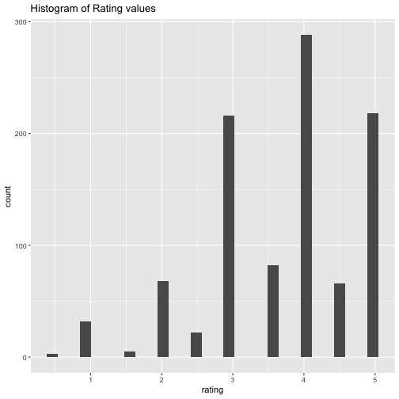
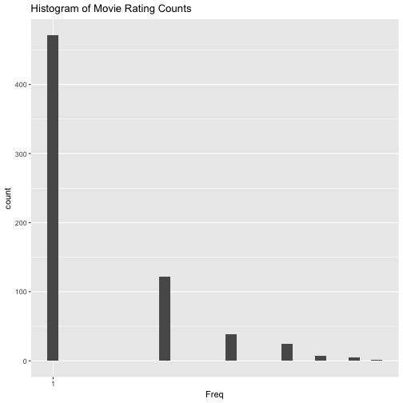
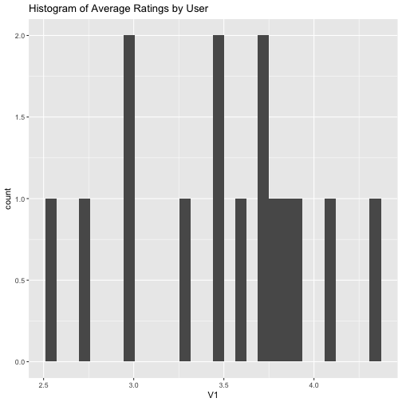
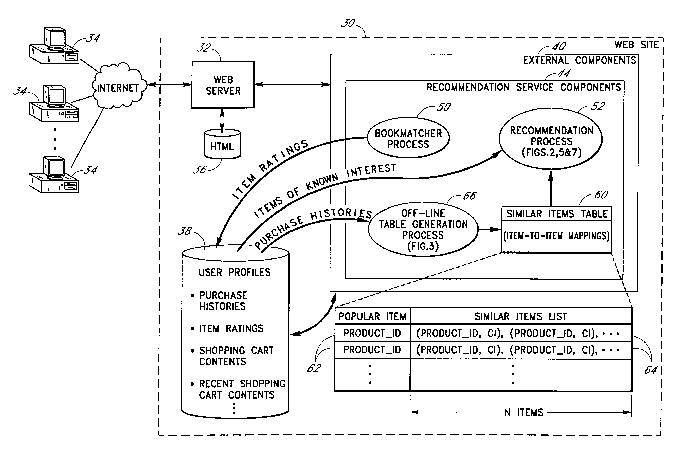
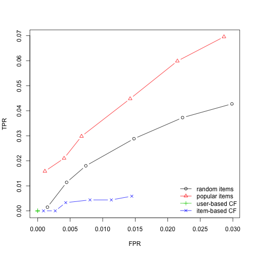
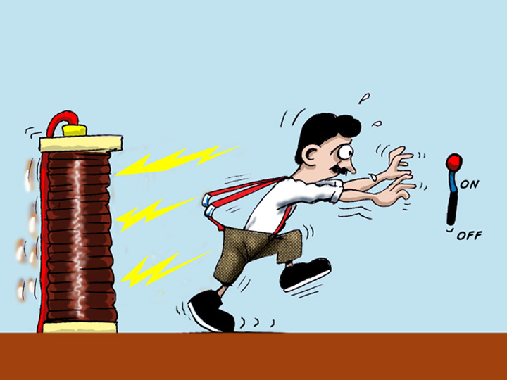

Recommender Systems
========================================================
css: ../../assets/style/uw.css
author: Justin Donaldson
date: May-11-2017
autosize: true


Applied Machine Learning 410
---------------------------------
(AKA: If you like that, your gonna love this)

Recommender Systems Arrive
======
Anybody remember this contest? (2009)


Recommender Systems Arrive
======

***
- One of the first "big money" prizes for data science
- Contestants from all over the world
- No holds barred, any technique was considered
- Winner gets a million bucks!

Old and Blockbusted
======
<a title="By Tracy the astonishing (The video store on Flickr) [CC BY-SA 2.0 (http://creativecommons.org/licenses/by-sa/2.0)], via Wikimedia Commons" href="https://commons.wikimedia.org/wiki/File%3AVideo_shop.jpg"></a>
***
- Previously, each copy of a movie took up space... somewhere.
- Impossible to stock *every* movie that *everyone* wants in a physical store
- Movies/Content catered towards *satisficing* broader demographics.
  - Sacrifice smaller fringe titles, stock more crowd pleasers

Overview
===
type : sub-section
- Content-based recommendation
- User-based recommendation
- Item-based recommendation
- Hybrids and New Techniques


Content-based recommendation
====
What constitutes *content*? 


***
- Simple measures/categories (themes, genres, abstract qualities)
- E.g. Moana is a [family] [musical] featuring [cg animation]
- May be automatically extracted
- Relies on a *profile* of the individual content, and *profile* of user preference

IMDB part deux
====
type : small-code

```r
dat = read.csv("../module3/movie_metadata.csv")
str(dat)
```

```
'data.frame':	5043 obs. of  28 variables:
 $ color                    : chr  "Color" "Color" "Color" "Color" ...
 $ director_name            : chr  "James Cameron" "Gore Verbinski" "Sam Mendes" "Christopher Nolan" ...
 $ num_critic_for_reviews   : int  723 302 602 813 NA 462 392 324 635 375 ...
 $ duration                 : int  178 169 148 164 NA 132 156 100 141 153 ...
 $ director_facebook_likes  : int  0 563 0 22000 131 475 0 15 0 282 ...
 $ actor_3_facebook_likes   : int  855 1000 161 23000 NA 530 4000 284 19000 10000 ...
 $ actor_2_name             : chr  "Joel David Moore" "Orlando Bloom" "Rory Kinnear" "Christian Bale" ...
 $ actor_1_facebook_likes   : int  1000 40000 11000 27000 131 640 24000 799 26000 25000 ...
 $ gross                    : int  760505847 309404152 200074175 448130642 NA 73058679 336530303 200807262 458991599 301956980 ...
 $ genres                   : chr  "Action|Adventure|Fantasy|Sci-Fi" "Action|Adventure|Fantasy" "Action|Adventure|Thriller" "Action|Thriller" ...
 $ actor_1_name             : chr  "CCH Pounder" "Johnny Depp" "Christoph Waltz" "Tom Hardy" ...
 $ movie_title              : chr  "Avatar " "Pirates of the Caribbean: At World's End " "Spectre " "The Dark Knight Rises " ...
 $ num_voted_users          : int  886204 471220 275868 1144337 8 212204 383056 294810 462669 321795 ...
 $ cast_total_facebook_likes: int  4834 48350 11700 106759 143 1873 46055 2036 92000 58753 ...
 $ actor_3_name             : chr  "Wes Studi" "Jack Davenport" "Stephanie Sigman" "Joseph Gordon-Levitt" ...
 $ facenumber_in_poster     : int  0 0 1 0 0 1 0 1 4 3 ...
 $ plot_keywords            : chr  "avatar|future|marine|native|paraplegic" "goddess|marriage ceremony|marriage proposal|pirate|singapore" "bomb|espionage|sequel|spy|terrorist" "deception|imprisonment|lawlessness|police officer|terrorist plot" ...
 $ movie_imdb_link          : chr  "http://www.imdb.com/title/tt0499549/?ref_=fn_tt_tt_1" "http://www.imdb.com/title/tt0449088/?ref_=fn_tt_tt_1" "http://www.imdb.com/title/tt2379713/?ref_=fn_tt_tt_1" "http://www.imdb.com/title/tt1345836/?ref_=fn_tt_tt_1" ...
 $ num_user_for_reviews     : int  3054 1238 994 2701 NA 738 1902 387 1117 973 ...
 $ language                 : chr  "English" "English" "English" "English" ...
 $ country                  : chr  "USA" "USA" "UK" "USA" ...
 $ content_rating           : chr  "PG-13" "PG-13" "PG-13" "PG-13" ...
 $ budget                   : num  2.37e+08 3.00e+08 2.45e+08 2.50e+08 NA ...
 $ title_year               : int  2009 2007 2015 2012 NA 2012 2007 2010 2015 2009 ...
 $ actor_2_facebook_likes   : int  936 5000 393 23000 12 632 11000 553 21000 11000 ...
 $ imdb_score               : num  7.9 7.1 6.8 8.5 7.1 6.6 6.2 7.8 7.5 7.5 ...
 $ aspect_ratio             : num  1.78 2.35 2.35 2.35 NA 2.35 2.35 1.85 2.35 2.35 ...
 $ movie_facebook_likes     : int  33000 0 85000 164000 0 24000 0 29000 118000 10000 ...
```

IMDB part deux
====
type : small-code 

```r
library(stringr)
library(coop)
dat = dat[dat$plot_keywords != '', ]
dat = dat[1:1000,]
keywords = str_split(dat$plot_keywords, "\\s*\\|\\s*")
keywords = lapply(keywords, str_trim)
all_keywords = sort(unique(unlist(keywords)))
keywords = sapply(keywords, function(x) {
  y = rep(0, length(all_keywords)); 
  names(y)<- all_keywords; 
  y[unlist(x)] = 1; 
  y
})
colnames(keywords)<- str_trim(dat$movie_title)

t(keywords[40:43,1:5])
```

```
                                         acorn act of kindness
Avatar                                       0               0
Pirates of the Caribbean: At World's End     0               0
Spectre                                      0               0
The Dark Knight Rises                        0               0
John Carter                                  0               0
                                         action figure action hero
Avatar                                               0           0
Pirates of the Caribbean: At World's End             0           0
Spectre                                              0           0
The Dark Knight Rises                                0           0
John Carter                                          0           0
```

IMDB part deux
====

```r
sims = cosine(keywords)
diag(sims) = 0
x = apply(sims,2,function(x) names(x)[which.max(x)])
x = x[1:25]
data.frame(x)
```

```
                                                                                            x
Avatar                                                                   Terminator Salvation
Pirates of the Caribbean: At World's End          Pirates of the Caribbean: On Stranger Tides
Spectre                                                                         Casino Royale
The Dark Knight Rises                                                         The Devil's Own
John Carter                                                                    Men in Black 3
Spider-Man 3                                                           The Amazing Spider-Man
Tangled                                                            The Huntsman: Winter's War
Avengers: Age of Ultron                                            Captain America: Civil War
Harry Potter and the Half-Blood Prince                                            The Holiday
Batman v Superman: Dawn of Justice                                    Avengers: Age of Ultron
Superman Returns                                                           The Golden Compass
Quantum of Solace                                 Pirates of the Caribbean: On Stranger Tides
Pirates of the Caribbean: Dead Man's Chest                                Godzilla Resurgence
The Lone Ranger                                               Transformers: Age of Extinction
Man of Steel                                                          Avengers: Age of Ultron
The Chronicles of Narnia: Prince Caspian                                Jack the Giant Slayer
The Avengers                                                                     The Avengers
Pirates of the Caribbean: On Stranger Tides          Pirates of the Caribbean: At World's End
Men in Black 3                                                                Men in Black II
The Hobbit: The Battle of the Five Armies   The Lord of the Rings: The Fellowship of the Ring
The Amazing Spider-Man                                                             Spider-Man
Robin Hood                                                                    Children of Men
The Hobbit: The Desolation of Smaug                 The Hobbit: The Battle of the Five Armies
The Golden Compass                                                       Crazy, Stupid, Love.
King Kong                                                            How to Train Your Dragon
```

Content Based Filtering Strengths
=====
- Naive : Domain knowledge not required
- Adaptive : quality improves over time and with more data
- Implicit : system can be trained by observing, rather than through scoring

Content Based Filtering Weaknesses
=====
- Cold Start : New User problem
- Data Hungry : Need lots of data to drive relationships
- Unstable : Adding new information can greatly change relationships (for better or worse) 


Collaborative Filtering (CF)
====
type : sub-section
- User ratings/observations drive item relationships
- Rather than study the *thing*, study *how people like the thing*

User-based recommendation
====
User based recommendation considers user-based signals, such as ratings, listens, likes, etc.  

Using these signals can model recommended content 
without knowing anything about the content at all! 
***
<a title="By Enoc vt (Own work) [CC BY-SA 3.0 (http://creativecommons.org/licenses/by-sa/3.0)], via Wikimedia Commons" href="https://commons.wikimedia.org/wiki/File%3ABot%C3%B3n_Me_gusta.svg"></a>


Collaborative Filtering
====

```r
library(plyr)
library(ggplot2)
ratings = read.csv("ml-latest-small/ratings.csv")
head(ratings)
```

```
  userId movieId rating  timestamp
1      1      31    2.5 1260759144
2      1    1029    3.0 1260759179
3      1    1061    3.0 1260759182
4      1    1129    2.0 1260759185
5      1    1172    4.0 1260759205
6      1    1263    2.0 1260759151
```

User-based recommendation
====
- Collect ratings from users and items
- Find similar users to use as "peers"
- Use means/medians of scores from peer ratings
- Find *high predicted scores* on *missing* items to use as recommendations 

***
<a title="By Moshanin (Own work) [CC BY-SA 3.0 (http://creativecommons.org/licenses/by-sa/3.0) or GFDL (http://www.gnu.org/copyleft/fdl.html)], via Wikimedia Commons" href="https://commons.wikimedia.org/wiki/File%3ACollaborative_filtering.gif"></a>

User-based recommendation
====

```r
ggplot(ratings, aes(x=rating)) + 
  geom_histogram() + 
  labs(title="Histogram of Rating values")
```



User-based recommendation
===

```r
user_counts = as.data.frame(table(ratings$userId))
ggplot(user_counts, aes(x=Freq)) + 
  geom_histogram() + 
  scale_x_log10() + 
  labs(title="Histogram of User Rating Counts")
```


User-based recommendation
====

```r
movie_counts = as.data.frame(table(ratings$movieId))
ggplot(movie_counts, aes(x=Freq)) + 
  geom_histogram() + 
  scale_x_log10() + 
  labs(title="Histogram of Movie Rating Counts")
```




User-based recommendation
====

```r
mean.ratings = ddply(ratings, .(userId), function(x) mean(x$rating, na.rm=T))
ggplot(mean.ratings,aes(x=V1)) + 
  geom_histogram() + 
  labs(title="Histogram of Average Ratings by User")
```




User-based recommendation
====
The recommenderlab package is *recommended* as a platform for recommender system analysis
- User based CF
- Item based CF
- SVD based CF
- Popularity Recommender
- Random Recommender

***

```r
library(recommenderlab)
```

User-based recommendation
====
We need to transform the ratings information into a special matrix form

```r
ratings = ratings[1:1000,] # subset for the sake of quick illustration
mratings = daply(ratings, .(userId, movieId), function(x) x$rating)
mratings[1:10,1:10]
```

```
      movieId
userId  1  2  3  5  6 10 11 14 16 17
    1  NA NA NA NA NA NA NA NA NA NA
    2  NA NA NA NA NA  4 NA NA NA  5
    3  NA NA NA NA NA NA NA NA NA NA
    4  NA NA NA NA NA  4 NA NA NA NA
    5  NA NA  4 NA NA NA NA NA NA NA
    6  NA NA NA NA NA NA NA NA NA NA
    7   3 NA NA NA NA  3 NA NA NA NA
    8  NA NA NA NA NA NA NA NA NA NA
    9   4 NA NA NA NA NA NA NA NA  4
    10 NA NA NA NA NA NA NA NA NA NA
```

User-based recommendation
====

```r
rrm <- as(mratings, "realRatingMatrix")
rrm
```

```
15 x 669 rating matrix of class 'realRatingMatrix' with 1000 ratings.
```

```r
getRatingMatrix(rrm)
```

```
15 x 669 sparse Matrix of class "dgCMatrix"
                                                                        
1  . . . .   . . .   .   .   . . .   .   . . 2.5 . . . .   . . .   .   .
2  . . . .   . 4 .   .   .   5 . .   .   . . .   . . . 5.0 . . .   4.0 4
3  . . . .   . . .   .   .   . . .   .   . . .   . . . .   . . .   .   .
4  . . . .   . 4 .   .   .   . . .   .   . . .   . 5 . .   . . .   .   .
5  . . 4 .   . . .   .   .   . . .   .   . . .   . . . 4.0 . . .   .   .
6  . . . .   . . .   .   .   . . .   .   . . .   . . . .   . . .   .   .
7  3 . . .   . 3 .   .   .   . . 3.0 .   . . 3.0 . 4 . .   4 . .   .   .
8  . . . .   . . .   .   .   . . .   .   . . .   5 . . .   . . 2.5 5.0 5
9  4 . . .   . . .   .   .   4 . .   .   . 3 .   . . 5 .   . . .   3.0 .
10 . . . .   . . .   .   .   . . .   .   . . .   . . . .   . . .   .   5
11 . . . .   . . .   .   .   . . .   .   . . .   . . . .   . . .   .   5
12 . . . .   . . .   .   .   . . .   .   . . .   . . . .   . . .   .   .
13 5 . . .   . . .   .   .   . . .   .   . . .   . . . .   . . .   2.5 .
14 . . . .   . . .   .   .   . . .   .   . . .   . . . .   . . .   .   .
15 2 2 . 4.5 4 3 2.5 2.5 3.5 3 1 4.5 2.5 3 . .   4 3 1 2.5 . 3 .   5.0 5
                                                                          
1  .   . . .   . . .   . . . . . .   . .   . . . .   . . . . . . . . . . .
2  3.0 . 3 .   . . .   . . . 4 . .   . .   . . 3 .   . 5 . . 4 . 3 3 3 . .
3  .   3 . .   . . .   . . . 4 . .   . .   . . . .   . . . . . . . . . . .
4  .   . . .   . . .   . . . . . 5.0 . .   . 5 . .   . . . . 4 . . . . . 3
5  .   . . .   . . .   . 4 . . . .   . .   . 4 . .   . 4 . . . . . . . . .
6  .   . . .   . . .   . . . . 4 .   . .   . . . .   . . . . . 2 . . . . 2
7  .   . . .   . . .   . 3 . 5 . 4.0 . .   . 4 . .   . . 4 . . . . . . . .
8  .   . . .   . . .   . . . 4 . .   . .   . . . .   . . . . . . . . . . .
9  .   . . .   . . .   . . . . . .   . .   . . . .   . . . . . . . . . . .
10 .   . . .   . . .   . . . . . .   . .   . . . .   . . . 4 . . . . . . .
11 .   . . 1.0 . . .   . . . . . .   . .   4 . . .   . . . . . . . . . 3 .
12 .   . . .   . . .   . . . . . .   . .   . . . .   . . . . . . . . . . .
13 .   . . .   . . .   . . . 4 . .   . .   . . . .   . . . . . . . . . . .
14 .   . . .   . . .   . . . . . .   . .   . . . .   . . . . . . . . . . .
15 2.5 . 2 0.5 5 3 1.5 4 1 2 3 5 2.5 4 3.5 . . . 3.5 5 3 . . 1 . . . . . .
                                                                        
1  . . . . . . . . .   . .   . . .   . . . . . . .   . . . . .   . . . .
2  3 3 . . 3 5 1 3 .   3 .   3 4 .   4 5 5 . 3 4 .   . . 3 . 4.0 3 4 . 2
3  . . . . . . . . .   . 3.5 . . .   . . . 3 . . .   . . . . 4.5 . . . .
4  3 . . . . . . . .   . .   . . 5.0 . . . . . . .   . 4 . . 5.0 . . . .
5  . . . . . . . . 3.5 . .   . . .   . . . . . . 4.5 . . . . .   . . . .
6  . . . . . . . . .   . .   . . .   . . . . . . .   . . . 5 .   . . . .
7  . . 2 3 . . . . .   . .   . . 5.0 . . . . 3 . .   . . . . .   . . 2 .
8  . . . . . . . . .   . .   . . 3.5 . . . . . . .   2 . . . 4.0 . . . .
9  . . . . . . . . .   . .   . . .   . . . . . . .   . . . . .   . . . .
10 . . . . . . . . .   . .   . . .   . . . . . . .   . . . . .   . . . .
11 . . . . . . . . .   . .   . . .   . . . . . . .   . . . . 5.0 . . . .
12 . . . . . . . . .   . .   . 3 .   . . . . . . .   . . . . .   . . . .
13 . . . . . . . . .   . .   . . .   . . . . . . 4.0 . . . . 3.5 . . . .
14 . . . . . . . . .   . .   . . .   . . . . . . .   . . . . .   . . . .
15 . . . . . . . . .   . .   . . .   . . . . . . .   . . . . .   . . . .
                                                                          
1  .   . . . . .   . . . .   . . .   . . . . . .   . . . . . . . . . . .  
2  .   1 . . 3 .   . 4 4 .   3 3 .   3 3 2 3 3 3.0 . 3 2 3 . . . . . 4 3.0
3  5.0 . . . . .   . . . 2.5 5 . .   . . . . . 2.5 . . . . . . . . . . .  
4  .   . 3 . . .   . 5 . .   5 5 .   5 4 . . . .   3 . . 3 3 4 1 4 4 . .  
5  .   . . . . 3.5 . . . .   4 . .   4 4 . . . 4.0 . . . . . . . 4 . . .  
6  .   . . . . .   . . . .   . . .   . . . . . .   . . . . . . . . . . .  
7  5.0 . 3 3 . .   3 . . 3.0 3 3 .   3 3 . . . 3.0 4 . . . . . . . . . .  
8  5.0 . . . . .   . . . .   4 . .   . . . . . .   . . . . . . . . . . 4.5
9  4.0 . . . . .   . . . .   . . .   . . . . . .   . . . . . . . . . . .  
10 4.0 . . . . 3.0 4 . . .   . . .   . . . . . .   . . . . . . . . . . .  
11 .   . . . . .   . . . .   . . .   . . . . . .   . . . . . . . . . . .  
12 .   . . . . .   . . . .   . . .   . . . . . .   . . . . . . . . . . .  
13 4.5 . . . . .   . . . .   5 . 4.5 . . . . . .   . . . . . . . . . . .  
14 .   . . . . .   . . . .   . . .   . . . . . .   . . . . . . . . . . .  
15 .   . . . . .   . . . .   . . .   . . . . . .   . . . . . . . . . . .  
                                                                        
1  . . . . . . .   . . . .   .   . . . . . . . . . . . . . . . .   . . .
2  . 4 2 4 3 3 4.0 4 4 4 .   .   4 . . . 4 . 3 . . 3 5 3 5 3 3 3.0 5 5 5
3  . . . . . . .   . . . .   .   3 . . . . . . . . . . . . . . 3.0 . . 3
4  4 . . 5 . . .   . . . .   .   . . . . . . . 5 . . . . . . . 5.0 5 3 .
5  . . . . . . 4.5 . . . .   .   . . . . . . . . . . . . . 4 . 3.5 . . .
6  . . . . . . .   . . . .   .   . . . . . . . . . . . . . . . .   . . .
7  . . . 4 . . 3.0 . . . .   .   . . . 4 . . 3 4 . . 4 . . . . 4.0 3 4 3
8  . . . . . . .   . . . 3.5 2.0 5 . . . . . . . 5 . . . . . . .   4 . .
9  . . . . . 4 .   . . 4 .   .   5 . . 5 . . . . . . . . . . . .   . . .
10 . . . . . . .   . . . .   .   . . . . . . . . . . . . . . . .   . . 3
11 . . . . . . .   . . . .   .   . . . . . . . . . . . . . . . .   . . .
12 . . . . . . .   . . . .   .   . 1 . . . 3 . . . . . . . . . .   . . .
13 . . . 3 . . .   . . . .   3.5 4 . 4 . . . . . . . . . . . 3 .   . 4 .
14 . . . . . . .   . . . .   .   . . . . . . . . . . . . . . . .   . . .
15 . . . . . . .   . . . .   .   . . . . . . . . . . . . . . . .   . . .
                                                                        
1  .   . . . . . . . . . . . . . . . . .   . . .   . .   . .   .   .   .
2  3.0 . . . . . . 3 . 4 . . . 4 . . . .   . . .   . .   . .   .   .   .
3  3.0 . 2 . . . . . . . . . . . . . . 3.5 . . 4.0 . .   . .   .   .   3
4  .   5 . 5 . . 4 5 . . . . . . . . . .   . . .   . .   . .   .   5.0 .
5  .   . 4 . 5 . . . . . . . . . . . . .   . . .   . .   . 3.5 .   2.5 .
6  .   . . 4 . . . . . . . . . . . . . .   . . .   . .   . .   .   .   .
7  .   4 3 . . . 3 . . . 4 . 3 5 2 . . 1.0 1 5 .   3 .   2 .   .   .   .
8  4.5 . . . . . . . 4 . . . . . . . . .   . . .   . .   . .   3.5 5.0 .
9  4.0 . . . . 5 . . . . . . . . . 2 . .   . . .   . .   . .   .   .   .
10 .   . . . . . . . . . . . . . . . 4 .   . . .   . .   . .   .   .   .
11 .   . . . . . . . . . . . . . . . . .   . . 4.5 . 3.5 . .   .   .   .
12 .   . . . . 2 . . . . . 1 . . . . . 4.0 3 . .   . .   . .   .   .   .
13 .   . . . . . . . . . . . . . . . . .   . . .   . .   . .   .   .   .
14 .   1 . . . . . . . . . . . . . . . .   . . .   . .   . .   .   .   .
15 .   . . . . . . . . . . . . . . . . .   . . .   . .   . .   .   .   .
                                                                          
1  .   . . . .   . . . . . .   . 3 . . . . . . . 3 . . . . . . . . . 2 . .
2  .   . . . .   . . . . . .   . . . . . . . . . . . . . . . . . . . . . .
3  .   . . . .   . . . . . .   . . . . . . . . . . . . . . . . . . . . . .
4  5.0 4 5 . 5.0 . . 4 4 5 .   5 . 5 5 5 5 . 5 . . 5 . 5 . 5 5 . 5 5 . 5 .
5  3.5 . . . 4.0 . . . . 4 .   . . . . . . 5 . . . . . . . . . . . . . . .
6  4.0 . . . .   . . . . . .   . . . . . . . . . . . . . . . . . . . . . .
7  .   . . . .   . 4 . . . .   . . . . . . . 3 . . 3 . 4 4 . 3 . 3 . 3 4 5
8  .   . . . .   . . . . . .   . . . . . . . . . . . . . . . . . . . . . .
9  .   . . . .   . . . . . .   . . . . . . . . 5 . . . . . . . . . . . . .
10 .   . . . .   . . . . . .   . . . . . . . 3 . . . . . . 3 . 2 . 4 . . .
11 .   . . . .   5 . . . . 4.5 . . . . . . . . . . . . . . . . . . . . . .
12 .   . . . .   . . . . . .   1 . . . 2 . . . . . . 3 . . . . . . . . . .
13 .   . . 4 3.5 . . . . . 3.0 . . . . . . . . . . . . . . . . . . . . . .
14 .   . . . .   . . . . . .   . . . . . . . . . . . . . . . . . . . . . .
15 .   . . . .   . . . . . .   . . . . . . . . . . . . . . . . . . . . . .
                                                                        
1  4 . . . .   . . . . . . . . . . . . . .   . . . . . . . . . . .   . .
2  . . . . .   . . . . . . . . . . . . . .   . . . . . . . . . . .   . .
3  . . . . .   5 . . . . . . 3 . . . . . .   . . . . . 4 . . . . .   . .
4  . . . 5 5.0 5 5 5 . . 5 5 5 5 5 . 5 5 .   5 . 5 5 . . 5 . 5 . .   5 5
5  . . 3 . .   . . . . . . . . . . . . . 2.5 . . . . . . . . . 4 .   . .
6  . . . . .   . . . . 5 . . . . . . . . .   . . . . . . . . . . 4.5 . .
7  . . . . 5.0 3 5 . . . . . 5 . . . . 4 .   . 5 5 . 4 . 4 5 . . .   . .
8  . . . . 3.5 4 4 . . . . . 4 . . . 4 . .   . . 4 . . . . . . . .   . 4
9  . 3 . . .   . . . . . . . . . . . . . .   . . . . . . . . . . .   . .
10 . . . . 4.0 4 4 4 . . . . 4 . . . . 3 .   . . . . . . 4 . . . .   . .
11 . . . . .   . . . 5 . . . . . . . . . .   . . . . . . . . . . .   . .
12 . . . . .   1 . . . . . . . . . 5 . 5 .   . . . 2 . 5 . . . . .   . .
13 . . . . .   . . . . . . . . . . . . . .   . . . . . . . . . . .   . .
14 . . . . 4.0 . . . . . . . . . . . . . .   . . . . . . . . . . .   . .
15 . . . . .   . . . . . . . . . . . . . .   . . . . . . . . . . .   . .
                                                                          
1  .   2 .   . . . .   . . .   2 . . 2 . . .   . . . 3.5 2 . . . . .   2.5
2  .   . .   . . . .   . . .   . . . . . . .   . . . .   . . . . . .   .  
3  .   . .   . 3 . .   . . .   . . . . . . .   . . . .   . . . . . .   .  
4  4.0 . 5.0 5 . . .   5 5 4.0 . 5 5 . . 4 .   4 4 5 .   . 5 . 4 . .   4.0
5  .   . .   . . . .   . . .   . . . . . . .   4 . . .   . . . . . .   .  
6  4.5 . .   . . . 4.5 . . 4.5 . . . . . . .   . . . .   . . . . . 2.0 .  
7  .   . .   3 . 4 .   3 . .   4 4 3 . . 3 4.0 3 . . .   . . 3 . . .   3.0
8  4.0 . 3.0 4 . . .   . . .   . . 4 . . . 3.5 . . . .   . . . . . 0.5 .  
9  .   . .   . . . .   . . .   . . . . . . .   . . . .   . . . . 4 4.0 .  
10 .   . .   . . . .   . . .   . . 4 . . . .   . . . .   . . . . . 5.0 .  
11 .   . .   . . . .   . . .   . . . . . . .   . . . .   . . . . . .   .  
12 .   . .   . . . .   . . .   . . . . 1 . .   . . . .   . . . . . .   .  
13 4.0 . 2.5 . . . .   . . .   . . . . . . .   . . . .   . . . . . .   .  
14 .   . .   . . . .   . . .   . . . . . . .   . . . .   . . . . . .   .  
15 .   . .   . . . .   . . .   . . . . . . .   . . . .   . . . . . .   .  
                                                                          
1  . . . . . . . . . . .   . . 1 . . . . .   . . . .   . .   . . .   . . .
2  . . . . . . . . . . .   . . . . . . . .   . . . .   . .   . . .   . . .
3  . . . . . . 4 . . . .   . . . . . . . .   . . . .   . 3.5 . . .   . . .
4  3 . 4 . 3 3 . 5 5 4 .   . 5 . . . . . .   . . . 3.0 . 5.0 . . .   . . 4
5  . . . . . . . 5 . . 3.5 . . . . . . . 4.5 . . . 3.5 . .   . . .   . . .
6  . . . . . . . . . . .   . . . . . . . .   . . . .   . .   . . .   . 2 .
7  3 2 4 3 3 . . . . . .   3 . 5 1 . . . .   . . . .   . .   . . .   . . .
8  . . . . . . . . 4 . 3.0 . . . . . . . .   . 4 . .   3 .   . . 3.5 5 . .
9  . . . . . . . . . . .   . . . . 3 . . .   . . 2 .   . .   4 . .   . . .
10 . . . . . . . . . . .   . . . . . 4 3 .   3 . . .   . .   . 5 .   . . .
11 . . . . . . . . . . .   . . . 5 . . . .   . . . .   . .   . . .   . . .
12 . . 1 . . . . . 4 . .   . . . . . . . .   . . . .   . .   . . .   . 2 .
13 . . . . . . . . . . .   . . . . . . . .   . . . .   . .   . . .   . . .
14 . . . . . . . . . . .   . . . . . . . .   . . . .   . .   . . .   . . .
15 . . . . . . . . . . .   . . . . . . . .   . . . .   . .   . . .   . . .
                                                                          
1  . . . . . . . .   . . . . .   . . .   . . . . . .   4 . . . . . .   . .
2  . . . . . . . .   . . . . .   . . .   . . . . . .   . . . . . . .   . .
3  . . . . . . . 4.5 . . . . .   . . .   4 . . . . .   . . . . . . .   . .
4  5 . . . . . . .   . . . . .   1 5 .   . . . 4 2 .   5 5 5 3 5 5 .   5 .
5  . . 4 . . . . 4.0 . . . 4 4.5 . . .   . . . . . 4.5 . . 4 . 4 . 3.5 . .
6  . . . 2 . . . .   . 2 . . .   . . 0.5 . . 3 . . .   . . . . . . .   . 3
7  . . . . . . . .   . . . . .   . . .   . . . . . .   . . . . . . .   . .
8  4 . . . . 4 . .   . . 3 5 .   . . 3.5 . . . . . .   . . 5 . . . .   . .
9  . 4 5 . . 4 . 3.0 . . . . 5.0 . . .   . . . . . .   . . . . . . .   . .
10 . . . . 3 4 5 .   . . . . .   . . .   . 2 . . . 5.0 . . . . . . .   . .
11 . . . . . . . .   . . . . .   . . .   . . . . 3 .   . . . . . . .   . .
12 . . . . . . . .   3 . . . .   . . .   . . . . . .   . . . . . . .   . .
13 . . . . . . . .   . . . . .   . . .   . . . . 3 .   . . 4 . . . .   . .
14 . . . . . . . 3.0 . . . . .   . . .   . . . . . .   . . . . . . .   . .
15 . . . . . . . .   . . . . .   . . .   . . . . . .   . . . . . . .   . .
                                                                          
1  . . . . . . . . .   . . . . .   . . . . . . . . . . . . . . . 4 . . . .
2  . . . . . . . . .   . . . . .   . . . . . . . . . . . . . . . . . . . .
3  . . . . . . . . .   4 . . . .   . . . . . . . . . . . . . . . . . . . .
4  3 2 5 4 5 . 4 4 .   . 4 4 . .   5 3 5 . 5 5 4 5 5 5 5 4 5 5 5 4 . 5 3 5
5  . . . . . . . . 1.5 . . . . .   . . . . . . 5 . . . . . . . . . . . . .
6  . . . . . 4 . . .   . . . . .   . . . 4 . . . . . . . . . . . . . . . .
7  . . . . . . . . .   . . . . .   . . . . . . . . . . . . . . . . . . . .
8  . . . . . . . . .   4 . . . .   . . . . . . . . . . . . . 3 . . . . . .
9  . . . . . . . . .   4 . . . .   . . . . . . . . . . . . . . . . . . . .
10 . . . . . . . . .   . . . . .   . . . . . . . . . . . . . . . . 3 . . .
11 . . . . . . . . .   . . . . 3.5 . . . . . . . . . . . . . . . . . . . .
12 . . . . . . . . .   . . . . .   . . . . . . . . . . . . . . . . . . . .
13 . . . . . . . . .   . . . . .   . . . . . . . . . . . . . . . . . . . .
14 . . . . . . . . .   . . . 3 .   . . . . . . . . . . . . . . . . . . . .
15 . . . . . . . . .   . . . . .   . . . . . . . . . . . . . . . . . . . .
                                                                          
1  . . . . . . . . 3 . . 2 .   . . . . . . . . . 2 .   . . . . . .   .   .
2  . . . . . . . . . . . . .   . . . . . . . . . . .   . . . . . .   .   .
3  . . . . . . . . . . . . .   . . . . . . . . . . .   4 . . . . .   .   .
4  5 4 . . 5 4 4 5 . 5 5 3 5.0 4 . . 3 5 . . 5 . . .   . . . . 4 .   .   4
5  . . . . . . . . . . . . .   . . . . . 4 . . . 4 .   . . . . . .   3.5 .
6  . . . . . . . . . . 4 . .   . . . . . . . . . . .   . . . . . .   .   .
7  . . . . . . . . . . . . .   . . . . . . . . . . .   . . . . . .   .   .
8  . . . 3 . . . . . . . . 4.5 . . . . . . . . . . 4.5 . 4 5 . . 3.5 .   .
9  . . 4 . 4 . . . . . . . .   . 4 . . 3 3 4 . 4 2 4.0 . . . . . .   .   .
10 . . . . . . . . . . . . .   . . . . . . . . . . .   . . . 5 . .   .   .
11 . . . . . . . . . . . . .   . . . . . . . . . . .   . . . . . .   .   .
12 . . . . . . . . . . . . .   . . 2 . . . . . . . .   . . . . . .   2.0 .
13 . . . . . . . . . . . . .   . . . . . . . . . . .   . . . . . .   4.0 .
14 . . . . . . . . . . . . .   . . . . . . . . . . .   . . . . . .   2.0 .
15 . . . . . . . . . . . . .   . . . . . . . . . . .   . . . . . .   .   .
                                                                          
1  . . . . . . . .   . . . 2.5 . . . . .   . . . . . . .   .   . . . . . .
2  . . . . . . . .   . . . .   . . . . .   . . . . . . .   .   . . . . . .
3  . . . . . . . .   . . . .   . . . . .   3 . . . . . .   .   . . . . . .
4  . . . 4 5 4 . .   . . 5 .   . 5 . . .   . . . . 4 . .   .   1 5 5 . 3 .
5  . . . . . . . .   4 . . .   . . . . 3.5 . . . . . . .   .   . . . . . .
6  . . . . . . . .   . . . .   . . . . 3.5 . 3 4 . . 1 .   .   . . . 2 . .
7  . . . . . . . .   . . . .   . . . . .   . . . . . . .   .   . . . . . .
8  . . . . . . . 3.5 . . . .   . . . . 5.0 . . . . . 5 .   .   . . . . . .
9  4 . 4 . . . . .   . 2 . .   . . 3 4 .   . . . 2 . 5 .   .   . 3 . . . .
10 . . . . 4 . 2 .   . . . .   . . . . .   . . . 4 . 5 .   .   . . . . . .
11 . . . . . . . .   . . . .   . . . . .   . . . . . . .   4.5 . . . . . .
12 . . . . . . . .   . . . .   4 . . . .   . . 1 . . . .   .   . . . . . 2
13 . . . . . . . .   . . . .   . . . . .   . . . . . 3 3.5 .   . . . . . .
14 . 3 . . . . . .   . . . .   . . . . .   . . . . . . .   .   . 3 . . . .
15 . . . . . . . .   . . . .   . . . . .   . . . . . . .   .   . . . . . .
                                                                          
1  . . .   . .   . .   . . . . .   .   .   . .   . .   .   . . . . . . .  
2  . . .   . .   . .   . . . . .   .   .   . .   . .   .   . . . . . . .  
3  . . 3.0 . 3.5 . 3.0 . . . . .   3.5 .   . .   . .   .   . . . . 4 . 4.0
4  4 . .   4 .   . 5.0 . 5 . 4 .   .   1.0 5 5.0 4 5.0 5.0 3 . . . . . .  
5  4 . 4.5 . .   4 .   . . . . .   3.5 3.5 . .   . .   .   . . . . . . .  
6  . 4 .   . .   . .   . 3 . . 4.5 .   .   . .   . .   .   . . . . . . .  
7  . . .   . .   . .   . . . . .   .   .   . .   . .   .   . . . . . . .  
8  . . .   . .   . 3.5 . . . . .   4.5 2.5 . 4.5 . 3.5 3.5 . . . . 3 . 4.5
9  . . .   . .   . .   . . . . .   4.0 .   . .   . .   .   . . . . . 4 .  
10 . . .   . .   . .   . . . . .   .   .   . .   . .   .   . 5 3 3 4 . .  
11 . . .   . .   . .   . . . . .   3.0 .   . .   . .   .   . . . . . . .  
12 . . .   . .   . .   . . . . .   .   .   . .   . .   .   . . . . . . .  
13 . . .   . .   . .   . . . . 4.0 3.0 .   . .   . .   3.0 . . . . . . .  
14 2 . .   . .   . 3.0 2 . 3 . .   .   .   . .   . .   .   . . . . . . .  
15 . . .   . .   . .   . . . . .   .   .   . .   . .   .   . . . . . . .  
                                                                          
1  . . . . . . . . . . . .   . . 1 . . . . .   . . . . . . . . . . . . .  
2  . . . . . . . . . . . .   . . . . . . . .   . . . . . . . . . . . . .  
3  . . . . . . . . . . . .   . 5 . . . . . .   . . . . . . . . . . . . .  
4  . 3 5 5 . . 2 1 . . 4 5.0 . . 5 3 5 5 . .   . 3 . 5 4 5 . 5 4 4 4 5 .  
5  . . . . . . . . . . . 3.5 . . . . . . . 3.5 . . . . . . . . . . . . 3.5
6  . . . . . 3 . . . . . .   . . . . . . . .   . . . . . . 1 . . . . . 4.0
7  . . . . . . . . . . . .   . . . . . . . .   . . . . . . . . . . . . .  
8  . . . . . . . . . . . 5.0 . 4 . . . . . .   . . . . . . . . . . . . .  
9  . . . . . . . . . . . .   . . . . . . . .   . . . . . . . . . . . . .  
10 . . . . 3 4 . . 2 . . .   5 . . . . . 2 .   3 . 4 . . . . . . . . . .  
11 . . . . . . . . . . . .   . . . . . . . .   . . . . . . . . . . . . .  
12 . . . . . . . . . . . .   . 4 . . . . . .   . . . . . . . . . . . . .  
13 . . . . . . . . . 3 . 3.0 . . . . . . . .   . . . . . . . . . . . . 3.0
14 2 . . . . . . . . . . .   . . . . . . . .   . . . . . . . . . . . . 4.0
15 . . . . . . . . . . . .   . . . . . . . .   . . . . . . . . . . . . .  
                                                                        
1  . .   . . . . .   . . . . . .   . . . .   . . .   . . . . . . . 3 .  
2  . .   . . . . .   . . . . . .   . . . .   . . .   . . . . . . . . .  
3  . .   . . . . .   . . . 3 . .   . . . .   . . .   . . . 4 . . . . .  
4  . .   . . 4 . .   . 2 4 . 5 4.0 3 5 . .   . . .   . . . . . . . . .  
5  . .   . . . . 3.5 . . . . . .   . . . .   . . .   4 . . . . . . . .  
6  . .   . . . . .   . . . . . .   . . . 3.5 . . .   . . . . . . . . 1.5
7  . .   . . . . .   . . . . . .   . . . .   . . .   . . . . . . . . .  
8  . 4.5 . . . . .   . . . . . .   . . . .   . . .   . . . . 5 . . . .  
9  . .   . . . . .   . . . . . .   . . . .   . . .   . . . . . . . . .  
10 . .   . . . . .   . . . . . .   . . . .   . . .   . . . . . . . . .  
11 . .   . . . . .   . . . . . .   . . . .   . . .   . 3 . . . . . . .  
12 2 .   1 . . . 3.0 2 . . . . .   . . 4 .   1 . .   4 . 4 . . . . . .  
13 . 4.0 . . . . .   . . . . . 3.5 . . . .   . . 3.5 . . . . . . 3 . .  
14 . .   . 2 . 5 .   . . . . . .   . . . .   . 3 .   . . . . . 3 . . 4.0
15 . .   . . . . .   . . . . . .   . . . .   . . .   . . . . . . . . .  
                                                                          
1  .   . . . . . . . . . . . . . . . . . . . . . . . . . . .   .   .   . .
2  .   . . . . . . . . . . . . . . . . . . . . . . . . . . .   .   .   . .
3  .   . . . . . . . . . . . . . . . . . . . . . . . . . . .   .   .   5 .
4  .   . . . . . . . . . . . . . . . . . . . . . . . . . . .   .   .   . .
5  3.5 . . . . . . . . . . . . . . . . . . . . . . . . . . 4.5 .   3.5 . .
6  .   . . . . . . . . . . . . . . . . . . . . . . . . . . .   .   .   . .
7  .   . . . . . . . . . . . . . . . . . . . . . . . . . . .   .   .   . .
8  .   . . . . . . . . . . . . . . . . . . . . . . . . . . .   3.5 4.0 . .
9  .   . . . . . . . . . . . . . . . . . . . . . . . . . . .   .   .   . .
10 .   . . . . . . . . . . . . . . . . . . . . . . . . . . .   .   .   . .
11 .   . . . . . . . . . . . . . . . . . . . . . . . . . . .   .   .   . .
12 .   3 2 2 1 5 3 4 1 3 3 5 2 2 4 2 1 3 5 3 5 2 2 3 5 3 2 .   .   .   . .
13 .   . . . . . . . . . . . . . . . . . . . . . . . . . . .   .   .   . .
14 .   . . . . . . . . . . . . . . . . . . . . . . . . . . .   .   .   . 3
15 .   . . . . . . . . . . . . . . . . . . . . . . . . . . .   .   .   . .
                                                                        
1  . . . .   . . .   .   .   .   . . .   .   .   .   .   .   .   .   .  
2  . . . .   . . .   .   .   .   . . .   .   .   .   .   .   .   .   .  
3  . . . .   . . .   .   .   .   . . .   .   .   .   .   .   .   .   .  
4  . . 2 .   . . .   .   .   .   . . .   .   .   .   .   .   .   .   .  
5  . . . .   4 4 .   3.5 4.5 .   . . 3.5 3.5 .   .   4.5 .   .   3.5 .  
6  . . . .   . . .   .   .   .   . . .   .   .   .   .   .   1.5 .   .  
7  . . . .   . . .   .   .   .   . . .   .   .   .   .   .   .   .   .  
8  . 4 . 4.5 . . 3.5 .   .   4.5 5 4 .   .   .   .   .   2.5 .   .   .  
9  . . . .   . . .   .   .   .   . . .   .   .   .   .   .   .   .   .  
10 . . . .   . . .   .   .   .   . . .   .   .   .   .   .   .   .   .  
11 . . . .   . . .   .   .   .   . . .   .   .   .   .   .   .   .   .  
12 . . . .   . . .   .   .   .   . . .   .   .   .   .   .   .   .   .  
13 . . . .   . . .   .   .   .   . . 4.0 .   4.5 2.5 .   .   .   3.5 4.5
14 4 . . .   . . .   .   .   .   . . .   .   .   .   .   .   .   .   .  
15 . . . .   . . .   .   .   .   . . .   .   .   .   .   .   .   .   .  
                                                                          
1  .   .   .   . .   .   .   . .   .   .   .   .   . . . .   .   . . .   .
2  .   .   .   . .   .   .   . .   .   .   .   .   . . . .   .   . . .   .
3  .   .   .   . .   .   .   . .   .   3.0 .   .   . . . 3.5 .   . . .   .
4  .   .   .   . .   .   .   . .   .   .   .   .   . . . .   .   . . .   .
5  .   .   3.0 . .   .   4.5 . 3.5 4.5 4.5 .   .   4 . . 3.5 4.5 3 . .   4
6  .   .   .   . 1.5 .   .   . .   .   .   .   .   . . . .   .   . 5 .   .
7  .   .   .   . .   .   .   . .   .   .   .   .   . . . .   .   . . .   .
8  3.5 3.5 4.5 4 .   3.5 3.5 5 .   .   .   3.5 4.5 4 4 4 3.0 .   . 4 3.5 .
9  .   .   .   . .   .   .   . .   .   .   .   .   . . . .   .   . . .   .
10 .   .   .   . .   .   .   . .   .   .   .   .   . . . .   .   . . .   .
11 .   .   .   . .   .   .   . .   .   .   .   .   . . . 3.0 .   . . .   .
12 .   .   .   . .   .   .   . .   .   .   .   .   . . . .   .   . . .   .
13 3.5 .   .   . .   4.5 .   . .   .   .   .   .   . . . .   .   . . 4.0 .
14 .   .   .   . .   .   .   . .   .   .   .   .   . . . .   .   . . .   .
15 .   .   .   . .   .   .   . .   .   .   .   .   . . . .   .   . . .   .
                                                                        
1  . .   . .   . . . .   . . . . . .   .   . . .   .   . . .   .   .   .
2  . .   . .   . . . .   . . . . . .   .   . . .   .   . . .   .   .   .
3  . .   . 3.0 . . . .   . . . . . .   2.5 3 . .   .   . . .   3.5 3.0 .
4  . .   . .   . . . .   . . . . . .   .   . . .   .   . . .   .   .   .
5  . 3.5 4 4.0 . 4 . 2.5 . . . 4 . .   .   . . .   .   4 4 .   3.5 4.5 4
6  . .   . .   . . . .   . . . . 3 .   5.0 4 . .   3.5 . . .   .   4.0 .
7  . .   . .   . . . .   . . . . . .   .   . . .   .   . . .   .   .   .
8  . .   . 4.0 3 . . .   4 5 3 . . 3.5 4.0 4 4 .   .   . . 2.5 .   .   .
9  . .   . .   . . . .   . . . . . .   .   . . .   .   . . .   .   .   .
10 . .   . .   . . . .   . . . . . .   .   . . .   .   . . .   .   .   .
11 . .   . .   . . 5 .   . . . . . .   .   . . .   .   . . .   .   .   .
12 4 .   . .   . . . .   . . . . . .   .   . . .   .   . . .   .   .   .
13 . .   . 4.5 . . . .   . . . . . .   .   4 . 4.5 .   . . .   .   .   .
14 . .   . .   . . . .   . . . . . .   .   . . .   .   . . .   .   .   .
15 . .   . .   . . . .   . . . . . .   .   . . .   .   . . .   .   .   .
                                                                          
1  .   . .   . .   .   .   .   .   .   .   . .   .   . .   .   . . . .   .
2  .   . .   . .   .   .   .   .   .   .   . .   .   . .   .   . . . .   .
3  .   . .   . 3.5 .   .   .   .   .   .   . .   .   . .   .   . . . .   .
4  .   . .   . .   .   .   .   .   .   .   . .   .   . .   .   . . . .   .
5  .   . .   . .   4.5 4.5 3.5 .   5.0 .   4 .   4.5 4 .   4.5 4 4 . .   .
6  3.0 . 4.5 . .   .   .   .   .   .   .   . .   .   . .   .   . . . .   .
7  .   . .   . .   .   .   .   .   .   .   . .   .   . .   .   . . . .   .
8  4.5 4 3.0 . .   .   .   .   3.5 4.5 4.5 . 4.5 3.5 . 3.5 3.5 . . 2 3.5 3
9  .   . .   . .   .   .   .   .   .   .   . .   .   . .   .   . . . .   .
10 .   . .   . .   .   .   .   .   .   .   . .   .   . .   .   . . . .   .
11 .   . .   5 .   .   .   .   .   .   .   . .   .   . .   .   . . . .   .
12 .   . .   . .   .   .   .   .   .   .   . .   .   . .   .   . . . .   .
13 .   . .   . .   .   .   .   .   .   .   . .   .   . .   .   . . . .   .
14 .   . .   . .   .   .   .   .   .   .   . .   .   . .   .   . . . .   .
15 .   . .   . .   .   .   .   .   .   .   . .   .   . .   .   . . . .   .
                                                                        
1  . .   .   . .   .   . .   .   .   .   . .   .   . . .   . . .   .   .
2  . .   .   . .   .   . .   .   .   .   . .   .   . . .   . . .   .   .
3  . 3.5 .   . 4.5 4.5 . .   .   3.0 .   . .   .   . . .   . . .   .   4
4  . .   .   . .   .   . .   .   .   .   . .   .   . . .   . . .   .   .
5  . .   4.5 . .   .   . .   .   .   .   . .   .   . . .   . . .   .   .
6  . .   .   . .   .   . .   .   .   .   . .   .   . . .   . . .   .   .
7  . .   .   . .   .   . .   .   .   .   . .   .   . . .   . . .   .   .
8  3 .   .   . .   .   . .   .   .   .   . .   .   . . .   . . .   .   .
9  . .   .   . .   .   . .   .   .   .   . .   .   . . .   . . .   .   .
10 . .   .   . .   .   . .   .   .   .   . .   .   . . .   . . .   .   .
11 . .   .   5 .   .   4 .   4.5 .   .   . 3.5 4.5 . 4 4.5 3 4 3.5 .   .
12 . .   .   . .   .   . .   .   .   .   . .   .   . . .   . . .   .   .
13 . .   .   . .   .   . 3.5 .   4.5 4.5 4 .   .   4 . .   . . .   4.5 .
14 . .   .   . .   .   . .   .   .   .   . .   .   . . .   . . .   .   .
15 . .   .   . .   .   . .   .   .   .   . .   .   . . .   . . .   .   .
                              
1  .   . .   .   . . . . . . .
2  .   . .   .   . . . . . . .
3  .   . .   .   . . . . . . .
4  .   . .   .   . . . . . . .
5  .   . .   .   . . . . . . .
6  .   . .   .   . . . . . . .
7  .   . .   .   . . . . . . .
8  .   . .   .   . . . . . . .
9  .   . .   .   . . . . . . .
10 .   . .   .   . . . . . . .
11 .   4 4.5 4.5 4 . 4 4 4 5 5
12 .   . .   .   . . . . . . .
13 4.5 . .   .   . 3 . . . . .
14 .   . .   .   . . . . . . .
15 .   . .   .   . . . . . . .
```


User-based recommendation
====
Important questions:
- Are there users that are biasing the rankings?
- Is there enough coverage of movies to make recommendations?

User-based recommendation
====

```r
ubcf <- Recommender(rrm, method = "UBCF")
getModel(ubcf)
```

```
$description
[1] "UBCF-Real data: contains full or sample of data set"

$data
15 x 669 rating matrix of class 'realRatingMatrix' with 1000 ratings.
Normalized using center on rows.

$method
[1] "cosine"

$nn
[1] 25

$sample
[1] FALSE

$normalize
[1] "center"

$verbose
[1] FALSE
```


User-based recommendation
====
We can predict the missing values in the matrix of user/movie rankings (NAs are placeholders for original ratings)

```r
recom = predict(ubcf, rrm, n=5, type="ratings")
as(recom, "matrix")[1:8,1:4]
```

```
         1        2        3        5
1       NA       NA       NA       NA
2       NA       NA       NA       NA
3       NA       NA       NA       NA
4 4.328837 4.345150 4.348821 4.352469
5 3.946240 3.905947       NA 3.916215
6       NA       NA       NA       NA
7       NA       NA       NA       NA
8       NA       NA       NA       NA
```

User-based recommendation Strengths
=====
- Free-form : can handle niches that cross genres/taxonomies
- Naive : Domain knowledge not required 
- Adaptive : Quality improves over time with more data
- Implicit : Doesn't require explicit ratings (although can use them)

User-based recommendation Weaknesses
=====
- Cold Start : Problems for users *and* items
- Stability : User ratings can change numerous recommendations
- Costly to Update : Recommendations are specific to user and can be unstable

Item-based recommendation
====
User-based collaborative filtering had problems:
- Systems with many items/few ratings performed poorly
- Calculating all pairs of users expensive
- Users change quickly, system needs to be recomputed

Item-based recommendation
====
Item-based collaborative filtering use rating distributions *per-item* rather than *per-user*.  Because of this:
- Rating is more stable (but less specific to user)
- Item recommendations can be pre-computed
- Recommendations can still be driven from items the user rates.

Item-based recommendation
====

Amazon patent on Item-based CF from 1998!
***
Item-based collaboratrve steps:
- Find similarity between all pairs of items (e.g. correlation)
- Find items rated highly by the user
- Recommend items correlated with highly rated items


Item-based recommendation
====
Using recommenderlab, once more

```r
ibcf <- Recommender(rrm, method = "IBCF")
getModel(ibcf)
```

```
$description
[1] "IBCF: Reduced similarity matrix"

$sim
669 x 669 sparse Matrix of class "dgCMatrix"
                                                                  
1      .         .         .         .         .         .        
2      0.5871360 .         .         1.0000000 1.0000000 .        
3      .         .         .         .         .         .        
5      0.5871360 1.0000000 .         .         1.0000000 .        
6      0.5871360 1.0000000 .         1.0000000 .         .        
10     .         .         .         .         .         .        
11     0.5871360 1.0000000 .         1.0000000 1.0000000 .        
14     0.5871360 1.0000000 .         1.0000000 1.0000000 .        
16     0.5871360 1.0000000 .         1.0000000 1.0000000 .        
17     .         .         .         .         .         .        
19     0.5871360 1.0000000 .         1.0000000 1.0000000 .        
21     .         0.9557218 .         0.9557218 0.9557218 .        
22     0.5871360 1.0000000 .         1.0000000 1.0000000 .        
25     0.5871360 1.0000000 .         1.0000000 1.0000000 .        
26     .         .         .         .         .         .        
31     .         .         .         .         .         .        
32     .         .         .         .         .         .        
34     .         .         .         .         .         .        
36     0.5747896 0.8474864 .         0.8474864 0.8474864 .        
39     .         .         .         .         .         .        
40     .         .         .         .         .         .        
44     0.5871360 1.0000000 .         1.0000000 1.0000000 .        
45     .         .         .         .         .         .        
47     0.7993895 0.7244188 .         0.7244188 0.7244188 .        
50     .         0.7051398 .         0.7051398 0.7051398 .        
52     .         .         .         .         .         .        
60     .         .         .         .         .         .        
62     0.5265470 0.8968059 .         0.8968059 0.8968059 .        
70     .         .         .         .         .         .        
82     0.5871360 1.0000000 .         1.0000000 1.0000000 .        
94     0.5871360 1.0000000 .         1.0000000 1.0000000 .        
95     0.5871360 1.0000000 .         1.0000000 1.0000000 .        
101    0.5871360 1.0000000 .         1.0000000 1.0000000 .        
104    0.6342989 0.9726444 .         0.9726444 0.9726444 .        
107    0.5871360 1.0000000 .         1.0000000 1.0000000 .        
110    .         .         .         .         .         .        
111    0.5512057 0.9388042 .         0.9388042 0.9388042 .        
112    .         .         .         .         .         .        
123    0.5871360 1.0000000 .         1.0000000 1.0000000 .        
125    0.5871360 1.0000000 .         1.0000000 1.0000000 .        
126    .         .         .         .         .         .        
141    .         .         .         .         .         .        
144    .         .         .         .         .         .        
145    0.5871360 1.0000000 .         1.0000000 1.0000000 .        
149    0.5871360 1.0000000 .         1.0000000 1.0000000 .        
150    .         .         .         .         .         .        
151    .         .         .         .         .         .        
152    .         .         .         .         .         .        
153    0.5604768 0.9545945 .         0.9545945 0.9545945 .        
158    .         .         .         .         .         .        
161    .         .         .         .         .         .        
165    .         .         .         .         .         .        
168    .         .         .         .         .         .        
169    .         .         .         .         .         .        
173    .         .         .         .         .         .        
185    .         .         .         .         .         .        
186    .         .         .         .         .         .        
198    .         .         .         .         .         .        
207    .         .         .         .         .         .        
208    .         .         .         .         .         .        
222    .         .         .         .         .         .        
223    .         .         .         .         .         .        
225    .         .         .         .         .         .        
231    .         .         .         .         .         .        
235    .         .         .         .         .         .        
247    .         .         .         .         .         .        
248    .         .         .         .         .         .        
253    .         .         .         .         .         .        
260    .         .         .         .         .         .        
261    .         .         .         .         .         .        
265    .         .         .         .         .         .        
266    .         .         .         .         .         .        
267    .         .         .         .         .         .        
272    .         .         .         .         .         .        
273    .         .         .         .         .         .        
277    .         .         .         .         .         .        
282    .         .         .         .         .         .        
289    .         .         .         .         .         .        
292    .         .         .         .         .         .        
293    .         .         .         .         .         .        
296    .         .         .         .         .         .        
300    .         .         .         .         .         .        
314    .         .         .         .         .         .        
316    .         .         .         .         .         .        
317    .         .         .         .         .         .        
318    .         .         .         .         .         .        
319    .         .         .         .         .         .        
329    .         .         .         .         .         .        
333    .         .         .         .         .         .        
339    .         .         .         .         .         .        
344    .         .         .         .         .         .        
345    .         .         .         .         .         .        
349    .         .         .         .         .         .        
350    .         .         .         .         .         .        
355    .         .         .         .         .         .        
356    .         .         .         .         .         .        
357    .         .         .         .         .         .        
362    0.7465121 .         .         .         .         .        
364    .         .         .         .         .         .        
367    .         .         .         .         .         .        
370    .         .         .         .         .         .        
371    .         .         .         .         .         .        
372    .         .         .         .         .         .        
377    .         .         .         .         .         .        
380    .         .         .         .         .         .        
382    .         .         .         .         .         .        
405    .         .         .         .         .         .        
410    .         .         .         .         .         .        
431    .         .         .         .         .         .        
434    .         .         .         .         .         .        
435    .         .         .         .         .         .        
440    .         .         .         .         .         .        
442    .         .         .         .         .         .        
454    .         .         .         .         .         .        
457    .         .         .         .         .         .        
464    .         .         .         .         .         .        
468    .         .         .         .         .         .        
474    .         .         .         .         .         .        
480    .         .         .         .         .         .        
485    .         .         .         .         .         .        
497    .         .         .         .         .         .        
500    .         .         .         .         .         0.6804023
508    .         .         .         .         .         .        
509    .         .         .         .         .         .        
515    .         .         .         .         .         .        
520    .         .         .         .         .         .        
524    .         .         .         .         .         .        
527    .         .         .         .         .         .        
529    .         .         .         .         .         .        
531    0.7465121 .         .         .         .         .        
534    .         .         .         .         .         .        
537    .         .         .         .         .         .        
538    .         .         .         .         .         .        
539    .         .         .         .         .         .        
541    .         .         .         .         .         .        
543    .         .         .         .         .         .        
550    .         .         .         .         .         .        
551    .         .         .         .         .         .        
552    .         .         .         .         .         .        
585    .         .         .         .         .         .        
586    .         .         .         .         .         .        
587    0.6249839 .         .         .         .         .        
588    .         .         .         .         .         0.7798202
589    .         .         .         .         .         .        
590    .         .         .         .         .         .        
592    .         .         .         .         .         .        
593    .         .         .         .         .         .        
594    .         .         .         .         .         .        
595    .         .         .         .         .         .        
596    .         .         .         .         .         .        
597    .         .         .         .         .         .        
608    .         .         .         .         .         .        
610    .         .         .         .         .         .        
616    .         .         .         .         .         .        
628    .         .         .         .         .         .        
661    .         .         .         .         .         .        
671    .         .         .         .         .         .        
673    .         .         .         .         .         .        
708    .         .         .         .         .         .        
720    .         .         .         .         .         .        
724    .         .         .         .         .         .        
733    .         .         .         .         .         .        
735    .         .         .         .         .         .        
736    .         .         .         .         .         .        
737    .         .         .         .         .         .        
745    .         .         .         .         .         .        
778    .         .         .         .         .         .        
780    .         .         .         .         .         .        
785    .         .         .         .         .         .        
786    .         .         .         .         .         .        
788    .         .         .         .         .         .        
805    .         .         .         .         .         .        
858    .         .         .         .         .         .        
866    .         .         .         .         .         .        
903    .         .         .         .         .         .        
910    .         .         .         .         .         .        
913    .         .         .         .         .         .        
914    0.7465121 .         .         .         .         .        
919    .         .         .         .         .         .        
923    .         .         .         .         .         .        
924    .         .         .         .         .         .        
1011   .         .         .         .         .         .        
1016   .         .         .         .         .         .        
1022   .         .         .         .         .         .        
1027   0.6499582 .         .         .         .         .        
1028   .         .         .         .         .         .        
1029   .         .         .         .         .         .        
1030   .         .         .         .         .         .        
1031   .         .         .         .         .         .        
1032   .         .         .         .         .         .        
1033   .         .         .         .         .         .        
1035   .         .         .         .         .         .        
1036   .         .         .         .         .         .        
1059   .         .         .         .         .         .        
1061   .         .         .         .         .         .        
1073   .         .         .         .         .         .        
1077   .         .         .         .         .         .        
1079   .         .         .         .         .         .        
1080   .         .         .         .         .         .        
1089   .         .         .         .         .         .        
1097   .         .         .         .         .         .        
1101   .         .         .         .         .         .        
1125   .         .         .         .         .         .        
1127   .         .         .         .         .         .        
1129   .         .         .         .         .         .        
1136   .         .         .         .         .         .        
1148   .         .         .         .         .         .        
1172   .         .         .         .         .         .        
1177   .         .         .         .         .         .        
1193   .         .         1.0000000 .         .         .        
1194   .         .         .         .         .         .        
1196   .         .         .         .         .         .        
1197   .         .         .         .         .         .        
1198   .         .         .         .         .         .        
1200   .         .         .         .         .         .        
1201   .         .         .         .         .         .        
1204   .         .         .         .         .         .        
1206   .         .         .         .         .         .        
1208   .         .         .         .         .         .        
1210   .         .         .         .         .         .        
1213   .         .         .         .         .         .        
1214   .         .         .         .         .         .        
1215   .         .         .         .         .         .        
1219   .         .         .         .         .         .        
1220   .         .         .         .         .         .        
1221   .         .         .         .         .         .        
1222   .         .         .         .         .         .        
1223   .         .         .         .         .         .        
1225   .         .         .         .         .         .        
1230   .         .         .         .         .         .        
1231   .         .         .         .         .         .        
1235   .         .         .         .         .         .        
1240   .         .         .         .         .         .        
1242   .         .         .         .         .         .        
1243   .         .         .         .         .         .        
1247   .         .         1.0000000 .         .         .        
1250   .         .         .         .         .         .        
1257   .         .         .         .         .         .        
1258   .         .         .         .         .         .        
1259   .         .         .         .         .         .        
1263   .         .         .         .         .         .        
1265   .         .         .         .         .         .        
1270   .         .         .         .         .         .        
1271   .         .         .         .         .         .        
1275   .         .         .         .         .         .        
1276   .         .         .         .         .         .        
1278   .         .         .         .         .         .        
1282   .         .         .         .         .         .        
1285   .         .         .         .         .         .        
1287   .         .         .         .         .         .        
1288   .         .         .         .         .         .        
1291   .         .         .         .         .         .        
1293   .         .         .         .         .         .        
1295   .         .         .         .         .         .        
1298   .         .         .         .         .         .        
1302   .         .         .         .         .         .        
1307   .         .         .         .         .         .        
1332   .         .         .         .         .         .        
1334   .         .         .         .         .         .        
1339   .         .         .         .         .         .        
1343   .         .         .         .         .         .        
1344   .         .         .         .         .         .        
1353   .         .         .         .         .         .        
1356   .         .         .         .         .         .        
1357   .         .         .         .         .         .        
1358   .         .         .         .         .         .        
1371   .         .         .         .         .         .        
1372   .         .         .         .         .         .        
1373   .         .         .         .         .         .        
1374   .         .         .         .         .         .        
1375   .         .         .         .         .         .        
1376   .         .         .         .         .         .        
1377   .         .         .         .         .         .        
1378   .         .         .         .         .         .        
1380   .         .         .         .         .         .        
1387   .         .         .         .         .         .        
1388   .         .         .         .         .         .        
1393   .         .         .         .         .         .        
1394   .         .         .         .         .         .        
1396   .         .         .         .         .         .        
1405   .         .         .         .         .         .        
1408   .         .         .         .         .         .        
1411   .         .         .         .         .         .        
1423   .         .         .         .         .         .        
1459   .         .         .         .         .         .        
1485   .         .         .         .         .         .        
1499   .         .         .         .         .         .        
1500   .         .         .         .         .         .        
1541   .         .         .         .         .         .        
1544   .         .         .         .         .         .        
1552   .         .         .         .         .         .        
1580   .         .         .         .         .         .        
1584   .         .         .         .         .         .        
1611   .         .         .         .         .         .        
1617   .         .         .         .         .         .        
1625   .         .         .         .         .         .        
1639   .         .         .         .         .         .        
1663   .         .         .         .         .         .        
1674   .         .         .         .         .         .        
1680   .         .         .         .         .         .        
1682   .         .         .         .         .         .        
1687   .         .         .         .         .         .        
1690   .         .         .         .         .         .        
1704   .         .         .         .         .         .        
1719   .         .         .         .         .         .        
1721   .         .         .         .         .         .        
1732   .         .         .         .         .         .        
1747   .         .         .         .         .         .        
1754   .         .         .         .         .         .        
1777   .         .         .         .         .         .        
1784   .         .         .         .         .         .        
1805   .         .         .         .         .         .        
1858   .         .         .         .         .         .        
1876   .         .         .         .         .         .        
1884   .         .         .         .         .         .        
1887   .         .         .         .         .         .        
1909   .         .         .         .         .         .        
1917   .         .         .         .         .         .        
1918   .         .         .         .         .         .        
1923   .         .         .         .         .         .        
1953   .         .         .         .         .         .        
1954   .         .         .         .         .         .        
1961   .         .         .         .         .         .        
1967   .         .         .         .         .         .        
1968   .         .         .         .         .         .        
1994   .         .         .         .         .         .        
1997   .         .         .         .         .         .        
2000   .         .         .         .         .         .        
2001   .         .         .         .         .         .        
2002   .         .         .         .         .         .        
2003   .         .         .         .         .         .        
2005   .         .         .         .         .         .        
2014   .         .         .         .         .         .        
2018   .         .         .         .         .         .        
2019   .         .         .         .         .         .        
2020   .         .         .         .         .         .        
2021   .         .         .         .         .         .        
2023   .         .         .         .         .         .        
2028   .         .         .         .         .         .        
2033   .         .         .         .         .         .        
2034   .         .         .         .         .         .        
2038   .         .         .         .         .         .        
2042   .         .         .         .         .         .        
2046   .         .         .         .         .         .        
2054   .         .         .         .         .         .        
2064   .         .         .         .         .         .        
2072   .         .         .         .         .         .        
2078   .         .         .         .         .         .        
2080   .         .         .         .         .         .        
2081   .         .         0.9526170 .         .         .        
2085   .         .         .         .         .         .        
2086   .         .         .         .         .         .        
2087   .         .         .         .         .         .        
2091   .         .         .         .         .         .        
2094   .         .         .         .         .         .        
2096   .         .         .         .         .         .        
2100   .         .         .         .         .         .        
2102   .         .         .         .         .         .        
2105   .         .         .         .         .         .        
2108   .         .         .         .         .         .        
2109   .         .         .         .         .         .        
2110   .         .         .         .         .         .        
2114   .         .         .         .         .         .        
2115   .         .         .         .         .         .        
2124   .         .         .         .         .         .        
2125   .         .         .         .         .         .        
2139   .         .         .         .         .         .        
2140   .         .         .         .         .         .        
2141   .         .         .         .         .         .        
2143   .         .         .         .         .         .        
2144   .         .         .         .         .         .        
2150   .         .         .         .         .         .        
2161   .         .         .         .         .         .        
2174   .         .         .         .         .         .        
2193   .         .         .         .         .         .        
2194   .         .         .         .         .         .        
2248   .         .         .         .         .         .        
2249   .         .         .         .         .         .        
2259   .         .         .         .         .         .        
2263   .         .         .         .         .         .        
2268   .         .         .         .         .         .        
2273   .         .         .         .         .         .        
2278   .         .         .         .         .         .        
2289   .         .         .         .         .         .        
2291   .         .         .         .         .         .        
2294   .         .         .         .         .         .        
2302   .         .         .         .         .         .        
2318   .         .         .         .         .         .        
2324   .         .         .         .         .         .        
2329   .         .         .         .         .         .        
2344   .         .         .         .         .         .        
2348   .         .         .         .         .         .        
2353   .         .         .         .         .         .        
2355   .         .         .         .         .         .        
2371   .         .         .         .         .         .        
2391   .         .         .         .         .         .        
2394   .         .         .         .         .         .        
2396   .         .         .         .         .         .        
2403   .         .         .         .         .         .        
2406   .         .         .         .         .         .        
2409   .         .         .         .         .         .        
2410   .         .         .         .         .         .        
2423   .         .         .         .         .         .        
2424   .         .         1.0000000 .         .         .        
2427   .         .         .         .         .         .        
2454   .         .         .         .         .         .        
2455   .         .         .         .         .         .        
2460   .         .         .         .         .         .        
2467   .         .         .         .         .         .        
2490   .         .         .         .         .         .        
2501   .         .         .         .         .         .        
2502   .         .         .         .         .         .        
2513   .         .         .         .         .         .        
2528   .         .         .         .         .         .        
2529   .         .         .         .         .         .        
2539   .         .         .         .         .         .        
2551   .         .         .         .         .         .        
2571   .         .         .         .         .         .        
2572   0.7465121 .         .         .         .         .        
2596   .         .         .         .         .         .        
2616   .         .         .         .         .         .        
2628   .         .         .         .         .         .        
2640   .         .         .         .         .         .        
2657   .         .         .         .         .         .        
2659   .         .         .         .         .         .        
2668   .         .         .         .         .         .        
2683   .         .         .         .         .         .        
2692   .         .         .         .         .         .        
2694   .         .         .         .         .         .        
2699   .         .         .         .         .         .        
2702   .         .         .         .         .         .        
2706   .         .         1.0000000 .         .         .        
2716   .         .         .         .         .         .        
2720   .         .         .         .         .         .        
2723   .         .         .         .         .         .        
2724   .         .         .         .         .         .        
2734   .         .         .         .         .         .        
2761   .         .         .         .         .         .        
2762   .         .         .         .         .         .        
2770   .         .         .         .         .         .        
2788   .         .         .         .         .         .        
2791   .         .         .         .         .         .        
2795   .         .         .         .         .         .        
2797   .         .         .         .         .         .        
2804   .         .         .         .         .         .        
2822   .         .         .         .         .         .        
2826   .         .         .         .         .         .        
2827   .         .         .         .         .         .        
2840   .         .         .         .         .         .        
2841   .         .         .         .         .         .        
2857   .         .         .         .         .         .        
2858   .         .         .         .         .         .        
2861   .         .         .         .         .         .        
2867   .         .         .         .         .         .        
2872   .         .         .         .         .         .        
2877   .         .         .         .         .         .        
2881   .         .         .         .         .         .        
2890   .         .         .         .         .         .        
2902   .         .         .         .         .         .        
2903   .         .         .         .         .         .        
2907   .         .         .         .         .         .        
2908   0.7465121 .         .         .         .         .        
2916   .         .         .         .         .         .        
2918   .         .         .         .         .         .        
2926   .         .         .         .         .         .        
2959   .         .         .         .         .         .        
2968   .         .         .         .         .         .        
2986   .         .         .         .         .         .        
2987   .         .         .         .         .         .        
2991   .         .         .         .         .         .        
2995   .         .         .         .         .         .        
2997   .         .         .         .         .         .        
3005   .         .         .         .         .         .        
3016   .         .         .         .         .         .        
3019   .         .         .         .         .         .        
3034   .         .         .         .         .         .        
3039   .         .         .         .         .         .        
3040   .         .         .         .         .         .        
3052   .         .         .         .         .         .        
3060   .         .         .         .         .         .        
3071   .         .         .         .         .         .        
3101   .         .         .         .         .         .        
3104   .         .         .         .         .         .        
3108   .         .         .         .         .         .        
3114   .         .         .         .         .         .        
3146   .         .         .         .         .         .        
3147   .         .         .         .         .         .        
3148   .         .         .         .         .         .        
3157   .         .         .         .         .         .        
3169   .         .         .         .         .         .        
3175   .         .         .         .         .         .        
3176   .         .         .         .         .         .        
3179   .         .         .         .         .         .        
3208   .         .         .         .         .         .        
3210   .         .         .         .         .         .        
3243   .         .         .         .         .         .        
3251   .         .         .         .         .         .        
3255   .         .         .         .         .         .        
3263   .         .         .         .         .         .        
3265   .         .         .         .         .         .        
3298   .         .         .         .         .         .        
3300   .         .         .         .         .         .        
3324   .         .         .         .         .         .        
3354   .         .         .         .         .         .        
3396   0.7465121 .         .         .         .         .        
3408   .         .         .         .         .         .        
3424   .         .         .         .         .         .        
3474   .         .         .         .         .         .        
3510   .         .         .         .         .         .        
3578   .         .         .         .         .         .        
3623   .         .         .         .         .         .        
3624   0.7465121 .         .         .         .         .        
3671   .         .         .         .         .         .        
3751   .         .         .         .         .         .        
3753   .         .         .         .         .         .        
3770   .         .         .         .         .         .        
3773   .         .         .         .         .         .        
3780   .         .         .         .         .         .        
3791   .         .         .         .         .         .        
3793   .         .         .         .         .         .        
3794   .         .         .         .         .         .        
3798   .         .         .         .         .         .        
3799   .         .         .         .         .         .        
3801   .         .         .         .         .         .        
3809   .         .         .         .         .         .        
3825   .         .         .         .         .         .        
3827   .         .         .         .         .         .        
3829   .         .         .         .         .         .        
3831   .         .         .         .         .         .        
3841   .         .         .         .         .         .        
3844   .         .         .         .         .         .        
3861   .         .         .         .         .         .        
3863   .         .         .         .         .         .        
3864   .         .         .         .         .         .        
3865   .         .         .         .         .         .        
3869   .         .         .         .         .         .        
3871   .         .         .         .         .         .        
3873   .         .         .         .         .         .        
3879   .         .         .         .         .         .        
3885   .         .         .         .         .         .        
3886   .         .         .         .         .         .        
3897   .         .         .         .         .         .        
3916   .         .         .         .         .         .        
3948   .         .         0.9507811 .         .         .        
3949   .         .         .         .         .         .        
3986   .         .         .         .         .         .        
3988   .         .         .         .         .         .        
3996   .         .         .         .         .         .        
4006   .         .         .         .         .         .        
4011   .         .         .         .         .         .        
4014   .         .         1.0000000 .         .         .        
4018   .         .         1.0000000 .         .         .        
4019   .         .         .         .         .         .        
4022   .         .         .         .         .         .        
4025   .         .         .         .         .         .        
4034   .         .         .         .         .         .        
4226   .         .         .         .         .         .        
4262   .         .         .         .         .         .        
4306   .         .         0.8494227 .         .         .        
4308   .         .         .         .         .         .        
4310   0.7465121 .         .         .         .         .        
4321   0.7465121 .         .         .         .         .        
4447   .         .         .         .         .         .        
4448   .         .         .         .         .         .        
4641   .         .         .         .         .         .        
4718   .         .         0.8581543 .         .         .        
4878   0.7465121 .         .         .         .         .        
4886   .         .         .         .         .         .        
4896   .         .         .         .         .         .        
4963   .         .         0.8206611 .         .         .        
4973   .         .         .         .         .         .        
4975   .         .         .         .         .         .        
4993   0.6715627 .         .         .         .         .        
4995   .         .         .         .         .         .        
5064   .         .         .         .         .         .        
5266   .         .         .         .         .         .        
5299   .         .         .         .         .         .        
5349   .         .         .         .         .         .        
5378   .         .         .         .         .         .        
5445   .         .         .         .         .         .        
5464   .         .         .         .         .         .        
5630   .         .         .         .         .         .        
5650   .         .         .         .         .         .        
5669   .         .         .         .         .         .        
5679   .         .         .         .         .         .        
5816   .         .         1.0000000 .         .         .        
5952   .         .         .         .         .         .        
5989   .         .         .         .         .         .        
5995   .         .         1.0000000 .         .         .        
6184   .         .         .         .         .         .        
6218   .         .         .         .         .         .        
6373   .         .         1.0000000 .         .         .        
6377   .         .         .         .         .         .        
6378   .         .         .         .         .         .        
6502   .         .         1.0000000 .         .         .        
6598   .         .         .         .         .         .        
6711   .         .         .         .         .         .        
6870   .         .         .         .         .         .        
6874   .         .         .         .         .         .        
6879   .         .         .         .         .         .        
6942   .         .         1.0000000 .         .         .        
7090   .         .         .         .         .         .        
7143   .         .         .         .         .         .        
7153   .         .         .         .         .         .        
7361   .         .         .         .         .         .        
7438   .         .         .         .         .         .        
7502   0.7465121 .         .         .         .         .        
8368   .         .         .         .         .         .        
8376   .         .         1.0000000 .         .         .        
8464   .         .         1.0000000 .         .         .        
8533   .         .         .         .         .         .        
8622   .         .         .         .         .         .        
8636   .         .         .         .         .         .        
8644   .         .         1.0000000 .         .         .        
8784   .         .         .         .         .         .        
8873   .         .         .         .         .         .        
8874   .         .         .         .         .         .        
26614  .         .         .         .         .         .        
27369  .         .         .         .         .         .        
30707  .         .         .         .         .         .        
30749  .         .         .         .         .         .        
30793  .         .         .         .         .         .        
32587  .         .         .         .         .         .        
33166  .         .         .         .         .         .        
33493  .         .         .         .         .         .        
33679  .         .         1.0000000 .         .         .        
33794  .         .         .         .         .         .        
34162  .         .         .         .         .         .        
35836  .         .         1.0000000 .         .         .        
40583  .         .         .         .         .         .        
40819  .         .         .         .         .         .        
41566  .         .         1.0000000 .         .         .        
41569  .         .         1.0000000 .         .         .        
42007  .         .         .         .         .         .        
43556  .         .         .         .         .         .        
43871  .         .         .         .         .         .        
44004  .         .         .         .         .         .        
44191  .         .         .         .         .         .        
48385  .         .         .         .         .         .        
48516  .         .         .         .         .         .        
48783  .         .         .         .         .         .        
50068  .         .         .         .         .         .        
51084  .         .         .         .         .         .        
54286  0.7465121 .         .         .         .         .        
58295  .         .         .         .         .         .        
58559  .         .         .         .         .         .        
64614  0.7465121 .         .         .         .         .        
69757  0.7465121 .         .         .         .         .        
71211  .         .         .         .         .         .        
77455  .         .         .         .         .         .        
78499  0.7465121 .         .         .         .         .        
79132  .         .         .         .         .         .        
80489  .         .         .         .         .         .        
80906  .         .         .         .         .         .        
81158  .         .         .         .         .         .        
81562  .         .         .         .         .         .        
81834  0.7465121 .         .         .         .         .        
84236  .         .         .         .         .         .        
88125  0.7465121 .         .         .         .         .        
88129  .         .         .         .         .         .        
91500  .         .         .         .         .         .        
91529  .         .         .         .         .         .        
91548  .         .         .         .         .         .        
93363  0.7465121 .         .         .         .         .        
96079  .         .         .         .         .         .        
96861  .         .         .         .         .         .        
97938  .         .         .         .         .         .        
104841 .         .         .         .         .         .        
106487 .         .         .         .         .         .        
                                                                  
1      .         .         .         .         .         .        
2      1.0000000 1.0000000 1.0000000 .         1.0000000 0.9557218
3      .         .         .         .         .         .        
5      1.0000000 1.0000000 1.0000000 .         1.0000000 0.9557218
6      1.0000000 1.0000000 1.0000000 .         1.0000000 0.9557218
10     .         .         .         .         .         .        
11     .         1.0000000 1.0000000 .         1.0000000 0.9557218
14     1.0000000 .         1.0000000 .         1.0000000 0.9557218
16     1.0000000 1.0000000 .         .         1.0000000 0.9557218
17     .         .         .         .         .         .        
19     1.0000000 1.0000000 1.0000000 .         .         0.9557218
21     0.9557218 0.9557218 0.9557218 .         0.9557218 .        
22     1.0000000 1.0000000 1.0000000 .         1.0000000 0.9557218
25     1.0000000 1.0000000 1.0000000 .         1.0000000 0.9557218
26     .         .         .         .         .         .        
31     .         .         .         .         .         .        
32     .         .         .         .         .         .        
34     .         .         .         .         .         .        
36     0.8474864 0.8474864 0.8474864 .         0.8474864 0.8099613
39     .         .         .         .         .         .        
40     .         .         .         .         .         .        
44     1.0000000 1.0000000 1.0000000 .         1.0000000 0.9557218
45     .         .         .         .         .         .        
47     0.7244188 0.7244188 0.7244188 .         0.7244188 0.6923429
50     0.7051398 0.7051398 0.7051398 .         0.7051398 0.6739175
52     .         .         .         .         .         .        
60     .         .         .         .         .         .        
62     0.8968059 0.8968059 0.8968059 .         0.8968059 0.8570969
70     .         .         .         .         .         .        
82     1.0000000 1.0000000 1.0000000 .         1.0000000 0.9557218
94     1.0000000 1.0000000 1.0000000 .         1.0000000 0.9557218
95     1.0000000 1.0000000 1.0000000 .         1.0000000 0.9557218
101    1.0000000 1.0000000 1.0000000 .         1.0000000 0.9557218
104    0.9726444 0.9726444 0.9726444 .         0.9726444 0.8624593
107    1.0000000 1.0000000 1.0000000 .         1.0000000 0.9557218
110    .         .         .         .         .         .        
111    0.9388042 0.9388042 0.9388042 .         0.9388042 0.8972356
112    .         .         .         .         .         .        
123    1.0000000 1.0000000 1.0000000 .         1.0000000 0.9557218
125    1.0000000 1.0000000 1.0000000 .         1.0000000 0.9557218
126    .         .         .         .         .         .        
141    .         .         .         .         .         .        
144    .         .         .         .         .         .        
145    1.0000000 1.0000000 1.0000000 .         1.0000000 0.9557218
149    1.0000000 1.0000000 1.0000000 .         1.0000000 0.9557218
150    .         .         .         .         .         .        
151    .         .         .         .         .         .        
152    .         .         .         .         .         .        
153    0.9545945 0.9545945 0.9545945 .         0.9545945 0.9123268
158    .         .         .         .         .         .        
161    .         .         .         .         .         .        
165    .         .         .         .         .         .        
168    .         .         .         .         .         .        
169    .         .         .         .         .         .        
173    .         .         .         .         .         .        
185    .         .         .         .         .         .        
186    .         .         .         .         .         .        
198    .         .         .         .         .         .        
207    .         .         .         .         .         .        
208    .         .         .         .         .         .        
222    .         .         .         .         .         .        
223    .         .         .         .         .         .        
225    .         .         .         .         .         .        
231    .         .         .         .         .         .        
235    .         .         .         .         .         .        
247    .         .         .         .         .         .        
248    .         .         .         .         .         .        
253    .         .         .         .         .         .        
260    .         .         .         .         .         .        
261    .         .         .         .         .         .        
265    .         .         .         .         .         .        
266    .         .         .         .         .         .        
267    .         .         .         .         .         .        
272    .         .         .         .         .         .        
273    .         .         .         .         .         .        
277    .         .         .         .         .         .        
282    .         .         .         .         .         .        
289    .         .         .         .         .         .        
292    .         .         .         .         .         .        
293    .         .         .         .         .         .        
296    .         .         .         .         .         .        
300    .         .         .         .         .         .        
314    .         .         .         .         .         .        
316    .         .         .         .         .         .        
317    .         .         .         .         .         .        
318    .         .         .         .         .         .        
319    .         .         .         .         .         .        
329    .         .         .         .         .         .        
333    .         .         .         .         .         .        
339    .         .         .         .         .         .        
344    .         .         .         .         .         .        
345    .         .         .         .         .         .        
349    .         .         .         .         .         .        
350    .         .         .         .         .         .        
355    .         .         .         .         .         .        
356    .         .         .         .         .         .        
357    .         .         .         .         .         .        
362    .         .         .         .         .         .        
364    .         .         .         .         .         .        
367    .         .         .         .         .         .        
370    .         .         .         .         .         .        
371    .         .         .         .         .         .        
372    .         .         .         .         .         .        
377    .         .         .         .         .         .        
380    .         .         .         .         .         .        
382    .         .         .         .         .         .        
405    .         .         .         .         .         .        
410    .         .         .         .         .         .        
431    .         .         .         .         .         .        
434    .         .         .         .         .         .        
435    .         .         .         .         .         .        
440    .         .         .         .         .         .        
442    .         .         .         .         .         .        
454    .         .         .         .         .         .        
457    .         .         .         .         .         .        
464    .         .         .         .         .         .        
468    .         .         .         .         .         .        
474    .         .         .         .         .         .        
480    .         .         .         .         .         .        
485    .         .         .         .         .         .        
497    .         .         .         .         .         .        
500    .         .         .         .         .         .        
508    .         .         .         .         .         .        
509    .         .         .         .         .         .        
515    .         .         .         0.9597977 .         .        
520    .         .         .         .         .         .        
524    .         .         .         .         .         .        
527    .         .         .         .         .         .        
529    .         .         .         .         .         .        
531    .         .         .         .         .         .        
534    .         .         .         .         .         .        
537    .         .         .         .         .         .        
538    .         .         .         .         .         .        
539    .         .         .         .         .         .        
541    .         .         .         .         .         .        
543    .         .         .         .         .         .        
550    .         .         .         .         .         .        
551    .         .         .         .         .         .        
552    .         .         .         .         .         .        
585    .         .         .         .         .         .        
586    .         .         .         .         .         .        
587    .         .         .         .         .         .        
588    .         .         .         .         .         .        
589    .         .         .         .         .         .        
590    .         .         .         .         .         .        
592    .         .         .         .         .         .        
593    .         .         .         .         .         .        
594    .         .         .         .         .         .        
595    .         .         .         .         .         .        
596    .         .         .         .         .         .        
597    .         .         .         .         .         .        
608    .         .         .         .         .         .        
610    .         .         .         .         .         .        
616    .         .         .         .         .         .        
628    .         .         .         .         .         .        
661    .         .         .         .         .         .        
671    .         .         .         .         .         .        
673    .         .         .         .         .         .        
708    .         .         .         .         .         .        
720    .         .         .         .         .         .        
724    .         .         .         .         .         .        
733    .         .         .         .         .         .        
735    .         .         .         .         .         .        
736    .         .         .         .         .         .        
737    .         .         .         .         .         .        
745    .         .         .         .         .         .        
778    .         .         .         .         .         .        
780    .         .         .         .         .         .        
785    .         .         .         .         .         .        
786    .         .         .         .         .         .        
788    .         .         .         .         .         .        
805    .         .         .         .         .         .        
858    .         .         .         .         .         .        
866    .         .         .         .         .         .        
903    .         .         .         .         .         .        
910    .         .         .         .         .         .        
913    .         .         .         .         .         .        
914    .         .         .         .         .         .        
919    .         .         .         .         .         .        
923    .         .         .         .         .         .        
924    .         .         .         .         .         .        
1011   .         .         .         .         .         .        
1016   .         .         .         .         .         .        
1022   .         .         .         .         .         .        
1027   .         .         .         .         .         .        
1028   .         .         .         .         .         .        
1029   .         .         .         .         .         .        
1030   .         .         .         .         .         .        
1031   .         .         .         .         .         .        
1032   .         .         .         .         .         .        
1033   .         .         .         .         .         .        
1035   .         .         .         .         .         .        
1036   .         .         .         .         .         .        
1059   .         .         .         .         .         .        
1061   .         .         .         .         .         .        
1073   .         .         .         .         .         .        
1077   .         .         .         .         .         .        
1079   .         .         .         .         .         .        
1080   .         .         .         .         .         .        
1089   .         .         .         .         .         .        
1097   .         .         .         .         .         .        
1101   .         .         .         .         .         .        
1125   .         .         .         .         .         .        
1127   .         .         .         .         .         .        
1129   .         .         .         .         .         .        
1136   .         .         .         .         .         .        
1148   .         .         .         .         .         .        
1172   .         .         .         .         .         .        
1177   .         .         .         .         .         .        
1193   .         .         .         .         .         .        
1194   .         .         .         .         .         .        
1196   .         .         .         .         .         .        
1197   .         .         .         .         .         .        
1198   .         .         .         .         .         .        
1200   .         .         .         .         .         .        
1201   .         .         .         .         .         .        
1204   .         .         .         .         .         .        
1206   .         .         .         .         .         .        
1208   .         .         .         .         .         .        
1210   .         .         .         .         .         .        
1213   .         .         .         .         .         .        
1214   .         .         .         .         .         .        
1215   .         .         .         .         .         .        
1219   .         .         .         .         .         .        
1220   .         .         .         .         .         .        
1221   .         .         .         .         .         .        
1222   .         .         .         .         .         .        
1223   .         .         .         .         .         .        
1225   .         .         .         .         .         .        
1230   .         .         .         .         .         .        
1231   .         .         .         .         .         .        
1235   .         .         .         .         .         .        
1240   .         .         .         .         .         .        
1242   .         .         .         .         .         .        
1243   .         .         .         .         .         .        
1247   .         .         .         .         .         .        
1250   .         .         .         .         .         .        
1257   .         .         .         .         .         .        
1258   .         .         .         .         .         .        
1259   .         .         .         .         .         .        
1263   .         .         .         .         .         .        
1265   .         .         .         .         .         .        
1270   .         .         .         .         .         .        
1271   .         .         .         .         .         .        
1275   .         .         .         .         .         .        
1276   .         .         .         .         .         .        
1278   .         .         .         .         .         .        
1282   .         .         .         .         .         .        
1285   .         .         .         .         .         .        
1287   .         .         .         .         .         .        
1288   .         .         .         .         .         .        
1291   .         .         .         .         .         .        
1293   .         .         .         .         .         .        
1295   .         .         .         .         .         .        
1298   .         .         .         .         .         .        
1302   .         .         .         .         .         .        
1307   .         .         .         .         .         .        
1332   .         .         .         .         .         .        
1334   .         .         .         .         .         .        
1339   .         .         .         .         .         .        
1343   .         .         .         .         .         .        
1344   .         .         .         .         .         .        
1353   .         .         .         .         .         .        
1356   .         .         .         .         .         .        
1357   .         .         .         .         .         .        
1358   .         .         .         .         .         .        
1371   .         .         .         .         .         .        
1372   .         .         .         .         .         .        
1373   .         .         .         .         .         .        
1374   .         .         .         .         .         .        
1375   .         .         .         .         .         .        
1376   .         .         .         .         .         .        
1377   .         .         .         .         .         .        
1378   .         .         .         .         .         .        
1380   .         .         .         .         .         .        
1387   .         .         .         .         .         .        
1388   .         .         .         .         .         .        
1393   .         .         .         .         .         .        
1394   .         .         .         .         .         .        
1396   .         .         .         .         .         .        
1405   .         .         .         .         .         .        
1408   .         .         .         .         .         .        
1411   .         .         .         .         .         .        
1423   .         .         .         .         .         .        
1459   .         .         .         .         .         .        
1485   .         .         .         .         .         .        
1499   .         .         .         .         .         .        
1500   .         .         .         .         .         .        
1541   .         .         .         .         .         .        
1544   .         .         .         .         .         .        
1552   .         .         .         .         .         .        
1580   .         .         .         .         .         .        
1584   .         .         .         .         .         .        
1611   .         .         .         .         .         .        
1617   .         .         .         .         .         .        
1625   .         .         .         .         .         .        
1639   .         .         .         .         .         .        
1663   .         .         .         .         .         .        
1674   .         .         .         .         .         .        
1680   .         .         .         .         .         .        
1682   .         .         .         .         .         .        
1687   .         .         .         .         .         .        
1690   .         .         .         .         .         .        
1704   .         .         .         .         .         .        
1719   .         .         .         .         .         .        
1721   .         .         .         .         .         .        
1732   .         .         .         .         .         .        
1747   .         .         .         .         .         .        
1754   .         .         .         .         .         .        
1777   .         .         .         .         .         .        
1784   .         .         .         .         .         .        
1805   .         .         .         .         .         .        
1858   .         .         .         .         .         .        
1876   .         .         .         .         .         .        
1884   .         .         .         .         .         .        
1887   .         .         .         .         .         .        
1909   .         .         .         .         .         .        
1917   .         .         .         .         .         .        
1918   .         .         .         .         .         .        
1923   .         .         .         .         .         .        
1953   .         .         .         .         .         .        
1954   .         .         .         .         .         .        
1961   .         .         .         .         .         .        
1967   .         .         .         .         .         .        
1968   .         .         .         .         .         .        
1994   .         .         .         .         .         .        
1997   .         .         .         .         .         .        
2000   .         .         .         .         .         .        
2001   .         .         .         .         .         .        
2002   .         .         .         .         .         .        
2003   .         .         .         .         .         .        
2005   .         .         .         .         .         .        
2014   .         .         .         .         .         .        
2018   .         .         .         .         .         .        
2019   .         .         .         .         .         .        
2020   .         .         .         .         .         .        
2021   .         .         .         .         .         .        
2023   .         .         .         .         .         .        
2028   .         .         .         .         .         .        
2033   .         .         .         .         .         .        
2034   .         .         .         .         .         .        
2038   .         .         .         .         .         .        
2042   .         .         .         .         .         .        
2046   .         .         .         .         .         .        
2054   .         .         .         .         .         .        
2064   .         .         .         .         .         .        
2072   .         .         .         .         .         .        
2078   .         .         .         .         .         .        
2080   .         .         .         .         .         .        
2081   .         .         .         .         .         .        
2085   .         .         .         .         .         .        
2086   .         .         .         .         .         .        
2087   .         .         .         .         .         .        
2091   .         .         .         .         .         .        
2094   .         .         .         .         .         .        
2096   .         .         .         .         .         .        
2100   .         .         .         .         .         .        
2102   .         .         .         .         .         .        
2105   .         .         .         .         .         .        
2108   .         .         .         .         .         .        
2109   .         .         .         .         .         .        
2110   .         .         .         .         .         .        
2114   .         .         .         .         .         .        
2115   .         .         .         .         .         .        
2124   .         .         .         .         .         .        
2125   .         .         .         .         .         .        
2139   .         .         .         .         .         .        
2140   .         .         .         .         .         .        
2141   .         .         .         .         .         .        
2143   .         .         .         .         .         .        
2144   .         .         .         .         .         .        
2150   .         .         .         .         .         .        
2161   .         .         .         .         .         .        
2174   .         .         .         .         .         .        
2193   .         .         .         .         .         .        
2194   .         .         .         .         .         .        
2248   .         .         .         .         .         .        
2249   .         .         .         .         .         .        
2259   .         .         .         .         .         .        
2263   .         .         .         .         .         .        
2268   .         .         .         .         .         .        
2273   .         .         .         .         .         .        
2278   .         .         .         .         .         .        
2289   .         .         .         .         .         .        
2291   .         .         .         .         .         .        
2294   .         .         .         .         .         .        
2302   .         .         .         .         .         .        
2318   .         .         .         .         .         .        
2324   .         .         .         .         .         .        
2329   .         .         .         .         .         .        
2344   .         .         .         .         .         .        
2348   .         .         .         .         .         .        
2353   .         .         .         .         .         .        
2355   .         .         .         .         .         .        
2371   .         .         .         .         .         .        
2391   .         .         .         .         .         .        
2394   .         .         .         .         .         .        
2396   .         .         .         .         .         .        
2403   .         .         .         .         .         .        
2406   .         .         .         .         .         .        
2409   .         .         .         .         .         .        
2410   .         .         .         .         .         .        
2423   .         .         .         .         .         .        
2424   .         .         .         .         .         .        
2427   .         .         .         .         .         .        
2454   .         .         .         .         .         .        
2455   .         .         .         .         .         .        
2460   .         .         .         .         .         .        
2467   .         .         .         .         .         .        
2490   .         .         .         .         .         .        
2501   .         .         .         .         .         .        
2502   .         .         .         .         .         .        
2513   .         .         .         .         .         .        
2528   .         .         .         .         .         .        
2529   .         .         .         .         .         .        
2539   .         .         .         .         .         .        
2551   .         .         .         .         .         .        
2571   .         .         .         .         .         .        
2572   .         .         .         .         .         .        
2596   .         .         .         .         .         .        
2616   .         .         .         .         .         .        
2628   .         .         .         .         .         .        
2640   .         .         .         .         .         .        
2657   .         .         .         .         .         .        
2659   .         .         .         .         .         .        
2668   .         .         .         .         .         .        
2683   .         .         .         .         .         .        
2692   .         .         .         .         .         .        
2694   .         .         .         .         .         .        
2699   .         .         .         .         .         .        
2702   .         .         .         .         .         .        
2706   .         .         .         .         .         .        
2716   .         .         .         .         .         .        
2720   .         .         .         .         .         .        
2723   .         .         .         .         .         .        
2724   .         .         .         .         .         .        
2734   .         .         .         .         .         .        
2761   .         .         .         .         .         .        
2762   .         .         .         .         .         .        
2770   .         .         .         .         .         .        
2788   .         .         .         .         .         .        
2791   .         .         .         .         .         .        
2795   .         .         .         .         .         .        
2797   .         .         .         .         .         .        
2804   .         .         .         .         .         .        
2822   .         .         .         .         .         .        
2826   .         .         .         .         .         .        
2827   .         .         .         .         .         .        
2840   .         .         .         .         .         .        
2841   .         .         .         .         .         .        
2857   .         .         .         .         .         .        
2858   .         .         .         .         .         .        
2861   .         .         .         .         .         .        
2867   .         .         .         .         .         .        
2872   .         .         .         .         .         .        
2877   .         .         .         .         .         .        
2881   .         .         .         .         .         .        
2890   .         .         .         .         .         .        
2902   .         .         .         .         .         .        
2903   .         .         .         .         .         .        
2907   .         .         .         .         .         .        
2908   .         .         .         .         .         .        
2916   .         .         .         .         .         .        
2918   .         .         .         .         .         .        
2926   .         .         .         .         .         .        
2959   .         .         .         .         .         .        
2968   .         .         .         .         .         .        
2986   .         .         .         .         .         .        
2987   .         .         .         .         .         .        
2991   .         .         .         .         .         .        
2995   .         .         .         .         .         .        
2997   .         .         .         .         .         .        
3005   .         .         .         .         .         .        
3016   .         .         .         .         .         .        
3019   .         .         .         .         .         .        
3034   .         .         .         .         .         .        
3039   .         .         .         .         .         .        
3040   .         .         .         .         .         .        
3052   .         .         .         .         .         .        
3060   .         .         .         .         .         .        
3071   .         .         .         .         .         .        
3101   .         .         .         .         .         .        
3104   .         .         .         .         .         .        
3108   .         .         .         .         .         .        
3114   .         .         .         .         .         .        
3146   .         .         .         .         .         .        
3147   .         .         .         .         .         .        
3148   .         .         .         .         .         .        
3157   .         .         .         .         .         .        
3169   .         .         .         .         .         .        
3175   .         .         .         .         .         .        
3176   .         .         .         .         .         .        
3179   .         .         .         .         .         .        
3208   .         .         .         .         .         .        
3210   .         .         .         .         .         .        
3243   .         .         .         .         .         .        
3251   .         .         .         .         .         .        
3255   .         .         .         .         .         .        
3263   .         .         .         .         .         .        
3265   .         .         .         .         .         .        
3298   .         .         .         .         .         .        
3300   .         .         .         .         .         .        
3324   .         .         .         .         .         .        
3354   .         .         .         .         .         .        
3396   .         .         .         .         .         .        
3408   .         .         .         .         .         .        
3424   .         .         .         .         .         .        
3474   .         .         .         .         .         .        
3510   .         .         .         .         .         .        
3578   .         .         .         .         .         .        
3623   .         .         .         .         .         .        
3624   .         .         .         .         .         .        
3671   .         .         .         .         .         .        
3751   .         .         .         .         .         .        
3753   .         .         .         .         .         .        
3770   .         .         .         .         .         .        
3773   .         .         .         .         .         .        
3780   .         .         .         .         .         .        
3791   .         .         .         .         .         .        
3793   .         .         .         .         .         .        
3794   .         .         .         .         .         .        
3798   .         .         .         .         .         .        
3799   .         .         .         .         .         .        
3801   .         .         .         .         .         .        
3809   .         .         .         .         .         .        
3825   .         .         .         .         .         .        
3827   .         .         .         .         .         .        
3829   .         .         .         .         .         .        
3831   .         .         .         .         .         .        
3841   .         .         .         .         .         .        
3844   .         .         .         .         .         .        
3861   .         .         .         .         .         .        
3863   .         .         .         .         .         .        
3864   .         .         .         .         .         .        
3865   .         .         .         .         .         .        
3869   .         .         .         .         .         .        
3871   .         .         .         .         .         .        
3873   .         .         .         .         .         .        
3879   .         .         .         .         .         .        
3885   .         .         .         .         .         .        
3886   .         .         .         .         .         .        
3897   .         .         .         .         .         .        
3916   .         .         .         .         .         .        
3948   .         .         .         .         .         .        
3949   .         .         .         .         .         .        
3986   .         .         .         .         .         .        
3988   .         .         .         .         .         .        
3996   .         .         .         .         .         .        
4006   .         .         .         .         .         .        
4011   .         .         .         .         .         .        
4014   .         .         .         .         .         .        
4018   .         .         .         .         .         .        
4019   .         .         .         .         .         .        
4022   .         .         .         .         .         .        
4025   .         .         .         .         .         .        
4034   .         .         .         .         .         .        
4226   .         .         .         .         .         .        
4262   .         .         .         .         .         .        
4306   .         .         .         .         .         .        
4308   .         .         .         .         .         .        
4310   .         .         .         .         .         .        
4321   .         .         .         .         .         .        
4447   .         .         .         .         .         .        
4448   .         .         .         .         .         .        
4641   .         .         .         .         .         .        
4718   .         .         .         .         .         .        
4878   .         .         .         .         .         .        
4886   .         .         .         .         .         .        
4896   .         .         .         .         .         .        
4963   .         .         .         .         .         .        
4973   .         .         .         .         .         .        
4975   .         .         .         .         .         .        
4993   .         .         .         .         .         .        
4995   .         .         .         .         .         .        
5064   .         .         .         .         .         .        
5266   .         .         .         .         .         .        
5299   .         .         .         .         .         .        
5349   .         .         .         .         .         .        
5378   .         .         .         .         .         .        
5445   .         .         .         .         .         .        
5464   .         .         .         .         .         .        
5630   .         .         .         .         .         .        
5650   .         .         .         .         .         .        
5669   .         .         .         .         .         .        
5679   .         .         .         .         .         .        
5816   .         .         .         .         .         .        
5952   .         .         .         .         .         .        
5989   .         .         .         .         .         .        
5995   .         .         .         .         .         .        
6184   .         .         .         .         .         .        
6218   .         .         .         .         .         .        
6373   .         .         .         .         .         .        
6377   .         .         .         .         .         .        
6378   .         .         .         .         .         .        
6502   .         .         .         .         .         .        
6598   .         .         .         .         .         .        
6711   .         .         .         .         .         .        
6870   .         .         .         .         .         .        
6874   .         .         .         .         .         .        
6879   .         .         .         .         .         .        
6942   .         .         .         .         .         .        
7090   .         .         .         .         .         .        
7143   .         .         .         .         .         .        
7153   .         .         .         .         .         .        
7361   .         .         .         .         .         .        
7438   .         .         .         .         .         .        
7502   .         .         .         .         .         .        
8368   .         .         .         .         .         .        
8376   .         .         .         .         .         .        
8464   .         .         .         .         .         .        
8533   .         .         .         .         .         .        
8622   .         .         .         .         .         .        
8636   .         .         .         .         .         .        
8644   .         .         .         .         .         .        
8784   .         .         .         .         .         .        
8873   .         .         .         .         .         .        
8874   .         .         .         .         .         .        
26614  .         .         .         .         .         .        
27369  .         .         .         .         .         .        
30707  .         .         .         .         .         .        
30749  .         .         .         .         .         .        
30793  .         .         .         .         .         .        
32587  .         .         .         .         .         .        
33166  .         .         .         .         .         .        
33493  .         .         .         .         .         .        
33679  .         .         .         .         .         .        
33794  .         .         .         .         .         .        
34162  .         .         .         .         .         .        
35836  .         .         .         .         .         .        
40583  .         .         .         .         .         .        
40819  .         .         .         .         .         .        
41566  .         .         .         .         .         .        
41569  .         .         .         .         .         .        
42007  .         .         .         .         .         .        
43556  .         .         .         .         .         .        
43871  .         .         .         .         .         .        
44004  .         .         .         .         .         .        
44191  .         .         .         .         .         .        
48385  .         .         .         .         .         .        
48516  .         .         .         .         .         .        
48783  .         .         .         .         .         .        
50068  .         .         .         .         .         .        
51084  .         .         .         .         .         .        
54286  .         .         .         .         .         .        
58295  .         .         .         .         .         .        
58559  .         .         .         .         .         .        
64614  .         .         .         .         .         .        
69757  .         .         .         .         .         .        
71211  .         .         .         .         .         .        
77455  .         .         .         .         .         .        
78499  .         .         .         .         .         .        
79132  .         .         .         .         .         .        
80489  .         .         .         .         .         .        
80906  .         .         .         .         .         .        
81158  .         .         .         .         .         .        
81562  .         .         .         .         .         .        
81834  .         .         .         .         .         .        
84236  .         .         .         .         .         .        
88125  .         .         .         .         .         .        
88129  .         .         .         .         .         .        
91500  .         .         .         .         .         .        
91529  .         .         .         .         .         .        
91548  .         .         .         .         .         .        
93363  .         .         .         .         .         .        
96079  .         .         .         .         .         .        
96861  .         .         .         .         .         .        
97938  .         .         .         .         .         .        
104841 .         .         .         .         .         .        
106487 .         .         .         .         .         .        
                                                                  
1      .         .         .         .         .         .        
2      1.0000000 1.0000000 .         .         0.6663804 .        
3      .         .         .         .         .         .        
5      1.0000000 1.0000000 .         .         0.6663804 .        
6      1.0000000 1.0000000 .         .         0.6663804 .        
10     .         .         .         .         .         0.7273589
11     1.0000000 1.0000000 .         .         0.6663804 .        
14     1.0000000 1.0000000 .         .         0.6663804 .        
16     1.0000000 1.0000000 .         .         0.6663804 .        
17     .         .         .         .         .         .        
19     1.0000000 1.0000000 .         .         0.6663804 .        
21     0.9557218 0.9557218 .         .         0.6368743 .        
22     .         1.0000000 .         .         0.6663804 .        
25     1.0000000 .         .         .         0.6663804 .        
26     .         .         .         .         .         .        
31     .         .         .         .         .         .        
32     .         .         .         .         .         .        
34     .         .         .         .         .         .        
36     0.8474864 0.8474864 .         .         0.5647483 .        
39     .         .         .         .         .         .        
40     .         .         .         0.9942908 .         .        
44     1.0000000 1.0000000 .         .         0.6663804 .        
45     .         .         .         .         .         .        
47     0.7244188 0.7244188 .         .         0.7868918 .        
50     0.7051398 0.7051398 .         .         0.7659502 .        
52     .         .         .         .         .         .        
60     .         .         .         .         .         .        
62     0.8968059 0.8968059 .         .         0.5976139 .        
70     .         .         .         .         .         .        
82     1.0000000 1.0000000 .         .         0.6663804 .        
94     1.0000000 1.0000000 .         .         0.6663804 .        
95     1.0000000 1.0000000 .         .         0.6663804 .        
101    1.0000000 1.0000000 .         .         0.6663804 .        
104    0.9726444 0.9726444 .         .         0.6481512 .        
107    1.0000000 1.0000000 .         .         0.6663804 .        
110    .         .         .         0.8979138 .         .        
111    0.9388042 0.9388042 .         .         0.6256007 .        
112    .         .         .         .         .         0.8579990
123    1.0000000 1.0000000 .         .         0.6663804 .        
125    1.0000000 1.0000000 .         .         0.6663804 .        
126    .         .         .         .         .         .        
141    .         .         .         .         .         0.9942254
144    .         .         .         .         .         .        
145    1.0000000 1.0000000 .         .         0.6663804 .        
149    1.0000000 1.0000000 .         .         0.6663804 .        
150    .         .         .         .         .         .        
151    .         .         .         0.9942908 .         .        
152    .         .         .         .         .         .        
153    0.9545945 0.9545945 .         .         0.6361231 .        
158    .         .         .         .         .         .        
161    .         .         .         .         .         .        
165    .         .         .         .         .         .        
168    .         .         .         .         .         .        
169    .         .         .         .         .         .        
173    .         .         .         .         .         .        
185    .         .         .         .         .         .        
186    .         .         .         .         .         .        
198    .         .         .         0.9942908 .         .        
207    .         .         .         0.9942908 .         .        
208    .         .         .         .         .         .        
222    .         .         .         .         .         .        
223    .         .         .         .         .         .        
225    .         .         .         .         .         .        
231    .         .         .         .         .         .        
235    .         .         .         .         .         .        
247    .         .         .         .         .         .        
248    .         .         .         .         .         .        
253    .         .         .         .         .         .        
260    .         .         .         .         .         .        
261    .         .         .         .         .         .        
265    .         .         .         .         .         .        
266    .         .         .         .         .         .        
267    .         .         .         .         .         .        
272    .         .         .         .         .         .        
273    .         .         .         .         .         .        
277    .         .         .         .         .         .        
282    .         .         .         .         .         .        
289    .         .         .         .         .         .        
292    .         .         .         .         .         .        
293    .         .         .         .         .         .        
296    .         .         .         .         .         .        
300    .         .         .         .         .         .        
314    .         .         .         .         .         .        
316    .         .         .         0.9942908 .         .        
317    .         .         .         .         .         .        
318    .         .         .         .         .         .        
319    .         .         .         .         .         .        
329    .         .         .         .         .         .        
333    .         .         .         0.9942908 .         .        
339    .         .         .         .         .         .        
344    .         .         .         .         .         .        
345    .         .         .         0.8324244 .         .        
349    .         .         .         .         .         .        
350    .         .         .         .         .         .        
355    .         .         .         .         .         .        
356    .         .         .         .         .         .        
357    .         .         .         .         .         .        
362    .         .         .         .         .         .        
364    .         .         .         .         .         .        
367    .         .         .         .         .         0.7390037
370    .         .         .         .         .         .        
371    .         .         .         .         .         .        
372    .         .         .         .         .         .        
377    .         .         .         .         .         .        
380    .         .         .         .         .         .        
382    .         .         .         .         .         .        
405    .         .         .         .         .         .        
410    .         .         .         .         .         .        
431    .         .         .         .         .         .        
434    .         .         .         .         .         .        
435    .         .         .         .         .         .        
440    .         .         .         .         .         .        
442    .         .         .         .         .         .        
454    .         .         .         .         .         .        
457    .         .         .         .         .         .        
464    .         .         .         .         .         .        
468    .         .         .         .         .         .        
474    .         .         .         .         .         .        
480    .         .         .         .         .         0.6814817
485    .         .         .         .         .         .        
497    .         .         .         .         .         .        
500    .         .         .         .         .         .        
508    .         .         .         .         .         .        
509    .         .         .         .         .         .        
515    .         .         .         .         .         .        
520    .         .         .         .         .         .        
524    .         .         .         .         .         .        
527    .         .         0.6665861 .         .         .        
529    .         .         .         .         .         .        
531    .         .         .         .         .         .        
534    .         .         0.9189424 .         .         .        
537    .         .         .         .         .         .        
538    .         .         .         .         .         .        
539    .         .         .         .         .         .        
541    .         .         .         .         .         0.9998782
543    .         .         .         .         .         .        
550    .         .         .         .         .         .        
551    .         .         .         .         .         .        
552    .         .         .         .         .         .        
585    .         .         .         .         .         .        
586    .         .         .         .         .         .        
587    .         .         .         .         .         .        
588    .         .         .         .         .         0.7025478
589    .         .         .         .         .         .        
590    .         .         .         .         .         .        
592    .         .         .         .         .         .        
593    .         .         .         .         .         .        
594    .         .         .         .         .         0.3966856
595    .         .         .         .         .         .        
596    .         .         .         .         .         .        
597    .         .         .         .         .         .        
608    .         .         0.8552315 .         .         .        
610    .         .         .         .         .         0.9705341
616    .         .         .         .         .         .        
628    .         .         .         .         .         .        
661    .         .         .         .         .         .        
671    .         .         .         0.9942908 .         .        
673    .         .         .         .         .         .        
708    .         .         .         0.9942908 .         .        
720    .         .         .         0.9429357 .         .        
724    .         .         .         0.9942908 .         .        
733    .         .         1.0000000 .         .         .        
735    .         .         .         .         .         .        
736    .         .         .         0.8871754 .         .        
737    .         .         .         0.9893837 .         .        
745    .         .         .         0.9942908 .         .        
778    .         .         .         .         .         .        
780    .         .         .         0.9942908 .         .        
785    .         .         .         .         .         .        
786    .         .         .         0.9942908 .         .        
788    .         .         .         .         .         .        
805    .         .         .         .         .         .        
858    .         .         .         .         .         .        
866    .         .         .         .         .         .        
903    .         .         .         .         .         .        
910    .         .         .         .         .         .        
913    .         .         .         .         .         .        
914    .         .         .         .         .         .        
919    .         .         .         .         .         .        
923    .         .         .         .         .         .        
924    .         .         .         0.9942908 .         .        
1011   .         .         .         .         .         .        
1016   .         .         .         .         .         .        
1022   .         .         .         .         .         .        
1027   .         .         .         .         .         .        
1028   .         .         .         .         .         .        
1029   .         .         .         0.1067044 .         .        
1030   .         .         .         .         .         .        
1031   .         .         .         .         .         .        
1032   .         .         .         .         .         .        
1033   .         .         .         .         .         .        
1035   .         .         .         .         .         .        
1036   .         .         .         .         .         .        
1059   .         .         1.0000000 .         .         .        
1061   .         .         .         0.1067044 .         .        
1073   .         .         .         .         .         .        
1077   .         .         .         .         .         .        
1079   .         .         .         .         .         0.9998782
1080   .         .         .         0.9942908 .         .        
1089   .         .         .         .         .         .        
1097   .         .         .         .         .         .        
1101   .         .         .         .         .         .        
1125   .         .         .         .         .         .        
1127   .         .         .         .         .         .        
1129   .         .         .         0.7240943 .         .        
1136   .         .         .         .         .         0.9998782
1148   .         .         .         0.9942908 .         .        
1172   .         .         .         0.1067044 .         .        
1177   .         .         1.0000000 .         .         .        
1193   .         .         .         .         .         .        
1194   .         .         .         .         .         .        
1196   .         .         .         .         .         .        
1197   .         .         .         .         .         .        
1198   .         .         .         .         .         .        
1200   .         .         .         .         .         .        
1201   .         .         .         .         .         .        
1204   .         .         .         .         .         .        
1206   .         .         .         .         .         .        
1208   .         .         .         .         .         .        
1210   .         .         .         .         .         .        
1213   .         .         .         .         .         .        
1214   .         .         .         .         .         .        
1215   .         .         .         .         .         .        
1219   .         .         .         .         .         .        
1220   .         .         .         .         .         .        
1221   .         .         .         .         .         .        
1222   .         .         .         .         .         .        
1223   .         .         .         0.9942908 .         .        
1225   .         .         .         .         .         .        
1230   .         .         .         .         .         .        
1231   .         .         .         0.9942908 .         .        
1235   .         .         .         .         .         .        
1240   .         .         .         .         .         0.9404376
1242   .         .         .         0.9942908 .         .        
1243   .         .         .         .         .         .        
1247   .         .         .         .         .         .        
1250   .         .         .         .         .         .        
1257   .         .         .         .         .         .        
1258   .         .         .         .         .         .        
1259   .         .         .         .         .         .        
1263   .         .         .         0.1067044 .         .        
1265   .         .         .         .         .         .        
1270   .         .         .         .         .         .        
1271   .         .         .         .         .         .        
1275   .         .         .         0.9942908 .         .        
1276   .         .         .         .         .         .        
1278   .         .         .         .         .         .        
1282   .         .         .         .         .         .        
1285   .         .         .         .         .         .        
1287   .         .         .         .         .         .        
1288   .         .         .         .         .         0.9998782
1291   .         .         .         .         .         .        
1293   .         .         .         0.1067044 .         .        
1295   .         .         .         .         .         .        
1298   .         .         .         .         .         0.9705341
1302   .         .         .         0.8199161 .         .        
1307   .         .         .         .         .         0.9591166
1332   .         .         .         .         .         .        
1334   .         .         .         .         .         .        
1339   .         .         .         0.1067044 .         .        
1343   .         .         .         0.1067044 .         .        
1344   .         .         .         .         .         .        
1353   .         .         .         0.9942908 .         .        
1356   .         .         .         .         .         .        
1357   .         .         1.0000000 .         .         .        
1358   .         .         .         .         .         .        
1371   .         .         .         0.8027865 .         0.9669667
1372   .         .         .         .         .         .        
1373   .         .         .         0.9942908 .         .        
1374   .         .         .         .         .         .        
1375   .         .         .         0.9942908 .         .        
1376   .         .         .         .         .         .        
1377   .         .         .         .         .         .        
1378   .         .         .         .         .         .        
1380   .         .         .         .         .         .        
1387   .         .         .         .         .         .        
1388   .         .         .         .         .         .        
1393   .         .         .         .         .         .        
1394   .         .         .         0.9942908 .         .        
1396   .         .         .         .         .         .        
1405   .         .         .         .         .         .        
1408   .         .         .         0.9314376 .         .        
1411   .         .         1.0000000 .         .         .        
1423   .         .         .         .         .         .        
1459   .         .         .         .         .         .        
1485   .         .         .         .         .         .        
1499   .         .         .         .         .         .        
1500   .         .         .         .         .         .        
1541   .         .         1.0000000 .         .         .        
1544   .         .         .         .         .         .        
1552   .         .         .         .         .         .        
1580   .         .         .         .         .         .        
1584   .         .         1.0000000 .         .         .        
1611   .         .         .         .         .         .        
1617   .         .         .         .         .         .        
1625   .         .         .         .         .         .        
1639   .         .         .         .         .         .        
1663   .         .         .         .         .         .        
1674   .         .         .         .         .         .        
1680   .         .         1.0000000 .         .         .        
1682   .         .         0.9973950 .         .         .        
1687   .         .         .         .         .         .        
1690   .         .         .         .         .         .        
1704   .         .         .         .         .         .        
1719   .         .         .         .         .         .        
1721   .         .         .         .         .         .        
1732   .         .         .         .         .         .        
1747   .         .         .         .         .         .        
1754   .         .         .         .         .         .        
1777   .         .         .         .         .         .        
1784   .         .         0.9035899 .         .         .        
1805   .         .         .         .         .         .        
1858   .         .         .         .         .         .        
1876   .         .         .         .         .         .        
1884   .         .         .         .         .         .        
1887   .         .         .         .         .         .        
1909   .         .         .         .         .         .        
1917   .         .         .         .         .         .        
1918   .         .         .         .         .         .        
1923   .         .         .         .         .         .        
1953   .         .         .         .         .         .        
1954   .         .         .         .         .         .        
1961   .         .         .         .         .         .        
1967   .         .         .         .         .         .        
1968   .         .         .         .         .         .        
1994   .         .         .         .         .         .        
1997   .         .         .         .         .         .        
2000   .         .         .         .         .         .        
2001   .         .         .         .         .         .        
2002   .         .         .         .         .         .        
2003   .         .         .         .         .         .        
2005   .         .         .         .         .         .        
2014   .         .         .         .         .         .        
2018   .         .         .         .         .         .        
2019   .         .         .         .         .         .        
2020   .         .         .         .         .         .        
2021   .         .         .         .         .         .        
2023   .         .         .         .         .         .        
2028   .         .         .         .         .         .        
2033   .         .         .         .         .         .        
2034   .         .         .         .         .         .        
2038   .         .         .         .         .         .        
2042   .         .         .         .         .         .        
2046   .         .         .         .         .         .        
2054   .         .         .         .         .         .        
2064   .         .         .         .         .         .        
2072   .         .         .         .         .         .        
2078   .         .         .         .         .         .        
2080   .         .         .         .         .         .        
2081   .         .         .         .         .         .        
2085   .         .         .         .         .         .        
2086   .         .         .         .         .         .        
2087   .         .         .         .         .         .        
2091   .         .         .         .         .         .        
2094   .         .         .         .         .         .        
2096   .         .         .         .         .         .        
2100   .         .         .         .         .         .        
2102   .         .         .         .         .         .        
2105   .         .         .         .         .         .        
2108   .         .         .         .         .         .        
2109   .         .         .         .         .         .        
2110   .         .         .         .         .         .        
2114   .         .         .         .         .         .        
2115   .         .         .         .         .         .        
2124   .         .         .         .         .         .        
2125   .         .         1.0000000 .         .         .        
2139   .         .         .         .         .         .        
2140   .         .         .         .         .         .        
2141   .         .         .         .         .         .        
2143   .         .         .         .         .         .        
2144   .         .         .         .         .         .        
2150   .         .         .         0.1067044 .         .        
2161   .         .         .         .         .         .        
2174   .         .         .         .         .         .        
2193   .         .         .         .         .         .        
2194   .         .         .         .         .         .        
2248   .         .         .         .         .         .        
2249   .         .         1.0000000 .         .         .        
2259   .         .         .         .         .         .        
2263   .         .         .         .         .         .        
2268   .         .         0.7571027 .         .         .        
2273   .         .         0.9929801 .         .         .        
2278   .         .         1.0000000 .         .         .        
2289   .         .         .         .         .         .        
2291   .         .         1.0000000 .         .         .        
2294   .         .         0.9531249 .         .         .        
2302   .         .         .         .         .         .        
2318   .         .         .         .         .         .        
2324   .         .         .         .         .         .        
2329   .         .         .         .         .         .        
2344   .         .         .         .         .         .        
2348   .         .         .         .         .         .        
2353   .         .         .         .         .         .        
2355   .         .         .         .         .         .        
2371   .         .         .         .         .         .        
2391   .         .         1.0000000 .         .         .        
2394   .         .         .         .         .         .        
2396   .         .         1.0000000 .         .         .        
2403   .         .         .         .         .         .        
2406   .         .         .         .         .         .        
2409   .         .         .         .         .         .        
2410   .         .         .         .         .         .        
2423   .         .         .         .         .         .        
2424   .         .         .         .         .         .        
2427   .         .         1.0000000 .         .         .        
2454   .         .         .         .         .         .        
2455   .         .         .         0.1067044 .         .        
2460   .         .         .         .         .         .        
2467   .         .         .         .         .         .        
2490   .         .         1.0000000 .         .         .        
2501   .         .         1.0000000 .         .         .        
2502   .         .         .         .         .         .        
2513   .         .         .         .         .         .        
2528   .         .         .         .         .         .        
2529   .         .         .         .         .         .        
2539   .         .         0.9853032 .         .         .        
2551   .         .         .         .         .         .        
2571   .         .         .         .         .         .        
2572   .         .         .         .         .         .        
2596   .         .         .         .         .         .        
2616   .         .         .         .         .         .        
2628   .         .         0.7561543 .         .         .        
2640   .         .         .         .         .         .        
2657   .         .         .         .         .         .        
2659   .         .         .         .         .         .        
2668   .         .         .         .         .         .        
2683   .         .         .         .         .         .        
2692   .         .         .         .         .         .        
2694   .         .         .         .         .         .        
2699   .         .         .         .         .         .        
2702   .         .         .         .         .         .        
2706   .         .         .         .         .         .        
2716   .         .         .         .         .         .        
2720   .         .         .         .         .         .        
2723   .         .         .         .         .         .        
2724   .         .         .         .         .         .        
2734   .         .         .         .         .         .        
2761   .         .         .         .         .         .        
2762   .         .         .         .         .         .        
2770   .         .         .         .         .         .        
2788   .         .         .         .         .         .        
2791   .         .         .         .         .         .        
2795   .         .         .         .         .         .        
2797   .         .         .         .         .         .        
2804   .         .         .         .         .         .        
2822   .         .         .         .         .         .        
2826   .         .         .         .         .         .        
2827   .         .         .         .         .         .        
2840   .         .         .         .         .         .        
2841   .         .         .         .         .         .        
2857   .         .         1.0000000 .         .         .        
2858   .         .         .         .         .         .        
2861   .         .         .         .         .         .        
2867   .         .         .         .         .         .        
2872   .         .         .         .         .         .        
2877   .         .         .         .         .         .        
2881   .         .         .         .         .         .        
2890   .         .         .         .         .         .        
2902   .         .         .         .         .         .        
2903   .         .         .         .         .         .        
2907   .         .         .         .         .         .        
2908   .         .         .         .         .         .        
2916   .         .         .         .         .         .        
2918   .         .         .         .         .         .        
2926   .         .         .         .         .         .        
2959   .         .         .         .         .         .        
2968   .         .         .         .         .         .        
2986   .         .         .         .         .         .        
2987   .         .         .         .         .         .        
2991   .         .         .         .         .         .        
2995   .         .         .         .         .         .        
2997   .         .         .         .         .         .        
3005   .         .         .         .         .         .        
3016   .         .         .         .         .         .        
3019   .         .         .         .         .         .        
3034   .         .         .         .         .         .        
3039   .         .         .         .         .         .        
3040   .         .         .         .         .         .        
3052   .         .         .         .         .         .        
3060   .         .         .         .         .         .        
3071   .         .         .         .         .         .        
3101   .         .         .         .         .         .        
3104   .         .         .         .         .         .        
3108   .         .         .         .         .         .        
3114   .         .         .         .         .         .        
3146   .         .         .         .         .         .        
3147   .         .         .         .         .         .        
3148   .         .         .         .         .         .        
3157   .         .         .         .         .         .        
3169   .         .         .         .         .         .        
3175   .         .         .         .         .         .        
3176   .         .         .         .         .         .        
3179   .         .         .         .         .         .        
3208   .         .         .         .         .         .        
3210   .         .         .         .         .         .        
3243   .         .         .         .         .         .        
3251   .         .         .         .         .         .        
3255   .         .         .         .         .         .        
3263   .         .         .         .         .         .        
3265   .         .         .         .         .         .        
3298   .         .         .         .         .         .        
3300   .         .         .         .         .         .        
3324   .         .         .         .         .         .        
3354   .         .         .         .         .         .        
3396   .         .         .         .         .         .        
3408   .         .         .         .         .         .        
3424   .         .         .         .         .         .        
3474   .         .         .         .         .         .        
3510   .         .         .         .         .         .        
3578   .         .         .         .         .         .        
3623   .         .         .         .         .         .        
3624   .         .         .         .         .         .        
3671   .         .         .         0.1067044 .         .        
3751   .         .         .         .         .         .        
3753   .         .         .         .         .         .        
3770   .         .         .         .         .         .        
3773   .         .         .         .         .         .        
3780   .         .         .         .         .         .        
3791   .         .         .         .         .         .        
3793   .         .         .         .         .         .        
3794   .         .         .         .         .         .        
3798   .         .         .         .         .         .        
3799   .         .         .         .         .         .        
3801   .         .         .         .         .         .        
3809   .         .         .         .         .         .        
3825   .         .         .         .         .         .        
3827   .         .         .         .         .         .        
3829   .         .         .         .         .         .        
3831   .         .         .         .         .         .        
3841   .         .         .         .         .         .        
3844   .         .         .         .         .         .        
3861   .         .         .         .         .         .        
3863   .         .         .         .         .         .        
3864   .         .         .         .         .         .        
3865   .         .         .         .         .         .        
3869   .         .         .         .         .         .        
3871   .         .         .         .         .         .        
3873   .         .         .         .         .         .        
3879   .         .         .         .         .         .        
3885   .         .         .         .         .         .        
3886   .         .         .         .         .         .        
3897   .         .         .         .         .         .        
3916   .         .         .         .         .         .        
3948   .         .         .         .         .         .        
3949   .         .         .         .         .         .        
3986   .         .         .         .         .         .        
3988   .         .         .         .         .         .        
3996   .         .         .         .         .         .        
4006   .         .         .         .         .         .        
4011   .         .         .         .         .         .        
4014   .         .         .         .         .         .        
4018   .         .         .         .         .         .        
4019   .         .         .         .         .         .        
4022   .         .         .         .         .         .        
4025   .         .         .         .         .         .        
4034   .         .         .         .         .         .        
4226   .         .         .         .         .         .        
4262   .         .         .         .         .         .        
4306   .         .         .         .         .         .        
4308   .         .         .         .         .         .        
4310   .         .         .         .         .         .        
4321   .         .         .         .         .         .        
4447   .         .         .         .         .         .        
4448   .         .         .         .         .         .        
4641   .         .         .         .         .         .        
4718   .         .         .         .         .         .        
4878   .         .         .         .         .         .        
4886   .         .         .         .         .         .        
4896   .         .         .         .         .         .        
4963   .         .         .         .         .         .        
4973   .         .         .         .         .         .        
4975   .         .         .         .         .         .        
4993   .         .         .         .         .         .        
4995   .         .         .         .         .         .        
5064   .         .         .         .         .         .        
5266   .         .         .         .         .         .        
5299   .         .         .         .         .         .        
5349   .         .         .         .         .         .        
5378   .         .         .         .         .         .        
5445   .         .         .         .         .         .        
5464   .         .         .         .         .         .        
5630   .         .         .         .         .         .        
5650   .         .         .         .         .         .        
5669   .         .         .         .         .         .        
5679   .         .         .         .         .         .        
5816   .         .         .         .         .         .        
5952   .         .         .         .         .         .        
5989   .         .         .         .         .         .        
5995   .         .         .         .         .         .        
6184   .         .         .         .         .         .        
6218   .         .         .         .         .         .        
6373   .         .         .         .         .         .        
6377   .         .         .         .         .         .        
6378   .         .         .         .         .         .        
6502   .         .         .         .         .         .        
6598   .         .         .         .         .         .        
6711   .         .         .         .         .         .        
6870   .         .         .         .         .         .        
6874   .         .         .         .         .         .        
6879   .         .         .         .         .         .        
6942   .         .         .         .         .         .        
7090   .         .         .         .         .         .        
7143   .         .         .         .         .         .        
7153   .         .         .         .         .         .        
7361   .         .         .         .         .         .        
7438   .         .         .         .         .         .        
7502   .         .         .         .         .         .        
8368   .         .         .         .         .         .        
8376   .         .         .         .         .         .        
8464   .         .         .         .         .         .        
8533   .         .         .         .         .         .        
8622   .         .         .         .         .         .        
8636   .         .         .         .         .         .        
8644   .         .         .         .         .         .        
8784   .         .         .         .         .         .        
8873   .         .         .         .         .         .        
8874   .         .         .         .         .         .        
26614  .         .         .         .         .         .        
27369  .         .         .         .         .         .        
30707  .         .         .         .         .         .        
30749  .         .         .         .         .         .        
30793  .         .         .         .         .         .        
32587  .         .         .         .         .         .        
33166  .         .         .         .         .         .        
33493  .         .         .         .         .         .        
33679  .         .         .         .         .         .        
33794  .         .         .         .         .         .        
34162  .         .         .         .         .         .        
35836  .         .         .         .         .         .        
40583  .         .         .         .         .         .        
40819  .         .         .         .         .         .        
41566  .         .         .         .         .         .        
41569  .         .         .         .         .         .        
42007  .         .         .         .         .         .        
43556  .         .         .         .         .         .        
43871  .         .         .         .         .         .        
44004  .         .         .         .         .         .        
44191  .         .         .         .         .         .        
48385  .         .         .         .         .         .        
48516  .         .         .         .         .         .        
48783  .         .         .         .         .         .        
50068  .         .         .         .         .         .        
51084  .         .         .         .         .         .        
54286  .         .         .         .         .         .        
58295  .         .         .         .         .         .        
58559  .         .         .         .         .         .        
64614  .         .         .         .         .         .        
69757  .         .         .         .         .         .        
71211  .         .         .         .         .         .        
77455  .         .         .         .         .         .        
78499  .         .         .         .         .         .        
79132  .         .         .         .         .         .        
80489  .         .         .         .         .         .        
80906  .         .         .         .         .         .        
81158  .         .         .         .         .         .        
81562  .         .         .         .         .         .        
81834  .         .         .         .         .         .        
84236  .         .         .         .         .         .        
88125  .         .         .         .         .         .        
88129  .         .         .         .         .         .        
91500  .         .         .         .         .         .        
91529  .         .         .         .         .         .        
91548  .         .         .         .         .         .        
93363  .         .         .         .         .         .        
96079  .         .         .         .         .         .        
96861  .         .         .         .         .         .        
97938  .         .         .         .         .         .        
104841 .         .         .         .         .         .        
106487 .         .         .         .         .         .        
                                                                  
1      .         .         .         .         .         0.7993895
2      0.8474864 .         .         1.0000000 .         0.7244188
3      .         .         .         .         .         .        
5      0.8474864 .         .         1.0000000 .         0.7244188
6      0.8474864 .         .         1.0000000 .         0.7244188
10     .         .         .         .         .         .        
11     0.8474864 .         .         1.0000000 .         0.7244188
14     0.8474864 .         .         1.0000000 .         0.7244188
16     0.8474864 .         .         1.0000000 .         0.7244188
17     .         .         .         .         .         .        
19     0.8474864 .         .         1.0000000 .         0.7244188
21     0.8099613 .         .         0.9557218 .         0.6923429
22     0.8474864 .         .         1.0000000 .         0.7244188
25     0.8474864 .         .         1.0000000 .         0.7244188
26     .         .         .         .         .         .        
31     .         .         0.9942908 .         .         .        
32     .         .         .         .         .         0.7868918
34     .         .         .         .         .         .        
36     .         .         .         0.8474864 .         0.7582540
39     .         .         .         .         .         .        
40     .         .         .         .         .         .        
44     0.8474864 .         .         .         .         0.7244188
45     .         .         .         .         .         .        
47     0.7582540 .         .         0.7244188 .         .        
50     0.5975964 .         .         0.7051398 .         0.7059807
52     .         .         .         .         .         .        
60     .         .         .         .         .         .        
62     0.7600308 .         .         0.8968059 .         0.7313593
70     .         .         .         .         .         .        
82     0.8474864 .         .         1.0000000 .         0.7244188
94     0.8474864 .         .         1.0000000 .         0.7244188
95     0.8474864 .         .         1.0000000 .         0.7244188
101    0.8474864 .         .         1.0000000 .         0.7244188
104    0.8243029 .         .         0.9726444 .         0.7046019
107    0.8474864 .         .         1.0000000 .         0.7244188
110    .         .         0.9030697 .         .         .        
111    0.7956238 .         .         0.9388042 .         0.6800874
112    .         .         .         .         .         .        
123    0.8474864 .         .         1.0000000 .         0.7244188
125    0.8474864 .         .         1.0000000 .         0.7244188
126    .         .         .         .         .         .        
141    .         .         .         .         .         .        
144    .         .         .         .         .         .        
145    0.8474864 .         .         1.0000000 .         0.7244188
149    0.8474864 .         .         1.0000000 .         0.7244188
150    .         .         .         .         .         .        
151    .         .         1.0000000 .         .         .        
152    .         .         .         .         .         .        
153    0.8090059 0.5262299 .         0.9545945 .         0.6459992
158    .         .         .         .         .         .        
161    .         .         .         .         .         .        
165    .         .         .         .         .         .        
168    .         .         .         .         .         .        
169    .         .         .         .         .         .        
173    .         .         .         .         .         .        
185    .         .         .         .         .         .        
186    .         .         .         .         .         .        
198    .         .         1.0000000 .         .         .        
207    .         .         1.0000000 .         .         .        
208    .         .         .         .         .         .        
222    .         .         .         .         .         .        
223    .         .         .         .         .         .        
225    .         .         .         .         .         .        
231    .         .         .         .         .         .        
235    .         .         .         .         .         .        
247    .         .         .         .         .         .        
248    .         .         .         .         .         .        
253    .         .         .         .         .         .        
260    .         .         0.8988798 .         .         .        
261    .         .         .         .         .         .        
265    .         .         .         .         .         .        
266    .         .         .         .         .         .        
267    .         .         .         .         .         .        
272    .         .         .         .         .         .        
273    .         .         .         .         .         .        
277    .         .         .         .         .         .        
282    .         .         .         .         .         .        
289    .         .         .         .         .         .        
292    .         .         .         .         .         .        
293    .         .         .         .         .         .        
296    .         .         .         .         .         .        
300    .         .         .         .         .         .        
314    .         .         .         .         .         .        
316    .         .         1.0000000 .         .         .        
317    .         .         .         .         .         .        
318    .         .         0.6059608 .         .         .        
319    .         .         .         .         .         .        
329    .         .         .         .         .         .        
333    .         .         1.0000000 .         .         .        
339    .         .         .         .         .         .        
344    .         .         .         .         .         .        
345    .         .         0.8372041 .         .         .        
349    .         .         .         .         .         .        
350    .         .         .         .         .         .        
355    .         .         .         .         .         .        
356    .         .         .         .         .         .        
357    .         .         .         .         .         .        
362    .         .         .         .         .         .        
364    .         .         .         .         .         .        
367    .         .         .         .         .         .        
370    .         .         .         .         .         .        
371    .         .         .         .         .         .        
372    .         .         .         .         .         .        
377    .         .         .         .         .         .        
380    .         .         .         .         .         .        
382    .         .         .         .         .         .        
405    .         .         .         .         .         .        
410    .         .         .         .         .         .        
431    .         .         .         .         .         .        
434    .         .         .         .         .         .        
435    .         .         .         .         .         .        
440    .         .         .         .         .         .        
442    .         .         .         .         .         .        
454    .         .         .         .         .         .        
457    .         .         .         .         .         .        
464    .         .         .         .         .         .        
468    .         .         .         .         .         .        
474    .         .         .         .         .         .        
480    .         .         .         .         .         .        
485    .         .         .         .         .         .        
497    .         .         .         .         .         .        
500    .         .         .         .         .         .        
508    .         .         .         .         .         .        
509    .         .         .         .         .         .        
515    .         .         .         .         .         .        
520    .         .         .         .         .         .        
524    .         .         .         .         0.9914744 .        
527    .         .         .         .         .         .        
529    .         .         .         .         .         .        
531    .         .         .         .         .         .        
534    .         .         .         .         .         .        
537    .         .         .         .         .         .        
538    .         .         .         .         .         .        
539    .         .         .         .         .         .        
541    .         .         .         .         .         .        
543    .         .         .         .         .         .        
550    .         .         .         .         .         .        
551    .         .         .         .         .         .        
552    .         .         .         .         .         .        
585    .         .         .         .         .         .        
586    .         .         .         .         .         .        
587    .         .         .         .         .         .        
588    .         .         .         .         .         .        
589    .         .         .         .         .         .        
590    .         .         .         .         .         .        
592    .         .         .         .         .         .        
593    .         .         .         .         .         .        
594    .         .         .         .         .         .        
595    .         .         .         .         .         .        
596    .         .         .         .         .         .        
597    .         .         .         .         .         .        
608    .         .         .         .         .         .        
610    .         .         .         .         .         .        
616    .         .         .         .         .         .        
628    .         .         .         .         .         .        
661    .         .         .         .         .         .        
671    .         .         1.0000000 .         .         .        
673    .         .         .         .         .         .        
708    .         .         1.0000000 .         .         .        
720    .         .         0.9483500 .         .         .        
724    .         .         1.0000000 .         .         .        
733    .         .         .         .         .         .        
735    .         .         .         .         .         .        
736    .         .         0.8922696 .         .         .        
737    .         .         0.9950647 .         .         .        
745    .         .         1.0000000 .         .         .        
778    .         .         .         .         .         .        
780    .         .         1.0000000 .         .         .        
785    .         .         .         .         .         .        
786    .         .         1.0000000 .         .         .        
788    .         .         .         .         .         .        
805    .         .         .         .         .         .        
858    .         .         .         .         .         .        
866    .         .         .         .         .         .        
903    .         .         .         .         .         .        
910    .         .         .         .         .         .        
913    .         .         .         .         .         .        
914    .         .         .         .         .         .        
919    .         .         .         .         .         .        
923    .         .         .         .         .         .        
924    .         .         1.0000000 .         .         .        
1011   .         .         .         .         .         .        
1016   .         .         .         .         .         .        
1022   .         .         .         .         .         .        
1027   .         .         .         .         .         .        
1028   .         .         .         .         .         .        
1029   .         .         .         .         .         .        
1030   .         .         .         .         .         .        
1031   .         .         .         .         .         .        
1032   .         .         .         .         .         .        
1033   .         .         .         .         .         .        
1035   .         .         .         .         .         .        
1036   .         .         .         .         .         .        
1059   .         .         .         .         .         .        
1061   .         .         .         .         .         .        
1073   .         .         .         .         .         .        
1077   .         .         .         .         .         .        
1079   .         .         .         .         .         .        
1080   .         .         1.0000000 .         .         .        
1089   .         .         .         .         .         .        
1097   .         .         .         .         .         .        
1101   .         .         .         .         .         .        
1125   .         .         .         .         .         .        
1127   .         .         .         .         .         .        
1129   .         .         .         .         .         .        
1136   .         .         .         .         .         .        
1148   .         .         1.0000000 .         .         .        
1172   .         .         .         .         .         .        
1177   .         .         .         .         .         .        
1193   .         .         .         .         .         .        
1194   .         .         .         .         .         .        
1196   .         .         .         .         .         .        
1197   .         .         .         .         .         .        
1198   .         .         0.9025673 .         .         .        
1200   .         .         .         .         .         .        
1201   .         .         .         .         .         .        
1204   .         .         .         .         .         .        
1206   .         .         .         .         .         .        
1208   .         .         .         .         .         .        
1210   .         .         0.8559385 .         .         .        
1213   .         .         .         .         .         .        
1214   .         .         .         .         .         .        
1215   .         .         .         .         .         .        
1219   .         .         .         .         .         .        
1220   .         .         .         .         .         .        
1221   .         .         .         .         .         .        
1222   .         .         .         .         .         .        
1223   .         .         1.0000000 .         .         .        
1225   .         .         0.9173941 .         .         .        
1230   .         .         .         .         .         .        
1231   .         .         1.0000000 .         .         .        
1235   .         .         .         .         .         .        
1240   .         .         .         .         .         .        
1242   .         .         1.0000000 .         .         .        
1243   .         .         .         .         .         .        
1247   .         .         .         .         .         .        
1250   .         .         .         .         .         .        
1257   .         .         .         .         .         .        
1258   .         .         .         .         .         .        
1259   .         .         .         .         .         .        
1263   .         .         .         .         .         .        
1265   .         .         .         .         .         .        
1270   .         .         .         .         .         .        
1271   .         .         .         .         .         .        
1275   .         .         1.0000000 .         .         .        
1276   .         .         .         .         .         .        
1278   .         .         .         .         .         .        
1282   .         .         .         .         .         .        
1285   .         .         .         .         .         .        
1287   .         .         .         .         .         .        
1288   .         .         .         .         .         .        
1291   .         .         .         .         .         .        
1293   .         .         .         .         .         .        
1295   .         .         .         .         .         .        
1298   .         .         .         .         .         .        
1302   .         .         0.8246240 .         .         .        
1307   .         .         .         .         .         .        
1332   .         .         .         .         .         .        
1334   .         .         .         .         .         .        
1339   .         .         .         .         .         .        
1343   .         .         .         .         .         .        
1344   .         .         .         .         .         .        
1353   .         .         1.0000000 .         .         .        
1356   .         .         .         .         .         .        
1357   .         .         .         .         .         .        
1358   .         .         .         .         0.8784795 .        
1371   .         .         .         .         .         .        
1372   .         .         .         .         .         .        
1373   .         .         1.0000000 .         .         .        
1374   .         .         .         .         .         .        
1375   .         .         1.0000000 .         .         .        
1376   .         .         .         .         .         .        
1377   .         .         .         .         .         .        
1378   .         .         .         .         .         .        
1380   .         .         .         .         .         .        
1387   .         .         .         .         .         .        
1388   .         .         .         .         .         .        
1393   .         .         .         .         0.9038953 .        
1394   .         .         1.0000000 .         .         .        
1396   .         .         .         .         .         .        
1405   .         .         .         .         .         .        
1408   .         .         0.9367859 .         .         .        
1411   .         .         .         .         .         .        
1423   .         .         .         .         .         .        
1459   .         .         .         .         .         .        
1485   .         .         .         .         .         .        
1499   .         .         .         .         .         .        
1500   .         .         .         .         .         .        
1541   .         .         .         .         .         .        
1544   .         .         .         .         .         .        
1552   .         .         .         .         1.0000000 .        
1580   .         .         .         .         .         .        
1584   .         .         .         .         .         .        
1611   .         .         .         .         .         .        
1617   .         .         .         .         .         .        
1625   .         .         .         .         .         .        
1639   .         .         .         .         .         .        
1663   .         .         .         .         .         .        
1674   .         .         .         .         .         .        
1680   .         .         .         .         .         .        
1682   .         .         .         .         .         .        
1687   .         .         .         .         .         .        
1690   .         .         .         .         .         .        
1704   .         .         .         .         .         .        
1719   .         .         .         .         .         .        
1721   .         .         .         .         .         .        
1732   .         .         .         .         .         .        
1747   .         .         .         .         .         .        
1754   .         .         .         .         1.0000000 .        
1777   .         .         .         .         .         .        
1784   .         .         .         .         .         .        
1805   .         .         .         .         .         .        
1858   .         .         .         .         .         .        
1876   .         .         .         .         .         .        
1884   .         .         .         .         .         .        
1887   .         .         .         .         .         .        
1909   .         .         .         .         .         .        
1917   .         .         .         .         .         .        
1918   .         .         .         .         .         .        
1923   .         .         .         .         .         .        
1953   .         .         .         .         .         .        
1954   .         .         .         .         .         .        
1961   .         .         .         .         .         .        
1967   .         .         .         .         .         .        
1968   .         .         .         .         .         .        
1994   .         .         .         .         .         .        
1997   .         .         .         .         .         .        
2000   .         .         .         .         .         .        
2001   .         .         .         .         .         .        
2002   .         .         .         .         .         .        
2003   .         .         .         .         .         .        
2005   .         .         .         .         .         .        
2014   .         .         .         .         .         .        
2018   .         .         .         .         .         .        
2019   .         .         .         .         .         .        
2020   .         .         .         .         .         .        
2021   .         .         .         .         .         .        
2023   .         .         .         .         .         .        
2028   .         .         .         .         .         .        
2033   .         .         .         .         .         .        
2034   .         .         .         .         .         .        
2038   .         .         .         .         .         .        
2042   .         .         .         .         .         .        
2046   .         .         .         .         .         .        
2054   .         .         .         .         .         .        
2064   .         .         .         .         .         .        
2072   .         .         .         .         .         .        
2078   .         .         .         .         .         .        
2080   .         .         .         .         .         .        
2081   .         .         .         .         .         .        
2085   .         .         .         .         .         .        
2086   .         .         .         .         .         .        
2087   .         .         .         .         .         .        
2091   .         .         .         .         .         .        
2094   .         .         .         .         .         .        
2096   .         .         .         .         .         .        
2100   .         .         .         .         0.7990355 .        
2102   .         .         .         .         .         .        
2105   .         .         .         .         .         .        
2108   .         .         .         .         .         .        
2109   .         .         .         .         .         .        
2110   .         .         .         .         .         .        
2114   .         .         .         .         .         .        
2115   .         .         .         .         .         .        
2124   .         .         .         .         .         .        
2125   .         .         .         .         .         .        
2139   .         .         .         .         1.0000000 .        
2140   .         .         .         .         .         .        
2141   .         .         .         .         .         .        
2143   .         .         .         .         .         .        
2144   .         .         .         .         .         .        
2150   .         .         .         .         .         .        
2161   .         .         .         .         .         .        
2174   .         .         .         .         .         .        
2193   .         .         .         .         .         .        
2194   .         .         .         .         .         .        
2248   .         .         .         .         .         .        
2249   .         .         .         .         .         .        
2259   .         .         .         .         .         .        
2263   .         .         .         .         .         .        
2268   .         .         .         .         .         .        
2273   .         .         .         .         .         .        
2278   .         .         .         .         .         .        
2289   .         .         .         .         .         .        
2291   .         .         .         .         .         .        
2294   .         .         .         .         .         .        
2302   .         .         .         .         0.9329780 .        
2318   .         .         .         .         .         .        
2324   .         .         .         .         .         .        
2329   .         .         .         .         .         .        
2344   .         .         .         .         .         .        
2348   .         .         .         .         .         .        
2353   .         .         .         .         .         .        
2355   .         .         .         .         .         .        
2371   .         .         .         .         .         .        
2391   .         .         .         .         .         .        
2394   .         .         .         .         .         .        
2396   .         .         .         .         .         .        
2403   .         .         .         .         .         .        
2406   .         .         .         .         .         .        
2409   .         .         .         .         .         .        
2410   .         .         .         .         .         .        
2423   .         .         .         .         .         .        
2424   .         .         .         .         .         .        
2427   .         .         .         .         .         .        
2454   .         .         .         .         .         .        
2455   .         .         .         .         .         .        
2460   .         .         .         .         .         .        
2467   .         .         .         .         .         .        
2490   .         .         .         .         .         .        
2501   .         .         .         .         .         .        
2502   .         .         .         .         .         .        
2513   .         .         .         .         .         .        
2528   .         .         .         .         .         .        
2529   .         .         .         .         .         .        
2539   0.5230158 .         .         .         .         .        
2551   .         .         .         .         .         .        
2571   .         .         .         .         .         .        
2572   .         .         .         .         .         .        
2596   .         .         .         .         .         .        
2616   .         .         .         .         .         .        
2628   .         .         .         .         .         .        
2640   .         .         .         .         .         .        
2657   .         .         .         .         .         .        
2659   .         .         .         .         .         .        
2668   .         .         .         .         .         .        
2683   .         .         .         .         .         .        
2692   .         .         .         .         .         .        
2694   .         .         .         .         .         .        
2699   .         .         .         .         .         .        
2702   .         .         .         .         .         .        
2706   .         .         .         .         .         .        
2716   .         .         .         .         .         .        
2720   .         .         .         .         .         .        
2723   .         .         .         .         .         .        
2724   .         .         .         .         .         .        
2734   .         .         .         .         .         .        
2761   .         .         .         .         .         .        
2762   .         .         .         .         .         .        
2770   .         .         .         .         .         .        
2788   .         .         .         .         .         .        
2791   .         .         .         .         .         .        
2795   .         .         .         .         .         .        
2797   .         .         .         .         .         .        
2804   .         .         .         .         .         .        
2822   .         .         .         .         .         .        
2826   .         .         .         .         .         .        
2827   .         .         .         .         .         .        
2840   .         .         .         .         .         .        
2841   .         .         .         .         0.8539496 .        
2857   .         .         .         .         .         .        
2858   .         .         .         .         .         .        
2861   .         .         .         .         .         .        
2867   .         .         .         .         .         .        
2872   .         .         .         .         .         .        
2877   .         .         .         .         .         .        
2881   .         .         .         .         .         .        
2890   .         .         .         .         .         .        
2902   .         .         .         .         .         .        
2903   .         .         .         .         .         .        
2907   .         .         .         .         .         .        
2908   .         .         .         .         .         .        
2916   .         .         .         .         .         .        
2918   .         .         .         .         .         .        
2926   .         .         .         .         .         .        
2959   .         .         .         .         .         .        
2968   .         .         .         .         .         .        
2986   .         .         .         .         .         .        
2987   .         .         .         .         .         .        
2991   .         .         .         .         .         .        
2995   .         .         .         .         .         .        
2997   .         .         .         .         .         .        
3005   .         .         .         .         .         .        
3016   .         .         .         .         .         .        
3019   .         .         .         .         .         .        
3034   .         .         .         .         .         .        
3039   .         .         .         .         .         .        
3040   .         .         .         .         .         .        
3052   .         .         .         .         .         .        
3060   .         .         .         .         .         .        
3071   .         .         .         .         .         .        
3101   .         .         .         .         .         .        
3104   .         .         .         .         .         .        
3108   .         .         .         .         .         .        
3114   .         .         .         .         .         .        
3146   .         .         .         .         .         .        
3147   .         .         .         .         .         .        
3148   .         .         .         .         .         .        
3157   .         .         .         .         .         .        
3169   .         .         .         .         .         .        
3175   .         .         .         .         .         .        
3176   .         .         .         .         .         .        
3179   .         .         .         .         .         .        
3208   .         .         .         .         .         .        
3210   .         .         .         .         .         .        
3243   .         .         .         .         .         .        
3251   .         .         .         .         .         .        
3255   .         .         .         .         .         .        
3263   .         .         .         .         .         .        
3265   .         .         .         .         .         .        
3298   .         .         .         .         .         .        
3300   .         .         .         .         .         .        
3324   .         .         .         .         .         .        
3354   .         .         .         .         .         .        
3396   .         .         .         .         .         .        
3408   .         .         .         .         .         .        
3424   .         .         .         .         .         .        
3474   .         .         .         .         .         .        
3510   .         .         .         .         .         .        
3578   .         .         .         .         .         .        
3623   .         .         .         .         .         .        
3624   .         .         .         .         .         .        
3671   .         .         .         .         .         .        
3751   .         .         .         .         .         .        
3753   .         .         .         .         .         .        
3770   .         .         .         .         .         .        
3773   .         .         .         .         .         .        
3780   .         .         .         .         .         .        
3791   .         .         .         .         .         .        
3793   .         .         .         .         .         .        
3794   .         .         .         .         .         .        
3798   .         .         .         .         .         .        
3799   .         .         .         .         .         .        
3801   .         .         .         .         .         .        
3809   .         .         .         .         .         .        
3825   .         .         .         .         .         .        
3827   .         .         .         .         .         .        
3829   .         .         .         .         .         .        
3831   .         .         .         .         .         .        
3841   .         .         .         .         .         .        
3844   .         .         .         .         .         .        
3861   .         .         .         .         .         .        
3863   .         .         .         .         .         .        
3864   .         .         .         .         .         .        
3865   .         .         .         .         .         .        
3869   .         .         .         .         .         .        
3871   .         .         .         .         .         .        
3873   .         .         .         .         .         .        
3879   .         .         .         .         .         .        
3885   .         .         .         .         .         .        
3886   .         .         .         .         .         .        
3897   .         .         .         .         .         .        
3916   .         .         .         .         .         .        
3948   .         .         .         .         .         .        
3949   .         .         .         .         .         .        
3986   .         .         .         .         .         .        
3988   .         .         .         .         .         .        
3996   .         .         .         .         .         .        
4006   .         .         .         .         .         .        
4011   .         .         .         .         .         .        
4014   .         .         .         .         .         .        
4018   .         .         .         .         .         .        
4019   .         .         .         .         .         .        
4022   .         .         .         .         .         .        
4025   .         .         .         .         .         .        
4034   .         .         .         .         .         .        
4226   .         .         .         .         .         .        
4262   .         .         .         .         .         .        
4306   .         .         .         .         .         .        
4308   .         .         .         .         .         .        
4310   .         .         .         .         .         .        
4321   .         .         .         .         .         .        
4447   .         .         .         .         .         .        
4448   .         .         .         .         .         .        
4641   .         .         .         .         .         .        
4718   .         .         .         .         .         .        
4878   .         .         .         .         .         .        
4886   .         .         .         .         .         .        
4896   .         .         .         .         .         .        
4963   .         .         .         .         .         .        
4973   .         .         .         .         .         .        
4975   .         .         .         .         .         .        
4993   .         .         .         .         .         0.5812618
4995   .         .         .         .         .         .        
5064   .         .         .         .         .         .        
5266   .         .         .         .         .         .        
5299   .         .         .         .         .         .        
5349   .         .         .         .         .         .        
5378   .         .         .         .         .         .        
5445   .         .         .         .         .         .        
5464   .         .         .         .         .         .        
5630   .         .         .         .         .         .        
5650   .         .         .         .         .         .        
5669   .         .         .         .         .         .        
5679   .         .         .         .         .         .        
5816   .         .         .         .         .         .        
5952   .         .         .         .         .         .        
5989   .         .         .         .         .         .        
5995   .         .         .         .         .         .        
6184   .         .         .         .         .         .        
6218   .         .         .         .         .         .        
6373   .         .         .         .         .         .        
6377   .         .         .         .         .         .        
6378   .         .         .         .         1.0000000 .        
6502   .         .         .         .         .         .        
6598   .         .         .         .         .         .        
6711   .         .         .         .         .         .        
6870   .         .         .         .         .         .        
6874   .         .         .         .         .         .        
6879   .         .         .         .         1.0000000 .        
6942   .         .         .         .         .         .        
7090   .         .         .         .         .         .        
7143   .         .         .         .         .         .        
7153   .         .         .         .         .         .        
7361   .         .         .         .         .         .        
7438   .         .         .         .         .         .        
7502   .         .         .         .         .         .        
8368   .         .         .         .         .         .        
8376   .         .         .         .         .         .        
8464   .         .         .         .         .         .        
8533   .         .         .         .         .         .        
8622   .         .         .         .         .         .        
8636   .         .         .         .         .         .        
8644   .         .         .         .         .         .        
8784   .         .         .         .         .         .        
8873   .         .         .         .         .         .        
8874   .         .         .         .         .         .        
26614  .         .         .         .         .         .        
27369  .         .         .         .         .         .        
30707  .         .         .         .         .         .        
30749  .         .         .         .         .         .        
30793  .         .         .         .         .         .        
32587  .         .         .         .         .         .        
33166  .         .         .         .         .         .        
33493  .         .         .         .         .         .        
33679  .         .         .         .         .         .        
33794  .         .         .         .         .         .        
34162  .         .         .         .         .         .        
35836  .         .         .         .         .         .        
40583  .         .         .         .         .         .        
40819  .         .         .         .         .         .        
41566  .         .         .         .         .         .        
41569  .         .         .         .         .         .        
42007  .         .         .         .         .         .        
43556  .         .         .         .         .         .        
43871  .         .         .         .         1.0000000 .        
44004  .         .         .         .         1.0000000 .        
44191  .         .         .         .         .         .        
48385  .         .         .         .         .         .        
48516  .         .         .         .         .         .        
48783  .         .         .         .         .         .        
50068  .         .         .         .         .         .        
51084  .         .         .         .         .         .        
54286  .         .         .         .         .         .        
58295  .         .         .         .         .         .        
58559  .         .         .         .         .         .        
64614  .         .         .         .         .         .        
69757  .         .         .         .         .         .        
71211  .         .         .         .         .         .        
77455  .         .         .         .         .         .        
78499  .         .         .         .         .         .        
79132  .         .         .         .         .         .        
80489  .         .         .         .         .         .        
80906  .         .         .         .         .         .        
81158  .         .         .         .         .         .        
81562  .         .         .         .         .         .        
81834  .         .         .         .         .         .        
84236  .         .         .         .         .         .        
88125  .         .         .         .         .         .        
88129  .         .         .         .         .         .        
91500  .         .         .         .         .         .        
91529  .         .         .         .         .         .        
91548  .         .         .         .         .         .        
93363  .         .         .         .         .         .        
96079  .         .         .         .         .         .        
96861  .         .         .         .         .         .        
97938  .         .         .         .         .         .        
104841 .         .         .         .         .         .        
106487 .         .         .         .         .         .        
                                                                         
1      .         .         .         .         .         .         ......
2      0.7051398 0.7071068 .         0.8968059 0.6283371 1.0000000 ......
3      .         .         .         .         .         .         ......
5      0.7051398 0.7071068 .         0.8968059 0.6283371 1.0000000 ......
6      0.7051398 0.7071068 .         0.8968059 0.6283371 1.0000000 ......
10     .         .         .         .         .         .         ......
11     0.7051398 0.7071068 .         0.8968059 0.6283371 1.0000000 ......
14     0.7051398 0.7071068 .         0.8968059 0.6283371 1.0000000 ......
16     0.7051398 0.7071068 .         0.8968059 0.6283371 1.0000000 ......
17     .         .         .         .         .         .         ......
19     0.7051398 0.7071068 .         0.8968059 0.6283371 1.0000000 ......
21     0.6739175 0.6757974 .         0.8570969 0.6005155 0.9557218 ......
22     0.7051398 0.7071068 .         0.8968059 0.6283371 1.0000000 ......
25     0.7051398 0.7071068 .         0.8968059 0.6283371 1.0000000 ......
26     .         .         .         .         .         .         ......
31     .         .         .         .         .         .         ......
32     0.7659502 .         .         .         .         .         ......
34     .         .         .         .         .         .         ......
36     0.5975964 0.5992634 .         0.7600308 0.5325072 0.8474864 ......
39     .         .         .         .         .         .         ......
40     .         .         .         .         .         .         ......
44     0.7051398 0.7071068 .         0.8968059 0.6283371 1.0000000 ......
45     .         .         .         .         .         .         ......
47     0.7059807 0.6428128 .         0.7313593 .         0.7244188 ......
50     .         0.6257056 .         0.7118956 0.6940395 0.7051398 ......
52     .         .         .         0.9469787 .         .         ......
60     .         .         .         .         .         .         ......
62     0.7118956 0.9469787 .         .         0.5634964 0.8968059 ......
70     0.6940395 .         .         .         .         .         ......
82     0.7051398 0.7071068 .         0.8968059 0.6283371 .         ......
94     0.7051398 0.7071068 .         0.8968059 0.6283371 1.0000000 ......
95     0.7051398 0.7071068 .         0.8968059 0.6283371 1.0000000 ......
101    0.7051398 0.7071068 .         0.8968059 0.6283371 1.0000000 ......
104    0.6858503 0.6877635 .         0.8722733 0.6111486 0.9726444 ......
107    0.7051398 0.7071068 .         0.8968059 0.6283371 1.0000000 ......
110    .         .         .         .         .         .         ......
111    0.6619882 0.6638348 .         0.8419251 0.5898855 0.9388042 ......
112    .         .         .         .         .         .         ......
123    0.7051398 0.7071068 .         0.8968059 0.6283371 1.0000000 ......
125    0.7051398 0.7071068 .         0.8968059 0.6283371 1.0000000 ......
126    .         .         .         .         0.7779412 .         ......
141    .         .         .         .         .         .         ......
144    .         .         .         .         .         .         ......
145    0.7051398 0.7071068 .         0.8968059 0.6283371 1.0000000 ......
149    0.7051398 0.7071068 .         0.8968059 0.6283371 1.0000000 ......
150    .         .         .         .         .         .         ......
151    .         .         .         .         .         .         ......
152    0.4568681 .         .         .         .         .         ......
153    0.6288072 .         .         0.7470059 0.5998072 0.9545945 ......
158    .         .         .         .         .         .         ......
161    .         .         .         .         .         .         ......
165    .         .         .         .         .         .         ......
168    .         .         .         .         .         .         ......
169    .         .         .         .         0.7779412 .         ......
173    .         .         .         .         .         .         ......
185    .         .         .         .         .         .         ......
186    .         .         .         .         .         .         ......
198    .         .         .         .         .         .         ......
207    .         .         .         .         .         .         ......
208    .         .         .         .         .         .         ......
222    .         .         .         .         .         .         ......
223    .         .         .         .         .         .         ......
225    .         .         .         .         .         .         ......
231    .         .         .         .         .         .         ......
235    .         .         .         .         .         .         ......
247    .         .         1.0000000 .         .         .         ......
248    .         .         .         .         .         .         ......
253    .         .         .         .         .         .         ......
260    .         .         .         .         .         .         ......
261    .         .         .         .         .         .         ......
265    .         .         .         .         .         .         ......
266    .         .         .         .         .         .         ......
267    .         .         1.0000000 .         .         .         ......
272    .         .         .         .         .         .         ......
273    .         .         .         .         .         .         ......
277    .         .         .         .         .         .         ......
282    .         .         .         .         .         .         ......
289    .         .         .         .         .         .         ......
292    .         .         .         .         .         .         ......
293    .         .         .         .         .         .         ......
296    .         .         0.5911606 .         .         .         ......
300    .         .         .         .         .         .         ......
314    .         .         .         .         .         .         ......
316    .         .         .         .         .         .         ......
317    .         .         .         .         .         .         ......
318    .         .         .         .         .         .         ......
319    .         .         .         .         .         .         ......
329    .         .         .         .         .         .         ......
333    .         .         .         .         .         .         ......
339    .         .         .         .         .         .         ......
344    .         .         .         .         .         .         ......
345    .         .         .         .         .         .         ......
349    .         .         .         .         .         .         ......
350    .         .         .         .         .         .         ......
355    .         .         0.9166654 .         .         .         ......
356    .         .         0.6726485 .         .         .         ......
357    .         .         .         .         .         .         ......
362    .         .         .         .         .         .         ......
364    .         .         .         .         .         .         ......
367    .         .         .         .         .         .         ......
370    .         .         .         .         .         .         ......
371    .         .         .         .         .         .         ......
372    .         .         .         .         .         .         ......
377    .         .         0.8437304 .         .         .         ......
380    .         .         .         .         .         .         ......
382    .         .         .         .         .         .         ......
405    .         .         .         .         .         .         ......
410    .         .         .         .         .         .         ......
431    .         .         .         .         .         .         ......
434    .         .         .         .         .         .         ......
435    .         .         .         .         .         .         ......
440    .         .         .         .         .         .         ......
442    .         .         .         .         .         .         ......
454    .         .         .         .         .         .         ......
457    .         .         .         .         .         .         ......
464    .         .         .         .         .         .         ......
468    .         .         .         .         .         .         ......
474    .         .         .         .         .         .         ......
480    .         .         .         .         .         .         ......
485    .         .         .         .         .         .         ......
497    .         .         .         .         .         .         ......
500    .         .         .         .         .         .         ......
508    .         .         .         .         .         .         ......
509    .         .         .         .         .         .         ......
515    .         .         .         .         .         .         ......
520    .         .         .         .         .         .         ......
524    .         .         .         .         .         .         ......
527    .         .         .         .         .         .         ......
529    .         .         .         .         .         .         ......
531    .         .         .         .         .         .         ......
534    .         .         .         .         .         .         ......
537    .         .         .         .         .         .         ......
538    .         .         .         .         .         .         ......
539    .         .         .         .         .         .         ......
541    .         .         .         .         .         .         ......
543    .         .         .         .         .         .         ......
550    .         .         .         .         .         .         ......
551    .         .         .         .         .         .         ......
552    .         .         .         .         .         .         ......
585    .         .         .         .         .         .         ......
586    .         .         .         .         .         .         ......
587    .         .         .         .         .         .         ......
588    .         .         .         .         .         .         ......
589    .         .         .         .         .         .         ......
590    .         .         .         .         .         .         ......
592    .         .         .         .         .         .         ......
593    .         .         .         .         .         .         ......
594    .         .         .         .         .         .         ......
595    .         .         0.9571631 .         .         .         ......
596    .         .         .         .         .         .         ......
597    .         .         .         .         .         .         ......
608    .         .         .         .         .         .         ......
610    .         .         .         .         .         .         ......
616    .         .         .         .         .         .         ......
628    .         .         .         .         .         .         ......
661    .         .         .         .         .         .         ......
671    .         .         .         .         .         .         ......
673    .         .         .         .         .         .         ......
708    .         .         .         .         .         .         ......
720    .         .         .         .         .         .         ......
724    .         .         .         .         .         .         ......
733    .         .         .         .         .         .         ......
735    0.4568681 .         .         .         .         .         ......
736    .         .         .         .         .         .         ......
737    .         .         .         .         .         .         ......
745    .         .         .         .         .         .         ......
778    .         .         0.7156150 .         .         .         ......
780    .         .         .         .         .         .         ......
785    .         .         .         .         0.7779412 .         ......
786    .         .         .         .         .         .         ......
788    .         .         .         .         .         .         ......
805    .         .         .         .         .         .         ......
858    .         .         .         .         .         .         ......
866    .         .         1.0000000 .         .         .         ......
903    .         .         .         .         .         .         ......
910    .         .         .         .         .         .         ......
913    .         .         .         .         .         .         ......
914    .         .         .         .         .         .         ......
919    .         .         .         .         .         .         ......
923    .         .         .         .         0.7779412 .         ......
924    .         .         .         .         .         .         ......
1011   .         .         .         .         .         .         ......
1016   .         .         .         .         .         .         ......
1022   .         .         .         .         .         .         ......
1027   .         .         .         .         .         .         ......
1028   .         .         .         .         .         .         ......
1029   .         .         .         .         .         .         ......
1030   .         .         .         .         .         .         ......
1031   .         .         .         .         .         .         ......
1032   .         .         .         .         .         .         ......
1033   .         .         .         .         .         .         ......
1035   .         .         .         .         .         .         ......
1036   .         .         .         .         .         .         ......
1059   .         .         .         .         .         .         ......
1061   .         .         .         .         .         .         ......
1073   .         .         .         .         .         .         ......
1077   .         .         .         .         .         .         ......
1079   .         .         .         .         .         .         ......
1080   .         .         .         .         .         .         ......
1089   .         .         .         .         .         .         ......
1097   .         .         .         .         .         .         ......
1101   0.4568681 .         .         .         .         .         ......
1125   .         .         .         .         .         .         ......
1127   .         .         .         .         .         .         ......
1129   .         .         .         .         .         .         ......
1136   .         .         .         .         .         .         ......
1148   .         .         .         .         .         .         ......
1172   .         .         .         .         .         .         ......
1177   .         .         .         .         .         .         ......
1193   .         .         .         .         .         .         ......
1194   .         .         .         .         .         .         ......
1196   .         .         .         .         .         .         ......
1197   .         .         .         .         .         .         ......
1198   .         .         .         .         .         .         ......
1200   .         .         .         .         .         .         ......
1201   .         .         .         .         0.7779412 .         ......
1204   .         .         .         .         .         .         ......
1206   .         .         .         .         .         .         ......
1208   .         .         .         .         .         .         ......
1210   .         .         .         .         .         .         ......
1213   .         .         .         .         .         .         ......
1214   .         .         .         .         .         .         ......
1215   .         .         .         .         .         .         ......
1219   .         .         .         .         .         .         ......
1220   .         .         .         .         .         .         ......
1221   .         .         .         .         .         .         ......
1222   .         .         .         .         .         .         ......
1223   .         .         .         .         .         .         ......
1225   .         .         .         .         .         .         ......
1230   .         .         .         .         .         .         ......
1231   .         .         .         .         .         .         ......
1235   .         .         .         .         .         .         ......
1240   .         .         .         .         .         .         ......
1242   .         .         .         .         .         .         ......
1243   .         .         .         .         .         .         ......
1247   .         .         .         .         .         .         ......
1250   .         .         .         .         .         .         ......
1257   .         .         .         .         .         .         ......
1258   .         .         .         .         .         .         ......
1259   .         .         .         .         .         .         ......
1263   .         .         .         .         .         .         ......
1265   .         .         .         .         .         .         ......
1270   .         .         .         .         .         .         ......
1271   .         .         1.0000000 .         .         .         ......
1275   .         .         .         .         .         .         ......
1276   .         .         .         .         .         .         ......
1278   .         .         .         .         .         .         ......
1282   .         .         .         .         .         .         ......
1285   .         .         .         .         .         .         ......
1287   .         .         .         .         .         .         ......
1288   .         .         .         .         .         .         ......
1291   .         .         .         .         .         .         ......
1293   .         .         .         .         .         .         ......
1295   .         .         .         .         .         .         ......
1298   .         .         .         .         .         .         ......
1302   .         .         .         .         .         .         ......
1307   .         .         .         .         .         .         ......
1332   .         .         .         .         .         .         ......
1334   .         .         .         .         .         .         ......
1339   .         .         .         .         .         .         ......
1343   .         .         .         .         .         .         ......
1344   .         .         .         .         .         .         ......
1353   .         .         .         .         .         .         ......
1356   .         .         .         .         .         .         ......
1357   .         .         .         .         .         .         ......
1358   .         .         .         .         .         .         ......
1371   .         .         .         .         .         .         ......
1372   .         .         .         .         .         .         ......
1373   .         .         .         .         .         .         ......
1374   .         .         .         .         .         .         ......
1375   .         .         .         .         .         .         ......
1376   .         .         .         .         .         .         ......
1377   .         .         .         .         .         .         ......
1378   .         .         1.0000000 .         .         .         ......
1380   .         .         .         .         .         .         ......
1387   .         .         .         .         .         .         ......
1388   .         .         .         .         .         .         ......
1393   .         .         .         .         .         .         ......
1394   .         .         .         .         .         .         ......
1396   .         .         .         .         .         .         ......
1405   .         .         .         .         .         .         ......
1408   .         .         .         .         .         .         ......
1411   .         .         .         .         .         .         ......
1423   0.4568681 .         .         .         .         .         ......
1459   0.4568681 .         .         .         .         .         ......
1485   .         .         .         .         .         .         ......
1499   0.4568681 .         .         .         .         .         ......
1500   .         .         .         .         .         .         ......
1541   .         .         .         .         .         .         ......
1544   .         .         .         .         .         .         ......
1552   .         .         .         .         .         .         ......
1580   .         .         .         .         .         .         ......
1584   .         .         .         .         .         .         ......
1611   0.4568681 .         .         .         .         .         ......
1617   .         .         .         .         .         .         ......
1625   .         .         .         .         .         .         ......
1639   .         .         .         .         .         .         ......
1663   .         .         .         .         .         .         ......
1674   .         .         .         .         .         .         ......
1680   .         .         .         .         .         .         ......
1682   .         .         .         .         .         .         ......
1687   .         .         .         .         .         .         ......
1690   0.4568681 .         .         .         .         .         ......
1704   .         .         .         .         .         .         ......
1719   0.4568681 .         .         .         .         .         ......
1721   .         .         0.7737513 .         .         .         ......
1732   .         .         .         .         .         .         ......
1747   .         .         .         .         .         .         ......
1754   .         .         .         .         .         .         ......
1777   .         .         .         .         .         .         ......
1784   .         .         .         .         .         .         ......
1805   .         .         .         .         .         .         ......
1858   .         .         .         .         .         .         ......
1876   .         .         .         .         .         .         ......
1884   .         .         1.0000000 .         .         .         ......
1887   0.4568681 .         .         .         .         .         ......
1909   .         .         .         .         .         .         ......
1917   .         .         .         .         .         .         ......
1918   .         .         .         .         .         .         ......
1923   0.4162636 .         .         .         .         .         ......
1953   .         .         .         .         .         .         ......
1954   .         .         .         .         .         .         ......
1961   .         .         .         .         .         .         ......
1967   .         .         .         .         .         .         ......
1968   .         .         .         .         .         .         ......
1994   .         .         .         .         .         .         ......
1997   .         .         .         .         .         .         ......
2000   .         .         .         .         .         .         ......
2001   .         .         .         .         .         .         ......
2002   .         .         .         .         .         .         ......
2003   .         .         .         .         .         .         ......
2005   .         .         .         .         .         .         ......
2014   .         .         .         .         .         .         ......
2018   .         .         .         .         .         .         ......
2019   .         .         .         .         .         .         ......
2020   .         .         .         .         .         .         ......
2021   .         .         .         .         .         .         ......
2023   .         .         .         .         .         .         ......
2028   .         .         0.8400513 .         .         .         ......
2033   .         .         .         .         .         .         ......
2034   .         .         .         .         .         .         ......
2038   .         .         .         .         .         .         ......
2042   .         .         .         .         0.7779412 .         ......
2046   .         .         .         .         .         .         ......
2054   .         .         .         .         .         .         ......
2064   .         .         .         .         .         .         ......
2072   .         .         .         .         .         .         ......
2078   .         .         .         .         .         .         ......
2080   .         .         .         .         .         .         ......
2081   .         .         .         .         .         .         ......
2085   .         .         .         .         .         .         ......
2086   .         .         .         .         .         .         ......
2087   .         .         .         .         .         .         ......
2091   .         .         .         .         .         .         ......
2094   .         .         .         .         .         .         ......
2096   .         .         .         .         .         .         ......
2100   .         .         .         .         .         .         ......
2102   .         .         .         .         .         .         ......
2105   .         .         .         .         .         .         ......
2108   0.4568681 .         .         .         .         .         ......
2109   .         .         .         .         .         .         ......
2110   .         .         .         .         .         .         ......
2114   .         .         .         .         .         .         ......
2115   .         .         .         .         .         .         ......
2124   .         .         .         .         .         .         ......
2125   .         .         .         .         .         .         ......
2139   .         .         .         .         .         .         ......
2140   .         .         .         .         .         .         ......
2141   .         .         .         .         .         .         ......
2143   .         .         .         .         .         .         ......
2144   .         .         .         .         .         .         ......
2150   .         .         .         .         .         .         ......
2161   .         .         .         .         .         .         ......
2174   .         .         .         .         .         .         ......
2193   .         .         .         .         .         .         ......
2194   .         .         .         .         .         .         ......
2248   .         .         .         .         .         .         ......
2249   .         .         .         .         .         .         ......
2259   .         .         .         .         .         .         ......
2263   .         .         .         .         .         .         ......
2268   .         .         .         .         .         .         ......
2273   .         .         .         .         .         .         ......
2278   .         .         .         .         .         .         ......
2289   .         .         .         .         .         .         ......
2291   .         .         .         .         .         .         ......
2294   .         .         .         .         .         .         ......
2302   .         .         .         .         .         .         ......
2318   .         .         1.0000000 .         .         .         ......
2324   .         .         .         .         .         .         ......
2329   .         .         .         .         .         .         ......
2344   0.4568681 .         .         .         .         .         ......
2348   .         .         .         .         .         .         ......
2353   .         .         .         .         .         .         ......
2355   .         .         .         .         .         .         ......
2371   .         .         .         .         .         .         ......
2391   .         .         .         .         .         .         ......
2394   .         .         .         .         .         .         ......
2396   .         .         .         .         .         .         ......
2403   .         .         .         .         .         .         ......
2406   .         .         .         .         .         .         ......
2409   .         .         .         .         .         .         ......
2410   0.4568681 .         .         .         .         .         ......
2423   .         .         .         .         .         .         ......
2424   .         .         .         .         .         .         ......
2427   .         .         .         .         .         .         ......
2454   .         .         .         .         .         .         ......
2455   .         .         .         .         .         .         ......
2460   .         .         .         .         .         .         ......
2467   .         .         .         .         .         .         ......
2490   .         .         .         .         .         .         ......
2501   .         .         .         .         .         .         ......
2502   .         .         .         .         .         .         ......
2513   .         .         1.0000000 .         .         .         ......
2528   .         .         .         .         .         .         ......
2529   .         .         .         .         .         .         ......
2539   .         .         .         .         .         .         ......
2551   .         .         .         .         .         .         ......
2571   .         .         .         .         .         .         ......
2572   .         .         .         .         .         .         ......
2596   .         .         .         .         0.7779412 .         ......
2616   .         .         .         .         .         .         ......
2628   .         .         .         .         .         .         ......
2640   .         .         .         .         .         .         ......
2657   .         .         .         .         .         .         ......
2659   .         .         .         .         .         .         ......
2668   .         .         .         .         .         .         ......
2683   .         .         .         .         .         .         ......
2692   .         .         .         .         .         .         ......
2694   .         .         .         .         .         .         ......
2699   .         .         .         .         .         .         ......
2702   .         .         1.0000000 .         .         .         ......
2706   .         .         .         .         .         .         ......
2716   .         .         .         .         .         .         ......
2720   .         .         .         .         .         .         ......
2723   .         .         .         .         .         .         ......
2724   .         .         .         .         .         .         ......
2734   .         .         .         .         .         .         ......
2761   .         .         .         .         .         .         ......
2762   .         .         .         .         .         .         ......
2770   .         .         .         .         .         .         ......
2788   .         .         .         .         .         .         ......
2791   .         .         .         .         .         .         ......
2795   .         .         .         .         .         .         ......
2797   .         .         .         .         .         .         ......
2804   .         .         .         .         .         .         ......
2822   .         .         .         .         .         .         ......
2826   0.4568681 .         .         .         .         .         ......
2827   0.4568681 .         .         .         .         .         ......
2840   0.4568681 .         .         .         .         .         ......
2841   .         .         .         .         .         .         ......
2857   .         .         .         .         .         .         ......
2858   .         .         .         .         .         .         ......
2861   .         .         .         .         .         .         ......
2867   .         .         .         .         .         .         ......
2872   .         .         .         .         .         .         ......
2877   .         .         .         .         .         .         ......
2881   0.4568681 .         .         .         .         .         ......
2890   .         .         .         .         .         .         ......
2902   .         .         .         .         .         .         ......
2903   .         .         .         .         .         .         ......
2907   0.4568681 .         .         .         .         .         ......
2908   .         .         .         .         .         .         ......
2916   .         .         .         .         .         .         ......
2918   .         .         .         .         .         .         ......
2926   0.4568681 .         .         .         .         .         ......
2959   .         .         0.7524216 .         .         .         ......
2968   .         .         .         .         .         .         ......
2986   .         .         .         .         .         .         ......
2987   .         .         .         .         .         .         ......
2991   .         .         .         .         .         .         ......
2995   0.4568681 .         .         .         .         .         ......
2997   .         .         .         .         .         .         ......
3005   0.4568681 .         .         .         .         .         ......
3016   .         .         .         .         .         .         ......
3019   0.4568681 .         .         .         .         .         ......
3034   .         .         .         .         .         .         ......
3039   .         .         .         .         .         .         ......
3040   .         .         .         .         .         .         ......
3052   .         .         .         .         .         .         ......
3060   .         .         .         .         .         .         ......
3071   .         .         .         .         .         .         ......
3101   .         .         .         .         .         .         ......
3104   .         .         .         .         .         .         ......
3108   .         .         .         .         .         .         ......
3114   .         .         .         .         .         .         ......
3146   .         .         .         .         .         .         ......
3147   .         .         .         .         .         .         ......
3148   .         .         .         .         .         .         ......
3157   .         .         .         .         .         .         ......
3169   .         .         .         .         .         .         ......
3175   .         .         .         .         .         .         ......
3176   .         .         .         .         .         .         ......
3179   .         .         .         .         .         .         ......
3208   .         .         .         .         .         .         ......
3210   .         .         .         .         .         .         ......
3243   .         .         1.0000000 .         .         .         ......
3251   .         .         .         .         .         .         ......
3255   .         .         .         .         .         .         ......
3263   .         .         .         .         .         .         ......
3265   .         .         .         .         .         .         ......
3298   .         .         .         .         .         .         ......
3300   .         .         .         .         .         .         ......
3324   .         .         .         .         .         .         ......
3354   .         .         .         .         .         .         ......
3396   .         .         .         .         .         .         ......
3408   .         .         .         .         .         .         ......
3424   .         .         .         .         0.7779412 .         ......
3474   .         .         .         .         .         .         ......
3510   .         .         1.0000000 .         .         .         ......
3578   .         .         .         .         .         .         ......
3623   .         .         .         .         .         .         ......
3624   .         .         .         .         .         .         ......
3671   .         .         .         .         .         .         ......
3751   .         .         .         .         .         .         ......
3753   .         .         .         .         .         .         ......
3770   .         .         .         .         .         .         ......
3773   .         .         .         .         .         .         ......
3780   .         .         .         .         .         .         ......
3791   .         .         .         .         .         .         ......
3793   .         .         .         .         .         .         ......
3794   .         .         .         .         .         .         ......
3798   .         .         .         .         .         .         ......
3799   .         .         .         .         .         .         ......
3801   .         .         .         .         .         .         ......
3809   .         .         .         .         .         .         ......
3825   .         .         .         .         .         .         ......
3827   .         .         .         .         .         .         ......
3829   .         .         .         .         .         .         ......
3831   .         .         .         .         .         .         ......
3841   .         .         .         .         .         .         ......
3844   .         .         .         .         .         .         ......
3861   .         .         .         .         .         .         ......
3863   .         .         .         .         .         .         ......
3864   .         .         .         .         .         .         ......
3865   .         .         .         .         .         .         ......
3869   .         .         .         .         .         .         ......
3871   .         .         .         .         .         .         ......
3873   .         .         .         .         .         .         ......
3879   .         .         .         .         .         .         ......
3885   .         .         .         .         .         .         ......
3886   .         .         .         .         .         .         ......
3897   .         .         .         .         .         .         ......
3916   .         .         .         .         .         .         ......
3948   .         .         .         .         .         .         ......
3949   .         .         1.0000000 .         .         .         ......
3986   .         .         .         .         .         .         ......
3988   .         .         .         .         .         .         ......
3996   .         .         .         .         .         .         ......
4006   .         .         .         .         .         .         ......
4011   .         .         .         .         .         .         ......
4014   .         .         .         .         .         .         ......
4018   .         .         .         .         .         .         ......
4019   .         .         .         .         .         .         ......
4022   .         .         .         .         .         .         ......
4025   .         .         .         .         .         .         ......
4034   .         .         .         .         .         .         ......
4226   .         .         .         .         .         .         ......
4262   .         .         .         .         .         .         ......
4306   .         .         .         .         .         .         ......
4308   .         .         .         .         .         .         ......
4310   .         .         .         .         .         .         ......
4321   .         .         .         .         .         .         ......
4447   .         .         .         .         .         .         ......
4448   .         .         .         .         .         .         ......
4641   .         .         .         .         .         .         ......
4718   .         .         .         .         .         .         ......
4878   .         .         .         .         .         .         ......
4886   .         .         .         .         .         .         ......
4896   .         .         .         .         .         .         ......
4963   .         .         .         .         .         .         ......
4973   .         .         .         .         .         .         ......
4975   .         .         .         .         .         .         ......
4993   .         .         .         .         .         .         ......
4995   .         .         .         .         .         .         ......
5064   .         .         .         .         .         .         ......
5266   .         .         .         .         .         .         ......
5299   .         .         .         .         .         .         ......
5349   .         .         .         .         .         .         ......
5378   .         .         .         .         .         .         ......
5445   .         .         .         .         .         .         ......
5464   .         .         .         .         .         .         ......
5630   .         .         .         .         .         .         ......
5650   .         .         .         .         .         .         ......
5669   .         .         .         .         .         .         ......
5679   .         .         .         .         .         .         ......
5816   .         .         .         .         .         .         ......
5952   .         .         .         .         .         .         ......
5989   .         .         .         .         .         .         ......
5995   .         .         .         .         .         .         ......
6184   .         .         .         .         .         .         ......
6218   .         .         .         .         .         .         ......
6373   .         .         .         .         .         .         ......
6377   .         .         .         .         .         .         ......
6378   .         .         .         .         .         .         ......
6502   .         .         .         .         .         .         ......
6598   .         .         .         .         0.7779412 .         ......
6711   .         .         .         .         .         .         ......
6870   .         .         .         .         .         .         ......
6874   .         .         .         .         .         .         ......
6879   .         .         .         .         .         .         ......
6942   .         .         .         .         .         .         ......
7090   .         .         .         .         .         .         ......
7143   .         .         .         .         .         .         ......
7153   .         .         .         .         .         .         ......
7361   .         .         .         .         .         .         ......
7438   .         .         .         .         .         .         ......
7502   .         .         .         .         .         .         ......
8368   .         .         .         .         .         .         ......
8376   .         .         .         .         .         .         ......
8464   .         .         .         .         .         .         ......
8533   .         .         .         .         .         .         ......
8622   .         .         .         .         .         .         ......
8636   .         .         .         .         .         .         ......
8644   .         .         .         .         .         .         ......
8784   .         .         .         .         .         .         ......
8873   .         .         .         .         .         .         ......
8874   .         .         .         .         .         .         ......
26614  .         .         .         .         0.7779412 .         ......
27369  .         .         1.0000000 .         .         .         ......
30707  .         .         .         .         .         .         ......
30749  .         .         .         .         .         .         ......
30793  .         .         .         .         .         .         ......
32587  .         .         .         .         .         .         ......
33166  .         .         .         .         .         .         ......
33493  .         .         .         .         .         .         ......
33679  .         .         .         .         .         .         ......
33794  .         .         .         .         .         .         ......
34162  .         .         .         .         .         .         ......
35836  .         .         .         .         .         .         ......
40583  .         .         .         .         .         .         ......
40819  .         .         .         .         .         .         ......
41566  .         .         .         .         .         .         ......
41569  .         .         .         .         .         .         ......
42007  .         .         .         .         .         .         ......
43556  .         .         .         .         .         .         ......
43871  .         .         .         .         .         .         ......
44004  .         .         .         .         .         .         ......
44191  .         .         1.0000000 .         .         .         ......
48385  .         .         .         .         .         .         ......
48516  .         .         .         .         0.7779412 .         ......
48783  .         .         1.0000000 .         .         .         ......
50068  .         .         1.0000000 .         .         .         ......
51084  .         .         .         .         0.7779412 .         ......
54286  .         .         .         .         .         .         ......
58295  .         .         .         .         0.7779412 .         ......
58559  .         .         .         .         .         .         ......
64614  .         .         .         .         .         .         ......
69757  .         .         .         .         .         .         ......
71211  .         .         .         .         0.7779412 .         ......
77455  .         .         .         .         0.7779412 .         ......
78499  .         .         .         .         .         .         ......
79132  .         .         .         .         0.7779412 .         ......
80489  .         .         .         .         0.7779412 .         ......
80906  .         .         .         .         0.7779412 .         ......
81158  .         .         .         .         0.7779412 .         ......
81562  .         .         .         .         0.7779412 .         ......
81834  .         .         .         .         .         .         ......
84236  .         .         1.0000000 .         .         .         ......
88125  .         .         .         .         .         .         ......
88129  .         .         .         .         0.7779412 .         ......
91500  .         .         .         .         0.7779412 .         ......
91529  .         .         .         .         0.7779412 .         ......
91548  .         .         .         .         0.7779412 .         ......
93363  .         .         .         .         .         .         ......
96079  .         .         .         .         0.7779412 .         ......
96861  .         .         .         .         0.7779412 .         ......
97938  .         .         .         .         0.7779412 .         ......
104841 .         .         .         .         0.7779412 .         ......
106487 .         .         .         .         0.7779412 .         ......

 .....suppressing columns in show(); maybe adjust 'options(max.print= *, width = *)'
 ..............................

$k
[1] 30

$method
[1] "Cosine"

$normalize
[1] "center"

$normalize_sim_matrix
[1] FALSE

$alpha
[1] 0.5

$na_as_zero
[1] FALSE

$verbose
[1] FALSE
```

Item-based recommendation Strengths
=====
- Free-form : can handle niches that cross genres/taxnomies
- Naive : Domain knowledge not required 
- Adaptive : Quality improves over time with more data
- Implicit : Doesn't require explicit ratings (although can use them)

Item-based recommendation Weaknesses
=====
- Cold Start : Problems for users *and* items
- Limited Personalization : Recommendations are driven from item rating aggregates, rather than like minded groups
- Bandwagon Effect : Highly/Widely rated items tend to get recommended more

Item-based vs. User based CF
====
One last comparison : 

(taken from [http://www.salemmarafi.com](http://www.salemmarafi.com/code/collaborative-filtering-with-python/))


Hybrid recommendation
====
What do we mean by hybrid?
- Weighted : The scores are averaged between recommender systems
- Switched : The technique used changes based on context 
- Mixed : Recommendations from several systems shown at once
- etc, etc, etc


Hybrid recommendation
====
Recommenderlab has you covered for hybrid weighted systems

```r
recom <- HybridRecommender(
  Recommender(rrm, method = "POPULAR"),
  Recommender(rrm, method = "RANDOM"),
  Recommender(rrm, method = "UBCF"),
  weights = c(.6, .1, .3)
  )
recom
```

```
Recommender of type 'HYBRID' for 'ratingMatrix' 
learned using NA users.
```

Hybrid recommendation
====
Recommenderlab has you covered for hybrid weighted systems

```r
getModel(recom)
```

```
$recommender
$recommender[[1]]
Recommender of type 'POPULAR' for 'realRatingMatrix' 
learned using 15 users.

$recommender[[2]]
Recommender of type 'RANDOM' for 'realRatingMatrix' 
learned using 15 users.

$recommender[[3]]
Recommender of type 'UBCF' for 'realRatingMatrix' 
learned using 15 users.


$weights
[1] 0.6 0.1 0.3
```

Evaluation
====
Recommenderlab has a nice method for comparing recommender system results

```r
scheme <- evaluationScheme(rrm, method="cross", k=4, given=3,  goodRating=4)
scheme
```

```
Evaluation scheme with 3 items given
Method: 'cross-validation' with 4 run(s).
Good ratings: >=4.000000
Data set: 15 x 669 rating matrix of class 'realRatingMatrix' with 1000 ratings.
```

Evaluation
====
Recommenderlab has a nice method for comparing recommender system results
type : small-text

```r
algorithms <- list(
 "random items"      = list(name="RANDOM" , param=NULL),
 "popular items"     = list(name="POPULAR", param=NULL),
 "user-based CF"     = list(name="UBCF"   , param=list(nn=50)),
 "item-based CF"     = list(name="IBCF"   , param=list(k=50)),
 "SVD approximation" = list(name="SVD"    , param=list(k = 50))
 )
```

Evaluation
====

```r
results <- evaluate(scheme, algorithms, type = "topNList", n=c(1, 3, 5, 10, 15, 20))
```

```
RANDOM run fold/sample [model time/prediction time]
	 1  [0.001sec/0.011sec] 
	 2  [0.001sec/0.007sec] 
	 3  [0.001sec/0.009sec] 
	 4  [0sec/0.01sec] 
POPULAR run fold/sample [model time/prediction time]
	 1  [0.004sec/0.128sec] 
	 2  [0.002sec/0.011sec] 
	 3  [0.003sec/0.012sec] 
	 4  [0.003sec/0.009sec] 
UBCF run fold/sample [model time/prediction time]
	 1  [0.001sec/0.011sec] 
	 2  [0.002sec/0.013sec] 
	 3  [0.002sec/0.01sec] 
	 4  [0.001sec/0.009sec] 
IBCF run fold/sample [model time/prediction time]
	 1  [5.718sec/0.017sec] 
	 2  [1.814sec/0.006sec] 
	 3  [1.724sec/0.009sec] 
	 4  [1.8sec/0.006sec] 
SVD run fold/sample [model time/prediction time]
	 1  Timing stopped at: 0.003 0 0.003 
```

Evaluation
=====
Take with a huge grain of salt!  This is a "toy" dataset meant to illustrate the methods.

```r
plot(results)
```




Recommender Systems and the Future
====
Hierarchical organization no longer cuts it


(DMOZ homepage)

***
- More personalization
- "Weaker" search with less specificity

Recommender Systems and Bias
====

***
- Lack of diversity can cause problems! (Bubble Effect)
- Where else can a "perfect" recommender be harmful?
- What are some techniques to mitigate these effects? 

Conclusions
====
type : sub-section
- RecSys can provide useful info without being able to describe what to look for
- RecSys can leverage a wide array of data, but typically needs lots of it
- RecSys can be slow, but methods exist to mitigate this (with drawbacks) 
- RecSys has been a valuable technique for dealing with information overload
  - But... it can lead to many types of bias
  - Popularity Bias/Bandwagon
  - Bubble Effect
  
Thanks for Sticking Around!
====

Taken from [http://www.physicsschool.co.uk](http://www.physicsschool.co.uk/nikola-tesla-inventions-and-principles.php)
  


